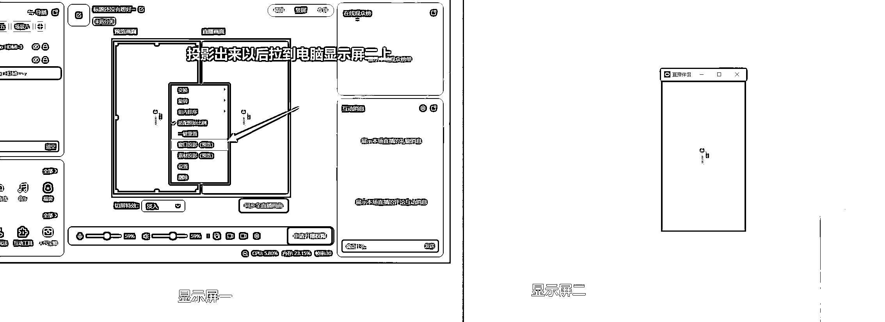
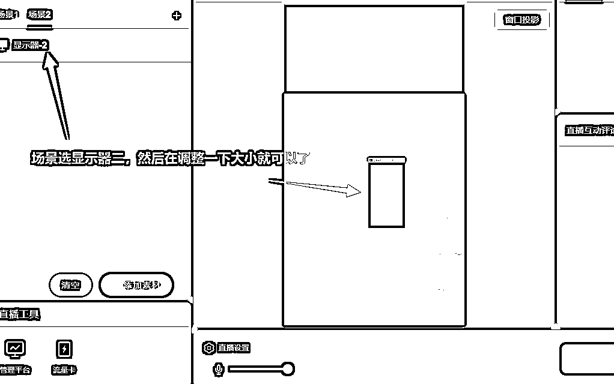
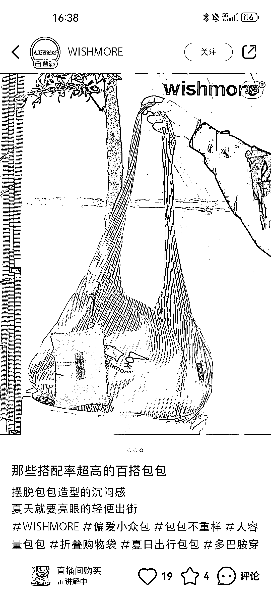
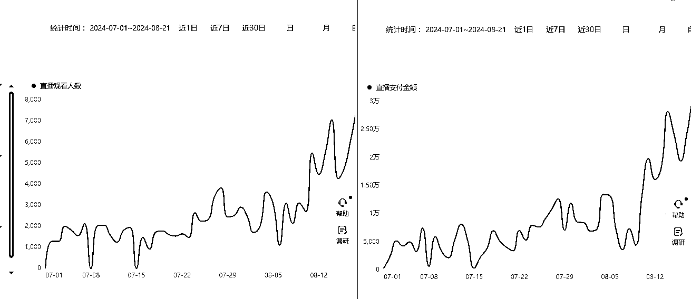
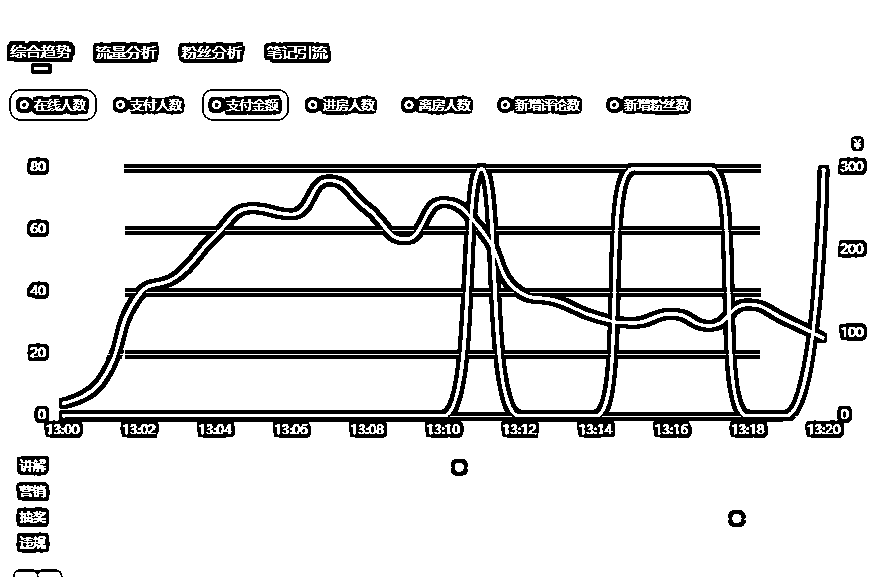

# 小红书店播基础搭建到付费推广，实操避坑指南

> 原文：[`www.yuque.com/for_lazy/zhoubao/gnauzexpgvsttz0t`](https://www.yuque.com/for_lazy/zhoubao/gnauzexpgvsttz0t)

## (精华帖)(51 赞)小红书店播基础搭建到付费推广，实操避坑指南

作者： 李谢谢

日期：2024-10-29

大家好，我是李谢谢，生财航海家，目前在做品牌自播

今年 6 月份的时候和朋友交流，他告诉我小红书/抖音双开，他们小红书跑的比抖音还好，退货也低的多，最近准备把小红书拉出来单独跑，听了以后我很心动，一方面觉得自己这边也能搞，一方面觉得可能忽略了小红书平台直播的机会

小红书我们是去年 11 月份开始搞的，但是一直做的笔记带货和对接达人，直播板块没有尝试，当时觉得有些麻烦，而且总觉得小红书能有多少量？

这次聊完以后，也算有些机缘巧合就开始搞了，截止到现在大概三个多月，一个很直观的感受就是相比抖音来说真的轻松太多了

而且底层逻辑差不多，做过抖音直播的人上手小红书直播非常容易

现在看来真的有些后悔没有早点搞，浪费了很多流量，并且直播作为整个电商链路转化最高的渠道可以带来很多增量

我是卖品牌高客单女鞋的，不同的品类玩法可能都不一样

本文会从直播间搭建到乘风付费投流都包含，希望能对圈友们有帮助

# **一. 直播间基础设备**

灯光：主光+辅光都是 Amaran 200XS+光罩（一大一小），环境灯球形灯金贝 EF160+Amaran
100dS，一个环形补光灯（灯光非常重要，可以找专业的上门调整，或者找自己的摄影调整，以后维持这个参数就好了）

相机：主机位相机索尼 A7M3+适马 24-70

大屏：小米电视

麦克风：罗德无线一拖二（真的好用，很推荐）

采集卡：圆钢 GC553

直播间背景：自装修（根据售卖风格来找专业的设计装修就行）

整个直播间搭配下来是符合这个产品，让人感觉好看就行，尤其在小红书这么一个需要审美的平台

直播设备这个东西丰俭由人吧，但是作为这种视觉交流，不同的呈现度肯定最后转化是不同的

尤其是一些卖衣服的商家肯定是需要更好的细节呈现，还有就是直播是做减法，这些钱花了以后，转化不好肯定不会觉得画面有问题，前几年直播的时候买了一个海康的那种摄像头，转化不好我总觉得画面呈现有问题

这里要吐槽一下小红书的直播平台，特别难用，美颜一言难尽，而且上传的码率感觉也不够，甚至小红书直播软件第一次下的时候我都找不到在哪里

[`www.xiaohongshu.com/zhibo/robs`](https://www.xiaohongshu.com/zhibo/robs)

针对美颜这个问题，我们本身就是抖音和小红书双开，正好电脑投屏抖音的美颜画面，那如果你能接受小红书的美颜，以及你不需要双开，用小红书本身的直播软件就行

双开步骤如下：

（原理就是小红书采集的是显示屏二的画面，而显示屏二的画面是抖音直播伴侣美颜过的一个窗口）

# **二. 直播间流量来源**

## **2.1 笔记**

进入直播间形式：呼吸灯/购物车

人群属性：A3 人群

笔记渠道进来的人可以理解为抖音千川短视频进来的人非常精准，付费也是以笔记为主

进来的形式上面的呼吸灯和下面的购物车都可以进来，如果你要投买手的笔记都是以购物车为主

但是他又没有抖音千川视频进来的那么精准，因为千川视频可能很多都是强营销垂直视频，笔记的人相对来说还是种草为主，营销为辅，所以进来直播间是需要二次转化的，或者可以理解很多人还没有养成一个消费习惯，他看了以后有想法可能还是会去淘宝买

有很多人在说直播撬动自然流，笔直联动是有双向影响的作用，比如笔记进来的人进入直播间转化以及有数据产生，也会影响到笔记流量的增长，会给笔记持续推流

笔记这个渠道是非常重要的，建议大家在做直播之前先把笔记做好，有流量了在开播

## **2.2 发现**

进入直播间形式：直播卡/呼吸灯

人群属性：A1/A2 人群

 images.zsxq.com/FgTKk_lnzXRgp0GQKunznPUsozqn) images.zsxq.com/Fpi1LxSdM3vrC3qtSAy9GIm1xdHH)

这个流量渠道有个非常重要的核心指标就是**封面图点击率** ，这个指标可以在直播大屏查看

比如我举个例子，如果你的曝光是 10000，但是点击率少的只有 1%，才有 100 个人看，但是如果你的点击率有 4%，一下子多了 300 人看，同样转化是不是相对也会提升很多，这个是换个图就能解决的事情，非常直观，所以一定要注意，PS：（直播间封面不像抖音下播才能改，小红书可以随时在电脑直播助手更改）

但也并不意味着越高越好，比如你一个卖鞋子的直播间，放个美食宠物，吸引来的都不是你想要的人群，在高也是会影响你转化的，进来看一下就走了，还会影响你的标签

并且封面是会有动态封面，即直播间的实时画面会做动态展示，所以需要强调直播间的场景，以及主播的状态和妆造

**测试方案：**

1）.
首先就可以在直播的时候测试，比如不同的直播场次更换不同的封面，下播以后做个数据对比，如果你一开始不知道用什么封面，就用自己爆款笔记的封面肯定不会错，然后一边看同品类优秀直播间，再做优化

2.）
通过付费测试，我在一开始的时候是通过搭直投去测试，但是我发现跑不出去，数据很少，没办法做参考，于是我找了小二咨询这个问题，他给出的答案是小红书非直播平台，用户接受度没有那么高，所以直投难跑一些，后来我就在搭笔记的时候加入不同的直播封面做测试，比如 20 个计划就是 20 个直播封面，然后以一周的数据作对比和更换

## **2.3 直播间上下滑**

进入直播间形式：直接进入直播间

人群属性：A1/A2 人群

正常上下滑刷到你直播间，系统根据直播间数据推送，自然流主要渠道之一，这个渠道相对来说人群挺泛的，没有那么好转化，比如一个人漫不经心的在刷直播间，然后突然刷到你的，她可能也不知道你直播间是做什么的，也没有什么铺垫，就突如其来刷到了，整个人货场的感觉吸引她留下来

在一开始的时候会发现这个渠道是非常泛的，然后在通过你直播间做了数据有了转化以后，接下来的推送会相对精准一些，但是比较考验你的主播能力和人货场

## **2.4 群聊**

进入直播间形式：群内推送

人群属性：A4/A5 人群

首先我觉得群聊是一个源头流量上限很低的事情，需要自己长期经营的，算是一个附加值

很多人群聊玩的很好，特别重视笔直群联动，但是我们客单价比较高，我总觉得即便人再多，3.400 的鞋子也不能天天买，所以我不太重视这一块，拉新方面重视的比较多，这里也自己反思一下

群聊玩法也很多，比如很多人在购买的时候有些犹豫担心售后，但是他进群了发现售后很好，会促进转化

还可以做些群内购，进群发卷，也可以做群内测些新款，做直播预告等等，并且进群本身就是做数据的行为

# **三. 直播间的三种玩法**

小红书直播的逻辑还是赛马机制

如何做好赛马？当然是做好数据才能突破层级

如何做好数据？当然离不开憋单的玩法

很多小红书直播商家对憋单特别抵触，觉得憋单就是骗客户就是套路客户，觉得小红书是种草平台，和别的不一样，以及平台为保证用户体验性不允许这个玩法，还有客户不吃这一套，不像抖音营销强等等

说的其实都没错，但是赛马机制的核心就是数据要比别人好才能拿流量，如果大多数直播商家不通过套路就能获得很好的数据，赛过别人当然没毛病，但其实很多人都做不到

还有你说你是个买手，你非常的有意思，粉丝很有粘性你说你可以不需要考虑这个问题，你就主打真诚性价，这个当然可以

但其实你发现很多人也会用到秒杀，也是一个塑品+开价的玩法，只是憋单的工具变了，换汤不换药，没办法机制就在这里

据我所知，9 月份有人靠憋单起号，中秋节那天一天卖了 37 万，以及抖音播法的商家其实都卖的很好

**当然这些也都不绝对，适合自己的才是最好的**

**3.1 直播间自然流玩法**

直播间纯自然流玩法，其实分为两个

第一个是你内容强，你笔记很爆，像很多买手一样自己的内容很好，完全可以依靠笔记带来的流量做转化

这种其实是很多新手商家在做的，可能我笔记爆了，然后我随便找个人直播时长拉满，做个在线客服，但是这种不长久，你无法确保你每天都那么爆，以及主播话术还有直播节奏也没有逻辑性，会浪费很多流量，还有很多直播时间不固定，以及人员不固定，会影响后续推流，最后越做越差，就不了了之

第二个就是你直播间主播以及货品很强，你可以通过主播在直播间做的数据带动直播间增长，甚至有的商家你看他笔记随便发，就靠主播拉，还有双开的基本上小红书都不怎么问，都很多人

这种需要主播很强，如果你主播/货品很有优势，完全可以做这种，憋单这个东西演不好像小丑，所以需要强主播

憋单逻辑可以 10 分钟憋单+5 分钟开价，正常抖音憋单逻辑，每场做好数据递增就行

这里需要用到秒杀这个工具，但是我发现个弊端，所以这里我去掉了秒杀工具改为憋单就下架，因为秒杀他有固定的时效，到了就恢复原价，但是有时候这里还有客户没下完单，可能会延长，所以秒杀不够灵活，如果自己上下架就非常灵活好用，主播也可以看流速来进行憋单

至于秒杀带来的关注数据，可以从主播话术加入关注引导来补充这一短板

纯自然流玩法都比较极端，以及对你的主播和货盘要求都特别高，都不是特别推荐普通玩家尝试，但是利润是可观的，我觉得这个玩法最大的弊端就是不够稳定，无论是主播还是笔记都无法长久的稳定下去，所以我觉得可以在这个基础上加入付费让他稳定一些，操作也没有那么高

**3.2 直播间纯付费玩法**

算清投产比，直接付费拉满就是干就好了，但是本质上也是需要你笔记/视频做的好的，因为你内容做的不好你没东西投，或者换个说法，你内容做的不好你也投不动

纯付费的节奏是不需要憋单的，做好塑品就可以，因为每时每刻都是在花钱的，做好塑品+促单就行

那有些商家觉得我真的不知道怎么做内容，没事我可以给你个新方案

买手+直播联动

小红书通过蒲公英合作的单子都会在你的笔记（内容合作笔记）可以进行投放

如果你的内容做的不好，其实没关系，很多商家觉得很难受，我产品做的很好，但不会做内容还卖不出去，那有的人天生就是会做内容，比如买手，可以合作了以后，后续你用他的内容投放进直播间

买手的内容质量很高，付费大概率投产也不会特别差，反正我这边买手的内容带来的投产是比我们自己正常产出要高的，当然合作以及测试的费用/买手带来的人群/会不会歪楼等等，这些都是有利有弊的，他们带来的流量如果你大规模去铺，我建议你有个淘宝店做好相应的引导比较好，这样流量不会浪费

**3.3 直播间微付费玩法**

纯自然和纯付费觉得都有问题，有没有什么玩法可以又稳定又有利润呢？

做纯自然流需要直投，但是跑的量真的特别特别少，也可能这个路线我们自己没有跑通

微付费并不代表可以不做数据，甚至做纯付费也不代表你就可以不做了，同样的逻辑如果你有更多的数据，计划也会更好跑一些，给你笔记流量反馈也会更强一些

微付费我建议这个节奏是比如半小时，10 分钟憋单然后开 20 分钟，憋单做数据，20 分钟做成交给自然流空间，（这个自然流空间其实很多商家品很多，笔记也会发很多，可能不是主推款也有笔记爆的，比如你主推款有 10 个笔记爆，别的款也有 4.5 个笔记爆，就有很多人来直播间问，如果你做单爆品纯憋单模式，会放弃掉很多客户，因为有的款你没有办法展示，所以给个自然流空间）

这样的话既能做数据，也没有那么极端，还是以直播间自然流和笔记自然流为主，做点付费补成交就好了

微付费这个路线我觉得是最适合所有人的，需要你多方面发展

付费占比多了，直播间就没有自然流了，所以需要控一下付费跑量

付费会不会压制自然流，我觉得是相对的，本质上还是自然流数据做的不到位，以及你直播间只有付费做转化，这个玩法的核心还是在于笔记，优点适合主播不强的商家，缺点利润相对较低

这三种玩法其实说到现在，你会发现他都有利有弊，利弊其实还是根据自己的情况来进行决定，直播是一个整体，如果你某一方面跟不上也实在没有办法解决，那就提高另外的方面补齐短板，做数据这件事每个玩法都要去做，数据好坏决定直播间有没有人，而转化决定人群精不精准

买手直播间大多数都是好好塑品，聊天式直播，** *但其实憋单的直播间我觉得流量利用效率是大于他们的*** ，从平台而言允许双开，是更希望这种直播间加快商业化

平台主张商家有个主理人，通过主理人为媒介拉进客户和商家之间的距离，我觉得可以让主播作为主理人参与进来日常笔记拍摄，这样的话转化会提高很多，会更有信任感，而且笔记会更容易爆

如果你不知道主播话术怎么写，就去抖音看你这个行业的前几名，1：1 抄话术就行，他们大多数人的话术都是一样的，再根据自己的品做做修改，先抄再超根本没必要，抖音能活到这个赛季的人强的可怕

# **四. 直播间如何从 0-1**

## **4.1 直播时长**

我很推荐大家把直播时长拉起来，但是如果你几个小时才出一单，而且没什么推流，那我不建议你拉

如果你可以做到稳定出单，真的要把时长拉起来，因为主播数据做不好，拉时长是最轻松做数据的机会，而且平台也有很多活动，比如流量卡，都可以通过拉时长获得

前期如果不知道什么时候开播，可以上午下午晚上都测试一下流量，测试好了以后就需要做到**固定时间开播** ，**固定直播时长** ，然后慢慢的优化直播内容，**把每场直播****数据做递增** ，肯定会做起来的

## **4.2 直播开播**

开播这波流量究竟要不要接，能接肯定要接的，接不住也没有关系，但是一定要把数据做到位，即使没有转化也要做到数据

初始直播间进来的都是泛流量，也是平台根据大致画像做的推送，如果你发过笔记的可能都还好，如果你没有爆文纯直播间起号的就更泛了，为了看什么样的流量适合这个直播间而继续推送，或者值不值得下一阶段去做推送，所以这个阶段其实转化本身就很困难，更需要做的是浅层数据，比如停留互动转化，当然你转化了以后会更有利于打标签去做推送，成交模型决定推流模型，而做数据会使你直播间有人

所以开播的话我建议去设计个开播话术做数据，比如开播憋 10 分钟配合开播这个流速，开播有成交是非常利于计划跑动和后续流量推送，所以开播一定要重视

如果你是纯付费玩家，你会发现后续开播就没有开播流了，如果你是自然流玩家，做好每场数据递增，开播流是会越来越多的

## **4.3 笔直人群一致**

我举个例子，也是我现在面临的一个问题分享给大家，就是我的笔记一直以来吸引的都是 18-24 这个人群，后来我直播间开播推送也是这个人群，但是在面临我的高客单的时候有个显著的问题就是转化不够，因为没有那么强的消费力，所以这个时候就很难洗了

笔记不要在起号的时候做一些泛流，尽量垂直一些，先想好在去做，真的后期会少很多麻烦

这里分享一个原理，叫做代偿原理

这个意思是本来我希望练二头肌，但是二头肌没力举不起来，我也没有循序渐进，用了斜方肌的力量把他举起来了，这个就和做流量很类似

你搞笔记你觉得有些花里胡哨的很猛做流量很厉害，但是最后吸引的人群并不是你想要的二头肌，表面上看举起来了，做起来了，但是实际都是代偿，最后的结果肯定是不同的，所以笔记前期我觉得是需要垂直的

# **五. 乘风付费搭建**

很多时候免费的才是最贵的，而且免费是不稳定的，你也没有办法确保你天天笔记都能爆对吧，但是你能确保天天都可以付费，这样每天的营业额都会稳定下来

但是**如果你直播基础转化都没有走通，我不建议你付费，付的越多亏的越多** ，举个例子：你主播话术都不熟悉，你上来就搭计划给她跑，肯定跑不通，这个时候你是找主播的问题还是找付费的问题？

还有很多人把所有希望都寄托于付费，这个也是不现实的，**付费本身是锦上添花的作用而不是雪中送炭**

乘风我实操了一个月，因为还要搞抖音，有时候用完千川在用乘风真的不习惯，落差很强，抖音看很多人都在说乘风很好，我有些不一样的实操感受分享

**5.1 流程**

首先就是相比于聚光搭建流程简化了，我觉得这点很好，感觉聚光很多流程太繁琐了，几个页面跳转效率真的很低，简化一个页面会好用很多，而且聚光在关联商品还需要关联具体的鞋子码数，这个我不太能看懂

**5.2 投产降低/空跑**

乘风是商业化进程当中很重要的一个点，很多人再说我用了乘风以后投产降低了，我觉得这是很正常的现象

第一个我觉得还是消费习惯以及消费人群的问题，很多消费者的习惯还是小红书先看然后去淘宝买，站内看站内买的这个习惯，消费者其实还是需要一个过程才能培养，我觉得这是一轮一轮洗的，先吸引很多商家，给与很多政策扶持，首先先把基建搭好，现在这个阶段其实很多赛道都是蓝海是可以尝试的

第二个就是乘风毕竟是一个新的产品，这个产品我觉得本身就是有很多不完善的地方，比如空跑很严重，目前我觉得他更像采集数据（需要商家去投需要商家去）不断完善算法的过程，聚光本身就是一个较成熟的产品，算法相对完善一些更稳定一些，但是我觉得聚光并没有电商化的感觉，更像是一个卖流量的产品，而乘风就像是一个电商化的产品，帮助小红书完成**站内闭环** 转化很重要的一环节

**5.3 笔记**

我看了很多人说用了乘风投产降低，我建议可以搭定向人群试下，其实我感觉差别不是特别大，就是能跑的笔记还是都能跑，不能跑的笔记还是跑不起来，核心是在笔记在自己内容，在产品，付费就是锦上添花而非雪中送炭，个人感觉视频会比笔记好跑一些，视频的生命周期也要短一些

**5.4 操作流程**

还有就是你在投放过程当中，付费撬动自然，本质是直播间做了数据带动自然流量，而且种草化平台如果客单价较高是有决策周期的，所以你可以看全店投产来决定计划调整，投放过程当中，测试出来的主计划建议持续跑可以带动自然流增长，并且主计划不要调整，给预算跑就好，当然一切都要合理范围

**如果你不知道你的核心人群是什么，你可以先托管去卖，用结果倒推核心人群，乘风-数据-人群分析-
人群洞察，有了数据以后这里可以看到核心人群，可以建个人群包后续用来测素材都是很好用的**

**5.5 时间**

高客单种草到收割的过程他其实是一个长周期的，尤其是小红书还是作为一个种草平台，不太能以当天的数据 ROI 作为标准，尤其你会发现比如今晚是一个 roi，然后第二天早上过来看 roi 又涨了一些，可能晚上又有人在下播以后或者过几天下单，还是会算在里面的，可以把时间周期拉长，当然这是高客单

付费计划启动慢，探索时间长，难掉头，需要拉长时间周期才能去做判断

**5.6 重视搜索**

小红书商业大会有段资料，从 2023 年初到 2024 年初，小红书的日均搜索量上涨了 60%以上。每月寻求购买建议用户数达 1.2 亿，新用户中有 42%在首次使用小红书时就会使用搜索功能，81%的用户在想要了解产品或服务时，会选择小红书作为首选搜索平台，**而月活用户中这一比例高达 70%，主动搜索占比 88%。**

**首先搜索本身意味着客户需求精准**

其次从这组数据我们可以看到，小红书用户是有很高的**搜索心智** 的，**以及小红书平台搜索规模是很大的**

这点小红书和抖音以及别的平台是不一样的，而**乘风是唯一一个可以搜索直投** ，千帆和聚光都不行

搜索可以先做自己的品类词，稳步跑量以后拓宽一些场景词等等，后期做笔搜联动，跑的好的搜索词可以用来当笔记内容，其次你需要注意，你投的搜索词是需要和笔记有关联的，否则是会筛选下来

**5.7 衰退周期**

笔记的衰退周期是很长的，计划周期你在用千帆和聚光衰退周期大概 7 天左右，但是乘风很快，乘风的衰退周期大概 3 天左右就需要进行翻新了

# **六. 写在最后**

从平台看，小红书平台目前处于商业化进程当中，真的有很多的机会是值得尝试的

至少在直播这个板块我发现是相对容易，很多玩家这个阶段都在摸索怎么做，很适合新手入场

平台有很多机会是一方面，但我觉得更多被人忽视的是他的搜索流量，**遇事不决小红书** ，这个平台搜索真的很重要，是远超其他平台的，可以从笔记内容到付费投放多做布局

从个人看，大多数商家在一开始的时候，可能因为笔记爆了，于是你随便就开始了，想着这波流量不能浪费，第一波卖了些钱，但是后续越来越不稳定，你开始尝试付费介入，付费介入了以后你发现利润不够，于是你开始想着自然流，但又发现主播能力不够，最后兜了一圈回来你发现还是要做好笔记，但这个时候笔记已经做不起来了，尤其在经历了那么多对自己心力的耗费也是巨大的

直播是一个整体，从主播到内容到货品等等每个环节都很重要，这个是在一开始就需要认清的事情，不是你一定要憋单一定要付费，或者怎么样，任何玩法都需要和自身去做匹配

比如你利润极低，你非要去做付费

比如你利润很高，你完全没有必要去磕自然流

比如有的直播间玩过款很好，但是你适合单爆品

比如你做内容很厉害，也可以像买手一样随心所欲去播等等..

适合自己的才是最好的

**欢迎交流**

# **祝各位双 11 大卖，以上**

* * *

评论区：

更绪 : 绝对是干货，看到前面就知道了，和我目前测下来一样的感觉。

涿鹿中原 : 牛逼

七天@生财有术 : 整体分享很真诚，解答了绝大多数关于小红书直播的实操问题。后续也可以持续更新一些平台新规和可以借鉴的经验！

头狼 : 能做个飞书文档不，这样飞书里有记录方便查看[流泪]怕时间久了找不到了

李谢谢 : OK，没问题

李谢谢 : 下次一定

李谢谢 : 多多交流～

文俊✪ : 干货满满[强]