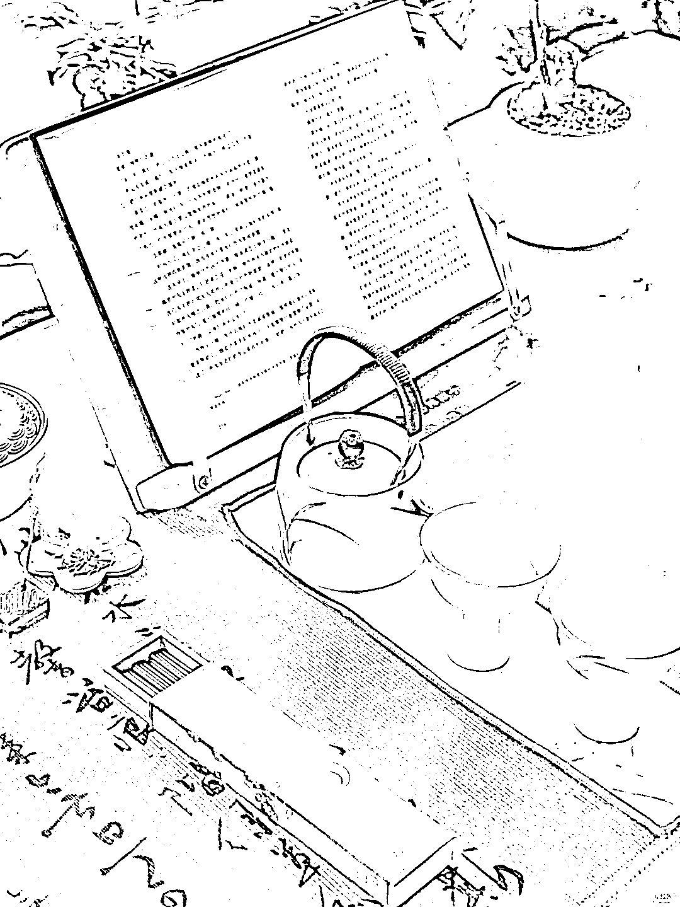

# 小红书 3 年图文博主，涨粉 7.3 万，一些经验分享

> 原文：[`www.yuque.com/for_lazy/zhoubao/uzy9of89dymgefq1`](https://www.yuque.com/for_lazy/zhoubao/uzy9of89dymgefq1)

## (21 赞)小红书 3 年图文博主，涨粉 7.3 万，一些经验分享

作者： 嘿柠檬

日期：2024-10-28

很庆幸，三年前选择开始踏上图文博主这条路，如今获益匪浅。涨粉 7.3 万，月入 3W+，并且实现了赚钱带娃两不误的状态。

在此也顺便回答被大家问到最多的问题，短视频时代下，图文博主到底还有没有出路以及出路在哪。

答案是有出路，且出路就在你的身边。

◾️要输出，先输入

做博主，最低标准是保持稳定的更新频率，要输出，就要有不间断的输入。

我做博主初期，以读书为主，但实际上阅读的储存量并不是很多，刚好那段时间在家陪女儿没有上班，索性就一边读一边更新笔记。书籍分享+阅读方法/心得+热点话题讨论，什么能写就去写什么，保持稳定更新，让心理上先接受“我要做博主”这件事情。

所以，新手做图文博主，无论做不做读书赛道，阅读都是必不可少的技能，随便抓起一本书来读，总能获取有用的认知信息。而这些，都足以成为你笔记中的素材。

◾️文笔不好能做吗？

余华说过：“我对语言只有一个要求——准确。一个优秀的作家，应该像地主压迫自己的长工一样，使语言发挥出最大的能量。鲁迅就是这样的作家，他的语言像核能一样，体积很小，可是能量无穷。作家的语言千万不能成为一堆煤，即便堆得像山一样，能量仍然有限。”

重要的不是语言是否优美，而是主题是否清晰明了，很多新手博主写笔记时营造出一种岁月静好的模样，运用许多华丽的辞藻堆积在一起，殊不知整篇下来看不到任何重点，完全是一场徒劳的自我感动。

◾️从生活中来，到写作里去

素材取决于生活，要想做出精致充实的内容，就要拥有好好生活的勇气。日子可以平淡，朴素，但不能潦草。可以岁月静好，但不能毫无波澜。

去读去写，去做一切可以充实自我的事情。

有趣的人，才会写出有趣的内容。

最后，做博主是一项长期事业，有灵感了就去写，没有灵感的时候，也请给自己喘息的机会。

秋日午后，点一支香，满屋桂花香。

读书，喝茶，小憩，享受不用外出上班的松弛感。

* * *

评论区：

程序员赤小豆 : 可以详细讲一下怎么涨粉的嘛