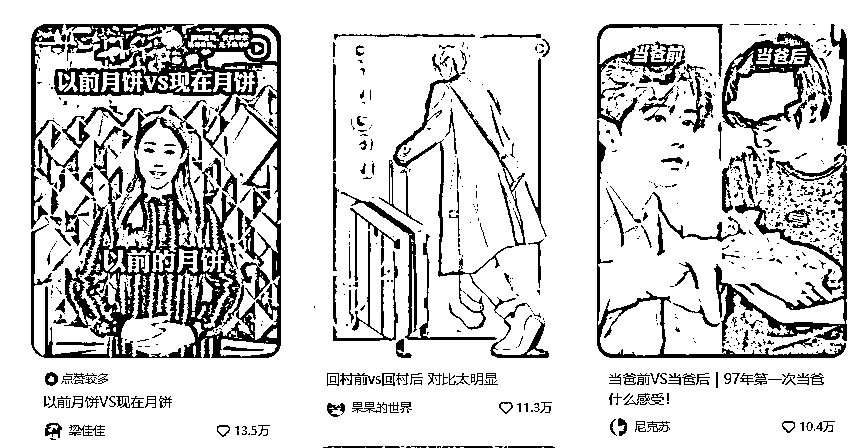

# 做小红书不会做选题？手把手带你做出第一篇爆款。

> 原文：[`www.yuque.com/for_lazy/zhoubao/ohzeupo9ftp55gcq`](https://www.yuque.com/for_lazy/zhoubao/ohzeupo9ftp55gcq)

## (25 赞)做小红书不会做选题？手把手带你做出第一篇爆款。

作者： 颜乐乐

日期：2024-11-01

生财伙伴大家好呀，我是颜乐乐，今年是我在生财的第三年。这三年我从身在职场，在公司负责媒体运营，到自己副业做小红书，到现在全职做小红书相关的企业服务，今年还注册了公司，开始了自己的一人公司新阶段。

感谢在生财有术参加的数十次航海，哈哈，从提升技能到商业，每一步都没有踩太多坑。

今晚给大家分享的是我作为十年营销人，加上自己和学员起了多个万粉号后，做了上百篇小爆到大爆的爆款，总结的爆款选题方法。很多伙伴是想做自媒体，并且想做好自媒体的，选好赛道以后，最容易卡在选题上。

一个账号，所有的选题都会有他自己的价值，要么能带流量，要么能带来转化，要么有人设加持。

今天主要讲的是围绕流量来讲，想要流量就要爆款。因为第一篇爆款，意味着信心。不管这篇有没有变现，都会成为以后走向自媒体这条路的基石。

## （一）爆款内容的底层逻辑

无论你是做哪个平台，做图文还是视频，其实底层逻辑是不变的，就是提供价值。

爆款内容，既要用户喜欢，又要平台喜欢，想要做出爆款，一定是平台，你，用户之间的三赢。

平台只要你不违规，不发资质限制的内容，不聊时政基本是没问题的。

那最大的难点是卡在用户身上。

为什么发日常没人看？——你又不是明星，你的事关我屁事。

为什么发得很干货，播放量又很低？——太干了，普通人听不懂，受众窄

于用户而言，一条内容如果想要我多看一眼，给他个赞或者收藏，评论。你肯定得对我有点什么用。

可以哄我开心，也可以让我觉得以后我迟早用得上。这就是提供价值。

**如果你想要提供价值，逃不过**

1.  情绪价值：认同和共鸣

2.  干货价值：信息密度，答疑解惑

情绪价值，说了很多次，我相信你们都听过了，简单来说，就是嘴替。

你说了我想说的话

你做了我想做的事

**情绪价值版块，本身有一些很火的格式**

比如：

生娃前 VS 生娃后

考证前 VS 考证后

找工作前 VS 找工作后

这些放在哪个赛道，都是有爆款基因的。

**干货价值的内容，主打一个信息密度和认知提升。**

比如做文旅的：你写攻略，写清单，写路线

比如母婴赛道：去发 0-12 月早教计划，英语启蒙磨耳机，国学启蒙音频

 images.zsxq.com/FpC4DZJXdmSSsGKNlv7XWkCfEBrz) images.zsxq.com/FlQfHftaUqnVZ0fD1k9BNTNdEb9a)

看到这，你大概知道了吧，爆款，要么情绪，要么实用，一定要占一条~接下来，我们进入第二部分的内容

## （二）爆款内容必备三要素

知道什么类似的内容会爆，那你知道，想要爆，也要有一些条件。

我们讲，觉得他能爆，真的不是拍脑袋。大多数内容能不能火，在发之前就决定了。不是先战而求胜，而是先胜而求战，做内容，是你的内容你有把握了，再投入市场，不是未经策划，草草拍了等运气爆发。

爆款，就是流量，做流量的内容，是所有账号起号阶段要去搞的。因为起号如果你没有爆款，数据是起不来的~一直在 100 个小眼睛徘徊，人都不想努力了。缺失信心是自媒体放弃最大的原因。

一般新人上来，最多更新 20 条，必须是要出小爆的。小爆不需要大，100 个赞以上的内容，因为你需要正反馈，也需要给账号上标签。

**什么样的内容天生会成为爆款**

1、赛道内受众面广

2、话题有争议或矛盾

3、近期热点加持

### 1、赛道内受众面广

受众面广，就是你说的东西，很多人都能听懂。如果你要做流量，就一定要做大家都知道的东西。比如：保险就没有社保知名度大，VIVO 就没有 IPHONE 更有知名度。发之前搜一下就知道了。

为什么强调赛道内，因为你不能说我一个卖家具的，去聊情感。

我可以聊白敬亭的家，但不谈白敬亭的恋爱史

职场赛道必聊 BAT 大厂 OFFER，大厂工作方法，大厂简历，大厂面试。

因为知道的人真的多呀~总不能上来讲你家门口对面的公司吧，看起来很牛逼但大家都不知所云啊！这样点击率肯定没保障。

比如下面这个，他就一定要说苹果，而不是说牛油果。为什么呢？因为苹果知名度在这里，家家都有，人人都能吃，不像有的水果还挑体质。

### 2、话题有争议或矛盾

反常识，有好奇，有争议所以想点进去。解决的是什么？点击率的问题。

所以新人上来发内容，可以反驳，很多自媒体起号的时候都会先去打破一些常识。

饿是不会瘦的，减脂不靠运动。

升职不靠能力，保险买了也不会赔的。

表达一定要干脆，不要自己也犹犹豫豫，拖泥带水，你越干脆，观众的情绪就越丰富。

比如给下属写周报。

还有下面这种，也是很有争议的选题。

荣誉证 VS 垃圾

以为很贵 其实百元

包括为什么我们很多人说去装修，减肥，就要像做项目一样，先定一个不可能的目标。要么预算很大，要么预算很少。

比如 50 平的房子，花了 100 万装修，长什么样？

挑战 20 万装完 200 平大平层

挑战 3 个月减掉 50 斤

10 元版减脂晚餐

路过的狗看了不都得瞧一眼先~

### 3、近期热点加持

我们来对比下，有没有热点加持，差多少。

热点包括：明星，影视剧，网红等。

热点就是风口，风口上的猪都能飞，更何况是一篇内容呢？但是追热点要能结合自己的赛道。我举个例子，之前年初的时候贾玲很火，减肥了嘛，然后很多人跟，但有的人看别人写减肥，他也写，其实就不合适。如果是卖衣服的，可以讲贾玲穿搭。

最近很火的《乔妍的心事》赵丽颖的热度也很高，可以去盘他电影里的穿搭呀。如果你是做减肥或者变美的，也可以去扒她以前的照片。如果是做女性成长的，还可以去讲她逆袭的成长故事。

怎么追热点这个，我之前专门写过一篇文章，宝们可以直接打开看看哈。

[`articles.zsxq.com/id_gztf8uqmgis5.html`](https://articles.zsxq.com/id_gztf8uqmgis5.html)

你知道什么是爆款了，也知道爆款得有什么能量加持~那下一步，我们就来看看，如果我来做，我会怎么做爆款内容。

## （三）如何策划出爆款选题

### **1、找到值得创作的选题**

判断了什么是好爆款，那我们就要开始建选题库了，目前我们的搭建不使用第三方，就小红书的 APP 就够用了，打开小红书 APP 直接搜索【关键词】下面以减肥举例：

在搜索的时候，我们可以直接筛选出近一周，并按最多点赞排序，就可以找到近期的爆款了。根本不需要使用第三方软件 。

** *然后我们把这些选题，怎么整理呢？***

（1）微信面对面建群，转发过去

（2）再抽时间整理到表格里，用以记录后续是否发布

收集完这些爆款后，我们会从以下 2 个元素来筛选是否值得一做。

1、是否反复爆过？他不止一个人火过，一定是好几个人都火过，且有一些账号还挺小的。

2、话题受众人群怎么样？

这里要重点讲一下 标题不等于选题，我为什么要这里把选题单独拿出来 就是因为 很多的时候 用户的标题是为了点击，但选题是内容能否发生互动的关键。

基于这个选题我们再去搜 就知道是否值钱一发了。

我们要选人群相对更大的，我举个例子

减肥食谱 VS 减肥计划

前者的互动量远大于后者，这个就是我们前面说的爆款要素里面的，受众广，要优先选这种。

策划选题要花的时间必须比其他的环节要更多，因为选题选对了，后面的一系列动作都是有效的。一开始就没选到正确的选题，后面封面做得再好看，都是徒劳。

### 2、**收集爆款封面和标题的关键词**

爆款关键词（封面+标题）

通过这些爆款封面的词，我们就可以比较好写标题了。

封面放什么文字，也有想法了吧？

如：

B 肥已减，瘦了 20 斤后我的长相变化。

一句胖子！我闷声减肥一周瘦了 5 斤！

已瘦 30 斤，穷鬼版暴瘦食谱大公开！

这里注意的是，我们尽量要把爆款的元素：争议和热点放进去。

如：

都是骗人的，减肥不要运动。

模仿赵丽颖，闷声减肥我做到了！

我靠躺床上，瘦了 30 斤！

自制 10 元减脂午餐，已瘦 20 斤！

### **3、选题被做过了，我怎么出圈**

一个选题，别人都写过了，凭什么我能与他不同。

1.  我的结构比他们更全，

2.  我的干货比他们更多

3.  人群更清晰

秋断食，这个话题很火。

**我们可以明确人群：**

小基数女生的秋断食，

广东女生减肥，一定要秋断食。

**还可以增加信息量：**

他的是 28 天食谱，我给的是 49 天食谱。

人无我有：他的笔记没有人群 我加上了，

人有我优：我的食谱更落地，除了吃还加上了睡眠指导

除了各赛道各自的选题，其实自媒体这个行业 本身就有一些 本来就会火的选题

### **4、通用爆款选题**

**爆款模版 1：对比选题（引发共鸣）**

生娃前 VS 生娃后

找到工作前 VS 找到工作后

装修前老公说 VS 装修后老公说

结婚前 VS 结婚后

传统宠女儿 VS 江浙沪宠女儿

爸爸带娃 VS 妈妈带娃

**爆款模版 2：贵到得不到（引发好奇）**

深圳最贵的 5 个小区

世界最贵的大学

深圳最贵的小学

这种也是各个赛道都能做的

比如做家装装修的 可以说一下 我在深圳见过最贵的 10 套房！

做珠宝的 可以盘一下 世界最贵的 10 个宝石

**爆款模版 3：xxx 钱的东西是什么样的。（引发好奇）**

年薪 100 万的人都在做什么工作？——职场

住别墅的人都是做什么生意的？——私宅设计

采访欧洲的 100 个华人留子 —— 做留学规划的

深圳 10 万一个月的房子长啥样？

以上的这些模版，可以套用到任何赛道。**举一反三，灵活变通，才能** 达到**万物皆可为我所用** 的状态。

听到这里，你对做爆款选题，有没有一个比较清晰的了解啦？笔记里面除了爆款，还有专业内容和人设内容，这些我下次再来讲！

看完以后是不是手痒痒，觉得想动手了，快去试试看吧！

做自媒体，不要发一两篇就放弃，只要你用对方法持续更新，一定会出现第一篇爆款！加油呀！

我的过往生财贴子：

[《奥运热点又来了？发小红书怎么追热点更有效！一个公式送给你！》](https://articles.zsxq.com/id_gztf8uqmgis5.html)

[《7 步写出有吸引力的客户案例故事》](https://wx.zsxq.com/group/1824528822/topic/2858255511184521)

[《小红书上半年搜索报告，10 大趋势个个都藏着商机！》](https://articles.zsxq.com/id_ug4flw7npn3w.html)

[辞职这一年，月收入从 2000 到 4 万，我经历了什么？| 自由职业 1 周年复盘](https://t.zsxq.com/J1osT)

[想做小红书获客，先学写「自我介绍」笔记，转化率翻 3 倍！](https://t.zsxq.com/j615e)

[《离职后转型做小红书个体服务商，半年变现 15 万，我是怎么跑通的？》](https://t.zsxq.com/Wkd0N)

[《6 个月发了 1000 条朋友圈变现 15W，总结一下我的经验。》](https://t.zsxq.com/oXwEq)

[《素人如何从 0-1 做一个【我的十年】视频》](https://t.zsxq.com/19qH6Qp6U)

* * *

评论区：

坤坤 : 干货满满！一键三连[调皮]

颜乐乐 : 哇 谢谢圈友，祝你天天 99+

头狼 : 能弄到飞书文档不[流泪]不然下次要找又找不到了