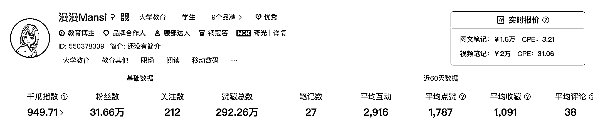
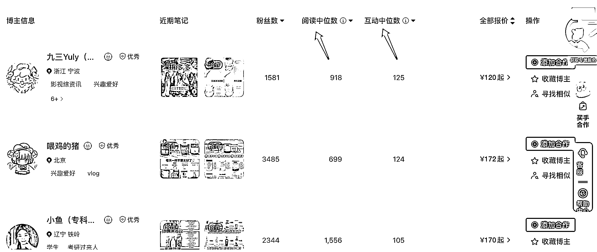
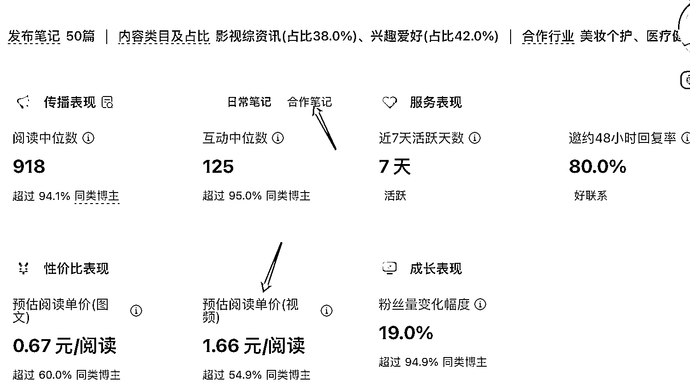

# 双十一小红书接广策略

> 原文：[`www.yuque.com/for_lazy/zhoubao/vvsakwkxeryzugkc`](https://www.yuque.com/for_lazy/zhoubao/vvsakwkxeryzugkc)

## (18 赞)双十一小红书接广策略

作者： 漫漫 mansi

日期：2024-10-28

hi 大家好，我是漫漫，最近双十一来临，我后台商单几乎就是每隔一天一个报备合作邀请。今天借着双十一分享一下关于自媒体平台接广告的策略。从小白会遇到的基础问题到进阶的吸引合作。

双十一来临，是广告变现的好时机，大家最近可以多发些内容吸引品牌来投放广告～

## 一、账号什么时候可以接广告

什么时候都可以接广告，看你自己去衡量，有的人几千粉就接广告，有的人几万粉都不愿意借广告，就看你怎么衡量你内心对广告的这个追求和别的东西。接广告对粉丝粘性其实没有太多的影响，现在大家都很理解博主接广告要吃饭这个事实。

## 二、怎么接到品牌的广告投放邀请？

如果你数据好，有过广告相关的产品的露出，很多品牌会主动联系你。因为品牌找博主投放广告是通过搜索和他的品牌产品的关键词在找博主。有些 pr 自己的小红书已经被他们训练成了一个找博主的小红书账号，一打开全是可能匹配的博主，所以可能随机看到你的内容了就点进去，发现你内容还不错，就记住了。

所以，分析同类博主，可能是品牌在投放，** *想吸引什么 pr 就发什么相关的内容* ：****如果你想接 ipad 上的 app、配套工具的广告，多发一些 ipad 使用技巧。如果你想接运动产品广告，可以多 cue 自己穿的运动衣服和配饰等等。**

## **三、接广告对于账号的影响**

### **（1）如何做到广告不影响账号发展？选择对你的用户真的可能有用的广告+广告的宣传点是解决用户的什么需求。**

比如我的策略一般是用某个产品（广告）教你学习，职场博主就是产品能够提高效率，上班也很轻松、上班后也能学习等等。

现在大家都很聪明，一篇笔记有没有广告，大家基本都能看得出来，区别就在于大家对他的反感程度是高还是低，这个取决于粉丝对你的喜爱度，也取决于这个产品到底好不好用，也取决于你的产品匹不匹配你的赛道、匹不匹配你的粉丝需求。

（个人觉得如果能够匹配你的粉丝需求的话，那这个广告不会那么生硬。有的广告很让人反感，就是他不太符合大部分粉丝的需求罢了，所以博主只能硬塞。而如果能够符合粉丝需求的话，融入博主日常的笔记里面就会显得不那么生硬，其实生硬与否归根结底还是他是否符合粉丝需求。

所有的笔记，只要提到了某个产品，不管他是生硬的，还是很软的，只要是出现某个产品，他就能够是一篇广告，不管他到底是不是，他都能是，然后你结合你自己粉丝的需求，模仿这些笔记露出产品的方式。

如果你的粉丝几乎没有需求，衡量也看你自己。看你是觉得几千块钱重要一点的？还是什么更重要一点？这个只能靠你自己衡量。

### （2）站外广告是和平台对抗，要小心接广

引流到别的网站别的**公众号，别的 App、淘宝、京东** 这种广告，都是小红书的竞争品牌，官方肯定是不愿意的，你把粉丝带走了嘛，就会对你进行限流

所以如果你一定要接的话，就需要打点马赛克，然后还有就是像我们引流课里讲的那样子，用一些花里胡哨的瞒天过海的方法。

有些走了报备但数据都会很差，你可以提前搜索一下别的博主的投放数据，做好预期，知道问题是什么，品牌找你数据反馈的时候不至于没底气。

### （3）有些品牌只在博主特定量级阶段投广告，

有些品牌只对小博主投放。小博主潜力大，在粉丝增长期间流量也是很可观的，而且小博主有时候曝光量更大一点，而且小红书笔记是有长尾效应的，你现在发布笔记之后隔很长时间都可能被搜收到，所以有的品牌方只在某个特定阶段对博主进行投放。

这些品牌我也不太清楚具体都有哪些，只能你们自己去判断。可以搜索这个产品，看看都是哪些量级博主在推广。如果你想接可以接，因为不接以后也接不到了

## **四、怎么判断接广告价格**

### **（1）不同赛道的报价策略要基于****你的粉丝的消费能力和你的数据效果。**

比如学习赛道。1w 粉以下的话可能 700-1000 块钱，10 万粉左右的话就可能在 1500 左右到 2000。还有一点要注意的，是学习赛道涨粉到 20 多万之后，价格就很难再增长了。**但是学习也可以做数码，数码科技产品的话给的价格可以高一点。**

比如美妆和护肤、母婴的话，价格就会高很多。

**⚠️****判断报价的方式：** 你的粉丝的消费能力和你的数据效果。

品牌投放广告是希望用户去买产品，所以你粉丝消费能力强，对品牌来说有好处呀，所以他们乐意给你投放。

品牌投放看 roi，花 1000 投放能曝光 2w 肯定比花 2w 投放 2 万划算，这也就是为什么很多大博主去做小号用小号接单。

### **（2）通过数据网站去判断接广告价格**

01 还是建议去数据网站搜一下，然后看他们大概后台价格是什么样子，自己在他们蒲公英的价格上面适当的减一点。

千瓜要个人认证或者企业认证，大家个人认证就可以了，个人认证的话，就把博主当做一份职业去认证就可以了。

02
在品牌方谈判的过程中去调整，比如你报价之后品牌方一口答应那你的价格就是报低了，如果你报价之后品牌方和你来会砍价，最后看一个大概的数是多少，可能你就值那个市场价。

03 问其他博主（注意礼貌）发个红包啥的

### **（3）根据品牌的反馈调整价格。**

**在谈判心理学角度，对方一口答应，说明你给的价格对他们来说太好接受了。那么下次你遇到新品牌的时候就可以适当调高一点。**

**  **

**如果你已经以低价答应了，那可以加一句：我的价格这么低的话，可不可以给我投个流呀～**

**  **

**或者，我的价格很优惠，以后多多合作呀～**

**  **

### **（4）品牌是如何谈价的。**

**  **

**品牌方通常会将官方给出的报价（粉丝数的十分之一）视为最高上限。**

在实际合作中，**品牌方会根据博主近十篇笔记的互动量、阅读量单价来预估合理的报价。**

蒲公英后台可以看到博主商单笔记的性价比，也就是阅读量单价。阅读量/报价

小红书的小眼睛其实就是阅读量，用户只要点开笔记一次就算一次阅读，比如说这个博主，它的报价是 1000 元一条，他的小眼睛也是 1000，那么这个博主的阅读量单价就是一块钱一次。

所以品牌也会考虑**最低的报价跟产生最高的小眼睛这种组合。**

所以建议：所以大家也会要注意到自己在日常运营笔记的时候，除了点赞收藏的那些互动量以外，也要**添加热门话题，添加小红书的爆款热词来提高自己笔记的小眼睛。** 然后这个是 PR 的同学在找到你的时候，在你看你的报价，发现这个博主的性价比相当之高，就可能会优先选择你这样子的博主。

小红书蒲公英筛选达人页面截图

蒲公英的后台是可以筛选博主们接过的商单的，如果你作为蒲公英后台入驻了蒲公英的博主，你接过商单的广告，品牌方可能也会来看你以往接过的商单单次的小眼睛报价是多少。

小红书蒲公英筛选达人页面截图

有很多的博主的阅读量跟点赞的互动量就相当之低，那他日常的笔记，可能就是纯分享，是发自内心的热爱。产出的那种笔记可能互动量就很高，所以这里也提醒大家，未来如果接广告或者是你已经在接广告了，**你一定要注意广告类型的笔记，它的内容质量你也一定一定要非常认真的对待，然后把点赞收藏阅读量也把它搞上去。这样品牌才会觉得你认真对待广告。后续才找你。**

这里有一个小技巧可以提醒给大家，**当你接的这篇广告数据不太好的时候，你也及时和品牌的 PR 同学反馈一下，尽量把数据做好。反馈是否可以改封面、标题、充薯条等。或者有没有投流预算。因为数据好对大家都好。未来也可能有长期合作的可能性。**

### **（5）如何促进谈成**

你的目的是谈成广告商单的话，就尽量给出合理价格，和真诚的谈判手段。如果不在乎谈成与否，可以拉高价格，觉得赚再接，不赚就不接。

## 五、如何设计广告位，直接让品牌知道你那儿有广告位。

个人认为广告位不是设计出来的，是你生活的一部分。

越纠结场景搭建，你就会越反感自媒体改变你生活习惯的压迫感。

本身不喜欢拍照的人，为了品牌合作，刻意练习拍照，还得不到乐趣；越得不到正反馈，越讨厌拍照，越接不到合作。陷入痛苦循环。

所以，**要植入的不是场景搭建这些“干货技巧”，而是你的生活审美、你的记录习惯。生活品质高的人，家里随便拍一张都是高调性的 plog、vlog**

图片做得好看包括很多，构图、色彩，等等**。先去把你的生活过好、**** *把你的生活场景搭建好*****，然后通过这些通给大家展示我现在的状态和心情。**
一些纯图文做得好看的互联网博主，传递出一种我生活很开心，我很幸福这种状态。大家自动会把他们这种生活状态和 ta 过得好自动练习到一起，会觉得这些物品能让自己也过得这么幸福开心。

而我这种学习类的，我传递出来的是我很努力，我很享受学习这个过程，我在脚踏实地的努力，这种状态。

如果说我要拍出这样的照片，那么我应该要做的事情是，我真的很享受我的生活状态。以及我真的在努力。

之前经常看到很多人做小红书学习博主考不上研，成绩不是很好之类的，他们是为了发这个图片而发这个图片，

但是我希望大家就是我真的是在记录生活，不是为了单纯的发这个东西要发这个东西，而是我在记录我的努力的过程

记录 美好生活，记录 过程和状态

你的生活场景里有广告位，你藏也藏不住。

并不是要围绕得产品去硬夸，而是**我确实使用了这个东西，我确实有感受的。**

**所以建议：想要接广告，平时多在文本中 cue 一些相似产品，并且内容里将产品真的做出对你粉丝有意义的介绍。**

## 六、维系好长期合作关系，未来品牌有需求还会找你，或者你主动找他也会拿到一些单子。

**01 保持联系、好好沟通、及时反馈、正视问题、必要的时候好好沟通**

比如及时反馈，大家都喜欢好沟通的人，你和他们合作的时候如果沟通非常顺利，也及时反馈，尽量的大家一起去把这个数据做的好看，他们也会记得你的。

大家都喜欢好沟通的人，在合作过程中，作为博主你有任何疑问，如果你有任何想了解的没有完全的理解或者是对合作的形式没有理解，或者是哪怕是你这个报价，你自己心里不太舒服，不太满意，多说一句，多再沟通一句，然后把这个问题解开所有的沟通的颗粒度对齐然后再去执行。在具体执行之前，把所有事情都确认好，把该说的话都说完，这点很重要，让大家保持信息的一致。

然后有任何问题随时问出来，我刚刚提问也是说接了上单广告，可能我这条数据就是不好，我很欣赏，就是有的答案就是这篇数据不好，其实也不是你主观意愿想让他不好，那你就。主动去找你就联络一下，说我会发现这篇不好，要不我改改标题，改改封面儿，您看行不行就很简单，就是这样主动一点。多沟通。

**02 如果有需求可以自己偶尔主动找一下，主动去问** ：最近有没有什么产品要合作，看看你们有新的推广，想要继续合作一下也 ok 的。主动才会有故事。

**03 给你的品牌 pr 朋友圈点个赞、发一些朋友圈、把你的笔记转发到朋友圈、刷刷脸熟** ，等等。pr 日常也会刷朋友圈，都会看到你，然后这个是做一个日常的维系。

祝大家双十一都赚到～

* * *

评论区：

暂无评论