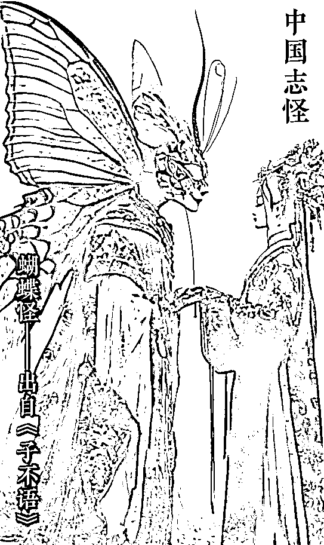
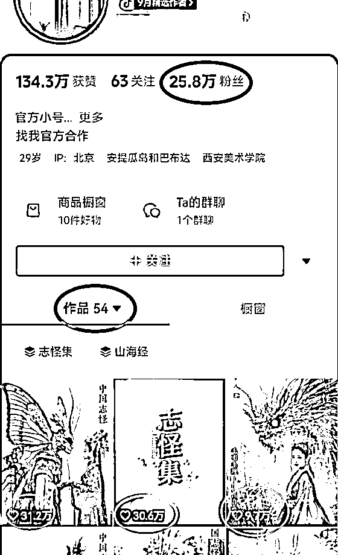
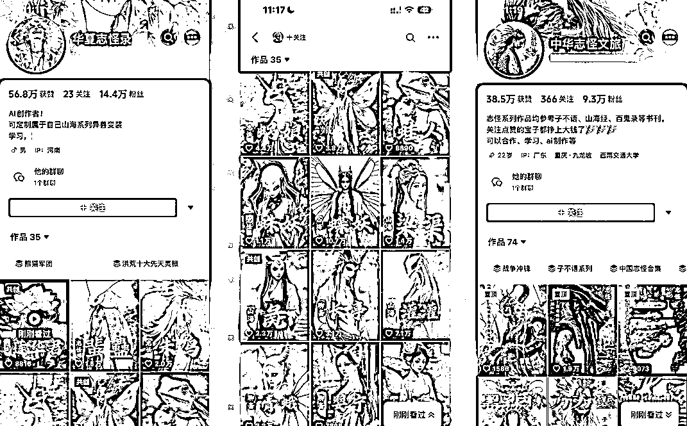
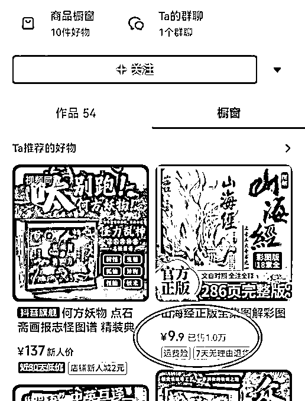
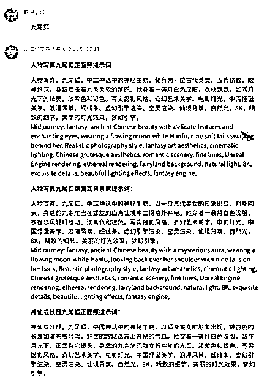
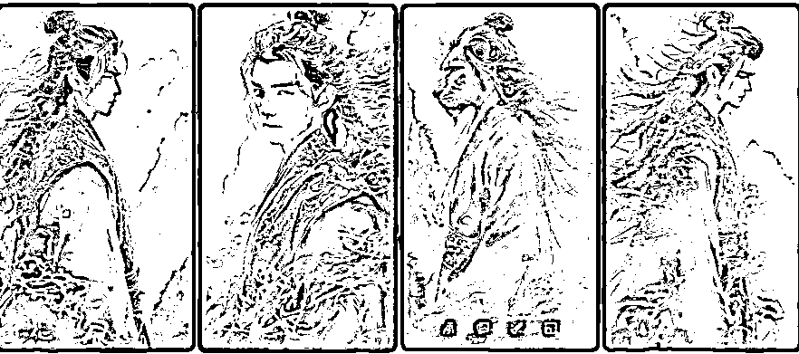
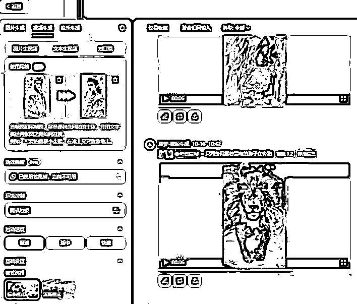

# 50 条作品涨粉 26 万，AI 志怪视频玩法爆火，附教程

> 原文：[`www.yuque.com/for_lazy/zhoubao/cwyhednilkxgwk0w`](https://www.yuque.com/for_lazy/zhoubao/cwyhednilkxgwk0w)

## (59 赞)50 条作品涨粉 26 万，AI 志怪视频玩法爆火，附教程

作者： 高鹏

日期：2024-10-30

大家好，我是高鹏。

今天继续分享一个热门玩法。

最近用 AI 生成志怪异兽视频非常火，看上去充满了神话色彩，而且新奇有趣。

视频人兽之间的变形非常的丝滑，质感也是拉满了，有一种电影的质感。

看下面这个号仅仅发了 54 条作品，就涨粉将近 26 万，起号速度非常快。

他的视频多的点赞量有三十几万，最低也有几千个点赞量。

这种视频全程都是用 AI 生成的，掌握方法其实制作起来并不复杂。

我看了很多号都是这种类型的，发的作品也是这种风格，播放量都非常高。种视频真的可以说是谁发谁火。

这种号做起来之后的商业化模式非常简单，主要就是橱窗带书。

比如像这个号，他的橱窗就有一本山海经的彩图，9.9 块的客单已经消了一万多件了。

当然也有作者去接星图商单或者收徒，都是非常不错的变现方式。

接下来直接说这种 AI 志怪视频到底应该怎么做？

要做出这种超有质感的视频，需要用四个步骤来实现。

第一个就是怎么样用 AI 来生成相应的提示词。

第二个是有了提示词之后，怎么样用提示词来用 AI 文生相应的图片。

第三步就是用图片生成视频。

第四个阶段把生成的多段视频进行剪辑成片。

首先是提示词，我们用到的一款提示词的生成工具，是大佬已经帮咱们配置好的，是专门用来生成这种志怪图片的提示词用的。

我刚才也刚刚生成了一个关于九尾狐的这样的一个提示词。大家想要什么样的神兽的效果，就输入对应的神兽的名称就行了。

我这儿输入的九尾狐，它给到了好几段提示词，挑选一个觉得比较舒服的，细节比较多的，去使用就 ok 了。

第二步就是用 AI 根据提示词来生成相应的图片。用到的一款工具是国产的绘画工具，叫做商汤秒画。当然如果你用习惯 SD 或者 MJ 这两款也是可以的。

这个商汤秒画，用到它的功能就是基础的模型，是平台最新的一款基础模型。

选择好模型之后，其他的基本上都不用管，只要设置好图片的尺寸，还有生成图片的数量，一般选择四张就 ok 了。

它生成的这个图片质感还是非常不错的，选择其中一个觉得不错的图片直接下载。

当然你觉得它四张如果生成的都不太好的话，可以再次生成，也可以去修改提示词，直到达到咱们的要求为止。

第三步就是用 AI 根据图片来生成视频，用到的工具是即梦或可灵，这两个其实都差不多。

以即梦为例，选择它里边的图生视频的功能，然后选择参考首尾帧。

首尾帧的意思就是视频生成之后，第一帧画面会是你提供的第一张图片，最后一张画面会是你提供的最后一张图片，会自动的去补中间的帧，来完成一个丝滑的变幻。

我们在准备图片的时候，至少要准备六张，要至少生成 5 段视频。

第一个视频就是用第一张图片和第二张图片作为首尾帧生成的；第二个视频是用第二张图片和第三张图片生成的。以此类推，最后一个视频是用第五张和第六张图片生成。

至于视频生成的时候用不用输入提示词，要看生成视频的效果，如果效果不太好，那就可以在提示词里面写清楚。

接下来最后一步剪辑成片，把这五段视频同步导入到剪映里，视频上有可能带水印，通过裁切放大等等方式给它处理掉。

然后再观察一下，这五段视频中间过渡的时候是不是比较丝滑。如果不是很丝滑，可以通过调配速，添加一些转场特效等等，让它看上去更加的舒服。

最后添加一个背景音乐，这个视频就制作完成了。

好，这就是今天给大家分享的玩法。现在这种视频流量比较大，但是真正会做的人还不多，所以也是一个很好的的玩法。

关于刚才提到的大神已经配置好的提示词的生成器，以及 AI 绘画工具和 AI 图片视频工具，其实这些工具我之前也都分享过，可以翻一翻我之前分享的帖子哦~

* * *

评论区：

半月 : 提示词生成器没看到啊

Yang Zhao : 赞, 不过提示词生成器没看到啊

y 青青青青青 : 马上试试

Majy : 马上试一下

Majy : 翻看你以前的评论也没有找到提示词生成器

亦仁 : 这个可以结合 youtube 来变现，可以完整的弄一个效果视频出来感受下。