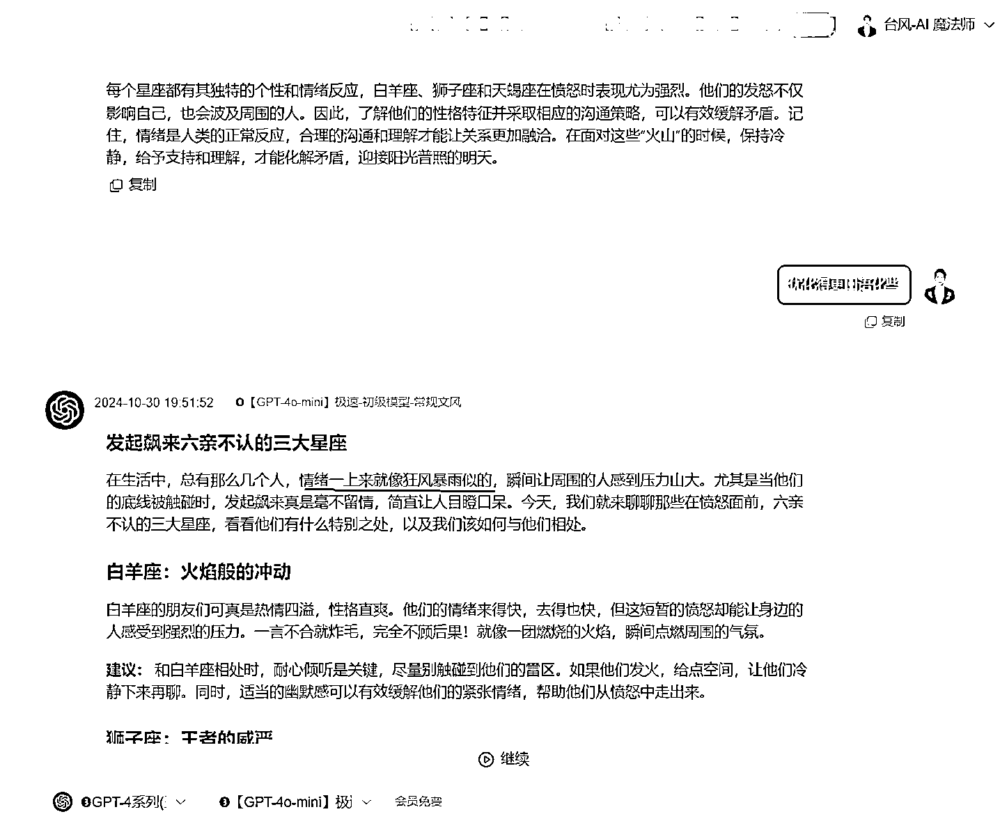

# 去 AI 味的方法，就 3 个字，百分百有效。(AI 自媒体新人教程系列)

> 原文：[`www.yuque.com/for_lazy/zhoubao/bst1pgya0250wz3z`](https://www.yuque.com/for_lazy/zhoubao/bst1pgya0250wz3z)

## (34 赞)去 AI 味的方法，就 3 个字，百分百有效。(AI 自媒体新人教程系列)

作者： 台风-AI 魔法师

日期：2024-11-01

大家好，我是台风(AI 魔法师)，GPT 写作指令法<BRTR 原则>、ChatGPT 指令生成器作者。

曾任生财早期的 GPT 自媒体教练，AI 领域公众号矩阵粉丝 4 万+。

* * *

AI 写作现在太火了，用 ChatGPT 这类 AI 工具写公众号爆文，效率确实高，但总会碰到一个问题：

AI 写出来的文章容易有股“AI 味”。

## **-01-**

“AI 味”是什么呢？

就是文章读起来感觉干巴巴、文绉绉的，甚至显得空洞、做作，少了人情味，不像真人写的那么自然流畅。

AI 味文案示例

有时候 AI 的表达总是偏理性、条理分明，像在写学术论文，这几乎是 AI 的默认风格。

这样的文章虽然没什么大问题，但读起来往往感觉没意思。

“AI 味”太重的话，一定程度是会影响阅读体验的。

尤其对于想做精品内容的公众号来说，这种机器味十足的文章很容易让读者产生距离感，觉得不够真实，不够接地气。

## **-02-**

那怎么才能去除 AI 味呢？台风给大家分享一个非常简单有效的方法。

三个字**：口语化** 。

没错，就是让 AI 说人话这么简单。

在编写 GPT 提示词指令的时候，我们可以加上口语化的语言风格要求：**表达要口语化、真实自然** 。

类似的指令词汇还有“接地气”、“大白话”等等，想了解更多口语化描述，也可以直接问 AI。

用上这样的任务指令，AI 就会模仿我们日常说话的方式，让文风变得更有情感、更真实。

AI 还喜欢用"首先、其次、最后"这种一板一眼的过渡结构，就不够自然。

如果我们想让它学会像聊天一样自然地过渡，就可以使用指令："**段落过渡要自然、逻辑清晰** "。

还可以额外增加禁止指令：不要使用"首先、其次、最后"等这样生硬的连接词。

为了让 AI 写的内容更有文采，指令里也可以加其他限定词句。

觉得 AI 写的故事案例太简单？告诉它“案例多一些细节描述，让人觉得真实有共鸣”。

觉得表达太平淡？让它“多用让人印象深刻的金句”。

当然也可以酌情使用表情符号，这种类似小红书的表达风格会让文风更活泼。

最后根据台风总提出的 GPT 任务指令法<BRTR 原则>，就可以快速编写出一条简单易用的指令了。

这是运行星座生肖指令的效果，属于简化版的，风格技巧就是照搬的前面提到的指令描述。

Claude3.5 的表达还是比较自然的，跟真人写作差不多。

## **-03-**

不过大家要注意了，有些低端 AI 模型，或者是 GPT 系列模型，在执行复杂指令时，可能会中途忘记你的语言风格要求。

这时候再提醒它一次“优化得更口语化些”、“语气再亲切些”，它一般都能理解调整。

这是用初级模型 GPT-4omini 写的效果，再提要求“优化得更口语化些”，文风就好很多了。

## **-04-**

现在有这么多 AI 大模型，台风用下来的感受是，Claude3.5 和 Gemini 的风格是最好的，基本没有什么 AI 味。

**选择顶级的大模型，能为创作省不少事。**

当然，你对质量要求高的话，还是适当人工润色下。

虽然 AI 很强大，但它终究是个辅助工具。

台风的干货观点类的文章，创作流程基本是这样：先准备点基础素材，然后用 Claude3.5 和 Gemini 辅助创作，最后再结合人工优化。这样创作出来的文章效果还是比较好的。

(Gemini 生成的初版样稿)

所以啊，也不用把 AI 提示指令想象的太难，无非是把我们想要的风格效果，准确的描述给 AI 罢了。

去“AI 味”最容易的方法，总结下来，就三个字：口语化。

不管你是否做 AI 爆文类的项目，AI 写作都是一门非常实用的技能，现在的 AI 大模型完全可以用来写出不错的内容了。

如果大家对这类技巧的分享感兴趣，台风后续会继续更新，做成一个小系列。

如果你有更多 AI 写作技巧可以分享，或者有其他疑问，欢迎评论交流~

感谢阅读~

* * *

评论区：

暂无评论