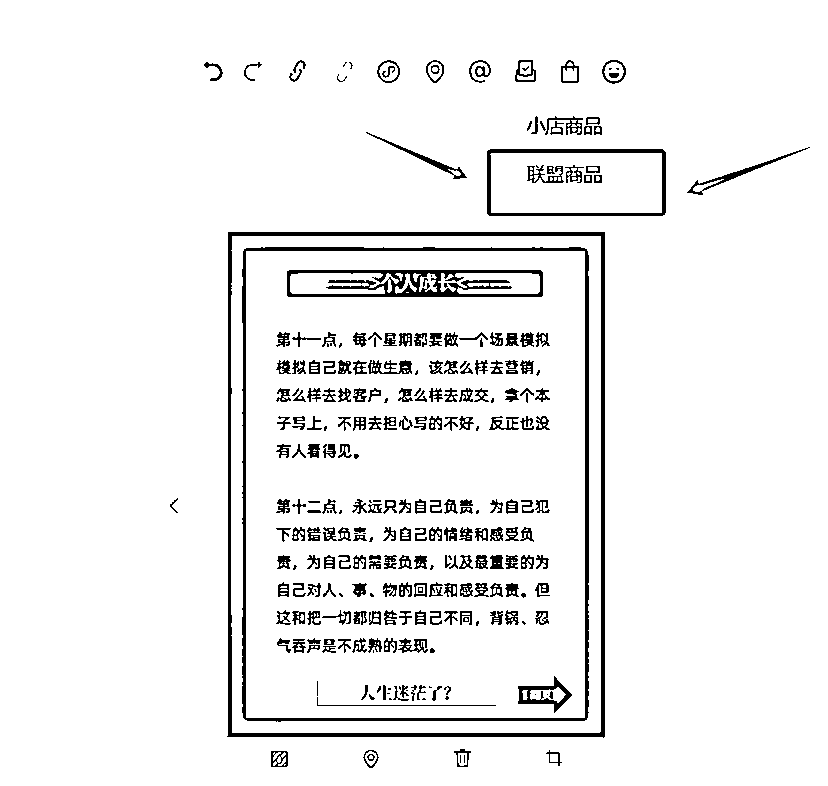

# 利好！公众号开放个人注册服务号，小绿书带货项目新机会，附教程

> 原文：[`www.yuque.com/for_lazy/zhoubao/knwv15029e4w1yir`](https://www.yuque.com/for_lazy/zhoubao/knwv15029e4w1yir)

## (39 赞)利好！公众号开放个人注册服务号，小绿书带货项目新机会，附教程

作者： 高鹏

日期：2024-10-31

​大家好，我是高鹏。

今天继续分享一个热门玩法。

现在个人可以注册服务号了，大机会啊，兄弟们。

这是某讯昨天刚刚做出的调整，我们知道原来注册服务号需要有执照，但是现在不用了。

对比以前，现在流程简单。原来你注册需要去后台去注册，现在手机打开某信就能直接注册。而且省去了原来需要办执照的费用，以及 300 的认证费也省了，这个门槛就大大降低了。

他这么做目的就是为了下一步要大力的去推小绿书，所以为什么说是大机会呢？因为都知道服务号对于小绿书来说流量有加持。

什么是小绿书呢？很多人可能不太清楚，小绿书其实是对标某红书的，是某众号的一个板块。

改版后对于个人来说，做小绿书带货就非常的不错。

最近小绿书带货这个项目也非常火，再加上个人可以注册服务号，肉眼可见未来这个赛道一定会成为香饽饽。

现在小绿书属于刚刚兴起的平台，也是内容比较匮乏的时期。很多作者直接从某红书找内容过来，直接发都是可以的。

我们一个圈友也在做小绿书带货，这个效益还是可以的，他这两个号后台的订单每天都是一百多笔，还是非常不错的。

在做之前先介绍下小绿书，因为很多人可能不太清楚，小绿书其实是一个全新的平台，上线仅仅也就几个月的时间，它是某众号的一个板块，不是一个独立的 APP，这个不要搞错了。

它的页面跟某红书非常像，截图的左边是小绿书，右边就是某红书，这两个作品是一模一样，连页面的布局都非常相似。

但是某红书带货门槛是比较高的，需要 1000 个真实的粉丝，平台判定非常严格。

现在小绿书门槛非常低，只需要 100 个粉就 ok 了。这 100 个粉懂的都懂，那随便搞搞都能够符合条件。

小绿书它属于某信旗下的，现在连个人都可以注册服务号了，明显是为了扶持小绿书的发展。可以预见未来它不缺流量，而且属于一个新赛道，起飞是迟早的问题，尽早布局做第一个吃螃蟹的人。

小绿书带货的这个项目熟练了之后，基本上五分钟之内就能够发布一条，而且他赚的是两份效益。

最简单的商业模式就是去带货，卖出去一单，就能够拿到对应的佣金。

第二个就是流量主，发小绿书的作品的时候，除了能够带货之外，阅读量也能够给你带来效益。

前提是要达到 500 个粉丝之后，就能够开通流量主。

第一步就是注册服务号，现在方法非常简单，直接进入到小程序里边，你去搜也可以，或者说给我要个码，因为这个码没有办法直接在这放出来，然后按照它的提示填写资料，直接就注册好了，非常简单。

这里边有几个关键点，一个就是一个人最多可以注册十个，但是每个人只能认证其中一个。而且如果要做带货或者是流量主，只有认证的号才可以。

接下来作品制作通过三个步骤来实现。

第一个就是确定领域，比如说你是在创业类或者说育儿类的，要看看你带什么东西。

第二个就是去某红书去对标相应的作品，然后把作品去水印儿发布，现在操作起来是比较简单粗暴的，因为某绿书现在是一个新平台蛮荒发展期，很多内容只要它平台上没有就可以发。

比如说你带的是创业类的书籍，就去某红书上搜成长思维等等这样的一些关键词，会找到很多作品，把爆款笔记直接给下载下来，然后去水印。

这个去水印也非常简单，点到作品里边之后，点分享按钮下边有一个复制链接，把链接复制下来。

接下来到这个去水印的小程序里，直接粘贴，然后点解析。这样图片下载下来之后，就没有水印，而且是高清的。

接下来就是作品的发布了，小绿书是某众号的一个版块，在选择发布作品的形式时，一定要选择图片文字。

右上角我框的这个地方，添加刚才保存下来的这些图片，下边是让你输入标题，这个标题可以填也可以不填，如果填的话就直接复制某红书的就 ok 了。

接下来是重点，你在发布的时候，右上角会有一个手提袋的图标。点它会出现小店商品或者说联盟商品。如果你自己没有小店的话，去带联盟的商品拿佣金就 ok 了。

点这个联盟商品，会跳出来一个商品页面，你在上面去搜索相应的关键词。这个需要注意一点，就是你挂的这个商品，一定要跟你发布的内容相匹配，不然的话平台不会给你流量，而且没有人下单。

选择好其中一款之后，就直接点下面插入，操作起来非常简单。

现在小绿书就是五年前的某红书。你试想一下，如果五年前你去布局了某红书，你能不能做出一定的成绩，就是这个道理。

但是我也要说清楚，因为任何项目都不可能适合所有人，我在这儿只是给大家分享一种玩法。

好，今天的分享就到这里了。

关于小绿书带货，其实里面一些工具我之前也都分享过，可以翻一翻我之前分享的帖子哦。

我是高鹏，深耕网创 9 年，这是我拆解的第 683 个项目玩法，平时喜欢拆解各类变现项目，也喜欢广交朋友~

* * *

评论区：

半月 : 你做了吗

豆豆 : 哈哈哈灵魂拷问啊

叁柒 : 哈哈😂😂😂