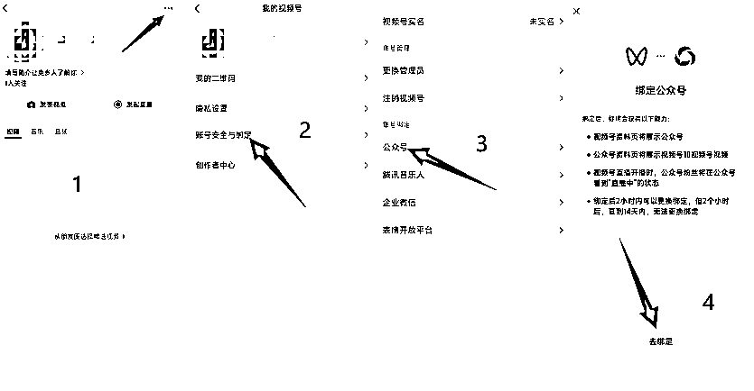

# 小绿书带货 2 个账号都破首单！历经 14 天 112 篇文章，RPA 是幕后功臣

> 原文：[`www.yuque.com/for_lazy/zhoubao/if7sdhttledmtkmp`](https://www.yuque.com/for_lazy/zhoubao/if7sdhttledmtkmp)

## (22 赞)小绿书带货 2 个账号都破首单！历经 14 天 112 篇文章，RPA 是幕后功臣

作者： 哈总

日期：2024-10-30

这篇文章早就写好了，一直没有发，

因为小绿书流量来得太慢，新手进去很难得到正反馈。

后来，我第二个号也出单了，历经 8 天。

我没有增加第三个账号，**因为收益低又不稳定。**

直到 29 日，看到个人可以不需要营业执照注册服务号了，这是一个微弱的信号。

我不知道腾讯有什么规划，但过往的经验告诉我，**你最好在牌桌上。**

以下是心得：

* * *

我是出单比较晚的，很多人在国庆假期就已经出单了。

我一直在做，就是想验证一下：我和别人的操作一致，先干 1 个月，能不能也出 1 单？

终于在注册 14 天之后，一觉醒来，出单啦！

另一个号是注册 8 天之后出单。

能够出单主要是：

1. 运气

2. 腾讯算法没有严格查重

3. RPA 解放双手

一句话总结我的出单心得：**做正确的事情，等待概率的发生。**

统计数据：我接触的第一批 250 人中至少有 28 人已经出单，出单概率 11%。

这其中还有不少人因为各种原因中途放弃，真正每天发笔记的实际出单概率会更高。

### ⚙️  **RPA**

小绿书带货全部操作都可以用 RPA 自动化。

**我从发布的第一天开始就是用自动化来做，不影响流量，不影响出单。**

如果对 RPA 不感兴趣，不需要学，不要因为自己不会 RPA 而焦虑。

**先手动把项目跑通，再找人定制 RPA 提高效率。RPA 不是项目的重点。**

我的 RPA 很多流程都指令化了，截图出来都是缩减的步骤，参考意义不大。

我也无意进行 RPA 教学，只简单说一下功能设计。

一个 RPA 用来下载小绿书图片并裁剪水印、下载标题正文、AI 重写正文。

处理 16 篇文章大概 10 分钟。

另一个 RPA 用来将重写后的笔记保存为草稿。

发布 16 篇文章大概也是 10 分钟。

手动选品后发布，大概 10~20 分钟。

选品这一步也可以用自动化来做，但是这样会失去对市场产品的认知。

如果同行的笔记没有挂产品，你就不知道该挂什么产品了。

### 📜  **经验**

**1****.** **不要纠结细节问题。图片裁剪后不美观没关系；找不到合适的产品就随便选一个；**

**2****.** **每天发 8 篇笔记就行，发太多只会让你放弃。**

**3****.** **不需要填合集，将发文动作最小化，完美是跑通的敌人。**

**4****.** **目前不需要垂直，垂直只会让你纠结选题。**

**5****.** **不要关注完读率、停留时长等所有指标，没必要。**

**6****.** **小绿书流量有滞后性，先发 1 个月再说，我一开始也是零蛋。**

**7****.** **这是一个简单的项目，不要把它做复杂了。**

**8****.** **先出单，再优化。**

**9****.** **没有 100%出单的秘籍。**

**  **

**目前跑通小绿书带货的核心原则：**

**日复一日的抄同行爆款，其他多余动作都不值当做。**

**日复一日的抄同行爆款，其他多余动作都不值当做。**

**日复一日的抄同行爆款，其他多余动作都不值当做。**

**  **

**  **

### 🛍️ 广告

小绿书带货 RPA 29 元/月

小绿书带货群 99 元

- 大家互相交流

- 帮大家解决操作上的一些问题答疑

- 分享我自己实战操作过程中碰到的问题

**感兴趣的联系鱼丸链接我�***

**  **

* * *

以下是最简单快速开始小绿书带货的方法：

### **前期准备**

目前观察小绿书带货阅读量高的账号大部分是服务号，需要个体户营业执照才能注册。

现在不需要了，个人可以直接开通服务号，扫描这个二维码。

到淘宝找人代办营业执照，36+邮费到付 24=60 元

我找的是这家，办了几张，商家服务、效率都可以

营业执照的优势是：你可以开通 2 个号，互相对比分析数据。

比如我，一样的操作方式，一个号 14 天出单，一个号 8 天出单。

对比之后才知道，**账号不火不是我不行，也不是方法不对，原来都是运气还没来罢了。**

注册服务号这个流程就不说了，关键是要绑定视频号才能带货。

### **绑定视频号**

使用注册公众号的那个微信，右下角“我” → 视频号，开通一下视频号

然后绑定刚才注册好的服务号

### **开通橱窗**

右下角“我” → 视频号 → 创作者中心 → 带货中心，点击“暂无带货权限”

开通橱窗后，缴纳 100 元保证金

上述过程中，如果出现认证提示，**都选择“个人认证”，营业执照只用来开通服务号**

一般 20 分钟左右就会通过认证

然后点击“去选品”，就可以把商品加到橱窗了

这时会提示带货方式，按下面操作

### **选爆文+选商品**

如果手机微信上能看到“服务号”（跟“订阅号”图标一样），

就从“服务号”中选爆文，如果没有就使用次幂数据。

我使用次幂数据选爆文，一个月 99 元，[次幂数据](http://如果手机微信上能看到“服务号”，就从服务号中选品，如果没有就使用次幂数据。
我使用次幂数据选爆文，一个月 99 元 [`www.cimidata.com/?refcode=w1jnt4`](https://www.cimidata.com/?refcode=w1jnt4))

每天早上挑 16 篇（每个号 8 篇），裁剪掉水印，标题不变正文用 AI 重写，发到自己的号上，保存为草稿。

打开[电脑端视频号后台](https://channels.weixin.qq.com/)，进行选品，基本上同行选啥跟着选一样的就行。

选好品之后，将商品插入到对应的草稿中

点击发表就可以了。

* * *

PS：在发布文章的时候，发现又出单了，下一步准备进行优化

* * *

评论区：

cc : rpa 咋购买呢[皱眉]

七天@生财有术 : 棒~可以等整体变现稳定了再分享下心得！