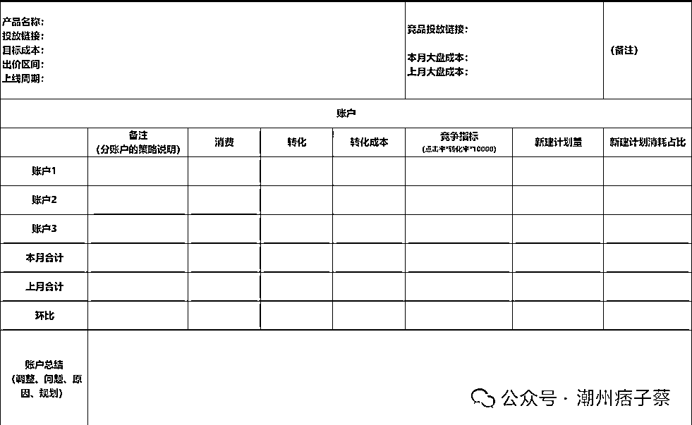
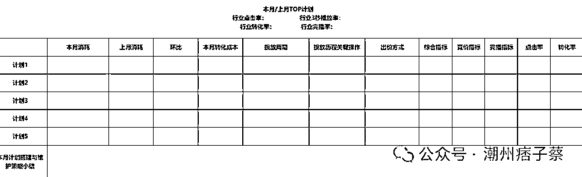

# 不少中小型老板都开始下场管投放了

> 原文：[`www.yuque.com/for_lazy/zhoubao/kim28b9bugdfkowr`](https://www.yuque.com/for_lazy/zhoubao/kim28b9bugdfkowr)

## (5 赞)不少中小型老板都开始下场管投放了

作者： 潮州痞子蔡

日期：2024-10-31

你好，我是潮州痞子蔡！

今天聊的这个话题虽然看起来是投放管理方面的内容，但它依然合适不同角色的读者去阅读，无论是老板，投放负责人，还是优化师。

补充说明的是，这篇文章是完全站在就是广告主的角度，非乙方的角度，只不过里面的内容对于乙方来说也是非常有借鉴意义的。

近期我们交流的、接受咨询的以及深度合作的等等，碰到了有这个共同的情况：很多中小型的老板都开始下场管投放了，或者说越来越直接参与到投放当中了！

随着时间来到了 2024 年的 Q4，离年底的倒计时也已经到了两位数，各家公司的掌舵人对业绩的达成和高利润回报的渴望已经被提升到一个极高的高度，也希望在抓好这一段时期后能为明年开个好局。

老板们现在也非常清楚：自家业务是基于投放买量来达成业绩和获取利润的模式，决定了投放是整个企业当中非常重要的一环！

**一、老板们在投放中常见的困惑；**

**  **

但是不少老板对自己的投放团队的情况有太多的困惑：

1、为何投放中要求的 ROI 那么难达成？

2、为何投放那么难起量？

3、为何投放的账户中空耗的预算居然高达 40%以上，都没有及时去停掉？但最后的 ROI 还不能说非常的差；

4、为何投放的成本总是那么高？

5、为何不能持续做出好的素材？这里面有什么方法论？

6、为何跑出好的素材没能吃到更多的量？应该怎么做才能将这条素材的量收割得更多？

7、没做出好的素材是设计部门的问题，还是投放的问题，这个应该用什么来做评判？

8、要拿更大的量除了素材、除了提价，真的需要产品做比较大的改动吗？如果改动之后还是没效果怎么办？这些应该用什么来评判究竟是哪个环节的问题，然后进行针对性的改进?

9、怎样才能在更好、更熟练、更通透的掌握投放中的知识、技巧、门道以及将这样的一些动作形成方法论，用以“复制”出投放能力给优化师，让新老优化师都能发挥出她们的能力来？

10、是不是团队里面的人的能力问题？是不是就是招错了人？

......

以上只是列举了老板们在管理中常常聊到的 10 个问题，实际关联下来的问题还有很多很多，而从这些问题上我们能看出老板们的烦恼，当然这些有不少也是投放负责人和优化师们的烦恼。

**二、通过各类数据去界定投放中的问题**

**  **

根据我们连续这么多年在投放端的经历和不断的深入探索，上面的很多问题都是有办法可以界定和解决的。

**界定的标准需要通过数据！**

**  **

通过数据来发现问题、确定问题以及解决问题这是绝大多数老板都认可的，甚至可以说不是绝大多数，而是 100%。老板们数据化管理的思维这个是共通的。

但老板们的难点或盲点是在究竟该用什么样的数据，这个是最大的问题！

1、老板和投放负责人平时关注的数据多是结果数据，比如：

不同投放团队的当月/当周/当天的广告消耗量、ROI 情况；

2、投放负责人平时关注的当月/当周/当天的总的广告消耗量、ROI 情况、以及不同优化师的个人业绩情况，如果稍微细致点还会看不同优化师的工作表（下图仅仅举例，不同团队关注的指标有很大不同）：

但是，仅仅以上面老板或投放负责人关注的这些数据，大部分只看到业绩达成的进度和一些问题的呈现，小部分能发现一些问题出现在哪里（不全），但是想以此来完全找出投放困境当中的各个问题，包括界定是哪个环节当前存在问题，该如何改进等，这部分从这类数据中比较难定位出来。

像之前我的那篇文章《[广告素材能否消耗起来，是优化师还是设计师的责任？](http://mp.weixin.qq.com/s?__biz=MzA5OTcyNzM1MQ==&mid=2247487209&idx=1&sn=f863cfb04482cce1c3b98964213ace6b&chksm=90fcac71a78b2567f8b7894ff3d94332e255ac69d9af687eb7dfdd0e72ec574fa6a610f4090f&scene=21#wechat_redirect)》里面我做了投放部门和设计部门的责任与贡献的界定说明，就是提到实际要通过数据去做判断。

而当下对于不少团队当不知道该怎么界定的时候，要求的是投放部门多上计划，设计师部门多出素材。

这里又产生一个问题，我们接触了很多团队，两个部门在制定素材方面缺乏统筹，设计部门的素材不少凭借自己的经验去输出的，缺针对性逻辑和投放测试、迭代逻辑，加上还有设计流程、排期等，以及在素材二创规避重复规则上未能清晰洞察，所以导致素材的有效性、跑量成功率上会有缺失。

而优化师一方面是有什么素材上什么素材，有少量是自己与设计师进行沟通出来的素材，但是在看菜下饭的流程当中，加上自己并未能充分理解媒体账户和把控账户模型的情况下，就容易在投放中出现了一些所谓的 S 户。

那究竟基于什么去界定投放部门和设计部门之间的责任，或者说应该看什么数据才能更好的去发现问题、确定哪个部门需要做改进努力，才能让整个投放都良性循环起来。

**三、判断的数据来源于各个广告账户**

**  **

这个数据是在账户里面，是细节的数据，“细节决定成败”真的不是一句空话。

衡量一个优秀的投放负责人就看她有没有深入到账户去看各类数据，以及自己平时是否还有在保持投放的手感和直觉。

所以，这也是我们和老板们说如果脱离账户数据来说问题，这些往往都不能得到很彻底的解决。

因为细节是通过各类数据呈现出来，需要大量的数据，它不是靠简单的结果数据就能让我们很清楚的去界定问题，然后解决。

账户里面的数据能去判断：

1、投放不起量是投放方面的问题，还是设计方面的问题；

2、成本偏高是素材的问题，还是控制空耗、管控高成本计划方面的问题；

3、计划不起量是素材的问题，还是投放操作方面的问题;

......

仅仅举例的 3 个问题，就能充分看出这些问题没法从最上层的结果达成数据里面去判断出来，只有通过一线数据才能更清楚的去判断。

界定问题需要通过数据，需要从细节中去发现问题。

**四、投放问题被发现的矛盾**

**  **

从我上面所聊到的，要解决投放当中的问题，首先要发现问题，而问题的发现需要在一线当中去找、去挖掘、去提炼，然后反馈出来。

而这里的矛盾点就在：

1、老板或投放负责人往往更看重的是结果数据，他们要对最后投放的结果负责，所以更多的精力盯在结果和投放过程的管理上；

2、一线的优化师们每天忙于投放执行，紧盯着投放预算，非常忙碌，加上自身缺乏一定的抽象能力、总结能力以及阅历上、经验上的不足等等，所以也没法很准确的反馈问题出来。

3、优化师能看到的也是基于自己账户、计划存在的投放问题，她也没法去总结到整个投放团队，甚至还有代理商投放团队整体投放存在的共性问题。

所以，现在老板们开始来下场管理投放的话，就需要深入到投放的一线当中，深入到投放的账户当中，如果还是没法深入到这里面去看数据的话，那么最终的问题还是解决不了，或者需要把这个责任和权限充分授权给投放负责人了。

五、数据维度

要准确确定投放当中存在的问题，需要看非常多的数据，看不同的纬度，甚至还要看不同纬度数据的组合，有：

账户数据、计划数据、素材数据、周数据、日数据、甚至还要看分时数据；

投放前端数据、投放后端数据、投放的前后端数据的及时性、匹配度......

投放前端数据包括消耗、投放策略、投放工具、出价......

以上还是相对客观的数据，下面还涉及如何从主观再到客观的：

基于达标数据的素材的共性、是否能形成方法论，形成的方法论能否屡试不爽，这个方法论形成后怎么在上计划当中审核通过，这个方法论能否沉淀下来赋能给优化师......

而这个方法论最后可以通过什么数据去固化下来？

omg，是不是看到这里觉得好复杂、好晕！

说实话，说起来是貌似有点复杂，当你熟悉、深刻在骨子里之后，你会发现非常简单，并且这套分析的方法和策略同样可以用于多个媒体、可以用在公司经营管理、部门管理，可以用在自己想做的一些副业、小玩艺上。

里面的核心就在：

数据和细节！

而数据和细节这两点，我们常常重视前者，但忽略了后者！

还有一点，也是我们常常会忽略的，不能说是认知，而是太急了，急到了违背一些规律、常识。

那天刚好看到《经纬中国》的视频号里面有泡泡玛特的老板在分享的一个观点：尊重经营、尊重时间！

这个观点无比赞同，如果我们能尊重规律的话，投放和投放的管理都是能做好的，只是我们都太急了，太卷了，而这个“急”和“卷”也让我们常常忽略掉了很多细节的东西。

* * *

评论区：

暂无评论