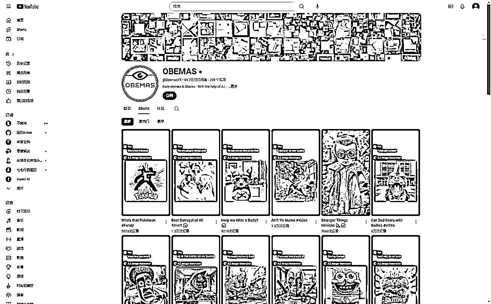
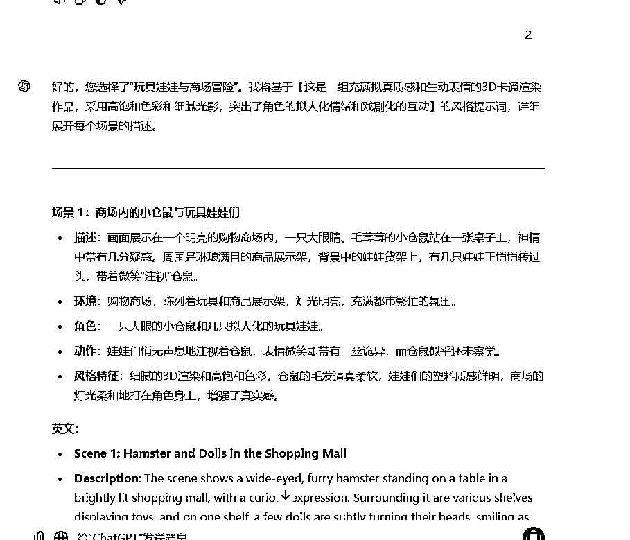
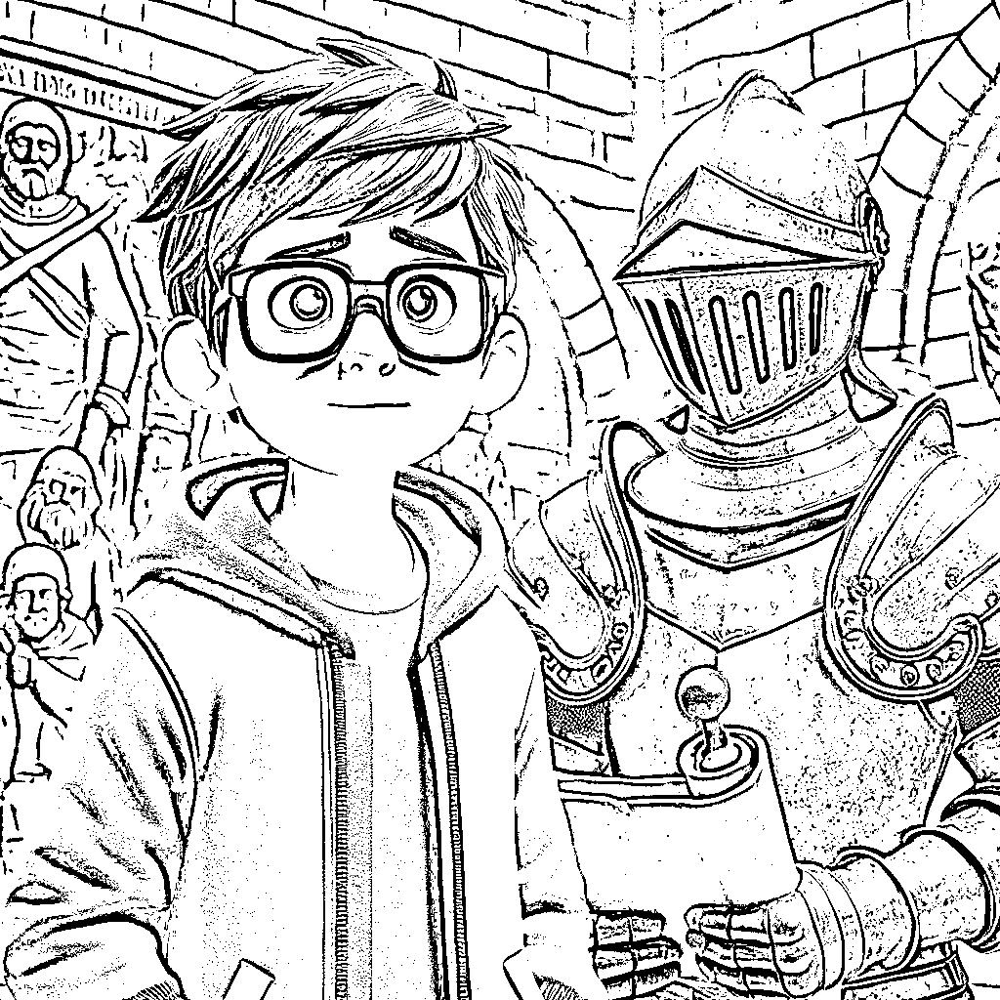

# 详细拆解两个适合新人的AI Shorts 赛道

> 来源：[https://yemahuyou.feishu.cn/docx/A08RdxpbZoJCqjxDwDxc2PIDnmc](https://yemahuyou.feishu.cn/docx/A08RdxpbZoJCqjxDwDxc2PIDnmc)

Ai类免不了就是成本的问题，自身电脑算力不足是一点，不如大厂的模型便捷性也是一点，所以我拿出来目前2个最典型的赛道讲解一下实操，本来是三个，肝不动了~各位可以根据这些方向，先出成品，然后发散思维创作更多的小机灵内容~

# X的故事

## 初步解读

X的故事基本上都是走萌系流量，最早是猫meme起量，后来延伸出更多的赛道，比如小兔子的故事，小老虎的故事，但猫的故事受众群体够大，拓展层次也更强，底层逻辑除了萌，更多的是具有教育意义的一种展现。

但是只有猫的故事延伸品类最多，所以接下来就以猫的故事为例，各位圈友可以思维拓展，也可以先拿这个赛道练手。

比如：小猫受到了霸凌，经过了XXX，最后得到XXX； 或者，小猫家里遭遇了变故，猫妈妈意外身故猫爸爸辛苦带小猫，等等这些，具有画面语言的视频。

所以在这种赛道中，我们在考虑反推爆款视频的同时，另一个最重要的环境因素要明白，那就是这个视频想表达的是什么？

目前X的故事整体赛道，猫的故事比较拥挤，后期开通YPP的风险有点难度，要么考虑拓展其他萌宠的故事，要么考虑图转视频，那么我们来看看，这类型的视频，长什么样子：

那这三个故事分别是：

1.  一对猫母子在超市购物，母亲推着购物车，孩子走在前面。母亲突然感到肚子疼，痛苦地叫着“喵喵”。孩子听到母亲呼喊，赶忙跑过去查看情况。发现母亲肚子越来越大，他意识到母亲要生了，于是慌张地四处寻找帮助。 孩子急匆匆地拨打了电话，联系了救护车。随后，母亲被推上了救护车，父亲接到了电话，匆忙的感到了医院，在医院走廊里焦急地等待。最终，母亲顺利产下六只可爱的小猫，孩子开心地笑了。

(通过简洁的画面和猫的叫声，生动地讲述了猫夫妇迎接新生儿的喜悦，传递了家庭的温馨和幸福。)

1.  小猫妈妈带着小猫去逛街，一只橘色的小猫想要买爆米花。它带着钱来到了一个爆米花摊，但是摊主说那里不允许猫进入。小猫很伤心，大猫看到后安慰了它。大猫随后想到一个主意，它打扮成了一名黑衣女特工，潜入了玉米田，偷了一袋玉米。随后它回到家，将玉米做成了爆米花，小猫开心地和它一起享受美味的爆米花。

(这个故事传达了母爱和智慧的力量。大猫为了满足小猫的心愿，不惜冒险，最终用智慧解决了问题，让小猫开心。)

1.  小猫同样想要购买爆米花，但摊主贴了一个 "猫咪禁止入内" 的标志，并表示不允许小猫进入。小猫伤心难过。大猫安慰了它，随后想出一个计划：它打扮成了一名黑衣女特工，进入玉米田偷玉米。但是，这次它遇到了一些阻碍：田地主人和他的狗在追赶它。最终它还是成功地偷到了玉米，回到家，将玉米做成了爆米花，和它的小猫一起享受。

(母爱和智慧的力量。大猫为了小猫的愿望，克服困难，最终达成目标，让小猫感到快乐。)

那我们来看看:

第一条视频纯图片，加一些转场；

第二条视频和第三条视频，是一样工作流风格，一样的故事情节。

所以X的故事，不仅仅只是把图片做出来的技巧，更多的是底层想要表达的含义，好的故事才能让它爆炸；

### 优点：

适合新人，操作难度不大，容易理解，不需要太复杂的工作流，并且花费很少的时间即可做成。此类赛道大量的高爆对标账号，可以快速模仿上路。

### 缺点：

赛道拥挤，此类赛道的创作者太多，导致开通YPP的难度加大（同个赛道YPP开通过多，后期容易拒绝），需要花费一定的资金(购买Gpt账户，图生视频的钱)。

### 特点：

对于缺点而言，我们可以想办法克服，图片开通难，我们就图转视频，然后成本就拉大，我们就考虑降低成本，但不可能是0成本。

## 实操详解：

这类更方便的我们可以考虑逆练九阴真经，也就是把对标的爆款视频反推图片，完整整个故事线，然后在重新画图，组合（或者图片+转场特效，或者图转视频）

这类绘画的风格其实是有讲究的，包括下面要讲的搞笑段子，都是用到dall-e-3的模型，只有这种模型出来的图片，以及语境能力可以胜任。

各位可以分别对比，其他MJ，SD，Fulx等等，它的完善度，风格，都不如dall-e-3的模型足够优秀，并且，成本更便宜。

dall-e-3 ，就是chatgpt的画图功能，在这类图片我们要展现的时候，我们要先理解这个画风是什么，而不是直接拿图反推瞎画，不然画风不舒服，老外接受度低，视频最后的连贯度就容易出戏。

### 画风：

皮克斯动画风格，欧美国家从小是被迪士尼，皮克斯这类动画公司所洗礼，所以这种风格的展现，更容易让他们沉浸下去。皮克斯动画风格，迪士尼动画风格，超现实主义等等这些，所以在提示词当中我们要带上这类词。


那当我们理解这些核心概念以后，我们就可以尝试去操作这类风格的图片创作。会用api调用dall-e-3的我会放一个示例在最下面，点击这里跳转，对于小白咱们怎么一步一步完成这些操作，点击这里手动；

### 手动：

### 逆练九阴真经：

我主要讲解如何通过反推的逻辑去快速出爆款内容一样的视频，为什么不讲原创，一来是麻烦，需要收集很多故事，然后在风格转写，脚本分镜，反复优化，这个很麻烦讲起来没头没尾的。所以主要讲反推，方便快捷，而且这个领域有源源不断的新内容出现，做原创选题实属没必要（AI写出来的故事真的太噶）。

一共分为三大步，分解视频，创作图片，图片筛选/图转视频，剪辑合成(音乐，音效)，

#### 第一步：分解视频

首先，我们需要视频拆分出来不同的画面，然后反推出提示词，以及完整的故事线，这样我们就可以在第二步创作图片的时候更加的方便，也有口子入手。

#### （1）手动截图

每个视频它的底层，都是几张图组成的整体故事，哪怕是图转视频也是这样，所以最简单方便的方式，你就挨个截图，每一张每一张的来，一个视频也就不超过10张图。

#### （2）通过代码来分割出图片

代码不会用的，下方有我封装好的软件，没有绑定任何东西，管理可以查一下，纯代码封装，没有病毒。

各位圈友可以拿着直接用，也就不用写代码了，照顾一下不会，或者不想学习写代码的圈友。

用软件拆解会方便一点，通过OpenCV，使用直方图比较来检测场景变化，然后计算巴氏距离(Bhattacharyya distance)用于衡量两个直方图的相似度，将彩色帧转换为灰度图，计算灰度直方图:

*   threshold: 场景切换的阈值，值越小检测越敏感

*   video_path: 输入视频的路径

*   output_dir: 输出帧的保存目录

```
import cv2
import numpy as np
from PIL import Image
import os

def detect_scene_change(video_path, output_dir, threshold=0.15):
    """
    简单的视频场景检测演示函数
    参数:
        video_path: 输入视频的路径
        output_dir: 保存关键帧的目录
        threshold: 场景切换的阈值
    """
    # 创建输出目录
    if not os.path.exists(output_dir):
        os.makedirs(output_dir)

    # 打开视频文件
    cap = cv2.VideoCapture(video_path)

    # 获取视频的基本信息
    fps = cap.get(cv2.CAP_PROP_FPS)
    frame_count = 0
    scene_count = 1

    # 读取第一帧
    ret, prev_frame = cap.read()
    prev_gray = cv2.cvtColor(prev_frame, cv2.COLOR_BGR2GRAY)
    prev_hist = cv2.calcHist([prev_gray], [0], None, [256], [0, 256])

    while True:
        # 读取当前帧
        ret, frame = cap.read()
        if not ret:
            break

        # 计算当前帧的直方图
        gray = cv2.cvtColor(frame, cv2.COLOR_BGR2GRAY)
        hist = cv2.calcHist([gray], [0], None, [256], [0, 256])

        # 计算两帧之间的差异
        diff = cv2.compareHist(prev_hist, hist, cv2.HISTCMP_BHATTACHARYYA)

        # 如果差异大于阈值，认为是场景改变
        if diff > threshold:
            # 保存关键帧
            frame_rgb = cv2.cvtColor(frame, cv2.COLOR_BGR2RGB)
            img = Image.fromarray(frame_rgb)
            save_path = os.path.join(output_dir, f'scene_{scene_count}.jpg')
            img.save(save_path)

            print(f"检测到场景变化! 保存第 {scene_count} 个场景")
            scene_count += 1

        # 更新前一帧的信息
        prev_hist = hist
        frame_count += 1

    cap.release()
    print(f"处理完成! 共处理 {frame_count} 帧，检测到 {scene_count-1} 个场景")

# 使用示例
if __name__ == "__main__":
    video_path = "input_video.mp4"  # 替换为你的视频路径
    output_dir = "output_frames"     # 替换为你想保存帧的目录
    detect_scene_change(video_path, output_dir)
```

##### 软件直接用：

附视频切图片软件，由于飞书里面下载不了，放百度网盘链接，在生财帖子下方，生财不能上传大于50M的文件。

###### 使用方式：


解压以后里面是这个，自己建立一个文件夹，双击打开，它就会创建两个名为，输入和输出路径，把下载好的对标视频放入输入的文件夹，运行即可。


#### 第二步：创作图片

之前讲过，我们使用dall-e-3的模型，那对于新人更方便的就是使用Chatgpt，我们只需要根据图片反推他的画面，然后合成故事，再次创作即可。

#### （1）使用提示词，批量提取故事描述：

##### 提示词:

我们可以批量丢给Chatgpt来描述画面:

帮我描述一下这几张图讲的是什么，它是根据视频拆解出来的图片，其实是一个完整的故事 ，你挨个描述一下对应画面，然后根据图片把这个故事连贯在一起。你需要分别根据场景，景别，动作，角色，来描述，要给到中英文对照。


每次只能上传10个图片，所以我们继续发送：

这个故事还没结束，还有，我在继续给你，请你继续描述，然后接上之前的剧情，


然后我们给到，完整线的梳理，拿到这些详细的描述词：

##### 描述词:

现在把整个完整的故事线梳理一下，每个图片对应的是一个场景，详细把每个图片的描述清楚

1.  场景一 母猫和小猫走在城市街道上，母猫亲切地靠近小猫，小猫穿着可爱的背带裤，两人依偎在一起，充满温馨的亲子氛围。

1.  场景二 小猫在街头的爆米花摊前站着，手里拿着一张钞票，满怀期待地看着摊位上的爆米花，显然很想尝一尝这美味的零食。

1.  场景三 爆米花摊的摊主表情严肃地指向一个“禁止猫咪”的标志，不允许小猫购买爆米花，小猫的希望被冷漠地拒绝了。

1.  场景四 小猫因为被拒绝而伤心，依偎在母猫的怀里，母猫温柔地轻抚小猫的头，安慰着它，传递出满满的母爱。

1.  场景五 母猫牵着小猫的手一起走回家，背影温暖，象征着无条件的陪伴和关爱。

1.  场景六 回到家中，母猫微笑着，看起来温柔又坚定，似乎在酝酿一个计划，要为小猫做点特别的事情。

1.  场景七 母猫换上黑色紧身衣，戴上面罩，摆出战斗姿势，似乎准备要采取行动，眼神中透出一种坚定的决心。

1.  场景八 小猫看着母猫的装扮，露出惊讶的表情，似乎没想到母猫竟然有这样的一面。

1.  场景九 母猫穿着黑色紧身衣，穿梭在玉米地里，表情专注，显然是在执行一项特殊任务，目标明确。

1.  场景十 母猫在玉米地里找到一堆玉米，小心翼翼地将玉米装进麻袋里，显然在为小猫准备食材，完成她的任务。

1.  场景十一 母猫背着装满玉米的麻袋快速逃跑，身后愤怒的农夫和他们的狗紧追不舍，母猫全力奔跑，表情中带着紧张又专注的神情。

1.  场景十二 母猫成功带着玉米回到家中，换上围裙，开始在厨房里准备玉米，脸上露出幸福的表情，显然对即将完成的美味充满期待。

1.  场景十三 母猫站在炉灶前，小心地用木勺搅拌锅里的玉米，表情专注，整个厨房充满温馨的氛围。

1.  场景十四 爆米花开始从锅里喷涌而出，母猫和小猫都露出惊讶的表情，没想到玉米会变成这么多的爆米花，整个厨房被爆米花填满。

1.  场景十五 厨房地板上堆满了爆米花，母猫和小猫站在其中，表情略显无措，但又带着无奈的笑意，场面轻松而温馨。

1.  场景十六 母猫的头顶落满了爆米花，小猫惊讶地看着母猫的模样，两人之间的互动十分搞笑可爱。

1.  场景十七 面对厨房的爆米花堆，母猫忍不住开怀大笑，小猫也在一旁开心地看着母猫，整个场景充满欢笑和温暖。

1.  场景十八 最后，母猫和小猫坐在客厅的地板上，一起享受着一桶爆米花，两人都露出满足的笑容，母子俩其乐融融，故事画上了圆满的句号。

故事总结

小猫因为无法买到爆米花而失落，母猫为了让小猫尝到它心心念念的美味，冒险去玉米地“借”来了玉米，经历了紧张的追赶后，母猫成功带着玉米回家，亲手为小猫制作爆米花。虽然过程中意外不断，但最终母子俩一起开心地享受了爆米花，故事温馨圆满。

那我们能够看到整体故事线，没有出入，想输出的情绪价值，也没有偏差！

整体故事梗概，以及详细图片的画面我们都拿了出来，如果有描述不对的地方，或者理解错的地方，可以自己手动修改。

#### （2）设定身份：

现在为了故事的统一性，我们需要要角色保持一致性，尽量的一致即可，毕竟目前来说，AI绘图也好，视频也好，还处于抽卡游戏当中，那我们需要如何让它保持一致性，角色，物种，性别，服装，动作，画风，来保持它的大概一致性。只要做到这点，观众一般都是不挑的。

##### 提示词：

我想让你重新作图，角色要重新设定，首先我需要告知的是，风格是皮克斯的动画风格，超现实主义，这些动物是属于拟人化的展现形式，所以它不需要之前的生物习惯，比如爬行，而是像人类一样行走，先不要做图我们先来聊一聊，这两个角色的固定，长什么样子，然后在优化提示词的部分。


然后尝试作画，看一下角色风格有没有走歪：


好，大致上没问题，猫妈妈画出来的很性感，我的最爱 哈哈哈~~~

那我们来存一下角色，省的这个窗口崩了，方便在新的窗口直接在画：

### 角色一：母猫

*   外貌：母猫是一个拟人化的白色长毛猫，拥有柔软蓬松的长毛，特别是在头部、耳边和尾巴处更为突出，展现出温柔而优雅的气质。

*   眼睛：大而灵动的绿色眼睛，能表达出温柔和坚定的双重情感。

*   表情与姿态：平时表情温柔慈爱，带有轻微的微笑线条。行动中则表现出坚定、沉着的神情。

*   服装：

*   日常穿着：穿一件简洁优雅的粉色连衣裙，温暖的色调衬托出她的母性与温柔。

*   任务装：在执行任务时，母猫穿上黑色紧身特工服，配有腰带和小工具袋。虽然穿着黑色紧身衣，但头部、耳边的白色长毛和蓬松的白色尾巴依然明显，增强她的辨识度。

*   性格：母性温柔且富有决心，为了小猫不惜冒险。平时温柔体贴，但在执行任务时展现出敏捷与果断。

### 角色二：小猫

*   外貌：小猫是一个拟人化的粉色短毛猫，整体外貌显得非常可爱，皮肤呈粉色，给人一种天真无邪的感觉。

*   眼睛：大而圆的亮黄色或金色眼睛，充满好奇与渴望，尤其是对新事物的兴奋表现。

*   表情与姿态：总是带着期待和好奇的表情，看到母猫或心仪的物品时眼睛会亮起，有一种天然的孩子气。

*   服装：穿着一件牛仔蓝的背带裤，内搭浅色T恤，整体造型童趣满满，表现出他活泼的个性。

*   性格：天真活泼，充满好奇心，对世界充满探索欲。特别依赖母猫，时常流露出孩子般的依恋。

### 场景及色调

*   整体风格：以皮克斯动画风格为主，色彩丰富而饱满。母猫和小猫的互动场景以暖色调为主，营造出温馨的氛围。

*   光影细节：场景中的光影变化配合角色的情感，例如母猫执行任务时光线偏暗，凸显紧张感；在家中或与小猫互动时则使用柔和温暖的光线。

#### （3）尝试创作新的图片

##### 提示词：

为了我们能够画出比之前更优质的图片，我需要你帮我优化提示词，首先两个猫的角色描述要固定在提示词里面，画风也要固定在提示词里面，然后要理解，这些动物都有拟人化的特点，以及要遵守一下规则：

色调与光影：皮克斯风格通常采用丰富的色彩和精细的光影处理，因此在画面上可以用柔和的暖色调，突出家庭和温馨的氛围，而在母猫任务场景中，色调可以略显冷色，突出紧张感。

夸张的肢体语言：可以加入一些夸张的动画效果，例如小猫看到禁止标志时的失落夸张化表现，母猫在任务中紧张奔跑时的敏捷姿势。

细节层次：每个场景可以加一些细节物品来丰富画面，比如厨房中可以增加蔬果、爆米花袋等，增强生活气息和真实感。

为了保持角色统一性：角色的主要特征要描述准确并且固定。要让角色更加贴近人的姿态，除了一些身体特征，更加像人。这就是拟人化姿态。所以在你描述角色的时候，可以使用，它是一个类似人类的XXX，很像人类XXX来描述。

现在描述词优化一下看看，给到中文，我们先来基于之前给你的图片描述场景或者我给你描述词：


有时候它会不太理解什么是拟人化，会画成一个猫站立，类似这样，


我们可以在对话的时候告诉她是怎么样的，然后在调整回来，可以告诉她，她不像动物一样站立，而是像人类一样站立，任何动作都是像人类一样，那在接下来的对话当中，GPT的对你要求提高理解。

之后我们以此类推：

把描述词都挨个跑一遍，反复抽卡找合适的图片：


但一定要注意她描述的词语，和绘画是否对得上，你看这幅，明显猫妈妈变成卖爆米花的了，那我们可以告诉GPT两人都站旁边，或者就没有妈妈，只有小猫在羡慕的看着。 我在交流的时候，会用非常粗糙的方式去和GPT交流，为的是不使用一些复杂语料也能让新人明白，只要你描述清楚，哪怕你描述不清楚，现在的GPT能力也能够理解！


那你可能会问，怎么会这样呢？ 还要在调试，其实这种概率事件不大，它的主要问题就是你的描述不够精准，

你吧妈妈画的感觉他在卖爆米花一样， 你改一下 或者不要妈妈。

这句话 可以改成：

你吧妈妈画的感觉他在卖爆米花一样， 你改一下 或者不要妈妈，如果不要妈妈的时候，也别忘记之前固定的角色形象。


我们按照之前的描述词挨个优化并且作画，我们就会得到一组，符合我们完整叙事的图片，这个时候，我们的图片创作，基本上已经完毕，接下来就是剪辑合成，亦或者图转视频的问题。

##### 创作图片步骤中一些心得：

逆练九阴真经讲的是，用原始的方法来出图，只需要按照步骤 反复抽卡都会得到自己想要的图片，然而，他牺牲了速度，但增加了精准度，以及降低了很大的门槛。

1.  目前来说只有chatgpt(dall-e-3模型)最适合这种类型的图片创作，MJ以及其他平台都不行。

1.  如果想在增加点速度，可以描述词保存好，然后直接开始画不让GPT再次写优化描述，或者写完优化描述直接作画，这样减少一次对话的浪费。

1.  不要追求一步到位，不管使用什么样的提示词，不管如何优化，你想创作出心里满意的作品，是永远无法一步到位，抽卡时代忍忍。我写文案可以写满分，耗时一天，而AI可以完成70分，但是耗时1分钟，那我反复出70分的作品，反复迭代，这种迭代的速度，可以在一天内创作出更多超过满分的效能，所以不要纠结精确度。

#### 第三步：图转视频（可选）（合成以及剪辑不讲没必要）

为什么选择图转视频，这也是迫于无奈，这个赛道很拥挤，那图转视频就带来了新的生命，这里就简单的说一下，图转视频没有什么难度，丢进去图片+提示词，等待抽卡合适的即可。

推荐平台：

可灵、Luma、海螺、其他差很多。

这里就要考虑成本问题，想做图转视频，想批量，成本和价格就要计算到位，目前海螺可以撸，可以首选用海螺，如果质感差，就使用可灵，但我觉得最好的还是runway，性价比也极高，看各自选择。

目前开放api的，可灵，luma，但是很贵，但可灵的web端的价格还好，可以尝试把web端的接口对接一下然后跑，也可以用rpa自动扔图，出视频保存。

如何使用就不讲了，傻瓜式操作。收费的东西要是还很难，收费也没必要了。

成本优化：

工作流的不同，找到的源头渠道不同，成本的压制也不同，所以，个人建议，算好自身条件以及成本，即可批量操作。根据这个赛道的价值，一条视频超过5块的成本，就是在白做工了。

比如：

可灵首付的价格，不使用高性能，一次图生视频在2毛左右，一个视频大概在10-20张左右，一轮下来就最高要花4块，更别提中间还有抽卡。

当然，能撸的时候除外，比如海螺，只不过我们做的事情，不是今天做了明天就得到钱的事情，它是需要你短期半个月，长期三个月的一个周期发展，你在做的是频道，你怎么能保证能够一直撸？

所以我还是很提倡使用商用产品，就跟我和自己团队小伙伴们讲的一样，有些产品我们无法做出来，所以我们就欢迎它能够真正商用，越是付费的产品，越能拿到相应的服务以及效率。只要算好投入产出比，能够持续下去滚雪球就好。

示例视频：

#### 第四步：音效以及背景音乐 （加餐方向）

那这些miaomiao的背景音乐从哪里找？

这个博主的音频

https://www.youtube.com/watch?v=DeUnnquIX1M

https://www.youtube.com/@BongoCat

这类关键词叫 miaomiaou or miaomiao song or miaomiao music

那音效哪里来，其实这类音效搜索起来很麻烦，我一般都是直接使用AI生成音频，推荐几个网站：

https://www.optimizerai.xyz/

https://stableaudio.com/

免费的额度足够生成这些你想要的音效， 你可以在线翻译，生气的小猫叫声，可怜的小猫叫声，等等，因为这些音频在你后面剪辑的时候，是可以反复利用的。

这些使用方法就不讲解了，眼看眼会。

如果电脑性能不错，也会调用代码，可以使用这个来生成音效。

https://github.com/Stability-AI/stable-audio-tools

stable-audio-tools的模型确实不错，还商用了2.0的新模型，上面分享的第二个就是他们家商用的，免费额度足够使用。

## 总结：

X的故事展现多种多样，而底层逻辑从来都没有变过，猫的故事也可以是兔子的故事，也可以是其他萌宠的故事。

关键在于这个故事，而不是随便推图，不同的X的故事，画风也不同，猫的故事，重点就是按照皮克斯的画风来跑，这是观众能够接受的画风，你就可以理解为，云熙的这个配音，(这个男人叫小帅)大部分都听到过，更加容易入戏。

# AI搞笑段子

## 初步解读：

来到了搞笑段子这里，这是AI的另一个大类，YouTuber创作者老外们，最喜欢做的赛道，因为带来的情绪价值很能刺激到人。这种分为普通的搞笑段子，以及以名人恶搞的搞笑段子类型（有一定风险，但最多。）

### 优点：

一鸭多吃，同一种搞笑对话，可以制作出不同风格，比如：

同样一套词，一套爆款对话，可以展现出不同风格。

### 缺点：

涉及到具有IP属性的恶搞，会有一定的风险，需要一定时间收集搞笑对话的素材。

## 实操详解：

恶搞段子基本上很多步骤和X故事很类似，所有有一些技巧是可以重叠的，那比如分解视频就是一个方向，拆出来，表现的画面，然后反推作图，换成个1比1重构画面。但在其他步骤上就有所不一样。

## 第一步：分解视频

步骤重复同上

## 第二步：热门搞笑素材收集方法

让我们先了解我们需要什么类型的素材：

一人饰演两角色的搞笑对话，也可以基于搞笑对话素材的二次创作。

类似国内，一些博主的搞笑对话，通过二次创作成沙雕动画，是一个逻辑。

而我们需要的是他们的音频，用来二次创作。

案例：

所以我们要以海外的各大平台热门为主来找原创素材，这样二创起来，你的素材量是无穷无尽的。

接下来说几种方法：

### 通过YouTube shorts热门趋势寻找对话类IP博主对标。


那么这种类型的素材，就非常适合我们去制作。我们需要找到类似的对标，建立自己的素材库，然后通过抽出来对应音频，来二次加工即可。

### 对标反推方式 （通过音乐挂载按钮查找）


解读下： Gummy Bears Are Chasing Me #meme @ObemasYT

音乐挂载点击，就是音乐挂载的合集页面，这里面有很多对标搞笑类账号，也有可能是这个音乐的音频，另外，@ObemasYT 算是表明了来意，就很有可能是原作者。




那看来不是，只是同类账号，那我们可以这么理解，ObemasYT作者制作的，自己找到的音频下载到本地，没有用油管的官方的，然后自己通过这个音乐上传了很多视频，所以别的同行，或者自己小号为了方便，就直接加载这个音乐。


那如果这个音频我们打开播放去听，音频没有杂音，很清晰，那我们也就不费劲去溯源，直接开始制作。

如果打开音频听一下，有各种音效，或者其他二创的东西出现，非常影响你再次二创的话，那么我们就要通过他的音频对话文字来寻找，我们听听这个音频：

文字稿：

A, B, C, D, E, F, G.

Gummy bears are chasing me.

One is red, one is blue, one is trying to steal my shoe.

Now I'm running for my life cuz the red one has a kni.....

好，我们可以根据这个文字稿来寻找干净的素材，或者直接就能找到原版。


火过的内容可以在火，只要底色没有改变

让我们来尝试理解这个东西：

翻译一下：

“A、B、C、D、E、F、G，

熊宝宝们在追我。

一个是红色的，一个是蓝色的，一个在试图偷我的鞋子。

现在我正拼命逃命，因为红色的那个拿着一把刀。”

kni..... 是knife 刀的意思。

好，根据这个就知道了，它属于一个幽默的童谣或顺口溜，类似这种押韵、节奏感强的句子。

就像我们小时候把一些儿童歌曲改成歪七八扭的歌一样。

所以做这类风格，更重要的是要能理解他们的梗，你画出来的画足够疯狂，就容易脱颖而出。

## 第三步：创作图片(无限元素替换大法)(展现视频点这里)

### (1) 拆解图片 想理解更多可以在这里看

首先，提示词部分，和之前的X的故事有一些是类似的：

描述提示词：

帮我描述一下这几张图讲的是什么，它是根据视频拆解出来的图片，其实是一个完整的故事 ，你挨个描述一下对应画面，然后根据图片把这个故事连贯在一起。你需要分别根据场景，景别，动作，角色，来描述，要给到中英文对照。


#### 拆解绘画风格：

分析风格提示词：

在分析一下这些图片，提取并描述该图片的风格特征，按照以下结构进行详细描述：画面风格、色彩与光影、材质与质感、情绪渲染与叙事性、适用风格总结。要求风格描述包含3D渲染细节、拟人化卡通设计、角色表情和肢体动作的情绪表现，以及色彩和光影的处理方式。最后总结成一句话 一句话输出的格式： [以下是总结的风格提示词前缀：总结出来的一句话放这里 ] 例如： 【以下是总结的风格提示词前缀：这是一幅XXXX，XXXX，xxxx】


【以下是总结的风格提示词前缀：这是一幅高度拟人化的3D渲染卡通风格画面，色彩饱满、光影细腻，角色表情生动，质感柔和，充满叙事性与幽默感】

### (2) 替换元素：

替换元素提示词:

请你根据这些描述替换元素，要求：

1.要表达的情绪是一样

2.相同的故事叙事风格

3.要替换这中间出现的所有元素的描述，例如，糖果熊换成别的类型，教室换成其他场景，各种方向的替换.

4.当开始输出替换元素的时候，每一个场景的描述和替换中，你要根据风格提示词，来融入描述写的描述中 这点极其重要！ 这是风格提示词：【这是一组充满拟真质感和生动表情的3D卡通渲染作品，采用高饱和色彩和细腻光影，突出了角色的拟人化情绪和戏剧化的互动】

5.角色输出的时候，主要人物以及元素，要有明显特征，并且这些元素特征在接下来的场景中固定输出，为了保持人物一致性，这点极其重要！

你先不要替换，我先给你元素范围【人类社会城市元素】，然后你随机给到5个你觉得要替换的主题，然后标号，我根据号码选择你再继续输出。

当你觉得替换元素不对，可以通过对话，再次调整：





#### 优化描述提示词：

我需要你帮我优化描述词，首先你要提炼出角色，场景，以及特殊元素，然后固定在每一个描述的场景当中，力求固定角色以及场景和其他元素的一致性。

重新描述出来，在写每个场景的描述的时候，要把赋予的固定元素中角色等等其他元素，固定输出之前的风格，保持每个场景绘画的风格保持一致，力求，风格以及画风每个场景都一样。

比如在角色提炼中

角色：

新生：一位刚入学、穿着红色校服，带着眼睛，微胖，略显不安的大眼新生，动作中带有焦虑、害怕和无助的情绪。

捣蛋学生：一群调皮、带有恶作剧心理的学生，其中一位是主要的捣蛋鬼角色，身穿时髦的休闲装，表情邪恶，时常带着恶作剧工具（如水枪或涂鸦笔）。

那么在下面所有场景中，只要提到这些因素，都要固定输出，不要省略。

比如场景1的描述就应该是： 画面中，一位刚入学、穿着红色校服，带着眼睛，微胖，略显不安的大眼新生，动作中带有焦虑、害怕和无助的情绪。黑板上写着欢迎新生的字样，其他学生正以调皮的眼神看着他，似乎在打量这个新来的同学。旁边有一个捣蛋鬼学生身穿时髦的休闲装，表情邪恶，时常带着恶作剧工具（如水枪或涂鸦笔）。正在假装认真学习，实际上在偷偷打量新生。

以下是描述词：

替换元素出来的

### 固定元素描述词

角色

*   年轻游客：一位穿着蓝色外套、带着黑框眼镜、表情充满好奇但略显紧张的年轻游客。他的动作和表情中时常流露出惊讶、恐惧和无助。

*   中世纪骑士雕塑：一个穿着盔甲、手持古剑的中世纪骑士雕塑，表情狡猾且带有一丝邪笑，似乎随时准备攻击。盔甲上带有微光，显示出金属的质感和历史的沧桑感。

*   其他展品雕塑：包括古埃及法老、罗马战士和维京勇士等雕塑，均带有冷酷或狰狞的笑容，仿佛在注视并嘲弄游客。雕塑的表情夸张，肢体固定但充满威胁。

场景

*   博物馆展厅：博物馆的主展厅，墙壁上挂满了古老的壁画和艺术品，陈旧的石墙和柔和的光线营造出庄严但略带诡异的氛围。光影细腻，显现出高饱和色彩和拟真质感。

*   博物馆长廊：连接各个展厅的长廊，地面光滑，两侧摆放着各种雕塑，灯光忽明忽暗，增加了压迫感。

特殊元素

*   古剑：中世纪骑士雕塑手持的古剑，带有锋利的冷光，增加了威胁性。

*   羊皮纸卷轴：骑士雕塑时常展示的一卷古老羊皮纸，带有神秘符号，仿佛是诱导游客阅读的陷阱。

### 场景描述

#### 场景一：初见展品

描述

这是一组充满拟真质感和生动表情的3D卡通渲染作品，色彩饱满且光影细腻。在博物馆展厅中，一位穿着蓝色外套、带着黑框眼镜的年轻游客站在一座中世纪骑士雕塑前，脸上带有好奇但略显紧张的表情。中世纪骑士雕塑穿着盔甲，手持一卷古老的羊皮纸卷轴，盔甲微微泛光，脸上浮现出狡猾的微笑。背景是陈旧的石墙，上面挂着神秘的壁画，散发出庄重而略显诡异的氛围。

#### 场景二：展品复活

描述

在博物馆展厅的另一侧，这是一组充满拟真质感和生动表情的3D卡通渲染作品，雕塑群体突然“复活”。包括古埃及法老、罗马战士和维京勇士等展品雕塑都带着冷酷或狰狞的笑容，齐刷刷地注视着这位年轻游客，仿佛在默默逼近。游客看起来惊恐不安，蓝色外套在灯光下略微发亮，眼神慌乱。展厅的光影交错，雕塑们在高饱和的色彩中显得格外真实，营造出一种庄重却又令人不寒而栗的氛围。

#### 场景三：逃离展厅

描述

这是一组充满拟真质感和生动表情的3D卡通渲染作品，画面中，年轻游客穿着蓝色外套、戴着黑框眼镜，满脸惊恐地在博物馆展厅中奔跑。他身后紧跟着手持古剑的中世纪骑士雕塑，盔甲上的微光闪烁，冷酷的笑容让人不寒而栗。游客双眼充满恐惧，拼命向出口奔去。光影在快速变化，博物馆展厅的石柱和壁画在他视野中模糊成一片，进一步增强了逃生的紧张感。

#### 场景四：挣脱束缚

描述

在连接展厅的博物馆长廊中，这是一组充满拟真质感和生动表情的3D卡通渲染作品，一位穿着蓝色外套、神情惊恐的年轻游客被一尊维京勇士雕塑抓住了背包带，试图阻止他逃离。维京勇士雕塑的脸上挂着狡黠的笑容，身穿盔甲，盔甲上的细节清晰可见，反射出微弱的光。游客眼神慌乱，紧抓着背包的另一端拼命挣脱。光影在场景中忽明忽暗，给长廊增添了一丝压迫感。

#### 场景五：绝望特写

描述

这是一组充满拟真质感和生动表情的3D卡通渲染作品，在这一特写镜头中，年轻游客的脸上布满了汗水，眼神流露出无助和疲惫。他穿着蓝色外套，黑框眼镜下的眼睛显得惊恐万分，仿佛已经被追赶得精疲力尽。光影细腻，汗珠在他脸上闪烁着微光，渲染出紧张和绝望的氛围。

#### 场景六：最终追击

描述

在博物馆长廊的尽头，这是一组充满拟真质感和生动表情的3D卡通渲染作品，中世纪骑士雕塑步步紧逼，手中的古剑在灯光下闪着冷光，威胁感十足。年轻游客穿着蓝色外套，泪水在脸上滑落，表情极度惊恐，拼命向前奔跑。长廊的灯光忽明忽暗，背景中其他展品雕塑也带着狰狞的笑容，仿佛在看着游客的挣扎。细腻的光影处理和高饱和的色彩让整个场景充满压迫感。

总结一句话

【以下是总结的风格提示词前缀：这是一组充满拟真质感的3D卡通渲染作品，利用细腻光影和高饱和色彩，展现博物馆展品的拟人化冒险，充满戏剧性与紧张感】

出图提示词：

请你根据描述中的这些因素，来画一张画，以下是描述：

【这里填入对应场景】

例如：

请你根据描述中的这些因素，来画一张画，以下是描述：

【在博物馆长廊的尽头，这是一组充满拟真质感和生动表情的3D卡通渲染作品，中世纪骑士雕塑步步紧逼，手中的古剑在灯光下闪着冷光，威胁感十足。年轻游客穿着蓝色外套，泪水在脸上滑落，表情极度惊恐，拼命向前奔跑。长廊的灯光忽明忽暗，背景中其他展品雕塑也带着狰狞的笑容，仿佛在看着游客的挣扎。细腻的光影处理和高饱和的色彩让整个场景充满压迫感。】

我们来看看直出的6张图：




在每张图对话的间隙，可以反复调试，达到你最满意的结果为止，以上只是演示。

## 第三步 合成

制作好一套模版，把优化好的图片放进去，根据采集好的音频合成即可。

## AI搞笑段子加餐环节(如何画出来高仿IP名人恶搞)：

反推的我们理解后，那遇到名人AI，这种IP名人我们如何画出来，在刚开始研究阶段，我尝试过很多，就是不知道怎么破掉这类画风，老外嘎嘎画，我就是画不出，MJ什么都尝试过，MJ缺点在更多细节和角色中无法保持平衡，可灵，SD, FULX,除非找到对应的lora，但没有那么多lora，自己炼丹，我不会啊，所以除了chagpt以外想画出来对应风格并且保持稳定，真的蛮难的。

我最开始以为就是chatgpt的dall-e-3，但是我怎么都画不出，它说我侵权，结果绕了一大圈，最后发现，还是chatgpt的dall-e-3，只不过我们在语言描述上，要取巧一些，比如：


看明白了吗？

巨石强森，和像巨石强森的人，它的理解是两个东西，这也是当时我绕了三天才搞明白的结果。

提示词：

一位穿着蓝色外套、带着黑框眼镜、表情充满好奇但略显紧张的巨石强森，站在埃及博物馆中。他的动作和表情中时常流露出惊讶、恐惧和无助。超现实主义风格。

一位穿着蓝色外套、带着黑框眼镜、表情充满好奇但略显紧张的像巨石强森的人，站在埃及博物馆中。他的动作和表情中时常流露出惊讶、恐惧和无助。超现实主义风格。

# 自动化：

## 思路：

由于这两个赛道是需要用到dall-e-3，所以我们可以考虑直接调用中转的api来实现自动化出图的操作，dall-e-3的计价和别的AI绘图不同，别的按照每张算，而dall-e-3,是按照token值算的，所以在价格上会比其他绘画类型的api要便宜的多。

```
import requests
import json
import os
from datetime import datetime
from concurrent.futures import ThreadPoolExecutor, as_completed

def generate_and_save_image(prompt, save_directory, image_count=1):
    """
    生成图像并保存到指定文件夹。

    参数:
    - prompt: 图像生成的描述信息
    - save_directory: 图像保存的文件夹路径
    - image_count: 生成图像的数量
    """
    # API请求的URL和头信息
    url = "http://三方api接口地址/v1/images/generations"
    headers = {
        'Authorization': 'Bearer YOUR_API_KEY_HERE',  # 使用实际的API密钥
        'Content-Type': 'application/json'
    }
    payload = json.dumps({
        "model": "dall-e-3",
        "prompt": prompt,
        "size": "1024x1024",
        "quality": "hd"
    })

    # 确保保存路径存在
    if not os.path.exists(save_directory):
        os.makedirs(save_directory)

    def request_image(index):
        # 发送请求生成图像
        response = requests.post(url, headers=headers, data=payload)
        response_data = response.json()

        # 检查请求是否成功
        if response.status_code == 200 and 'data' in response_data:
            image_url = response_data['data'][0]['url']
            image_response = requests.get(image_url)

            if image_response.status_code == 200:
                # 使用当前时间生成文件名
                current_time = datetime.now().strftime("%Y%m%d_%H%M%S")
                save_path = os.path.join(save_directory, f"generated_image_{index}_{current_time}.png")

                # 保存图像
                with open(save_path, 'wb') as f:
                    f.write(image_response.content)
                print(f"图片已保存到 {save_path}")
            else:
                print(f"图片下载失败，状态码: {image_response.status_code}")
        else:
            print(f"图像生成失败，状态码: {response.status_code}")

    # 使用线程池并行生成图像
    with ThreadPoolExecutor(max_workers=image_count) as executor:
        futures = [executor.submit(request_image, i) for i in range(image_count)]
        for future in as_completed(futures):
            future.result()

# 示例调用
prompt_text = "一只穿着粉色连衣裙的拟人化白色母猫和穿着蓝色工装的白色小猫，一起趴在地上画画，面带幸福笑容"
save_path = "./images"  # 图片保存的路径
generate_and_save_image(prompt_text, save_path, image_count=5)

```

*   函数封装: generate_and_save_image 是一个函数，包含了所有生成图片和保存图片的逻辑，便于调用。

*   多线程处理: 使用 ThreadPoolExecutor 允许并发生成多张图片，提升效率。

*   示例调用: 最后的代码段展示了如何使用该函数。通过传入 prompt_text、save_path 和 image_count 参数即可生成图片并保存。

1.  API密钥: 请确保用实际的 API 密钥替换掉 YOUR_API_KEY_HERE。

1.  文件夹路径: save_path 可以设置为用户的本地路径，也可以修改为其他文件夹。

## 自动化工厂线路图：

自动拆图→图片描述→优化描述→批量生图→制作筛图选择器→图生视频/直接剪辑