# 玄学水晶珠宝-终于找到喜欢且长期做的副业项目了

> 来源：[https://r7weuqivm5.feishu.cn/docx/A2dMdbiuNoCDQZxJZTkcovNhn7d](https://r7weuqivm5.feishu.cn/docx/A2dMdbiuNoCDQZxJZTkcovNhn7d)

hi，我是贾璐Luca。十年创业者也是二胎宝妈。

正职是做直播电商的，无人直播，半无人直播，可以看我之前的帖子

唉，工作压力很大，需要解压，迷上了手工，愈疗类，今年考取了蜡艺教师证，也考了水晶愈疗师证。也皈依了道家。

今年3月新注册一个品牌，乐知国学珠宝，拿了2个0粉新微信号做客服，现在持续稳定每月在8万的营收。净利润在6万，水晶手串客单价在286-1500元左右，好多顾客是转介绍和复购，真的是做的越久越香的高利润长期项目。

# 卖的什么产品可以月入8万？

符合顾客五行喜用的水晶手串和项链以及水晶摆件。

属于半定制产品，有200多种水晶产品图，分好五行喜用，供顾客挑选，可以减少顾客选择困难症。

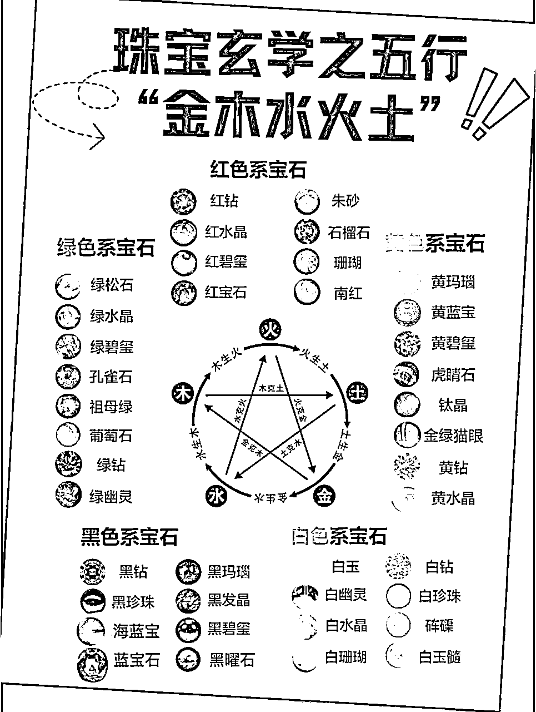

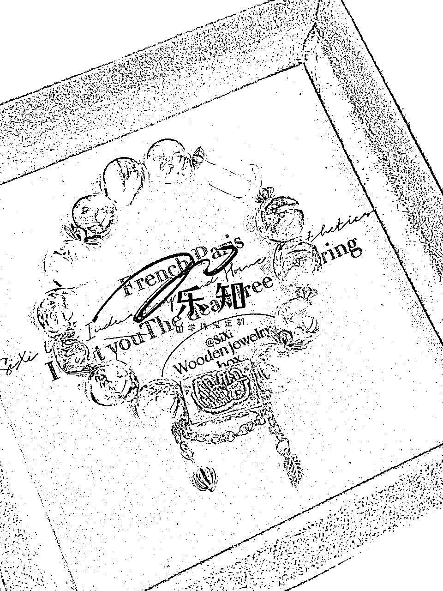

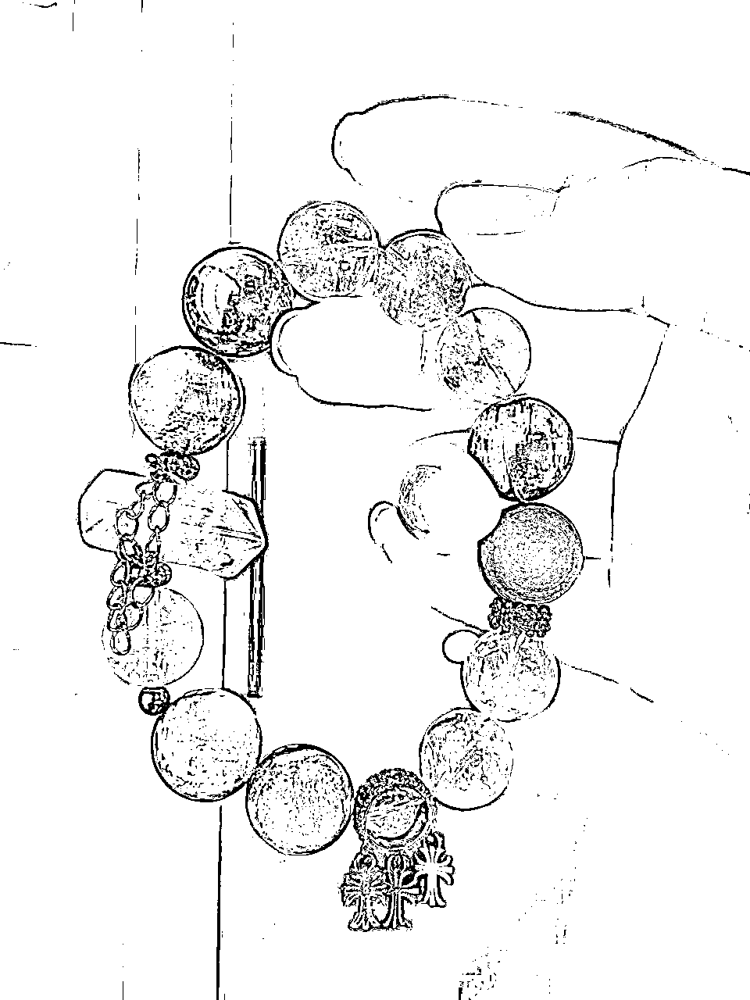

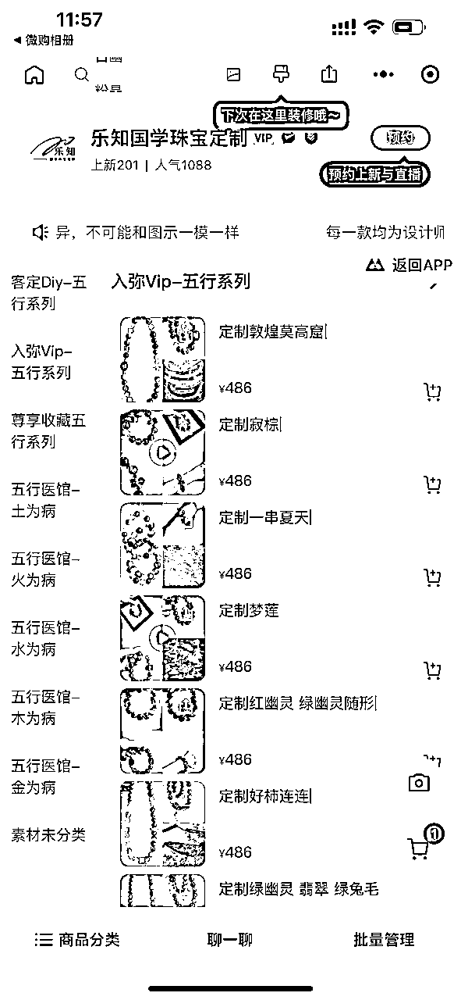

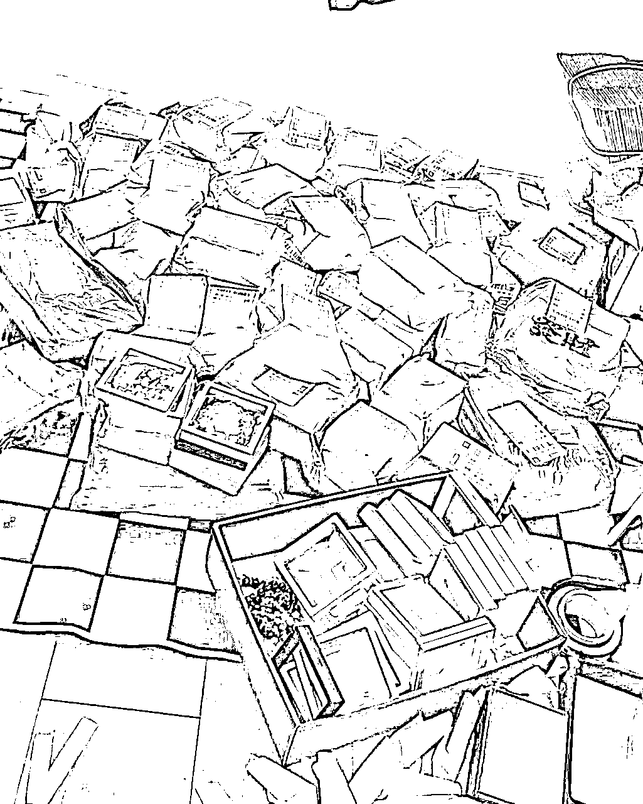

每周的发货量有50多单，属于先收款后发货。因为属于半定制产品，5-7天发货，不押款真的好香！

# 为什么会看好玄学五行水晶珠宝项目？

我总结了下七个原因

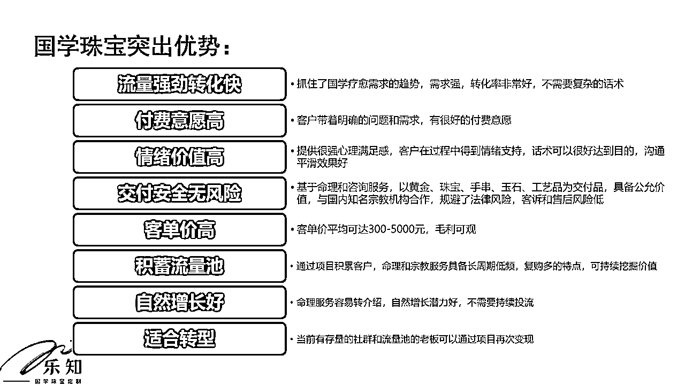

1、国学大热门:大环境下，人人都缺乏安全感和对未来不确定性，需要中国玄学,心理安慰，愈疗服务的支持。命理是中国人自己的心理医生。

2、首饰珠宝购买人群基数大，不管男性女性都想带首饰。十几亿的消费人群

3、流量强劲转化快：抓住了国学疗愈需求的趋势，需求强，转化率非常好，不需要复杂的话术

4、付费意愿高：客户带着明确的祈福需求，有很好的付费意愿

5、单价高且利润高：因为珠宝市场行情 客单价在300-5000元，利润在70%

6、情绪价值高：提供很强心理满足感，客户在过程中得到情绪支持，话术可以很好达到目的，沟通平滑效果好

7、交付安全无风险：基于免费命理和咨询服务，以黄金、珠宝、手串、玉石、工艺品为交付品，具备公允价值，规避了法律风险，客诉和售后风险低。

# 怎么卖玄学五行珠宝？

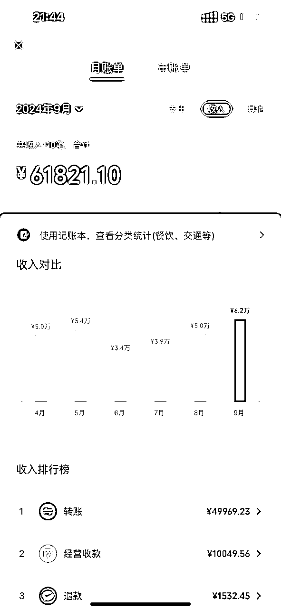

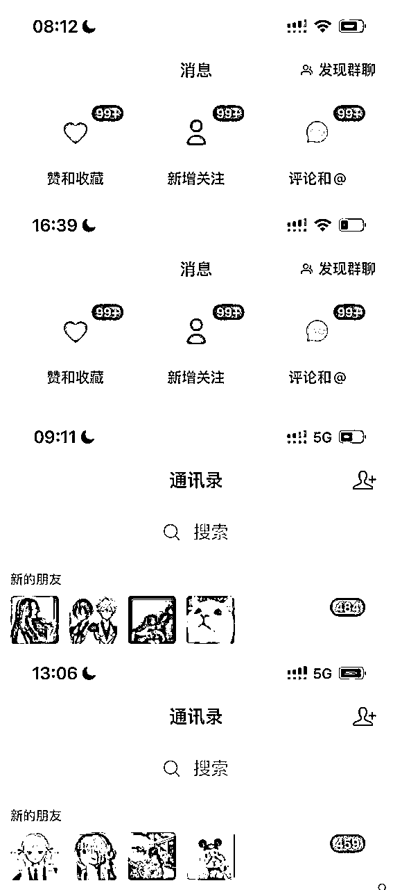

上图是其中一个账号的营业额，粉丝量不大，一个2300多粉，一个1900多粉，每个月销量还是很稳定的。

我也总结了以下做这个项目的全链路哈

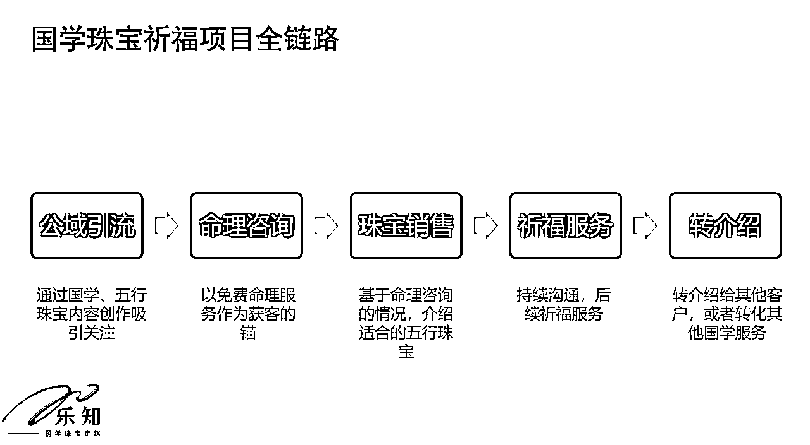

链路还是很清楚的吧，毕竟这个项目做了半年，销售话术sop流程也很成熟，我的两个助理一个负责销售下单，一个负责小红书引流。配合的很好我这边合作的手串是联系到水晶工厂去下单设计，可以一件代发。

整体流程很简单，手串好不好看不是那么重要，最主要是顾客说算命盘，运势很准。手串带有能量，帮到她。命理师傅是我朋友，每一单给20元即可。一开始想着app软件，gpt来搞定的，一个原因是不准，另外一个原因是这个是心理学，提供情绪价值的同时促单。也就是协助销售。

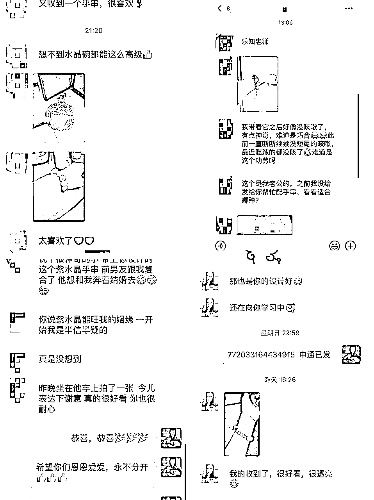

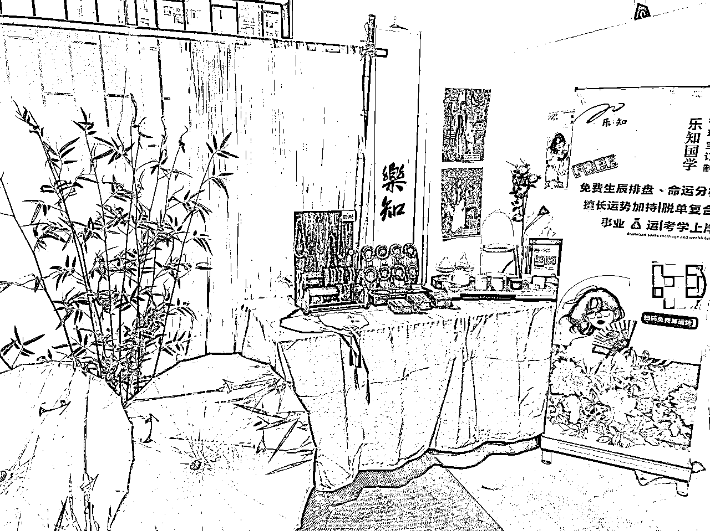

我自己也有在广州开2家线下店，圈友们，可以来挑选一下喜用手串呦，直接给你们代理价，嘻嘻，也可以约店里交流。