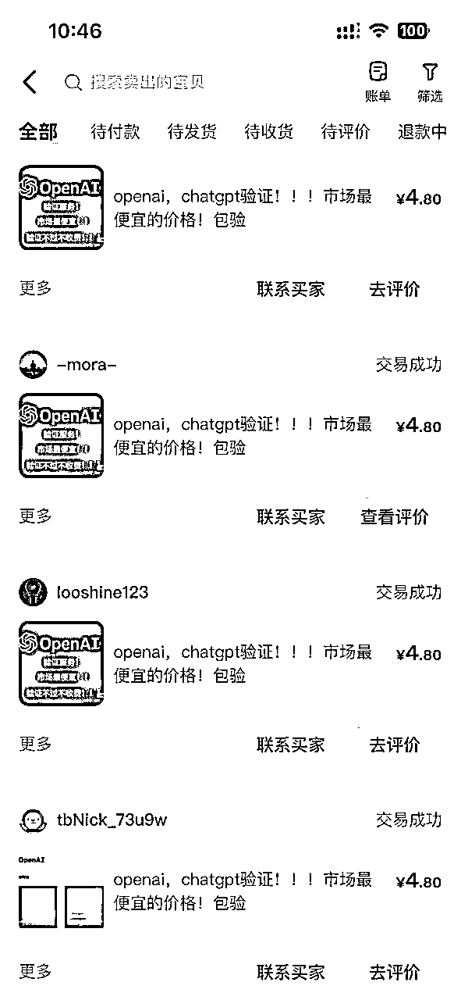
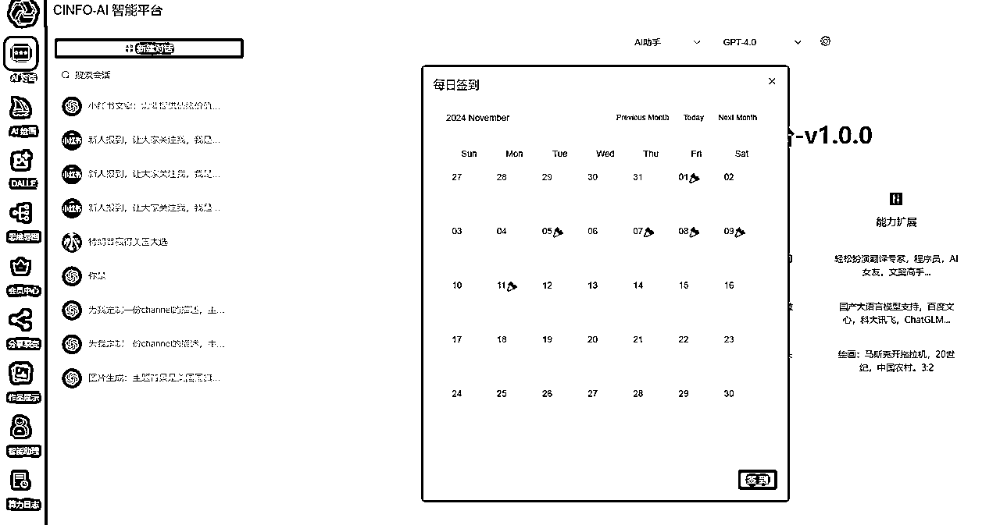
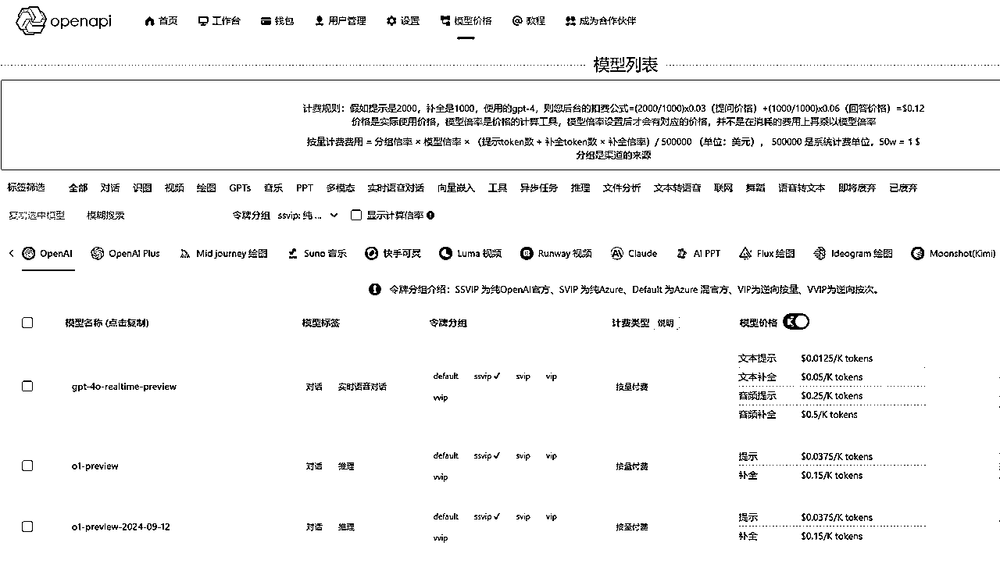
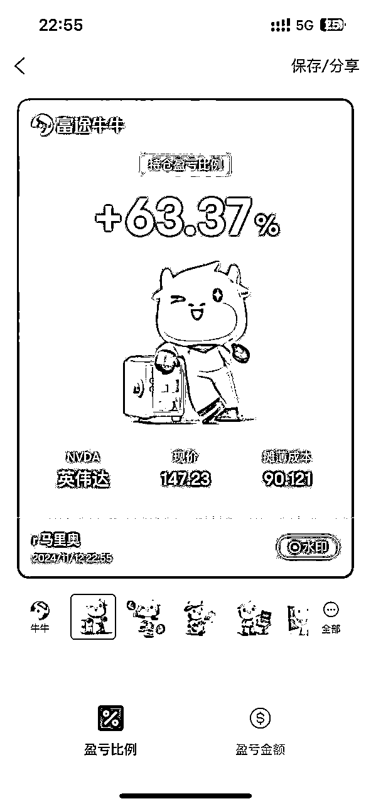

# AI应用实操经验

> 来源：[https://p28ciwe7j6.feishu.cn/docx/ADOudD4mro850nxyMnfcmxt6nlu](https://p28ciwe7j6.feishu.cn/docx/ADOudD4mro850nxyMnfcmxt6nlu)

嘿，大家好啊！今天我想跟你们唠唠我在 AI 项目里那些事儿，这里面可全是经验之谈啊。

## 一、AI 账号那些事儿

咱先说说 Chatgpt、Claude 这些海外的 AI 账号吧。一开始接触它们的时候，我就感觉这里面有门道。你想啊，那账号不好弄，对大多数人来说就像一座山，可这对我来说，那就是机会啊！刚有这些项目的时候，市场就像一块大蛋糕，还没几个人来分呢。我费了好大劲儿搞到账号，然后试着搞点小生意。一开始挣得不多，但每一笔钱都让我特高兴，就像是老天爷在告诉我：“嘿，你走对路啦！” 我就知道，新玩意儿刚出来的时候，要是能突破那些麻烦事儿，在没多少人竞争的情况下，准能捞一笔。

## 二、AI 套壳网站和小程序的坎坷历程

### 小程序

我在小程序这块儿可真是经历了大起大落。像 “chatgpt 对话”“chatgpt + 算命运势” 这些小程序，都是我搞过的。刚开始的时候啊，我也没整那些花里胡哨的，就弄了个特简单的体验功能，就放了一张图在那儿。嘿，你猜怎么着？就这么个简单玩意儿，每天还能有点收入呢！我当时就觉得，这事儿有搞头。

可后来呢，麻烦事儿就来了。微信开始管得严了，那些不符合规定的小程序都给封杀了，国家也出了政策要备案。这下可好，就像一盆冷水浇下来，好多搞小程序的人都不干了，市场一下子就冷清了。

### 套壳网站

再说说 AI 套壳网站，这玩意儿可厉害着呢，能装好多东西。刚开始的时候，市场没那么严，推广起来可容易了，就像在平地上跑步一样顺。我那时候可积极了，到处宣传，也吸引了不少人来用。后来虽然监管严了，但这里面还是有机会的，就是得换换思路，看看新的方向，找找新的用户。

## 三、AI 画图项目的那些门道

AI 画图项目里，像 comfyUI、炼丹这些，可都是技术活。

## 四、AI 卖铲子项目的生意经

AI 卖铲子这个事儿啊，其实就是给那些想用 Chatgpt、Claude 这些大语言模型的人提供方便。我发现啊，好多人想用这些玩意儿，但是那 api 调用可太麻烦了，就像一堵墙一样，把好多人都拦住了。我就琢磨，怎么能把这墙拆了呢？我就研究那个类似 openapi 的办法，让大家能轻松用这些厉害的 AI 工具。这过程可不容易啊，我得把 api 的原理搞清楚，知道它有啥限制，还得考虑大家用起来方不方便、安不安全这些事儿。

## 五、AI 快速验证项目的小妙招

AI 快速验证项目，就像用 Cursor 快速搞出个 mvp 项目，这可是我的一个法宝。现在这时代，干啥都得快，得赶紧看看项目行不行。我就用 Cursor 的那些方便的功能，很快就能弄出个最小可行产品，然后赶紧扔到市场上去试试。我就收集大家的反馈，看看这项目有没有搞头。要是不行，我就不浪费时间了；要是行，我就接着搞。这种快速搞、快速试的办法，能让我在这竞争激烈的市场里一直有优势。

## 六、都看好AI了，为什么不买AI股票

我这些年在 AI 项目里摸爬滚打，就明白了一个道理：在这个变化快得像一阵风的领域里，得眼尖，得一直学习，还得有胆子创新，这样才能抓住机会，干出点名堂来！