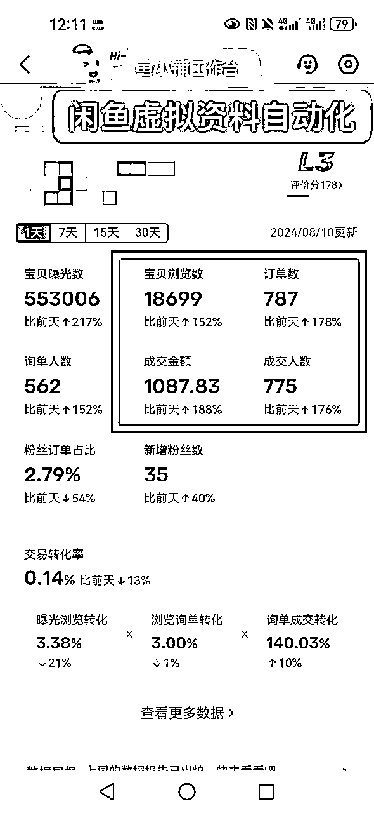
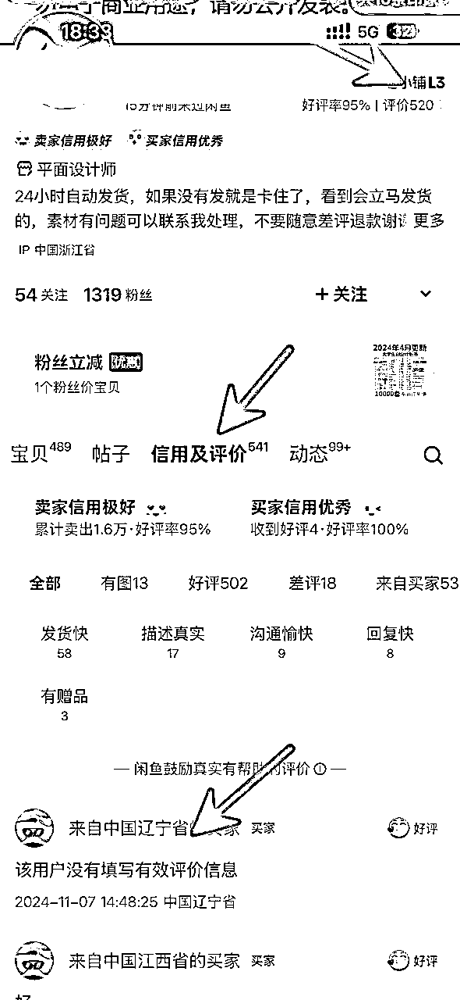

# 实操分享：闲鱼虚拟资料，小白新号快速起店的爆款5大选品方法，外加批量操作技巧！

> 来源：[https://el8yuvd870.feishu.cn/docx/AoO2dqWIjoJKoAxwGYicDJkEnjd](https://el8yuvd870.feishu.cn/docx/AoO2dqWIjoJKoAxwGYicDJkEnjd)

大家好，我是千城，做闲鱼项目8年多，也是生财 首次闲鱼航海主教练，及其多期闲鱼航海教练及其实操手册的编写者之一，这次给大家分享一下闲鱼虚拟资料 小白新号快速起店的实操方法。

似乎有段时间没有写文章分享了的，总感觉少了点东西，可能做成一件事。除过自己享受这件事带给自己的成功喜悦外。

还有就是将这件事分享出来，背后的逻辑思维点对别人有所帮助，及其这套方法流程又帮助到了更多人也享受到这份快乐，而带给自己的成就感就是缺的那部分吧。

其实想写这篇文章似乎很早了，奈何有点小懒，一直拖到了现在。但完全不影响整个方法的实操落地，及其背后思维逻辑的借用延伸。

下来言归正传，直接开始本次的分享，先上一个图。

新号2天198单，利润近600，当然还有比这更好的数据，单天利润900多，1000多，2000多的也有，其次也可以多号进行一个操作来的。

这里放这些数据，更多想证明，市场依旧在，并且下面分享的方法流程完全是经过实操来的。

# 闲鱼虚拟资料项目介绍，外加优势展现

可能写了这么多，不少人可能还不知道什么是闲鱼虚拟资料项目。简单做一个小的补充，外加介绍一下闲鱼虚拟项目的一些明显优势。

如字面写到的意思一样，我们在闲鱼软件上出售 各种虚拟资料，例如各种PPT模版，及其一些课程，资料的一个项目。至于资料哪里来，出单之后我们去市场好的采购一单，后期直接0成本，一直源源不断的进行整个出售来的。

而核心自然就是如何筛选市场需要的虚拟资料产品？ 及其如何进行一个编辑上架？ 外加持续不断源源将产品出售出去？

这个也是下来这篇文章要分享写到的。

这里先将 闲鱼虚拟项目的明显优势进行一个写到，也为下来如果进行一个操作的你，提前有个更好的了解，以便更确定性的下来进行一个操作执行来的。

*   近乎0成本，自己常用的手机即可操作，实物会涉及到周转资金，而闲鱼虚拟项目这块直接不用，无需提前采购，出单之后再去进行进行一个采购，并且可以后期持续出售，真正的一本万利，毫无成本担心。

*   可实现软件自动上传产品，并且出单之后自动发货，解放人力。实现一种“躺赚”的生意模式。有消息简单回复一下即可，不过很多都是自主下单，完了自动确定收货来的。

*   无需快递物流，自然这块就可以节省很多时间，出单之后直接无需物流发走，简单省事，并且也无需应对 实物多多快递短信退款的事宜。

*   批量化更快，并且后期占用时间偏少。流程方法理顺之后，软件快速同时多个账号进行一个选品上传操作，并且数据起来了，软件各自店铺自动发货，后期占用时间更少。

*   基本无售后，基本买到完了及时确定收货并好评，当然如果对方不满足，也可以直接全部给对方退了，对我们损失也不是很大。

几个优势这里进行一个补充，当然闲鱼实物我们也一直在进行，各有各的优势，实物单店盈利更多，也更稳定，并且可以累计沉淀整套闲鱼及其其他电商流程来的。

一个小小的补充完，下来就是整个项目具体的分享：

一 闲鱼虚拟爆款产品验证思路

二 闲鱼虚拟资料的4大爆款选品方法。

三 如何快速实操，外加设置自动上传自动发货，单人批量化。

# 一 闲鱼虚拟爆款产品验证思路

和之前操作闲鱼实物的流程一样，因为都是在闲鱼平台进行一个操作，核心底层的一些流程逻辑一样。

因为闲鱼目前没有类似于淘宝生意参谋，这类的数据分析平台。所以这里的闲鱼虚拟爆款产品验证思路，更多可以借用的就是 整个平台自己的一些数据进行一个验证分析来的。

下来逐一进行一个简单说到。

1）想要数

2）动态出售，及其动态出售屏蔽下如何评判近期出售情况。

3）看多家情况

这里以“大学生创业PPT”这个产品举例。

## 1）想要数

如下图所示，直接闲鱼 首页搜索“大学生创业PPT”这个关键词，就可以很明显的出现 想要数这个数据。

点击一个产品进入，然后点击“我想要”或者“聊一聊”一次便是一个想要数，而这里数据越大，就证明这个产品整体咨询人数较多。

自然闲鱼这里的“想要数”就可以作为一个我们初始的判断依据，一般比较建议至少选择想要数“100”以上的产品进行来的。

当然只有想要数，不能代表这个产品近期出售情况如何，更多只能说明，这个产品整体历史 搜索需求比较大，更多还是要看第二个评判标准，也是里面最核心的一个“动态出售”

## 2）动态出售

算是三个验证思路里面的，重中之重，这个数据下，可以更直观的看到这个产品，近期出售是否不错。

如下图，点击产品进入之后，再点击 这个产品商家的图像就可以进入，然后再点击“动态”就可以清楚的看到近期他的 动态出售情况如何。

而我们这里验证的这块产品，可以清晰的看到，近期出售还是有一些出售来的。这里一般建议动态里面 单个商家近期单天至少出售3-6个产品，就可以作为一个小的选择来的。当然这里出售越多越好。

### 2.1）商家动态屏蔽下如何进行爆款产品验证

当然这里做一个小的补充，目前有不少 闲鱼商户，直接将动态出售屏蔽了，没办法看到，如下图这样：

不过一样有评判标准，可以通过：

*   产品想要数：浏览数≥1:10；

*   店铺等级；

*   信用和评价；

*   下方留言时间。

进行一个综合判别，快速判别是否爆款来的。

逐一进行一个解释：

①想要数：浏览数≥1：10

上面解释了想要数的意思，而这里的想要数：浏览数，就相当于 有多少人看到了这个链接，然后进去咨询，那么≥1:10，就相当于10个人看了这个产品，就至少有一个人去咨询了解了这个产品，自然这个产品的转化率也是比较厉害的。

②鱼小铺等级：一般L3以上，就代表了近期出售情况不错，那么一般等于大于这个，也可以作为一个小的评判，也就是我们选的这个产品，近期出售多的概率也高了一些。

再有就看这里的“信用和评价”看近期确定收货，给到评价的近7天，是否有我们选的那个产品，及其占比怎么样，至少7天内有1条就说明不错，因为一般很少有人评价，而评价自动出现一般也需要发货后10天+15天才能显示，所以这里至少有1条即可，当然这里出现我们选定的那个产品，自然也是越多越好。

当然评价这块，也可以点击这个产品，下方也会出现这个产品，近期的一个评价，如这个7天内直接有2条，其中还有一个是1个小时前，自然是比较好的产品。

③下方留言时间：如上图，产品下方留言时间7天内至少有1条，而这里虽说是广告，但是15分钟前就有一个，也可以作为一个参数,证明这个产品权重在前面，广告一般也会优先 权重曝光好的产品来的。

而动态屏蔽下的几个数据参考，到这块也就截止了。综合进行一个 评判，当然里面 如果说重要性：信用和评价＞想要数：浏览数＞下方留言＞店铺等级

### 3)看多家情况

单个产品的评判总是存在很多的偏差，所以需要查看多家，最终达到将这个偏差尽可能消除殆尽。

这里我们至少查看3家 近期想要数比较好的产品，去看他的“动态出售”，完了进行一个整体判断来的，如果完了至少3家近期这个产品都满足上面两个点，那么这个产品就可以作为一个评判选定来的。

以上也就是如何评判单个产品是否是爆款产品的 验证思路。

可能之前接触过闲鱼项目的人发现，似乎和之前实物产品的评判标准一样，无非多了一个“动态屏蔽下如何评判部分”的补充。

“1+1＞2” 似乎在数学理论里面，并不成立，但是在做事方面却是这样，用心做好一件事，收获远远大于同时多件事、而这里的闲鱼就是，之前实物有所积累，那么再进行闲鱼其他的细分类目的时候，会发现会轻松快速很多。

当然也会有不少的差异区别，但是本质的一些东西不会改变。

言归正传，似乎写到这，不少人可能已经开始磨刀霍霍，准备大干一场了，但有个小的前提是，只知道了验证思路，很容易发现一件事，刚开始还知道哪些产品及时去搜索验证，但是越到后期越感觉到吃力，竟然不知道选哪些产品了？

自然该说道的这部分都会说到，也就引申出来了第二个部分。

# 二 闲鱼虚拟资料的5大爆款选品方法。

其实不少和闲鱼实物选品也有相同，但是具体的还是有些区别，下来就逐一进行一个讲到，并且也说到，标题说到的新号3天单天盈利近600，及其单天盈利1000+的选品方法。

## 1)日常法：

直接将自己换位成虚拟产品，购买力最强的大学生，研究生，当然也可以问身边的一些这些身份的朋友亲戚，而这里举例的大学生创业PPT就是明显的一个，还有毕业PPT模版，四六级的原题及其往年考题也都是，当然可以继续不断延伸。

再着就是想想自己日常需要购买哪些 虚拟产品，给孩子买的各种纪录片，育儿方法，幼儿园试讲PPT，当然还有各种新上映的电影，电视剧(当然这里有版权，需要注意，但是可以快速赚一笔块钱。

## 2）平台推荐法：

我们日常经常搜索虚拟相关的产品的时候，平台首页点击搜索框，也就会出现不少的相关的热销虚拟产品。及其主页也会推荐不少日常热销的一些产品，这里两个点也都可以作为一个快速选品方法来的。

## 3）词根法

虚拟产品这块会有不少的核心关键词，而这里我们就可以直接搜索核心关键词，然后根据多个平台的下拉词，及其搜索出现的产品，这里进行一个补充延伸。

常见的有：教程，资料，笔记，模版，数据，配方，纪录片~

当然“自动发货”“秒发”也可以作为一个关键词，因为不少做闲鱼虚拟资料这块同行，都会在前面加上，而我们也可以进行一个借用来的。

下来将整理的一份部分 虚拟产品这块常见的 词根库，按照分类进行的一个汇总，截图给到。

这里我们以“模版”为例，进行一个演示说到：

我们直接搜索 “模版”关键词，这里就直接出现了 下拉词汇，当然一个词汇就是一个产品，不过我们需要选的更多是闲鱼虚拟资料类的，方便我们后期设置 一次购买一直进行出售，而其他虚拟服务可以先跳过，后期有想要尝试也可以进行。

“模版PPT”“模版简历”直接出来，接着直接点击搜索，也出现了具体的“商业计划书模版”“职业生涯模版”当然往下拉自然还有不少，就可以各自按照我们 第一部分说到的 选品验证思路逐一验证。

当然这个方法也适合直接去 淘宝，拼多多，小红书等其他电商平台搜索延伸验证来的。

## 4）市场热点法

也就是 这部分选品方法 说到的新号2天盈利近600收益，及其单号日利润1000+的选品方法。

当时刚好赶上了 高考结束，出高考成绩，想着高考这个词算是一个热点的词，就及时的搜索，就发现了“高考志愿填报”这个产品，结果当天上当天就出了40多单，利润就200多，第二天直接198单，例如将近600。

并且将这个产品复制多个店铺，及其给多个好友说到，并且无一例外，都是快速爆单，盈利，算是赶上了一波，前后也持续了至少20多天。

### 4.1）时间节点热点法

而这个就属于 市场热点法里面的时间节点热点法。

当然后面进行一个延伸，例如暑假期间的各科各年级的一些电子版书籍；还有就是一建二建，社工，经济师这些最后数据都不错。

而这些也都有迹可循，每年年底的年会演讲PPT模版需求增加；每年6,7月份的毕业论文答辩，及其个人简历模版爆火；还有每年几月份的考试。英语四六级一般就在6月末的周末；高考6月7,8号；初级会计5月中旬。

其次时间节点热点法下一些虚拟事件，及其部分爆款 也有做一个整理。

这个时候我们就可以，提前1-2个月提前布局，然后进行一个操作即可的。

这里就可以不断进行一个累计，今年爆火的产品，到了明年依旧属于一个爆款，就可以先别人一步提前开始进行一个操作来的。

### 4.2）热点趋势选品法

说完了市场热点法的 时间节点热点法，下来就是 热点趋势选品法。

例如之前爆火的哎呀咿呀照片动图教程；羊了个羊游戏通过攻略；抖音爆火的一些短剧；还有最近比较火的AI聊天软件；

这类没有规律可循，很多时候都是一波来的，而我们需要做的就是经常看朋友圈近期爆火的信息，及其抖音，小红书这些，然后完了之后及时闲鱼进行一个验证，及时抓住，指不定就是一个异常爆款的产品来的。

### 4.3）爆火行业热点法

比如今年比较爆火的 AI行业，及其视频号行业，外加小红书。

自然而言及时的主关键词搜索，然后就可以发现AI聊天软件似乎就是一个挺可以的产品；视频号这块的视频下载软件，当然同理后期可以不断延伸~

## 5）同行店铺法

这个方法就简单快捷很多，并且可以依据上面4个方法，可以快速找出市场其他更多好的产品来的。

例如我们上面举例说到的“大学生创业计划书”的时候，就发现她的动态还出售“开发简历模版”“各行业运营SOP”~

那么是不是找到一个产品的基础上就直接多了 好几个产品，然后完了我们继续不断各自验证，验证的过程又可以发现不少好的同行，看到他们同行动态或者宝贝里面 不少想要数高的爆款产品。

自然而言，源源不断的进行了一个验证来了的。

而这个方法完了，也可以借用 整个闲鱼选品方法，完了再去淘宝，拼多多，等其他电商渠道搜索，查看各自市场出售好的产品，及其从店铺内发现其他好的产品，不过需要注意的务必最终回归到闲鱼市场，按照闲鱼市场验证思路进行一个闲鱼爆款验证。

因为平台不一样，不少淘宝，拼多多出售好的不代表闲鱼出售的也好，而这里我们更多做闲鱼，所以务必最终回归到闲鱼平台进行验证来的。

大家知道了闲鱼虚拟爆款产品如何进行一个判断验证的方法思路，外加也掌握了快速挑选爆款产品的5大选品方法，这个时候已经挑选好了市场好的产品，那如何快速进行一个编辑上架操作，外加批量化操作，也就是下面要写到的部分了。

# 三 如何快速实操，外加设置自动上传自动发货，单人批量化。

因为是虚拟资料，也不涉及什么提前拍下，或者找货源部分，当我们选好产品之后就可以直接进行一个上传，也不需要提前进行一个购买。出单了之后，到时再搜索关键词在闲鱼市场找市场出售好的产品进行购买，到时发给用户即可的。

而下来也该这部分核心：如何快速实操，外加单人批量化的部分了。

快速编辑上架，最简单的方法就是参考同行，好的标题进行一个修改，图片裁剪，修改一下照片的MD5值（每个照片独有的识别参数），看他们发在那个地方，我们也直接修改发布即可，然后完了直接就可以进行一个上传操作。

当然这部分也可以直接软件进行一个快速操作，借助软件进行闲鱼，淘宝，拼多多等各种电商渠道自动采集，外加自动发布，采集的时候自动修改了照片的MD5 值，并且支持采集的时候批量加减价格进行采集，完了也可以直接进行单个，或者多个店铺发布。

也可以进行整个闲鱼，或者淘宝店铺采集，并且可以根据 想要数进行一个排序，完了进行一个采集上传。

软件网址：https://ruyi.api-z.cn/

这里不做太多说到，思路方法进行一个提供，当然单个手机，手动进行一个操作完全没问题，并且也建议先前期手动从0-1进行操作，而如果对软件感兴趣的，完了到时再说。

单个产品流程走顺，完了就可以直接多号借助软件进行一个快速批量操作了的，上传这块的软件已经说到。下来出单之后，如何进行一个自动发货设置，解放人力，这里也及时进行一个补充。

借助闲管家进行设置

搜索网址：https://www.goofish.pro/ 进入之后，先注册账号，完了进行登录。

按照要求绑定账号之后，如下点击按照要求设置即可。

这种方法，可以手机灭屏下，出单后自动发货，不过前期没有开通鱼小铺权限，记得卖出去后及时上架。

还有阿奇索，和闲管家设置差不多，并且属于第三方软件，也可以进行后咨询他们客服设置即可。

顺带说到操作过程中的注意点：

1 前期消息务必及时回复，比较重要，消息通知打开，没事经常看着。

2 挑选市场 满足上面选品验证思路 近期出售爆款的产品进行操作，想要数至少100以上。

3 前期每天至少上传5个左右产品，别太少，也别太多，没有开通鱼小铺上满50个产品，开通了200个链接来的。

到这，这篇文章也到了该说结束的时候了，希望对你有所帮助，更多希望的还是及时进行一个操作，闲暇时间，也可以多一笔额外的盈利，自然数据好了也希望可以来个反馈，也获得一份开心。