# 宠物攻略解说视频复刻：Youtube shorts 制作实操

> 来源：[https://e6tnf5bko1.feishu.cn/docx/AuCedbFOToNQIsx95GHcG7kmn3k](https://e6tnf5bko1.feishu.cn/docx/AuCedbFOToNQIsx95GHcG7kmn3k)

大家好呀，我是龙，生财第8期新圈友~

这篇帖子想跟大家分享Youtube shorts中的【宠物攻略解说类】视频的复刻细节，灵感来自于@老馬🐎内容出海的分享帖 （如下图）

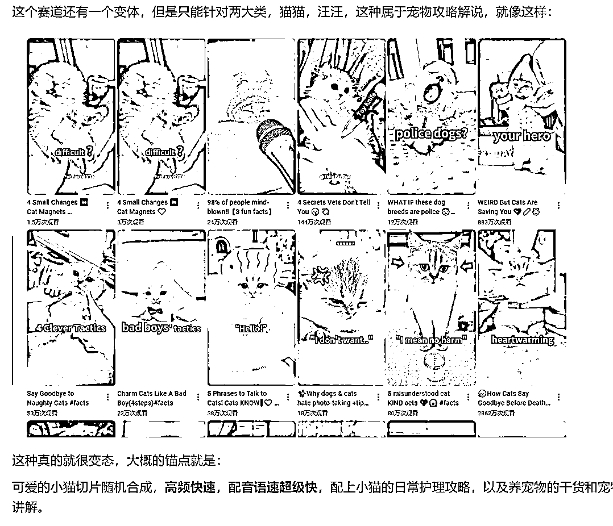

PS：感谢大佬超级细节的分享！！！我后续复刻AI猫猫视频也是跟着 这篇跑的实操

本文主要内容如下，圈友们可以按需阅读：

1、为什么会选择【宠物攻略类】赛道？

2、【宠物攻略类】账号收益分析（含类似频道分享）

3、【宠物攻略类】账号选题分析

4、【宠物攻略类】视频复刻全流程（部分AI辅助）

5、起号计划及难点分析

6、尾声

# 1、为什么会选择尝试【宠物攻略类】赛道

这次亦仁老大分享的超级标主要是通过AI生成视频发布在Youtube和shorts上获取流量收益

但不同的AI shorts的制作难度明显不一样，例如，【AI猫猫视频】的制作就比【AI萌娃走秀】要复杂一些

于是，我结合了自身情况、具体赛道难度和不同赛道收益情况进行了一轮筛选

自身情况：

此前对AI工具的运用仅限于chatgpt和kimi等聊天模型，没有接触过AI绘画和AI视频

基于这一情况，我前期选择的赛道需要满足以下标准：

①能看得懂对标账号的视频大概是怎么做出来的，或者能在网上找到教程，方便进行模仿

②对标账号至少有一部分是开通了YPP的，咱们的目标是赚钱，如果选了开不了YPP的赛道，那不是白忙活

确定了选择标准，我就结合@钱塘江鲤的分享帖 和@老馬🐎内容出海的分享帖 进行筛选

在选择赛道这个事情上，我给自己设定了一个标准：10/31和11/1这两天就要选出至少一个方向，然后开始尝试复刻

因为我是有点完美主义的人，如果不给自己设定一个期限，很可能会执着于找到一个“完美”的赛道（能看得懂、可以开通YPP、制作难度低、竞争对手少）再开始尝试，但显然这是不太可能的，尤其对于一个刚接触youtube的新人来说，一开始就找到这种蓝海赛道无异于异想天开

经过两天的筛选，我初步选定了AI猫猫（图1）、AI转绘（图2）、宠物攻略解说（图3）这三个方向进行尝试

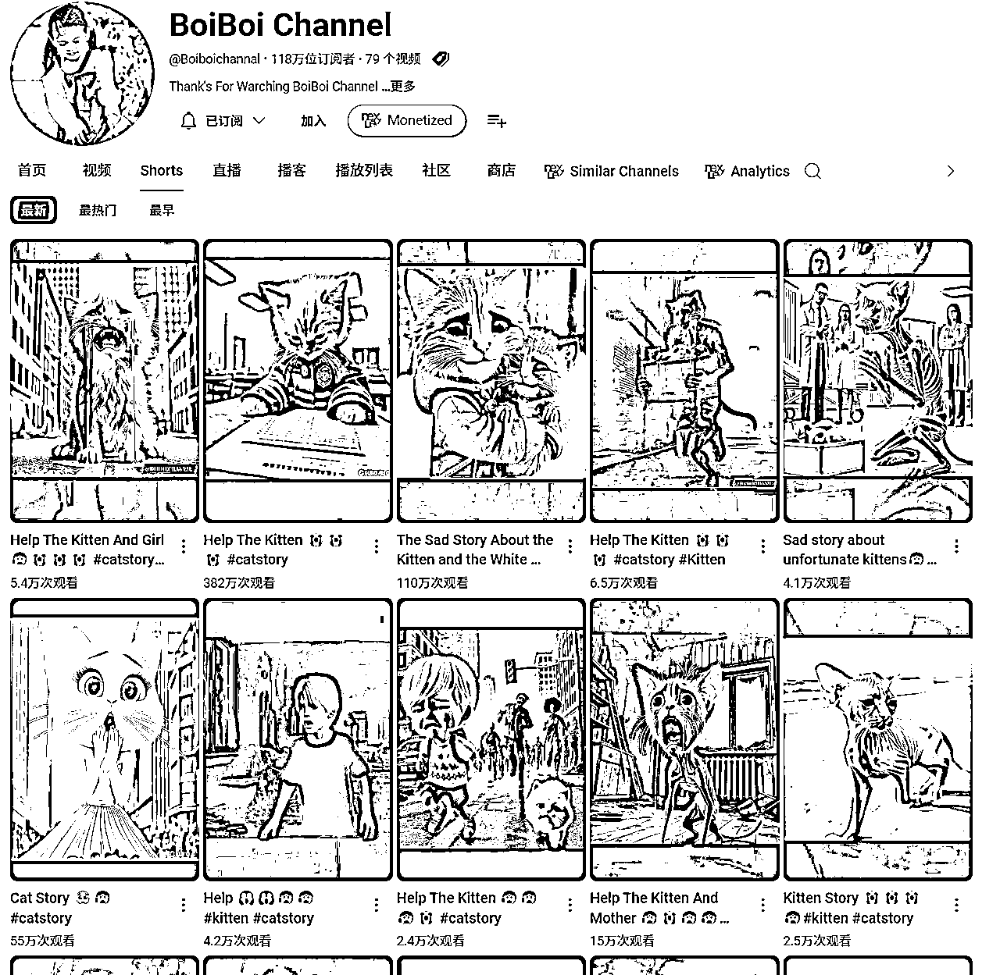

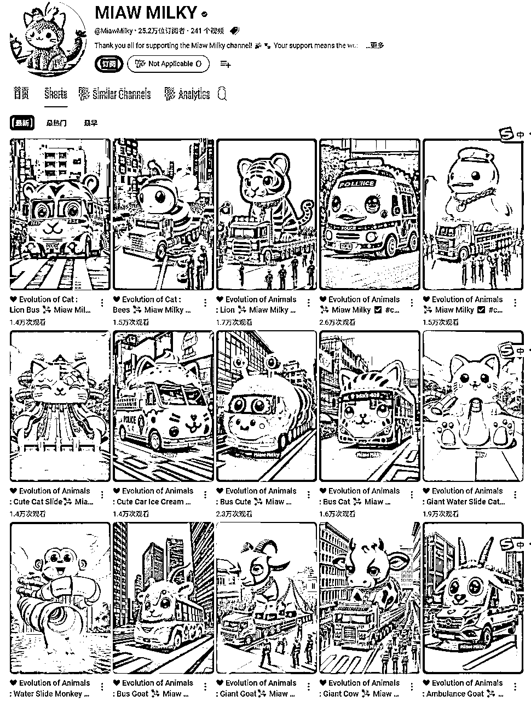

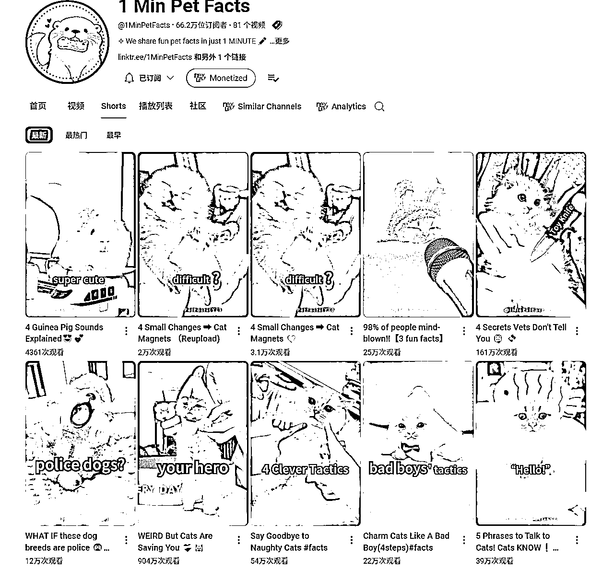

AI猫猫和AI转绘都可以完全用AI生成，而宠物攻略解说在配音上可以用AI辅助，剪辑和找素材这两块还是要手搓

这次亦仁老大在youtube ai shorts的超级标之后跟进了一个龙珠悬赏，我当时想的是，应该会有比较多圈友尝试AI方向，如果结合圈友的分享我再去尝试AI方向，应该会比自己摸索要快很多

而宠物类的尝试和分享可能没那么多，因为宠物类相对于AI类来说还是比较低效的，手搓会花比较长的时间，但@老馬🐎内容出海在 也有分享这个赛道，大佬准备下个阶段起这种号，说明可能还是有机会的，我就很想尝试下看看

而且宠物类涉及的技能基本都在我的能力范围之内，AI改写逐字稿用chatgpt就可以，配音的话，生财也有圈友分享了一些AI配音网站，找素材和剪辑我之前自己做视频接触过，难度不高

综上考虑，我最后就决定先尝试复刻宠物攻略类，再结合圈友的分享去尝试AI类

目前进展是宠物攻略类基本跑通了1:1复刻，AI猫猫和AI转绘类也在结合圈友的分享尝试中，所以这篇文章先给大家分享宠物攻略方向的分析和实操

# 2、【宠物攻略类】账号收益分析

选好赛道之后，下一步就是找对标账号，分析一下大概的收益空间

## 2.1 找对标的方法

1.  根据 中提供的对标截图，直接根据标题在youtube搜索，找到第一个对标账号

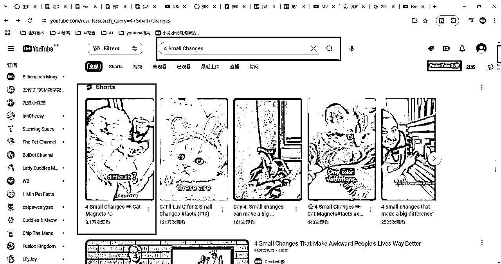

1.  根据@老馬🐎内容出海在 中提供的找对标方法①，把找到的第一个对标账号关注、点赞，然后点回首页，刷新，看到很像的视频就点进去看看账号

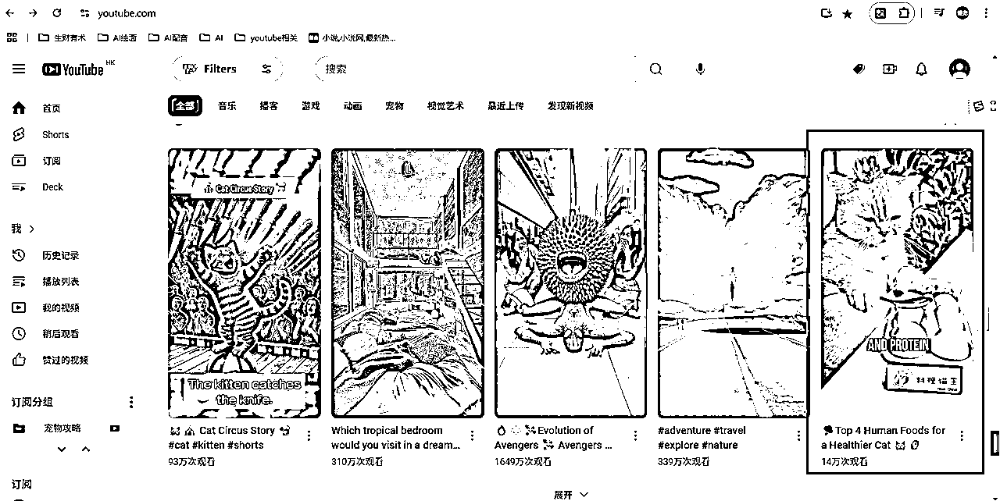

经过多次类似的操作，目前一共找到了7个对标账号（如下表）

| 对标账号 | 所在国家 | 视频数 | 订阅数 | 播放数 |
| https://www.youtube.com/@1MinPetFacts | / | 81 | 66.2w | 318,799,186 |
| https://www.youtube.com/@ladycuddlesmeow | / | 1203 | 76.2w | 668,569,138 |
| https://www.youtube.com/@catpawcalypse | 美国 | 77 | 26.9w | 81,712,070 |
| https://www.youtube.com/@PetsCofe | 美国 | 92 | 7.93w | 19,775,560 |
| https://www.youtube.com/@cuddlecatstales | 摩洛哥 | 360 | 18.2w | 110,939,889 |
| https://www.youtube.com/@ChipTheManx | / | 923 | 48.9w | 361,910,856 |
| https://www.youtube.com/@petfactum5343 | 拉脱维亚 | 140 | 30.9w | 171,845,644 |

说实话，感觉数量有点少，而且有一些账号不是全部都做宠物攻略的，还有其他类型的选题

不知道是我找的方法不对还是这个赛道本身人就不多

## 2.2 典型对标账号分析

这次我选的对标账号是https://www.youtube.com/@1MinPetFacts

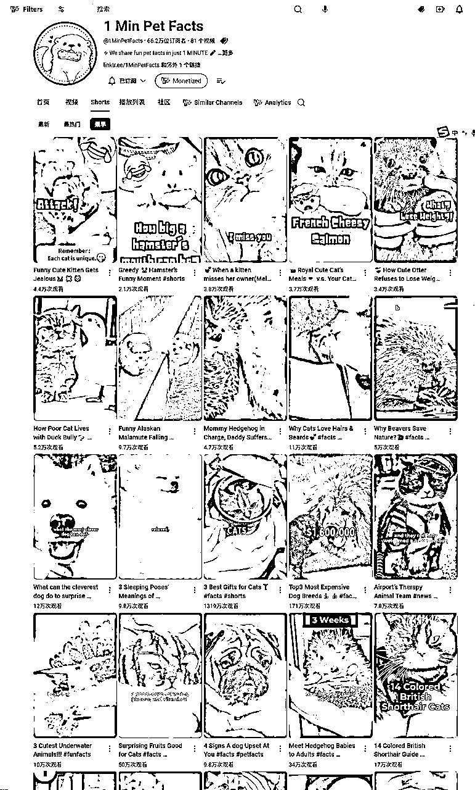

这个账号比较典型，大部分内容都是做的宠物攻略解说（小猫/小狗），从2023/6/27开始发布第一个宠物攻略类视频（红框），在这之前的视频都是可爱小动物片段拼接，而在2023/6/27之后发的就全都是宠物攻略解说

前期的更新频率为1-3天一更，这个速度是可以接受的，我第一次复刻这个视频，全部流程花费时间约9小时

而从更新宠物攻略类开始，第5个视频（绿框）就爆了，1300万次播放

这个账号的流量比较稳定，没爆的视频一般是几万到几十万流量

而且生命周期较长，从23年6月出现爆款以来，时不时也还会出现百万级和千万级的爆款

最近的百万爆款出现在24年8月，近千万爆款出现在24年6月

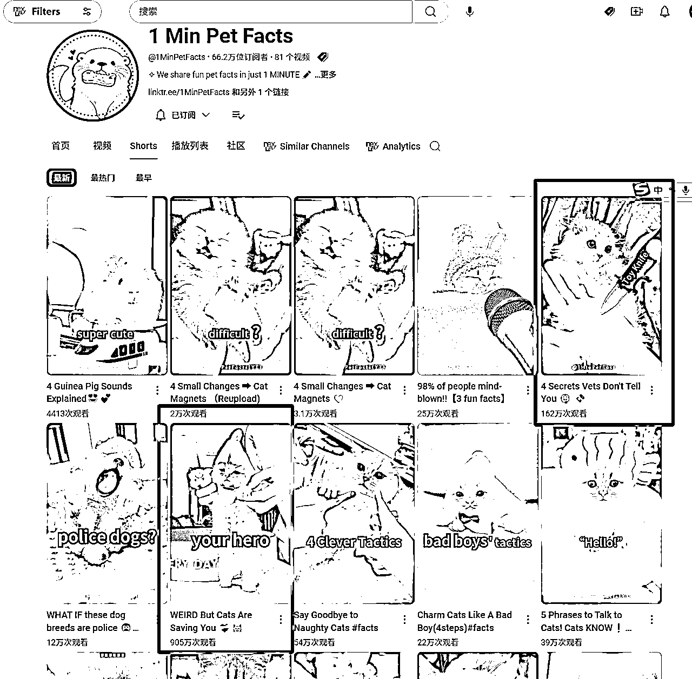

## 2.3 对标账号收益分析

接下来我们仔细分析一下这个对标账号的收益

这个账号只发了4个长视频，而且播放量都只有一万左右，对收益的影响基本可以忽略不计

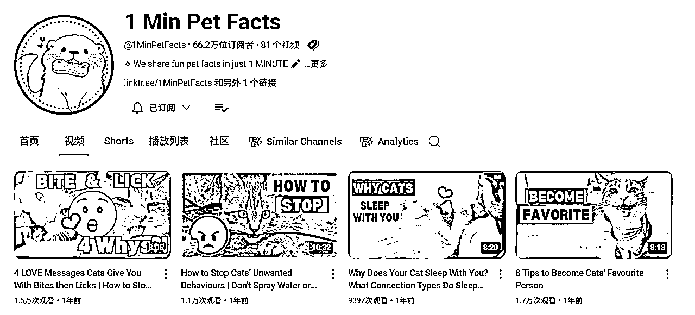

看一下主页，这个账号的总播放量为3.1亿，我们减去开通YPP需要的1000w，shorts播放量总共是3亿

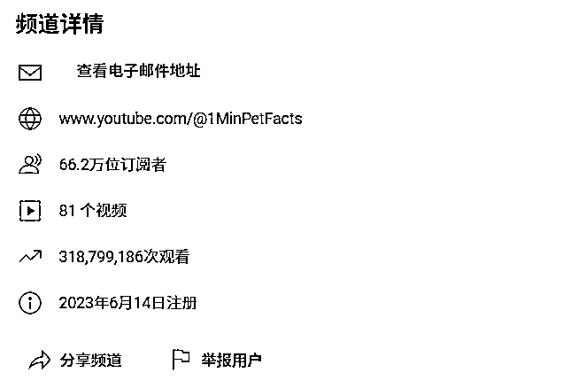

参考@老馬🐎内容出海在 提供的收益计算方法，万播1刀

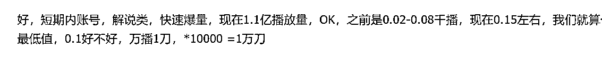

对标账号总收益=30000w/1w*1=30000刀=21w RMB

这个账号总共发了88个视频，我们按90个视频来算

每发一个视频收益=21w/90=2333 RMB

再细化，我复刻对标账号的一个典型视频，第一次复刻花费时间约9小时

（当时的记录，大家大概有个概念就行，统计下来就是9个小时左右）

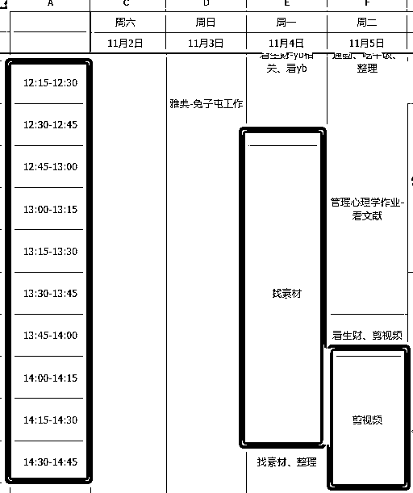

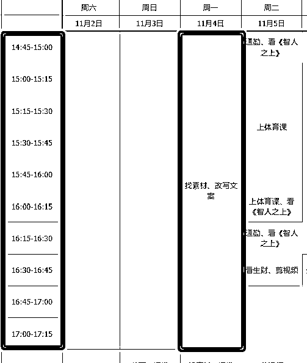

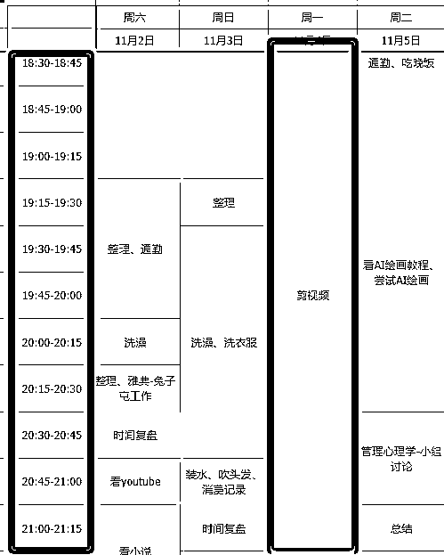

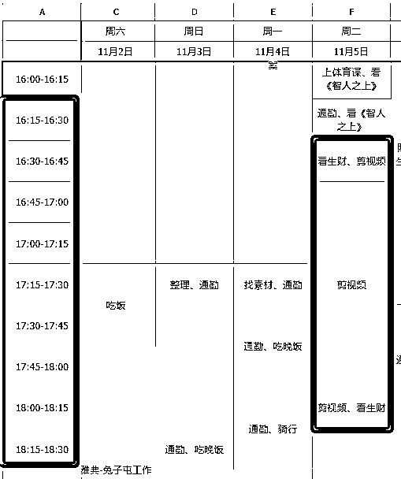

我们就按一个视频9小时来算

每小时收益=2333/9=259 RMB

这是按我第一次复刻得速度来算的收益，都能达到时薪260RMB，熟练剪辑还可以更快，收益有多高显而易见

市面上剪一个视频几十块几百块，youtube shorts跑起来，一个视频2300RMB，你选哪个！！！

计算收益这一步我感觉还是蛮关键的，目的就是让我们的收益和希望具象化，更有动力去做项目

在没有写这篇文章之前，我没有仔细算对标账号的收益，我知道这个账号赚钱，但具体赚了多少，我其实很模糊

现在一算下来，一个视频2400RMB！！！剪4个视频月薪过万，这不得猛猛干呀！！！

# 3、【宠物攻略类】账号选题分析

以对标账号为例，这个账号的爆款选题基本都是猫猫相关的攻略分享

（狗狗也有，但是很少，播放量也只有百万左右）

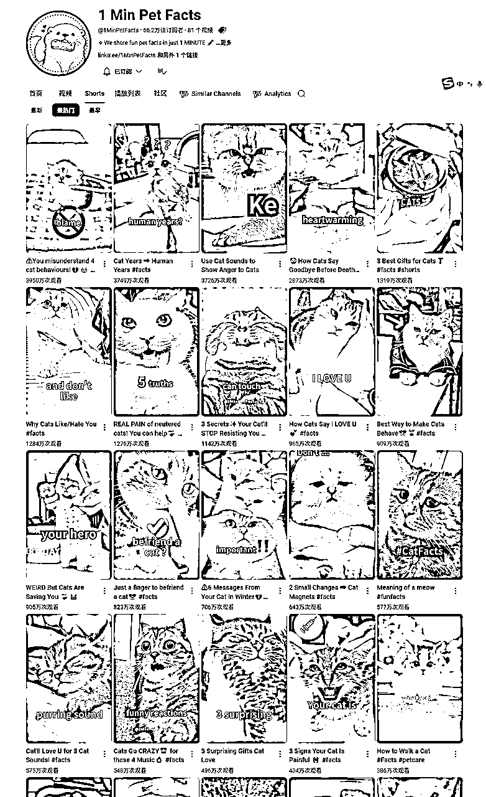

下表统计了千万播放的选题及相关信息

| 选题 | 发布时间 | 播放量 |
| You misunderstand 4 cat behaviours! | 2023/12/27 | 3950w |
| Cat Years ➡️ Human Year | 2023/10/25 | 3749w |
| Use Cat Sounds to Show Anger to Cats | 2023/8/24 | 3726w |
| How Cats Say Goodbye Before Death | 2024/3/17 | 2873w |
| 3 Best Gifts for Cats | 2023/7/3 | 1319w |
| Why Cats Like/Hate You | 2023/7/24 | 1284w |
| REAL PAIN of neutered cats! You can help | 2024/3/10 | 1276w |

选题大致分为：

①如何解读猫猫的一些行为，例：You misunderstand 4 cat behaviours

②如何对待猫猫，例：3 Best Gifts for Cats

如果后续要模仿对标账号来起号，思路就是先模仿后超越：

①先把找到的对标账号所有百万播放选题进行统计和收集

②结合发布时间和播放量，优先模仿时间近、播放量高的爆款（今年爆＞去年爆，千万播＞百万播）

这里也存在一个问题，如果对标账号不多，爆款选题都模仿完了，后续原创怎么做？

youtube上面的选题模仿完了，我们可以从其他平台找爆款选题迁移到youtube

①优先从tiktok上面找到类似的分享宠物攻略的博主，同样按播放量和发布时间来模仿爆款选题

②外网的我们都找完了，也可以从国内去找类似的博主，在抖音、小红书这些平台找

从其他平台找的爆款选题可以参考内容，但不能全部照抄

对标账号的视频基本都是在1分钟之内，不会太长，但也可以容纳一定量的干货内容

可以把其他平台对标的逐字稿下载下来，用AI修改成一分钟以内的篇幅，开头部分模仿youtube的对标

# 4、【宠物攻略类】视频复刻全流程

下面就是重点内容，如何1:1复刻对标账号的爆款视频

结合播放量和发布时间，我选择了“WEIRD But Cats Are Saving You”这个视频进行复刻

该视频发布于2024/6/30，播放量为905w

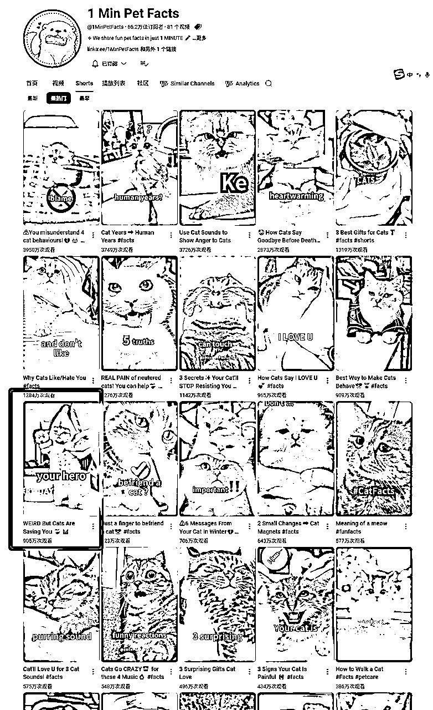

以下为对标视频（左边）和我做的复刻视频（右边）

接下来我会给大家详细展示，如何从文案、配音、画面和BGM这四个方面1:1模仿对标视频

## 4.1 逐字稿抓取和改写

首先，我们得把对标视频下载下来，我用的是这个下载器（在生财里搜到的）

https://ytshorts.savetube.me/zh/29-youtube-video-downloader-1keen2

接着，我们需要抓取这个视频的逐字稿，我先尝试了圈友推荐的这个工具

https://chromewebstore.google.com/detail/youtube-summary-with-chat/nmmicjeknamkfloonkhhcjmomieiodli

但实操下来发现这个插件只能抓取长视频的字幕，shorts的抓取不了

这条路不通，那咱们就用Google大法，找到了这个网站，可以直接抓取shorts的字幕，还能多语言输出

https://www.downloadyoutubesubtitles.com/zh

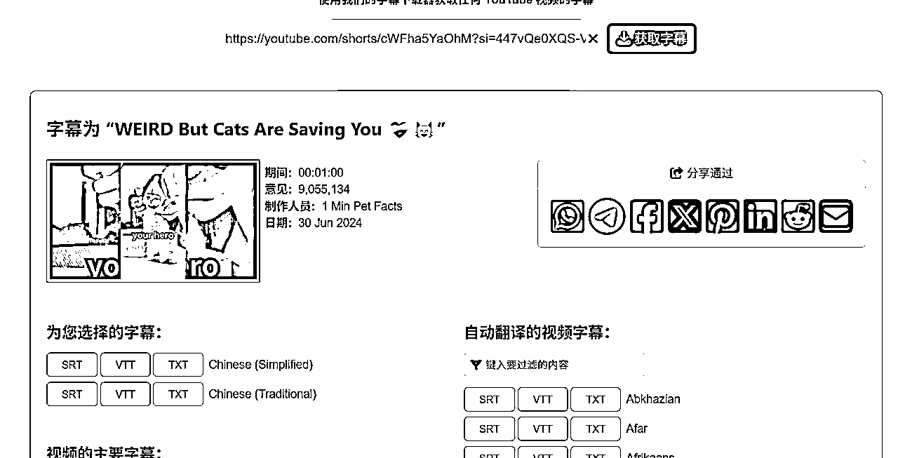

但这个网站抓取的字幕有时候可能不太准，大家记得检查一下，像我这里抓取的字幕，four抓取成了or

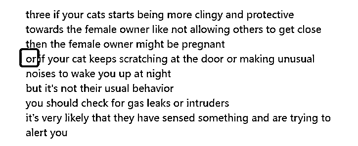

为了防止文案和对标一样导致查重，我用GPT对文案进行了简单的修改

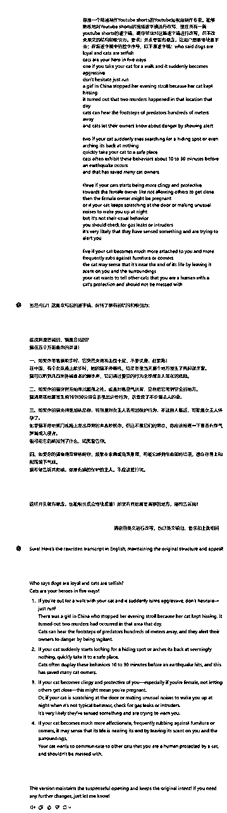

改写之后的文案和原文案差别不大，感觉后续还可以继续优化下提示词，篇幅重合太多怕过不了原创

## 4.2 AI配音

因为画面是根据文案和配音去混剪的，所以我们先搞定配音，然后再去处理画面

配音我用的是https://elevenlabs.io/app/speech-synthesis/text-to-speech

大家可以点击左侧的Voices，然后再LIBRARY选择合适的音色即可

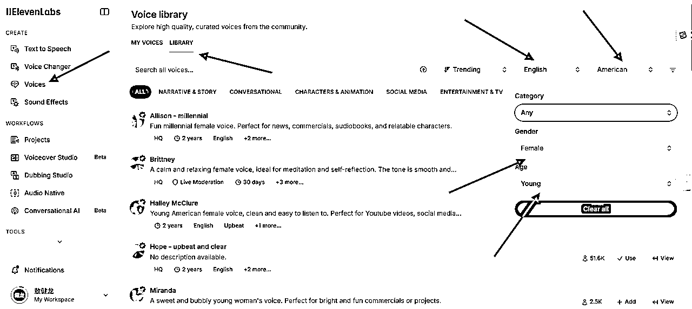

我选择的对标视频的音色是年轻的女声，我就根据要求选了English、American、Female和Young

大家选几个音色听一下，哪个和对标视频比较像就选哪个

选好音色之后，点击MY VOICES，在你想要的音色右边点击USE，就会弹出文本框

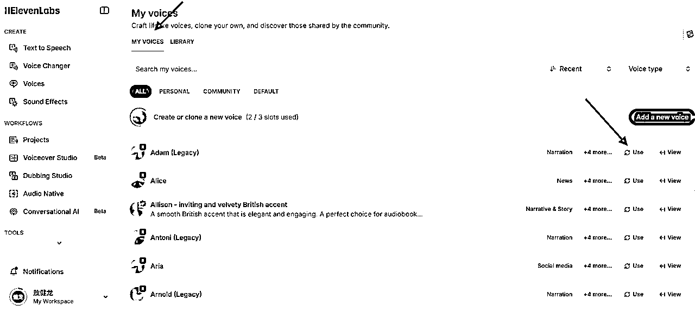

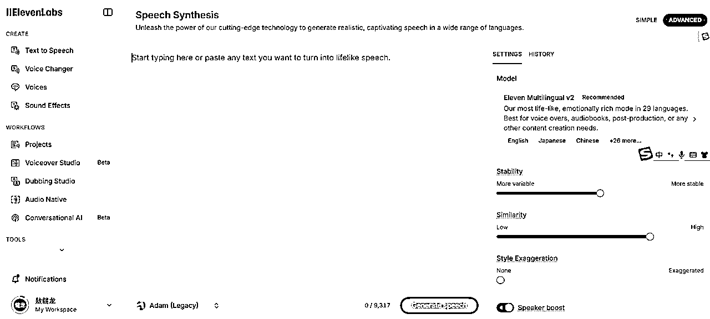

直接把我们准备好的文案复制粘贴进去生成即可

这个网站有10000个单词的免费额度，超出的话就要会员了，本来这一环是需要成本的，但后面看@SunDay的分享发现open ai的网站https://ttsopenai.com/可以免费无限度配音，这块的成本就省去了

在生成配音的时候，我稍微踩了几个坑，这里也分享给大家：

1.  我复刻的对标视频中，其实一般说完数字之后要停顿一下，但当时我没有设置，就没有停顿，导致数字混在前后的单词里，听起来不明显。

1.  如果要加停顿或者情绪，可以参考这个视频：https://youtu.be/LUmjBtINiYs?si=V3rrRuyaVcc3jPZw

1.  AI配音好像没法控制语速，我生成出来的配音时长比对标视频长了15秒左右，这一块是一开始没有想到的，对标视频的时长是严格控制在1分钟之内，但语速没法控制的话，时长很容易超

1.  要解决这个问题，可以选中配音的音频，然后选用剪映的变速功能，选择1.1x和1.2x就差不多了，再快就显得有点怪

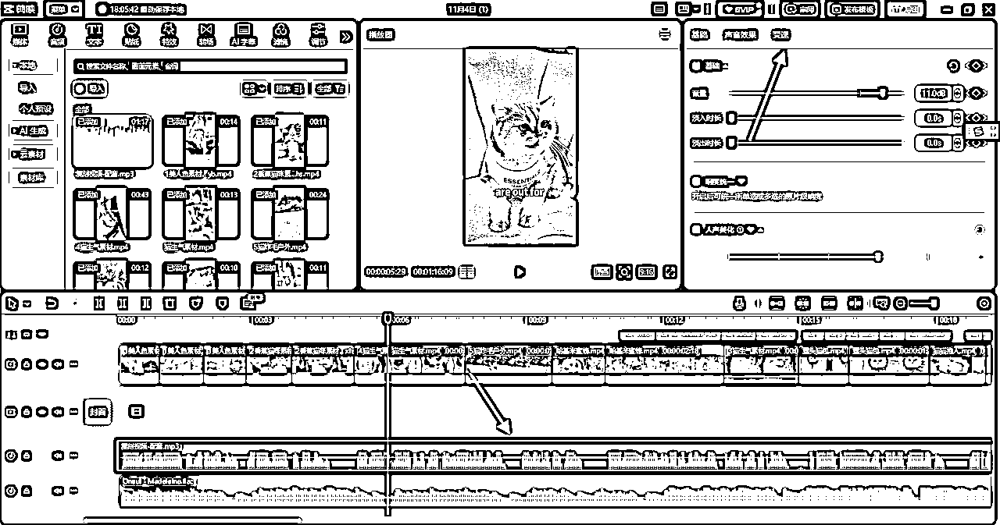

## 4.3 BGM

配音解决好，我们下面解决BGM的问题，一开始我想的是，直接用QQ音乐的歌曲识别来找到对应的BGM，但尝试之后发现，由于对标视频的人声比较大，盖住了BGM，导致QQ音乐没法直接识别出来，那我们就先想办法把人声和BGM分离掉

剪映会员可以直接人声伴奏分离，但基于低成本试错的思维，我在youtube上找到了Ultimate Vocal Remove5.5这款工具，可以免费分离人声和伴奏，效果非常不错，具体下载和使用参考https://www.youtube.com/watch?v=-_mp-Kuc6eA&t=345s

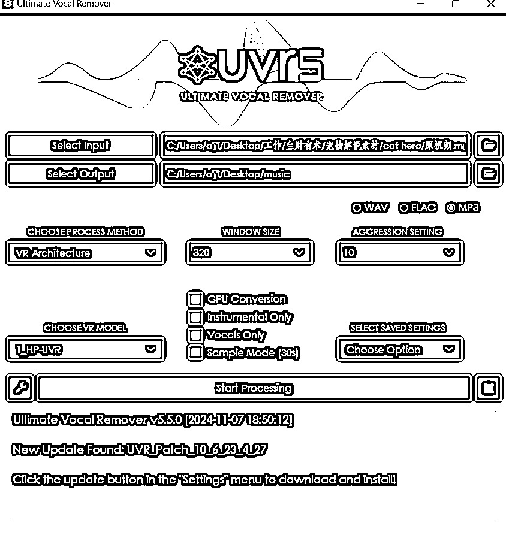

分离人声和伴奏之后，QQ音乐就可以识别了，找到对应的音乐源直接下载下来备用

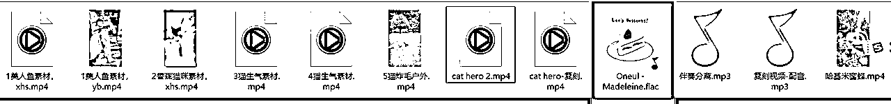

文案、配音和BGM都搞好了，最后就是难点和重点——画面

复刻对标视频，我们画面肯定不能和对标完全一样，不然肯定过不了查重，这时候就需要找到类似的画面来替换

## 4.4 找画面素材的三种方法

第一种：用Google的识图功能找替代画面素材

本来我想的是，AI现在这么厉害，能不能把对标视频的画面截图，让AI帮我找到原视频或者有类似画面的视频

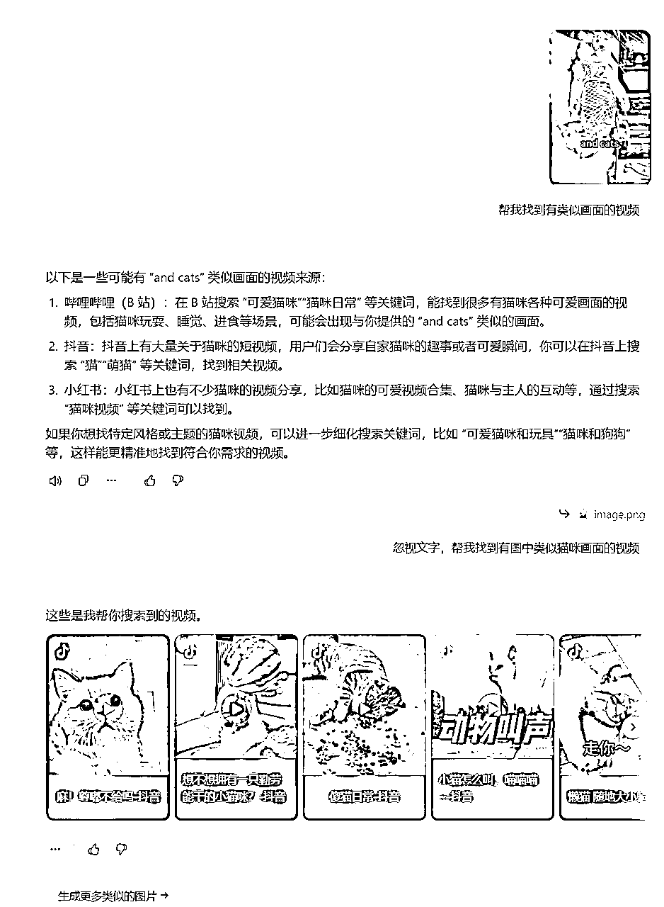

实操证明，豆包确实可以找，但明显结果和我想要的完全不一样，给我找了一堆不相关的

（其他搜索引擎还没尝试过，有类似经验的圈友可以分享下orz）

这条路不通，那就youtube大法，看看有没有类似功能的工具，一通搜索，最后找到了Google的识图功能

打开Google的搜索引擎，点击右边的小相机，把对标视频的画面截图进去，效果非常好，直接帮我在youtube和tiktok找到了有类似画面的视频，我们直接点进去下载即可

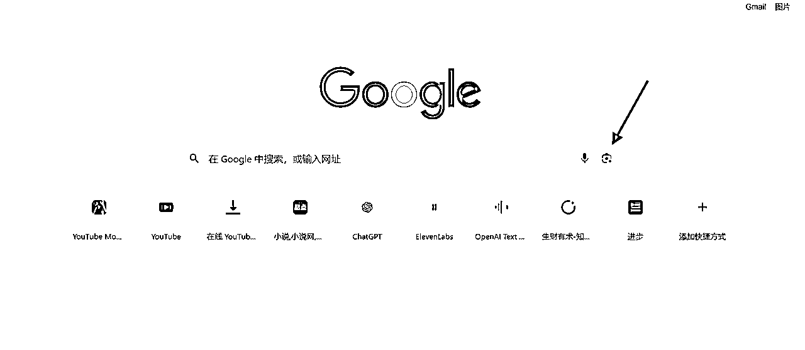

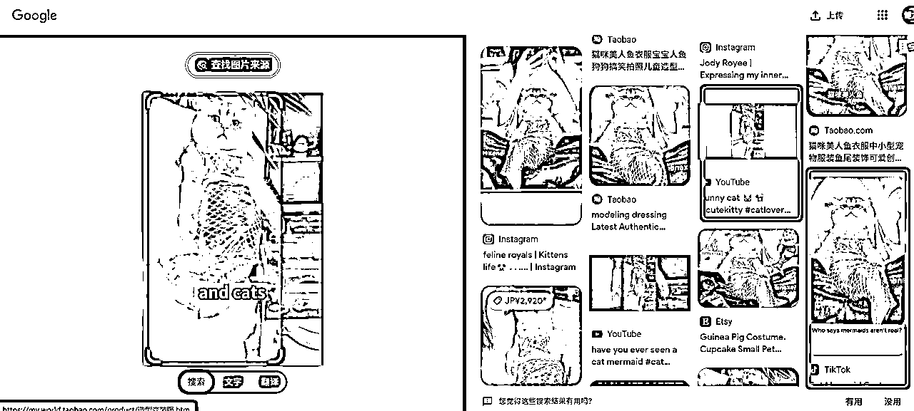

但要注意，我们不要用和对标视频完全一样的画面，如果素材的来源视频比较长，我们可以截取源视频中的其他画面来作为替代

大家可以看一下原视频和我的复刻视频的开头画面，都是猫美人鱼，但是画面不一样，因为我是在素材的源视频截取了其他几帧画面作为替代，而不是直接用和对标视频一模一样的，避免查重

但如果通过对标视频画面截图找出来的源视频比较短，没法从源视频截取其他几帧画面作为替代，怎么办？

这就引出第二种方法：

第二种：观察画面主体的动作，在社交媒体平台上搜索类似的素材

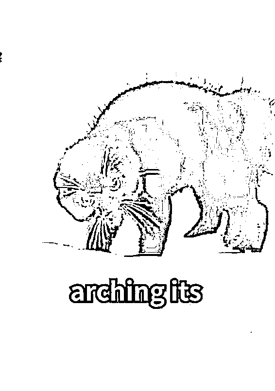

像上图这个画面，我找到源头视频之后发现，只有几秒钟，很短，对标视频已经用了

但我们可以仔细观察图中猫猫的动作，是弓背炸毛的一个状态

那我们不一定要用和对标一模一样的画面，我们可以找其他猫猫弓背炸毛的画面来替换

确定好思路，直接切换到小红书，搜索“猫猫 炸毛”

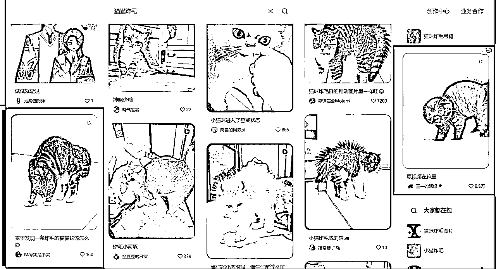

可以看到，除了对标视频的素材源头之外，还有其他比较高质量的无字幕猫猫弓背炸毛的视频

我们选一个镜头角度类似的，比如左下角这个，下载下来，把炸毛那几秒的画面截取出来，替换原视频的画面即可

其他的画面也可以用类似的思路，先Google识图，看看素材源视频有没有和对标视频比较类似的画面，有就直接用，没有就根据画面中猫猫的动作，直接去小红书、抖音这些平台搜

目前测试下来，tiktok和xhs的素材质量是比较高的，尤其是xhs，有很多素人会分享自家猫猫的日常，这种一般是没有字幕的，咱们下载下来就能直接用来替换对标视频的画面

（小红书下载视频我用的是这个：#小程序://红薯宝库去水印/n9PgGKmVSC1pESt）

除此之外，还有第三种方法：找到经常分享自家宠物视频的博主，关注，之后素材可以直接从ta们那里拿

目前找下来，tiktok的nabistiktok、小红书的小嗲精仔仔都有一些比较高质量的素材，大家可以在找素材的时候多注意一下，看到有不错的就点进去主页瞄一瞄，关注起来

按照以上三种方法，我们把和对标视频类似的画面素材全部找出来，收集好

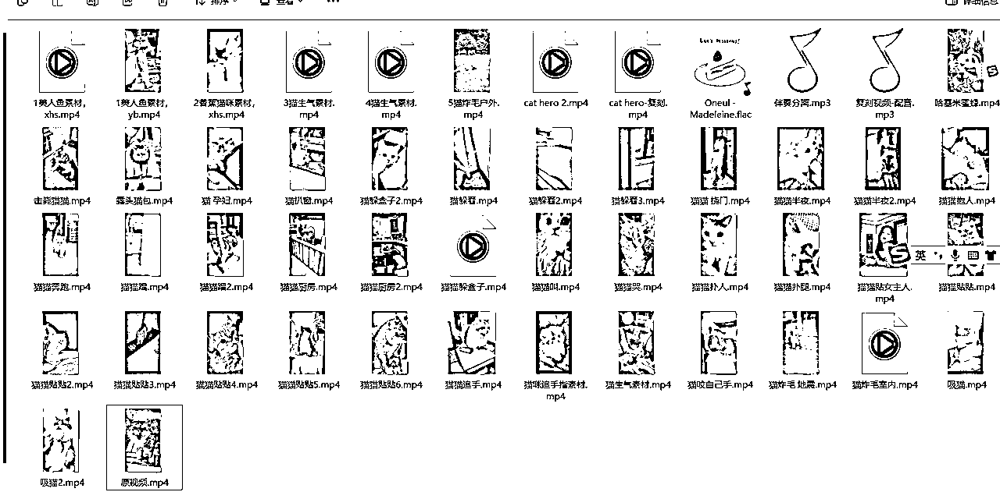

下一步，就是按照对标视频的节奏来一一替换画面

由于改写文案和配音方面的问题，我们不太可能做到和对标视频的时长完全一样，这种情况下配对画面素材也有两个方法

## 4.5 替换画面的两种方法

第一种：看对标视频在哪两个字幕之间放什么类型的素材，我们也同样操作

我们以对标视频的开头为例，在who said dogs are loyal and cats are selfish这一段中，对标用的都是猫美人鱼的素材，其中who said dogs are loyal是一段连续的画面，到了and cats are selfish，切到了另一段连续的画面

那我们复刻的时候，也这么操作，在who said dogs are loyal and cats are selfish这一段中都用类似的猫美人鱼的素材，然后在who said dogs are loyal、and cats are selfish这两块的素材不能连续

（我这里由于配音比较慢，还做了第三次切换，也是猫美人鱼的素材，一个素材不能持续太久，1-2s差不多）

第二种方法：如果找不到对应的画面素材，可以根据字幕的意思来相应配画面

如下图对标视频这一段

内容为：

two if your cat suddenly tries searching for a hiding spot

or even arching its back at nothing

quickly take your cat to a safe place

cats often exhibit these behaviors about 10 to 30 minutes before an earthquake occurs

and that has saved many cat owners

大概讲的是，如果你家小猫突然想找地方躲起来，或者无端端弓背炸毛，那赶紧把你家小猫放到一个安全的地方，因为小猫一般只会在地震前的10-30分钟做出这种警示行为，这种行为救了很多猫猫的主人

我找不到很多和对标类似的素材，但是我根据内容的意思，知道大概可以找两类素材：

①猫猫弓背炸毛；②猫猫躲起来

找到这些素材，然后按照原视频的截断节奏填充进去，大概率也是OK的，就做出来我下面的复刻

实际上这种模仿不算特别好，但实在找不到对应的素材就可以用这种方法，优先还是找到和对标类似的画面来替换

运用上面这两种方法，按照原视频的截断节奏，就可以把对标的画面全部替换为我们自己找的素材，成功复刻

我这次复刻也不是特别完美，配音上没考虑到语速的问题，明显比对标要慢一些，带来的问题就是视频总时长更长了，语速不够快，画面和字幕切换太慢的话，有可能导致观众接受的刺激不够而切走，后面慢慢迭代吧~先完成再完美

# 5、起号计划及难点分析

## 5.1 难点分析

如果要走【宠物攻略类】赛道来起号的话，可能会遇到以下卡点：

1.  这类视频制作时间比较长，我复刻第一个视频一共花了9小时，找素材和剪辑五五开，按照我的速度，一般需要2天才能完成一个，在更新频率以及起量上可能不占优势（相比于AI类来说）

1.  解决方法：

*   剪辑方面感觉没法提升特别多，熟能生巧慢慢练，素材方面的话，感觉可以做一个素材库，把比较常用的素材收集到一起，比如：猫猫弓背炸毛分一类、猫猫贴贴分一类，每一类收集几十个视频，等到复刻的时候就直接从素材库里面拿，不用再去搜索筛选，节省时间

*   还有一种方法，直接从pdd或者咸鱼里面买别人整理好的无水印萌宠素材，就不用自己做了，但这个方案目前我还没有尝试过，不知道是否可行

*   如果不建素材库，直接按照上面流程手搓的话，可以用@老馬🐎内容出海分享的视频截取软件，把对标视频的不同画面一键截取出来，然后就可以直接去搜索，不用再自己看视频手动截图

1.  成本方面，主要还是时间问题，具体花钱上，非要说的话，就是AI配音和剪映字幕识别这两处需要花钱

1.  解决方法：

*   前者可以用open ai的配音网站省钱，后者可以直接下载capcut（海外版剪映），国内充会员才能用的字幕识别，capcut免费（太坑了！！！）

1.  GPT改写文案方面的提示词还需要继续优化，我之前用的提示词改写之后的文案和原文案差别不大，可能过不了查重

1.  如果后面做得比较久，可能会遇到怎么把中文的选题和文案转换成youtube上比较吸睛的文案形式（youtube上对标账号的选题都用完了，大概才会遇到这个问题）

1.  解决方法

*   可以参考@老馬🐎内容出海在 提供的文案结构，看看能不能用GPT或者claude训练出来，把文案压缩到1分钟之内，然后把开头改一改

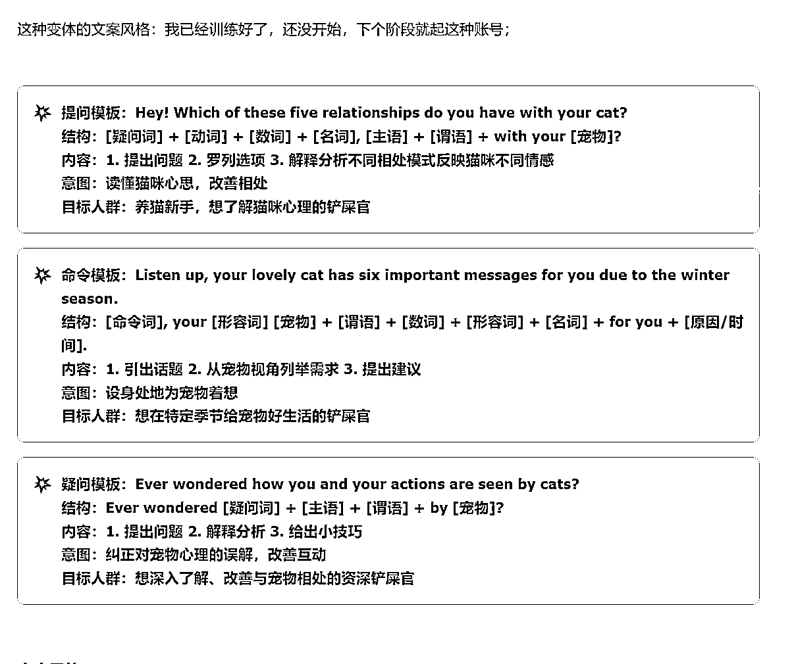

## 5.2 起号计划

Youtube shorts的YPP开通条件是：过去90天内有1000名订阅者和1000万播放次数

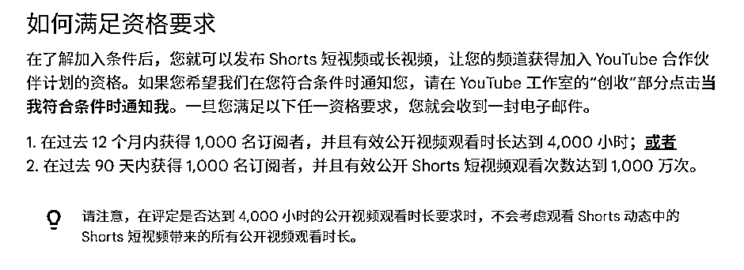

我的起号计划就会根据这个来设定

①最低目标：

三个月内达到1000个订阅和1000万播放次数，通过YPP审核

这种数据肯定不能靠shorts的常规流量（每条视频一万多播放）来跑，只能靠出爆款

出一个千万级爆款或者几个百万级都可以

目前的想法就是，1-3天一更，把对标的爆款都先模仿一遍看看效果，再慢慢调整

②最高目标：

一个月内达到1000个订阅和1000万播放次数，通过YPP审核

如果要达到这个目标，更新频率一定要跑起来，尽量日更，模仿对标的爆款，才有可能做到

通过YPP审核之后，下一步就是跑矩阵起量，但是这个赛道感觉跑起来不是特别方便，可能需要招人什么的，自己一个人剪视频时间还是太长了，没法像AI类那么暴力

# 6、尾声

感谢亦仁老大的第二轮龙珠悬赏，我算是借着这个东风发了在生财的第一帖

虽然加入生财只有个多月，但是真的超爱！！！

其实之前也一直有在朋友圈写作分享，但在生财确实是第一次，因为之前想着实操经验不多，分享出来可能没啥干货，就想着先潜伏几个月积累一些经验再说，但亦仁老大的龙珠悬赏算是给了我一个很好的机会

这几天把大家的龙珠悬赏都看了一遍，其实发现了其中很大的一个妙处，无论是详细的还是简略的分享，看下来其实从每个圈友的帖子里都能或多或少有一些收获，可能是工具上，也可能是思路上

很多时候可能自己觉得常见的经验和实操细节，对其他人来说都可能有启发，分享真的是一个很有价值的行为

感谢@老馬🐎内容出海大佬，我在超级标上的大多数灵感（萌宠解说、AI转绘）和实操（复刻AI猫猫）都是跟着你的思路跑的，你的分享真的超级有价值！！！

感谢@叉叉敌，看了你的分享之后，才发现原来AI shorts可以全流程自动化，我之前的思路都还停留在手搓hhh

感谢@钱塘江鲤大佬，自动抓取数据那个真的太牛了！！！我找youtube的对标大部分都是根据你收集的数据来索引的，之后学了AI编程就来尝试复刻一下大佬的能力（真的特别强）

感谢@SunDay，我从你的帖子里找到了解决AI配音成本的方法，又省下一大笔钱啦（狂喜）

感谢@星吟Singing，你分享的巨型海洋动物赛道对我很有启发，我当时找的时候就没翻到哈哈哈

感谢@一页书，你的帖子中用数据来分析和筛选赛道的方法对我很有启发，我之前都是手刷的，太慢了hhh

感谢@竹子。，你分享的人+动物融合的magic秀赛道真的很棒！！！又多了一个可选赛道哈哈哈

感谢@方波妮，原来AI航海手册里面有萌娃走秀的实操步骤！！！我当时完全没想到，光去youtube搜了（结果没找到），以后遇到项目果然还是多翻翻航海手册

感谢@亦仁老大发的超级标和龙珠悬赏，让我看到了一个项目的N多个实操方向和细节，顺带着自己也发了一个帖子，下一个目标，11月youtube航海，想当志愿者！（如果能选上的话）

我的分享就到这里啦，后面打算继续尝试AI方向，如果有成果了再来跟大家分享~