# 得物项目实操分享，可矩阵批量操作。附：电脑自动发布工具+APK环境工具

> 来源：[https://udxxg5rx5m.feishu.cn/docx/B3qUd7zdIoa74px0a3wcwG3EnBc](https://udxxg5rx5m.feishu.cn/docx/B3qUd7zdIoa74px0a3wcwG3EnBc)

声明：本人（生财：施仁）在生财分享的所有，

免费，不带项目，不收徒，不收任何学费。

不管你们是什么渠道联系到我。

咨询或者问问题我都不会收费。

当然如果有什么疑问最好就在文章下面提，

我有空会回复，这样别人有同样的疑问也能在这里找到答案。

解释一下为什么免费分享，

这是我在生财第三年，

第一年我通过生财认识了一个朋友，回过头来看那是我的一个转折点。

第二年，各种机缘巧合下。通过第一年的铺垫，在年尾最后三个月赚了一笔，大概最后到我手里130W+。

第三年也是今年。目前今年我给自己定的小目标在8月份已经完成了。

我很感谢自己的运气，也很感谢生财这个平台，

我想通过无偿分享一些项目、软件、技术，来认识并且链接更多人。

合作共赢。

这里也说一下我的需求。

你手里有50+的手机号。有项目大家一起合作。门槛就是必须手机号50+。

如果手里能有自己的工作室，手机卡、手机设备、电脑。按50:5:2（大概就是50个手机号对应5台手机对应2台电脑）这种比例的工作室。那就更好。

言归正传。

这次分享的是得物最近的一个项目，

只要有手机号就能做。

一个手机号能获取88元无门槛4张，100元无门槛2张，进阶任务完成还能再获得200元无门槛1张。

缺点：一个手机号只能做1次。得到的是优惠券不是现金。周期长，需要6周才能拿到所有券。

优点：适合矩阵批量操作，只要有够多的手机号就可以。软件批量操作。

## 优惠券如何变现？

1.咸鱼卖是最常见的，这个我不多做介绍，可以自己咸鱼搜一下得物券都是几折在卖。多少钱的券能卖多少钱一目了然。

2.撸货，得物用券购买再把货转出去。这个需要有一定的渠道跟经验。撸货的可以考虑。

3.自用，吃的喝的穿的用的直接买。去年我就是一部分咸鱼卖一部分自用了。

# 批量实操具体步骤。

手机号5个以内的朋友，看完批量操作流程，可以自己直接上手了。不需要考虑太多批量的问题。

所需软件和其他资料会在文章最后提供。

## 一、安卓手机环境搭建。

要求：安卓系统10-12之间最好。13不稳定自行测试。如果出现网络连接请重试 也是安卓系统太新无法使用。

这一步是为了环境隔离。防止得物检测同一个设备登录多个得物号。

安装虚拟机VMOS.apk和VMOS助手

VMOS助手下载后打开，会提示授权，一路同意。

提示需要打开 开发者模式 不知道怎么打开就百度搜自己手机型号 开发者模式

注意最后这一步，这一步有的手机怎么操作都设置不了。折磨我好久才找到原因。

无线调试 需要手机一边打开无线调试选项，手机通知栏会有一个对话框。

无线调试打开，点一下 使用配对码配对设备 。

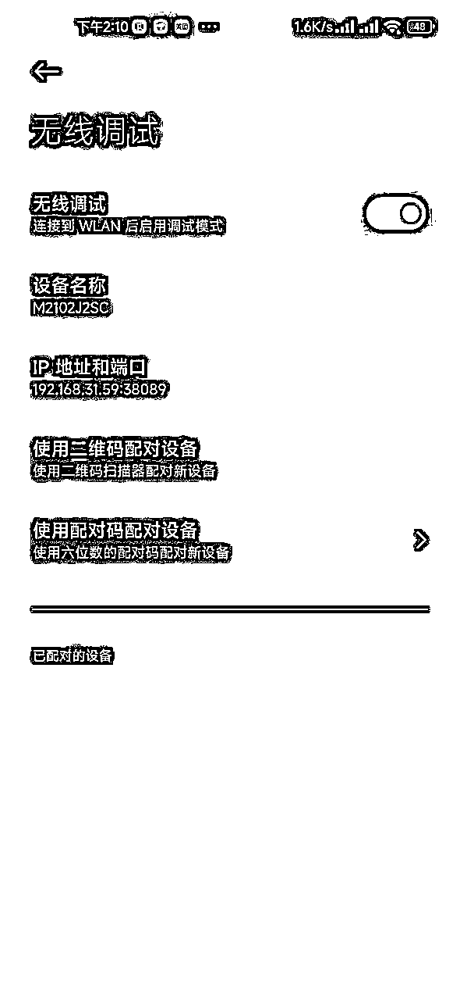

弹出一排数字。记住这排数字。

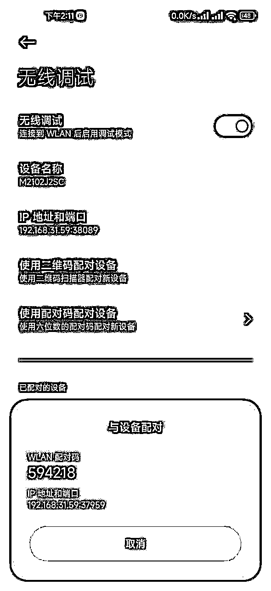

下滑通知栏，点 输入配对码 。如果没出现 输入对话框 。返回无线调试上一个页面，重新点进来，再点 使用配对码配对设备 。获取数字码 下拉即可。

或者检查一下助手是否有通知栏权限。权限一定要给到位。

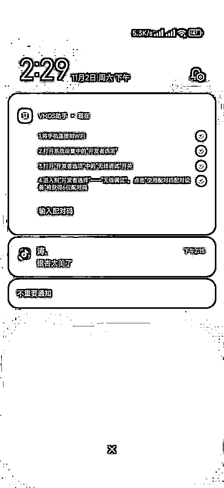

输入那排数字即可。

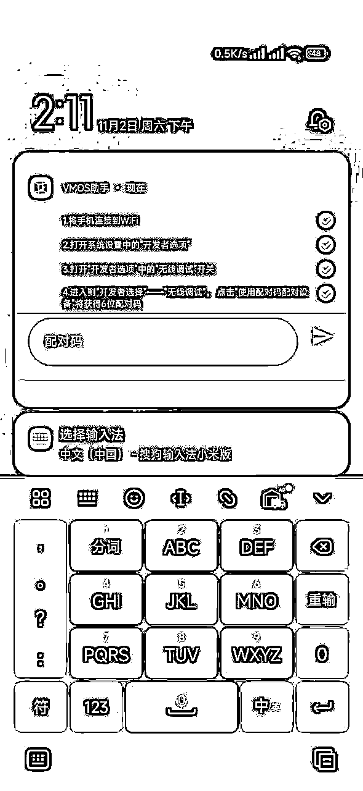

有的设备点输入配对码没有反应。找到手机设置通知栏的位置。把通知栏样式改成原生。

或者有的通知栏被折叠，需要长按通知才会显示全部信息。

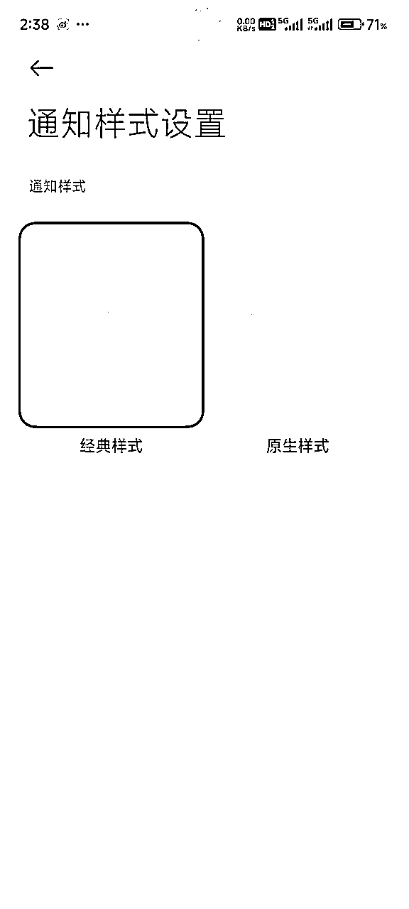

光这个问题当时困扰我很久才找到原因解决。

## 二、在环境里安装APP注册账号，

首先在自己手机下载一个得物。然后打开vmos，有的手机第一次打开会提示选什么模式，选最上面那个手动模式即可。

点上方的加号，添加设备。

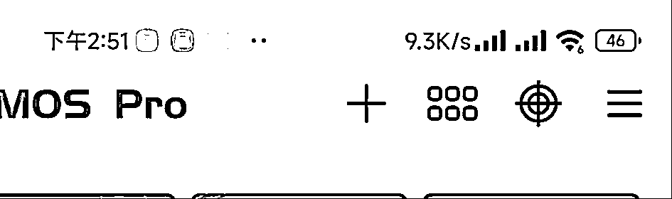

添加设备这里是不是白屏都不用管。点右上角三个点.导入rom.然后把2024虚拟机备份导入即可.这个压缩文件我会在文章最后分享，

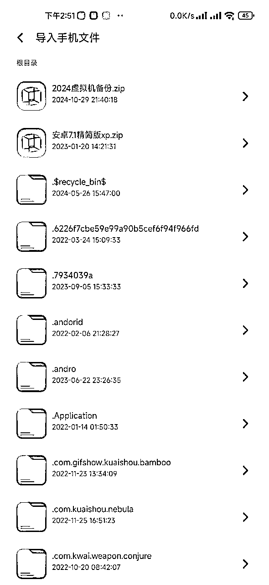

导入会比较慢，等一两分钟。

如果打开的虚拟机黑屏，返回主手机在进入就好，或者关闭虚拟机重新打开。

点最下面的的 导入 ，勾选得物 然后确定。这样虚拟机会安装得物app。

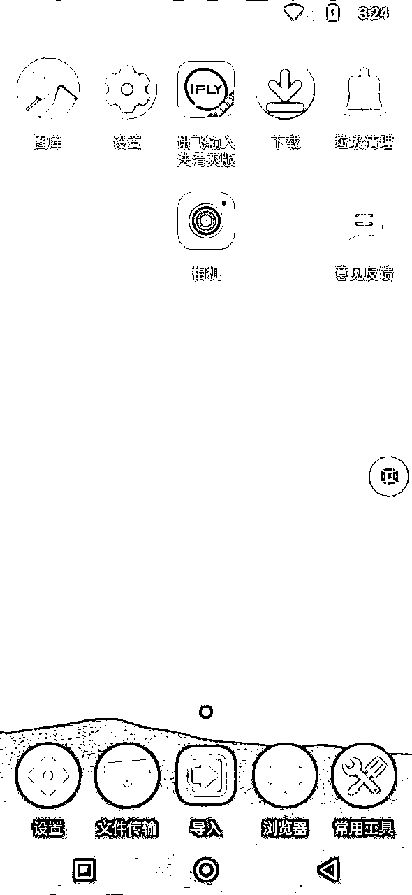

到此虚拟机隔离就已经完成了。

## 三、提交活动资格。

活动其实我前一阵在生财发过风向标，不过没人注意。

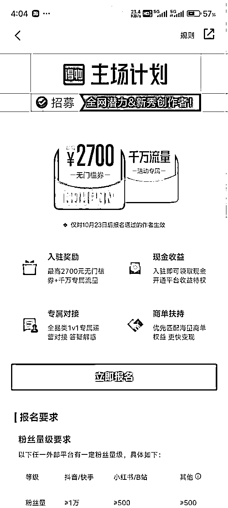

这个活动一个号可以获取88元无门槛4张，100元无门槛2张，进阶任务完成还能再获得200元无门槛1张。

活动入口：

得物里搜索 得物主场活动 就有活动页。点进去可以看要求

* * *

（**广告嫌疑部分删除**）

* * *

最难的部分已经完成，接下来就是等3天。一般提交审核后第三或者第四天出结果。

周六周日会慢一点。

审核通过会有消息提醒，具体位置看视频。不通过也会有提醒。

收到通知后可以点进去看活动要求和期限。

当天活动就已经开始了。

7天为一个周期，一共6周。

任务简单来说就是。

比如11.1号任务开始。

第一阶段.11.1-11.7内必须发三天视频。11.1-11.14内视频总播放大于100.

第二阶段.11.8-11.14内必须发三天视频。11.8-11.21内视频总播放大于100.

第三阶段.11.15-11.21内必须发三天视频。11.5-11.28内视频总播放大于100.

以此类推。注意看任务期限。视频活跃任务期限是一周。视频播放任务期限是两周。

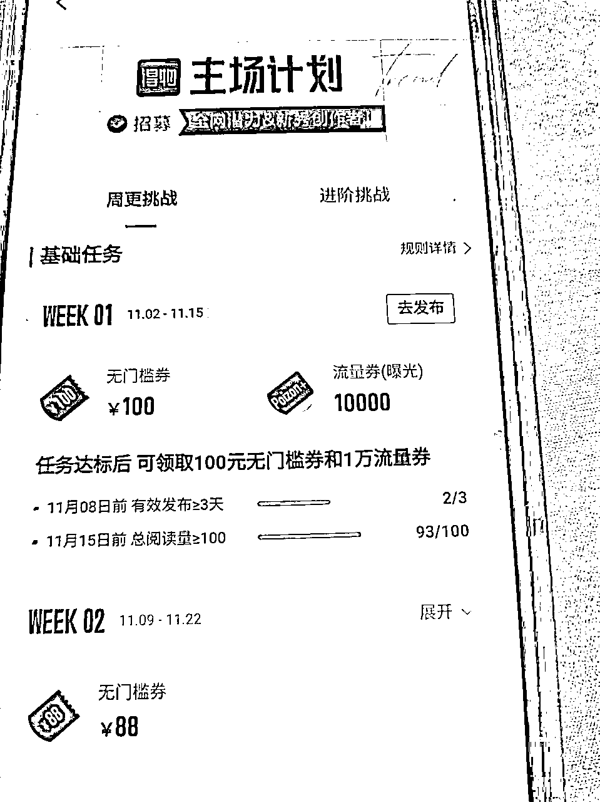

视频发三天。然后看播放量是否达标，总播放100即可。6个视频怎么着也凑够一百播放了。如果不够每天再发两个。5天左右绝对达标了。播放量达标的任务期限实际上是两周内。所以不用担心。

任务达标优惠券如何领取？

如果你三天发布视频播放量也超过100.那么即使没到任务期限，

你也可以直接点领取奖励。点击领取无门槛优惠券就到你的账户了。

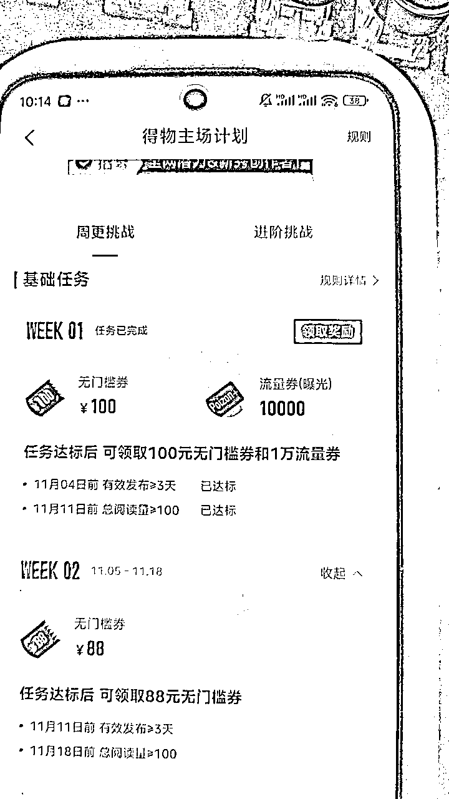

## 四、素材批量剪辑

这一步操作主要针对批量账号。不是批量的可以跳过。

参加得物活动，保险起见一个号大概要发布40个左右的视频。

可以下载油管视频或者一些其他视频，（这里我不多做赘述，只能自己领悟。发的作品不要被判搬运就行）

通过分割的方式2分钟的作品分割成5-6个40秒的作品。

我会分享一个批量分割软件，可以把一个文件夹的所有视频全分割成你指定的时间长短。

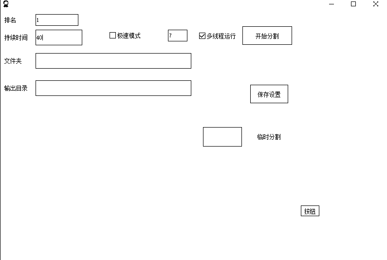

然后把所有分割好的视频。按一个文件夹40个作品。整理出来数个文件夹。一个文件夹对应一个账号。

## 五、软件全自动批量发布。

软件使用教程可以看这里，

这里简述一下如何自动发布。先把所有账号登录。把你的账号进行分组。不分组的话账号会在默认分组里。

点账号设置，右边下拉框选择自动发布的平台为得物。

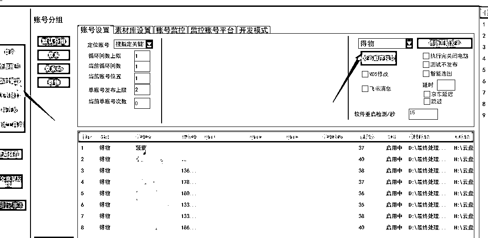

在素材路径设置你要发布的素材路径。一个文件夹对应一个账号。

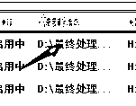

设置好后单击账号名字。会跳转到素材库设置。这里可以设置每个视频发布时的标题和描述。也可以一键批量设置。

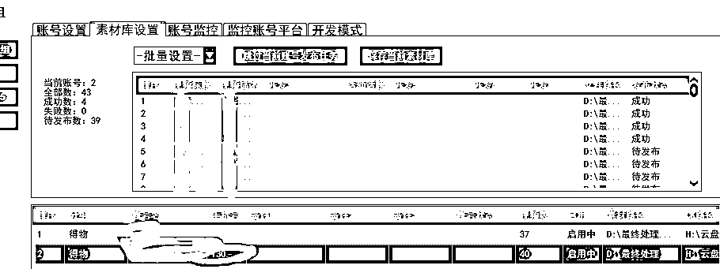

全部设置好后。

回到账号设置，

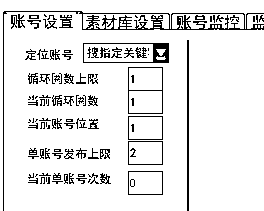

按我这样依次设置。意思是每个号发两个作品。全部账号发完停止。

然后就可以点这里进行自动发布了。

这样每天软件打开运行一次就好了。

## 六、复查作品达标情况。

记住每个账号任务完成时间。提前查看任务进度。

我这边就是直接在飞书把每个得物号列出来。账号活动开始时间。一些详情。

任务要求是每周活跃三天。意思是每天发一个视频，至少发三天。这个用软件很简单就完成了。

播放的话，要求每周总播放100.如果播放量不够。

坚持多发两天视频就行了。他要求的是总播放。并不是单个视频。很容易就能达标。

一定要注意，七天任务必须发三天视频。这个达标最关键。

所需软件：

通过百度网盘分享的文件：DW2024

链接：https://pan.baidu.com/s/1JIfs83bfmQMo5PMgWCAkiQ?pwd=tw2a

提取码：tw2a

购买地址：

点击页面跳转获取