# 新手快速赚到第一个100块的方法：山姆代购经验分享

> 来源：[https://aw5opbxom0o.feishu.cn/docx/QpkmdUS8foDH5KxdB5RcGL17nNd](https://aw5opbxom0o.feishu.cn/docx/QpkmdUS8foDH5KxdB5RcGL17nNd)

圈友们好，非常荣幸受到生财邀请，分享下山姆代购这个小而美的项目。

这也是我第一次在生财发帖，感谢生财同事对这篇帖子的撰写支持~

先做下自我介绍：

我主业是做传统电商，一直做了有 8 年。21 年受疫情影响主业业绩下滑严重，就出来自己创业尝试其他项目，尝试了很多，也参加了很多期航海。

后来在小区群里关注到，很多人对山姆代购有需求，要么是不愿意开会员的，要么是开了会员嫌量大想拼单的，会在群里问“能不能拼单”之类。当时觉得这个门槛也比较低，就去尝试了。

我自己做的规模比较小，模式就是：

通过小区摆摊拉群获取流量，经营着 300 人的微信群，日常也不怎么维护，就接接龙，或者有需求他们也会私聊我，几乎属于“躺着赚钱”，现在主要是我老婆在操作维护。

小区摆摊：

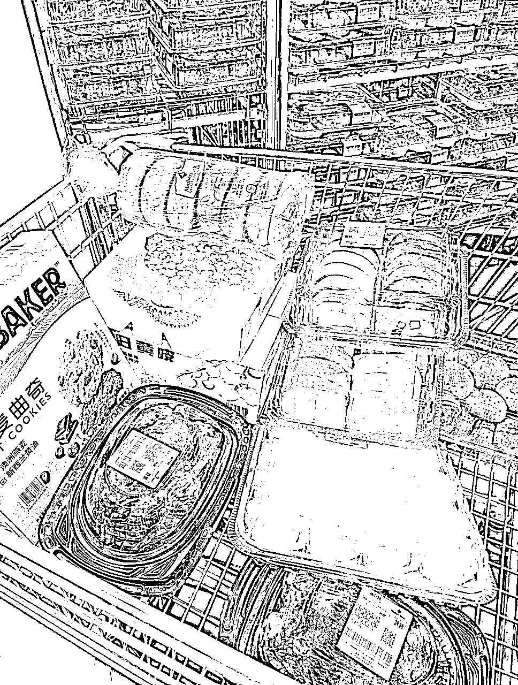

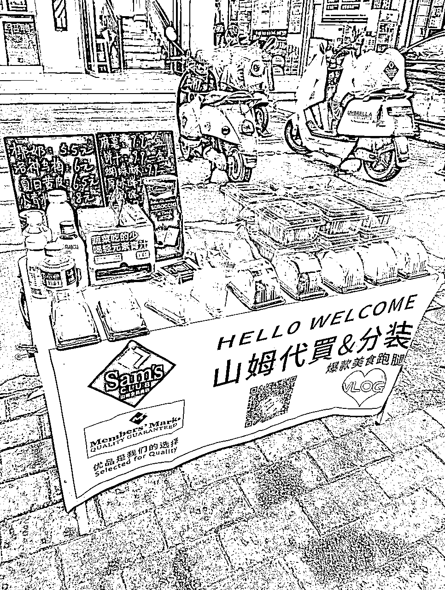

微信接单：

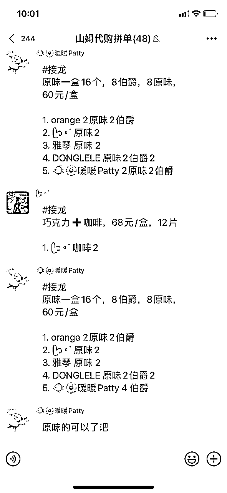

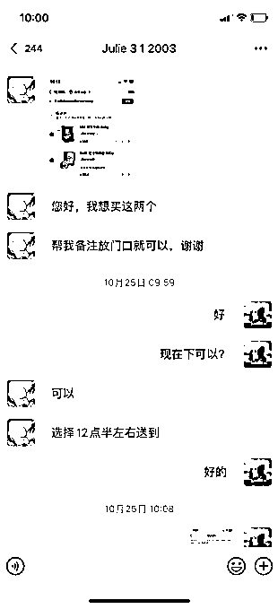

我目前的项目成绩：

最好的时候月收入 4-5k，在维持老客户（300人）情况下，月收益轻松达到1000，收入比较稳定。

能坚持做这么久还有个原因，就是它的复购率非常高，基本这个人在你这成交后，后面还会找你来买。

下面是我经营的小区群客户，单月在快团团上的订单（这只是部分，还有一些是接龙微信转账的），基本上月利润在 1000左右：

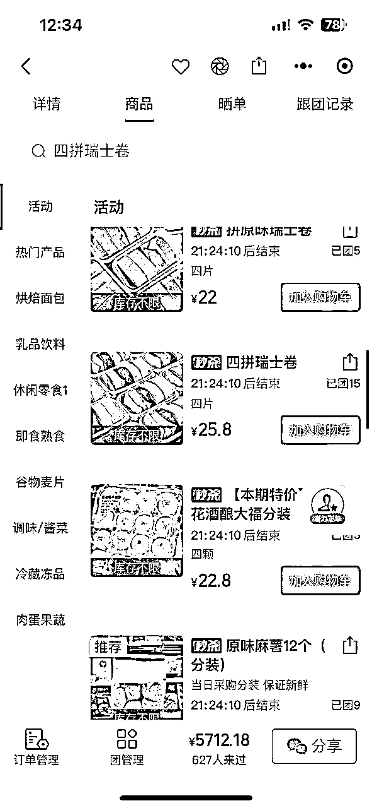

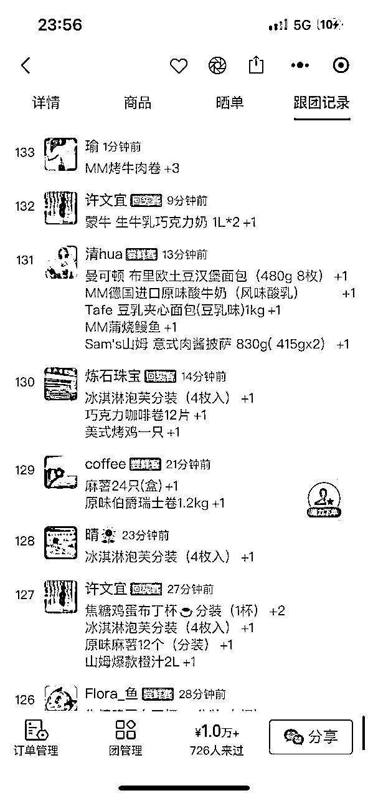

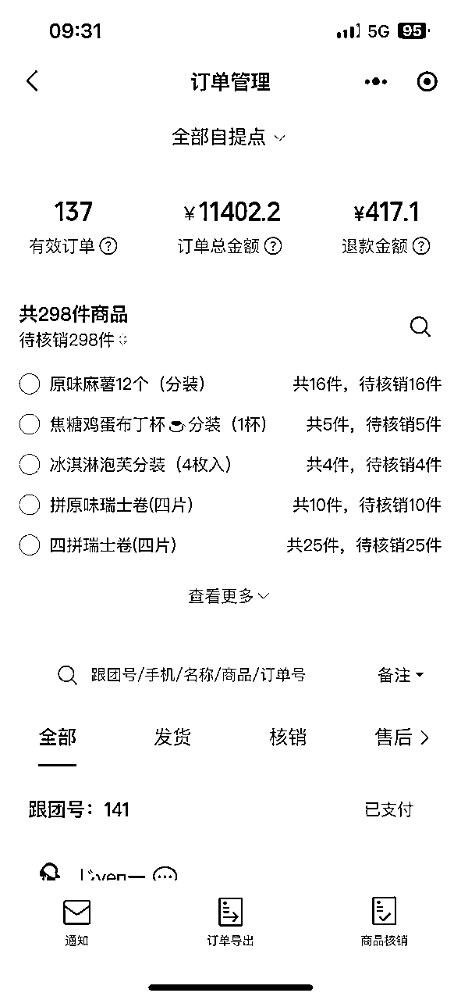

其实小红书上也有很多玩法分享，但比较零散，很多人因为没有掌握完全山姆卡的变现方式，觉得赚不到什么钱，就放弃了。所以今天会比较全面的跟大家分享下这个项目，以及如何长期有稳定收入。如果有遗漏，欢迎评论区交流补充~

以下是我的分享框架：

1.  项目概况

1.  项目能赚钱的关键

1.  变现方式有哪些

1.  流量从哪里来

1.  容易踩坑的点

1.  入局建议和门槛

## 一、项目概况

可能有些圈友对山姆不太熟悉，我先介绍下山姆：

山姆是一个会员制的中高端超市，普通会员年费260元，卓越会员年费680元。有会员卡才能进店购物，里面有免费试吃，很多人会冲着试吃想去体验。热门产品主要是：糕点类、高品质水果、其次是肉类。

超市主要分布在一线、新一线、省会城市，全国一共有二十多个城市有山姆。

可以去线下实体店购物，也可以山姆APP，京东下单配送：

*   极速达99包邮（极速达有打包费，商品含冷冻2块，不含冷冻1块）

*   同城配299包邮（适合一些偏远地区）

*   全球购是快递发货，比如一些化妆品

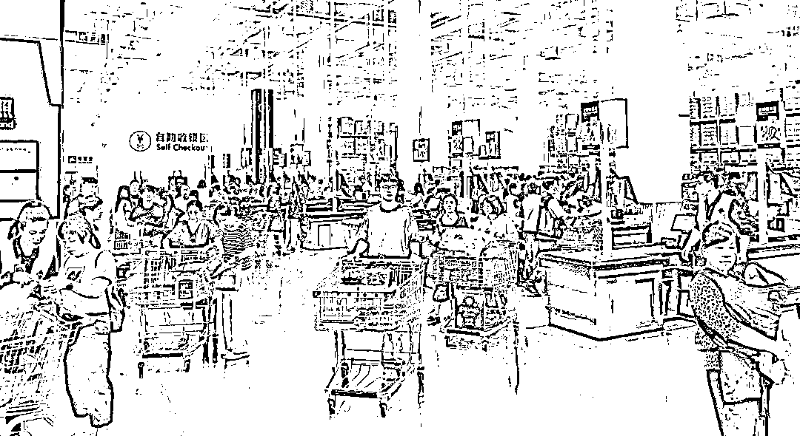

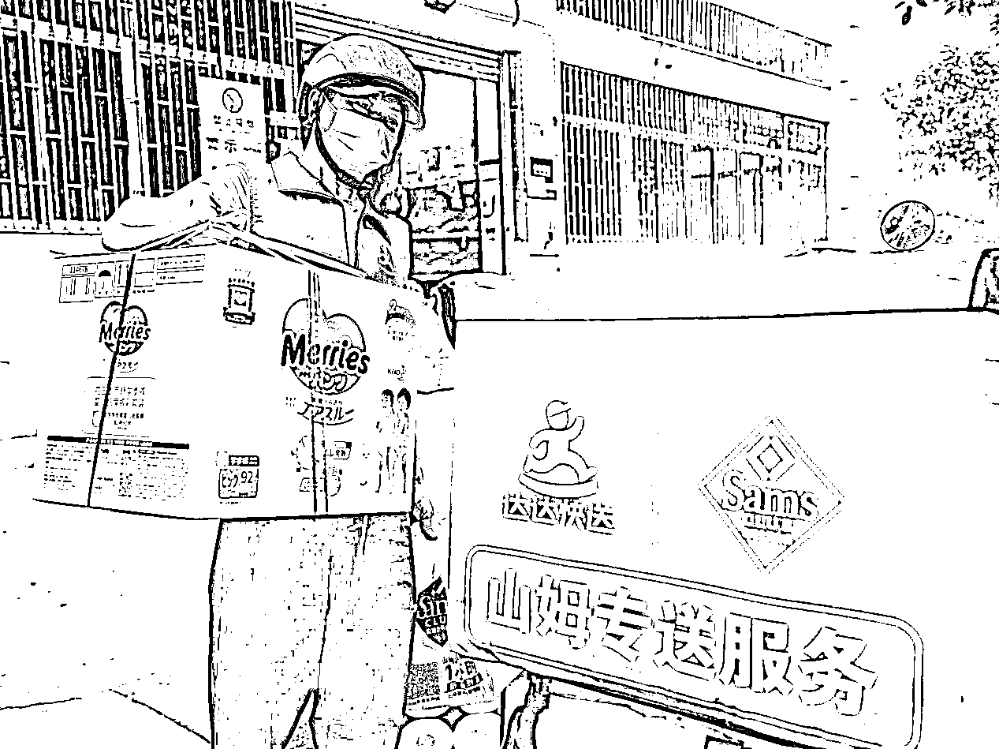

做这个项目需要投入的成本：

*   成本：卓越年卡会费 680元

*   一次性收益来源：卡的增值权益可以卖钱，卓越年卡会送一张副卡挂闲鱼卖110（很多人要），洗车卡15*12=180，洗牙卡30，运费券5*12=60，续费的话次年还会赠送 2 张次卡（这个是官方体验卡，一张卡可以进店一次，现在卖很火，30块一张），还有 50 元全球购优惠券-满51可用，50元线下无门槛优惠券-这个真香，以及每个月15元免邮券、洗牙券……以上这些都可以直接用或出售。

*   折算之后成本投入在 200元 不到了，基本第一个月就能回本。

除了上面提到的一次性收益来源，代购主要靠这些赚钱：

山姆会员2%返利（副卡消费返利自动计算到主卡）、京东优惠券折现、山姆活动商品抢购、爆火/特价商品加价出售等。具体在后面章节【三、变现方式有哪些】会介绍。

## 二、项目能赚钱的关键

这个项目能做成的关键有几点：

1.  同城有山姆：1公里内有山姆的最佳，离得越近越好，主要是带人进店方便；

1.  掌握多渠道收益来源：很多人不知道有这么多收益来源，只掌握了1-2个，觉得利润低就不做了，这块我自己是通过同行积累了很多经验；

1.  会基础社群运营：通过在小区摆摊引流是最快的，熟人社群管理运营起来也更容易，新小区老小区都能做，因为做的人很少；

1.  能坚持做：做的越久，越能躺着把钱赚了。

## 三、变现方式有哪些

开通山姆会员卡后，除了卖副卡这种一次性收入，还有哪些持续性利润来源：

1、卓越会员2%返利，民生联名信用卡再加2%返利，比如我花了100，官方返2-4块（这个返现可以在山姆APP和实体店购买商品时，直接抵扣使用）

2、因为山姆是沃尔玛旗下的高端品牌，所以山姆是支持用沃尔玛购物卡支付的（类似京东e卡），可以提前去市场上 95折回收沃尔玛购物卡，帮客户代付的时候就可以享 95折。门店，APP，京东到家，线上线下都可以用；

3、开卡后绑定京东上的山姆会员店，每次网购可以免邮费，也是一样可以积分的；

4、如果你有“京东plus会员”，每天会收到赠送的运费券和大额优惠券，不定期也会有店铺优惠券及平台优惠券可以叠加使用。职业做代购的一般都会开京东plus会员，可以去闲鱼买 60左右成本（官方价格100＋）

5、山姆做活动的时候，部分门店可以原价买到茅台（还没买到过，最近好像没有，现在部分城市还有）

6、爆火商品加价出售：车厘子，kt麻将等。

7、特价商品加价出售：山姆还有特价区，可以捡漏，包括换季的时候，商品折扣力度超级大，比如最近很火的泡泡枪，金箍棒，充气独角兽等。

以上最主要的收益来源，是爆火商品、特价商品加价出售。做这行的需要及时掌握这些信息，平常多刷刷小红书闲鱼的同行发布，关注得多就知道得越多。

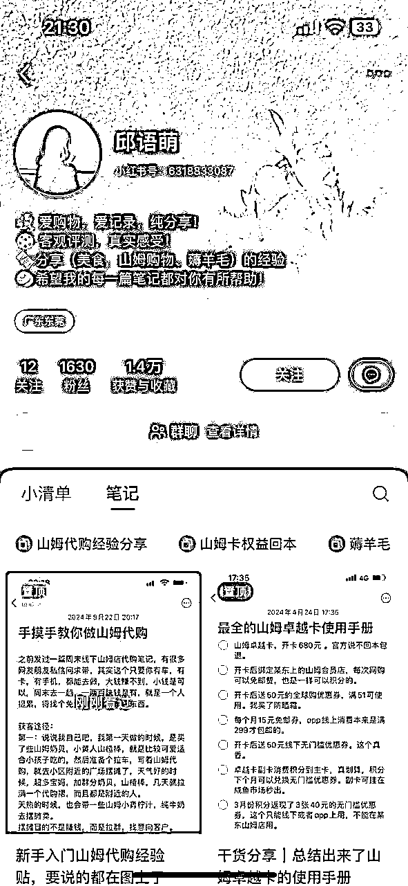

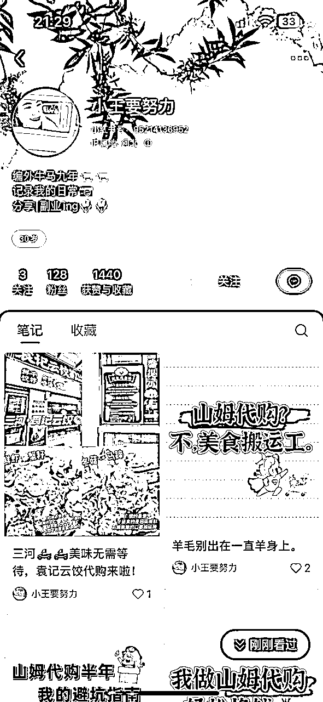

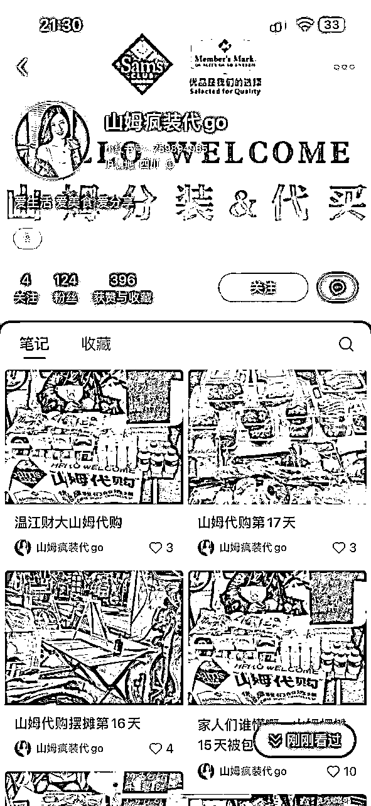

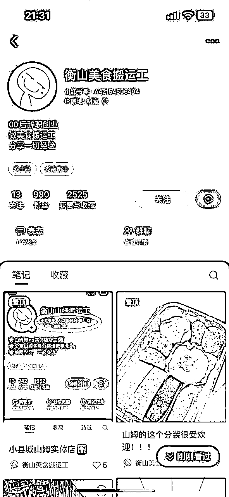

握了以上利润来源，下面我再展开介绍下 4 个主流的长期变现方式：

变现一：摆摊分装（主流）

*   玩法：拉个露营车，去自己小区或附近小区门口摆摊，一般下班点/周末人流比较多（可以圈点附近小区流量）

*   技巧：直接参考小红书的搭配套餐＋价格，准备一些山姆热门产品，现场还能搞试吃吸引人流，前期投入一点小成本获取流量，后期复购很高

*   分装还可以去小红书引流同城粉，如果距离很远只能代购。分装只能做同小区，除非是可快递的比如饼干分装，这种快递费大概3-4元，需要跟快递点谈合作价。

*   目的：摆摊主要是为了拉群，找到意向客户。山姆烘焙类，非常能吸引人。

变现二：小区拼单（主流）

*   玩法：建小区群，在群里接龙，给个截止时间，然后APP代下单，不用囤货。

*   特点：前期加小区熟人，便于社群管理；回购最多的是山姆鸡蛋，主要拼包邮，所以很多开了会员的也会找你代购。群成员也会自己发起接龙，或者私聊你需求。

*   利润：一般加价2-3元/单，如果只是拼个鸡蛋这种一般就不加价了，山姆价格都很透明，加价的话，你下单前就要跟对方说明价格。

变现三：带人进店（顺便）

*   玩法：带人进店 10元/人/次，一般逛超市都是 2 人起步，一般一次可以带 5 人进去比较保险，这样就有 50 了，另外结算的话还有 2%返利，期间你可以在超市外面餐吧坐着（不用花钱）。当然如果你不想要这 2% 返利的话，可以带进去后让他们自己在里面随便找个人帮忙结算，就不用等了。

*   劣势：自己得有时间；另外离山姆离得越近越有优势，远的话确实不太方便。

变现四：小镇开店（新增）

因为很多小镇没有山姆，但有需求，可以针对这部分需求在小镇开山姆代购店，前期为了节约成本，在自己家做也行，让客户上门提货。

*   玩法：同样也是拉群管理，在群里发起接龙，然后跨城采购最新生产日期的商品（最好自己有车），你可以顺便囤一些不容易过期的饼干，一般加 5%-10% 的代买费，如果有爆品比如车厘子，就可以直接拉一车（擅长做社群的会很有优势）

*   特色：小镇用抖音多一些，可以利用抖音和小红书引流，圈一些镇上比较有消费力的人群，后续还能开发其他业务，比如化妆品代购之类；

*   引流：除了抖音小红书，还可以在人流大的地方打广告，比如便利店、快递点门口贴个海报引流。

*   注意：自己跨城采购，如果有冷藏冷冻的，记得备一些保温箱啥的。

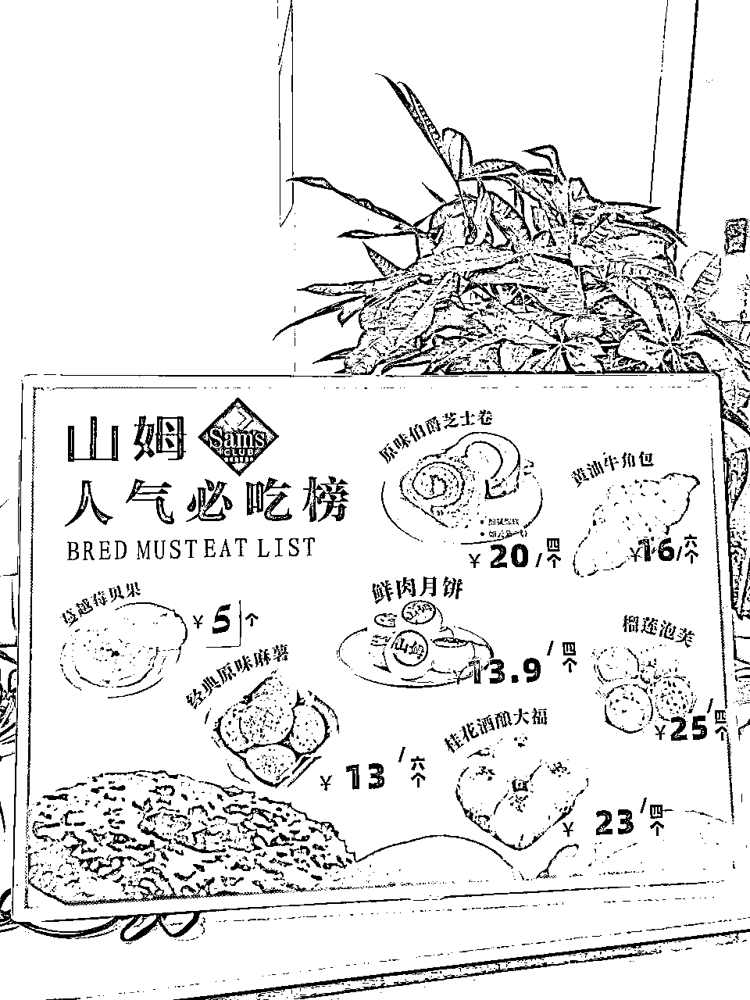

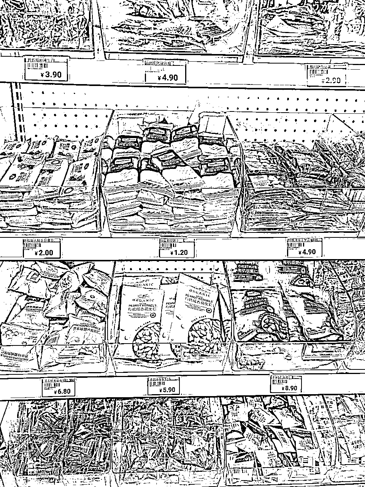

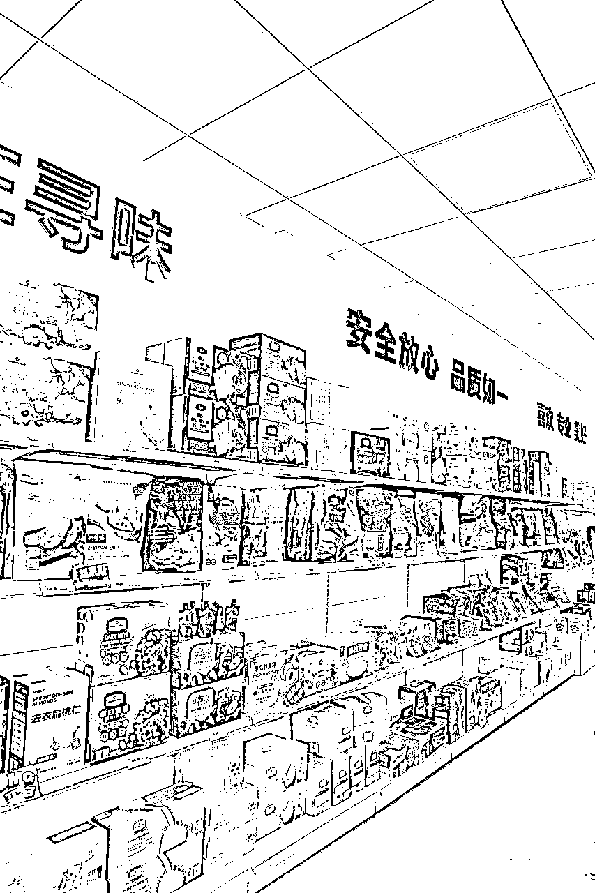

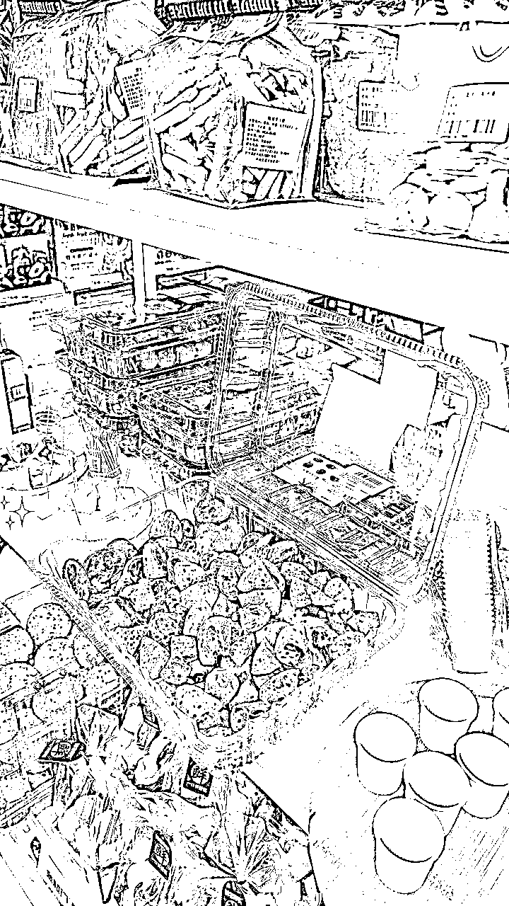

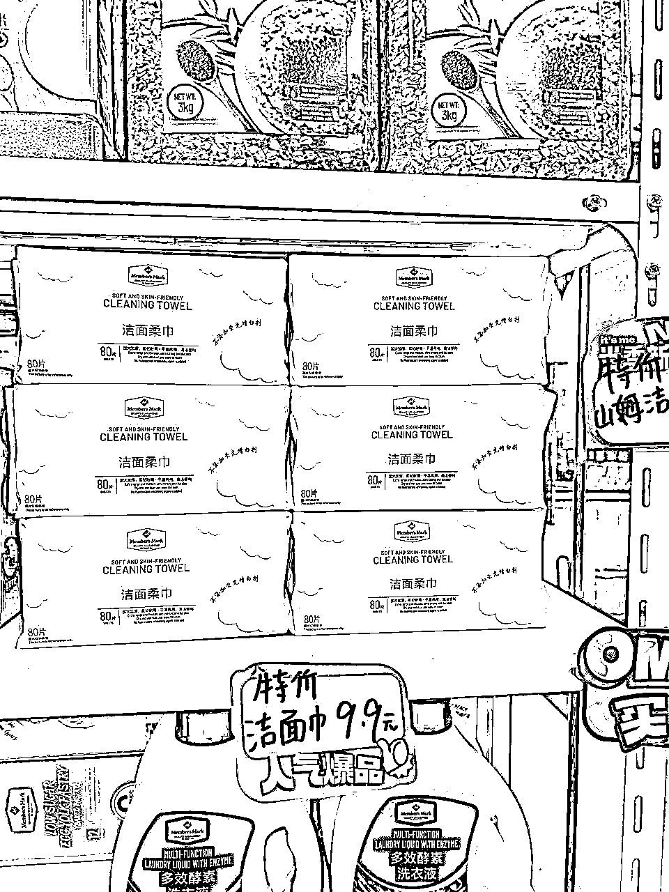

## 四、流量从哪来

前面其实基本也都提到了，流量主要来自于：

1.  闲鱼、小红书及抖音发帖吸引同城粉（主流）

1.  小区摆摊拉新（主流）

1.  快递点便利店打广告，几百块成本贴个海报

1.  产品上架到电商、外卖平台，引流到私域

5、直播卖分装

## 五、容易踩坑的点

1.  带人进店注意规避官方排查

带人进店，自己不进场的，这种今年查的就有点严了，以前截个图给工作人员看下就好了，现在要扫码，可能部分门店不用扫。

带人进店就跟着一起进去就好了，一般一次带5个人左右，没啥问题，多了就分批，或者给他说下，一般问题不大。结账一般要求有点严，通常需要本人，结账出口一般都是餐吧，可以在那边等着就好了。

当然如果能极速达，最好就是极速达代下单最方便安全。

1.  项目太容易被复制

因为项目没什么门槛，很容易被复制，如果组团队做利润没分配好的话，人家立马就单干了。

如果要组团队做也不是不可行，也有同行专门开了家公司，找了一批人做后端社群服务，猜测这种分成70%-80%，稳定性比较强，然后老板去拓展做分装，开网店，直播，外卖等获取流量的业务。

我自己主要是因为主业电商也比较忙，做社群不是强项，这种服务型的交付怕麻烦，也不太擅长跟客户维护关系，所以没有继续投入更多精力放大去做。

## 六、入局建议和门槛

这个项目门槛低，有优势也有劣势。利润率比较低，前期可能赚不了多少钱，但赚到第一个一块很简单。在小红书和抖音上，有N多做的很好的前辈，可以直接去借鉴，学习的方式和渠道就很方便了。

项目简单，贵在坚持，每次成交的客户，基本80%都会回购。初期没有方向的，建议从小区周边，以及同城代购入手。

挺适合有点闲暇时间、希望找个事儿做、擅长做社群或写小红书的人去做。擅长做社群，直播类的，坚持做个半年，全身心投入，单人月入过万，问题不大。

或者也可以作为一个引流方式，比如你是做化妆品代购的，你可以通过山姆代购引流，吸引高消费力人群。