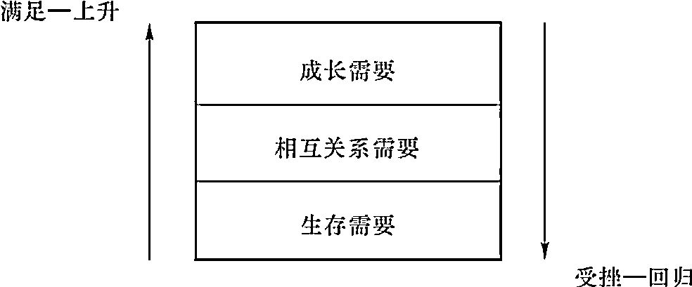
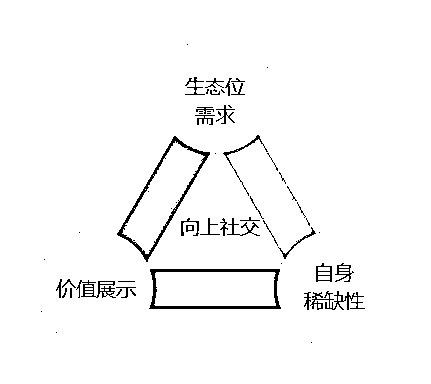

# 《如何从零开始搭建个性化向上社交系统?》 （从未想过，你是这样的《送东阳马生序》！）

> 来源：[https://mcn09clzx4g2.feishu.cn/docx/C1DodmOqmo8gFlxUauKcmtcunMe](https://mcn09clzx4g2.feishu.cn/docx/C1DodmOqmo8gFlxUauKcmtcunMe)

朋友你好呀，今天你看到的这份文档是全网独一份的，关于向上社交的深度剖析。

文章浓缩了我十年“逆袭”生涯的重要经验，看完之后你也能打通向上社交的底层逻辑、获得快速成长、培育自身稀缺性的能力。

首先，为了更具可信性，请允许我做一个简短的自我介绍：

# 自我介绍

昵称：修进

所在地区：重庆

职业：安监经理

标签：

*   985大学

*   央企员工

*   国家二级运动员

*   省/国家级作品100+

*   文科本科发C扩

逆袭经历：

1.  竞技：基础最差，靠每天加练被看到并给予机会，成长为主力

1.  985：成绩垫底，常常自习到深夜+老师指点，提30分进985

1.  央企：笔试倒数 面试翻盘40人

我能提供什么：

*   向上社交方法

*   进步/复盘方法

*   自强心法

一路走来吃过很多苦，也受到过很多贵人帮助，对于自强与向上社交有自己的看法，也整理了一些相关的体系资料可以分享。

# 前言：

在分享之前，先跟大家聊一点题外话：

大家看到我的经历以及“向上社交”这几个字，或许会觉得“啊，她就是靠运气好/性格讨喜才得到了这么多贵人的帮助，对我而言没有借鉴意义。”

实际上不是的。

论运气，如果在我的成长过程中只遇到一两个贵人，那么说是靠运气也没错，但是如果每个阶段甚至是每年都能遇到，那一定是我做对了什么。

论性格，我中学的时候因为遭遇校园霸凌，整个人呈现出来的状态是木讷、拧巴、呆滞甚至是有点畏惧跟人接触的，这样的性格可远远称不上好。

但就是这样的情况下，我身边的老师、前辈，但凡能够给我提供帮助的人，都非常愿意不求回报地帮我一把。

除了感念于我的上进之外，更因为我当时无意中踩中了向上社交的本质。

现在，我把我的经历总结提炼，形成了可复用的向上社交理论体系，希望能够帮到大家~

接下来我就从：为什么要向上社交、究竟什么是向上社交以及如何向上社交几个方面给大家进行分享。

# 首先，我们为什么需要向上社交？

## 第一，向上社交，能让自身价值最大化

这里，我用《送东阳马生序》这篇耳熟能详的课文为例，来拆解一下我们要为什么向上社交。

以下分析，会颠覆你对这篇文章的认识。

《送东阳马生序》中，宋濂讲述“余幼时即嗜学。家贫，无从致书以观，每假借于藏书之家，手自笔录，计日以还。”

上学的时候老师总强调后面一句“天大寒，砚冰坚，手指不可屈伸，弗之怠。”以此来告诉我们宋濂自强不息的精神，

但是从来没有人告诉过我们，为什么藏书之家愿意借书给他？

要知道，以元末明初的物价来算，一本普通的书需要100文左右，而明代替人佣工的收入为每天30文，一年14000文（还得一天不落地干），除去吃穿用住，剩不下什么钱。

把奢侈品借给穷人会面临很多风险，那藏书之家为什么愿意借呢？这么多贫穷的人，为什么偏偏借给宋濂？还能到“遍观群书”的地步。

答案就在文中：“录毕，走送之，不敢稍逾约。”“每假借于藏书之家，手自笔录，计日以还”。

“不敢稍逾约”与“计日以还”说明了宋濂是个公认的有信誉的人，藏书之家是相信他会还书，才会借，因为借出成本小。

但仅仅因为成本小，某些藏书之家也不一定会做这笔生意，更不会让宋濂因此“遍观群书”。

也就是说，除了成本小，藏书之家还得有利可图才行。

将书借给宋濂，同时也是为藏书之家自己做宣传：愿意帮助寒门学子，那这个藏书之家的“家主”必定是个爱才惜书懂书之人，那么别人有好书需要出售时，是不是会优先选择你这位佳名在外的？

何况，藏书之家自己也有孩子，帮助宋濂的同时也可以借机敲打下自家孩子“看看人家宋濂哥哥，多争气，你有这么好的条件……”

如果不与藏书之家家主进行向上社交，宋濂就无法继续维持好读书的名声，藏书之家也会失去一个“代言人”，两方都将面临损失。

而宋濂的好名声和藏书之家的“代言人”这样本来很有价值的资源，就白白被浪费了。

当宋濂继续向上社交，双方才可以继续互利，进而才能让自己的价值在交换中扩大化。

那向上社交还有什么好处呢？这就来到了第二点：

## 第二，成长需求，是刻在人类基因中的欲望，而向上社交是满足这个欲望的最好途径

我们接着看，文中宋濂为什么在这么窘迫的条件下还要去借书？为什么就不能出去打工？即使打工能让他过得好点。

这就源自人的根本需求——成长需求。

成长需求是人类不可割舍的本能需求。

克雷顿·奥尔德弗在马斯洛理论的基础上提出了存在、相互关系以及成长发展是人的三种基本需求：

分别是存在需求、相互关系的需要、成长需求。

第一种需要，存在需求，与人们基本的物质生存需要相关，指人类个体全部生理和物质上的欲望。

相当于马斯洛理论中的生存需要和安全需要。

饿了要吃饭，渴了要喝水，困了想睡觉，单身久了想恋爱等等基于生理的、隐藏在基因里的需求，都是存在需求。

第二种需要是相互关系的需要，即指人们对于保持重要的人际关系的要求。

为什么领导喜欢上班？

有网友戏称，如果领导是在外面溜达，只会被叫做“欸，那老头/大妈”甚至会被说“让开点，别挡路”；而领导在公司，只会被叫“X总/X董”还有人给开门按电梯。

这样的对比之下，换谁来都更喜欢上班。

这种类似“被看到”“被尊重”“被重视”的需要，就是相互关系需要。

第三种需要，成长需求，是个体要求自我完善和发展的需要。

人类所具有的“拥有社会性的影响”“名垂千古”等自我实现的需求，也是成长需求中的一部分。

这些需求都是与生俱来、不可否认和分割的。

也正因成长需求的存在，才有了网络上流行的“卷也卷不赢，躺也躺不平”的“仰卧起坐式生活”和“45°人生”。

这说明即使竞争再激烈，人性基因里的“成长需求”仍在起作用。

说了这么多，人的成长需求跟向上社交又有什么关系？

因为人成长需求的满足是需要环境支持的，而向上社交是进入高纬度环境的最快方法。

对普通人而言，性价比最高的成长方式就是利用环境创造自己。

在《关于费尔巴哈的提纲》中，马克思创造性地提出了“人创造环境，同样环境也创造人。”

那么从个人成长发展来看，我们一生中是环境创造人的机会多，还是人创造环境的机会多？

很明显是前者，不然我们举个例子来看：

是你自己努力考入985、获取平台资源的机会多、成功概率大，还是你先进入二本，然后带领全校师生一起奋发图强，最后把学校资源升级为“同985”的成功概率大？

答案显而易见。

对我们这样平凡的个体而言，显然是进入一个好的环境性价比最高。

只有在高纬的环境中，我们的能力才能最迅速地提升。

## 第三，向上社交具体能带来什么？

### 1.弥补信息差

信息常常能对我们的决策产生颠覆性的影响。

因为我们依据信息才能做出选择，而重要的选择往往可以决定我们的人生走向。

只有站在更高的维度，我们才能得到更准确、更全面的信息，才能做出更有利于自己的判断。

向上社交，就是前往高纬度的门票。来自高纬度的一句指点，往往可以拨动我们命运的齿轮。

举个新鲜热乎的例子。

大家都知道“跨学科学习”“跨领域竞争”，但却不知道应该如何落到实处。

我给大家讲讲我见过的、成功的“跨领域竞争”的例子。

这是一位计算机本科、新闻传播学硕士的故事，我们姑且叫他A吧。

正在读大学的朋友或许知道，文科专业的文章有多难发。

以新闻传播学为例，全国有16，350位新闻专业的老师，这还没算留学回国的。

而新传的核心刊物（C刊）只有五大刊，每刊每期只有十余篇文章可以上刊，共六十余篇。

一万六千人竞争六十多篇的上稿机会，可想而知有多难。

名校教授都不一定能够稳上。

但是A做到了。

他本科学习计算机，研究生转到了新闻传播，专门研究计算机传播方向。

才研二，连名校教授都不一定能做到一年几篇C刊，他却已经手握十几篇C刊，内定名校读博名额。

如此优秀的简历，加上名校毕业，985大学新传老师岗位几乎任其挑选。

大家想想，一年毕业多少计算机专业的学生？找到大厂工作的有多少？考研的有多少？

但是又有多少人能够像A一样，做到降维打击，提前预定副教授资质？

（凭他的文章，副教授是没得说，完全没有非升级走的压力）

这就是拿到了信息差。

相比起他那些进不了大厂、在中厂熬身体、毕业即失业、就业后面临35岁危机的同学们，他在就业环境严峻的情况下，真的找到了一个小众赛道、实行了降维打击，做到了轻松、稳定、高薪还光鲜。

为什么其他学计算机的人不这样选择，而是非要事倍功半地在老赛道上卷呢？

因为他们不知道竟然还可以这样选，没人告诉过他们。

而有人告诉了A，这就是信息差。

而这个信息差，是通过向上社交得到的。

### 2.弥补思维差

有人认为，那些站在信息高地的所谓的“高纬度的人”不过是“风口上的猪”，他们只是运气好，刚好被吹到高地去了。

我不否认这一点。

但从另一方面看，一旦运气耗尽，那些“风口上的猪”一定会摔成肉饼。

而有一类人，无论运气好坏、命运起伏，他总能在信息高地稳稳站立，即使摔下来了，仍会慢慢爬上去。

这种人，就是靠思维方式取胜，他们也就是靠“天赋/能力”获得成功的极少数。

①思维方式，决定了成功的“正负极”

日本著名实业家、企业家稻盛和夫曾提出过一个成功公式，即：成功 = 思维方式×热情×能力。而其中，思维方式是一个很重要的因素，因为热情与能力，最低的分值不过是0，而思维方式的最低分无下限，即可以为负。

一旦思维方式出错，那么结局会比一无所有更糟糕，甚至连你原本不多的东西也会失去。

②成功的人生，需要一系列优势的思维方式

我们生活中所用到的思维方式（或思维模型）可能有十几二十个，但只要其中一个存在巨大缺陷，就可能让我们的努力功亏一篑。

所以，我们需要的不是“哪一种”完美的思维方式，而是一系列的优势思维方式。

持有劣势思维方式的人不是会落后人一步，而是步步都落后。

考试、升学、就业、晋升，但凡是有强烈竞争关系的场合，这种思维方式的人几乎都无法取胜。

看到劣势思维的坏处，我们不禁会问，那我怎么知道自己现在持有什么思维模式？

我又怎么知道我所有的思维模式对我的成长是有益的还是有害的？

③向上社交，是发掘优势思维模式的最佳方法

这就需要向上社交，多向那些认知出众的人靠拢，观察他们的思维方式及效果，认真倾听他们看问题的思路，将他们的思维模式跟自己对比，从他们的认知里汲取养分。

很多时候，高认知者的一句话，可以帮我们节省很多时间跟精力、帮我们少走很多弯路。

这里给大家讲个故事，是我的亲身经历，也是我第一次真正意识到向上社交能带来好处。

我在初中时期，每次训练（篮球）就喜欢找比我弱的人单挑。

因为不单挑不行，这是教练安排的任务必须完成，但是找太强的单挑，一旦输了就要被罚。

我不想被罚，所以老找那些比我弱的单挑。

而且大家都这么干，我也没觉得不好。

教练发现了队内这种风气后，就把大家叫到一起训话，说：你们都喜欢跟弱的打，都不想被罚，但是到了比赛的时候哪有弱的给你们挑？

现在那些大的（高年级的姐姐）还没毕业，找她们打，就把她们当陪练，你自己能力就进步快。

这笔账怎么算，看你们自己。

我一合计，这说得在理啊！

跟强的单挑，她是我的免费陪练，打不过被罚就当是交学费了。

但是跟弱的打，我就成免费陪练了，花了时间还没进步，一不小心输了不仅要被罚，还要丢脸（体育生脸比命重要），不划算。

自从那以后，但凡我有机会挑人，都选比我厉害的跟我单挑。

不到一年，我就从我们这届最差成长到了一挑二不在话下。

如果没有教练当时那句话，我可能还在浑浑噩噩，或者不知道要自己摸索多久才能领悟“单挑”和“训练”的真谛，更不知道要白白浪费多少时间和精力。

总结一下第一部分，我们为什么要向上社交？

为了能让自身价值最大化、为了更好满足刻在骨子里的成长需求，更为了弥补信息差、思维差，不让自己的努力白费。

# 其次，向上社交究竟是什么？

## 1.讲向上社交是什么之前，先讲讲向上社交不是什么

现在，网络上对向上社交的认识中有这样几个误区：

①向上社交=讨好=做舔狗=没有尊严，只有放弃尊严才能从上位者那里获得资源 ×

②向上社交成功=直接得到别人的资源=自己不用再做任何事情就可以拿到结果 ×

③只有已经成功的、有资源/有学识/有人脉的人才能向上社交，普通人不行 ×

④向上社交的目的是：社交成果会对固定的人产生作用，让他在固定的某个时间给我固定的帮助 ×

在这里必须说明，向上社交不是做题，无论高低做完必然就有分。

向上社交更像是打广告，以自己为商品，能吸引多少用户、换到多少资源，靠的是曝光量和产品质量。

这样看来，向上社交不就是一场以自身价值为商品、以上位者为目标客户、以资源为货币的营销吗？

生意的本质是价值交换，向上社交也是如此。

## 2.其实，向上社交本质就是价值交换

如果说向上社交是价值交换，那上位者与下位者彼此在交换什么价值？

这种交换，通常是下位者通过满足上位者“相互关系的需要”和“成长需求”，来换取对方当下给予自己资源，满足自己的“成长需求”。

比如宋濂，在请教名师时“或遇其叱咄，色愈恭，礼愈至，不敢出一言以复”，就是在当下满足了老师的“相互关系”需求——受人尊重。

让大家看到，颇有贤名的少年宋濂都要对老师如此敬重，一来凸显了老师的学术水平，二来提升了老师的名誉、表现了老师的品性——在这里，老师是一视同仁的，不管你再怎么出名，学得不对就得挨骂。

这样，学术水平高、有个性的“名师”名誉就更上一层楼了。

生源自然也会更好。

但有的人会问，宋濂拜访的可是“乡之先达”，换句话说，宋濂自己是少年成名，并没有取得功名，还缺点硬成绩；但先达可是德高望重的前辈，他会缺宋濂这点名气的助力吗？

这又涉及第二个需求——成长需求，即下位者给上位者展现出来的潜力足够大，让上位者认为其在今后一定能有所建树，并且会对将来的自己有所助益。

先达年岁已高，可能等不到宋濂成才回报的那天，但先达自己也有子孙呀。

如果宋濂真的成才了，就算他没有直接给先达的子孙提供帮助，只要先达的子孙仍然读书、教书，光靠“祖父是宋濂的老师”这一块牌子，大富大贵不好说，混口饭吃总是可以的吧？

如果子孙争气，能够与宋濂同朝为官，那两人之间是不是也有一个亲近的纽带呢？

所以，为什么下位者能够在绝对劣势（没钱没权）的情况下从上位者那里换取资源？

无非两条，一是满足其当下的“相互关系”需求，二是满足其长远的“成长需求”。

所以，宋濂跟先达之间，是“恩情”是“大义”但同时也是一场“价值交换”。

第二部分，我们讲了向上社交是价值交换而非讨好，也讲了不同维度的人在交换的具体价值。

接下来是第三部分，向上社交应该怎么做？

以上是向上社交的理论图。

向上社交，本质上就是“寻找生态位需求”->“对照自身稀缺性”->“展现价值（以满足需求）”的循环过程。

因为时间和篇幅所限，我就直接上案例，让大家体会一下向上社交的细节流程，给大家“尝尝鲜”。

# 案例实操：

接下来，我就用自己的实践案例，将以上内容融会贯通地简述一下，让大家亲自体会一下具体的实操过程。

比如，我是一个大一新生，才进学校，想跟老师打好关系。我应该如何做？

## 首先，我会分析老师需要什么（A觉察需求）

普遍上：大学老师普遍最缺什么？

有什么东西是大学老师最缺而我又能提供的？

老师肯定比我有钱，其次，老师肯定比我有学识，那么这两个pass。

物质上跟知识上不能给人提供利益，那精神上呢？

要知道，人都有一个“被需要感”的需求，特别是老师这个群体，更需要机会展现自己的学识。

但是大学老师展示学识的机会都比较少。

因为相比初高中，大学生都不爱听课了，更别说问老师问题了，搞得老师很没有存在感。

那么通过给老师提问，满足老师的“被需要感”，我可以提供。这是普遍的。

个性化上：每个老师的具体情况不同，他的需求也不同。

比如快退休的老教授，他需要什么就要根据他上的课程、他的科研或其他方面成就来具体判断，如果这个老教授科研成果一般，但业务能力很强，那么就多请教他业务方面的问题，而回避科研方面。

说不定毕业后他能提供就业上的帮助。

如果是个年轻老师呢？

年轻老师，如果没有升副教授，会面临科研论文的压力，而他目前又没有带学生的资格，那么肯定会缺免费劳动力，所以给他写论文时打下手，正贴合他的需求。

## 其次，分析完老师需要什么，再来分析我可以提供什么（B匹配需求）：

Ⅰ老师需要“被需要感”这种感觉，要通过上课认真听讲、下课询问问题（不要问弱智问题和上课讲过的问题）来达到，我可以提供。

Ⅱ老师需要免费劳动力，我可以提供。

现在老师需要的和我能提供的已经匹配上了，那是不是直接实施就行呢？

还是不行。

## 最后，我们还要考虑差异性（C满足需求）：

如果上课认真听讲、下课问问题的人很多呢？

如果上赶着当免费劳动力的很多呢？

我们应该如何脱颖而出？

就要打差异性（也就是：制造稀缺性）。

一节课认真听讲、下课问问题的人多，那十节课都这样的、二十节课都这样的人多吗？

问书本问题的人多，那问老师自己论文的呢？

上赶着当免费劳动力的人多，那些人是不是把目的性亮得太明显了呢？

一个个跑去直接说要论文加名字，那如果我没有功利性，从来不开口求带，而是自己带着选题请教，只为了学习如何搞科研呢？

事实上，无论你是不是这么想的，只要你摆出“我只为了学习，不为功利”这种姿态，并且让大家都相信你不为名利，一心科研，那你就变成那个几百个学生里的“稀缺品”了，与你这个“稀缺品”相比，学院的几十个老师反而显得不稀缺了。

实际上，我只做到了每节课认真听讲、积极提问题，经常在自习室自习（自习楼下是教师办公室，经常碰到老师们），偶尔表现出对研究有兴趣，并自主开始探索（学习使用科研工具和看论文），就有两位专业课老师主动找到我要带我发文章。

要知道我所在985虽然是末流，但是大家都卷死了，而两位老师找我的时候，当时我的绩点还排在全年级后40%。

最后，反而是我这个“差生”成为学院几年以来唯一发表C扩的本科生，直接跨过读研达到了研究生毕业要求。

这就是第四部分，向上社交的细节分析及操作流程~

到这里，为什么要向上社交、究竟什么是向上社交以及如何向上社交就已经讲完啦。

那么，分享到这里也应该告一段落了，由于时间和篇幅的限制，除了向上社交理论构建步骤，我已经把所有的“老底”都交代干净了。

如果想要进一步了解如何构建自己的向上社交系统，可以找我聊聊呀