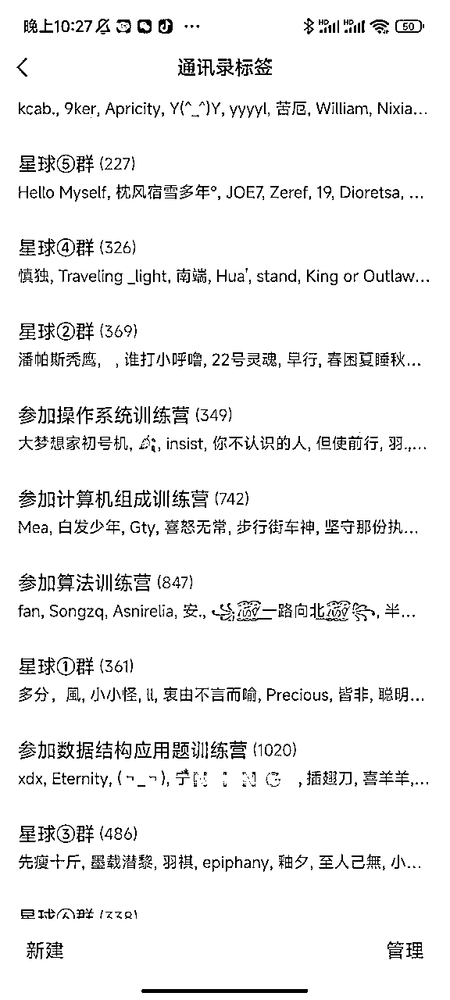
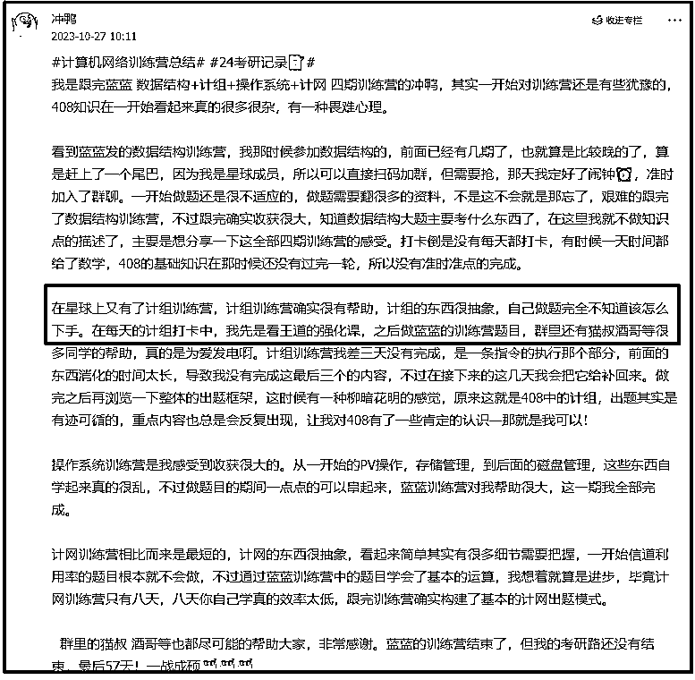

# 读研期间通过卖计算机考研资料建立了4000+付费用户星球

> 来源：[https://quwllecyip.feishu.cn/docx/C5OXdOv8lod55VxS937cQ2g8nfg](https://quwllecyip.feishu.cn/docx/C5OXdOv8lod55VxS937cQ2g8nfg)

友友好呀，我是蓝蓝，目前在成都，硕士期间通过计算机考研垂直类目的探索，深耕小红书，B站平台，通过售卖自己的复习资料，建立了4000+付费用户的星球，公域粉丝10w，成为了去年知识星球的TOP100。

来到这个大佬圈子也快一年了，更多时候是潜水，默默的学习前辈的分享，转眼间，到了续费的时候，那必须续费了。

希望将自己一路实战走来的坑，收获，快乐分享给大家，我相信我能做到，你们能做的更好。

整篇内容字数可能比较多，全文1.5w字，下面是整篇文章的目录，从为什么做副业，为什么选择虚拟资料类目，如何做一款付费的笔记，各大平台的特点，再到做一个社群，做一门课等等。

希望大家能够耐心的看完，要是能有点点收获，蓝蓝就很开心了~

另外，在这一年里，蓝蓝也收藏了前辈们在圈子中分享的优秀文章合集，希望大家能更好的用好圈子，享受过程，拿到结果。

整体的变现路径是考研---就业-----尝试副业，所用的平台路径，小红书/B站------公众号-----微信。

下面是整篇文章的目录，

# 1、个人介绍

大家好，我是蓝蓝，去年花了一年时间通过小红书+B站做计算机类考研项目，总付费人数6000+，知识星球付费人数3800+，成为了知识星球年度Top100，变现40w+，这篇文章详细的记录了这一年的变现过程，从没有话题制作视频和笔记到根本做不完的视频，从没有流量到源源不断的正反馈，相信看完这篇文章，能有点点获得感，蓝蓝就很开心了。

# 2、虚拟资料教育赛道复盘

最开始的时候也不知道这个项目叫做虚拟资料的项目，只是在公众号上面看到一篇标题为《大二，通过公众号年入10w》，内容大概是卖自己的笔记，创建自己的公众号，公众号接广告变现+卖自己的笔记。

虚拟资料赛道对于我们新手来说，算是一个非常容易出成绩的项目，也没有太多的成本，不需要物流，基本上咱们用一个手机，一个word编辑工具就可以玩儿起来了。

而且这个项目，可以完整的去体验内容制作，流量获取，朋友圈运营，社群运营等多个模块的内容。

## 2.1、为什么尝试副业

B计划探索

说起副业，其实是我们的第二项赚钱能力，对于上班族而言，是一个B计划。无论是互联网还是当前看来比较稳定的企业，都不会是绝对的稳定，行业下滑，企业失势都有可能，如果万一丢了饭碗，至少可以通过B计划来端起另一个饭碗，就像经济学家詹姆斯托宾所说："鸡蛋不要放在一个篮子里"。

当时并不知道上班以后一年到手能有多少钱，大概预计后，结合成都的房价，想要靠自己在这所城市生存下来，难度挺大，归根结底还是不安全感和穷。

也许正是因为穷，让自己赚钱的动力更足，可以一到空余时间就看大佬们的各种案例，也可以下班回家放下手机就开始码字，也可以拒绝大部分的无用社交，筹划自己后续的职业规划。

回忆过往的赚钱经历，少之又少，本科的时候去广东打过一次寒假工，差点年夜饭都错过了。在学校的时候也发过传单，读研后做过少儿培训，教培。

看似这些一份时间换取一份收入的局限性，但也许正是经历过，才知道，如果一份时间可以卖多次，那该有多好啊。

蓝蓝父母年纪已大，我的妈妈不识字，虽然不识字， 前面的几十年从摆摊卖小菜到后面小铺卖服装，独自去武汉市场中进货，在目前看来，这些事儿是需要多少的磨练才能记得住，行之有效的呀。

所以每当人问我："你最佩服的人是谁"，我会毫不犹豫的回复："我的妈妈"。

我的妈妈虽然没有文化，一辈子勤勤恳恳的维持这个家庭，带着我和两个姐姐长大，读大学，读研究生，全力以赴的支持我和姐姐们的学业。

当初中考600分，刚好当地县城高中的线，也能读，但是这个学校的升学率一般，管理不严。

我的妈妈说："儿子，你想不想去隔壁那个更好的高中，和你爸这里还攒了一些钱"。

当时的自己并不明白这里的用意，是他们觉得好学校，其学校的师生资源都会更强，管理更加的完善。

隔壁的高中分数需要650左右，如果要去那里读，就需要缴纳24000的额外费用。

现在还记得，因为爸妈在外地打工，就把钱给了表哥，连夜去排队缴钱，从而去到了这所高中。

真正的转折点来到了准备实习找工作的时候，整个家庭的顶梁柱爸爸生病住院，而且是我们所有人都不能接受的肿瘤。

白天我需要准备面试的内容，晚上轮着去照顾老爸，昨天还能活蹦乱跳的他，突然就变成了需要我们照顾的小孩，在医院里面的钱真就恍惚流水一般往下。

当老爸知道手术费需要十几万的时候，亦然的说："这个钱留着吧，是后面养老的钱，给妈妈留着"。

还在学生阶段的我，无能为力，姐也刚出去工作不久，也只能考虑众筹等方式，希望老爸能尽快地好起来。

从那儿开始，蓝蓝对钱的渴望更加的强烈，打开手机，看了网上各种的赚钱路子，仿佛的问自己这样2个问题

*   我能做什么-----我在准备面试，我能分享面试记录

*   我能提供什么----我能告诉别人在哪儿获取更多的面试信息

带着这两个问题，我在后面的复习，面试的过程中，都会将其所见所闻，通过手机拍照的方式记录下来，而这些内容就成为了后续互联网的第一桶金。

也就是说，咱们成长的每一个阶段，也都是沉淀自己的机会，沙漠不是一时而成，需要一世而成。

主业和副业的平衡

之前大佬说过，主业是为了副业做准备，副业是为了主业做准备，如果主业能和副业契合，那么所做的副业也能更好的加深对主业的理解。

蓝蓝读研是计算机专业，找工作的时候也是偏向互联网的就业，所以主业而言，其实也是计算机相关的内容。副业选择了计算机考研的赛道，也是进一步对计算机相关内容的进一步打磨和巩固。

成长的路径不需要一步百米、一步登天，只要有持续性的正确方向和目标，也可以爬的又稳、又高。

如果我们没有跑步的习惯，突然来个5公里，跑后大概率腰酸背痛，但是如果我们能坚持一个月，每天跑3公里，那一个月后大概率也能完成5公里的路程。

就这样，结合自己过往的经历，打算尝试从计算机考研的方向来入手。

## 2.2、虚拟资料几大关键点

### 2.2.1 定位

在航海家采访节目中，陈雪老师说的一句话：更多的放在用户价值上面，而不是总是在想着个人账号数据的增长。

定位不是想出来的，很多时候是做出来的，不要害怕做的不够完美，先完成再完美也许是迈出关键一步的催化剂。

蓝蓝在这几年捣鼓了好几个产品，比如小红书商单项目，闲鱼带货，夸克拉新，但总是不长久，具有一定的窗口期，即很难将内容沉淀下去，方便后续新用户直接享用。

于是就从自己的身上反复的挖掘关键点，对呀，我之前考过研，有这方面的经验，于是第二天就去注册B站，学习剪辑视频。

第一次剪辑视频挺难的，也不知道用什么工具，大家可以猜猜蓝蓝第一个剪辑工具写的什么，不是剪映，也不是PR，而是选择学习AE。现在想来，AE确实把视频制作的过程复杂化了，但是当初学习AE制作了动画，也因为这个技能阴差阳错后面接了几个单子。

对吧，线索可以由别人发现，但实际操作过程得自己去摸索，你的这个探索过程本身，就蕴含着巨大得价值。

由于我们是非常精准的方向，即计算机考研方向，其实范围就已经缩小的很小很小，即来的基本上都是计算机考研类的同学。那么如果你想要做的方向是国考，教书，方法都一样，换汤不换药，干就完事。

也不用太着急，定位是在做的过程中挖掘出来的。

像我这个类目，无外乎是类目+上岸分数/上岸学校+xxx路线/规划，比如计算机考研 | 390分上岸复旦大学 | 学习全年规划。

最开始总觉得定位是提前想好的，实际上，定位是在做的过程中挖掘出来的。

如果大家看到这里了，也可以想想自己身上可以挖掘哪些点，先去做起来，执行起来，说不定就可以呢。有了一个基本的想法，我就可以去看看对标的账号了。

当决定了探索计算机考研虚拟资料方向后，就开始方向的题目选定。比如蓝蓝最终选择了计算机考研赛道，那么对于一个考研的学生而言，即从用户的角度出发，可能有哪些痛点，哪些关键信息是他们需要的，不同的分数情况大概的复习进度是怎么样的，考研周期的一些关键时间节点的把握，整个考研期间的状态调整等等。

为了方便大家更好的参考，蓝蓝也有一个小的技巧，会将一个大的定位或者方向分为至少5个大类，然后每个大类下面细分出来10个小问题，这样是不是就差不多会有50个选题了，这是我们后面制作素材库的基础

下面也会告诉大家如何去找到这些选题，以及制作素材库，通过素材库后续就能快速的调出话题。

*   为什么考研

*   为什么选择了报考的院校

*   考研的心态变化

*   整个考研的重要阶段

*   各个科目重点的分享

### 2.2.2 调研阶段

做什么项目之前，如果之前没有人做过，或者是做的很少，那大概是机会所在。那么如何更快的了解一个方向的市场，可以参考小鹅大佬的这篇文章：《如何四小时吃透一个陌生行业》

(点击此处就跳走了，嘿嘿，希望先把这篇分享看完，蓝蓝把链接也放在了文末)

当时蓝蓝用了非常直观和简单的方式，大概了解市场情况后，就开始各大平台的-----关键词的搜索。

打开B站或者小红书的平台，通过关键字「考研」「计算机考研」「特定科目类目」搜索，就可以定位到所属领域的账号，以及一些爆款的视频，然后就是去拆解这些账号。

蓝蓝通过「关键字」搜索的方式发现，目前做的好的几个账号，很少有突破10w粉丝的博主，那这不就是妥妥的机会了！！！

干干干！

然后把几个万粉账号的图文视频都看一看，求同存异，差异化，异常值，是开始一个项目和持久化一个项目的关键。

对于新手而言，像素级模仿就非常非常的重要了。大佬刘小排老师在2021年的时候分享了这篇文章，里面详细非常详细的分享了如何用好别人的经验和认知

通过「守破离」心法口诀，总结了从模范，突破再到创新。

基于此，蓝蓝同时把他们相关视频/图文笔记的账号信息和数据做成了一个表格，通过表格就可以大概知道在什么时间节点，发什么内容，这个内容标题怎样取才能更大范围的增加播放量，这里还有比较重要的一点「标签」，后面会详细的分享怎么找到需要的对标账号，做到心里有数，指哪打哪。

### 2.2.3 赛道细分

通过上面的定位和调研阶段，也许能有个大体的方向了。这里需要注意一个点----细分赛道。

细分赛道通常是更容易出现高客单的，就比如现在很多人在做代xie的项目，前期很多是新闻稿，PPT，简历修改等比较基础的项目，单价比较低，如果后期写专业课的策划书或者数据分析类文章，那么就会筛选一大部分对这块知识盲区的人，你的单价自然就会更高，因为赛道更加细分，门槛高了，人少了。

所以如果自己有一定的专业性，就可以不用不要大而空，需要小而美，越垂直，整体会越专业。

再来举个例子，之前蓝蓝做过小学资料的类目，有的学员上来就是想做全科目的资料，这样不一定是很好的解法，而可以考虑先做一个年级or一个学科，在调研和模仿的时候会更加的专一和针对性，一旦一个年级的跑通，后面会加速我们开展其他科目的步伐。

同样的道理，有的同学是做教师类，有数学，有英语，有高中数学，高中英语，对于新手而言，最好的方式是找到一个领域中足够细分的领域，然后深耕下去，给它挖的尽可能地深，做出一个爆款，仿佛的测试爆款，直到把爆款干干净，因为你自己不把爆款干完，其他的同行一定也会用你的爆款来模仿，这就是事实。

### 2.2.4 版权规避

虚拟资料遇到一个非常多的问题就是版权问题，这里推荐大家使用开源的内容，大机构或者有一定垄断性的机构自资料就不要用了。

他们大多数是有版权的，即使是截图，图片，也不要用别人的，如果被警告就主动的下架吧。我们可以这样想，他们是我们的同行，是我们的学习对象，也是我们现在的甲方爸爸。和他们处好关系，一方面后期你接广告更加的容易，用他们的资料其实也相对方便，后期相关课程的合作会相对来说比较的丝滑，这样也是可以分CPS的，毕竟，谁还不喜欢会被推荐呢，对吧。

## 2.3、如何找到对标账号

像素级模范的开始是快速高效的找到对标账号，学习对标账号和拆解账号，里面会涉及关键词和长尾词。

### 2.3.1 什么是关键词和长尾词

一篇笔记包含标题，封面图文字等等，标题和封面是用户能直接看到的，也是我们希望他们看到会有一种感觉：点进来继续看看

而封面和标题通常是内容强相关的内容，这些通常叫做：关键词长尾词

这会直接影响平台的算法推送，自然也就影响到用户的搜索结果。当然，我们的心态是非常重要的，始终要坚信：只有提供优质的内容，就不要担心没有流量。

对于平台而言，都需要优质的内容留住用户，所以不会不推荐优质的内容，遇事儿我们就先从自身找找问题，静下心，稳下来。

其次，发完了笔记后，很多可能没有只会看小眼睛，其实不然。我们可以在手机小红书的后台看到一条笔记基本数据情况，比如【观众来源分析】【年龄分布】【推荐情况】

### 2.3.2 什么强调要注意关键词和长尾词

为什么强调笔记内容和标题封面这些位置尽可能的关键词呢。是因为小红书平台会拆词，什么意思呢

比如一句话：王道计算机考研规划保姆级规！

小红书会拆为：王道/计算机/考研规划/等等

第一种方式

【搜索栏下拉框】、【横向标签栏】、【大家都在搜】、【猜你想搜】、【搜索发现】

第二种方式

付费的第三方平台找到关键词长尾词。千瓜网站、5118网站，灰豚等都需要收费（具体收费，可上对应官网查询）

### 2.3.3 对标账号的标准

我们对标的账号不用上来就是几十万的那种，而是要去找到粉丝不多，最近有爆款的账号。一个比较简单的方法就是通过小红书自带的筛选功能即可完成。

### 2.3.4 对标的内容形式

第一步先模范，第二步在模范的基础上增加自己得内容达到模范程度的90%，即自己增加差异化的内容。这几个月小红书平台开始打击同质化内容，也是在督促我们去提升内容质量。

### 2.3.5 具体找对标账号的方法

*   主动搜索关键词：在搜索框输入计算机考研，综合排序前面的权重相对比较高，下方自动补充的是什么后面内容会给大家介绍

*   算法推荐

当大家搜索过几次计算机考研方向后，就会给你推荐一些相关的笔记，而这些笔记就是大家需要关注的，封面+标题+内容，记录下来

*   找关注者的关注者

可以去看对标笔记博主的关注列表，这些人也大概率你可以去模范学习的对象

*   关注咱们这个领域的官方署：因为他们通常会去翻拍这些优质的内容者

*   借助第三方工具：千瓜数据/新红/灰豚，不过我们这个够垂直，且笔记内容不算多，所以用处也不算大

通过这些方法就可以找我们对标的内容，标题，博主了。

经过上面的这些步骤，我们就可以获得自己的素材库了

B站对标博主：

小红书对标博主笔记

小结一下调研阶段：

*   确定方向

*   通过「关键字」寻找对应的视频/笔记内容

*   将视频的内容的基本信息，形成自己的素材库

### 2.3.6 实施阶段

当我们的表格形成以后，就可以开始学习这样几个重要的点了，这些点需要比较长期的积累，也可以后续用在小红书上面。

*   标题的选择：决定了是否是用户的需求

*   封面的选择：决定用户是否点进来

*   视频的制作：内容是否能提供价值

## 2.3、常见的几种爆款笔记

既然封面决定了用户会不会点进去，那么封面什么形式及包含的内容关键字就非常的重要，通过上面我们素材的收集，其中就可以发现爆款笔记有一个相同的点：不是惊奇，就是很干。

什么意思呢？

看到这个封面就想要知道后续的笔记内容会是什么内容，这是常见的猎奇心理。很干即通常是博主通过不同的技巧形式呈现出现来笔记，密密麻麻，给用户的感觉是看不清，但是总结的大概率很全，所以会点进去。

下面给大家看看关于考研类的一些常见封面和笔记类型

*   手稿型

这类笔记给用户一个非常直观的感觉：同行者。

什么是同行者？可以理解为今年一期考研的小伙伴，大家可能知道，考研的过程是不容易且枯燥的，那么能够找到一群志同道合的朋友，何乐而不为呢。

当然，这也是非常真实的表现。

再加上字体还写得不错，评论区通过一些话术引导大家关注，领取pdf等方式完成比较丝滑的引流。

*   拼图+文字数字

这是给用户真实体验的第二种方式，而且也是非常推荐大家使用四张图的方式来呈现内容。

因为四张图的方式能够呈现更多不同类型的图片，有的是生活，有的是埋头苦干的你，有的是笔记。

那么在后面接广告的过程中，其实也就留下了更多可放广告的位置。

*   备忘录形式

这算是一种非常经典的一种方式了，也是刚考完试同学首选的方式，因为方便，基本上每个人手机都会有备忘录这个app，写完了后直接截图也方便。

*   评论区截图+画圈形式

评论区的截图同样是真实的体现，很可能是大家的声音，再加上一个圈，突出整体的内容，也是不错的一种形式。

*   成绩单封面

这是实力的体现，说服力的直接代表。想要达到这个分数所经历了什么，也是比较常见的方式，至于这个放大的效果怎么出现的，后续会告诉大家

*   goodnote笔记形式

现在无论是考研，还是考公，现在很多人复习都会使用PAD，那么常用的知识管理or笔记管理的工具就是goodnote，这个工具也可以嵌入一些字体，让我们的笔记整体的饱和度更高。

## 2.4、高效制作爆款笔记的一些工具

在上面2.3中，我们知道了一些常见的爆款笔记长什么样，那么要做出这样的效果之前，需要了解小红书图文笔记的基础规则，比如常规的尺寸要求，图片清晰度饱和度要求等等。

尺寸要点

*   建议封面尺寸是3：4

*   图片清晰，尽量不模糊(Tip：不适用微信传输图片，微信会让图片失真，可以使用qq传输)

*   封面图尽量包含关键词

作图的工具

*   稿定设计：有专门的小红书模块，会员30一个月，先用免费的也行，某宝上面也有次数或共享的，开始的时候免费的也就够用了

*   美图秀秀：P图、拼图

*   黄油相机：制作干货类首图很多，比较多的花字，贴纸，很多免费的且不错的内容

*   批量采集素材：后羿采集器-免费

*   图片编辑处理工具：优速，小程序去水印等

常见的图文笔记图标

活动图标⚾🎾🏸🪁🏹🛹🛼⛷🏂🪂🏇🏅🎫🎪🩰🎨🎬🎧🎳🎮🧩✅⏰

旅行与地点篇🚕🏎🚓🚒🛵🏍🚞🚂🛫🛸🚏🗺🗽🏰🎡🎢⛲🏜🏔🏗💒⛪🎑🌌🌠🌃🚀🦶🎠

心情相关⭐🌟💫✨🎉❗🌈‼️

项目符号◾✔➕●■✘✔○◇☑🔘✅❎

学习职场💯🎓👔💡🔍📅📚📖📔✏ 📝🖋📘📗📙📨📜📑🗞📒📔📓📚📏🖋📝🖍🎼🎹🥁🎸🎻

手势符号👏👉💪✌👍✌🏻

日常活动🎹🎧🎁🎬⛰🔥⏳🕯🪔

购物相关🏷🔗💰💅💋👗💎🧷

漂亮的花🌻💐🌷🌸🌺🥀🌹💮🏵️

天气图标☀⚡💦☔❄🌧⛄💨🌨🌨🌨☁️⛅⛈️🌤️🌥️🌦️🌧️🌨️🌩️🌪️🌫️🌬️🌙🌚🌛🌜☀️🌝🌞☔️☂️🌂🌤⛅️🌥☁️

## 2.6、生产小红书利器---AI辅助

无论是选题还是素材库，我们都可以通过AI来辅助实现，通过AI来提升制作的效率。

## 2.7、小红书十大引流方式

再好的引流方式也抵不过基本盘-提供足够干货的内容，再好的引流技巧，没有让用户得到你的干货资料，没有击到用户的痛点，也显得无能为力。

蓝蓝是直接用之前辅导其他同学的干货笔记引流，这种纯细分的赛道，想要大的流量其实很难，但是足够的精准，只要能服务好这些精准的流量，也能实现不错的收益。

小红书是非常严格的平台，之前也给大家说过，来到任何一个平台，自然是需要大家提供足够的干货内容并能给用户提供价值，而不是进屋不送礼就算了，还去摸人家菇凉。

所以不要着急，好好养号，做干货内容，再来看下面的引流方式。

（1）准备小号，并在主页简介@小助理

风险：被同行举报会下架，举报多了账号危

（2）评论区回复客户时，直接@自己小号或者自己小号来回复

风险：艾特小号多了，容易被屏蔽。注意观察

全部艾特小号，记得换个号看了一眼，可能被屏蔽了一半多，精准客户不可浪费呀！

（3）拉群，小助理群发v

风险：用多了也会被检测

（4）小号发一条笔记，笔记图片里直接挂微信号。

大号点赞这条笔记，用户私信你的时候，直接分享小号的这条笔记，再让用户加。

（5）让对方直接留v

这个动作很重要，现在平台打击引流很严重，让对方留，我们加，不容易出错。

（6）把微信号拆分成2段，分开发

微信号记得设置成最低6个字符，新号发微信发三五十个没事，多了就会被检测到，但是拆分的话，发100个问题不大。

（7）截图自己主页

圈出自己小红书号，告诉对方这是绿色软件

（8）用小号点赞给你评论或者私信的人

小号昵称改成“完整资料看我主页”，主页笔记放微信

（9）群聊用另外的小号发引导+v

(10) 群AI+群打卡

## 2.8、不可忽视的B站变现

上面给大家分享了小红书的一些引流，做笔记的内容，其实同样的手法可以运用在B站中，而且使用B站，引流变现的难更低，因为他们

B站对于新手而言，拿到正反馈的概率极大，因为引流的难度低。

虽然很多人觉得B站是白嫖怪的地方，其实这也是非常包容的地方，而且对于新手，真的可以从B站去做，友好且有播放量，能够较快的有正反馈。

有了正反馈之后，后面的行动力会更强！！。

很多时候，不是我们不能坚持下去做一件事，而是在坚持这件事儿的时候可能因为长期的无反馈，让自己觉得没有继续做的必要，从而选择了放弃。

从最开始的引流路径：B站----公众号---微信，再到B站----微信。

下面敲重点哟：

*   当你的B站粉丝关注数达到1000，可以开启自动回复功能，这里可以直接引流公众号 or 微信

*   可以直接在视频中通过通假字的方式，比如"公主号"，"公总号"告诉用户怎么领取资料

*   同时可以在B站的动态列表中发图文引流进群

这三点对于公域平台而言是非常难得得，比如现在想要在小红书 or 知乎引流，确实就太难太难了，这也是为什么当初想要做B站的原因。

对于有一定的视频剪辑功底的小伙伴，在B站进行视频的引流，相对来更加的容易，这里也顺便回顾下蓝蓝当初做视频的踩过的一些坑。

1、国产剪辑工具大部分都够用

当初可能觉得动画时尚吧，就直接上手了AE这个工具，甚至不知道还有模板。

恩，纯手工的一帧一帧的做，现在想来相当的死板。

而且当初用的是8年历史的笔记本，每次导出视频都会出现呼呼呼的声音，不过幸好是坚持下来了，做出了第一个视频：为什么考研。

后来赚了钱换了一个台式电脑。

通过这个视频去回忆当初自己为什么考研，考研过程中经历了什么，又是怎么去选择学校等等。

这个视频当时发出后，播放量虽然有一百多，可以并没有人评论，点赞也很少，为了满足自己，我用自己的小号给自己评论了一条，嘿嘿。可能对于新手来说，这样的方式是不是比较常见呀。

虽然评论当初不多，但是有个同学私信了我：请问学长数据结构怎么学？

这正是蓝蓝了解的内容，所以第二个视频紧接着就确定了话题：数据结构复习的方法，那个时候三天就到了 1w 播放，现在2w播放了。

现在回想为什么会有1w的播放，播放量能这么高，复盘后可能是两点原因，今年我也测试了，确实是这个原因。

*   什么时间节点做什么视频，比如了解当下大部分考研同学都是准备数据结构，我就发数据结构内容，如果是当大家都在看复试内容，这个时候就准备复试相关的内容

*   提高弹幕互动性。在B站有个个性化设置(创作中心里面----找到需要设置的视频设置即可)，类似让大家投票，增加互动性，也是会让平台进一步的推荐你的视频。即公域需要了解平台的算法特点

这位同学的私信，也让我学习到了找话题的方法。

*   自己评论区提出问题：比如：大家最近有什么问题都可以提出来，点赞高的我下个视频就来讲一讲

*   在小红书其他平台的评论区查看问题，尤其高赞的图文笔记 or 评论点赞数，大概率也是B站大家的痛点

从这里开始，每个星期都不会缺少话题，基本上保持一个星期更新2~4个视频，自己剪辑视频的速度也越来越快，图文内容也越来越丰富，同时发出去的数据也都还比较好

前期视频的分享还没有想到引流，关于引流部分下面内容会详细的介绍，这些视频主要是想看看大家是否需要(了解市场情况)，发了几周视频后，从同学们的反馈告诉了自己：这事儿可以做。

对的，虽然不是第一批做这个方向的，但也算是第二批了，也许大家看到这个方向能赚到钱，目前也越来越多的小伙伴卷入其中，挺好的，这样就会出现更好的产品服务于需要的同学们。

注意：使用剪映这个工具也就足够了！！别想我去傻乎乎的用AE，学习的成本还是挺高的，当然了，如果想要学也可以，通过模板也能快速的制作出比较不错的动画。

2、评论区的图片引流

现在B站也越来越严格了，以前可以直接放什么百度云链接，现在还需要做一些处理了，也就是链接当中增加一些符号即可

3、视频/评论区通假字

比如：公众号----共总好，私信我----斯新，或者后台滴滴等等

4、自动回复设置

在B站中，达到1000个粉丝就可以开通自动回复了，这里的回复中是可以添加引流信息的，比如一些百度云链接，群号等等

5、图片的形式发放在评论区

可以把自己的引流信息制作成图片，然后放在评论区置顶，或者用小号来大号发图片，大号将图片进行置顶。

6、工坊引流

现在B站是可以直接挂货的，大家看看下面这个卖笔记的小伙伴，非常直接和丝滑。那么我们可以放个1元的东西，里面除了干货还有引流信息，相当的美哉。

## 2.9、付费资料制作

制作付费笔记

免费的资料给到别人，在使用的过程中如果出现什么问题，无论是标点符号还是错别字，可能并不会说你什么。

尽量少用免费的资料引流，成交时的泪水源于前端内容的不自信

但是如果是付费的笔记，出现知识点缺失，知识点错误，排版混乱，那必然会收到同学们的吐槽，所以工作流就要注意了，这里可以分为这样几个步骤：

*   确定笔记资料内容

*   确定笔记资料大纲目录

*   通读5遍，自行纠错

*   找几个学生来纠错并后期提供纠错奖励

*   设置封面和内容水印(一个小的技巧是，内容中的截图(图片)，在放入文章之前单独做好水印的处理)

*   收集反馈，是进一步优化和客户证言的关键所在

怎么定价

一个产品的定价和自己整体产品的体系相关。比如有1元/9.9元的引流资料，虽然是引流资料，最好还是自己整理出来的干货内容，这是后面升单的关键。

通常蓝蓝这边的定价是9.9的一份干货资料，如果是纯引流的内容，可以保持9.9的价格。也可以考虑梯度涨价的策略

*   初始价格为9.9，前200

*   200名后涨价到19.9

采取PDF、在线文档还是提供打印渠道

虚拟资料存在一个问题，就是出现盗卖的情况，毕竟是电子资料，也没有申请什么版权，人家拿去后去掉水印可能就是别人了。

这个大家放宽心，不要觉得被盗用了怎么滴，而是可以作为我们宣传的素材。

*   可以通过这个素材写一篇文章甚至录制一个视频，也不诋毁别人，只是说这件事

*   他们这样的操作无外乎咱们的资料做的不错

关于采取哪种方式，各有优缺点

*   PDF非常容易出现盗卖，记得尽可能地留自己的联系方式

*   在线文档，飞书和语雀都可以，可以设置水印、仅阅读等功能

*   打印渠道，联系渠道商家，可以拿到比较划算的价格，这种方式真题效果会更好

## 2.10、做一个社群

伴随着我们不断坚持发笔记，迭代自己的笔记，人数大概率会越来越多，找我们领取资料 or 找我们买资料的同学越来越多，大概率就需要有社群了。

使用qq群还是微信群

其实做这一块的，很多会使用qq群，方便文件的管理，以及qq群的插件比较多，后面进来的新人也可以看到之前的一些内容。

但是蓝蓝还是选择了微信群的方式，大概分了这样几个群

*   免费群，纯引流过来的群

*   不同产品的交流群，这部分会在后面私欲部分详细的分享

社群的活跃度

对于一个考研/学习类的社群，其实没必要的太过于活跃，但是作为一个社群，还是需要一定的活跃度，社群的活跃度采取这样的几个方式

*   月度的抽奖：可以是新产品的抽奖，也可以是一些会员卡的抽奖，都可以比较低价的拿到，性价比也很高

*   问题的接龙：看看大家目前遇到的问题，是自己产品打造的素材，也能有针对性地解决社群同学的问题

通过这两个小细节，社群就大概率就不会出现死群的现象。另外需要注意的一点是群广告的处理方式，对于考研的学生，难免会有各种的拼单，如果单独的拉一个拼单群，很可能出现违规的现象，这个时候就可以使用一个大一点的qq群了，专门来解决他们的拼单难点。

升级版的社群--知识星球

社群多了，干货资料多了以后，蓝蓝就开始找一个平台，至少可以提供这样几个功能

*   打卡功能

*   资料专栏区分

那么知识星球就很好的解决了这个痛点，可以标签，可以提供作业，可以用专栏，也可以做一些打卡的活动和针对星球的抽奖活动。

所以蓝蓝使用了星球，第一年做到了星球的官方的TOP100，这也就可以作为自己的中断产品，价格定位在99左右即可，后面也会无保留的分享给大家。

## 2.11、做一门课

当我们有了足够的内容沉淀后，就可以开始打磨课程，对于考研类的方向，可以细分非常的课程，大课小课都会有，甚至对于单独科目的单个知识点出一个课程。给大家列下蓝蓝大概知晓的一些课程清单，如果你们要做这块，可以去考虑考虑

*   导学---认识科目考研及扫盲常见问题

*   基础阶段------前置基础：包含一些科目的前置知识，比如计算机考研的话，那么C语言是前置基础

*   基础阶段-----科目知识点讲解：围绕专业课内容的详细讲解，基本上会覆盖大纲的所有内容

*   强化阶段----通常强化阶段是综合题大题的强化

*   冲刺阶段---冲刺阶段是把重难点以及过往考过的题拎出来专项突破

*   选择题刷题----这可以是单个科目的刷题

为什么做一门课程

课程其实一个IP的体现，对于线上课而言，非常大的一个优势就是成本足够的低。因为有了内容沉淀，脚本我们很快的准备好，后续创作课程主要是时间和精力。

可以把成本降到足够足够的低，海报的设计现在AI套起来也能完成，不用单独的找设计师设计海报。卖一份出去就是纯利润，和线下的那些店铺就完全不一样了，我们平时看到有一些店铺生意不错，但是最终还是没有经营下去，就是因为房租水电人工费太高，成本太高，利润太低，没办法存活下来。

另一个非常大的优势是运营成本低

当学员买了课的时候，讲解的足够详细，大概率他们是只需要看课程的，不过现在也是比较卷了一些，不提供一些答疑的服务，可能销量就没那么好了。

这个时候可以根据报名的情况找点去年上岸的学长学姐，成本稍微能控。

那么课程可以放在哪儿卖呢

有的博主会把录制的课程放在百度云里面直接出售，这样子的话，盗卖 or 随处分享的概率会很大，看自己的接受程度。

另外就是使用第三方平台，比如cctalk这样的平台，会给平台一些手续费，不过也算是比较方便了。

也可以考虑小鹅通这些，不过年费的单价还是比较贵的了。不过对于新手而言，甚至可以使用千聊这样的平台去做

记得留下反馈模块

无论是多小的课程，一定要记得保留反馈的模块，即使是一个问卷也是非常需要的，通过用户的反馈，我们可以得到非常重要的几点信息：

*   我们能更好的做好相关的内容

*   我们能了解到学生的学习情况，为后续答疑做备选

*   不错的评价收藏作为后续的宣传素材

## 2.12、私域变现/朋友圈人设

好了，知道了怎么创建账号，怎么制作封面，怎么发笔记，甚至上面说过做社群，做课程，这都是一些变现的方式。

变现中一个非常重要的点是：复购。

相信大家看了前面的内容，是不是有说过可以直接带货，也就是挂在平台的链接，但是这里有个非常的弊端：

复购问题

所以，如果我们把虚拟的产品挂在小红书或者B站上面，也要记得留上自己的微信，也就是让他们到达咱们的私域上面来，这样只要我们的产品不错的，复购的概率也是非常非常大的。

除了我们的产品足够硬以外，我们的朋友圈也是有一定叫讲究的。

不是千篇一律的读书成长。

也不是琳琅满目的营销广告。

而是一个有温度，有生活，有软文，有节奏的朋友圈。

有生活的朋友圈

生活类的朋友圈是对生活的感知，这不是一个营销的账号，而是会让大家看见成长的账号。

有软文的朋友圈

每一次活动活动的发售都会有主题，对于每个新增加的用户/学员，都会通过朋友圈的方式去触达到用户。不说百分之百的触达，微信好友多了一些，尽量需要6~8条朋友圈才能更好的、更多的触达到用户。

另外，每次新增的学员，都可以根据学员的基本介绍，通过聊天的记录说说你们怎么认识的，怎么来参加我们的训练营，在训练营中想要收获到什么。

通常就更容易的击打到用户的心智。

打标签的朋友圈

不同的用户购买不同的产品，比如A用户买了数学笔记，那么我们就可以将A用户放在微信的标签数学笔记下面，下次当你要推荐数学笔记的时候，其实就可以不让他再次看到相关的内容，也是减少对他们干扰的一种方式。

激活你的朋友圈

有的时候，添加了好友没有来得及打标签，时间长了，我们就很难激活到用户。这个时候，蓝蓝经常采用的方式就是点赞送红包的方式+评论告知的方式，分别对应下面的图一和图二

第一条是直接告诉点赞多少送什么，第二条是自己写的一个副业目标，想看的点赞。

这种还有个好处是，后续发售或者增加什么内容的时候，还能继续通知触达用户，哈哈哈哈，非常的香。

加餐---注册一个公众号

为了承接流量，就注册了一个公众号，所有的资料都是让大家去关注我的公众号领取。

引流到公众号后，也不知道怎么变现，直到有广告主联系自己的时候才知道：可以接别人的广告，相当于在我的公众号发别人的产品，然后广告商给我的报价是1000一条，可把我高兴坏了，意味着一个月至少可以有3000的收入了。

但是到了公众号，其实也是在公域，所以我们还得引流到私域，一个最通用的办法"加我领资料"

直接在公众号的菜单栏，自动回复这些位置设置好自动回复加你微信领取资料功能。

如果是B站视频过来的小伙伴，他们通常会关注公众号，而公众号有个设置：自动回复，只需要设置自动回复如下就可以完成大家进入qq群和+微信领取资料。

这也是让用户能最大化的了解你的产品体系比较丝滑的方式。

上面的图大家应该看见了，这也是今天为了留住流量，增加的一个方式，qq群的方式，群公告准备一份儿干货资料，加蓝蓝微信去领取，今年看来效果还是很明显的。

注意：

虽然是免费的群，也会在群文件中放一些干货的资料，只不过这些资料都会有自己付费内容的水印，这也算是一个小技巧，最大化的展示自己的其他付费内容，用心的去交付需要的同学。

那么活跃维护免费群最简单的方式就是：发红包，隔三岔五的发发红包。为了让更多的小伙伴来到微信，也会采取接龙的方式提升内容看见率。

比如A同学加了我的微信，我会让他去群里接龙一下已领取资料，这样刷屏的方式，就会比较简单的让他们到微信这边来。

毕竟微信的触达率会更高，更加方便后续的转化。微信目前可以融入10006个小伙伴，但是超过5000以后，触达率就会降低，这里采取的方式是：采用一个qq大群 or 免费的知识星球，他们添加一次就邀请他们进入池子，后面通知相关内容的时候就可以尽可能的触达到更多的用户。

## 2.13、后端产品承接

这部分再对我们后端可做产品进行一个小结，蓝蓝目前走通的路径是：考研---就业----副业。每个阶段能够提供相关的产品，可以根据他们自己的预算和需求介绍高性价比的产品就好。

1、卖笔记

蓝蓝最开始就是卖资源，卖笔记，主要是卖笔记，各种笔记都卖。

无论是考研笔记，高考笔记，数学笔记，小学笔记还是考公，考编的笔记都可以。可能你会说，好像没有这些笔记，也没经历过考研，考公，考教师怎么办呀！！

没有什么就找什么，办法肯定是比困难多的。

穿鞋的不怕光脚的，卖铲子的不怕卖小车车的。

只需要跟随这样的步伐，你就能快速的拥有一份儿笔记：

*   找到对标笔记----我们已经有了素材库，可以直接找到

*   进入同行的群(用小号进入即可，我特么哈哈哈哈，看看我有多骚了吧)

*   买同行的资料(我也没有白嫖，直接买)

*   确定下版权，虚拟资料非常要注意这一点(多看几店铺就知道，其实大家都在用一份资料。。)

*   多看几个同行，多看几份资料，你就知道：哦，我也能有笔记

2、笔记专一性

可怕的不在广，而在深。

术业有专攻，人设同样需要专一性。开始卖的笔记都比较杂，后面就专攻一个方向，也就是选择的计算机方向。通过不过的发笔记+视频的方式获取流量。

每天保持发朋友圈，生活，广告交替的来，人数越来越多，发现重复回答的问题也更多了，于是就找到了一款能够沉淀内容的APP--知识星球。

3、笔记专业性--沉淀的工具

随着自己分享的内容越来越多，大家咨询问题也越来越多，还有很多问题是重复的。之前蓝蓝经过帅张，卡尔等星球，里面可以用来沉淀之前的内容，后来就决定，干脆做一个知识星球吧，专门用来沉淀自己学习的资料，也可以回答大家提的问题。

就这样，有了自己的一个知识星球。开始将之前分享的图文内容，上传到知识星球，做好专栏的分类，长期的积累，并有了下面是星球的成长线。(Ps：后面会分享下图的一些内容)

星球单价去年一年基本上在70左右，基本上没有进行过预售环节，比较简单的方式，提前在朋友圈告诉大家， 这段时间在做一个非常干货的资料，熬夜肝的制作，给大家提供情绪价值，给足大家情绪价值就行。

这样后续官宣的时候也方便，上一个话术："直接告诉这份干货资料只能星球的童鞋领取，当然如果大家觉得这份资料有用，也可以领取优惠券，限量50张这样"。

通常情况数据就很不错，最高的一次，当天收入达到8000，即当天增加100多为童鞋进入。

4、解放双手--星球资料共创

这里学习了大佬们之前案例共创，龙珠碎片奖励的方式。蓝蓝采取的是大家分享自己的资料，我会给不错的内容精华+碎片统计，碎片达到一定的量，就可以兑换实物 or 现金的奖励。

通过这个活动，激活了星球的活跃度，大家开始不断地贡献自己的笔记和收集的干货资料，而我只需要把大家贡献的资料整理好目录就好了。

这样的好处是低成本的活跃了星球，同时让星球的内容更加的饱满，更加有价值，也可以后续更好的对星球完成推广。

5、开展小型训练营--星球资料共创

考研的同学应该知道，专业课很多时候需要分模块的训练，会在七八月份的时候针对性的对模块突击。

在平台中有航海的活动，蓝蓝也迁移了一部分功能过去，即通过打卡训练营的方式去突击这些板块。

这个板块也为后续高价的产品做好了铺垫，这也是星球去年做了一件能产生复利的事儿，开设各个科目的高性价比训练营。为什么这样说呢？可以看看下面的这些活动

*   45天算法集训，对于星球同学9.9，对于外面是29.9

*   15天的应用题训练营，对于星球9.9，对于外面29.9

*   30天组成原理训练营，对于星球19.9，对外29.9等等

甚至第一期我开了100个免费的名额 ，为什么有这个免费名额呢，毕竟他们进入星球，一定是想要好好学习的，所以相信他们进入了训练营也能好好学习，而且学习的过程中输出自己的心得，而他们输出心得会反过来影响到其他星球的同学。

而一方面我可以持续的优化训练营的过程，也能收集到同学们的反馈，如果是正向的反馈，那就是证言。

通过上面的内容，大家应该可以知道，从B站引流到公众号，后来创建星球的全过程。

有个小的注意事项：记得对每个付费同学打上标签，因为这些付费的同学是已经筛选过一次的用户，他们基本上对你的内容有一定的认可度。去年看了下，大概有6000+的小伙伴付费，服务好他们，也能很好的为后续产品完成复利。

比如初试结束后，如果可以上岸，那肯定会准备复试 or 调剂，如果没有上岸，那可能会开始找工作，甚至有些小伙伴考完研想兼职赚点生活费，基于这些需求点，蓝蓝也有提早的准备了针对性的产品，从目前的反馈来看，复利效应是非常不错的，所以好好的打磨内容，显的特别的重要！下面是初试后提供的内容

*   寒假期间的学习规划，99/位(收了20+)

*   复试资料群，29.9/位(收了700+)

*   调剂群，29.9/199/位（收了200+）

*   复试算法准备，39.9/位(收了200+)

6、星球成员细分化-----人群细分

考研作为一个周期性的产品，一年结束大概率人员就流失了，那么对于那些付费的用户，蓝蓝是想充分的利用起来的。

所以对于已经读研的同学可以放在上岸群。

已经工作了的同学，放在了工作群。

为什么做这个细分呢，还是上面朋友圈说的那个路子，不同的标签对应不同的朋友圈内容和产品，无论是工作的还是考研的，也许就会有自媒体，考公，找工作的想法。

那么蓝蓝想的是，提供不同类型的产品给他们即可，让他们知道从我这里可以拿到一些相关的产品。

但是自己是没有这个能力做这些产品，所以蓝蓝不久来了阿猫的生态，写作的，读书的，销售的等等也都有了。

7、提供咨询服务

每个同学在学习的路上，目标不一样进度也不一样，但是他们可能不太好把控好自己的进度，这其实也是他们的一个痛点，根据这个痛点就可以提供一些咨询服务，按照半小时这样的去收费就好

8、根据自己的方向提供答疑类服务

现在有了低价的产品，一直没有一些高阶的产品，所以今年三月份的时候，开始打造一个高阶一点的产品，即可专业课知识的答疑。

招聘答疑学长有两个优先条件：

*   参加过蓝蓝之前的训练营

*   知识星球的成员

并不是说外面高分选手不好，而是觉得从身边出来的同学，存在感，认同感更强，一起做事儿更加的放心，互利共赢。

这个答疑类的产品也是之前同学的需求而来，由于迟迟没有这个产品，所以去年流失了不少的用户。

这个产品分为两类，大班和小班，价格分别为599/1399。当天成交了五十多个。

9、提供定制化的服务

随着对虚拟资料的进一步深入了解，慢慢就可以衍生出一些更加高阶的产品。

这个同学考研后找到蓝蓝，根据他的一些经历，后续确定了在小红书做规划类的项目

在这几次的实操过程中，发现小红书的用户相对付费意识会更强，高阶价格的内容基本上是小红书引流而来，而且过来的小伙伴不用太多的聊天，直接就是转账。

因为通过内容给予了足够的交互感。这种的单价通常会更高。

# 3、小结

感谢大家能看到这里，以上就是蓝蓝一两年摸索出来的关于虚拟资料变现的一些内容，任何一门生意都可以拆解为定位、流量、产品、转化，四个因素形成闭环。咱们一定要坚信：在正确的方向上面投入大量的时间，拿到结果将是必然的事情。

纳瓦尔说：在“成为自己”这件事情上，没有人能比得过你。

一年时间，说长不长说短不短，但足够在大浪淘沙的筛选掉绝大数人，也足够让一直坚持的人拿到结果，因为，难的道路，从不拥挤

成长嘛，进入高能圈子，废弃那些负能量，没有价值的圈子，一个真实自我的呈现会给你带来意想不到的惊喜。

感谢提供这么好的平台，如果觉得有点点用处，感谢点赞，嘿嘿，蓝蓝谢谢你们，也希望对需要的小伙伴受用。