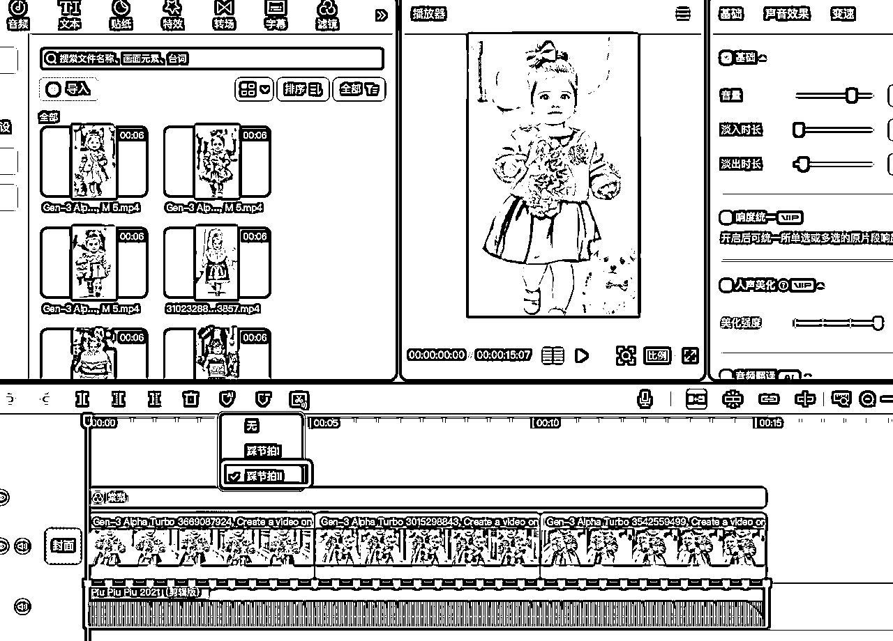
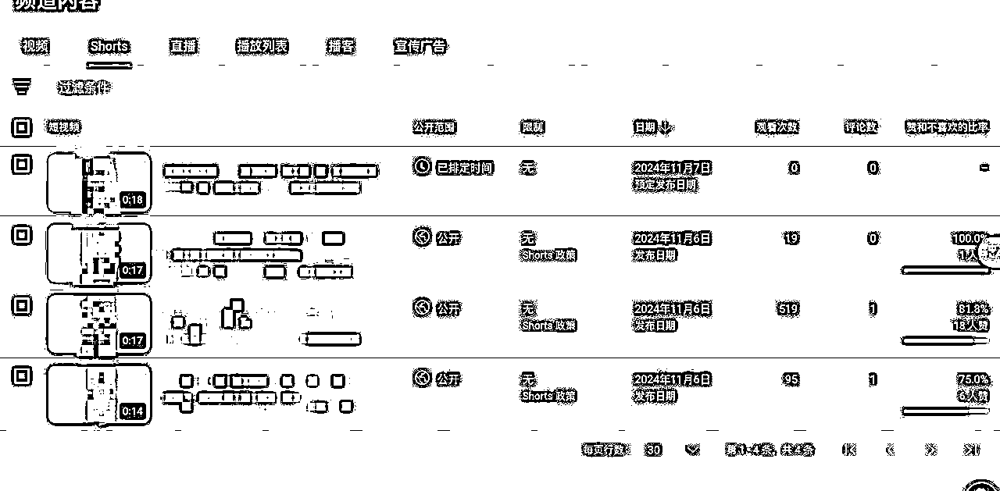
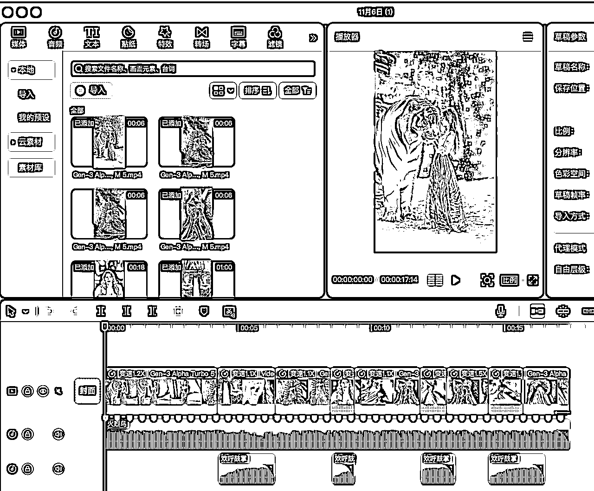

# AI宝宝走秀&magic视频制作拆解#龙珠悬赏

> 来源：[https://xqya1zd76f2.feishu.cn/docx/C5lgdZTQcoDNU3xxa7OcY3GdnUo](https://xqya1zd76f2.feishu.cn/docx/C5lgdZTQcoDNU3xxa7OcY3GdnUo)

大家好，我是竹子，去年进生财看到一条AI风向标赚了第一桶金（精华帖：https://t.zsxq.com/J7c9n ），从此一入AI赛道深似海。

AI领域今年研究挺久啦，自己也拆解了很多AI项目的制作方式。不过都是聚焦在国内的平台，知道youtube流量收益香，但是一直没去做，这次紧跟超级标的步伐做起来～

最近刚好在和小伙伴尝试做YouTube，刚发了3个视频跑一天，已经3个粉丝了哈哈哈！

感谢亦仁大佬提供的龙珠悬赏，新鲜的视频制作教程来了，除了一个AI宝宝走秀账号的详细制作流程拆解，还给大家拆解了一个进阶的Magic美国达人秀变身视频。废话不多说，直接上保姆级教程～

# 1/ 账号选择

说明你选择分析该账号的理由，深入估算他的收入：

对标YouTube博主：https://www.youtube.com/@BabyViralTrend

选择理由：AI工具制作，无需真人出镜，复刻简单，且可爱的小宝宝+萌宠视频在各个平台流量都不错。

收益情况：根据youtube博主的数据分析工具来看，这个频道每月的收入范围是$27k～$432.1k

# 2/ 选题研究

进行他的频道内容选题研究，这个账号的内容分别是什么，什么类型的内容会爆，你要做类似的账号，第一批选题会选哪些——

这个账号注册于今年5月，一共47条shorts，目前36万粉丝。

视频内容主要为AI宝宝走秀，胖胖的小女孩形象，时尚风格，室外走秀，有的会搭配可爱的小宠物（小猫小狗），每条视频的播放量都很高。

综合来看，相似的内容中，集合萌宝+萌宠的内容会数据更好，所以我们可以选择从萌宝+萌宠走秀的选题出发，可以是和狗狗或者小猫一起走，或者抱着狗狗/小猫一起走。

# 3/ 视频复刻

进行视频复刻，选取他的一个典型视频，请研究如何制作出一个和他的视频类似的视频，过程中用了哪些AI工具，剪辑工具，哪些素材，详细记录，将整个过程整理分享出来，把复刻视频分享出来，能视频呈现这个过程更好：

## 工具：

AI绘画：

-国外：Midjourney（收费，淘宝买共享账号每个月20到30元）

-国内：即梦AI（免费，每天有66免费点数）：https://jimeng.jianying.com/ai-tool/home

AI视频：

-国外：Runway：https://app.runwayml.com/video-tools

-国内：

可灵AI：https://klingai.kuaishou.com/ （缺点：清晰度会降低，且不充值就比较慢哈哈哈）

海螺AI：https://hailuoai.com/video

翻译工具：google翻译（写提示词MJ和runway都要用英文，翻译工具少不了hhh）

剪辑工具：剪映

Youtube视频提取工具：https://vtool.pro/youtube.html （每天免费次数有限）

## 制作步骤拆解：

以模仿这个视频为例：

一共是3段宝宝走秀视频，所以我们需要生成3张图片和三段视频并剪辑在一起。

### AI画图：

首先是画图，如果你自己不能写出来这个提示词的话，可以用Midjourney的/describe功能，截取一张图片，去倒推提示词。

然后就可以得到4个提示词——

我们借助翻译工具，去掉不需要的部分，总结下来能用的部分，可以加一个--cref +需要参考的图片链接（MJ的保持角色一致性功能），这样会和参考的角色更像，提示词标黄的地方，可以自由更改服装、发型等内容，其他的保持不变就行，你可以让kimi按照这个格式帮你生成很多条有创意的服装搭配～

可爱的胖胖外国女婴，面对镜头，皮肤白皙，脸圆，穿着时髦的西装，像个小模特，全身照，穿着公主鞋，牵着漂亮的小狗走在街上，大眼睛，长头发，蓬松的发髻发型，蝴蝶结发夹，美丽的脸庞，采用高清摄影拍摄，高分辨率，高细节，高品质，锐焦和30兆像素摄像头

Cute fat foreign baby girl, facing the camera, with white skin and round face, wearing a fashionable suit, like a little model, full body photo, wearing princess shoes, walking on the street holding a beautiful puppy, Big eyes, long hair, fluffy bun hair style, bow hairpin, beautiful face, shot with HD photography, high resolution, high details, high quality, sharp focus and 30 megapixel camera. --ar 9:16 --cref https://s.mj.run/Rz829y6xqSI --v 6.1

画出来的图：

即梦AI画图参考，也还挺可爱，但是需要高清输出，不然清晰度不太好：

选择好看的图片保存好，就可以进行下一步AI生成视频啦！

### AI视频：

视频生成工具我用的是Runway，在淘宝上先买个3天的账号6块前试一下，没问题就可以继续买时间更长的共享账号。共享账号的缺点就是人比较多，要排队。

有条件的小伙伴可以买独享账号或者和朋友拼车，这样方便一些。也可以先买共享的低成本跑起来再说。

runway生成视频的提示词，有GPT4的小伙伴可以去搜索runway的提示词生成的gpts。没有的话就和我一样自己手搓提示词吧哈哈，提示词参考：

简单版：

小女孩和小狗笑着向前走

Little girl and puppy smiling and walking forward

进阶版：

Create a video on AI Runway gen3 starting with the scene depicted in thr uploaded image where A little girl walks down the street with gusto,accompanied by the wind blowing her hair and her arms swinging like a normal human being, smiling joyfully,her eyes blinking once every 4 seconds slowly. The camera always keeps the character in the center of the frame, wide angle

从上传的图像中描绘的场景开始，创建一个关于AI Runway gen3的视频，一个小女孩兴高采烈地走在街上，伴随着风吹着她的头发，她的手臂像正常人一样摆动，快乐地微笑着，她的眼睛每4秒眨一次，慢慢地。摄像机始终将角色保持在画面的中心，广角

不是每条视频都很稳定，有时候会跑起来，有时候会往后走，需要多抽几次卡。

生成视频案例：

### 视频剪辑：

音乐：piupiupiu，剪映里就可以找到

可以打开AI踩节拍，这样可以看到音乐的节奏，把每一段的视频长度调整到卡点上：

如果想要人物白一点，可以加点滤镜，棠梨这个就比较显白，可以调一下程度，不要拉太满。

视频的节奏可以根据你生成的视频质量来调整，如果跑得比较快，你就调慢速一点。

视频展示案例：

视频发布文案，和国内平台一样，去对标别人的标题和话题就行：

比如：

Cute baby fashion show

Parents’ Guide to Baby Fashion: Cute & Cozy Styles for Fall #babycollection #babywear

# 4/ 类似账号：

举一反三，找到一些类似的频道，看看这些频道的收入情况

整体来看，萌娃在youtube上还是挺受欢迎的～大家都很喜欢可爱的宝宝。

账号1:https://www.youtube.com/@littleclassics7988

账号2:https://www.youtube.com/@LittleRunwayStars/shorts

账号3: https://www.youtube.com/@fungenmagic-zb6lo

账号4:https://www.youtube.com/@Sophie_434

# 5/ 行动方案

给出行动方案，如果你要准备开始做这个项目，制定一个为期三个月的目标和行动计划，包括哪些难题你需要去解决；

目前已经行动起来了，起号期间每天发1到3条视频，可以测试不同类型的视频看效果以及自己的制作成本，然后定下方向。

这是11月6日发布的视频，已经开始跑起来了——

国内做这个项目的难点主要有以下几个：

1.网络问题，这个可以上某宝搜“魔法”解决

2.google账号问题，国内手机号可能收不到验证码

3.各种AI工具账号问题，大多要收费，需要一些成本，不过这个也不算太高，一个月两百左右能搞定。

4.最大的问题是银行卡的问题，目前的方案是可以从深圳过香港申请港卡。其他的法子我暂时也还没有研究，可以看看其他圈友的分享。

目前就是先做视频干起来再说，先到能开通收益的门槛再解决其他问题，国外的流量收益还是挺香的～

# 6/ 其他案例分享

## 账号1: 可爱动物视频

比如这个撸小老虎的账号：https://www.youtube.com/@pets-dog-cat

画图：

提示词：一只小老虎宝宝，坐在一只手掌上，吐舌头，戴着皇冠

ai视频提示词：

A baby tiger sitting on a palm, tongue sticking out, wearing a crown, head tilted,

## 账号2: Magic达人秀：

https://www.youtube.com/@babymagicai/shorts

这个会有一点门槛，它的逻辑是，一个美女和一种动物共舞——人和动物融合变身

需要用到的ai视频技巧是首尾帧，以及剪辑需要一些素材。

给大家分享一个提示词框架，比如我们要做一个美女和老虎共舞，我们需要先画两张图，一张是美女和老虎分开的，一张是美女和老虎融合的。

画图用的是Midjourney，这种复杂的图片，MJ就是yyds。

提示词1:

穿着裙子和老虎跳华尔兹的美女，照片必须非常真实，尽可能详细，图像质量超高，4K，背景应该位于亮蓝色的舞台上。--ar 9:16

Beautiful girl in skirt waltzing with tiger photos must be very realistic Be as detailed as possible Ultra-high image quality, 4K The background should be on a bright blue stage. --ar 9:16 --v 6.1

提示词2:

一位身穿虎皮连衣裙的美得令人窒息的女子。毛皮打造出一件飘逸、优雅的礼服，将老虎的特征无缝地融入到她的服装中。她的头变成了老虎的头，赋予了她老虎般的威严。这件衣服的特点是复杂的毛皮图案，类似于老虎的自然形态。场景非常真实。她站在灯光明亮、蓝色光芒的舞台上，散发着空灵的气息。图像为超高清 4k，捕捉变形的每个细节，--ar 9:16 --v 6.1

A breathtakingly beautiful woman wearing a dress made entirely of tiger fur. The fur created a flowing, elegant gown that seamlessly integrated the tiger's features into her outfit. Her head transforms into that of a tiger, giving her a tiger-like majesty. The dress features an intricate fur pattern that resembles a tiger's natural form. The scene is highly realistic. She stands on a stage with bright lights and a blue glow, exuding an ethereal atmosphere. Image is Ultra HD 4k, capturing every detail of the morph, --ar 9:16 --v 6.1

AI生成视频(1上传首帧，2上传尾帧，3填写提示词）

比如，先用这两张图作为首帧和尾帧：

提示词：一个美丽的女子和老虎一起跳舞，然后幻化为一体

A beautiful woman dances with a tiger and becomes one

然后用这两张图作为首尾帧再生成一个视频：

提示词：美女和老虎一起跳舞旋转，成为一个老虎头的女人

The beauty dances and spins with the tiger, becoming a woman with a tiger head

如果觉得不够丰富，还可以生成一个变回来的视频：

首帧+尾帧：

AI视频提示词：

美女跳舞旋转，慢慢变回老虎和美女分开的样子，女人亲吻老虎

The beauty dances and spins, slowly changing back to the way the tiger and the beauty are separated, and the woman kisses the tiger

如果要换成别的动物，也是举一反三类似的操作，修改提示词描述即可～

剪辑的时候需要搜索一些美国达人秀的素材，youtube上有很多，用我们之前提到的视频解析工具，下载下来，再把评委夸张表情的片段剪出来，还可以直接用别人的视频的音频（分离音频就行）

然后在关键的地方加一点欢呼和鼓掌的音效，把人物的惊讶表情插入各个变身的节点中间混剪，注意踩节拍：

成品展示：

以上就是我的分享啦，大家可以尝试实操起来，一起赚美金冲呀！