# 手动复刻shorts爆款AI视频

> 来源：[https://qrm33w1izc.feishu.cn/docx/CBBpdId00o2k0fxM7ilcLCyhnOh](https://qrm33w1izc.feishu.cn/docx/CBBpdId00o2k0fxM7ilcLCyhnOh)

先贴一下复刻的效果

（第一个是原视频，第二个是复刻的效果）

(新鲜出炉,第一个是原视频，第二个是复刻的效果)

相对比一下效果，虽然说是“复刻”，其实还是有很大的不同，原视频更加细腻、丝滑，我做的效果有点粗糙，但是整体风格有那种感觉了，因为这是第一个作品，如果后面不断优化的话，我觉得可以做得更好。

这个视频前前后后花了差不多4个小时，花时间最多的是生成图片这个环节，如果后期要实现自动化的话，我觉得这是一个难点所在。接下来我就分享一下我“复刻”的过程，以及遇到的问题.

# 1.找对标账号

因为我主要是练手，所以直接找了@叉叉敌 大佬案例中的账号，如果正式做内容的话建议先看看@老马内容出海 等大佬的抓对标账号的贴子，里面都写得非常详细了。

# 2.截取视频关键帧

我直接在播放页面截的图，对标的这个视频大概10来个视频片段，每个视频片段截取一张图，自动截取的话大家可以参考@叉叉敌 大佬的 一件复刻的贴子。

# 3.生成自己的基准图

整体思路都是差不多的：

*   用AI分析图片生成描述词

*   通过描述词生成图片

*   图片生成好后，可以直接用图片做成转场视频（简单），也可以把图片用AI生成视频，在拼接成一个完整的视频（更酷），两种方式都行。

我今天分享的例子是，通过豆包分析和生成图片，通过runway生成视频。

## 3.1用豆包分析描述词

直接把截取的图片发给豆包就行了，让他解释这张图片，但是他只能说出整体的构图，主体、色彩、光影、风格、背景, 细节的话不会很具体，可以继续追问，比如补充服装细节，增加什么表情等等，如果想“复刻”表情、动作这些细节的话，就要不断微调描述词了。而我遇到的最大的困难就是调整描述词了，因为总会和我预期中的有点点差别。

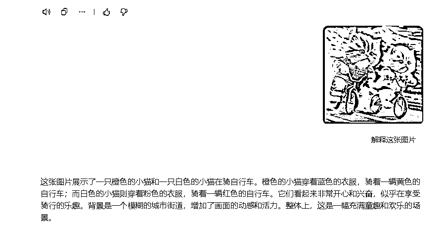

## 3.2调整描述词遇到的问题

我尝试过很多命令，一开始想着像素级还原，精准复刻，比如：“我想用AI生成一张这样的图，相似度90%，请帮我写好描述词”，目的是想尽量一样，然后再去微调，但给出的结果和上面一样，底层原理我不知道，但是想着凭几句话就能描述这么多像素点，肯定是不可能的，所以就放弃了，包括我测试了其他平台（可灵），同样的描述词生成出来的风格也完全不一样，可能是跟平台的模型有关系，那就不纠结了，相似度有个7-80%也行了。因为即使同一个平台，也不可能做出完全一样的图片。

关键词与效果不匹配

他不按我说的词来生成，比如我想让小猫咪抬脚踢人，它死活都不动一下，有时候让它坐着，它也不坐，我想让自行车倒在地上，但我把所有能形容的词都给平台了，做不出自行车倒在地上的效果，非常的头疼，这里我总结了下面几种情况：

1.平台识别不了关键词。那就换个词，比如踢人、抬腿没效果，换成“跑"，看上去像在踢人。

2.本身平台就不太支持。比如小猫咪骑车的时候，我想让自行车倒在地上，但尝试了很多描述词，都不行，

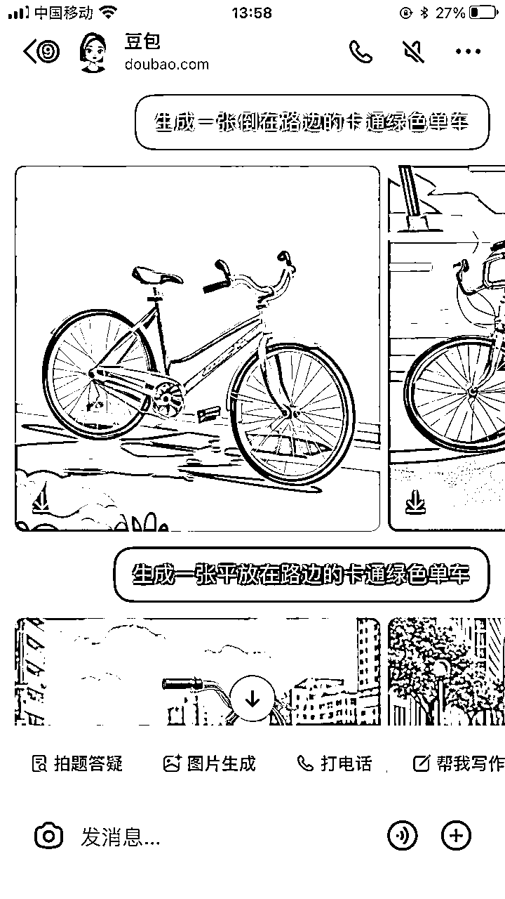

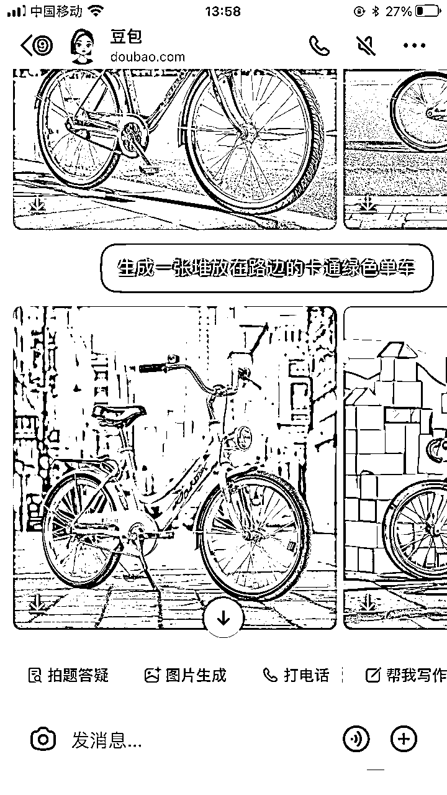

都整得我开始自我怀疑了，是不是我表达有误， 我想着我是生财人，不能自我怀疑，于是画风一变，我现场拍了一张倒在地上得单车，让它解释，然后让它生成， 甚至根据它自带得建议，倾斜多少度，也不行，说明平台能理解，但是就是做不到，于是就放弃了。（所以需要多测试几种平台）

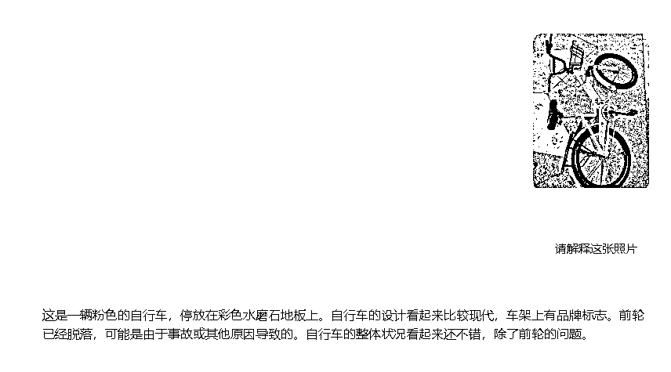

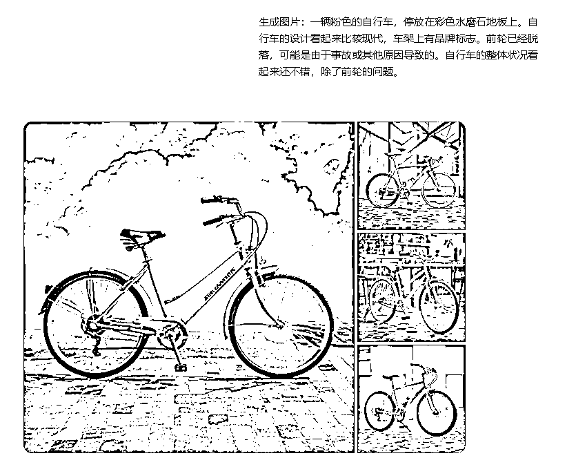

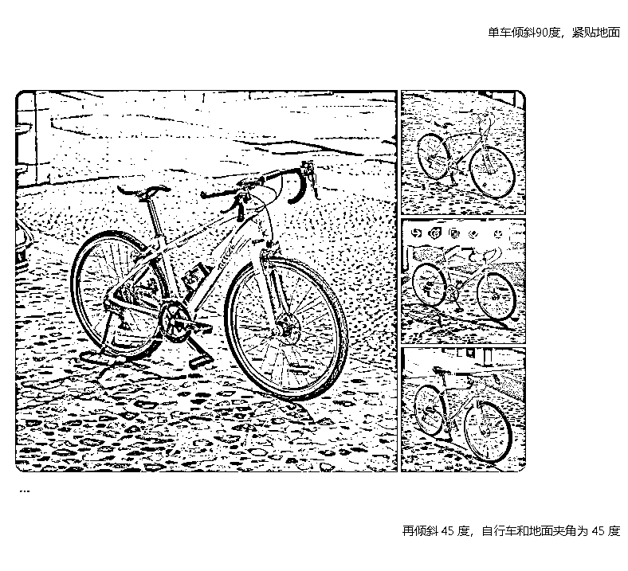

结果就是猫摔了，车还立着，物理学上也解释得过去。

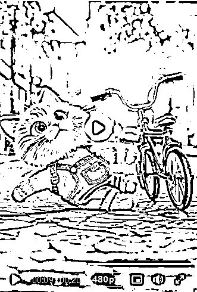

3.描述词结构不准确。关键词所在的位置不一样，效果也会有所不同，如何提升描述词得准确率，那就是最懂平台得就是平台自己，可以直接问他，

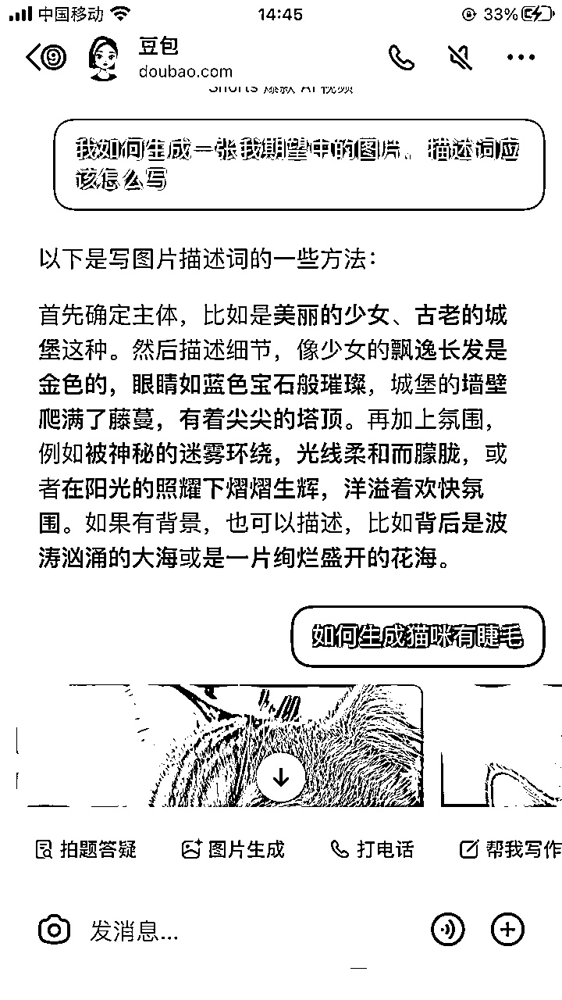

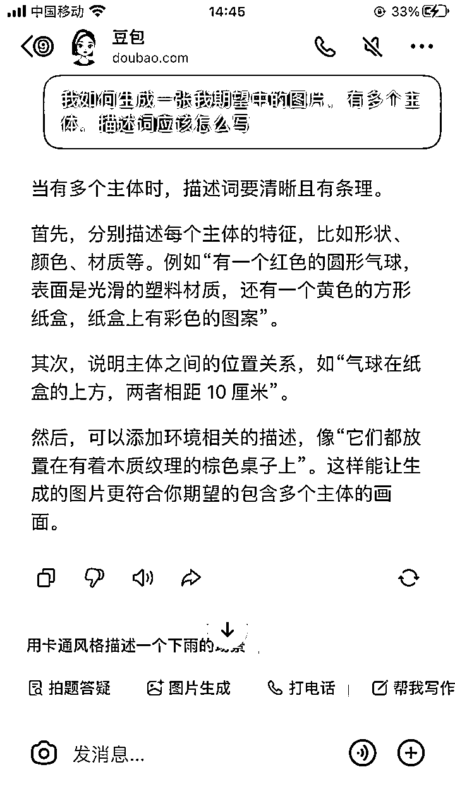

当提示词和你期望中的图片不一样时，有可能时关键词放置的位置不对，可以对照平台的建议调整位置，就能得到想要的效果

比如我想实现小猫咪坐在梳妆台上的效果，第一个描述词改了很多次，实现不了，后来对照上面的结构，把小猫咪做为第二个主体描述，并说明它的空间状态，一遍就生成出来了。

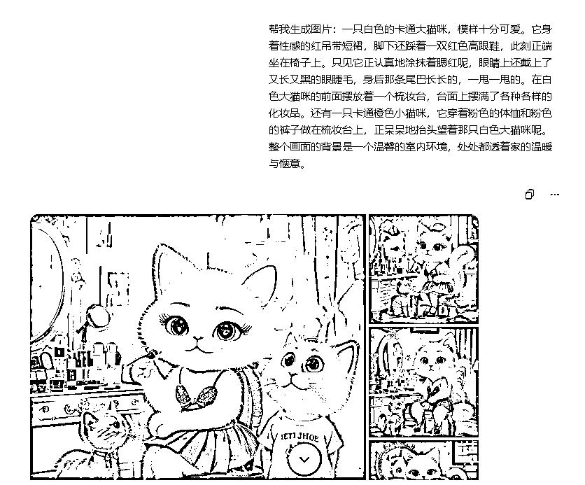

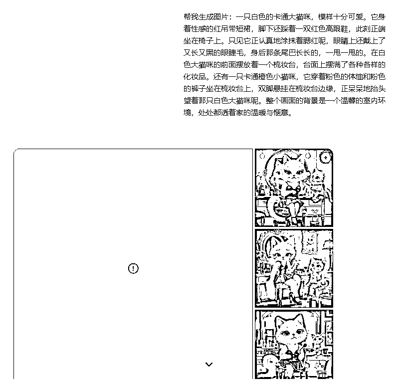

## 3.3保持风格统一

因为是剧情的，主体的风格尽量保持一致，衣着打扮，豆包每次解释图片的时候，描述的细节有可能不一样，比如第一次描述了衣服、猫是卡通的，第二次有些细节就丢了，没有描述衣服或者猫的类型，甚至猫本身的颜色都忘记了，所以第一次主体确定后，可以复制出来，在后面的描述词中重复使用，这样可以减少试错的次数。

## 3.4调整图片比例

如何生成9：16的图片，如果生成之后再去让它该比例的话，图片会发生变化，用他自带的扩图功能的话就不会变化

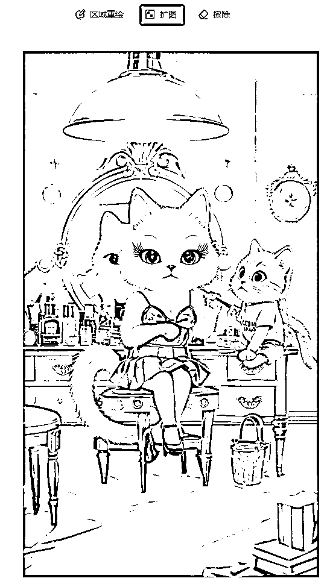

# 4.图片转视频

确定最终的图片后，然后把图片转成视频，我用的是runway（可灵也试过，效果没这么丝滑），runway的操作也比较简单，直接把图片上传上去，描述词的话我把生成图片的描述词直接用豆包翻译成英文放上去的，没做其他修改,

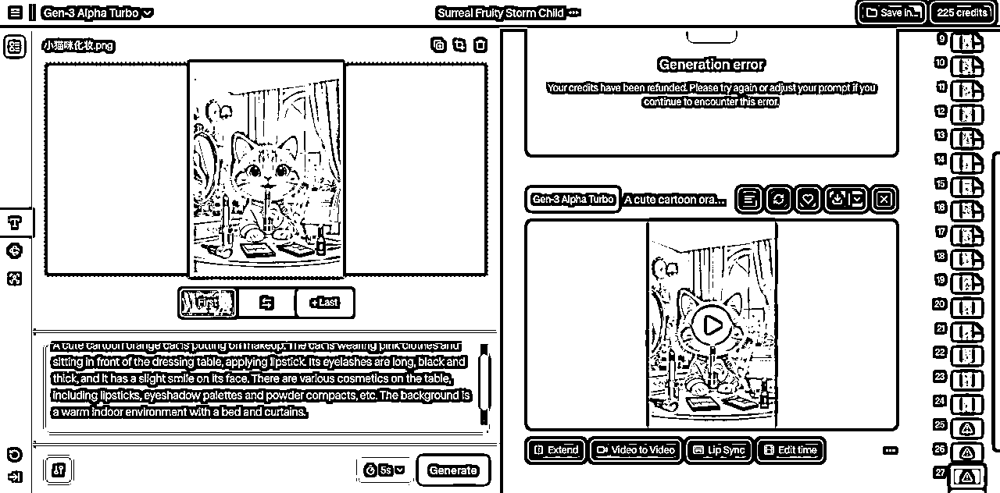

生成速度很快，生成完后直接下下来就可以了。

然后重复上面的步骤，把所有的图片都生成短视频。

# 5.拼接视频

直接在剪映中操作即可，加上背景音乐，把每段的视频长短、速度调整一下。

# 6.接下来要做的事

再手动还原几个作品，发出去先看看效果，为什么我先选择手动”复刻“呢？因为我想把完整的流程走一遍，尽量找出过程中可能会遇到的问题，以及尽量和对标视频解决，测试平台的可控性.

如果要自动化可能会遇到的问题，那就是我前面说的描述词不可控的问题，目前还没找到很好的办法.

想要效果做的更好，需要多测试。