# 生财分享：传统税务咨询的新赛道：垂直行业定制化税务合规产品

> 来源：[https://chengjiu.feishu.cn/docx/DMq7dsAOeoj9PCxGFg3cSmxJnGb](https://chengjiu.feishu.cn/docx/DMq7dsAOeoj9PCxGFg3cSmxJnGb)

大家好，我是超群，前税友集团运营总监，深耕财税行业8年，目前是橙就咨询创始人，深度陪伴财税公司健康经营增长。这次给大家带来的分享是《财税公司定制化税务合规产品》项目，该项目是我的咨询辅导客户案例（某头部财税公司）在小红书做垂直行业的税务合规产品单月获取200+客资的分享。我在生财星球混迹2年，一直潜水学习各位大佬的精华帖，很感谢大家的输出，受益匪浅。这是我第一次发帖，如果你现在正在经营一家财税公司，或者你是一个财税行业从业人员，希望这次的分享对你有所启发。

【我是】超群

【行业】财税

【城市】杭州

【优势评测】

① 盖洛普 TOP5: 成就、战略、学习、行动、统筹

② MBTI：ESTJ

【自我介绍】

①.橙就咨询创始人，10年Tob客户增长实战经验的操盘手，从0到1在杭经历3次买房的90后，操盘100多个项目且90%结果超预期的项目落地专家。

②.前税友集团（税务第一股）运营总监，擅长营销获客、团队管理、项目落地，带团队从 0 到 1 经历财税SAAS（亿企代账）成为全国市占率第一的产品，且打造多个行业营销爆款case。 目前，是多家头部财税公司的双域营销顾问，陪伴财税公司持续健康增长。

③.原创内容作品：《代账经营增长秘籍》、《新手创业实战指南》、《代账日历》（2019-2022）、《短视频获客36计》，特别擅长基于“业务+内容”的设计进行批量获客、转化

【我能提供】

① 中小微企业全生命周期需求：工商/代账/税务合规/金融/法务/知识产权/项目申报等；

② 企服公司全域成交闭环落地辅导

③ 企服公司内部经营萃取+知识管理辅导

【期待交流话题】

开拓新视野，链接同频者[握手]

# 一、背景：项目及财税行业的变化和趋势？

首先，对于一家财税公司来说，为什么会有这个项目呢？

咱们先来看看，这几年财税行业的变化和趋势，主要是以下2点：

1.  经济增速放缓，导致财税行业火拼内卷

自从2022年底，我国全面开放以来，后疫情时代经济开始缓慢复苏。但2023-2024年，总体经济增速依旧缓慢。对于注重企业服务的财税行业而言，当下中小微企业的生存环境实际上越来越恶劣，“生存难”成为普遍现象，进面导致代账行业也开始进入“内卷”时代，财税公司竞争进一步加剧，拼价格、拼服务、拼技术……方方面面都要“血拼”，这时候就要考验财税公司组织机制是否高效、服务效率是否领先了，只有让客户满意才能获得更多利润。

1.  金税四期上线，企业财税合规意识和需求更强烈

伴随内卷时代同步开启的，还有金税四期的到来。数电票、电子税务局全国统一、企业信息联网、优化简化纳税服务等趋势逐渐显露。那么，对于财税行业的影响是怎样的?主要有以下趋势。

趋势一: 财税代理行业接下来的两到三年内，将迎来高度数字化和标准化的一个财税作业时代。随之带来的好处是:税务数据处理能力越来越强，税务系统将会进一步地加强查账征收的推广范围，从普通企业转向个体户。原来的很多非个体户必须转成个体户，财税行业客户基本盘会有一定程度的扩大。但是，也为财税行业带来了负面能响，普通记账报税服务将逐渐变得差异化减小、用户价值感降低，进而使得代理记账价格持续下探。

趋势二:金税四期之后，合规的空间将变得更大，企业合规才有持续发展空间。今后税收征管趋向于三流归集管理，会在数电票、金融监管、个税社保上实现三种数据流归集。税务征管越来越趋向大数据归集，联动多平台进行信用风险监控，实现以数据信息化治理税务，也就是“以数治税”，而不是以前的以票治税。

如此持续，可想而知企业财税合规的意识和需求将越来越强烈，会越来越意识到只有合规才有持续的发展空间，对财税公司的财税问题解决能力诉求也会要求更高。这时候考验财税公司的已经不是单纯的基础代理记账服务能力， 而是能不能提供更优质服务、甚至是定制化的财税服务产品，才能更精准地匹配企业的需求。

# 二、产品：项目是怎么挖掘出来的？

背景：国家用个税app交税，税务透明，国家税务越来越严格，博主和网红因为收入高，更加关注合理税务规划问题。

好，有了对财税行业趋势的基础了解之后，我们来看下这个项目是如何进一步被挖掘出来的？

1.  当下财税公司在前端营销侧存在的问题：

*   大多数传统财税公司擅长的是基础财税服务，核心的增长主要围绕基于存量做服务营销，优先成交的还是那波有意向或高意向的存量客户；

*   大多财税公司更擅长传统营销（陌拜、下户、面销、会销），不擅长高端业务（经营管理者、财税合规），更不擅长去线上搞流量；

*   流量越来越分裂、越来越多的财税公司在平台上投流量，成本也越来越高。但大多数财税公司压根不知道如何去打磨内容素材+留资路径，所以收效甚微；

*   越来越多的财税公司在抖音、视频号、小红书通过内容获取客资，拿小红书举例，卷的都是基础业务（公司注册、代理记账等），产品+服务高度同质化的情况下，只能无奈卷价格，导致没利润。

1.  做大而全，不如做垂直细分行业！

如何和同行形成差异化竞争？

（1）确定产品方向

财税公司都在卷基础工商代办、代理记账业务，能真正做好高端业务（经营账、税务合规）的同行并不多，因为这需要更高的专业性和方案老师。同时，拿税务合规产品来说，从2023年初来看。大多数同行做的还是泛行业，不够聚焦，从获客到交付的全链路精力也更分散。

基于此，我们首先确定了产品方向，一定要做一款高利润（3-5万客单价）的税务合规产品。

（2）确定行业大类

在如何确定行业这件事上，我们考虑的是以下几点：

*   是否有积累：这个行业，我们这家财税公司是否有存量客户案例？

*   是否够专业：这个行业，我们的后端老师是否能支撑顺利交付？

*   是否是蓝海：这个行业，是否有足够多的人群有财税痛点，但做的人不多？

基于此，我们做了6大行业（餐饮业、生产制造业、教育培训业、金融业、商业服务业、电商行业）的客户画像分析讨论，初步选定在电商行业。

（3）确定行业细分

当下，电商企业的财税状况受到多种因素的影响，其中包括行业特点、市场竞争、税收政策等。根据统计数据，电商企业税负转高，2019年电商企业税负约为 23%，高于整个行业平均水平。目前电商行业还存在许多问题待解决，其中电商财税问题主要表现为虚报、逃税、偷税等行为。由于电商企业的交易量大、交易平台多，税务管理难度较大，因此一些企业存在违法违规行为，给税务管理带来很大的挑战。

随着“金税四期”的税务征管应用不断升级，税务监管从“以票控税”向“以数治税'转换，近年来电商企业和网红主播层出不穷的涉税案件，充分体现了新征管形势下的税务监管新动向。

到这里，我们基本确定了我们要做的行业就是：电商行业-网红直播带货细分赛道。

（4）分析客户痛点

通过研究分析行业调研报告，我们得出电商直播带货企业所面临的高频财税问题如下：

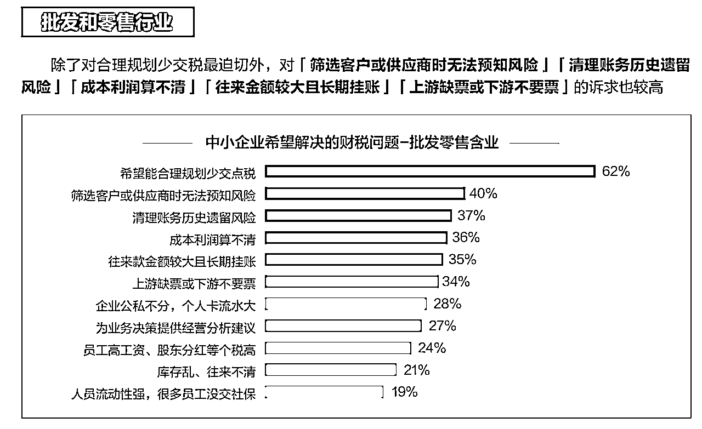

*   客户群体都是个人，基本上是不需要发票，导致很多收入没有申报，涉税风险很高；

*   网红主播隐匿、少计收入导致的少缴税款；

*   上游采购进项发票都需要加点取，有些甚至加点也取不到；

*   产品毛利高，各大平台的运营投流费用占比很高，导致增值税税额差很大；

*   企业的资金往来打款比较乱，长期公私不分；

*   员工工资、社保、个税不规范、存在很大被举报的风险；

*   ......

（5）进行产品定位及设计

基于上述分析，最终我们完成了产品定位和设计，如下：

针对年收入50w、100w、300w、500w+的网红带货直播人群，提供3-5万客单价的定制化主播财税合规解决方案（产品），帮助这些网红带货主播，在合理、合规、安全的前提下进行节税。

# 三、流量：线索是怎么获取的？

1.  确定小红书为获客主阵地

潜在用户在哪里，我们就去做哪个平台。我们的客户群体主要是：

*   电商带货主播、带货网红，有明显财税痛点需求，但不知道找谁来解决问题；

*   20-35岁年轻女性居多，主要集中在一线城市；

*   高消费能力，爱美，关注时尚、穿搭、护肤等，追求精致生活。

随后，我们进一步分析小红书的平台用户画像，具有以下特点：

（1)性别分布：

女性占主导：小红书用户中女性占比较高，男女比例约为 3:7。女性用户对购物、时尚、美妆、美食、母婴等话题有较高的兴趣和关注度，是平台内容创作和消费的重要力量。

（2）年龄层次：

年轻化趋势明显：95 后占比为 50%，00 后占比为 35%。整体用户年龄集中在 18-35 岁之间，这一年龄段的用户具有较强的消费意愿和能力，对新鲜事物充满兴趣，乐于尝试和分享，是小红书的核心用户群体。

（3）地域分布：

经济发达地区集中：用户主要集中在广东、上海、北京、浙江、江苏等经济发达地区。这些地区的用户具有较高的消费能力和生活品质追求，对各类优质产品和服务的需求较大，也更愿意在平台上分享自己的生活经验和消费体验。

（4）消费能力：

中高消费为主：小红书的受众更多是中等消费及以上人群，该类人群总和将近 90%。他们注重产品的品质和品牌，愿意为高品质的商品和服务支付较高的价格，具有较高的消费潜力和市场价值。

（5）兴趣偏好：

时尚美妆类：对穿搭、美妆、护肤等时尚美容领域关注度高，流行男女紧跟当下热门趋势，对于穿搭、美妆、明星娱乐资讯等内容关注较多。“妆容分享” 是美妆个护行业的主流内容，用户对国货、新品牌的接受度较高，且对 “抗老” 等长期的热门需求有较高的关注度。

美食类：美食相关内容受欢迎，用户对新式茶饮、咖啡、速食产品、冰淇淋等美食的讨论和分享热度较高，同时也关注食品的品质、健康、休闲、便捷等属性。

生活方式类：包括家居家装、运动户外、宠物等。家居方面，用户注重家居的细节和品质，追求生活幸福感，对家改造、小空间利用、个性化、科技智能等方面有较高的兴趣；运动户外领域，运动项目朝全民化发展，用户对休闲、硬核项目有较高的参与度；宠物方面，“小喵咪” 等宠物相关内容治愈人心，用户注重宠物的品质和精细化喂养。

（6）行为特点：

分享意愿强：用户乐于分享自己的生活经验、购物心得、产品使用体验等，通过图文、短视频等形式发布笔记，形成了丰富的 UGC 内容。这种分享行为不仅帮助其他用户获取信息，也增强了用户之间的互动和社交关系。

消费决策受影响大：用户容易受到平台上的达人推荐、种草笔记等影响，在购买商品和服务时，会参考其他用户的评价和建议，从而做出消费决策。

我们发现网红带货主播+小红书，人群和平台天然具有匹配性。基于此，我们在2023年3月份开始启动小红书的账号运营。

2、确定账号定位和变现路径

基于上述产品定位，小红书账号的内容方向主要集中在网红主播、直播电商的财税相关问题上。专注于为网红主播或相关从业者提供财税方面的专业知识和测税算税方案，吸引这一特定群体的关注，从而产生私信、留资转化。

我们做的是ToB业务，所以很明确我们的变现路径如下：

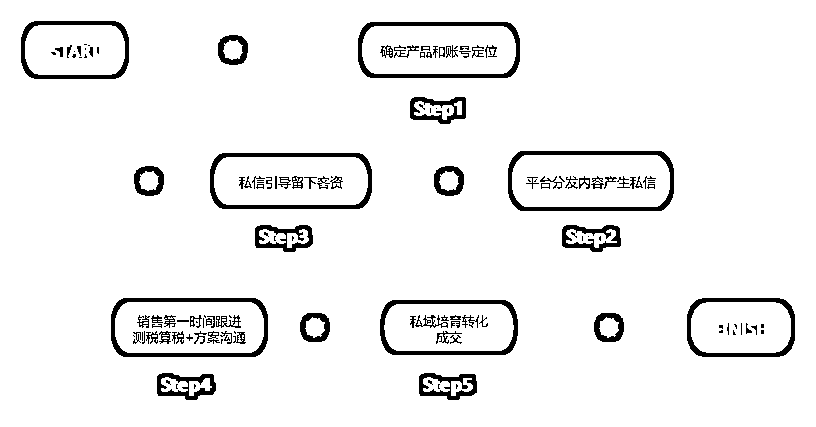

所以，我们做小红书账号，最关注的是：内容是否匹配，来私信的潜客是否精准，是否能丝滑留下客资。更关注私信量、留资数量，对于粉丝量指标反而是没那么特别关注。

2、如何筛选笔记选题？

Step1：内部调研：针对内部员工（财税顾问、会计、方案老师等），展开调研，按行业按类型收集客户高频咨询的3-5个问题，最终得出了230多个问题；

Step2：平台分析：通过第三方工具（新红、灰豚等）+平台关键词搜索，特别是高数据（阅读、评论、收藏）笔记分析，最终得出了150个问题；

Step3：问题处理：将上述2个渠道筛选出来的问题，进行合并同类型，得出了180个选题。

Step4：人群匹配：针对电商带货直播/网红群体的痛点梳理，在180个选题中进行优化、排序，最终得出电商主播关心的150个高频选题库。

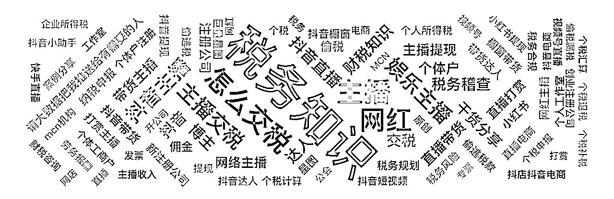

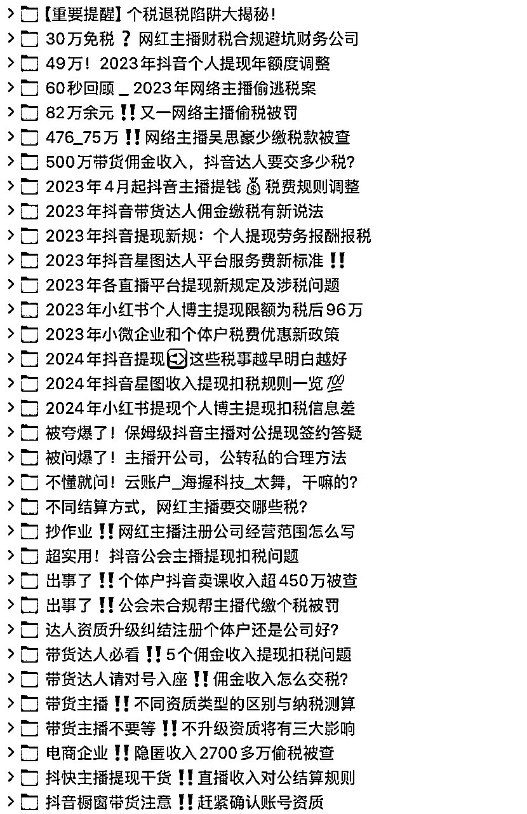

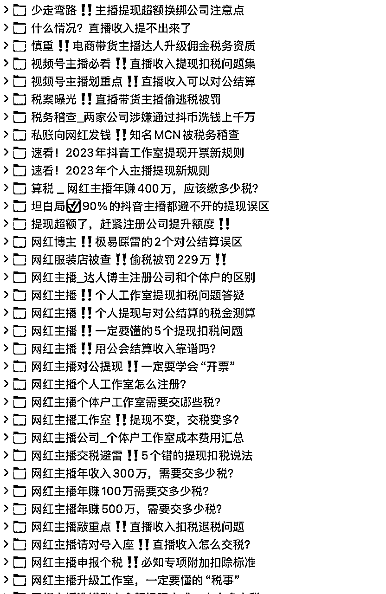

3、如何设计内容钩子？

在内容钩子方面的设计，我们主打一个简单+精准匹配，钩子主要是：为网红带货主播提供免费的测税算税服务+提供税务优化解决方案。

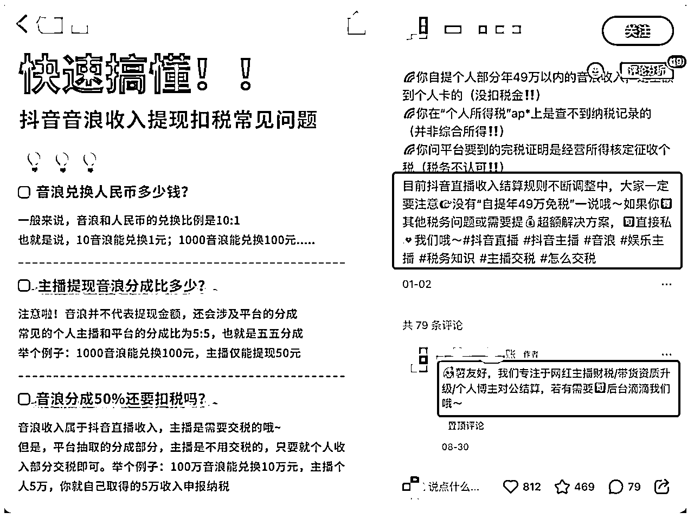

4、制作内容笔记？

小红书账号笔记前期周更新3-4条内容，后期周更新1-2条内容。

最核心的几个要素：

*   标题（阅读量）

*   首图（超级重要，阅读量）

*   图文/视频内容（互动量）

*   编辑框文本（1000字）

*   关键词（决定了搜索收录）

这里着重讲一下2点：

（1）笔记标题

笔记标题基于客户对象，一定要有代入感、场景化、画面感，在描述上越具体越好，有细节、要有长尾关键词（能被平台搜到）；不要堆砌太多术语，简单明了表述最佳，字越少越吸睛，别太啰嗦。

(2)封面模版

关于封面模版我们非常重要，经历了不同阶段摸索：

1.0阶段：探索期，测试打开率，没有固定风格；

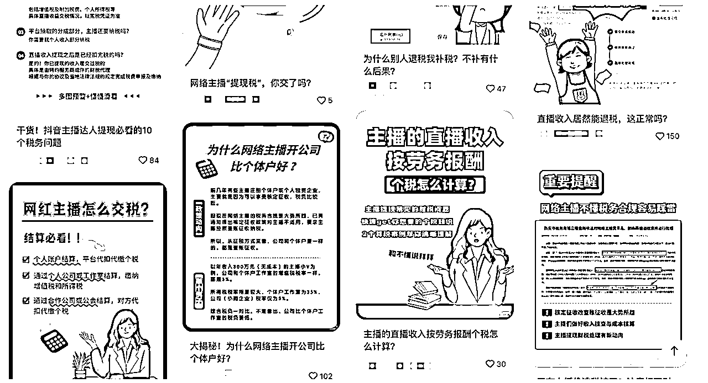

2.0阶段：优化期，优化封面图的表现形式，力求简洁明了；

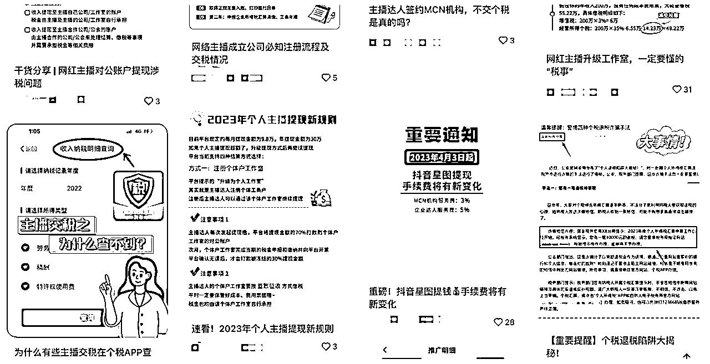

3.0阶段：稳定期，初步形成笔记封面模版，并测试数据ok；

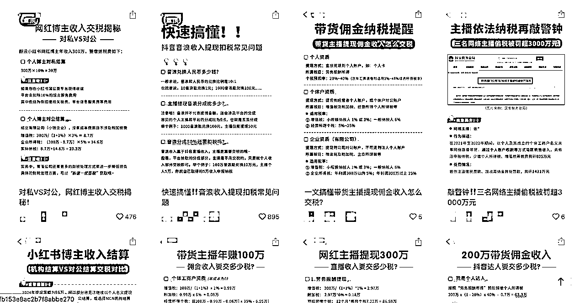

总结下来，一张好的首图封面啥样？

*   主题明确，突出重点；

*   画面清晰、简洁，避免杂乱整体配色保持和谐，不要花里胡哨标题简短明了，有吸引力，字体字号尽量统一；

*   尺寸统一:3:4(竖屏)、1:1(正方形)和 4:3(横屏)。

5、如何丝滑引流私域？

在2023年3月到2023年11月，在小红书上面偷流量，还是很丝滑的。由于小红书的商业化也在自我进化中，当时我们也没有投广，纯自然流为主吸引客资。

那么，我们获取线索主要是以下方式：

（1）首页留联系方式：

在小红书主页，设置分类（留电话号码进行引流）

（2）笔记文案+评论区进行引导私信

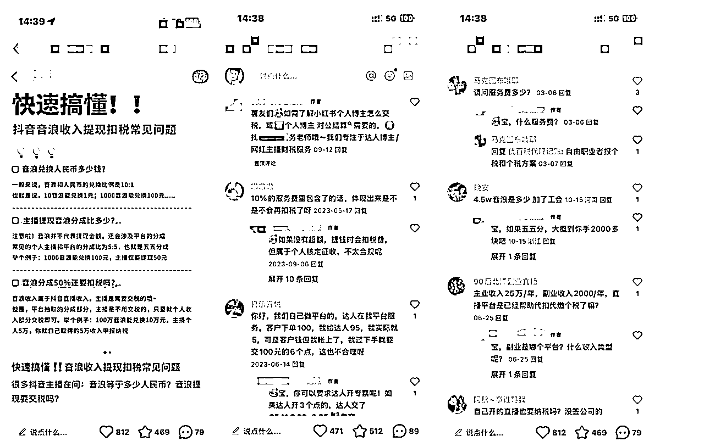

到后面2023年底开通聚光后，就以【官方账号】+小号的组合方式进行进一步引导客户留资，用过的方式有：

*   小号手动艾特

*   私信图片引流

*   转发笔记引流

......

同时，这个产品在2023年底，发现做的人也开始多起来了，竞争加剧。

1.  小红书笔记客资数据

1.  笔记数据概览

截止2024年10月，数据概览如下：

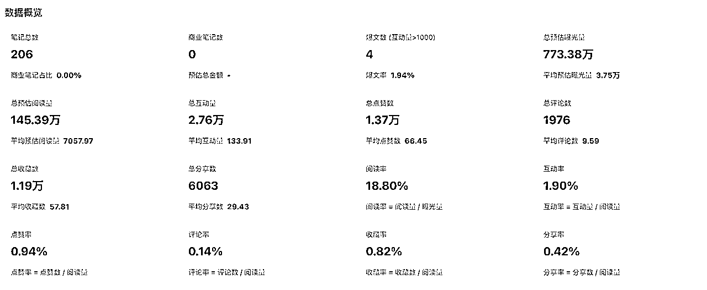

1.  笔记数据趋势

从2023年2月底开始做笔记，做了1-2个月，就开始出现小爆款笔记了，这充分说明了精准匹配客群的内容是有杀伤力的。

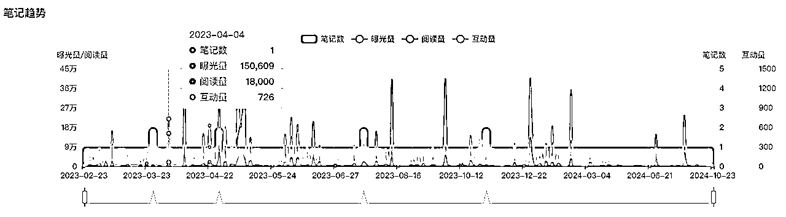

200篇笔记中，阅读过万的笔记有40篇，基本都是围绕带货主播所关心的税务问题，所对应的用户互动数据（点赞、收藏、评论）都不错。

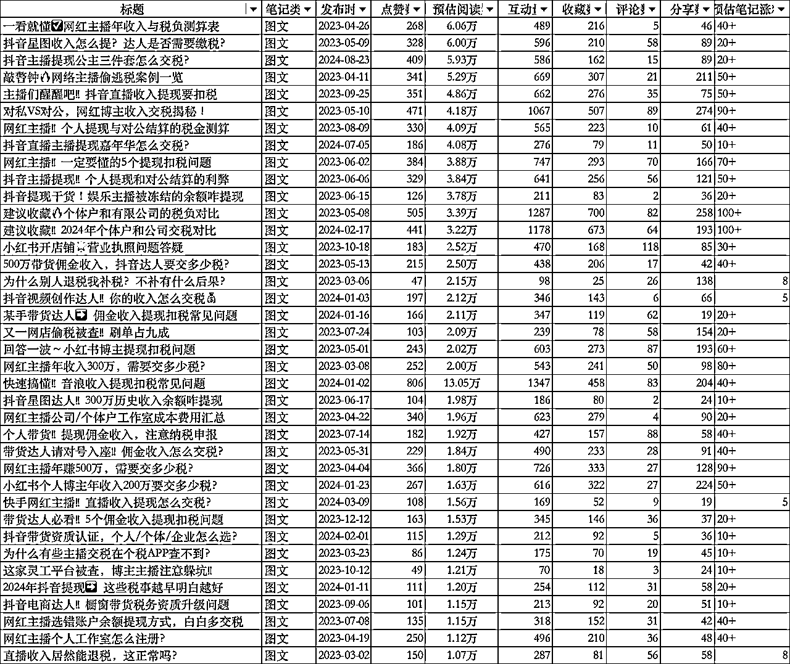

1.  笔记获客数据如何？

通过笔记内容的方式，从2023年8月开始，每个月自然流留资170条左右，在2023年12月开始稳定在200条留资左右。且做到了，电商带货主播人群在小红书搜索相关选题，大多数问题能在第一屏搜索到我们，并产生咨询。

# 四、转化：产品是怎么转化的？

当小红书笔记产生客户留资，我们是如何做转化的？

1.  同步线索

运营第一时间将线索登记到企业微信的《销售过程管理表格》进行线索分配，在内部销售群做好同步。

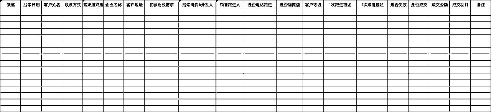

在销售跟进上，我们基本要求如下：

*   快速响应：收到线索10分钟内必须响应，给客户进行首轮电话沟通，了解客户需求；

*   跟进反馈：和客户跟进完，在企业微信销售过程表中，登记跟进记录，实时同步；

*   必须加微：首轮电话一定一定要加微信，建立后续的触点，持续跟进。

1.  电话沟通

因为笔记是有预留钩子的（为网红带货主播提供免费的测税算税服务+提供税务优化解决方案），所以留资的潜在网红带货主播，会更关心如何省钱。那么电话沟通核心是：

*   自我介绍：告知潜客我是谁，能给你解决什么问题；

*   了解需求：了解潜客的基本情况、以及具体的财税需求；

*   给与福利：告诉潜客能免费测税算税，引导加微信做后续沟通。

1.  方案沟通

加了微信后，核心是提供免费的测税算税服务，以及针对潜在客户的现状需求，匹配对应的税务合规方案，进行二次沟通，解决客户的异议问题。

这里的二次沟通，如果是本地的主播，我们会约到公司进行商务洽谈，能够展现公司实力和增强信任感，便于现场签单。如果是外地的主播，我们主要以线上的方式进行方案沟通。

1.  私域培育

如果客户还在犹豫考虑，我们的方案老师在私域朋友圈会每天发朋友圈内容加速客户的信任。朋友圈内容围绕网红主播财税专家的私域IP内容建设，主要是：财税知识分享、客户脱敏案例、成交晒单、客户口碑、行业思考、日常生活等。

1.  成交转化

2023年，每个月170条左右的留资，我们的产品平均客单价在3w左右，基本上15%的平均转化率，好的时候能达到20%。在扣除交付成本，利润率至少在40%以上（相比基础代理记账业务来说，已经很香了。而且，这个还是Saas服务，按年续费。只要首年的客户服务质量+服务体验不错，次年还能续费。

到了2024年，因为竞争加剧，在小红书做同类目业务的财税公司加多，也出现了“套路方案”、“copy笔记”、“评论区截流”、“卷价格”等问题，在2024年平均客单价下滑到了2万，但线索量也更多了，相比基础业务依旧有更高的利润。

# 五、风险：项目的门槛和风险识别

金税四期时代，如同一股强劲的风暴席卷而来，深刻重塑着财税行业的生态。税务数据的逐步打通与大数据的广泛共享，使国家执法更为高效精准，企业的财税状况犹如透明之境，清晰可察。

新法电数据预填等变革举措的推进，也促使企业必须在业务起始阶段就精心谋划布局，价格内卷下传统代账模式面临巨大挑战，从业者们急切探寻新的价值路径，以适应这一历史性的变革。

对于财税公司，做的是Tob企业服务，但80%的财税公司只能做基础的代理记账业务（工商办理、资质办理、记账报税等），真正对垂类行业的税务合规业务探索转型，这两年才刚刚开始。当前是充满机遇的黄金时代，环境变化和政策驱动行业高质量发展，财税公司或者做财税业务的超级个体，应该把握住这波“数字化+财税合规”的趋势，加速转型。同时，从只会在存量客户里挖掘业务升版客户，迈向基于“垂类客群+平台”进行精准获客，空间很大。

1、谁能做这个项目？

如果你是一家财税公司，苦于基础业务没有利润，想要转型做高端业务；

如果你是财税行业的超级个体户，想要做高利润业务，但不知道从哪里获客，可以找点思路；

......

2、谁不能做这个项目？

如果你的财税专业能力或学习能力弱，对电商行业的客户洞察、财税合规解决方案不清楚，或者没有专业的交付老师去落地，不建议做。

3、可能给你的启发？

如果是财税公司，如果你想要从小红书从抖音从视频号偷流量，可以考虑一下你的差异化定位，不管是经营管理账产品、或者财税合规产品，大而全反而不利于你聚焦，做垂做深，可能更有机会。

对圈友来说，如果你正巧从事电商带货、超级个体、网红博主，那么一定要加强财税合规意识，规避风险，才能走得更远。

以上，如有启发，那是最佳。如无收获，全当热闹。谢谢。

* * *

# 附1 - 财税行业发展背景知识进一步补充

1.  经济增速放缓，导致财税行业火拼内卷

自从2022年底，我国全面开放以来，后疫情时代经济开始缓慢复苏。但2023-2024年，总体经济增速依旧缓慢，民间固定资产投资同比增速不尽如人意，民营企业的投资信心还需要时间恢复。

对于注重企业服务的财税行业而言，当下中小微企业的生存环境实际上越来越恶劣，企业经营成本越来越高，社会投资骤降和政策支持减少导致企业资金越来越少，融资成本越来越高，“生存难”成为普遍现象，进面导致代账行业也开始进入“内卷”时代，机构的竞争进一步加剧，拼价格、拼服务、拼技术……方方面面都要“血拼”。以往一味追求规模化扩张，不追求增长质量的方式行不通了，这时候就要考验财税公司组织机制是否高效、服务效率是否领先了，只有让客户满意才能获得更多利润。

1.  金税四期上线，企业财税合规意识和需求更强烈

伴随内卷时代同步开启的，还有金税四期的到来。数电票、电子税务局全国统一、企业信息联网、优化简化纳税服务等趋势逐渐显露。那么，对于财税行业的影响是怎样的?主要有以下趋势。

趋势一: 财税代理行业接下来的两到三年内，将迎来高度数字化和标准化的一个财税作业时代。比如银行的电子回单、银行流水的等源头数据数字化，已经正在快速推动的路上;企业自己的业务数据管理系统越来越完善，整个财税作业的原始的数据源头被彻底的数字化电子化，AI 智能记账也将逐步实现，这个趋势今年已经看到有一些模型产品冒头。

随之带来的好处是:税务数据处理能力越米越强，税务系统将会进一步地加强查账征收的推广范围，从普通企业转向个体户。原来的很多非个体户必须转成个体户，财税行业客户基本盘会有一定程度的扩大。但是，也为财税行业带来了负面能响，普通记账报税服务将逐渐变得差异化减小、用户价值感降低，进而使得代理记账价格持续下探。

趋势二:金税四期之后，合规的空间将变得更大，企业合规才有持续发展空间。税收征管围绕着三流归集、双动体系演变，最终实现以数治税。

今后税收征管趋向于三流归集管理，会在数电票、金融监管、个税社保上实现三种数据流归集。税务征管越来越趋向大数据归集，联动多平台进行信用风险监控，实现以数据信息化治理税务，也就是“以数治税”，而不是以前的以票治税。

什么是三流归集? 第一随着数电票的推广，发票会用来实现整个社会经济发展的业务流、企业经营的业务流;第二是通过加强金融监管掌握整个企业发展的资金流，第三通过人社、个税和社保的持续的改革，不停地补充和完普税务局掌握的整个社会经济发展中的人力数据。在这个基础上再来看动态风险监控、全面信用管理，闭环将会非常好地契合。

扩展小知识：提到上面的“以数治税”，给大家说一点有强烈体感的事。自2019年起开始实施，国家税务总局推出的官方应用个税APP，旨在为纳税人提供便捷的税收管理和个税申报服务。那也就是说，咱们现在每年的3-6月，都需要在个人所得税App办理个人所得税综合所得汇算清缴。根据下图所示，大家可以发现，你的工资薪金、劳务报酬、经营所得、股息分红等收入明细，你的房贷记录、家庭成员情况，开始从人力社保端口逐步实现数据化、透明化。

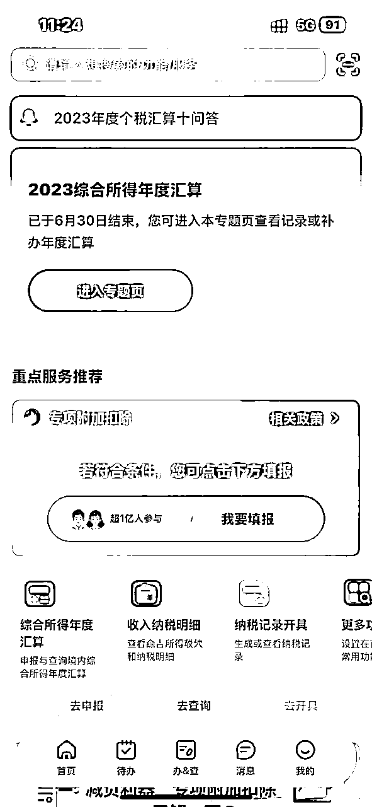

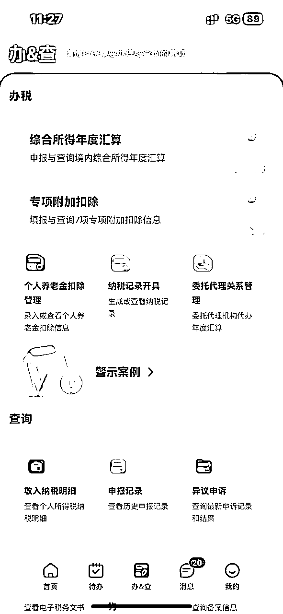

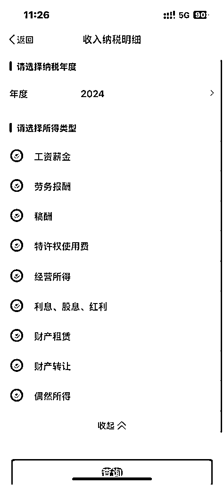

如此持续，可想而知企业财税合规的意识和需求将越来越强烈，会越来越意识到只有合规才有持续的发展空间，对财税公司的财税问题解决能力诉求也会要求更高。这时候考验财税公司的已经不是单纯的基础代理记账服务能力， 而是能不能提供更优质服务、甚至是定制化的财税服务产品，才能更精准地匹配企业的需求。

附2 - 2024年中小企业财税需求分析白皮书

以下，是我老东家税友集团财税代理事业部出品的《2024中小企业财税需求分析白皮书》，可供中小微企业、工作室、超级个体户进一步了解↓