# 《老板/设计师必看：字体和图片如何避免侵权？》@米斗设计

> 来源：[https://s296cam1nz.feishu.cn/docx/DfzydbYIRoKlwvxoCiTchKd1nwf](https://s296cam1nz.feishu.cn/docx/DfzydbYIRoKlwvxoCiTchKd1nwf)

我叫米斗，一个懂营销的品牌设计师；定位：【视觉营销设计顾问】；专注于品牌设计和个人IP全案设计~

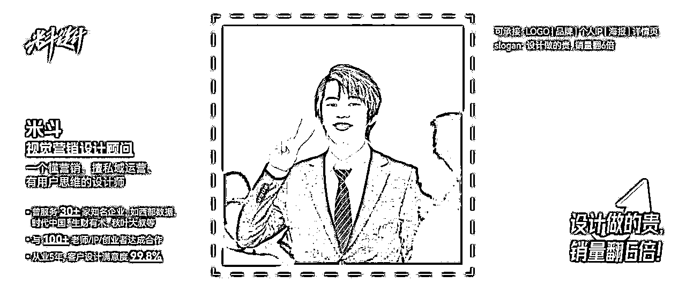

## 1.字体侵权，赔偿巨大，一字万金？！

### 1.1 字体有版权嘛？

也许你会疑惑，字体并不在著作权法所保护的作品类型范围内，又从何谈起侵权呢？

实则不然！尽管《著作权法》并没有将汉字本身纳入其保护范围之内，但是，当设计者依照汉字固有的书写规则进行创作，灵活运用字形、结构组合、笔画粗细及走向等元素，构建出彰显个人风格且富有审美价值的独特样式之时，只要这些设计理念具备了独特性的审美价值，并符合原创性的基本标准，那么这种经过精心设计而形成的字体便可作为"美术作品"而受到《著作权法》的保护。

### 1.2 相关法律条文

《中华人民共和国著作权法》第三条

本法所称的作品，是指文学、艺术和科学领域内具有独创性并能以一定形式表现的智力成果，包括：

（一）文字作品；

（二）口述作品；

（三）音乐、戏剧、曲艺、舞蹈、杂技艺术作品；

（四）美术、建筑作品；

（五）摄影作品；

（六）视听作品；

（七）工程设计图、产品设计图、地图、示意图等图形作品和模型作品；

（八）计算机软件；

（九）符合作品特征的其他智力成果。

《中华人民共和国著作权法》第二十条

作品原件所有权的转移，不改变作品著作权的归属，但美术、摄影作品原件的展览权由原件所有人享有。作者将未发表的美术、摄影作品的原件所有权转让给他人，受让人展览该原件不构成对作者发表权的侵犯。

### 1.3 以案说法 一字万金

字体侵权需赔偿 一字万金请留意

2013年12月16日，向佳红向广东省版权局申请作品名称为“向佳红毛笔行书字体”的作品著作权登记；2014年3月24日，广东省版权局给向佳红颁发了《作品登记证书》。

电影《九层妖塔》中的道具《鬼族史》旧书、《华夏日报》报纸，未经向佳红许可使用了7个向佳红毛笔行书字体的字，分别是“鬼、族、史、华、夏、日、报”。

经对比，涉案电影及预告片中出现的道具中使用的7个单字与向佳红涉案单字在字形整体结构，偏旁部首比例，笔画的长短、粗细、曲直选择等方面均无明显区别。

一审判决，向佳红获赔经济损失十四万元；二审驳回上诉，维持原判。

一审：（2016）京0105民初50488号

二审：（2018）京73民终1428号

来源：中国裁判文书网

中国裁判文书网搜索界面，共检索到 37 篇字体侵权相关文书。

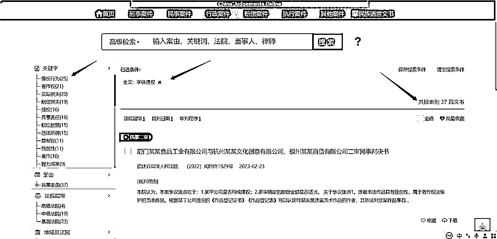

因为版权意识薄弱，在很多人的心里，字体与版权并没有关系，因此在进行字体选择的时候只考虑自己喜不喜欢，而忽略了需不需要获得著作权人授权的因素，往往就是因为这种忽视导致作品存在很大的侵权风险。

## 2.自媒体配图侵权，后果有多严重？

### 2.1 图片侵权相关法律条文

根据《专利法》第五十九条第二款之规定，其保护范围，以表示在外观设计专利权人在申请外观设计专利时向专利局提交的图片或者照片中的该外观设计专利产品为准，包括主视图、俯视图、侧视图等。其中主视图最为重要，因为它最能体现该项外观设计的美感。在确定外观设计专利权的保护范围时，还要注意从这些视图中找出能够体现该项外观设计美感的各项要素。

### 2.2 如何判定一张图片是否侵权呢?

图片侵权判定标准是图案里面的某些特色标志或图案，只是单纯调整颜色和色调的，属于侵权。或者未经他人同意擅自使用也属于侵权行为。凡未经作者同意或授权许可，对图片进行任何形式的发表、使用、署名、剽窃、篡改、汇编等，都属于图片侵权的范畴。

根据我国《著作权法》第四十七条规定，有下列侵权行为的，应当根据情况，承担停止侵害、消除影响、赔礼道歉、赔偿损失等民事责任：

（一）未经著作权人许可，发表其作品的；

（二）未经合作作者许可，将与他人合作创作的作品当作自己单独创作的作品发表的；

（三）没有参加创作，为谋取个人名利，在他人作品上署名的；

（四）歪曲、篡改他人作品的；

（五）剽窃他人作品的；

（六）未经著作权人许可，以展览、摄制电影和以类似摄制电影的方法使用作品，或者以改编、翻译、注释等方式使用作品的，本法另有规定的除外；

（七）使用他人作品，应当支付报酬而未支付的；

（八）未经电影作品和以类似摄制电影的方法创作的作品、计算机软件、录音录像制品的著作权人或者与著作权有关的权利人许可，出租其作品或者录音录像制品的，本法另有规定的除外；

（九）未经出版者许可，使用其出版的图书、期刊的版式设计的；

（十）未经表演者许可，从现场直播或者公开传送其现场表演，或者录制其表演的；

（十一）其他侵犯著作权以及与著作权有关的权益的行为。

### 2.3 图片侵权会判几年？

如果侵犯版权的相关行为比较严重，那么构成了《刑法》中规定的侵犯著作权罪。

违法所得数额较大或者有其他严重情节的，处三年以下有期徒刑或者拘役，并处或者单处罚金;违法所得数额巨大或者有其他特别严重情节的，处三年以上七年以下有期徒刑，并处罚金。

中国裁判文书网搜索界面，共检索到 2520 篇图片侵权相关文书。

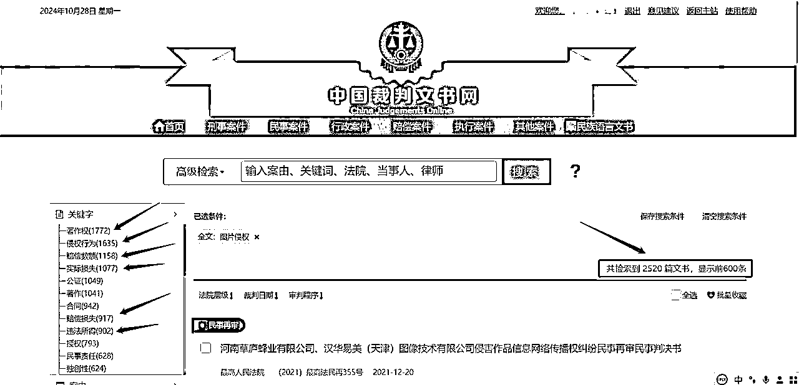

来源：中国裁判文书网

## 3.字体如何避免侵权？

### 3.1 查版权网站

分享一个查字体版权的网站：360查字体版权 https://fonts.safe.360.cn/

你打开进入网站（360查字体版权），它会自动检索你电脑里面的字体，然后进行分类：【免费可商用】【商用需授权】两种。你也可以自己搜索单个字体的版权，比如思源黑体。

如果360查版权查不到某字体的版权，那去其他字体网站搜搜看。比如，求字体：https://www.qiuziti.com/

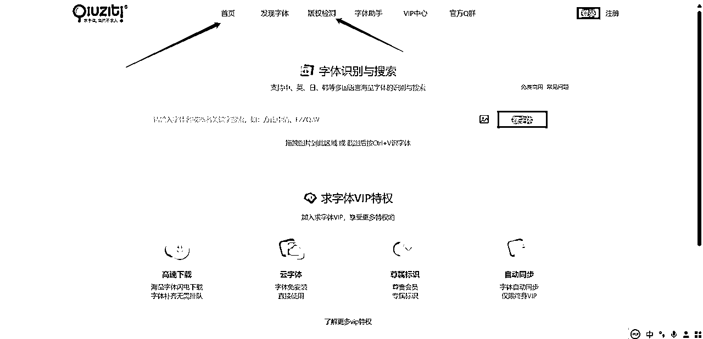

### 3.2 哪些字体尽量避免使用，以防侵权？

不要使用方正和汉仪字库里面的字体！不要使用方正和汉仪字库里面的字体！

能够使用免费商业字体尽量使用免费商业字体，如果不行，请付费购买字体版权。

重点提醒：【微软雅黑】是版权字体，不可随便拿来商用！

*   错误案例示范：

这个字体一看就是方正字库的字体，不能随便拿来商业使用。（ps：仅作为案例展示学习，未商用）

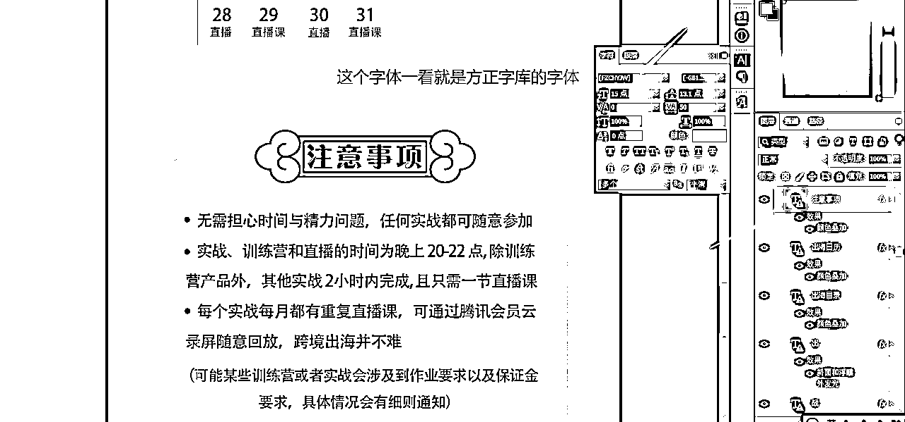

## 4.免费商用的字体在哪里找？

免费可商用的字体在哪里找？猫啃网：https://www.maoken.com/

猫啃网：专注于免费商用字体，已搜集600多款免费中文字体。

其他字体网站链接：

求字体：https://www.qiuziti.com/

字由：https://www.hellofont.cn/

字魂：https://izihun.com/

字体传奇：https://hao.ziticq.com/

## 5.免费可商用的图片在哪里找？

如果你没有购买图片版权，请不要使用视觉中国的任何图片！不要使用视觉中国的任何图片！

如果你购买了视觉中国的图片版权，那么请放心用。

米斗老师：不侵权的无版权图片网站在哪里找呢？

常用无版权图片摄影网站：

https://pixabay.com/

https://www.pexels.com/zh-cn/

https://500px.com.cn/

## 6.实战小技巧：如何在花瓣网上找到合适的素材？

<演示案例，仅供学习>

1.打开浏览器，输出网址或者花瓣网，你会得到以下页面：

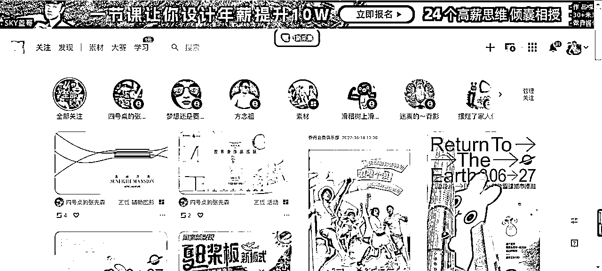

2.输入搜索关键词“表情”

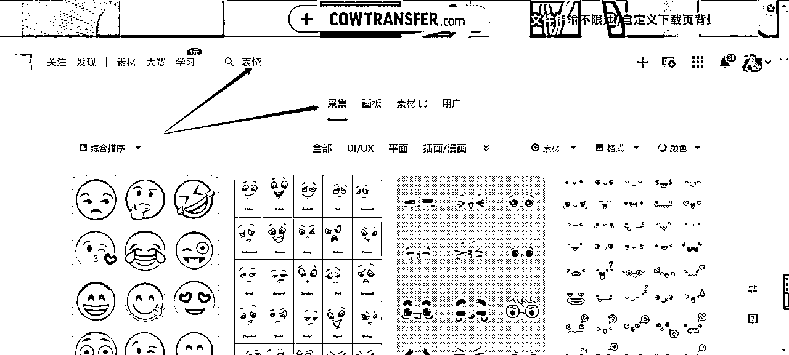

3.搜索“表情”之后，默认展示的是采集页面，然后我们需要切换到【画板】页面，出来的页面立马不一样了

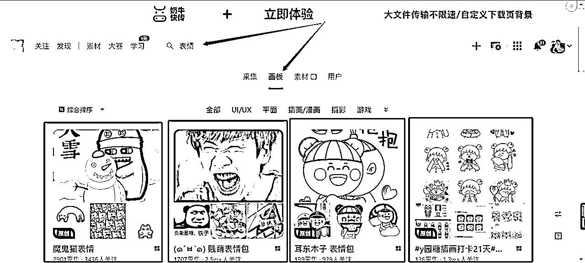

4.然后点击进去，下滑找想要的图，这样找出来的图全是想要的，全面又精准

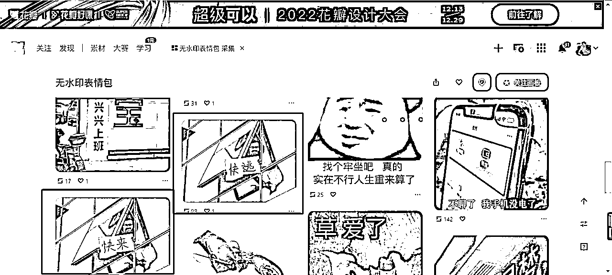

5.点进去查看大图，保存下载就可以了，然后可以直接拖进PPT/PS里面去做图啦。

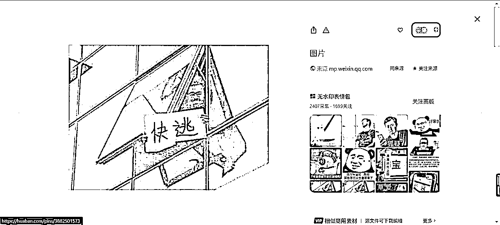

So easy，学会这节版权课，老板再也不用担心侵权啦！

这节课就上到这里，下课。

知识不值钱，改变才值钱。都看到这里了，有启发，点个赞！感恩~

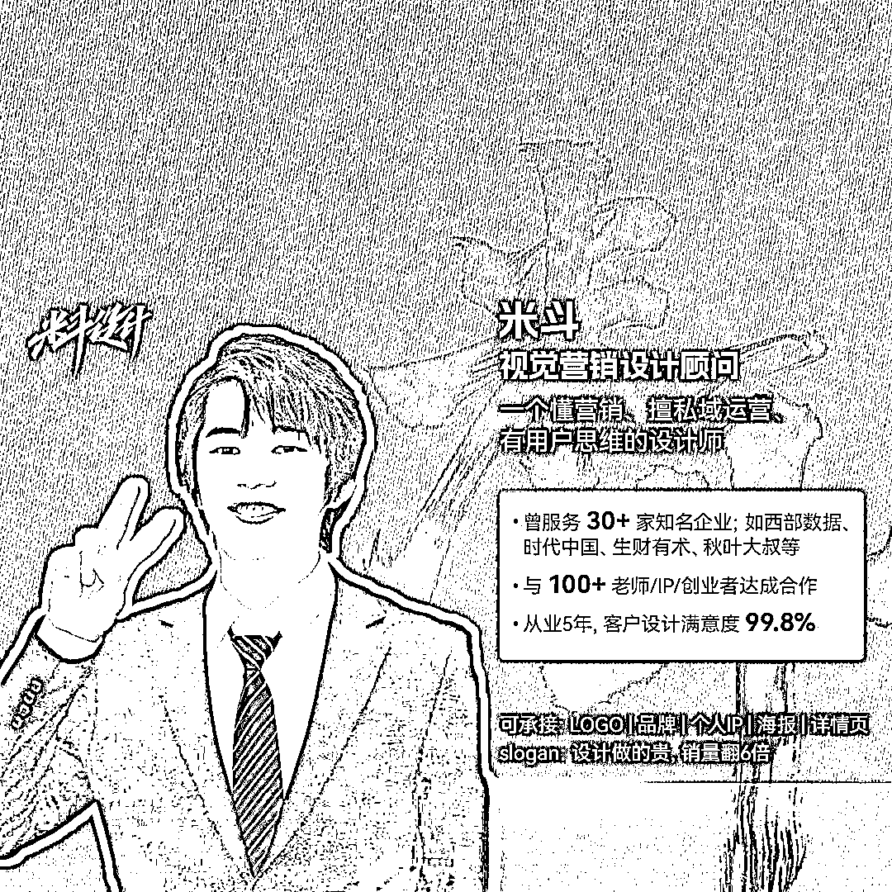