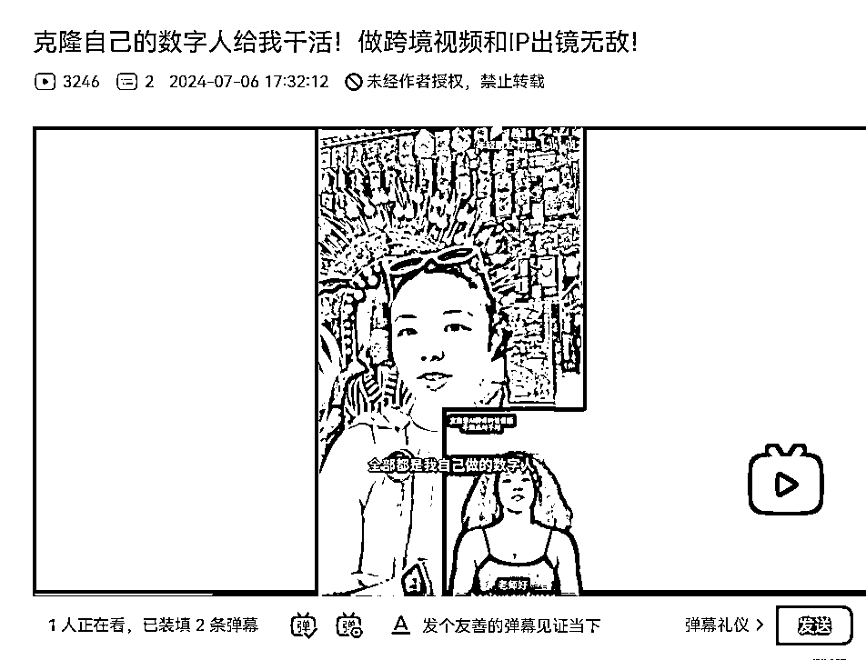
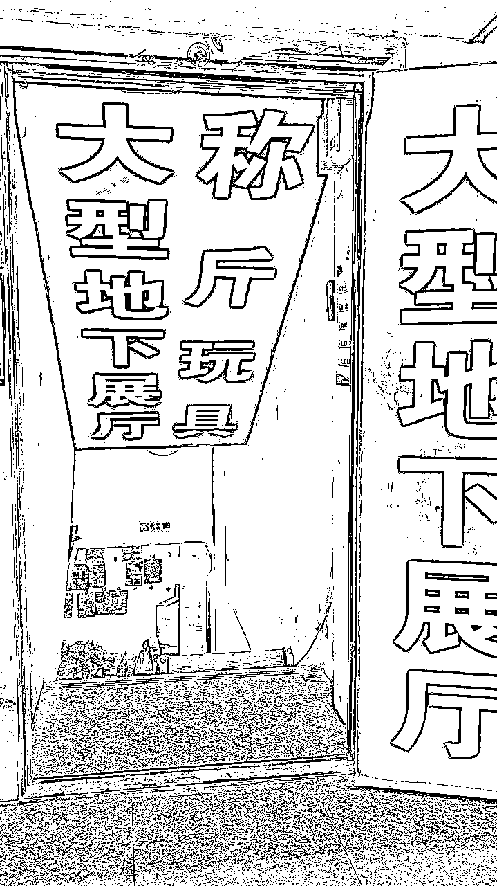

# 电商创业思路地图+义乌商机自助考察（星球版）

> 来源：[https://vow6kdbiak.feishu.cn/docx/E2bAdEJ4FoKVjvxTUEQcNkaBnvh](https://vow6kdbiak.feishu.cn/docx/E2bAdEJ4FoKVjvxTUEQcNkaBnvh)

# 特别说明：

本文档由阿甜独立完成！所有内容均是年薪 50w 夫妻在义乌一年半的创业、思考、电商实操的经验

里面很多都是避坑信息，如果你能避坑，就是省钱了！

插入的视频可看可不看！重点信息都会提取到关键内容中！

视频是展示的那时间的真实状态！

# 简单介绍自己：

就放几个账号，担心你忘记在哪里买的，心想：买的啥资料来着，忘了~

# 文档有哪些内容？

## 1、我们刚到义乌的心态和想法

从兴奋到平静到内耗到怀疑自己到重新开始

如果你有创业的打算，也许你也会有这些情绪吧

我核心是想说，产生那些情绪都是太正常不过了

我是周围公认的乐观的人，我都觉得太苦了！

## 2、在义乌做文具电商的经验和坑

这部分有文字+已发布的视频展示

这部分是作为赠送附加的，都是我之前发布过的视频

因为互联网信息爆炸，有可能比较蒙要看什么，所以我罗列出来了可能参考的内容

我不知道别人的经验是否有用，反正我做的都是我自己走过的路

最开始接触电商的经验和教训都会在这部分

## 3、做年货电商的坑和拍摄纪录片的契机

这是我们第一次自己主导，没有朋友帮忙，所有的都是我们来

算是真正第一次开始做电商这件事

从这里开始我们兴奋、无奈、蜕变、惊喜，都是这里开始

如果你后期要创业做电商，这是可以参考的

我们踩坑的地方你就不要踩了，省钱省精力！

## 4、再次整理思路：义乌创业重新开始

从年货之后，我们不打算做重资产做电商也不再打包发货了

一是看到周围的朋友做传统的国内电商被卡roi，非常辛苦，而且没有生活圈

二是觉得国内电商一定会转到海外，现在必须是要往海外去拓展

三是做电商是在仓库和工厂打交道，但是我更喜欢自学、反思、链接人和资源

所以这部分能看到我们不做电商后在做的事

如果我们情况相似，可以直接抄作业

## 5、思考你到义乌的目的，带着目的看义乌

义乌被市场推太火了，上央视、上新闻、在自媒体平台上热搜、百万博主都来义乌

这个是流量互蹭、流量互换、减少焦虑

义乌需要博主们推广，博主们也是希望用义乌这个天然流量池有数据

所以你现在也是看到了这个市场，想来义乌看看，我是觉得很不错啊

出来玩的第一步是——走出来

这是针对”是否要来义乌“发布的视频，可以直接跳转看：

48 【带人游学逛义乌新赛道？轻创业到义乌怎么样？ - 年轻朋友阿甜 | 小红书 - 你的生活指南】 😆 XOlzMTy9QutmBkp 😆 https://www.xiaohongshu.com/discovery/item/67052233000000002c0172bd?source=webshare&xhsshare=pc_web&xsec_token=ABNbZHFESUe8Mo-vOTc5PK4O9bpuwinUZtWhF_R1j9jBU=&xsec_source=pc_share

## 7、义乌的信息差和电商基础内容

如果你打算留在义乌或者创业，电商创业是很多小白想要上手的第一步

所以我会把之前我学习主播的一些基础放在这个部分，帮助你之后的创业起步

可以对义乌有滤镜，也可以对它袪魅

地方没有那么重要，人才是最重要的！

## 8、在义乌看到的赚钱方式

在义乌创业的朋友都会感慨，义乌遍地是钱，商贸城就是一座金矿！

那么到底能做什么，如何发现赚钱的机会是创业必须的技能

要记住：做生意的核心是买卖，买卖的核心是交易，是人和人产生的价值

产品可以是虚拟的、实体的！但是卖什么、如何卖、卖给谁是创业根本！

* * *

# 适合哪些朋友看？

## 1、想要做电商创业准备起步的

## 2、在其他城市，想要快速体验电商创业但是自己不确定的

## 3、想要轻创业、低成本创业但是没有思路的

## 4、想要到义乌看看，但是没有头绪和方向的

## 5、在义乌，但是没有发现商机和市场的

## 6、除了做电商，找不到其他赚钱方向的

## 7、不知道能学到什么，心想看看无妨的

以下这些内容可以在左侧栏自行查看！

* * *

这个万字文档目的：

1、我和我老公豪哥目前进入了新赛道，不会再碰重投入、重资本的电商，想要给之前的电商创业做个复盘

2、义乌很火，想要把知道的义乌信息分享给需要的伙伴

3、给和我们一样不管不顾的义乌电商创业者理清思路和方向，当作义乌基础的创业手册

4、鼓励和我们一样在创业路上亏过本、走得很艰辛的朋友精神支持和鼓励

* * *

# 你来义乌的方向和目的？

到义乌这个冲动都有方向和目的，哪怕只是看看当作旅行，也应该有收获

因为不再是作为小朋友的旅行，吃喝玩乐；作为创业者，至少心里想的是，能看到什么，哪些能为我所用

这里是否能待下来，我能在这里做什么，可以带着这些问题再到义乌

但是我会尽可能把我当时的心理和周围见过的人想法，分享给大家！

## 找货选品

### 本身有产品

如果是到义乌找货选品，有本身业务情况下是比较好谈的，去看和你的产品相似的区域，谈合作就可

可以自己逛，也可以在1688先看价格、工厂规模再聊合作，这是比较有目的性的选择

### 没有业务产品

听说电商赚钱想要自己选品，如果在之前没有经验的情况下是比较困难的

行业有句话：选品定生死

所以选品基本决定了这个账号、这个品是否能起来，是否能赚钱

一般要借用一些工具和长时间在电商选品深耕，才可能能通过在海量产品选出好卖的品

到商贸城更像是大海捞针！逛了几天也许只有“太好了”“太便宜了”“太喜欢了”

而没有下一步的“拿货”“怎么拿”“拿多少”“怎么卖”

千万别冲动！千万别冲动！千万别冲动！

## 看看是否值得到义乌创业

有一部分伙伴可能是想要到义乌看看，这个城市为什么这么火爆！

是不是真的像网上说的那样

如果要创业，我觉得有几点可以参考：

### 内因：

1、现有存款能够半年生活不用着急找工作

2、能力较强，之前工作有沉淀，能独当一面完成很多工作

3、自学能力强，创业和赚钱都是需要学习的

4、不拒绝社交，创业闭门造车是不行的，要和周围的创业者多聊聊

5、有发现生意的眼睛和立马执行的行动力

6、沉得住气，前期可能几乎都没有什么水花，到时候需要转赛道、放弃还是继续

### 外因：

1、这个城市周围创业者多不多，大家都是什么样的人

2、这个城市政府是否大力支持创业，是否给到什么政策

3、这个城市是否有很多创业分享活动能参加，门槛高不高

4、城市创业基因是否适合自己，是高大上还是接地气，是否能入手

5、这里产业是否发达，能否快速找到出货的产品

* * *

## 随便看看

可能你主要想要看看义乌市场到底是不是外界说的那样

以及自己想要看看义乌真实情况到底如何

接下来我会把我眼里和体验了一年半的义乌展示出来

希望你有所收获

### 义乌交通情况：

这里公共交通有地铁和公交，但是公交非常不方便

我们到这里一年多，就在商贸城坐过一次公交

地铁（轻轨）可以直接到金华、横店影视城比较方便

但是市区内一般到商贸城的较多

地铁等待时间较长，一趟为10mins左右

所以我们一般都是出门打车，在义乌的生活圈和商贸城中心区都是20mins左右能到

### 义乌独特租房方式：

如果想要在义乌租房，上租房网站都不太好使

就集中在义乌电商村常见的几个区域，比如紫金小区、五爱小区、北下朱等等

去楼下的公告栏，那边有很多租房信息和工作信息

具体看租房有什么经验？

看预算，1k-6k的都有，村子里单间差不多是1.5k左右

看你的主要业务在哪里，可以花几天去看看逛逛走走

看看喜欢村子里还是喜欢商贸城附近的小区（有预算就去这边）

然后打开地图，看房子，看大片区域的地方，就能看到人群聚集地

最好白天和晚上都去看看，白天看人员都在看什么，是否单纯干净

晚上看是否吵闹，是否影响睡眠，亮灯率是否高

如果一个女生，建议不要住亮灯率低的地方，人少不太安全

有的地方周围是不太单纯的，你去找房子的时候会了解，具体不展开了

具体可以参考这条笔记：

56 【👉义乌的搞钱信息都在公告栏上！ - 阿甜义乌创业录 | 小红书 - 你的生活指南】 😆 bmJATf60oXqWB1j 😆 https://www.xiaohongshu.com/discovery/item/652b5aaf000000001e00d58e?source=webshare&xhsshare=pc_web&xsec_token=ABhSducNRp3TvRQsjvX-xM4oV_GRNAiCObMVbVx6FfRkU=&xsec_source=pc_share

* * *

# 在义乌你能做什么，先考虑这这个问题

## 手里资金有多少

建议最好是可支配收入有至少够你半年的生活消费，可以方便你做自己想做的事

如果金钱不足很容易找一些能填饱肚子的工作随便打发了

如果在义乌呆个半年如果这样的模式是很不划算的，因为几乎不能存下钱来

如果已经有了半年一年的生活钱，就可以用轻创业的模式试试义乌的一些路子

之后在下一章马上就会讲，你可以匹配自己能力去做

## 之前做过什么项目

之前的工作和做过的副业，其实很大程度能左右你创业的方向

但是如果你有半年存款情况下，可以走我的老路，虽然我也不太建议

我之前是在深圳做课程的，豪哥是做程序员，我俩在义乌做电商就是纯0开始

走的弯路太多了

也是现在才感觉摸到自己真的喜欢又擅长能做的事了

* * *

# 义乌赚钱的方式有哪些

## 倒爷

倒爷可以说是义乌特别普遍的赚钱方式，在互联网上来说，这个就是【无货源】模式

简单说说【无货源】模式：

就是1688或者拼多多的货，放到淘宝或者小红书去卖赚差价

倒爷也是一样

如果你在义乌看到卖的什么东西，价格便宜又好，你就可以发朋友圈或者短视频

就有人找你买，这个是需要学习一些运营方法的

就像我下面放的图：珠子如果10块一斤，我往外卖20，我差价就是10块

伴手礼如果20一个，我卖30，我就能赚10块

现在越来越觉得，所有的买卖核心都是做倒爷赚差价！

### 如何找适合倒爷的产品

在义乌最不缺的就是产品，也不要想着真的在义乌疯狂跑来跑去找产品

可以怎么做？

1、去商贸城拍视频，看到什么拍什么，至少给网上的人知道你能做这事，你能找货，让别人主动提出需求

2、在小红书帖子去找评论区，看看想要创业的人都想要求什么货，你就去拍那种类型的产品吸引他们

要记住：我们刚开始做，选品思维是比较薄弱的，不要觉得你选择的就是大家喜欢的

你还要想清楚自己的客户、在什么平台卖、产品价格等等

## 走播

如果觉得倒爷主动性太强不适合自己，想尝试一下走播也可以

但是目前我观察下来，e人比较适合做走播

959 【义乌走播，是小白轻创业的方式吗？ - 阿甜义乌创业录 | 小红书 - 你的生活指南】 😆 GaUfPqA9JNtgrNB 😆 https://www.xiaohongshu.com/discovery/item/6704ad02000000001b020c26?source=webshare&xhsshare=pc_web&xsec_token=ABWDldV0AmYO1qeM5zjlaOXXzHufE3NEmFr_2B6UtImXg=&xsec_source=pc_share

### 走播如何和老板合作

走播一般是在商贸城里的一区——饰品小玩意居多，利润高的地方

1、建议最好有一个自己的账号，小红书抖音都可以（目前小红书有自然流，可以试试）

2、和老板说好你们的合作方式，你就在他的门店直接直播卖货的方式

3、一般的情况是需要交押金，比如2000给你多少折扣，1w又是多少折扣，你看这里又有门槛了

这个对商家来说，你的押金相当于他们的小b端用户，如果一个一个卖或者代发，其实他们也不太想接

如果有粉丝量、有私域也是可以试试看的，这样他们能帮忙代发

### 走播不轻松

走播难度如何？虽然小红书很多都在说走播，也算是一个低门槛启动的方式

但是它一定不轻松！

1、直播已经是非常辛苦的一件事，如果你直播过就知道，几个小时下来人是非常伤神的

2、又要直播又要走路，要互动，也不算轻松

3、前提需要有自己的账号，要不然卖给谁呢，从0开始是比较难的

但是特别注意，这个其实就是熬！

很多自然流主播都要熬至少一个月，很多人熬不住，所以之前为什么我也说最好有半年存款，你不至于太心慌！

## 主播

### 中文主播

如果现在资金不多，但是想要做电商方向的内容，是女生，身材长相都不错的情况下，可以试试主播

现在虽然主播市场很卷，但是义乌基本底薪是1w，杭州1.5w+还有不同程度的提成

但是需要有基础，如果没有基础一般要从助播做起，然后看自己爱好和天赋来看看能做多久转正

做主播是比较容易吃人的状态的，全程几乎是状态提着，表情管理很好的，所以会比较累

但是这个也很锻炼人，因为能看到直播间后台的所有配置和搭建

### 外语主播

外语主播现在有英语、西班牙语、阿拉伯语算是比较大的市场

但是英语是最卷的，毫无疑问，所以有的主播都在往其他语言转

如果你有英语或者其他外语的基础，可以试试外语主播

但是外语主播有个问题：一般是晚上到半夜上播，算是在国内的外国时间

63 【义乌培训西班牙语主播，跨境贸易直播新宠 - 阿甜义乌创业录 | 小红书 - 你的生活指南】 😆 iZ7NtRgq9Y1p5bp 😆 https://www.xiaohongshu.com/discovery/item/670f893b0000000026036fe9?source=webshare&xhsshare=pc_web&xsec_token=ABoHzeYEF2rdYe7L6BwoO2Ps7sX1k0jmU9nDOtw1Qj5UQ=&xsec_source=pc_share

## 外贸员

外贸员是从国内买手的模式，一般依托于外贸公司

就是把中国的产品卖到海外，而且基本都是b端大客户，c端的不叫外贸，只能是电商

有的是需要自己开发客户，去fb、ins、tk去找有产品需求的客户，发布一些短视频内容，和他们对接单子，聊需求找货

有的不需要自己开发客户，只需要跟单做销售和成交拿提成

外贸客户对语言来说要求没那么高，因为很多是文字聊，可以用翻译

现在有的在tk做获客引流，后端的公司来做承接也是可以的

做中间商可能会遇到的问题：

1、要特别了解产品，不要什么都问厂家，他们时间有限

2、要了解不同地区邮费、产品规格的税费问题，不要亏本

3、如果都是非标品，客户要的质量、品类、颜色都要对好

4、做外贸单子需要有耐心，因为资金比较大，所以比较谨慎

## 电商运营

电商运营在义乌岗位比较多，这里毕竟都是电商起家的城市，所以基本都在做电商

电商运营一般是在淘宝、tk、1688、拼多多等电商平台做运营，目的是增加产品的曝光和用户消费

要设置产品名称、关键词、产品封面、点击率、产品内页等

如果是当学徒也是可以的，就是当作打工学技术的模式

## 自媒体运营

现在各行各业都在公域平台增加自己的曝光和流量

比如我们熟悉的抖音、小红书平台，给他们产品做宣传和曝光的

有的公司有运营岗位或者需要代运营，都是基于自媒体运营的

如果想要做这部分，最好有自己的自媒体的账号或者有一些作品案例

## 快递员打包、送外卖

如果学历不高、存款不多的情况下可以从基础工作做起，比如快递打包、送外卖

在义乌做这些工作和其他城市区别是很大的！

在义乌电商村打包送快递，快递员是一手知道哪里爆单的，你就知道什么卖得好

我们就听到过很多做货拉拉都是做电商，到一线去搜集情报信息

送外卖是很快知道市场哪些场地忙、什么地方在卖什么货的

如果比较e人，擅长交谈，给他们送餐客气一些，一来二往说不定能套取一点信息差也是有可能的

但是要注意，做外卖真的不要真的做外卖

你要把这些信息全部用起来，卖出来！

如果能开个账号发小红书、抖音就说外卖小哥在义乌的信息差，是不错的方向

## 手工活

手工活一般是按照“件”来收费，比如粘发夹、做手串等

我们在楼下的理发店就看到老板娘在做蝴蝶结，一个5毛，一天也是几百个

当然，这里也是一样，你的核心不是真的做手工，而是去套信息

因为给你手工活的老板一定有这个产品，直接卖他的品也是可以的

这样的活儿一般有两个地方看到比较多：

1、在电商村公告栏，之前讲过的

2、在电商村闲逛的时候，会看到有一些小作坊都可以试试

* * *

# 义乌时间规划一整天

## 商贸城

### 商贸城分区

这里大家可以小红书搜索：商贸城分区，因为非常丰富

但是你是一两天是逛不完的，一年也是逛不完的

我们常去的是：一区、一区东（都是饰品区）也是人最多的中心区域，但是其他几个区（1-5区）都是连通的！

### 商贸城特点

商贸城一共分为五个区，非常非常大！据统计，每个店铺停留几分钟，所有逛下来要两年！所以更要去精细化看产品和找产品了！

如果想要凑热闹，逛一区就足够了

是人最多的区域，其他的不太适合一般的散户

商贸城有的产品可零售，有的不零售，如果非常喜欢问问也是可以的

如果看到了喜欢的产品和店面，可以用下面的方法拍照试试

但是一定要问清楚老板是否方便拍产品，以免引起不必要的误会

### 商贸城记名片和产品方法

73 【逛义乌商贸城？完全忘了产品和名片怎么办？ - 阿甜义乌创业录 | 小红书 - 你的生活指南】 😆 yLj6KGrFmc6NPF4 😆 https://www.xiaohongshu.com/discovery/item/663eef21000000001e03196a?source=webshare&xhsshare=pc_web&xsec_token=ABm_50ko-_y2D151RnNWSQvw8a4xhiP-nHbSwLWtWey_Y=&xsec_source=pc_share

## 商贸城、新光汇吃土耳其菜（苏坦）

商贸城旁边有个商城——新光汇

这个菜是义乌排行第一的，如果抱着“来都来了”的心态是可以尝尝的

里面的外国人非常多，比较有义乌的异域特色

或者去-1楼，就是全国连锁的一些餐饮，可以在这边解决

## 10月后-年前银海小区

吃完饭后可以打车去【银海小区】，特别是10月后，这边是义乌年货的批发市场

而且这边就是十月开卖，所有的门面一般都只做3个月生意

并且房租都很贵！之前问过一个是30w，但是老板们都自信说“肯定能赚回来”

这边基本都不是零售的了，如果是去看看当年要卖往全国的年货产品有哪些，还是比较有趣的体验

## 五爱库存街

如果你到义乌不是10月之后的时间，下午可以去库存街看看

库存街顾名思义就是卖库存的地方，就是一些颠覆价格的一些地方，毕竟是库存嘛

比如皮筋一斤几块钱、发夹按斤卖、耳环都是斤卖！

我朋友圈有个库存老板很夸张，之前卖过一吨重的皮筋发到外地去，都是大卡车拉的

库存也能做海外市场，一些比较偏远欠发达的国家也会买库存回去卖

因为国内目前是产能过剩的状态，所以库存也是真的多

### 库存信息差

有的质量、款式都不错的库存是不太会在库存街出现的

因为厂里会放在仓库给比较熟悉的经常拿货懂货的熟客

之前我们做文具电商时候就卖过一段时间库存，那真是“出现在库存街是有原因的”

质量、款式、品牌一定都是不太好的！除了价格便宜其他的还是差了一点

## 宾王夜市

晚上如果有空一定要去宾王夜市，在图片中标【🌟】的地方，也是打个车就过去了

79 【义乌夜市，价格震惊！简直是线下拼xx！ - 阿甜义乌创业录 | 小红书 - 你的生活指南】 😆 7vOWdpOGOUXQdRR 😆 https://www.xiaohongshu.com/discovery/item/66cb2882000000001d03b950?source=webshare&xhsshare=pc_web&xsec_token=ABLcOYC1hJyyNU750LB42htUkrnvAp4-OpRs8a8lkMTxk=&xsec_source=pc_share

### 宾王夜市特点

如果有时间我不建议直接晚上过去，建议是下午六点过去，那边是6点半开始

六点能看到他们出摊的场景！能看到一条大马路上，一下子都摊占满，分为三条街

也叫【三挺路】夜市！

在媒体平台展示宾王夜市有几个特点：

便宜、线下拼多多、外国人多、没想的便宜、吃的不好吃

基本就围绕这几个内容展开了！这个东西见仁见智吧，可以去看看外国人密度最大的国内夜市！大部分的伙伴来逛还是觉得比较有趣的

记住：下雨几乎没人，不建议过去

* * *

# 义乌时间规划1-2天

## 国际商贸城

## 10月后-年前银海小区

## 五爱库存街

## 宾王夜市

## 从1688联系是否有工厂能参观

如果时间是两天，可以增加一个工厂参观的选项

### 如何联系工厂

去1688找义乌的工厂，看看哪里离你的距离不远，问问是否方便去看货拿货

这时，你的身份建议不要用素人，因为会没有底气，工厂也没时间给参观

这里可以有两种身份：

1、自媒体人想要了解采访，做货源对接

2、自己在老家做生意，想要在义乌拿货看品

这样会比较方便找到工厂

### 找到工厂不等于拿货便宜

在这里要特别说明，找到工厂、供应链不等于说拿货就是“最低价”

因为很多工厂不是说全品类、全链路都有，有的时候只有一两个零部件在生产

在工厂如果刚开始合作或者量小，也没有什么好价格

并且不要一味追求“低价”，很多低价意味着低质，否则一个新人为什么能拿到便宜的价格

这是不符合常识的！

还有，低价并不是一个好的生意循环！拼多多是怎么把商家卷死的

再有，核心是销售渠道，你看奔驰保时捷在卖，奥拓海马也在卖，所以找到不一样的消费群体更重要

* * *

# 义乌时间规划2-3天

## 商贸城

## 10月后-年前银海小区

## 五爱库存街

## 宾王夜市

## 从1688联系是否有工厂能参观

## 在小红书找线下沙龙交流

如果在义乌三天时间，可以卡着时间来，如果是纯逛是逛不出什么名堂的

建议在网上看看是否有一些沙龙交流、博览会、展会等等

这样对义乌的从商市场、正在义乌创业的人大家都在做什么，这样更直观

### 在展会认识在义乌发展的人

一般来说，在展会是最适合认识人的好机会，因为大家都是在义乌创业者或者参展的

可以多加一些人，要一些名片，问一些义乌展览信息，更加了解义乌动向

认识更多义乌创业者，可以组局、参加沙龙、互相交流，是创业中很重要的一环

因为现在的市场单打独斗、闭门造车是很难生存的

就看现在的互联网、各种会员群不就是抱团和交流的核心吗

不过，交朋友的前提一定是信息互换、交流，不是仅仅听别人输出

如果每一次线下都是别人输出，可能下次大家就会离你很远了

* * *

# 我们刚到义乌的心态和想法

去义乌前没有查任何攻略，小红书没看、抖音也没看，当时的想法：

1、要做自己的生意，义乌可以去看看，毕竟有个商贸城

2、2017年我来这边呆过几个月卖衣服，赚了几万块，所以对这有滤镜

3、大专朋友在这边，一直都让我来这边看看，顺便取经

## 初期迷茫懵逼兴奋：

虽然朋友在这边，但是也不要想着一来就是“投靠”，至少也要能给别人提供点什么吧

所以我们打算自己先有思路，先去看看义乌这个框架吧，别啥都不知道

之前都住在商贸城附近的酒店，周围全是外国人，还包早餐，觉得很新奇！很喜欢这样的氛围。而且消费比起深圳那真的是不高，而且那时候也是云游状态，所以觉得这里可以呆

### 去商贸城找货拿货

我和我老公豪哥是2023.6来到义乌的

最开始和绝大多数大家的第一站一样——国际商贸城

商贸城有五个区，大部分都会去一区，都是饰品、配件，就是小红书出现最多的片区

其他的汽配、新能源、宠物等，我们逛了，也是一脸懵

但是女生是真的喜欢饰品啊，我看到都走不动道了，太喜欢了

没忍住，拿了两百块的耳环，心想不卖，我也可以自己戴、送人都不会亏

毕竟一对耳环成本1.5，市场得卖十几块呢！

### 初逛义乌商城：

那时候我拿了130块耳环，放下狠话说：200块在义乌就能当老板！

事实也是如此，因为只要在义乌，没有靓仔靓女、没有帅哥小姐姐

他们的称呼都是”老板“”老板娘“！

如果要做小生意，摆摊是最快的方式！和你的客户面对面说话、面对面交易

一切都是即时发生的

没有打包、没有物流、没有售后、没有压货、没有库存、没有客服

所有的一切都只有你！

只需要你的货、你在卖、有客户买，这三端流量就是完美的！

自媒体也是这样，电商也是这样，都是为了达成这三方的交易和扩大！

### 为什么会兴奋和迷茫

我分析了一下从我最开始到义乌逛商贸城和现在再去逛商贸城的心理是完全不同的

最开始是：兴奋、激动、大、货品多、想要拥有、想要把这些卖出赚钱

后来呢？后来带朋友逛了多次商贸城，大家初次到商贸城状态和我们最初是相似的

但是我理性了：

逛了很多次商贸城，虽然每次去都能看到新鲜店铺、加到老板微信、还能录不少视频，但是我不再冲动拿货也不再那么兴奋了！因为这里就是一个巨大供应链，东西再多不是你的，东西再便宜你没有卖出去都没有意义。反而会看到这里一座金矿，但是你竟然守着ta不赚钱，会觉得自己的无力以及可惜

现在那里对我的意义是：拍视频好的背景图！是游学的必备一站！加到老板，如果有一天有人要货有资源！就是很值得的！

### 23年6月逛完商贸城后拍摄的视频：

https://www.bilibili.com/video/BV1cu411e7Tq/?vd_source=cd57d3a123a254526b23c45b10a3970f

### 商贸城老板娘态度

老板娘一看我们就不是拿货的样子，现在想起来，就是两个人第一次见这么大的饰品区，这么多好东西，那个眼睛肯定是控制不住地乱看四处张望

老板娘也知道你拿不了多少，所以态度也比较冷淡

所以这也是为什么小红书很多人都说商贸城老板态度不好

因为他们的店铺几百万，之前都是走【批发】，零售小单他们看不上

他们早就火眼金睛，哪些是【拿货】拿多大的货，外贸还是内贸，他们心里都门儿清

他们毕竟是【老板娘】啊！

我倒是没觉得他们冷淡，因为能在这里租上百万门面的人，确实没太多时间理散客吧

### 打算去宾王夜市摆摊

宾王夜市是义乌最出名的夜市，也叫【三挺路夜市】因为是有三条路，分为一街二街三街

也被称为线下拼多多：

很多人都是建议18:30之后去，是正式营业的时间，但是我建议18:00过去

你会看到原本宽阔的街道只有地上的摊位号码，立马被推大型货架、大箱柜占满！

能看到一人小店的开摊形式，也能看到情侣、中年夫妻出摊互帮互助的交流，挺热闹！挺热血的！

but，

建议：不要在夜市吃东西！

那时候非常迷茫，对电商一窍不通！

根本不懂什么是货架电商？什么是兴趣电商？我之前深圳的职场世界哪里听过这样的词？

淘宝、拼多多、小红书、抖音、快手，要做什么，怎么做？

但是就如前面说，最快的方式是【摆摊】和用户面对面，还能加不少人

原本对自己的规划定位是【硕士毕业去夜市摆摊】，对我做自媒体拍视频有好处

而且我之前2017年在宾王夜市摆过摊，所以我有经验，而且有话题有噱头

但是为什么最后没这样做呢？

因为把这个想法给朋友说了，他说这个不太正能量，硕士毕业和摆地摊会让很多高学历的人有退学想法，也会让很多想要考研到金字塔的人怀疑自己，后来一想确实是这样~

不过，再看现在的市场环境，硕士摆摊、轻创业、失败、读书无用论都出现了

但是我从来不认为读研是没用的，因为那是多无忧快乐的时光！

只是现在大家都觉得要走出来更有期待和希望吧

别说，现在在创业圈子，觉得大家思路好活！我在创业一年多学到的、看到的，比之前在职场在学校是多太多了！

### 到处探厂见世面、对接产品

探厂？以前没听过这个词，我都会说去别人厂里看看！没见过啊！

大仓库、工厂生产车间、看人打包发货都是新鲜的！

如果你们想要去探厂，看工厂、看产品

其实有简单的方式，如果你在义乌待几天，在三天规划那里我会写

https://www.bilibili.com/video/BV1uh4y1E7L7/?vd_source=cd57d3a123a254526b23c45b10a3970f

* * *

# 在义乌做文具电商的经验和坑

## 开始原因：

之前我们都在义乌瞎逛，补一些完全不知道的信息差

2023.7 朋友说起个文具盘子，他们出钱出场地，我们出人力，当作学习也一起分钱

结果是亏本了

不过收获也是很多的！也是我们电商的开始！很难有这样的机会和开始！

这个最开始的想法是很绝的！

那时候马上要开学，开学季，正好有朋友是做文具工厂的，那时候很流行【仓播】

就是在仓库直播，核心是让观众看到你的货多，你的产品便宜

我们开始是想着，给孩子买文具的都是宝妈，宝妈又是后期能转百货的客户

后来很多直播间都搭建成仓播的样子，但是周围放的都是空箱子而已~

就是图片背景的样子

说一下结论：

现在想起电商直播那段时间都是泪！太累了

而且佩服每一个在直播间大喊大叫又演戏的主播！

现在慢性咽炎，就是那时候留下的后遗症吧~

所以我现在是基本不可能去干主播的，偶尔看账号聊天出资料是可以的，但是叫喊是喊不动了

## 人员配置：

加上我和豪哥一共五个人，我负责学习直播话术，豪哥负责上架运营和中控

1、总投资人，他组局

2、操盘手，选品、上品、切换品、培训我的话术

3、运营教学和复盘，教豪哥做运营

所以你在创业时候要想清楚有几个人，有多少钱来做这件事，每个人都有什么能力

电商时期是5个人，后来是我和豪哥两个人，我也会给你说一个人的玩法

## 主播学习资料

请挨个打开：https://vow6kdbiak.feishu.cn/drive/folder/KOKbfXw2Yl3jO5dLhoScRNMXnfg?from=from_copylink

## 主播培训的难度

这样来说个价格吧，上面我学那个课程线下是三天一万多，而且必须要有经验的主播，是提升课程，市场都说【只筛选，不教育】

从0-1培训主播是很多公司不想做的事，因为难度太大，而且成不了

所以为什么说想去当主播一般都要从助播（副播）干起，因为主播没有那么简单容易

这就像，人人都会写字，但是只有千锤百炼才能成为书法家

会说话，但是有的人用来是吵架、有的是上课、有的是主播、有的是演讲家

就是看起来越没有门槛的，其实越有门槛！主播就是其中一个

因为非常【吃】主播状态，几乎决定了当天roi投产比和当天销售额

这个是运营和主播都能感觉到的，老板只看最后的成交额gmv就好！

roi是投产比，投入产出比，假如投入10元，回来20，可以大概算投产比是1:2差不多保本

成交额gmv，就是卖了多少钱，还没算成本的支出

对了，再说点信息差也是听朋友说的

很多主播以为一个月2w+提成，觉得自己牛了，很多就想和运营出去单干

后来发现非常难，为什么？因为他们不知道老板投流花了多少钱！

## 主播话术——当时我是如何被训练的？

我算是周围朋友说比较社牛，说话比较有感染的ENFP了

而且自己拍视频、讲课，算是挺”能说“的！

但是直播的节奏、话术、表达方式都是空白

我是先看了基础课程，朋友给我写了话术，给我梳理了逻辑让我开始练习主播

这里的难点是：

让我对着手机自拍模式说话，他们旁边纠正我的表达方式、动作、语音重音等等

那几天的训练真的让我都觉得很尴尬，我可是社牛呀！朋友盯着我，我还是放不开

原因是：

一个是担心耽误我们这个盘子的进程

二是觉得朋友一直在纠正我他无奈又累的样子

三是觉得真的好难，而且每个字每个词都在纠正，我很尴尬

虽然可能大家觉得这个朋友多好啊，这样的机会多难得

我也知道，但是那段时光好难熬啊！

然后他会在觉得ok后，让其他朋友再来看，继续纠正一直到上播

当然，结果是好的，后面我的转品、话术、塑品都还凑合能用

* * *

## 做文具时期拍摄的视频：

这些视频我做个顺序排列，可以在里面看到一些当时学习电商的经验

核心内容我都会放在视频前面，视频是那时的当下状态，可看可不看~

### 参观供应链

那时候核心是：每天看供应链，就是现在的探厂

但是这个比之前更厉害了，因为是朋友带着，能看到他们的后台和直播间！

我也是第一次看到百万GMV当场直播间，冲击我的大眼球和小脑！

当然也知道了他们一场投钱也有几十万，还有仓库、工人、其实赚钱没想的多

并不是GMV就是赚的钱！

如果你要到义乌创业，或者其他地方，如果有机会，要先看别人卖什么，怎么卖

义乌虽然是个县级市，但是是豪车密度最大的县级市！

楼下停宾利的老板，买下一整层仓库，卖进口锅碗做电商，他说一层楼的货有两个亿

老板穿得很休闲，就是一件短袖T恤，说话也是正常对接货品的

”老板不会吃人，哪怕态度不好又如何，大不了不合作“

而且义乌老板格局真的算是比较大的，而且态度都还不错，特别是做很大，还是白手起家的老板，他们欢迎直播团队合作，一般是我们提供人，他们供货，然后分利润模式

这个其实也是轻创业模式，但是这个需要团队有能力，本身就有账号和销量

他们没有时间陪0基础的小白玩，还是那句话【只筛选】

https://www.bilibili.com/video/BV1iV4y1q7DC/?vd_source=cd57d3a123a254526b23c45b10a3970f

### 做电商的学习经验

前面的主播话术学习要被拉上台实践了！

这次不光有本来旁边4个人（合伙人），还有仓库工厂厂长他们都在

嘿，反正就是小尴尬！我都算脸皮还比较厚的，开始的时候还是不习惯

不过还好，他们平时都是在直播的，也会告诉我如何能直播得更好

遇到同频的创业者是缘分更是好运，自己摸索是很辛苦的！

仓库没有空调，因为非常大，一般厂家都不会在里面放空调

所以在40度的义乌，真的非常热，要打包、要直播、要复盘、要上架

身体累是一个方面，开始周围的人都觉得我很适合做主播

因为我还是比较会说话而且喜欢聊天的

但是做主播和聊天时两回事！因为主播基本就是5分钟循环话术

不做主播的核心原因是，作为我这样需要新鲜事物出视频的创作者来说

每天相同的话术、相似的复盘方法、几乎相同的产品，对我来说是折磨

千万别说只要赚钱什么都能做，是要选择【擅长】和【喜欢】结合的

要不就很容易放弃

流量波动非常大：

那时候我们经历过一小时不进人，也经历过一分钟进3000人！

每天都是波动起伏，对刚创业的老板来说（我们），是很考验心态的

我们的电商时间：

那时候第一次做电商，第一次经历“电商时间”

晚上8:00左右开始直播，到晚上12:00左右

下拨后复盘、到家、洗澡，大概是凌晨两点

早上8:00闹钟回复抖店消息，因为30s不回复就会扣分，等着朋友的后台接管

中午起床吃饭，整理收拾去仓库打包

下午5:00打包结束回家，一般是看包裹多少，如果很多需要提前去仓库

因为快递会5:00来收，如果错过了就到了明天，没发出去就会物流扣分

下午正常时间吃饭，和朋友他们一起去仓库准备直播

https://www.bilibili.com/video/BV1mN411b7bk/?vd_source=cd57d3a123a254526b23c45b10a3970f

### 做文具发货在仓库打包

我们卖的什么品？

卖水笔、彩铅、普通铅笔、钢笔、电子笔、好看的胶带、快递小刀、本子、书包等等

就是一切和文具用品相关的都卖，后面就进了一些日用百货的

对了说一下，日用百货又叫日百，是义乌较大的类目

我们电商项目是直接拿货的模式，那时候都是朋友在给钱，我们没有出钱的压力

虽然不是我们出钱，但是我们也肯定希望是赚钱的，自己不赚钱可以，更希望朋友赚钱

毕竟是他们带我们啊

所以每次拿货和快递结账时候还是会觉得压力很大，毕竟当时”发一单亏一单“

因为那时候我们做的模式是：亏品起号！

https://www.bilibili.com/video/BV1814y1B7KH/?vd_source=cd57d3a123a254526b23c45b10a3970f

### 每天成交几千，但是都在亏本

接着上面的内容，什么是亏品起号？

我们做的平台是【抖音】，但是那个时候已经早就没有自然流的红利，流量基本都是花钱买的。带我们的那个朋友，每天投流都是一大笔钱

又因为抖音的推送模式是自动推送下一条，所以只要花钱多，下一条就有可能是投放的广告

抖音的用户标签是非常精准的，投放给谁、什么年龄、用的什么价位手机、什么城市、消费力如何都能买过来

所以我们采用了【亏品起号】的方式：

就是以低价格吸引用户购买，前期亏本，后期用涨价的模式

但是最后没跑通，原因是啥，慢慢看~

如果你还打算用这种模式，如果没钱投，千万别做！

我们的亏品价格大概是什么样？

比如正常外面买的水笔，一支元，我们是一元十只，不是笔芯，就是实实在在的笔，价格非常离谱，连邮费都不够，这怎么可能赚钱？

还有丙烯彩色笔，24色个位数，这个物美价廉，甚至还要泡沫打包，用箱子包好才不会坏，坏了又要赔钱

24寸行李箱50元，但是不卖，而是当作福袋去抽奖，只要和我们互动就能得到！

（真是疯了，结果免费拿到的那些人关注了你，后面又会取关）

不是说慢慢转高客单就能赚钱啊？为什么没转呢？

不是我们不转，是转了要么掉人，要么没人买，就等着便宜的产品

而且，因为系统给用户打标签，买便宜东西的羊毛党来买了很多

系统就会继续给你推这样的用户进来！所以贵的他们是不会下单的

羊毛党是真恐怖的，因为他们居然用了三个月还要来退款！！！而且货不是我家的！

事情是这样的，我直接震惊：已经结束文具这一波几个月后，莫名其妙收到抖店客服消息，跳出几只紫色破损的笔，让我退款

这种情况，我们其实是不太啰嗦的，几块钱的东西，就当作送你了吧

不过，那个款式所有的笔都是我打包的，我们是蓝色和黄色，我还发过视频，就是没紫色的

我说，这不是我家的笔！别来我家碰瓷。然后就没回应了！

关于抖音羊毛党

羊毛党在抖音也有”彩虹党“一说，他们的名字有彩虹的表情

很多都在一个群了，有特定的组织，甚至可能是副业项目（想想都吓人）

只要他们发现哪家在亏本起号、哪家是新商家，直接发群里让姐妹们去薅羊毛！

所以很多价格都不敢调成一两块钱，不是亏不起，是不想要这样的人群

说点兼职副业的事吧：

有的培训专门是找一些商家，有的是钻广告法的空子、有的是走拼多多或者淘宝的空子

比如平台要求不能虚假挂产品，有的人交了很多保证金，他们就发现了这样的账号，就一窝蜂去薅羊毛，因为只要违规，平台是直接会把保证金退给你

还有有的是卖假货，一千多的产品，立马投诉赚三倍

### 为什么做电商做一单亏一单？

https://www.bilibili.com/video/BV1mV411g7Bv/?vd_source=cd57d3a123a254526b23c45b10a3970f

### 做文具电商的一些经验和坑

1.  通过蚂蚁搬家等软件搬运过来的商品，一定一定要注意物流模版，偏远地区不包邮，可以通过商品管理中过滤运费模版来查看，如果你没有设置好偏远地区物流模版，我们卖过新疆、西藏包邮，一单亏更多了

1.  出现同一个人多次下单的时候，要合并打包到一个快递面单上，不然就一个人拍了多单，打了多个快递面单，发多个快递，亏快递费！我们的货品和杂，而且大小规则不统一，我们一天基本是一百多单，我和豪哥一刻不休息都要打包三小时，而且因为我们都是非标品，有本子有尺子有橡皮擦，款式还各种各样，所以请专门的打包工人也不知道怎么打！

1.  临时链接记不住 1-1，1-3 分别是什么货了，必须要写下来记录清楚才方便开价！有时候需要我们走货、走量、简单述品的方式，就像大批发，所以要挂【临时链接】，直接用1、2、3、4来表示！如果客户拍了什么但是忘记了，又要看回放，非常麻烦，所以最好在做链接前就要记住！

1.  直播前的几十个福利品，价格全部要记下来，因为开播后需要再全部手动调价格，不让别人去小店里面薅羊毛，福利品的意思就是完全不赚钱的品，也叫钩子品，是为了直播间设定的，只有他们买了，做了成交数据，抖音觉得你的直播能成交才会给你流量，下播后要立马修改店铺后台的价格或者下架，不然别人会去店铺里面下单！

1.  商品的规格都写颜色不选，不然打包发货不好配置价格！我们有彩色尺子、彩色快递小刀、彩色橡皮，很多sku，因为我们打包的地方没有把颜色做分类，如果前端销售有分类，那我们打包就会增加工序，很累

1.  快递打单后，要在 24 小时后内揽收，不然影响店铺评分！一般五点前快递就会来收，但是有时候会没有做后台【揽收】，一般要在第一时间让快递先给我们做揽收，再发货都可以，因为义乌货太多了！

1.  抖音客服的考核时间是 8 点到 11 点，在这期间的客服消息一定要第一时间回复！如果30s没有回复机器人就会跳出来，又要扣分，物流分也是考核之一！所以我们半夜一两点下播回来，早上也要设置一个八点前的闹钟，先回复一波，再睡~

1.  每天晚上下播后要把单子打出来配货，然后再看是否缺什么货！因为操盘大哥也是负责配货的人，他会在下午四点左右拿完货回来，先把已经配货的单子放在旁边，因为我们当时是卖多少拿多少模式，囤货不算太多！

1.  打单的时候要设置商品简称，否则打的单子备注太长，显示不全，打包员看不到具体有多少件东西

1.  开播前一定要挂车，不然就违规了！！！不小心吃过一个违规！！！

1.  不能说极限词，最，绝对，不然也会违规

1.  上链接的时候，如果主播报的价格比定的成本低，要通知主播，看具体情况，是修改价格后上车，还是不弹讲解。因为之前很多品都会忘记价格，每天都有新的品，也有新的sku，甚至价格都是一拍脑袋决定的，所以有时候我会报价较低，操盘手会看到比成本低，就会提醒我。

1.  上车后，讲解要弹的勤一些，如果再塑其他品的时候，也可以偶尔弹一弹福利品的链接，吸引用户停留和点击

1.  下播前一定要看下后台流量黄线是否翘头，翘头之后再下播后增加下一次直播的推流！翘头的意思就是往上走，在前面起号时期，一般都是等人多了立马下播，等着第二天再开播，极速流量会好些！急速流，就是上播的前5mins会来大一波泛流量，然后你再从这些人里找到能为这个直播间停留的人

1.  短视频刷粉可能会导致账号废了，搜索流量占比很高，推荐流量不行

1.  如果每次下播的推荐流量都有 90% 以上就有起号的希望

1.  2.9 的笔送 10 支都送不出去，只好改成 1 块钱做测试，直播的场中再改价格

1.  没有设置每件限购，被别人薅了 10 单羊毛！7 单笔 3 单尺子

1.  需要打包的产品各式各样，会导致需要的快递袋的规格很多，还需要用透明胶固定好，有的还要用箱子包裹

1.  因为每家合作的快递公司不同，如果要换地址打包，比如中通的换成极兔，需要后台重新配置，老板都是很现实的，你今天给我1.3就和你合作，给我涨价我就找其他你的竞品！只有永远的利润！没有人情一说！

1.  批量发快递还要往里充钱，就像会员卡一样，一般是一次性要冲500单，一次性付款的，如果有超重的会每个月再给账单另外结算

1.  店管家里可以授权主店铺和子店铺，可以共用已购买的快递单号

* * *

# 文具电商结束后迷茫时期的探索

9月后，学生开学季结束，我们又开始找新的产品对接

临场直播、做视频、发朋友圈，就再也不怯场了，也不怕没人看了

因为没关系，互联网记忆很短暂，不在乎之前的直播尴尬或者硕士直播了

结束后肯定还要找新的机会和市场，因为朋友本来就有自己的基本盘，所以是不慌的

我们也有自己的小业务，但是总觉得在义乌就是得了解货品，所以朋友介绍了周围的小业务去了解

如果觉得合适就可以一起做，然后分钱的模式

那时候看了好多觉得稀奇，但是真的不妨碍他们赚钱的业务和品！

## 考察乌龟苗市场

义乌圈子很小，特别是已经认识的朋友之间，他们都不会做对方的竞品，都是其他赛道

所以朋友的朋友正在做这个项目，就说让我们去看看

这个乌龟苗，当时一听比较震惊！乌龟是我们想的活乌龟吗，还真是！

但是去到直播现场，可能没有卖过活物，所以感觉其实不太舒适，直播放乌龟苗的地方是一个门面，也是放了很多产品的仓库，味道是不太好闻的

去看的时候，觉得乌龟品种非常多

便宜的5块，贵的也有好几十的！都是乌龟苗

这个其实是前期不赚钱时候，如何赚后面的钱呢？

做私域

爱乌龟的就会很爱，就像宠物一样，买水槽、水草、氧气、环境布置等等，而且有一些精品贵几千几万的

他们都是赚后面的钱！乌龟越大越贵，说明年份长

而且养贵龟的老板居多，经济情况都很不错！

但是乌龟路上可能会因为缺氧、储存条件不佳、温度不好，乌龟苗会噶，感觉挺可怜的

所以活物这块我们pass了~

## 看库存毛衣

再说说库存：

之前我们做文具电商时，朋友就是去库存街拿货的，看起来东西不错，但是用到后面问题很大

售后多、问题多！虽然之前我们卖品牌空气炸锅才50一个！原价他们是299的

果真应了一分钱一分货，再说一点”库存在库存街出现是有原因的“

后来和一些品牌厂家聊天知道，一些尾货库存，都会给熟人发走，根本不会流落到库存街

所以我们去库存街买的，也只能给收库存的人了，库存再到库存，一般就是到偏僻村子或者县城

Btw ，如果是自己形象出镜卖的东西一定不能水！别人可能是因为相信你买的

所以选品一定要注意，质量、售后，反而价格是最不重要的

下面这个是库存毛衣，几块钱一件，而且质量非常好！主要市场是乡村县城赶集的

可以卖一百块三件！每天在门口都看到是卡车拉走！

那时候毛衣库存仓库门口每天三五波拍段子的，一打开抖音也能看见

一般话术是：这件5块、这件3块，核心就是要让别人看见这个便宜~

义乌真是有趣的地方，人人都说这里是自己的仓库，其实老板反而不拍视频的，因为我们都相当于是他的打工人啊，给老板做分销

老板都是接电话打物流包裹的，他们都很欢迎去拍摄的二道贩子，简称【倒爷】，免费宣传多好

https://www.bilibili.com/video/BV13u4y1r7PH/?vd_source=cd57d3a123a254526b23c45b10a3970f

## 对接伴手礼

那段时间因为要准备回老家结婚，所以都是在找衣服、试衣服、也在看伴手礼，想着直接拿货算了

去了几个比较大的供应链地方，供应链就是那里基本什么都有

一般的工厂只生产同类型的产品，除非是超级大工厂

比如全红婵乌龟，只会生产树脂类的产品，不太会生产毛绒玩具

因为这是两个完全不同产业，也有不同制作的工具

这就是供应链和工厂的区别

这样的伴手礼供应链，就是品类特别多，因为伴手礼礼盒里面东西非常杂

有糖果、香皂、香水、化妆品、毛巾、蜂蜜，只要能想到的，在这里都能找到

但是也很容易想，他们做的主要是【组装礼盒】，所以价格也没那么低

了解伴手礼供应链知道的信息差是：

1、伴手礼供应链其实就是资源整合，那边有两千多个品，可以单独卖也可以整合成伴手礼礼盒

2、伴手礼不做单独拿货，一般要缴纳大几千的会员费，然后才会给稍低的价格

3、给了会员费也可以做”分销模式“，可以卖给其他需要的人，因为伴手礼的一般拿货比较多

4、里面也可以直接直播，也可以拍视频对接，他们都很欢迎

5、他们的销冠送一辆奔驰作为鼓励，销售都是在小红书引流，然后收钱

6、后来发现这个并不是好生意，因为囤货量特别大，当然这些老板都很有钱，无所谓

https://www.bilibili.com/video/BV1z84y117Be/?vd_source=cd57d3a123a254526b23c45b10a3970f

## 接直播运营副业

那时候也是自由职业状态，主线恐怕只有小红书、直播运营了

正好有之前的同事也会找到承接一些合作，给教授搭建直播间+中控运营就是中间尝试副业的一部分

这个副业的优势和不能持续的原因是：

能接触到很多平时看不到的大佬，听听他们谈什么，观察言行也是很好的

因为他们都会给我们安排五星级酒店，拍视频、体验点好东西吧

但是这不可持续，如果经常直播，他们大可以找运营团队来做，我们就被架空了

https://www.bilibili.com/video/BV1Fu4y1C797/?share_source=copy_web&vd_source=17ec0460f8a49d17a4544a91f7b5ba99

## 对接珠子厂家

这个品（珠子）是在我家楼下发现的，非常漂亮的珠子，后来经常去做客

备注：

品，就是“选品”的这个“品”，他可以是任何东西

在义乌说“看看品”，就是看看你的货的意思

又因为自己喜欢串珠，就想要给老板在小红书打一下这个品

在小红书同步开始做【珠子】图文内容， 也找了二十多个伙伴一起用我的sop跑，没想到效果很不错

后来把这个sop放到【生财有术】社群，还拿到了龙珠精华帖，价值一万多！

当然我也放到了我的星球，但是内容比较多，这部分和此文档差距较大，就不展开了

并且当时除了想要珠子产品的B端客户，还做了一些c端，方式是：

1、老板报价，我们直接赚差价

2、有的拿万元的大客户，给老板对接，等老板给我们提成，非常被动

3、C端的没有办法一下拿几千块的，所以我们把珠子以颜色分类做成了DIY串珠模式，他们能直接买单串

4、我把串珠产品拿到了【迪士尼】拍了很多能出圈的图片，让大家回来就可以直接复制引流

后续：

但是，现在基本不做这样的业务了，很多时候没有办法去看是否下单，而且二次下单也基本没有分成，这就是因为产品不在自己身上，没有优势，而且货品数量、颜色、邮费都不清楚，就像一个传话筒机器。

但是这个有办法弥补吗？

当然有的，因为这个店不大，所以没有自己的聚水潭面单、代发之类，就是依靠了之前的客户群。

现在很多店家都可以直接代发，并且各种面单都有，非常方便，后台的数量、数据、颜色各种sku都会实时展示

https://www.bilibili.com/video/BV17h4y1B7tc/?vd_source=cd57d3a123a254526b23c45b10a3970f

* * *

# 做年货电商的坑和拍摄纪录片的契机

十月后，年货市场开始，也是因为朋友正好也做年货，就说在他那边拿

那边主要是做桃木挂件的，客单价比较高，我们拿了一些样品布置直播间，这次相当于是我和豪哥两个人完完全全的自己干，自己起盘了！

之前的文具一共五个人，有投资、有帮忙、有货、有运营指导、有仓库、有场地、有谈好的快递等等！

那时我们需要做的事，如果你也打算做我们这样的电商类型，需要：

1、选品；选择什么货物来卖，这个品是否有优势，拿货或者一件代发是否方便

2、找直播间；货品决定了要布置哪种规格的直播间、多大的直播间

3、学习电商基础知识；电商运营，上下品，修改价格，做详情页面

4、学习直播基础知识；直播什么是浅层数据，什么是成交数据，什么时候上什么品

5、学习主播基本话术；拉流量、憋单、逼单、放单、卡库存

6、找快递；谈哪个快递，并不是越便宜越好，要看时效、拿货过去是否方便

7、买打包耗材；胶带、包装、泡沫、打包器、快递单打印机

~~~

在后面我同步了一些之前我和豪哥学习的一些资料素材，希望能帮到你

## 去市场看年货拿货

去了商贸城年货区域，看到超多品，真的一整个兴奋住了！

如果你十月在义乌，到12月都可以去银海小区逛逛（后面的游学地图有提及）

因为之前在找直播对标的时候已经看到很多爆款，结果价格都是翻倍不止

我们找了一些爆款、一些直播没有但是我们觉得大有可为的款、一些老板打折的去年库存

一些让我们拿的时候多兴奋，清货没人要有多痛心的款

当老板去拿货的感觉是很爽的！

因为不再是漫无目的逛，拍照也不是偷偷摸摸，因为我们会询问、提需求了，问拿货价格、批发数量、款式和是否现货，已经像一个小老板的样子

给我们开票、拿货、预约到货时间

有的产品是直接可以拿到的，所以就可以拖走

有的产品是需要工厂定，实际上他们也是中间商的模式，都是厂家直接找货拉拉过来

在拿货的时候看到很多外地老板背着包过来，里面都是账单和选的品

因为他们是外地的，所以都要发物流，会谈物流到付还是先付问题

有时候想想做生意之间的信任是不言而喻的，虽然也有很多骗子

因为都是买家付全款，回去后再收货，如果货不对版怎么办？有瑕疵又怎么办呢~

但是如果我现在要建议，我一定不会拿货！你挂别人产品都没卖出去，自己拿货不是砸手里吗！除非是做线下实体生意

义乌本地拿货是有优势的

不止一家给我们说：1688价格是xx，我们都在义乌本地嘛，就xxx，随时来！

所以这个也是很喜欢义乌这个城市的原因！

那时候拍这条视频合集，是记录了我们拿货到整理直播间到好生意的时光

一月后，我们就放弃了年货电商

https://www.bilibili.com/video/BV1Sc411U7FM/?vd_source=cd57d3a123a254526b23c45b10a3970f

## 布置直播间，做话术

年货的这部分时间线我按照从0开始顺序来的，因为那时候比上一次文具电商要忙多了

很多素材都是拍了没时间剪辑，而且做年货时候直播时间比之前长很多，嗓子也哑掉

口播的内容会比之前任何时间段都少，因为那一次毕竟是第一次完整跑所有链路啊

拿货、拍产品图、谈快递、买包装袋、打包、发货、客服、售前售后、直播间搭建、直播商品呀

我们算是低成本开始的，就在住房楼下租了一个小房间，十几平方吧

先在瓷砖的墙上策划摆年货的地方，做好标记后，再用黑色的吸光布铺上，后面也有展示的图

这个黑色绒布也是信息差，是朋友推荐的，也是他们直播间用的，好用是好用，粘也是真的粘

后面退租的时候，是一点一点把墙上的扣掉的

所以如果你们要用贴什么胶类的背景墙一定要注意，租的房子没弄干净可能会扣押金

https://www.bilibili.com/video/BV1PN4y1a7jv/?vd_source=cd57d3a123a254526b23c45b10a3970f

## 搭建直播间、灯、手机支架

直播间搭建确定：产品、预算

简单分为4类：

仓库直播间；直播间很大，因为这个的核心是仓库，一定要让人觉得你直播间豪气、东西多

大直播间，真实人物需要站在画面中，比如我们的年货、卖衣服、鞋子、包之类的

中小直播间，人物坐着没有大动作，聊天的、吃播、知识职场都是，核心是人物的脸和说的话

手播直播间，只需要露手，卖首饰、拆盲盒，不需要太大空间，但是要精致

朋友家直播间的灯具价格是6000+，我们是50+

贵的灯在镜头不假白、不会大曝光

我们主要是照个亮，所以没有买贵的

手机支架随意，但是要结实，因为还需要插手机充电宝挂着，天气热的时候需要用手机散热器

直播后才知道有多头手机支架，针对多平台直播或者小助理账号看评论区

而且还有一拖三的手机插孔：充电宝、收音麦克风、手机散热器

可以搜索关键词：直播间搭建，找到适合你的品和直播间方案

https://www.bilibili.com/video/BV1Wc41117rk/?vd_source=cd57d3a123a254526b23c45b10a3970f

2023年的自媒体市场不像现在的风向，说我浪费学习的评论，总是听到质疑的声音

又回到了最开始到义乌想要去摆摊，担心不够正能量的潜在雷点

当时做了下面这个视频👇

现在的市场好多了，硕士毕业、大厂裸辞摆摊、赚自己的第一个一块钱等等

大家现在越来越勇敢了！难道没钱还等着天上掉馅饼了，越来越务实了！

## 在打包对联做年货

https://www.bilibili.com/video/BV1Qc411d7RA/?vd_source=cd57d3a123a254526b23c45b10a3970f

## 给年货店铺宣传

十月的年货，不是做这个生意的都感知不到，都会说”这么早就开始卖年货了？“

孰不知，在九月份已经有同行开始了，并且每天都有新面孔的直播间和主播

白天研究直播间布置、他们的话术、他们的产品结构，再调整自己的

可别说，做直播运营真是考验人的技术活~

因为产品价格不同，上不同人群可能会拿不同产品，并且在转款时也会想下一个品的问题

可能我们是多品的夫妻直播间吧，其他已经很顺的大牌直播间节奏都是差不多的，反而看不出来了

我们这样的直播间很明显，拿什么品上人，报什么价格上人，后来都在我们的运营细化中慢慢清晰了

那时候我们的品分为9.9-19.9和其他更高客单价的，最贵有69的，桃木和能亮灯的款价格高

对联108件套，只需要9.9包邮到手，那是真觉得，一年贴一次的就这？

在做年货期间，才知道有专门的贴县城、农村大门的贴，一般是20+客单价稍高，卖得特好

而且也很喜欢买桃木挂件，所以有时候偶尔会遇到几个大户，拿什么卖什么

当我们觉得流量密码找到后，等到第二天的就是流量和gmv腰斩

https://www.bilibili.com/video/BV1tN4y1k76q/?vd_source=cd57d3a123a254526b23c45b10a3970f

## 拍纪录片的契机

做年货期间收到很多媒体采访，第一个的时候非常兴奋，兴致勃勃聊了一个小时

有《一条》《财经》这样的大媒体

后来越来越多，因为直播我嗓子不舒服，状态也不好特别疲惫一句话都不想说，所以拒绝了当时所有的采访

为什么还会和薛兆丰教授这边见面合作呢？

导演来找我们的时候，没有让我们电话很久，而是简单确认后直接到了我家楼下

本来我以为是随口一说，不会真的过来，结果再收到电话已经到楼下了，觉得他们很值得信任

而且不是别人耶，这可是薛兆丰教授，经济学家！他站在高维度来看也许会给我们新灵感呢！

所以再忙都要去见面的，至少看看高维度高段位看到某些现象的反应、观点、看法

和薛老师的视频我放在后面了，再回头看这个视频感觉自己是成长太多了！

https://www.bilibili.com/video/BV14N411u7rh/?vd_source=cd57d3a123a254526b23c45b10a3970f

## 同步做了拼多多

电商目前主流有两种：

货架电商：就像超市货架一样的，喜欢就买走了，不在乎是小商场还是大超市，以拼多多、淘宝、京东为代表

兴趣电商：没讲到的时候可能不太感兴趣，但是喜欢的博主在推荐，可能会心动了，以小红书、抖音为主

因为我们当时在做抖音和视频号直播，主要是视频号为主，所以也打算试试拼多多

我们迅速开了店，出了一些货，没赚钱，但是坑是真不少，下面我会分享：

https://www.bilibili.com/video/BV19C4y1C7z7/?vd_source=cd57d3a123a254526b23c45b10a3970f

## 拼多多关店的原因

拼多多刚开店就顺利出单了，发现拼多多真的不需要多运营，市场都是这样说

只要拼多多让你报活动，你报就行！因为他们把利润卡得死死的，生怕你多赚一分！

我们当时利润一个一元，净利润！客单价十元，只要来一个仅退款，我们十单白做

遇到奇葩到想要关店的客户画像：

在此仅代表自己的观点，不是所有拼多多客服和老板都像我这么脆弱：

1、客户收到发现对联有个角折了，仅退款，我们说买了运费险可以退货，ta就是不，结果平台直接介入了，给ta退款，当时觉得拼多多这平台是强盗

2、我们当时走量出货，按照千单起的批发价挂了价格，一人一单的打算，先把权重做起来，结果半夜两点多下了一个订单，一个地址，把我们所有库存都买走了，一单利润三毛，邮费花了75，是一个订单合并发货，硬亏了！后来朋友才说，可以发空包让他退款啊，后来拍大腿，简直亏了一个亿！

3、发现里面少了一个福字，客单价是9.9里面有108个套件，你说退多少合适，而且还不确定是不是真的少了，依然是要仅退款！

4、有客户买了6个产品，算起来是3kg，我亲自打包的，结果他说少了一个要退款，我们没想那么多也不想说太多，就退款了；后来在楼下年货朋友那里看他们回复客服消息，居然看到同一个人也说自己少了一个，我们就肯定这人是在说谎，后来我们查了后台物流，更加确定了这个是说谎大王！

可能我和豪哥的心态还没到那么强大，觉得自己用了最贵的珍珠打包袋为什么他们收到会坏，坏了为什么不走退回来要仅退款，那时候真是不想做这个生意了，很折磨人！

https://www.bilibili.com/video/BV1Hp4y1d743/?vd_source=cd57d3a123a254526b23c45b10a3970f

## 为什么年货电商会亏本？

我们每次复盘想到创业的这两次电商测试，真是很多经验教训：

1、看到别人电商赚钱，脑子里只有电商看不到别的，从0开始，没有思路，也不擅长。市场说这句话是这样“手里拿着锤子，看什么都是钉子”，如果在一个行业久了，也是比较难跳出来的原因也是这个。一是周围的人都在做这个，你大概率也会去做；再一个你做过，跳出这个圈子做其他的重新开始，这太折磨人了，特别是在没有存款和帮忙的情况下

2、因为没有经验所有什么都是从0开始，虽然学习到很多东西，但是也浪费时间；那时候没有什么付费意识，只有朋友带着，现在市场上的圈子，比如群响啊，比如生财有术啊，我都舍不得进。也许那时候进去花钱问别人会更快。现在就学聪明了，如果不懂，他们也正好想问我业务的话，就做一个交换价值了

3、没有先考察市场，找到擅长点发挥优势，看到别人做什么也要做什么。这算是道听途说没有根据，因为市场风向就是这样，媒体平台影响着大家决策。只看到电商的gmv，让自己在几百万几千的数字面前睁大眼睛！实则没考虑到他们的成本、利润、人工、产品、仓库等等

4、贪心；明明挂品就可以赚佣金差价，但是想要赚更多自己拿货，结果都砸自己手里，本来这是可以赚钱的项目，年货天天正常出单，居然最后没赚钱还亏本了，后来一算账，发现亏的就是自己的产品和包装。想起来还是觉得有点可惜，但是至少测试过这条路了，现在挂车这么方便，绝对别自己做！

5、进货时没想到打包方式，只想到现在这个产品的价格、款式，结果很多品打包很复杂！包装袋小的、大的、中号这个是常规的，因为有的产品还需要定制大小，因为比小的大，比大的小，客户收到的体验感不好。包装袋一般500个一组，当时我们的洗手间不自用，全是包装！一个的成本有的都要1.5；有的易碎产品还要用泡沫、箱子，包装也花了不少钱。

https://www.bilibili.com/video/BV12D421J7v8/?vd_source=cd57d3a123a254526b23c45b10a3970f

## 放弃年货电商

我们是什么时候决定放弃的，那个时候的画面有两个记忆特别深刻的时候：

1、临近过年，竞争越来越大，视频号小二让我们加油，因为马上就要上量了，但是我们数据是随着春节临近越来越差，而且特别不精准，后来说只要和我们互动就送，都没有人。那天晚上一单没出，一分钟进来一个人，我和豪哥相视抬了一下眉毛，说，要不算了吧，我点头直接点了下播

2、晚上睡觉，大概凌晨一点多我们用手机录音复盘，正好播放到张信哲的【就懂了】这首歌，我们决定从那天起不再直播！有段时间疲惫到，看着要上播的时间，都不想下楼了（直播见在楼下），就想看着电脑发呆，哪怕就是听两首歌，特别无奈

https://www.bilibili.com/video/BV1xc41187ok/?vd_source=cd57d3a123a254526b23c45b10a3970f

其实还有好多年货电商创业的细节，属于没苦硬吃，再也不想回去了

1、我们从穿短袖直播到穿棉衣，我特别怕冷，买了超大的发热垫子，但是只烫脚不好用；直播间穿棉衣不好看，所以我都穿红色背心，我们称ta为【战袍】，但是每次拿品我都冷得发抖，后来就开始开空调，但是空调吹得头晕，常常没到下播时间就开始打呵欠，再加上嗓子又难受，心里说放弃都无数次

2、从年货开始到11月张信哲演唱会，我们没有出去过一次，都在二楼直播间和六楼家里徘徊，但是我们之前每天都是最少4h直播，那天看演唱会也没有偷懒，下午要过去，我们早上7点开始直播，嗓子是几乎说不出来话的，每次听到都觉得我太难过了，因为我不会正常发音方法，后来把嗓子弄坏了

3、除了上播说话、微笑，其他时候我们一天都没有话，因为说的每一个字都特别累，表情、眼神、声音都很辛苦，所以只能保持待机状态

https://www.bilibili.com/video/BV1eg4y1D7oA/?vd_source=cd57d3a123a254526b23c45b10a3970f

* * *

# 再次整理思路：义乌创业重新开始

年货直播结束后回老家、旅行、参加婚礼等等，接了一些业务

没有一个和电商相关，哪怕朋友来咨询我说做电商，我没说好坏，只说我的经验

他们基本都退缩了，不是我故意让他们退缩，因为他们会犯和我之前的问题

就是没有发挥自己优势，看到别人电商赚钱，但是忘记了别人开始的时间、存的钱和资源！小白失败的原因多，很多时候就是冲动！拿自己一股脑的热情对比别人十年的经验

我和豪当时心里只有一点：一定不要再做重资产的电商！一定不要囤货！

直到现在，我们都这样认为！因为做电商的方式很多，不一定要拿货！

## 复盘电商，重新开始

也许大部分把没赚到钱都叫失败，我是觉得太片面了

按照雷总说的话：没干成了别告诉别人，就当没发生过

所以没赚钱太正常了，如果干一件成一件还能赚钱，这才是极少数吧

否则大家为什么那么爱看别人赚百万的案例呢！

但是这块我觉得我赚到的真的是大部分人不会体会到的经验

这是花几万块别人都不会对你说的细节；也是人生难得的体验收获

https://www.bilibili.com/video/BV14i421o7F4/?vd_source=cd57d3a123a254526b23c45b10a3970f

## 办了一场线下沙龙

那时候感觉很久没有和外界交流，之前的电商创业模式都是闭门造车，两个人没有时间，也根本不知道有什么活动，要分享什么，后来干脆就自己分享一场！

当时想的模式是：一手抓创业者，一手抓供应链，我就是一个可信的平台

创业者需要供应链、货品；供应链需要分销的；这不就是一拍即合吗？

后来没做的原因是：创业者给我钱就像抓住救命稻草，我不想做这样的生意，这不是一个好生意，这不是货物的传输，这是每一个鲜活的人的信任和期待！终究是服务于人，因为之前做过培训，真的不想再做交付过重的业务了

其实现在想着，是自己的轮子没有转好，付费的模式没有做好

比如我应该可以做押金打卡，卖了多少再退款的模式也是可以的

不能是只收费模式，因为这样的模式被市场玩烂了，大家只会觉得你在割韭菜，哪怕给了很多信息差、认知、干货都没用！只有收入才是小白需要的，这个不是企业家培训

https://www.bilibili.com/video/BV1pT421X7h7/?vd_source=cd57d3a123a254526b23c45b10a3970f

## 认识新的朋友

果然，不做电商以后世界大了！我们开始更新视频、交新的朋友、聊新的机会、看得更远了，从2月到现在的11月，我一共和别人交流了一百多次，平均时间是4小时。把大局和小聚会都算上了，现在除非是自己想要约的，想要见的，或者真的有机会能合作的，其他的基本不太见面了，说话是很伤神的

那时候才明白，我们的核心是赚钱，不是电商！所以固化的思维总会想到要做电商

把做电商和赚钱划了等号！其实是狭隘的！出来交流后发现：赚钱的路子是真多呀！

我的星球天天都发很多商机，我觉得我咋看到啥都在赚钱啊

但是星友们都说很难发现，之后有机会一起打卡看看风向标潜力机会吧

https://www.bilibili.com/video/BV1c1421r7Gg/?vd_source=cd57d3a123a254526b23c45b10a3970f

## 豪哥的数字人有起色了

从2024.1年货结束之后，我们开始做数字人AI业务的，主要是豪哥因为是程序员，对这个又很感兴趣

豪哥克隆了我的声音、我的脸，这声音一出来，我妈都觉得非常真实

也因为做自己的数字人，乘着AI那波热度，上了一些节目

我们发现一个事，不是想让别人采访就有采访，而是看你做的是什么事

恰好做了热门的、恰好是自己喜欢的，这是皆大欢喜

后来因为做数字人，我们上了义乌电视台、浙江卫视，后来还给他们出了数字人克隆

现在豪哥也正在做数字人直播，专门针对美团服务商的，至少是走到b端去了

https://www.bilibili.com/video/BV1qx4y1t7ov/?vd_source=cd57d3a123a254526b23c45b10a3970f

## 给义乌厂家做小红书运营培训

因为前面参加了很多活动，认识了一些义乌老板，所以有了一些合作：

1、厂二代IP出海：就是把人物IP克隆后分发到海外平台，做产品对接和批发

2、义乌产品做小红书引流：接到的是一家车企，低粉高变现的模式和玩法

3、教义乌厂家做小红书，引流b端客户，卖生产机器

这些也是电商之后的探索和摸索

做小红书、做抖音IP、对接工厂，其实这条路其实也是很大的市场

而且现在小红书和义乌都在加大力度推义乌电商发展

在义乌做小红书，打一个新的市场，听起来是很诱惑的，为什么又没有做呢？

1、义乌对小红书这个新平台还是不信任阶段，因为他们是靠抖音起家的，小红书太小看不上。而且投流时，客户有选择性，不像抖音那么：暴力！

2、小红书以内容为王，对义乌暴力玩法的生态来说，是相反的逻辑

3、没有理由再有一个小红书团队来卖相同的产品，而且投产非常不确定

4、义乌老板对小红书运营、代运营都觉得是韭菜方式，我们也就懒得解释了

5、有付费意识的非常少，都是免费给思路和全案，做起来没有奔头

https://www.bilibili.com/video/BV16W42197MB/?vd_source=cd57d3a123a254526b23c45b10a3970f

## 接触跨境市场

7月，前同事创业做海外市场，内容出海，找到我做交付，那时候开始做基本盘

核心业务是小红书海外代运营和定位全案

一是因为我也是【三节课】IP讲师

再一个是因为也是在前公司唯一一个做小红书的，所以业务就分给我做了

和他们沟通开始了解大陆以外的营销、产品、出海市场

https://www.bilibili.com/video/BV14E4m1d7jb/?vd_source=cd57d3a123a254526b23c45b10a3970f

## 义乌商品出海

下载了tk，看tk直播、带货、挂车、看价格，发现这市场是之前自己没见过的

虽然知道有广告、有仓储、有快递等等费用，但是看到卖家把rmb直接转到美金还是很心动

但是还是觉得不想做c端，做外贸b端，义乌圈子都这样说

https://www.bilibili.com/video/BV1GbxFe5ENY/?vd_source=cd57d3a123a254526b23c45b10a3970f

## 义乌西班牙语主播培训

因为12月TK的消息是要开西班牙区，所以就合作了西班牙主播培训的业务

后面可以再接着做TK培训的引流，也是很不错的生意

但是西班牙语主播还是比较有bug，会西语、还学会了主播技能，谁会给人打工呢？都想着自己出去创业了，所以这条路还是比较难走～

不过这个尝试好的是，至少我们走过了这条路，知道了潜在用户的的反馈

48 【义乌西班牙语🇪🇸主播，我们先冲 - 阿甜义乌创业录 | 小红书 - 你的生活指南】 😆 vEkXjS0x64Ef8zN 😆 https://www.xiaohongshu.com/discovery/item/6727086f000000001b01383e?source=webshare&xhsshare=pc_web&xsec_token=ABOtwuDG28TysRC_xsg1VTzUAHmXRGJtr7xTcMRXAroKA=&xsec_source=pc_share

* * *

# 在义乌的收获和惊喜：

## 与薛兆丰教授共创纪录片《万物经济学》

《万物经济学》节目网址：

https://v.youku.com/v_show/id_XNjM4MjQ0ODc5Ng==.html?spm=a2h0c.8166622.PhoneSokuProgram_1.dselectbutton_20&showid=ddaf097541a14ab69c15

## 上了热搜，网曝开始

上热搜非常突然，是在微博上了榜一，但是我们丝毫不知情，还是之前同学提到

有话题讨论度、有水军、有互动才有讨论，但是我没接这波流量，对我来说意义不大

但是这件事我可以说，因为这是真实的素材记录

https://www.bilibili.com/video/BV1Tw4m127WC/?vd_source=cd57d3a123a254526b23c45b10a3970f

## 浙江卫视采访

## 义乌电视台采访

## 财经采访

澎湃新闻、一条、第一财经

## 受邀录制小红书官方账号视频

因为发了很多关于小红书电商、义乌创业电商了，所以接到了小红书官方账号要求录制

9 【听劝点进来👉瓜分商家千亿流量曝光扶持～ - 好生意薯 | 小红书 - 你的生活指南】 😆 9MH0UJuK4ORXvRB 😆 https://www.xiaohongshu.com/discovery/item/66d6f2f70000000012010d3a?source=webshare&xhsshare=pc_web&xsec_token=ABOJ4Qiva4qQDw8TMyE1eLVZDM9x5R3_0ABK80MqgSNpk=&xsec_source=pc_share

## 义乌线下生财——阿甜组局

生财有术是我们进的一个副业创业圈子

义乌线下都是进了生财圈子的创业者，质量都非常高

那时候刚从外地回来答应他们把我在生财的精华帖给大家分享一波，把颗粒度缩小

## 受邀义乌线下女性创业活动

这是义乌女性创业圈子，是链接人的好机会

如果你在义乌或者其他地方，现在这样的活动还是很多的

从观众变成分享者再到组局者，都是我在义乌完成的，如果要创业，最后一定是组局者

## 义乌线下创业市集分享嘉宾

* * *

# 关于义乌电商创业的基础知识点

## 找货的方法和电商基础

https://www.bilibili.com/video/BV1P8411d7Py/?vd_source=cd57d3a123a254526b23c45b10a3970f

## 如何做一个运营型的主播

https://www.bilibili.com/video/BV1Hp4y1E71M/?vd_source=cd57d3a123a254526b23c45b10a3970f

## 电商直播的自然流和付费流

https://www.bilibili.com/video/BV1dh4y1T7jd/?vd_source=cd57d3a123a254526b23c45b10a3970f

## 义乌创业踩的坑

### 中控篇

1.  通过蚂蚁搬家等软件搬运过来的商品，一定一定要注意物流模版，偏远地区不包邮，可以通过商品管理中过滤运费模版来查看

1.  在放福利品时，要对商品设置限购，不然就一个人拍了多单，被多薅羊毛

1.  创建自由商品链接时，要记住 1-1，1-3 分别是什么货，这样打包的时候才不会出错

1.  直播前的几十个福利品，价格全部要记下来，因为开播后需要再全部手动调价格，或者清空库存，不然用户会在小店里面购买到直播福利价

1.  福利品的规格都写颜色不选款式不挑，不然打包发货不好配置，因为本身是库存，款式并不会很齐全

1.  快递打单后，要在 24 小时后内进行揽收，不然影响店铺评分

1.  每天晚上下播后要统计下库存，如果库存不够了第二天要马上补货，不然第二天直播就没货了

1.  打单的时候要设置商品简称，否则打的单子备注太长，在快递单上会显示不全，打包员看不到具体有多少件东西

1.  上链接的时候，如果主播报的价格比定的成本低，要通知主播，看具体情况，是修改价格后上车，还是不弹讲解

1.  上车后讲解要弹的多一些，如果再塑其他品，弹一弹福利品的链接，吸引用户停留和点击，也能补成交密度

1.  已经上车的链接，通过查找商品，会搜出多个关联的品，比如本子，但不是过滤好的，需要点击查找下一个

1.  没有设置商品每件限购 1 单，被别人薅了 10 单羊毛！7 单笔 3 单尺子

1.  巨量百应后台上链接可以直接选择置顶商品，这样不用每次手动修改 1 号链接

1.  如果是真实上福利品（空气炸锅 20 卖），库存就上 1 单，并且不弹讲解，弹了讲解用户就能看到只上了 1 单就会在评论区开喷了，也要提前设置屏蔽词（比如只上 1 单）。也有看到其他直播间是设置地区限购，比如只有新疆地区才能买，当用户点击下单才发现限购，这时候中控再去把库存清 0，就显示抢完了

1.  错放类目，如果被检测出其他类目注意修改商品标题和主图

### 物流篇

1.  因为每家店铺合作的快递公司不同，如果要换快递公司，比如中通的换成极兔，需要在店管家里重新配置

1.  店铺发快递要往里充单号数量，没有单号数无法打单，也无法发货

1.  物流时间一般是中午 12 点和下午 5、6 点揽收，具体看合作的快递公司

### 运营篇

1.  抖音开播前一定要挂小黄车，不然上架喊价格，就违规了！！！吃了一个违规！！！

1.  下播前一定要看下直播大屏的流量分析中黄线是否翘头，翘头之后再下播后增加下一次直播的推流

1.  短视频刷粉可能会导致账号废了，搜索流量占比很高，推荐流量不行

1.  如果每次下播的推荐流量都有 90% 以上就有起号的希望

1.  刚开始起号流速很少，2.9 发 10 支笔都送不出去，只好改成 1 块钱拉流速

1.  福袋不是一定要发，有利有弊，虽然会增加停留和互动，但也会吸引很多羊毛党，只等着福袋不下单，具体使用要看账号情况

1.  抖音小店 70 分才可以挂精选联盟，72 分才可以发福袋

1.  货盘真的起决定性作用，「选品定生死」不单单是选品，还要看这个品是否有稳定的货盘，而不是卖两天没货了，或者价格对比同行没有优势

1.  直播中不要让成交订单为 0，因为有了成交数据，抖音才会给你推更多的人，特别是在塑利润品的时候，塑品时间较长，需要一些低价商品来补成交密度

1.  直播推荐的占比一定要高，最好 90% 以上，而且最好千次数据也要高，第二天开播就会有极速流

1.  人均观看时长最好在 40s 以上

1.  起号时为了做数据（人气、互动）等选择用低价起号，但是千次肯定上不去，用精选联盟来刷千次，只要每天的千次在递增就是好的

1.  如果利润品炸空了，很正常，用福利品来补成交量，防止数据下滑导致下一个 5 分钟的推荐流量不够

### 主播篇

1.  不能说极限词，最，绝对，不然也会违规

1.  状态不好，gmv很差，会影响整个团队的气氛

1.  如果是新品，过款，很容易报错价格

### 客服篇

1.  抖音客服的考核时间是 8 点到 23 点，在这期间的客服消息一定要第一时间回复

1.  抖音小额打款会直接打到用户零钱里，需要确认用户是否有开通过，没有开通的话，可以让用户发送微信收款码

1.  如果打单后用户退款了，快递还没有揽收，就要回收单号，如果快递已经发货在路上了，需要通知对应快递客服，进行快递拦截，如果快递员在派送中，就需要通知用户拒收

1.  有时候快递不一定会全部揽收，会出现漏揽收的情况，也要通知快递客服做揽收

1.  客服消息如果有小号在线，消息会同步给小号，主号收不到消息会导致回复超时

### 打包篇

1.  需要打包的产品各式各样，会导致需要的快递袋的规格很多，还需要用透明胶固定好，有的还要用箱子打包

1.  配单的时候要把单号和货配置在一起后，再打包

1.  店管家里可以授权主店铺和子店铺，可以共用一个快递单号

1.  用气泡垫打包可以减少快递运输时的损坏率！

1.  遇到有塑料壳的商品最好是用气泡垫包装好，防止快递暴力压损

1.  如果遇到两个大件的商品无法统一打包，建议重新打个单子，单独发货，比如行李箱和空气炸锅分 2 个单，虽然会多花一单的快递费，但是防止合并打包后在运输过程中导致货损的情况

### 选品篇

1.  精选联盟大部分都不是性价比高的商品，有些店铺的商品链接会给大 V 做专属链接，价格更低，但是素人去带货就没有优势

1.  一般都是跟品，素人是很难打爆一个品的

## 到义乌的整体感觉和氛围

很多人都觉得义乌很割裂，有地下室放货

也有漂亮的高楼和遍地外国人

义乌新鲜的东西也很多，很多都会成为我的素材：

*   义乌人人都在做生意

*   义乌商贸城开始做零售了

*   义乌商贸城每次去都有很多素材可以更新

*   义乌到处都能拍摄，酒店大堂、星巴克、肯德基都可

*   义乌的地下仓库、库存街、批发、打包、跨境

## 义乌最近的变化：

说点我发现最近义乌市场的变化吧：

之前都说义乌是【低学历、低成本】创业，但是现在是【大厂裸辞】【创二代留学归来】

再这样下去，义乌市场会卷起来，大家不卷学历

卷的是【运营方式】

之前的老板们打下义乌的江山，可能更多是【蛮劲】【运气】， 现在大家在义乌用【思维导图】【做线下沙龙】【市场复盘】【外语主播】都在布局

学历不是创业重点的核心，是学习能力和方法！

是创业的决心和你收获的信息！

* * *

# 写在后面：

只要在义乌出门，我就会有新的素材

在深圳时候，我的理想是写字楼、白领、月薪过万

实现之后，觉得往上走比较难，再加上自己不太喜欢管理别人，都自营

到义乌后，发现人人都可以自营，我可以把前后端全部做起来并且做好

我就很喜欢这里！

这里的经商氛围、创业的伙伴、全球的小商品、到处外国人

这里是谈钱不伤感情的城市

我从羞于谈钱，脱不下的长衫到现在签合同、谈分成，都成熟多了

按照豪哥（我老公）的话来说，他在义乌一年半比之前在深圳五年更有收获。我老公从一个i人程序员，最开始直播，都要用产品挡着脸，不好意思上播，成长到现在直播三小时不累、组局谈生意更有power了！谁说这不是成长呢？

写到现在已经三万多字了，就好像把我们在这里的一年半做成了总结

但是我从有一种人生刚开始拼搏的感觉！

你看我这些故事，看起来跌宕起伏的，这不就是体验人生吗？

希望你能从我经历的这些故事里收获经验，也希望未来的你，前途光明多金！