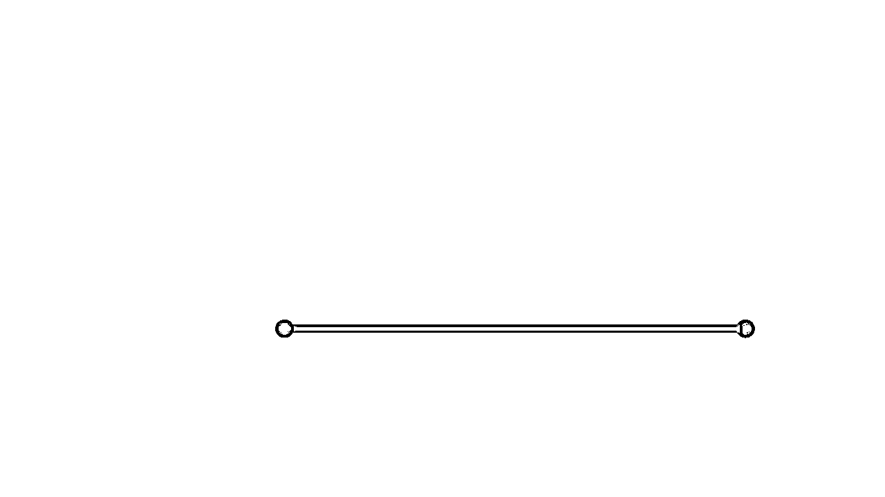

# 【生财技能】好的咨询师，都得有属于自己的课程

> 来源：[https://oee5lr7gsk.feishu.cn/docx/EF35dXHumoJvf3xk0socqODynze](https://oee5lr7gsk.feishu.cn/docx/EF35dXHumoJvf3xk0socqODynze)

全文共：5,145 字

预计阅读时间：4.88 分钟

圈友们好，我是根源

从工作以来，除了带团队、当讲师、做销售，其实我也是同时有着12年咨询经验的心理咨询师，

虽然就当时通过咨询的收入来看，这并不是我的主线。

但我一直觉得心理咨询是一个对我的人生有着极其重要影响，

也是在我的学问体系中排名第一，也是能糅合其他所有学问的学问。

那今天也是第一次在生财聊这个主题

我在做咨询师的过程，其实经历过三个不同的阶段

也是在不断迭代中，慢慢找到一个完整的服务转化路径的。

这一篇内容的经验，也希望能够提供给各位参考，

如果看完文章后，你也有共鸣、有想法，

或者是刚好也处在咨询师赛道想要建立自己完整的转化路径......

也能够一起讨论，一起聊聊。

* * *

# 赛道定义：我对于咨询师的定义

我大概有12年的咨询师经验，

那咨询涉猎的范围也比较广，从心理咨询、到副业咨询、到商业咨询、到人生的咨询……

只要是跟咨询相关的种类，我大概都有接过，所以我不太给自己定位成我只能做心理相关的咨询师。

那咨询师顾名思义，就是我们能够

### 透过自己的经验，或者是透过看到的经验，给别人解惑，

### 帮助提问者，或者是帮助咨询者解决他目前的问题，并且帮助他过关。

我觉得这是我个人对于咨询师的一个定义。

所以，其实咨询师的范围很广，任何行业都能够有咨询师。

* * *

# 咨询困境：用户咨询过一次之后很可能就不再找你了？

记得我以前在接咨询案子的时候呢，我总觉得自己的咨询应该咨询的挺不错的，

但是，随着时间长，我总会有一种失落感。

那个失落感来自于，被我咨询的客户都不太会有复购，

就是他可能找我咨询过一次，过了一个月两个月，他可能就不再找我咨询了。

当时我就在想：

如果说我的咨询很好，这些人应该会隔了一个月、隔两个月再次的找我才对。

后来才发现，第一个原因是我的咨询能力确实不足。

第二个原因是，我那个时候的咨询，到了咨询的尾声，我都没有给出一个解决方案。

因为咨询的过程，我们从了解客户的问题，解决他的问题，

到最后，一定要给他一个行动计划。

但那个时候，可能有一部分是我经验没那么足够，

所以在咨询的尾声，我并没有给他一个行动方案。

行动方案就是，接下来他应该要做什么：

就可能是他接下来得开始去地推，他每一天必须得去发一百张传单，

或者是他接下来得开始用手写的记录他的情绪。

或者是他得开始花时间去看书，每周一定要阅读一本书，才可以让他的认知增加

……

这些都行，都是一个他能够马上实做的实际方案。

那后来，我在这个部分就做了一点改变，

我开始在咨询的最后，一定会告诉他，接下来你应该做些什么，能够去改善你的情况，能够解决你目前的问题。

一开始我给出的行动方案，

都是说，你可以去看哪一类的书，你可以去报什么类型的课，

或者是你能够去做一些什么样的事情……

那我后来发现，就算我给了行动方案，这个人未来依旧不会再找我，

不能讲所有人都不找我，只是找我的比例很少。

就是咨询过一次之后，可能100个客户只有5个，

他们隔了一个月两个月会愿意再复购，会愿意再次的找我。

我就在想到底我少做了些什么？

就像看书，他只要花钱去买书，他就不用找我了，

或者是去找一个类似什么样子的课程，那这时候他可能会去找类似的课程，但也跟我没有任何的关系。

也就是我最后给出的行动方案，是跟我没有任何关联的。

这时候对方再找我的可能性就会大大降低。

* * *

# 深入探究：咨询师如何真正帮助咨询者改变？

那如何让对方在咨询完之后，可以下次再来找你

或者是你有没有一个机制能够更好地留住客户，让彼此能持续的建立联系？

这是一个我觉得做咨询师必须要认真思考的问题。

那在回答这个问题之前，我想先谈一谈『咨询师如何真正帮助咨询者改变？』

我会把咨询师分为三个阶段

这三个阶段也代表着咨询师的水平以及收费能力的递进

## 第一阶段：帮咨询者梳理问题，并给出想法

如果把每一个咨询者比喻成一张白纸（见下图）

『全白』就代表咨询者对于当下要咨询的事情没有想法也没有主见

所以想找一位咨询师帮助他疏理或者是解决问题

咨询师的角色就像支笔，在这张纸上画一个『点』（见下图）

这个点，就像一个解决方案、想法、或者是好的思维

『黑点』在整张纸上，其实非常的『微不足道』

但是在解决问题的当下，咨询者都会有非常好的体验感又或者是获得感

过去我的所有咨询都像这样的状况，咨询者当下都会说：

今天太棒了，我这辈子就没这么有收获过

但是几天过后，咨询者又再次回到原点

过没多久再次找我咨询，提的还是相同种类的问题

当时我其实挺困惑的

这问题上次不是解决过吗，怎么今天又问一次？

* * *

## 第二阶段：给出咨询者行动方案

12年多的咨询生涯中，最让我想不通的就是

为什么一个人，随著年龄的增加，应该要有长进

但怎么会不断地、重复地在一个问题上犯错

后来我发现，这问题跟咨询者没任何关系，问题出在咨询师身上

一个好的咨询师，其实是有办法能协助咨询者，更好的解决这样的问题

让咨询者有机会可以真正的过关

我当咨询师的中期，有了一些改变

不只给咨询者『黑点』，同时我还给了他一个能够过关的行动方案

也就是我告诉他该怎么往前走，从『点』进化成『线』了

虽然有进步，但是这条线在整张白纸上

到这个阶段，是多数的咨询师（也是当时的我）止步的地方

那时候我觉得自己很牛，我开始能给咨询者一条行动方案

告诉他做些什么事情可以度过目前的难关。

但过没多久，我发现这个咨询者依旧再次的回到原点

我明明给了行动方案，当下他也说了非常有收获，一定会按照这个方式好好的做，

可是几天或者是几周之后，咨询者依旧没有任何改变

当时我依旧产生很大的困惑，为什么？

到底我少做了些什么，导致咨询者还是回到原点

* * *

## 第三阶段：给咨询者创造改变的环境

一直到了第三阶段，我又修改了自己的咨询模式，从『线』进化成『面』。（见下图的网状结构）

也就是我不只给了咨询者一个行动方案，同时我还提供了一个很不错的环境。

这个环境是我自己创造出来的环境，让他能在这个环境中，按照我给他的行动方案执行。

这过程中，除了环境会影响他之外，

我还会不时的注意，他的行动轨迹有没有错误

每一个小周期，可能是三天、一周或者是一个月，我都会给出一点点的提醒。

从『点』到『线』、再从『线』到『面』。

我不只给出行动方案、还给出了一个好的环境

咨询者之所以会不断地再一个问题重复的犯错，重复的过不了关

就是因为他的习惯，导致我们给他的行动，做著做著就不做了

这就跟运动一样

教练跟我说拉好引体得收紧核心，当下我听进去了，我拉的过程会把核心收紧

但只要教练一走，我可能拉著拉著就会松懈，然后就忘记核心必须得收紧

如果这时候，身旁有一个贴身教练，

他会盯著我做每一下引体，然后每一下拉之前，都会特别说一句收紧核心、收紧核心

当我连续被说了一个月，

我就能因为教练不断地提醒而养成新的习惯，而改变我旧有的错误模式。

也就是，第一张图片的白纸象征的就是谘询者原本就有的习惯跟模式

只要谘询师没办法透过更好的方式让谘询者有一个养成新习惯的环境

这场谘询，基本上就是一种无效谘询。

* * *

# 解决方案：咨询师一定要有自己的课

也因为经历过第三阶段，

我认为咨询师一定要想办法给咨询者提供一个养成新习惯的环境。

这个环境，就是谘询者自己开的课

可能是心理相关的

可能是赚钱相关的

也可能是爱情沟通相关的

……

不管是哪一种都好，但一定得有

因为谘询的目的是为了让一个人有所变化

但谘询者获得变化的方式

一定是有人带着他先走一段路，养成习惯后，才有机会自己独立著继续走

因为这些不同阶段自己的反省

现在谘询的尾声，我都会给出选项式的行动方案

一般我都会给三种，这三种也是点线面的区别，同时也是预算的不同。

1.  第一种我都会推荐一本书，或者是某个播客、某个公众号

这个都不太需要花钱，就算要花也就是买本书，一百元以内可以搞定

1.  第二种我会推荐某个平台

就像生财有术、涛哥的星球、...。

这一类就得看我推荐的平台费用是多少，从几百块到几千块不等

1.  第三种我就会推荐自己的俱乐部

因为这是我自己交付、也是我自己带，我能清晰的掌控他的改变进度

对应不同的需求、推荐不同的产品给咨询者

之所以会给三种方案，除了有预算区别之外

另一个就是我如果只推自己的课或者是社群，就会有一种『我就是最好的，你就得找我』

这种表达方式，会很容易引起谘询者的『防卫机制』

因为我说的都是我好，当我不断地说我很好的时候

听者就会出现一种：『 你真的这么好吗？ 』这样的防卫机制

但是，当我们再沟通中放进了『选项』，谘询者就会从防御转换成我要选哪一个

这是两种完全不同的情绪状态

给出选项的最后，我都会特别解释为什么给出这三个

这时候，如果谘询者问我哪个会更好

我优先都会开玩笑的说：

那我肯定建议你到我的俱乐部

开玩笑的说完这句话后，我会继续接著说

这其实得你自己决定

因为改变是一件需要长期给出时间的事情

不同人会有不同的价值观

找到契合的价值观

也就是找到一个你觉得能信任的人

会远比你选到一堂好课、或是平台重要

每个人的学习方式也不同

我真的见过有人看书就可以成长的

……

之所以会有这一大段解释，因为我们的角色是一位谘询师，

好的谘询师，就必须得给方案的同时，也照顾到他的心情以及情绪

我要做的是让他选择一个更适合自己的解决方案，而不是『我是最好的，你就选我吧』

因为这种选择到后面，都很容易会出现风险

其实也能解读成，

### 任何谘询师的『一对一谘询』，就是一场精准并且深入的高单价转化场景

### 同时，也是一种深度的互相筛选场景

如果没有自己的产品，谘询结束后这人就会消失在你的世界中，

然后哪天出现问题、可能会回来，也可能会尝试找别的谘询师。

也就是，当咨询师有了自己的课一条完整的路径才会发生

不然，就只是做一个单点的交付行为

就商业上来说，当一个谘询师只把『一对一谘询』当成主要项目

这条路一定会走窄，越走越窄、越走越累、越走客户越少。

因为，最终更大的钱一定不是来自于客户约你单独谘询

而是后续的多人课程交付场景，以及透过长时间相处培养的信任感，让客户愿意为你支付更高单价的产品

总结就是

咨询师一定得有自己的课！

* * *

# 尾声的过去历史介绍

我是根源，同时也是第四期的生财圈友

一个有 2w+ 实战案例的心理咨询师

12年线下销售、团队管理经验。

2022 年开始转型线上，做一些知识付费的项目。

过去曾发表过几篇文章

都能看到这，代表你对文章的喜爱

肯定有一定的程度！

也欢迎阅读过去我写过的历史文章。

2021年的文章（精华x1）

1.  精华《直觉式萨克斯 透过社群成功变现146万》 https://t.zsxq.com/116B1bcYc

1.  《73项被动收入打造》 https://t.zsxq.com/11EHjTH0P

1.  《杭州夜话02场，夜话官复盘》 https://t.zsxq.com/19IkX4UMl

1.  《年入百万，团队从20人到4万人》 https://t.zsxq.com/19JYt77hL

1.  《主题：如何更有效的链接见面会认识的圈友》 https://t.zsxq.com/19VY2LWg4

2022年的文章

1.  《互联网小白，第 1 次做线上产品，7 天赚回 10 倍门票》 https://t.zsxq.com/11ooZZbM7

1.  《把捣乱分子『逆势』转成爱用者的好方式》 https://t.zsxq.com/19lipLhJ5

1.  《 好的内容，是目前依旧没退旧流行的变现方式 》 https://t.zsxq.com/19BLMAYw1

1.  《明白老师的一个启发，让我从100天日耕的过程赚了30W+》 https://t.zsxq.com/19BgNoxfi

2023年的文章（精华x6）

1.  《私域的意义不是管理，而是经营》 https://t.zsxq.com/19WEsfSq1

1.  精华《9年传统行业 1 年时间，从一无所有，到年入 200 万》 https://t.zsxq.com/10nmEr1cA

1.  精华《25个提高微信成交率的小技巧》 https://t.zsxq.com/11AgRW24F

1.  精华《35 个让私域收入翻 3 倍的技巧》 https://t.zsxq.com/11FmV2aqZ

1.  精华《续篇 - 25个提高微信成交率的小技巧（26 - 50）》 https://t.zsxq.com/13yRbmUwo

1.  《 私域话题：涨价之后，如何回复以及留住客户？》 https://t.zsxq.com/11UJk9HxQ

1.  精华《成为自由职业者的20个必备特质 》 https://t.zsxq.com/14XTxhh15

1.  《 36个让私域成交率翻倍的实战指南！ 》 https://t.zsxq.com/17zSrYzvk

1.  精华《产品线有引流体系，如何通过沟通促成升单？》 https://t.zsxq.com/17ocUJEFA

1.  《知识付费赛道，如何透过处理『反对问题』，增加用户粘性和复购率？》 https://t.zsxq.com/181fSc5rv

2024年的文章（精华x9）

1.  精华《第一次尝试「问答群形式」的公域往私域转化，7天变现11万》 https://t.zsxq.com/18gBXlWxE

1.  《 线上新手，我是如何用一套固定流程，累计成交 300 万高价产品？ 》 https://t.zsxq.com/18IWgDiXo

1.  精华《 私域话题-如何在客户咨询过程中，透过三个步骤提高2倍成交率？ 》 https://t.zsxq.com/196Ad34aR

1.  《私域的十倍增长话题：不同信任程度的客户，如何提升成交率？》 https://t.zsxq.com/YKHGT

1.  精华《 为什么都是做副业，我能第一年就达到七位数？ 》 https://t.zsxq.com/APodD

1.  《 写作赛道，如何使用「算账思维」精准地评估产出？》 https://t.zsxq.com/ymcEE

1.  《 私域+知识付费话题：如何通过增加合理的触达次数，提升2倍以上成交率？》 https://t.zsxq.com/elSxU

1.  《9年传统行业转型第2年，如何维持百万利润》 https://t.zsxq.com/61VlK

1.  《把副业做到超过主业收入，你必须得知道的20件事！》 https://t.zsxq.com/bkbd1

1.  精华《用这 13 个思维，我做过的副业全都成功变现！》 https://t.zsxq.com/1q1Re

1.  精华《如何找到靠谱的人，让项目成功几率提升十倍？》 https://t.zsxq.com/hJZfN

1.  《私域筛选流程小尝试，四位数产品课程，转化率40%》 https://t.zsxq.com/o2dJx

1.  《 30个『提高5倍微信成交率』的小技巧 》 https://t.zsxq.com/oThQB

1.  《私域话题—引流来的客户，用什么样的话术，可以提高2倍成交率？》 https://t.zsxq.com/RuaIy

1.  精华《如何处理退费(反对)问题，让高客单产品的退费率大幅降低？》 https://t.zsxq.com/X2PEX

1.  《如何善待恶贵人，增加项目赚钱的稳定度？》 https://t.zsxq.com/aspYc

1.  精华【生财技能】如何透过几个标准、筛选出合适的合伙人？ https://t.zsxq.com/h1J4J

1.  精华【生财技能】我是如何做自己的时间管理体系、让工作效率能维持在挺不错的状态。 https://t.zsxq.com/u4HxT

1.  精华【失败经验】四万人的团队，如何凭证一身实力把团队搞崩盘 https://t.zsxq.com/YuLQz

1.  【生财技能】我知道副业很重要，但是却找不到坚持的动力 https://t.zsxq.com/SDRdD