# YouTube Shorts 全流程自动化运营实践

> 来源：[https://ia0969wpr2.feishu.cn/docx/ELcgdUKJToK95YxuoCUc33XVnzh](https://ia0969wpr2.feishu.cn/docx/ELcgdUKJToK95YxuoCUc33XVnzh)

大家好，我是钱塘江鲤，受亦仁的超级标启发，前一阵开始探索 YouTube shorts 的AI视频运营。经过一段时间的摸索，在这个过程中，我也把自己的整个流程慢慢自动化起来，最初因觉得这东西也没啥技术难点，而且也才刚刚起步没做出成绩来，没有太多值得说的的地方，前两天和@土豆君 聊天，说起来了这件事，在他的激励下最终打算分享下目前的流程，希望能为同样在探索这条路的朋友提供一些有用的参考。

文章主要介绍了我如何借助 cursor + AI 实现 youtube shorts 高效运营的过程，目前除了人工介入筛选图片，筛选视频外，从采集、对标视频复刻、创意生成到图片与视频生成、剪辑和多账号矩阵运营都已经实现了自动化，当然我之前也尝试了全自动无人参与，但是总体质量并不高，所以后面慢慢加入了反推图片筛选和生成视频筛选等几个人工介入的节点，主打一个饱和式生成，最后筛选。

目前一个视频的成本根据使用的图片模型不同大概在几分钱到几毛钱之间，当然成本可以进一步压缩，但是就没办法保证质量了，所以在保证质量的前提下，目前的这个成本总体还是能接受的。

使用的工具有

提示词反推：midjourney describe 和 gpt4o-mini，

图片生成：flux+comfy/midjourney

视频生成：即梦/可灵/海螺。

再次说明下背景：这篇文章是我在自己起号的过程中做了一个自己的内容管理和发布中心的经历。整个项目的代码都是由 Cursor 辅助生成，但是限于篇幅不可能在文中列出所有的历史prompt，况且现代 AI 模型的能力也今非昔比，我们不需要各类“封神”或者一大堆理论花里胡哨的提示词技巧，清晰地表达需求我们就能够完整地构建一个产品，只要开始就这件事就很简单。

我在文章中会把一些比较复杂，AI多轮才能调试实现的功能的核心代码也贴了出来，比如场景切分、视频生成自动化、discord或者即梦等无水印下载的油猴脚本等等。但是更多的还是需要你自己去尝试去调试。

另外因为涉及到的小功能细节比较多，受限于篇幅很难一一详细讲清楚，所以文章粗读起来脉络可能比较乱混乱和抽象，觉得有跳跃性，但是客观地讲，如果你已经跑通了整个流程正在处于需要放大的阶段，这篇文章一定会对你有参考价值，当然了也还有很多不足，也欢迎大家在星球中讨论，在交流中我们都能找到更好的答案。

下面是整体的实现过程。

## 对标视频自动拆解与复刻

首先是对标视频的像素级拆解和自动生成。

我们根据对标视频生成新视频的步骤有哪些呢？主要是 视频下载-> 场景区分 -> 提示词反推 -> 生成新图片 -> 生成视频 -> 剪辑 -> 添加BGM -> 导出

那以上步骤哪些能自动化呢？答案当然是都能，但是为了保证质量，我们可以在生成图片和生成视频这里人工介入筛选下，其他的都不需要了。因为我本身能投入到youtube的时间比较少，所以一开始的预期就是：输入对标视频链接，自动化生成复刻分镜视频片段，让我动动鼠标我筛选下，其他的切分，重绘，剪辑，上传，数据统计全部都要自动化。

要完成时上面预想的第一步就是我们要做一个自己的素材中心，用于创建草稿项目、管理视频、管理代理信息和矩阵账号等。

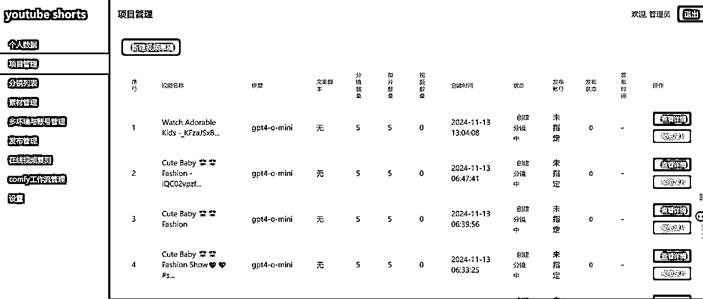

这个直接cursor一键生成微调就行了，第一版的草稿大概是这样子的，只要我们创建了基本的项目和素材中心，后面我们复刻的视频草稿就有了存储和管理的入口。因为时间比较久远了，初始的提示词也没记录，但是大致功能是这样的，我又重新写了一个初始项目的提示词试了下也能生成，大家可以根据自己需求再调整：

请帮我做一个youtube shorts 的素材管理、视频草稿与剪辑和自动发布系统。左侧菜单栏包括：视频草稿管理、分镜列表、素材管理、多环境与账号管理、在线视频复刻、设置、comfy工作流管理、个人数据。技术栈使用python fastapi + jinja，请首先完成项目框架的搭建。

请帮我完成草稿管理列表页；上面一个新建视频草稿按钮，新建的时候弹出框选择，模型、脚本、分镜数量、发布账号、工作流（选择框）。

列表页字段有：序号、模型、脚本、图片数量、视频数量、创建时间、发布账号、发布状态、发布时间。操作栏有查看详情和预览成片。

请帮我新建分镜列表页，上面有筛选项：项目名称（单选）。操作按钮有：新增分镜（点击后弹窗可以填写列表中的字段外加一个排序）；一键重新生成关键词、一键生成图片、一键生成视频、一键合成成片、导出剪映草稿箱、发布油管；列表页字段有序号、分镜内容、图片提示词、图片提示词英文、视频提示词、视频提示词英文、字幕、字幕英文、图片、视频；操作列按钮有：保存、重新生成图片提示词、重新生成视频提示词；另外我希望图片提示词、视频提示词、字幕都可以直接在表格中双击修改，这样修改之后方便我点击直接保存：注意图片和视频字段中的值是多条本地的图片和视频地址，如：J:\ai\output\ComfyUI_00167_.png，注意要把视频和图片直接在表格中渲染出来，方便我查看分镜的详情。我要求你写几条示例数据，方便我测试

注意上面只是前端界面的开发，后端我们在实现过程中不断用自然语言指挥cursor 就行了。

下面就可以继续了第一项：对标视频的自动拆解与复刻

### 视频下载

说到复刻，第一步就是下载视频，我们当然可以在谷歌上使用搜索并打开一个油管下载站点，然后手动复制链接，下载视频、音乐，再播放视频拖动截取场景图片，但是这个整个流程链路太长了，这样不方便纳入到我们的自动化流程中，即使使用RPA作为粘合，也很难真正提效。所以我们要自己写一个YouTube视频和BGM下载工具，这是一切自动化的起点。

不难，截图给cursor十分钟搞定。完成后如下：

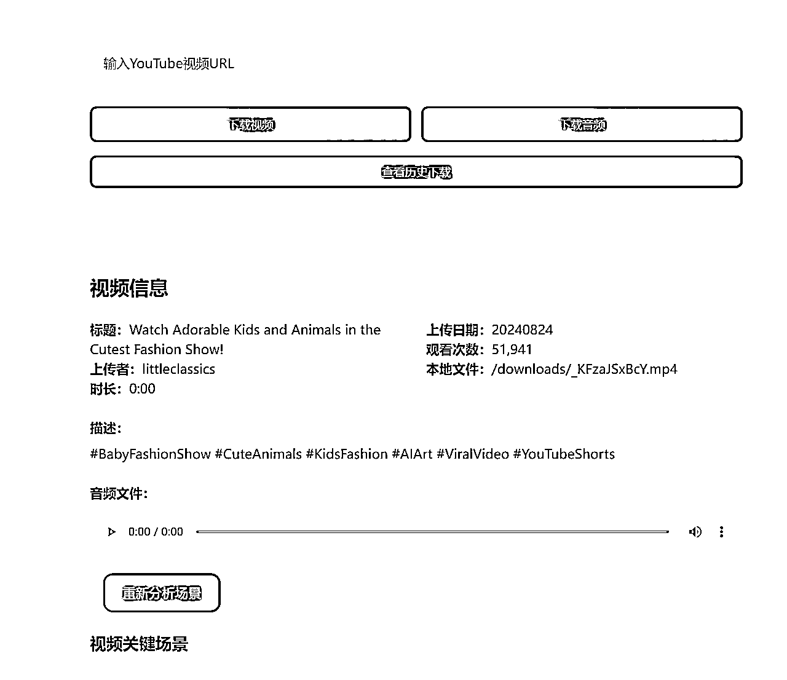

复刻过程比较简单，我们直接在谷歌搜索一个在线下载站，比如就它了：


Cursor 直接ctrl+i调起composer，输入我们的要求


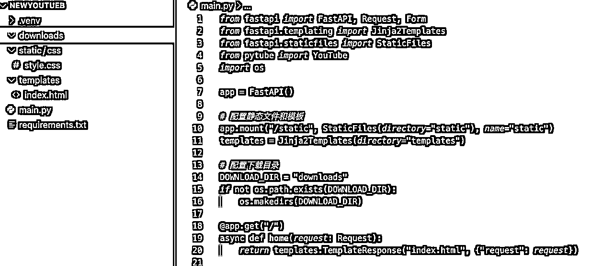

安装对应依赖，成功启动，这里我们根据自己的实际需求微调就行，不需要怀疑claude的能力，就是这么强。

为了后面的自动化，我后面又做了些改动，把数据存储到了自己的数据库中，方便进行数据有状态的回溯。

我们随便输入视频地址，点击下载之后，发现BGM和视频都下载好了。

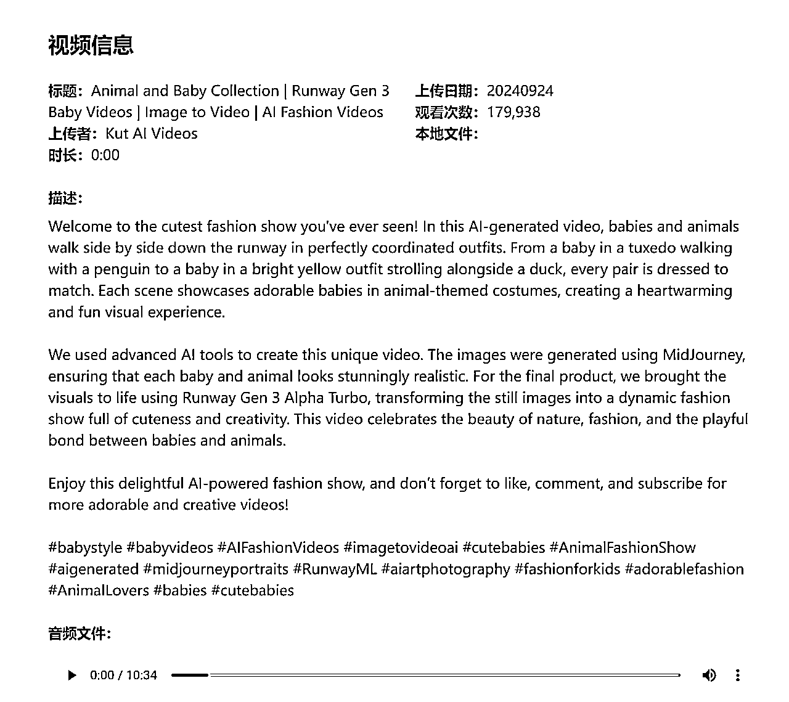

接下来我们找个对标视频，比如这个：https://www.youtube.com/watch?v=_KFzaJSxBcY，在我们自己的在线下载服务输入链接，点击下载，结束。

视频下载好了下一步就是场景提取了，我们要精准识别出视频中的所有场景，这里我们使用opencv就可以了。

思路就是逐帧拆解，或者根据最小场景时长，比对不同场景的结构相似值和颜色相似值，最后切片出来所有场景，切片判断的时候有些剪辑会有转场，所以我们不要拿场景变动的第一帧，而是根据场景变动去前后30帧寻找相同同场景下的最清晰的图片，这里也没啥问题，核心代码如下：

```
import cv2
import numpy as np
from pathlib import Path
import os
import time

def create_output_dir(output_dir):
    """创建输出目录"""
    os.makedirs(output_dir, exist_ok=True)
    return output_dir

def calculate_frame_clarity(frame):
    """计算帧的清晰度"""
    gray = cv2.cvtColor(frame, cv2.COLOR_BGR2GRAY)
    return cv2.Laplacian(gray, cv2.CV_64F).var()

def detect_scene_change(prev_frame, curr_frame, min_threshold=0.15, max_threshold=0.60):
    """
    检测场景变化
    :param prev_frame: 前一帧
    :param curr_frame: 当前帧
    :param min_threshold: 最小变化阈值
    :param max_threshold: 最大变化阈值
    :return: (是否是新场景, 变化程度)
    """
    # 转换为灰度图
    prev_gray = cv2.cvtColor(prev_frame, cv2.COLOR_BGR2GRAY)
    curr_gray = cv2.cvtColor(curr_frame, cv2.COLOR_BGR2GRAY)

    # 计算帧差
    diff = cv2.absdiff(prev_gray, curr_gray)

    # 应用高斯模糊减少噪声
    diff = cv2.GaussianBlur(diff, (5, 5), 0)

    # 应用阈值
    _, thresh = cv2.threshold(diff, 25, 255, cv2.THRESH_BINARY)

    # 计算变化像素的比例
    change_ratio = np.count_nonzero(thresh) / thresh.size

    # 判断是否是新场景
    is_new_scene = min_threshold < change_ratio < max_threshold

    return is_new_scene, change_ratio

def split_video_scenes(video_path, output_dir, min_threshold=0.15, max_threshold=0.60, 
                      min_scene_duration=15):
    """
    分割视频场景
    :param video_path: 视频文件路径
    :param output_dir: 输出目录
    :param min_threshold: 最小变化阈值
    :param max_threshold: 最大变化阈值
    :param min_scene_duration: 最小场景持续帧数
    :return: 场景图片路径列表
    """
    print(f"开始处理视频: {video_path}")
    start_time = time.time()

    # 创建输出目录
    output_dir = create_output_dir(output_dir)

    # 打开视频文件
    cap = cv2.VideoCapture(video_path)
    if not cap.isOpened():
        raise ValueError("无法打开视频文件")

    # 获取视频信息
    total_frames = int(cap.get(cv2.CAP_PROP_FRAME_COUNT))
    fps = int(cap.get(cv2.CAP_PROP_FPS))
    print(f"视频信息: {total_frames} 帧, {fps} FPS")

    scene_images = []
    scene_count = 0
    frame_count = 0
    frames_since_last_scene = 0

    prev_frame = None
    current_scene_frames = []

    while cap.isOpened():
        ret, frame = cap.read()
        if not ret:
            break

        # 显示进度
        if frame_count % 100 == 0:
            progress = (frame_count / total_frames) * 100
            print(f"处理进度: {progress:.1f}%")

        # 第一帧处理
        if prev_frame is None:
            prev_frame = frame
            current_scene_frames.append((frame, calculate_frame_clarity(frame)))
            frame_count += 1
            continue

        # 检测场景变化
        is_new_scene, change_ratio = detect_scene_change(
            prev_frame, frame, min_threshold, max_threshold
        )

        # 将当前帧添加到当前场景
        current_scene_frames.append((frame, calculate_frame_clarity(frame)))
        frames_since_last_scene += 1

        # 如果检测到新场景且已经过了最小场景持续时间
        if is_new_scene and frames_since_last_scene >= min_scene_duration:
            # 从当前场景帧中选择最清晰的帧
            clearest_frame, _ = max(current_scene_frames, key=lambda x: x[1])

            # 保存场景图片
            scene_path = os.path.join(output_dir, f'scene_{scene_count:03d}.jpg')
            cv2.imwrite(scene_path, clearest_frame)
            scene_images.append(str(Path(scene_path).absolute()))

            print(f"检测到新场景 {scene_count}, 在帧 {frame_count}, 变化程度: {change_ratio:.3f}")

            # 重置计数器和缓存
            scene_count += 1
            frames_since_last_scene = 0
            current_scene_frames = [(frame, calculate_frame_clarity(frame))]

        prev_frame = frame
        frame_count += 1

    # 保存最后一个场景
    if current_scene_frames:
        clearest_frame, _ = max(current_scene_frames, key=lambda x: x[1])
        scene_path = os.path.join(output_dir, f'scene_{scene_count:03d}.jpg')
        cv2.imwrite(scene_path, clearest_frame)
        scene_images.append(str(Path(scene_path).absolute()))

    # 释放资源
    cap.release()

    # 打印统计信息
    end_time = time.time()
    processing_time = end_time - start_time
    print(f"\n处理完成:")
    print(f"总共检测到 {scene_count + 1} 个场景")
    print(f"处理时间: {processing_time:.2f} 秒")
    print(f"平均每秒处理 {frame_count/processing_time:.1f} 帧")

    return scene_images

def main():
    # 配置参数
    video_path = "downloads/video_309622719539707911.mp4"  # 替换为你的视频文件路径
    output_dir = "output_scenes"  # 输出目录

    try:
        scene_paths = split_video_scenes(
            video_path=video_path,
            output_dir=output_dir,
            min_threshold=0.15,    # 最小变化阈值
            max_threshold=0.60,    # 最大变化阈值
            min_scene_duration=15  # 最小场景持续帧数
        )

        print("\n场景图片路径：")
        for path in scene_paths:
            print(path)

    except Exception as e:
        print(f"处理视频时出错: {str(e)}")

if __name__ == "__main__":
    main()

```

这样，输入视频链接，自动下载视频&BGM并且自动拆分场景图就实现了

如图所示，我们只需要输入连接，一分钟左右就可以自动下载完成视频、BGM和场景切分完成，如果需要多次分析切片场景，新增一个重新分析按钮就行。

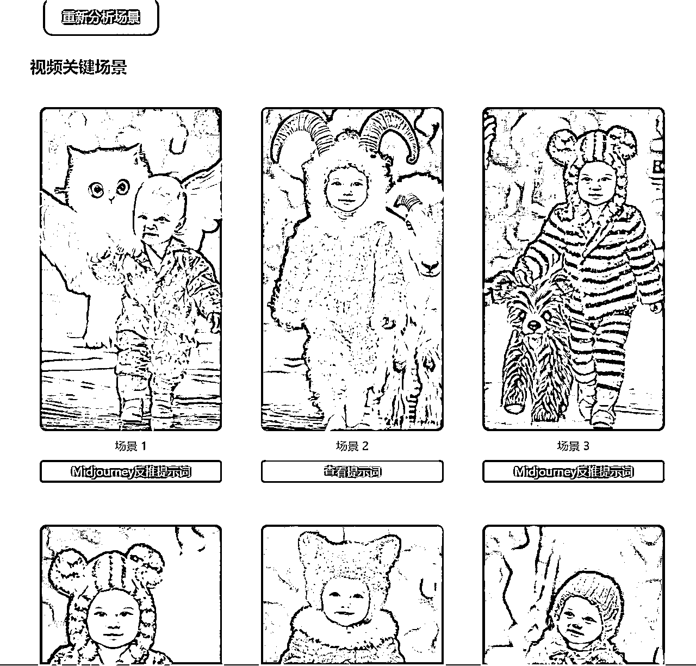

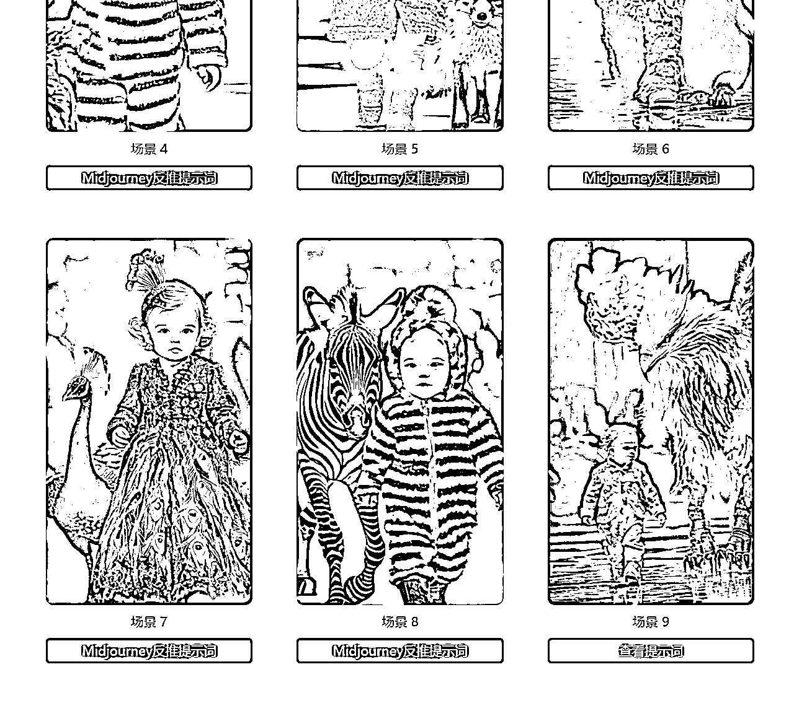

我们继续优化下功能，每张图片可以预览，并且可以手动删除一些不满意的场景图：

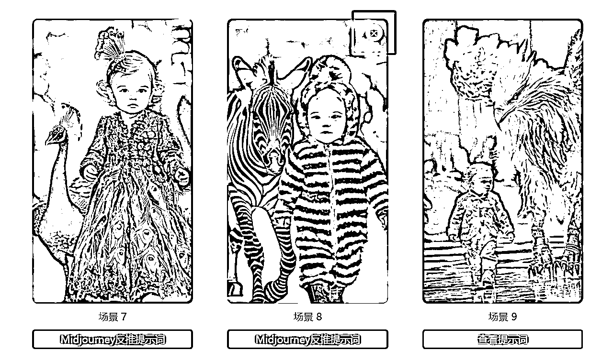

这样我们从输入链接到视频和BGM下载，到全自动拆解完场景切片，一个视频大概只花了不到1分钟。

我们可以提前采集到数据比较好的的视频，批量后台自动化拆解与复刻就行，稍微开个并发，一晚上切一两千个视频简简单单，第二天醒来手动筛选图片就行了。

下一步是根据切分出来的图片反推提示词。

### 图片反推

拿到各个场景图片我们就可以反向获取提示词了，咋办呢？总不能手动把本地图片上传给midjourney 或者 gpt 去描述，然后在生成吧？我们直接一步到位，在每个图片下方新增一个midjourney 提示词反推、和GPT4提示词反推的按钮，点击之后自动生成画面提示词。

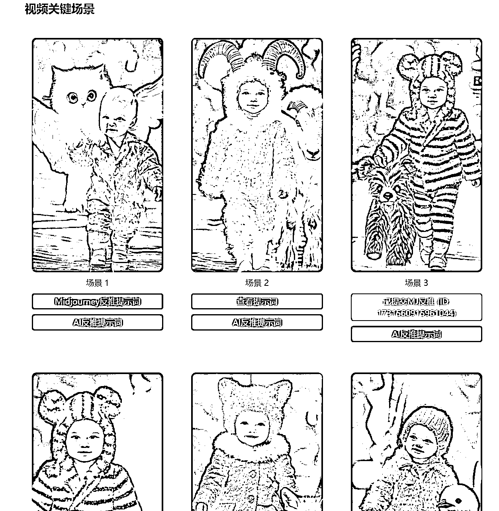

生成之后点击会弹出反推出来的提示词

这里我们如果自己在discord订阅了mj，可以自己直接逆向，逆向的话也不用造轮子，直接用下面这些开源的改改就行：

https://github.com/yokonsan/midjourney-api

https://github.com/erictik/midjourney-api

https://github.com/novicezk/midjourney-proxy

当然了如果你对上面这些不感兴趣，也可以使用第三方的按量付费API，效果都是一样的。第三方的话反推提示词大概6分钱一张，使用4o大概几厘一张，接近免费，根据自己实际情况来就行了。

MJ 我使用的是一个中转站的API，为了避免广告嫌疑我就不放地址了，大家在谷歌搜一下 midjourney api，或者找一个聚合类API转发站点，类似的中转接口太多了，自己对比之后找个便宜的就行。

加入mj或者GPT反推以后，我们可以丝滑地拿到图片提示词，我们可以再加个按钮，可以一键添加到视频草稿，注意添加草稿的时候我们可以加一个逻辑，以当前的视频标题+title作为唯一键创建新草稿，这样后续所有的视频提示词都可以加到同一个草稿中，方便我们调整导出。

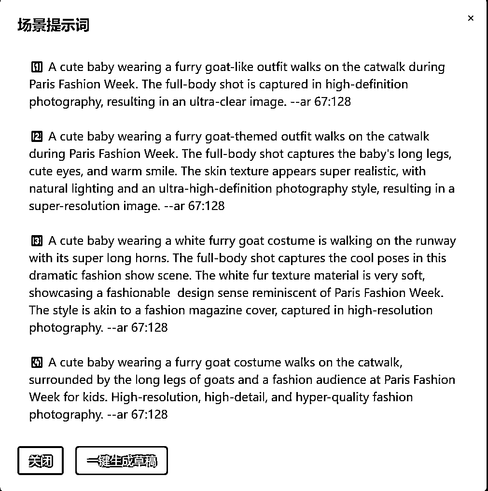

## 创意微调

我们拿到了视频中所有不同场景的图片提示词并且导入到了视频草稿中的分镜列表，这里其实有时候可能对反推的提示词做一些修改，我们可以直接把列表渲染改成双击输入修改，可以手动修改，也可以使用AI发挥想象力进行扩展同类型提示词。本来想着再写个方法多生成几个创意来着，但是转念一想，现在不是有的是插件吗，比如monica, sider ai等等，我们可以设置monica 的快捷提示词，然后直接选中提示词进行同类扩展，点击就可以生成提示词了。

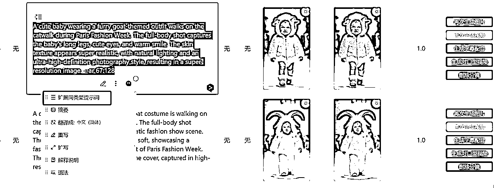

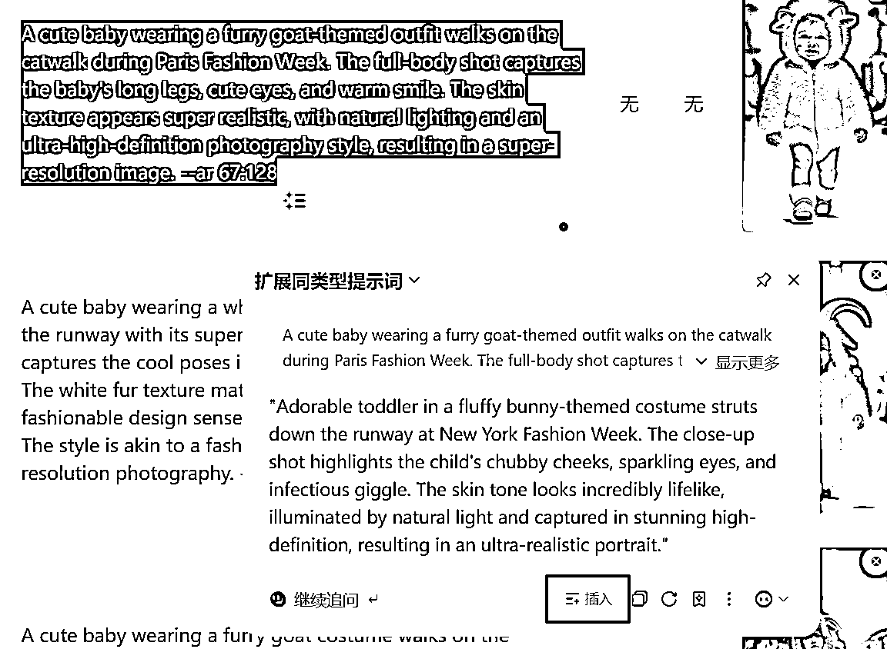

提示词生成后如果满意直接点击插入，然后自动保存

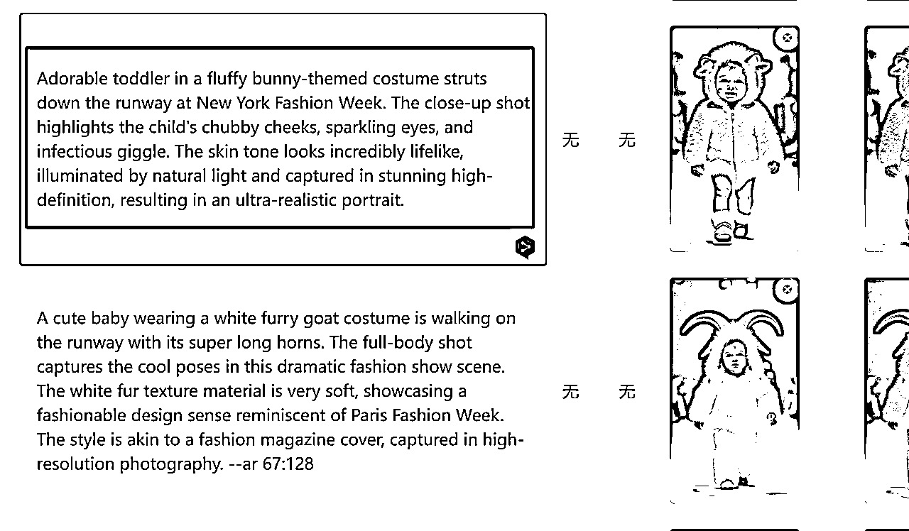

当然了这种方法的缺陷就是没有办法批量生成，不过也好解决，我们写个后台脚本，一次性根据当前提示词生成十条相似或扩展创意就行了，但是我觉得也没必要，目前够用了.

我们点击提示词反推之后，稍后就会看到mj生成的提示词了，默认是4个，我们加一个一键生成图片视频草稿。点击之后以当前视频的videoid为标题自动创建一个项目并且把四个提示词进行拆分，这时候发现已经跳转到分镜页面了，这里图片生成我使用的是本地的flux，毕竟便宜，主打的就是不想花的钱一分也不想花。（提示词反推本地也能实现，但是效果可能差点）我们看到图片已经自动生成了，但是因为是mj反推，所以这个时候是没有视频提示词的，那咋办？只能新增一个功能了，获取反推提示词后自动生成视频提示词。

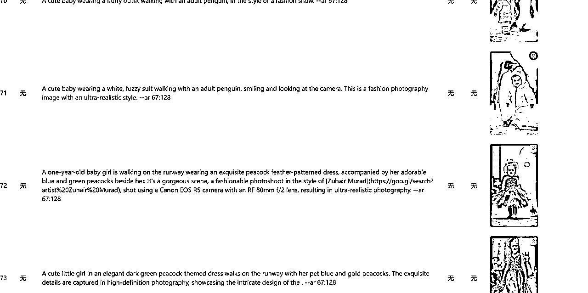

## Flux comfy 工作流图片生成

大批量生成图片的话MJ成本还是很高的，所以这里我直接本地flux+comfy，生成几千张也不用花一分钱，效果能到8成。

一开始我的需求其实是我想根据不同的剧情和赛道选择不同的工作流生成图片，所以我在草稿选项中加了自己做的几个comfy 工作流，每个工作流中的lora 和 工作流都不同，这样就可以不同赛道使用不同工作流，也可以针对同一个视频微调风格。

这样做的前提是我要自建一个工作流管理中心，并且与图片生成进行串联。这是当时comfy 工作流的cursor prompt，主要是创建了一个comfy 管理中心，方便复刻不同赛道的视频和风格。在页面上可以更方便的查看和验证工作流。

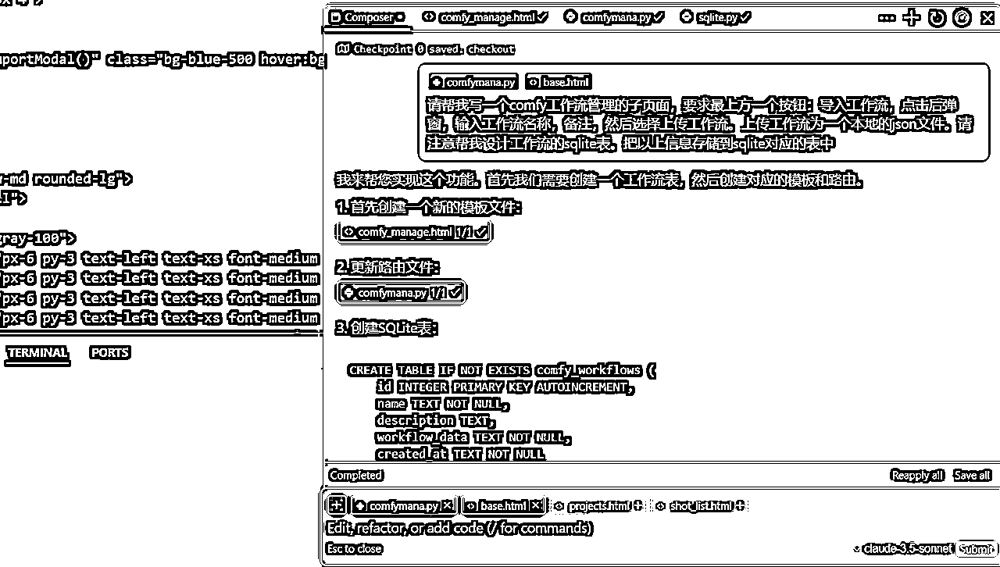

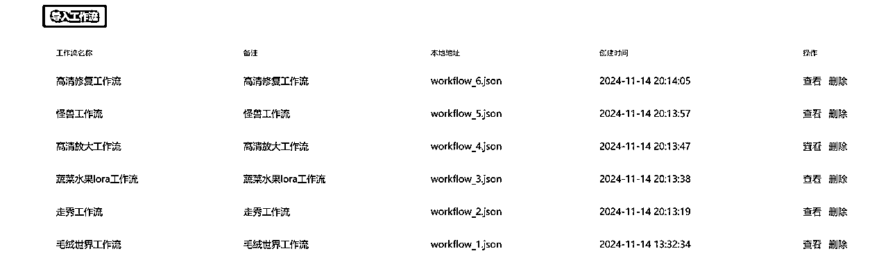

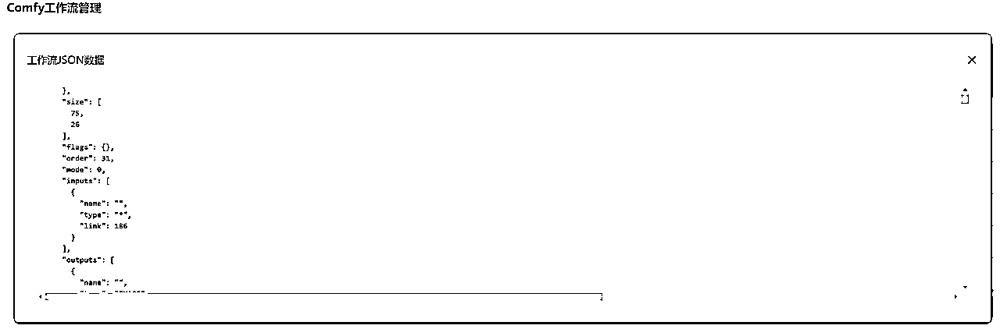

上面工作流管理完成后我们要导入到我们的工作流，打开comfyui，直接点击保存API，保存这个工作流json，后面就可以导入到我们自己的工作流库中，方便在各个节点使用了。

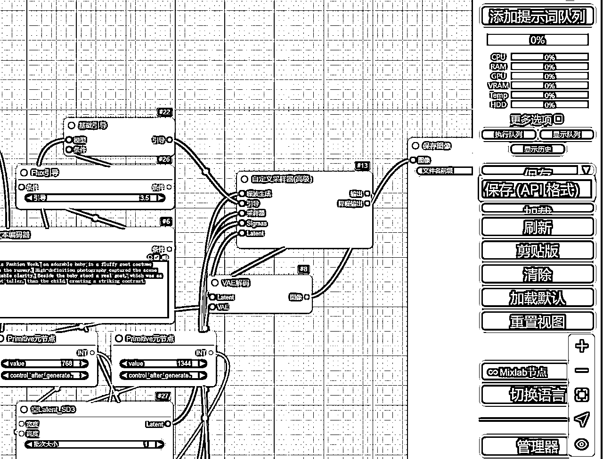

如果对comfy不熟悉的话，我们可以直接去 libart 根据需求下载一个高赞的工作流直接导入。

https://www.liblib.art/

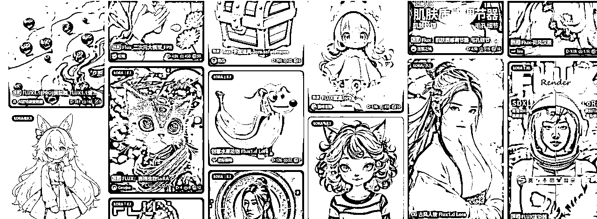

导入自己的comfy 工作流之后我们在创建新视频草稿的时候就可以选择风格了。这样在复刻视频的时候可以走不同的工作流，工作流的自定义性就很强了，能完成更多MJ做不到的事情。

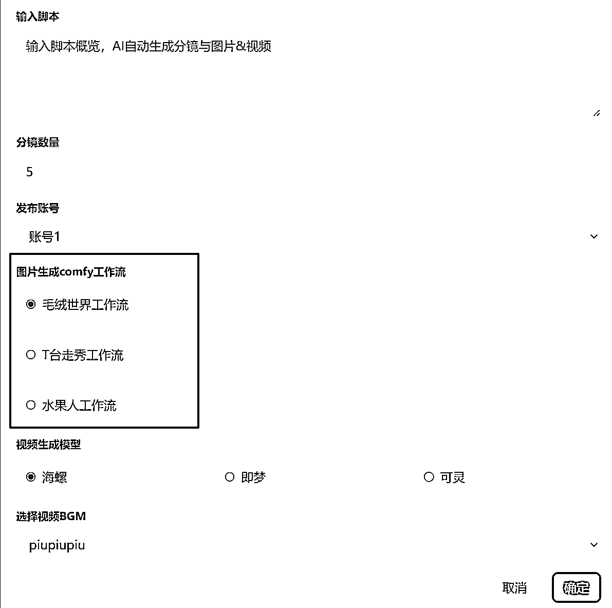

## MJ 图片生成

在不断地生成图片的过程中，我们确实可以看到comfy 工作流定制性更强的，但是flux+comfy 门槛确实太高了，大部分人很难搞定，再加上很多时候MJ生成的图片审美确实更好，所以我们也可以使用MJ去生成原始素材。

MJ 我们当然也可以全自动，比如逆向或者购买第三方API，刚刚上面也说到了，但是这种技术门槛稍微有点高也有点麻烦，下面这种方式我称为半自动，是最初我在验证SOP时候写的一个小脚本。

大致是我在discord页面注入了一个按钮 “素材收集”，点击之后自动会把我们生成的图片保存到我的视频分镜图里直接生成视频了。这样就不需要我先下载到本地了，可以统一在素材中心进行管理。

比如第一版，我在discord生成的每个图片上面都加了一个“收集” 按钮，点击之后图片自动放入素材库进入视频生成环节。

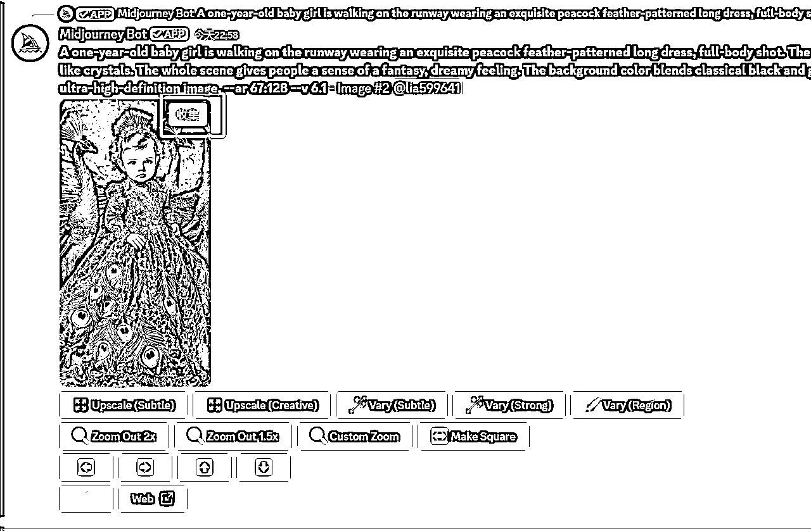

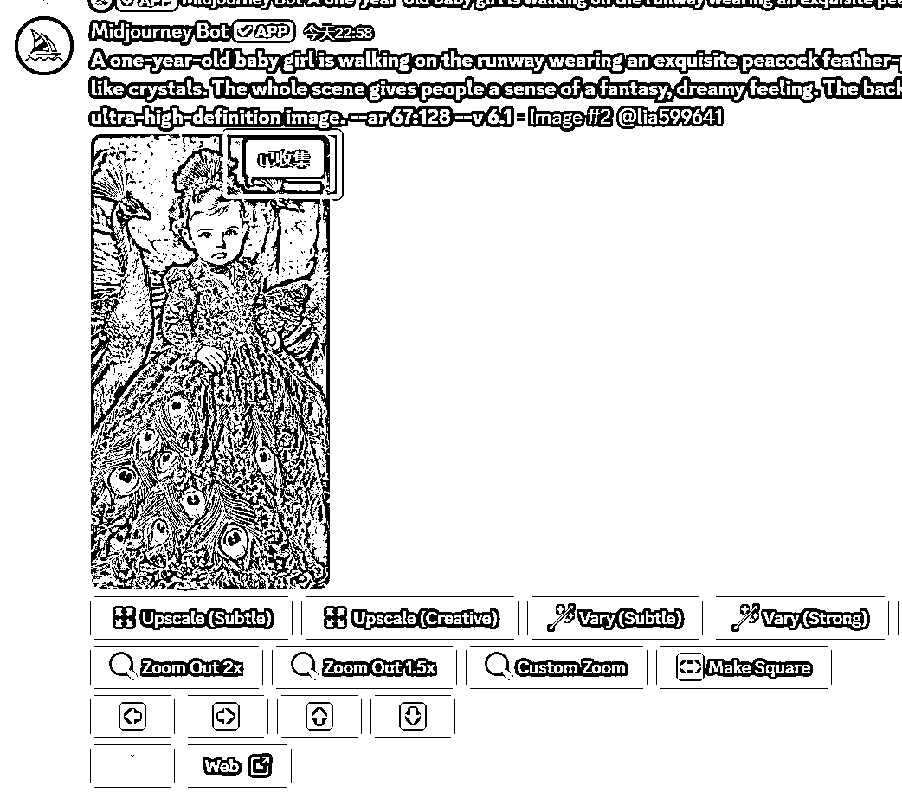

代码如下：

```
// ==UserScript==
// @name         Discord Image Collector
// @namespace    http://tampermonkey.net/
// @version      0.2
// @description  Add collect button to Discord images
// @author       Your name
// @match        https://discord.com/*
// @grant        GM_addStyle
// @grant        GM_xmlhttpRequest
// ==/UserScript==

(function() {
    'use strict';

    // 添加按钮样式
    GM_addStyle(`
        .collect-btn {
            position: absolute;
            top: 5px;
            right: 5px;
            background-color: #7289da;
            color: white;
            border: none;
            border-radius: 4px;
            padding: 5px 10px;
            cursor: pointer;
            z-index: 9999;
            opacity: 0.8;
        }
        .collect-btn:hover {
            opacity: 1;
        }
    `);

    // 监听DOM变化
    const observer = new MutationObserver((mutations) => {
        mutations.forEach((mutation) => {
            mutation.addedNodes.forEach((node) => {
                if (node.nodeType === 1) {
                    processImages(node);
                }
            });
        });
    });

    // 处理图片
    function processImages(container) {
        // 查找所有图片容器
        const imageContainers = container.querySelectorAll('.imageContainer_cf58b5:not([data-collector-added])');

        imageContainers.forEach(container => {
            // 标记容器已处理
            container.setAttribute('data-collector-added', 'true');

            // 查找原始链接
            const originalLink = container.querySelector('.originalLink_d4597d');
            if (!originalLink) return;

            // 获取完整的图片URL（包括查询参数）
            const imageUrl = originalLink.href;
            if (!imageUrl) return;

            // 创建收集按钮
            const collectBtn = document.createElement('button');
            collectBtn.className = 'collect-btn';
            collectBtn.textContent = '收集';

            // 添加点击事件
            collectBtn.addEventListener('click', (e) => {
                e.preventDefault();
                e.stopPropagation();

                // 发送完整URL到本地服务器
                GM_xmlhttpRequest({
                    method: 'POST',
                    url: 'http://localhost:8001/material/collect',
                    headers: {
                        'Content-Type': 'application/json'
                    },
                    data: JSON.stringify({ url: imageUrl }),
                    onload: function(response) {
                        if (response.status === 200) {
                            collectBtn.textContent = '已收集';
                            collectBtn.style.backgroundColor = '#43b581';
                            setTimeout(() => {
                                collectBtn.textContent = '收集';
                                collectBtn.style.backgroundColor = '#7289da';
                            }, 2000);
                        } else {
                            collectBtn.textContent = '失败';
                            collectBtn.style.backgroundColor = '#f04747';
                            setTimeout(() => {
                                collectBtn.textContent = '收集';
                                collectBtn.style.backgroundColor = '#7289da';
                            }, 2000);
                        }
                    },
                    onerror: function() {
                        collectBtn.textContent = '错误';
                        collectBtn.style.backgroundColor = '#f04747';
                        setTimeout(() => {
                            collectBtn.textContent = '收集';
                            collectBtn.style.backgroundColor = '#7289da';
                        }, 2000);
                    }
                });
            });

            // 找到图片包装器并添加按钮
            const imageWrapper = container.querySelector('.loadingOverlay_d4597d');
            if (imageWrapper) {
                imageWrapper.appendChild(collectBtn);
            }
        });
    }

    // 启动观察器
    observer.observe(document.body, {
        childList: true,
        subtree: true
    });

    // 初始处理已存在的图片
    processImages(document.body);
})();
```

这里后台的8081是我们的素材中心的接口，这里也直接让claude生成即可，很简单，没啥难得。

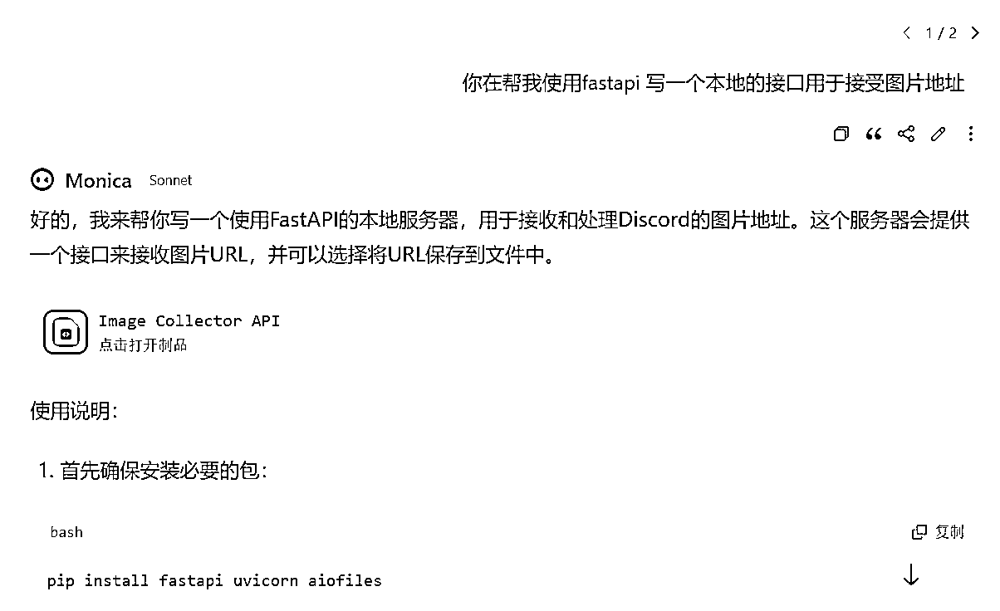

后来发现上刚才那种方式只保存了图片，我还想要原始的图片生成提示词，下面是优化版本的prompt：

请在discord 的midjourney频道的图片生成元素框添加一个按钮，名称叫做添加到素材库。需要定位的容器为：

，其中样按钮式如：，请帮我使用油猴脚本实现

这样就改为在图片下面显示了一个“添加到素材库” 按钮了，我们只要点击一下，这个时候就会新增到最新视频草稿的分镜页面。

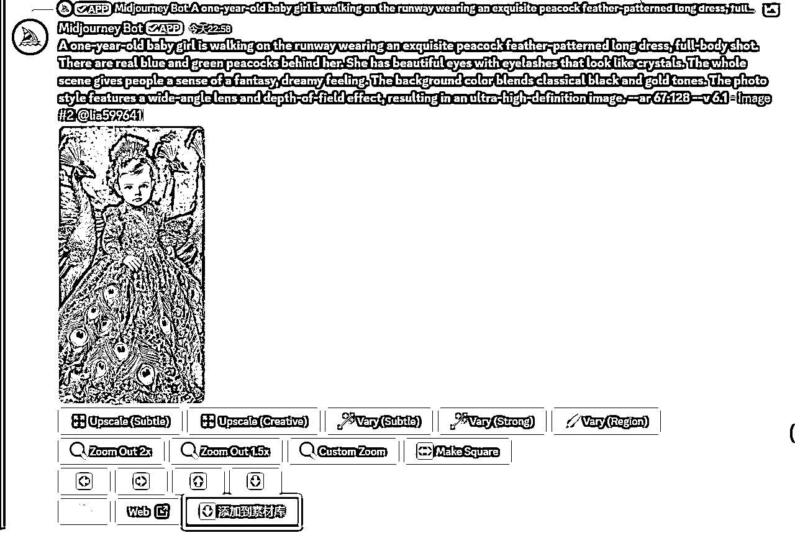

我们打开我们视频草稿的分镜页面，可以看到现刚刚mj生成的图片素材和提示词已经能自动添加到草稿箱了。

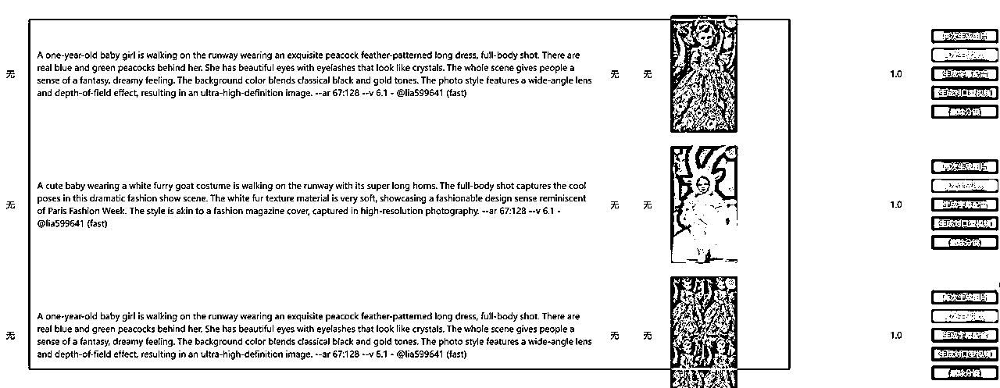

## 视频生成与剪辑

OK，到这就是后面的视频生成了。

首先是抛弃各种影刀方案，影刀这种东西奔且重，关键时你让他24小时跑他还偶尔会卡一下停一下，还要人关注，我不想把时间浪费在这种地方。所以这里直接使用Python原生实现。

首先是即梦的自动化

### 即梦

自动化流程很简单，核心代码就是下面这个

```
import asyncio
import logging
import sys
import re
import traceback
from typing import Optional, List
from playwright.async_api import Page, async_playwright
from bit_api import BitBrowser

class JiMengClient:
    """即梦视频生成客户端"""
    def __init__(self):
        self.logger = logging.getLogger(__name__)
        self.page: Optional[Page] = None 
        self.playwright = None
        self.browser = None

    async def initialize(self, browser_ws: str) -> None:
        """初始化Playwright浏览器"""
        try:
            self.logger.info(f"初始化 Playwright, ws地址: {browser_ws}")
            self.playwright = await async_playwright().start()

            self.browser = await self.playwright.chromium.connect_over_cdp(
                browser_ws,
                timeout=30000
            )

            default_context = self.browser.contexts[0]
            self.page = await default_context.new_page()
            self.logger.info("初始化完成")

        except Exception as e:
            error_msg = f"初始化失败: {str(e)}\n{traceback.format_exc()}"
            self.logger.error(error_msg)
            raise Exception(error_msg)

    async def close(self) -> None:
        """关闭浏览器资源"""
        try:
            if self.page:
                await self.page.close()
            if self.browser:
                await self.browser.close()
            if self.playwright:
                await self.playwright.stop()
        except Exception as e:
            self.logger.error(f"关闭资源时出错: {e}")
async def generate_video(ws_address: str, prompt: str, image_path: str) -> Optional[str]:
    """生成视频并返回视频ID"""
    client = None
    video_id = None

    try:
        client = JiMengClient()
        await client.initialize(ws_address)

        await client.page.goto("https://jimeng.jianying.com/ai-tool/video/generate", timeout=36000)
        await asyncio.sleep(2)

        if image_path:
            file_input = await client.page.wait_for_selector(
                'input[type="file"][accept="image/jpeg,image/jpg,image/png,image/bmp,image/webp,.jpeg,.jpg,.png,.bmp,.webp"]',
                state='attached'
            )
            await file_input.set_input_files(image_path)
            await asyncio.sleep(5)

        # 填写提示词
        textarea = await client.page.wait_for_selector('textarea.lv-textarea[class*="input-"]')
        await textarea.fill(prompt)
        await asyncio.sleep(2)

        # 等待生成接口响应
        response_future = client.page.wait_for_response(
            lambda response: "mweb/v1/generate_video" in response.url
        )

        # 点击生成按钮
        generate_button = await client.page.wait_for_selector('div.mweb-button-default[class*="mwebButton-"][class*="generateButton-"]')
        await generate_button.click()

        # 等待响应
        response = await response_future
        response_data = await response.json()

        if response_data.get('data', {}).get('aigc_data'):
            flow = response_data['data']['aigc_data']['task']['process_flows'][0]
            video_id = flow.get("history_id", "")
            logging.info(f"获取视频ID: {video_id}")

        return video_id

    except Exception as e:
        logging.error(f"生成视频时出错: {e}")
        return None
    finally:
        if client:
            await client.close()

async def create_video(image_path: str, video_prompt: str) -> Optional[str]:
    """创建视频主函数"""
    ws = "brwoser_socket_url"

    try:
        if sys.platform == 'win32':
            loop = asyncio.ProactorEventLoop()
            asyncio.set_event_loop(loop)
        return await generate_video(ws, video_prompt, image_path)
    except Exception as e:
        logging.error(f"创建视频失败: {e}")
        return None

if __name__ == '__main__':
    logging.basicConfig(level=logging.INFO)
    image_path = r"F:\shortvideos\images\comfyui\2024-11-13\ComfyUI_00537_.png"
    prompt = "move forward"
    asyncio.run(create_video(image_path, prompt))

```

这里注意我们一定要拿到对应的video_id用于本地的分镜关联和后续的视频下载，再点击生成视频的时候我们直接监听接口https://jimeng.jianying.com/mweb/v1/generate_video 等待提交成功，然后拿到data.get('aigc_data',{}).get('task',{}).get('process_flows',{}).get('history_id',{})，这个就是我们后面要和本地关联的唯一值，根据这个ID就可以获取到无水印视频地址，并且关联本地的分镜图片。

不得不说一下即梦生成的效率真的很高！！免费版本大概十几秒也能生成一个视频，和可灵免费版比起来真的很良心。另外我们直接通过源地址下载到方式不仅效率高，而且即使免费版也不会带水印，这个我后面写个即梦无水印下载的油猴脚本提供给大家。

接下来我们只要使用cursor 写一个数据映射，保存自己的指纹浏览器和即梦账号的关系、和保存图文提示词和即梦账号的关系；这样我们就可以实现多个账号的调度，

我直接用多个号开了五个指纹浏览器同步生成视频，这样每天可以薅积分大概生成80次左右的视频生成，对我来说足够了，毕竟现阶段我也没几个油管号，生成这么多视频也没啥用。如果能拿到的号多，开一百个也是没问题的，按照刚刚说的方法做好调度就行。

比如你有50个即梦账号，可以同时开启10个作为一轮进行生成，每轮每个账号提交五个任务，等第五轮生成提交之后再顺序下载前面的所有视频信息，这样大概一小时我们就可以生成10*5*5 = 250个视频。一个账号每天有免费的88积分，可以生成17个左右视频，我们走三个批次就可以，算下来不到3个小时就可以生成250*3 = 750个视频素材，剩下的单3走一轮这样就可以把17*50=850条生成额度用完。按抽卡算10个视频素材合成一个短视频的话我们也可以生成85个视频。

这样就实现了全自动的视频生成、下载和分镜头的关联。我们选好图片素材之后，隔一会看下分镜列表，所有的图片都有了对应的视频。

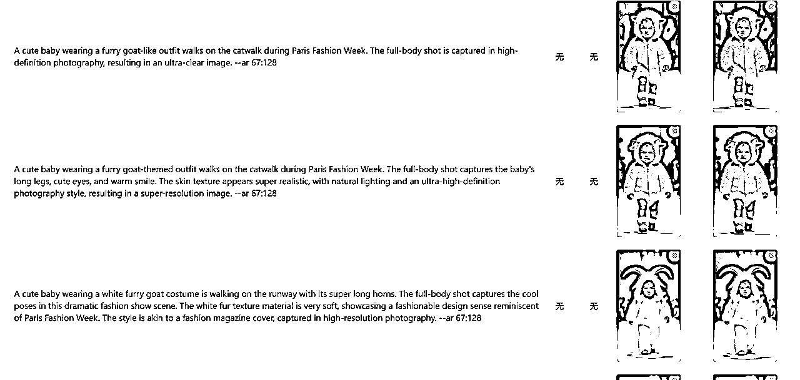

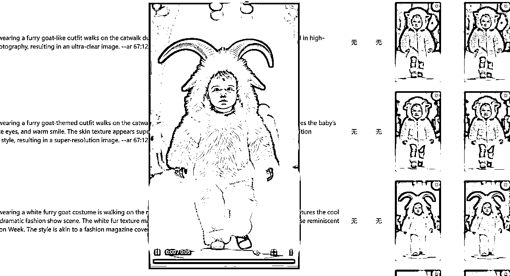

另外再分享个即梦无水印下载脚本，我们知道免费版即梦下载是无水印的，我写了个油猴脚本，直接在视频左上角加一个“无水印下载”，点击下载之后就是无水印的视频了：

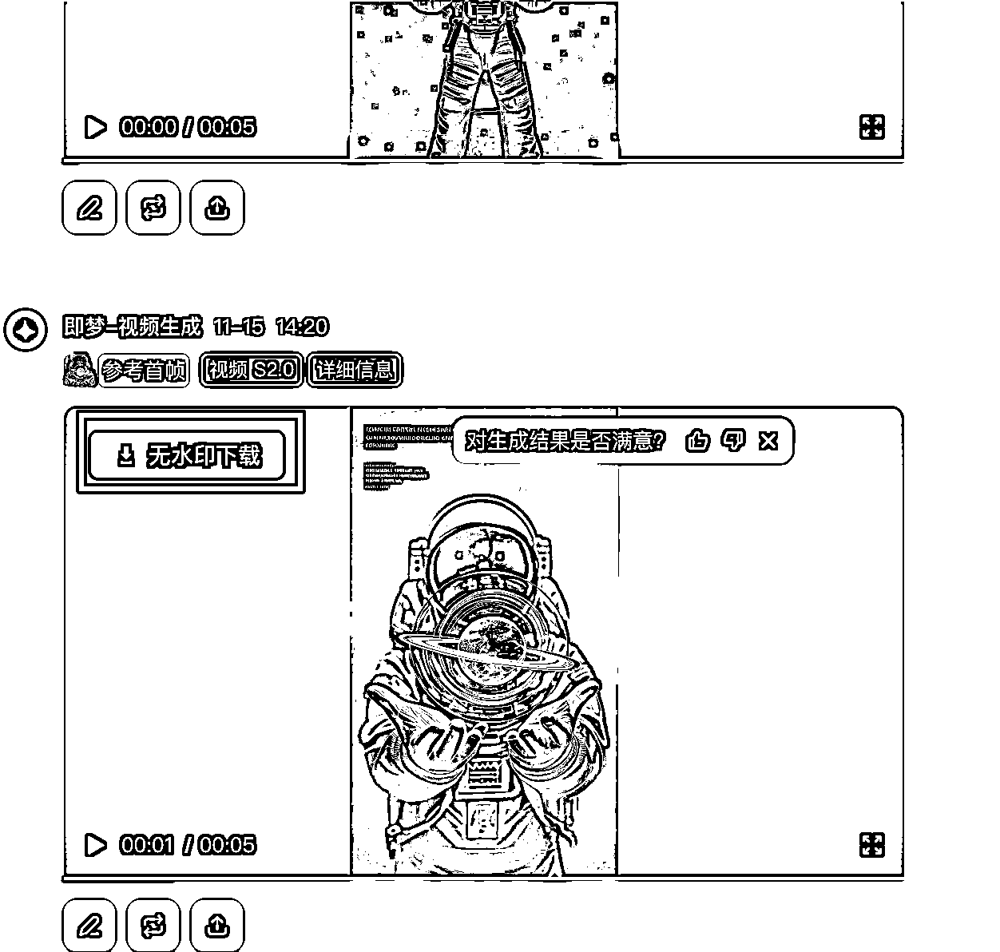

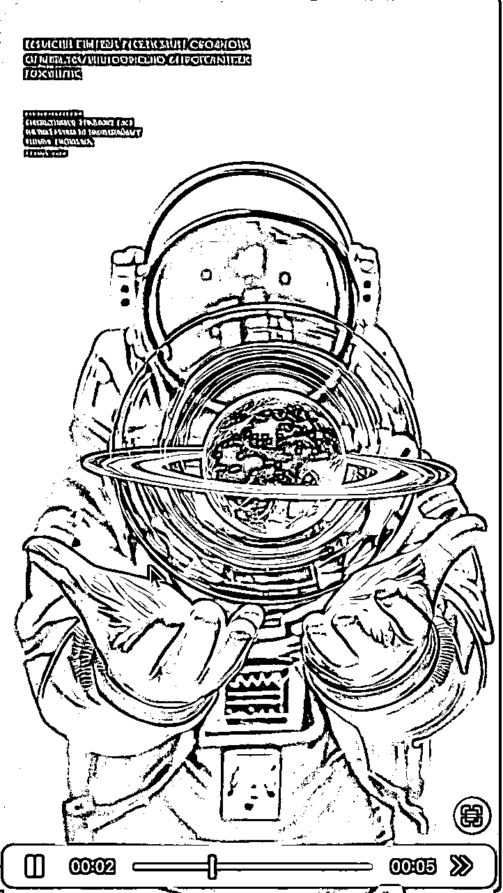

脚本如下：

```
// ==UserScript==
// @name         即梦无水印下载
// @namespace    http://tampermonkey.net/
// @version      2024-11-15
// @description  try to take over the world!
// @author       You
// @match        https://*.jianying.com/*
// @match        https://jimeng.jianying.com/*
// @icon         https://www.google.com/s2/favicons?sz=64&domain=jianying.com
// @grant        none
// ==/UserScript==

(function() {
    'use strict';

    // 添加下载按钮的样式
    const style = document.createElement('style');
    style.textContent = `
        .custom-download-btn-wrapper {
            position: absolute;
            top: 15px;
            left: 15px;
            z-index: 999999;
            pointer-events: auto;
        }
        .custom-download-btn {
            background: rgba(0, 0, 0, 0.75);
            color: white;
            border: none;
            padding: 8px 16px;
            border-radius: 6px;
            cursor: pointer;
            font-size: 14px;
            font-weight: 500;
            pointer-events: auto;
            display: flex;
            align-items: center;
            gap: 6px;
            transition: all 0.2s ease;
            backdrop-filter: blur(5px);
            box-shadow: 0 2px 8px rgba(0, 0, 0, 0.2);
        }
        .custom-download-btn:hover {
            background: rgba(0, 0, 0, 0.85);
            transform: translateY(-1px);
            box-shadow: 0 4px 12px rgba(0, 0, 0, 0.3);
        }
        .custom-download-btn:active {
            transform: translateY(0);
        }
        .custom-download-btn.downloading {
            background: rgba(0, 0, 0, 0.6);
            cursor: not-allowed;
        }
        .custom-download-btn svg {
            width: 16px;
            height: 16px;
            fill: currentColor;
        }
        @keyframes spin {
            to { transform: rotate(360deg); }
        }
        .loading-spinner {
            animation: spin 1s linear infinite;
        }
    `;
    document.head.appendChild(style);

    // 下载图标 SVG
    const downloadIcon = `

    `;

    // 加载中图标 SVG
    const loadingIcon = `

    `;

    function addDownloadButton() {
        const videoContainers = document.querySelectorAll('.videoWrapper-yY21WT');

        videoContainers.forEach(container => {
            if (container.querySelector('.custom-download-btn-wrapper')) return;

            const video = container.querySelector('video');
            if (!video) return;

            const wrapper = document.createElement('div');
            wrapper.className = 'custom-download-btn-wrapper';

            const downloadBtn = document.createElement('button');
            downloadBtn.className = 'custom-download-btn';
            downloadBtn.innerHTML = `${downloadIcon}无水印下载`;

            downloadBtn.onclick = async function(e) {
                e.preventDefault();
                e.stopPropagation();
                e.stopImmediatePropagation();

                const videoUrl = video.src;
                if (!videoUrl) {
                    alert('无法获取视频地址');
                    return;
                }

                try {
                    downloadBtn.classList.add('downloading');
                    downloadBtn.innerHTML = `${loadingIcon}下载中...`;
                    downloadBtn.disabled = true;

                    const response = await fetch(videoUrl);
                    const blob = await response.blob();

                    const url = window.URL.createObjectURL(blob);
                    const a = document.createElement('a');
                    a.href = url;
                    a.download = `video_${Date.now()}.mp4`;
                    document.body.appendChild(a);
                    a.click();

                    window.URL.revokeObjectURL(url);
                    document.body.removeChild(a);
                } catch (error) {
                    console.error('下载失败:', error);
                    alert('下载失败，请重试');
                } finally {
                    downloadBtn.classList.remove('downloading');
                    downloadBtn.innerHTML = `${downloadIcon}无水印下载`;
                    downloadBtn.disabled = false;
                }

                return false;
            };

            wrapper.appendChild(downloadBtn);

            const controlsContainer = container.querySelector('.videoCustomControlSlotWrapper-uFXNzG') || container;
            controlsContainer.appendChild(wrapper);
        });
    }

    function checkAndAddButton() {
        addDownloadButton();
        setTimeout(checkAndAddButton, 2000);
    }

    setTimeout(() => {
        checkAndAddButton();
    }, 1500);

    const observer = new MutationObserver(() => {
        addDownloadButton();
    });

    observer.observe(document.body, {
        childList: true,
        subtree: true
    });
})();

```

### 海螺自动化

下面就是海螺了，大同小异，海螺有个亮点，就是第一天他是不限量的，美滋滋。测试的时候我在闲鱼买了个VIP账号，体验下来视频生成的效果比即梦好一点，但是成本也高，作为一个目前还没从油管挣到钱的人来说，体验会员过期后还是先不续费了。

海螺的自动化核心代码如下：

```
import asyncio
import logging
import traceback
from typing import Optional
from playwright.async_api import Page, async_playwright, Browser, Playwright

# 常量配置
CONFIG = {
    'BASE_URL': "https://hailuoai.video/",
    'TIMEOUTS': {
        'VIDEO': 300,
        'PAGE': 36000,
        'NETWORK': 30000
    },
    'WAITS': {
        'INTERVAL': 2,
        'IMAGE_UPLOAD': 15
    }
}

class HailuoClient:
    """海螺视频客户端"""

    def __init__(self):
        self.logger = logging.getLogger(__name__)
        self.page = self.browser = self.playwright = None
        self.video_id = None
        self.video_generated_event = asyncio.Event()

    async def initialize(self, browser_ws: str) -> None:
        """初始化浏览器连接"""
        try:
            self.playwright = await async_playwright().start()
            self.browser = await self.playwright.chromium.connect_over_cdp(
                browser_ws,
                timeout=CONFIG['TIMEOUTS']['NETWORK']
            )
            self.page = await self.browser.contexts[0].new_page()
            await self._setup_network_listener()
        except Exception as e:
            await self.close()
            raise Exception(f"初始化失败: {str(e)}")

    async def _setup_network_listener(self):
        """设置网络监听"""
        async def on_response(response):
            try:
                if "generate/video" in response.url:
                    data = await response.json()
                    if video_id := data.get('data', {}).get('id'):
                        self.video_id = video_id
                        self.video_generated_event.set()
            except Exception:
                pass
        self.page.on("response", on_response)

    async def check_queue_status(self) -> bool:
        """检查队列状态"""
        for selector in ['//*[contains(text(), "jobs in queue")]', 'text=/jobs in queue/']:
            try:
                if element := await self.page.wait_for_selector(selector, timeout=5000):
                    if text := await element.text_content():
                        return not any(int(n) >= 5 for n in text.split() if n.isdigit())
            except Exception:
                continue
        return True

    async def generate_video(self, prompt: str, image_path: Optional[str] = None) -> None:
        """生成视频"""
        await self.page.goto(CONFIG['BASE_URL'], timeout=CONFIG['TIMEOUTS']['PAGE'])
        await asyncio.sleep(CONFIG['WAITS']['INTERVAL'])

        # 切换到Mine标签
        await (await self.page.wait_for_selector('div[role="tab"][aria-controls="rc-tabs-0-panel-mine"]')).click()

        if prompt == 'NO_PROMPT':
            return

        if not await self.check_queue_status():
            return

        # 输入提示词和上传图片
        await (await self.page.wait_for_selector('textarea.ant-input.css-o72qen')).fill(prompt)

        if image_path:
            await self._upload_image(image_path)

        await (await self.page.wait_for_selector('div.create-btn-container div.create-btn')).click()

        try:
            await asyncio.wait_for(
                self.video_generated_event.wait(), 
                timeout=CONFIG['TIMEOUTS']['VIDEO']
            )
        except asyncio.TimeoutError:
            self.logger.error("视频生成超时")

    async def _upload_image(self, image_path: str) -> None:
        """上传图片"""
        await (await self.page.wait_for_selector('div.relative.cursor-pointer.group')).click()
        await asyncio.sleep(CONFIG['WAITS']['INTERVAL'])

        upload_btn = await self.page.wait_for_selector('div.ant-upload.ant-upload-select')
        async with self.page.expect_file_chooser() as fc:
            await upload_btn.click()
            await (await fc.value).set_files(image_path)
        await asyncio.sleep(CONFIG['WAITS']['IMAGE_UPLOAD'])

    async def close(self) -> None:
        """关闭资源"""
        for resource in [self.page, self.browser, self.playwright]:
            if resource:
                try:
                    await resource.close()
                except Exception:
                    pass
        self.page = self.browser = self.playwright = None

async def process_video(ws_address: str, prompt: str, image_path: Optional[str] = None) -> Optional[str]:
    """处理视频生成流程"""
    client = HailuoClient()
    try:
        await client.initialize(ws_address)
        await client.generate_video(prompt, image_path)
        return client.video_id
    except Exception as e:
        logging.error(f"处理失败: {e}")
        return None
    finally:
        await client.close()

if __name__ == '__main__':
    disable_resource_warnings()
    asyncio.run(hailuo_video(r"F:\shortvideos\images\comfyui\2024-11-10\1725888666.jpg","a colourful furry animal"))

```

接下来我们就看到所有视频都完成了，这里为了排序我又加了个排序，方便控制自动化剪辑时候的顺序。

视频剪辑走了点弯路，一些简单视频的剪辑，比如萌宠唱歌跳舞走秀这种，其实也没啥剧情，用不到字幕和各种特效，但是我一来就选择了剪映自动化，剪映我们也知道，整体操作比较复杂，影刀肯定是不行的，好在剪映6.0版本前我们可以操作draft_content.json 和 draft_mate_info.json，这俩JSON一个控制素材库，一个控制时间线，只要操作这俩JSON就可以实现自动生成草稿，最后用uiautomation 自动化导出视频就行了。但是做到最后我突然发现，有点杀鸡用牛刀了，我现在就是抄个对标，复刻个视频而已，也还没加剧情呢，就直接转头用Python自己写一个视频合成，实现的功能只要有：多视频自动拼接，加BGM、音量淡入淡出、裁剪导出就行了，剪映就留着后面剧情号或者更加复杂的剪辑的时候再用吧。

自动剪辑的核心代码就是下面这个了，根据前面筛选好的视频路径和草稿指定的BGM，自动导出合成好的视频，效果就是下面这样：

```
from dataclasses import dataclass
from typing import List, Optional
from pathlib import Path
import logging
from contextlib import contextmanager
from moviepy.editor import VideoFileClip, concatenate_videoclips, AudioFileClip, concatenate_audioclips

# 配置日志
logging.basicConfig(
    level=logging.INFO,
    format='%(asctime)s - %(levelname)s - %(message)s'
)
logger = logging.getLogger(__name__)

class VideoProcessingError(Exception):
    """视频处理相关的自定义异常"""
    pass

@dataclass
class VideoConfig:
    """视频处理配置类"""
    video_codec: str = 'libx264'
    audio_codec: str = 'aac'
    temp_audio: str = 'temp-audio.m4a'
    bgm_volume: float = 0.3

class VideoProcessor:
    """视频处理器类"""

    def __init__(self, config: Optional[VideoConfig] = None):
        self.config = config or VideoConfig()
        self._clips = []

    @contextmanager
    def _manage_resources(self):
        """资源管理器，确保所有clip都被正确关闭"""
        try:
            yield
        finally:
            for clip in self._clips:
                try:
                    clip.close()
                except Exception as e:
                    logger.warning(f"关闭clip时出错: {e}")
            self._clips.clear()

    def _load_video_clips(self, video_paths: List[Path]) -> List[VideoFileClip]:
        """加载视频片段"""
        clips = []
        for path in video_paths:
            try:
                clip = VideoFileClip(str(path))
                clips.append(clip)
                self._clips.append(clip)
            except Exception as e:
                logger.error(f"加载视频 {path} 时出错: {e}")

        if not clips:
            raise VideoProcessingError("没有有效的视频片段可以合并")
        return clips

    def _process_bgm(self, bgm_path: Path, video_duration: float) -> Optional[AudioFileClip]:
        """处理背景音乐"""
        if not bgm_path.exists():
            logger.warning(f"背景音乐文件不存在: {bgm_path}")
            return None

        try:
            bgm = AudioFileClip(str(bgm_path))
            self._clips.append(bgm)

            if video_duration > bgm.duration:
                repeats = int(video_duration / bgm.duration) + 1
                extended_bgm = concatenate_audioclips([bgm] * repeats)
                bgm = extended_bgm.subclip(0, video_duration)
            else:
                bgm = bgm.subclip(0, video_duration)

            return bgm.volumex(self.config.bgm_volume)
        except Exception as e:
            logger.error(f"处理背景音乐时出错: {e}")
            return None

    def merge_videos(self, 
                    video_paths: List[str], 
                    bgm_path: Optional[str], 
                    output_path: str) -> bool:
        """
        合并多个视频并添加背景音乐

        Args:
            video_paths: 视频文件路径列表
            bgm_path: 背景音乐文件路径
            output_path: 输出文件路径

        Returns:
            bool: 处理是否成功
        """
        try:
            with self._manage_resources():
                # 转换路径
                video_paths = [Path(p) for p in video_paths]
                bgm_path = Path(bgm_path) if bgm_path else None
                output_path = Path(output_path)

                # 加载并合并视频
                clips = self._load_video_clips(video_paths)
                final_clip = concatenate_videoclips(clips)
                self._clips.append(final_clip)

                # 处理背景音乐
                if bgm_path:
                    bgm = self._process_bgm(bgm_path, final_clip.duration)
                    if bgm:
                        final_clip = final_clip.set_audio(bgm)

                # 导出视频
                final_clip.write_videofile(
                    str(output_path),
                    codec=self.config.video_codec,
                    audio_codec=self.config.audio_codec,
                    temp_audiofile=self.config.temp_audio,
                    remove_temp=True
                )

                logger.info("视频合并成功")
                return True

        except VideoProcessingError as e:
            logger.error(f"视频处理错误: {e}")
        except Exception as e:
            logger.error(f"未预期的错误: {e}", exc_info=True)

        return False

def test_main():
    """主函数"""
    # 示例配置
    config = VideoConfig(
        video_codec='libx264',
        audio_codec='aac',
        temp_audio='temp-audio.m4a',
        bgm_volume=0.3
    )

    # 视频处理器
    processor = VideoProcessor(config)

    # 视频文件路径
    videos = [
        "C:\\Users\\pc\\Downloads\\19\\311590906934300676 (1).mp4",
        "C:\\Users\\pc\\Downloads\\19\\311590906934300676.mp4"
    ]

    # 背景音乐路径
    bgm = ""

    # 输出文件路径
    output = "output.mp4"

    # 执行合并
    success = processor.merge_videos(videos, bgm, output)
    if success:
        logger.info("视频合并完成！")
    else:
        logger.error("视频合并失败！")

if __name__ == "__main__":
    main()

```

视频导出完了就是发布了，因为我在创建项目的时候就选择了账号，这里每个浏览器我也绑定了对应的谷歌账号，理论上是无上限的，只要能买的起IP，绑定一千个账号也行，因为我实测下来发现，上传一个视频外加统计也就是一两分钟，同时并行10个很轻松，也就是说一两千个账号也就是一小时就能发完。当然了我们也能用API发布，但是还得申请KEY，况且我也不确定API发布的会不会对推荐权重有影响，那就直接代码实现吧，完全模拟人工，这样排除一切因素，如果还起不来号还容易做控制变量排除。

# 剧情号复刻

目前整体功能实现了，但是重点还是AI生成的对标视频，没有花精力在剧情这。如果我哪一天我的号能跑通开通ypp，估计就会重点放到自动化实现人物一致性的剧情生成这块了。

另外剧情好剪辑的时候要加字幕、特效等等，就要用到我们刚刚说的剪映自动化了，同属于技术上没难度，关键是创意了。

本来还打算分享下包括采集和矩阵发布的全流程的，但是写到这发现内容已经够多了，大家看的如果有帮助的话，我后面会继续分享采集和发布和数据统计这块的实现过程。比如过百个账号如何管理，多账号如何中心化统计数据，如何查看自己发布的所有历史视频观看量的日志审计和可视化趋势分析；以及我们在很早之前的找对标的那篇文章中我分享了一万个AI视频相关的账号，那我们如何小时级甚至分钟级别监控重点对标账户的发布情况呢？能不能对标账号一发布我们后台立刻自动化进行素材拆解和视频生成？或者如何批量复刻视频并微调风格？还有比如我之前记录了我是如何快速采集了一万条对标账号的，但是更大量的视频监控和热点分析呢，之前介绍的采集方式效率还是太慢了，我们如何单机低成本地实现每天百万甚至千万级视频的采集和数据更新？这些借助cursor我们都很容易实现。如果大家感兴趣后面我们慢慢分享。