# 低价高转，如何使用小报童实现流量暴涨？

> 来源：[https://cxqeimz77vr.feishu.cn/docx/EVfXdZVJho6lzExVFRYcoP4Snhh](https://cxqeimz77vr.feishu.cn/docx/EVfXdZVJho6lzExVFRYcoP4Snhh)

各位圈友大家好！

我是饭饭，目前精耕于AI代写&电商

热销小报童AI代写小报童在作者，目前订阅人数超过7600人

记得刚加入生财的时候是目标能够突破卡点，达到年入50w以上的目标，现在已经达到目标。通过AI代写小报童的发售，我自己的AI代写付费学员近400人，5个天猫店主，目前闲鱼矩阵账号50+，生财有术航海家，曾经通过加入生财赚回50倍门票，目前团队通过AI代写年产约500w。

以下是我的低价高转，如何用小报童实现流量暴涨策略，看完有用记得点赞交流，方法论如下：

# 1.实战经验

我属于跌跌撞撞、持续实干的这么一个角色，

因为我之前做实体店没赚到钱，亏钱踏入谷底，负债后转型做线上电商，后面深耕AI代写电商，实现了单点突破。

我加AI 的时间不算早，但是我愿意放极大的精力进去。很幸运的是通过我的生财贵人靠谱老师推荐，加入了生财，在生财认识了很多圈友，在生财的风向标了解到GPT的信息，在最初就开始拥抱AI，持续的把项目放大。

给大家看一下，在2024年的2月18-3月18，我的团队实现了单月营收破 20w，第一次取得这样的成绩，在2024年的4月，团队通过AI代写单月营收破30w，然后一路高歌猛进，发售的一个小报童专栏【AI代写】更是突破了7000+的订阅！

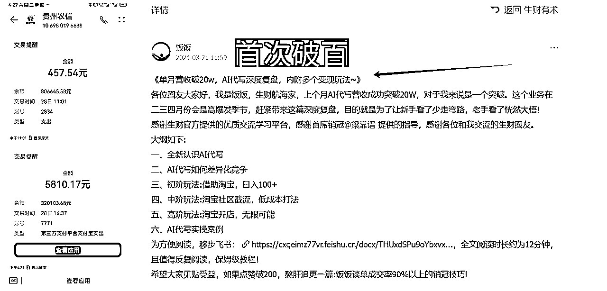

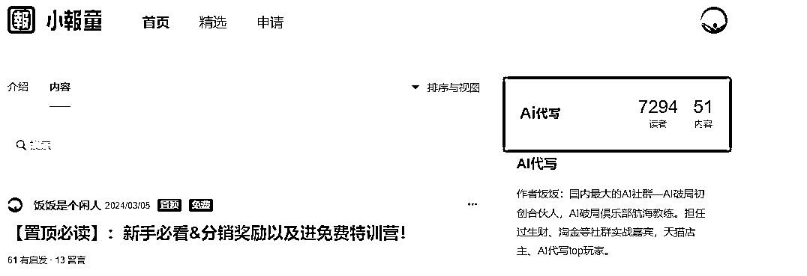

这里重点给大家分享一下我是如何通过小报童实现低转高的经验。通过看完分享，大家会掌握一些用优质的低单价产品来实现高转换的链路。

# 2.小报童的底层逻辑与流量杠杆

## 1）什么是小报童？

小报童是一个付费内容服务，目前圈内比较火的小ip冷启动，流量低转高的工具，类似这种能够实现低价高转的还有很多工具、例如知识星球、墨问便签、陪伴群等等，这里结合实战经验，给大家做一下分享。

小报童有两种付费模式：

订阅制模式（适合和读者建立长期联系）

买断制模式（适合把知识广泛持续传播）

目前较火的就是圈内不少圈友可以通过小报童来撬动自己的ip杠杆，在短时间内积累自己的第一波付费用户，产生影响力，顺利破圈。

小报童可以理解为一种“试水”产品。核心是低价吸引，逐步拉升价值。比方说：我提供一份“10元的AI代写变现手册”，就可以让用户通过低风险的成本就能体验我的服务和课程内容。这种方式可以快速让用户进入你世界的入口，将自己的知识和经验，转化为用户价值、口碑效应和流量的增长。

## 2）打造你的“拳头内容”

想清楚一个问题，或许大家的私域都能更上一层楼！那就是“核心内容决定用户留存，爆款内容才能促成裂变。”

在创作小报童内容时，要牢记这一点：小报童的内容不能敷衍了事。虽然定价低，但质量一定要高，这会直接影响用户的购买意愿和复购率。目前很多圈友在写小报童的内容的时候是用AI直接来写，非常缺乏实操性，这也是导致小报童不能大卖的原因之一。

一份优质的小报童应该是具有独特性、实用性和可操作性，让用户感受到实实在在的价值，让用户看到成果，这是他们自愿为你买单的理由。现在的消费者都很聪明，大家都能区分有没有用心做内容，拳头内容不仅是留存用户的根本，而且是让他们心甘情愿成为你口碑传播者的关键，优质的内容是最容易产生增量的。

## 3）定价定位

记住一个关键点，小报童产品必须是轻量、实用、高价值的。

举个例子：我当时在选择AI代写小报童的时候是因为目前还没有这个相关的小册，而且我自己就是做这个赛道。其他内容创作者并没有覆盖到这个细分领域，我能够提供一些独家视角和和我自己的想法。例如代写的提示词的构建方法、直接上手的AI工具使用技巧、厉害的接单方法等等等。

在各大社群做代写的教练也积累了非常多小白会遇见的问题。结合代写这个赛道的淡旺季，我选择了旺季发布，这样能够在需求最大的时候实现小册的爆发式增长。

一个优秀的专栏离不开明确的定位，定位的方法有许多种，目前能看到大家有几种定位方式：

第1种：以专业思考为主：如关于产品设计、跨境电商、投资、AI代写、公文写作、电影等领域等

第2种：以个人成长为主：如个人在职场的成长、个人心理的成长、创业路上的经历分享等

第3种:以精选信息为主：如分享读书的摘录与思考、播客内容精选、阅读文章推荐等

掌握各种方式以后，根据自己的情况去选择专栏，设计产品，设计转化链路。

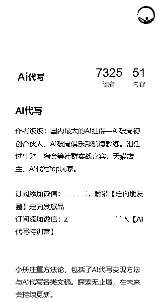

## 4）低价为什么能带来高转化？

在用户心理上，小金额能有效降低决策阻力，因为人们更容易花小钱试一试。低价高质，就是引导用户对你的信任入口，同时也给他们一种“先赚到”的感觉。目前我的理解小报童就是获取付费用户的低转高的引流产品，靠卖小册的话也很难去赚到多少钱，从最开始的定价10元，到后面的涨价到29.9元，在小册的售卖上属于不赚钱的状态，但是我增长了大量的私域用户，后端的高价产品整体变现超过了60w元。

比如，我刚开始内测阶段定价10元的AI代写小报童，即便用户有些犹豫，但也不觉得有损失，因为价格还不如一杯奶茶的费用，反而可能因为内容好而产生惊喜，达到继续跟进的效果。最开始有不少人通过分销的kol的朋友圈购买了我的小报童，但是没有添加我的微信，过后我在持续更新内容的过程中也有大量的好友因为追更内容主动通过小报童添加过来。

价格弹性越高的产品，低价策略越有效。所以目前市场上大部分小报童的定价都是10元，因为十元是官方指导的最低价格了。虽然是10元小册，但是一定要物超所值，小册千篇一律，内容质量一定要好！可以给大家看一下我小册的小部分目录，都是我这边在做AI代写获客的方法论，实干且有效，通俗易懂且稀缺的方法论也是我这边大卖的主要原因。

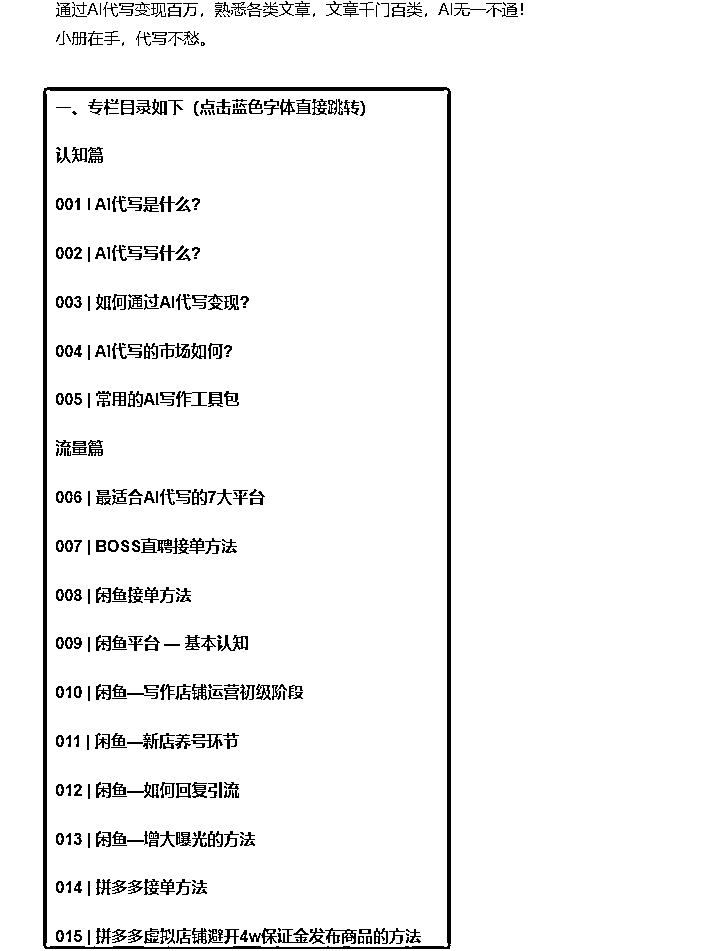

低价策略只是吸引用户的第一步，真正能留住他们的是内容的质量。我在做这个小报童的时候每一个专栏我都会去精心编写，从AI工具讲解到AI工具使用，从写作技巧到实用模板、从平台获客到客户交付，每一个细节都力求完善。内容为王，提供真正有价值的内容，用户低价的“试水”背后是高价值和精心策划，目的是让用户“赚到了” 。

# 3、小报童产品的四步走

### 1）精准定位，找到需求

想要小报童大卖，当然得知道用户到底在找什么、缺什么。用户的需求才是痛点明确、渴望解决的内容。定位越准，转化率越高。

关于定位,最好是结合自己的专业知识或者业务经验或者兴趣爱好等等，去发现市场的需求、解决市场的痛点，完成精准的定位。我在选择AI代写的时候是因为我自己的业务爆发式的增长。有句话是这样说的“未来已来，只是尚未分布均匀”，在使用AI写文的过程中，我深刻的感受到了。因为AI的出现，一年的时间我通过AI代写实现了年入百万，熟练的掌握了AI代写这个赛道。

在自己不断实操AI代写变现的同时，也向不少朋友分享了AI代写文章的技巧，在我的理解中，AI完成可以充当一个万能的文字助手，所有的文字需求，都可以让AI完成。

这个小册非常全面，必然会成为订阅数破千的小爆品。而且当时有洋哥和破局合伙人的支持，我的信息就非常足，我定位小册就是给出流量获取的方法论，文章写作的实干路径，符合了营销的策略，营销不应该是「你看着我，我很棒」，而是「我理解你的需求，这是我们给你的解决方案」，而我的确给出了AI代写邻域的解决方案。

### 2）内容必须物超所值

小报童内容建议要开门见山、有用、有思考，让花钱订阅的用户产生“超值”的感觉。写写内容的时候不要假大空，其实现在的信息差很容易打破的。各种实操手册、保姆级教程、各种学习资料等等都已经到处都是了，大部分人都已经知识过载，精力有限，大部分信息都是需要筛选的，哪怕是10元的小报童依旧如此，真正意向购买的人，买的不是便宜，而是效率。

### 3）附加福利、激发口碑效应

之前大部分人在设计小报童产品的时候采用的是“订阅小报童，送交流群”的策略，最开始的时候还有点效果，但是后面我发现这种交流群的意义不是很大，渐渐的就沦为“死群”，达不到运营的效果，流量是一次吸引，但私域是多次经营。

所以我后面在附加福利的设计上面增加了一个为期5天的特训营，课程的设计参考破局合伙人水龙大佬的发售策略，这种轻量短期的特训营主要目的就是达到一种“陪伴式”的效果。其实现在很多人购买知识付费产品，为的不是有一个课程或者有一个实操手册，很多用户想要的是一种“陪伴”。有人陪伴一起做同一个项目、遇见不懂的有人咨询、需要圈子，需要氛围而已。这种短频快的训练营效果很好，激活了不少之前的老用户而且给我带来了200+的自发用户推荐的增长，这个数据算是不错的。

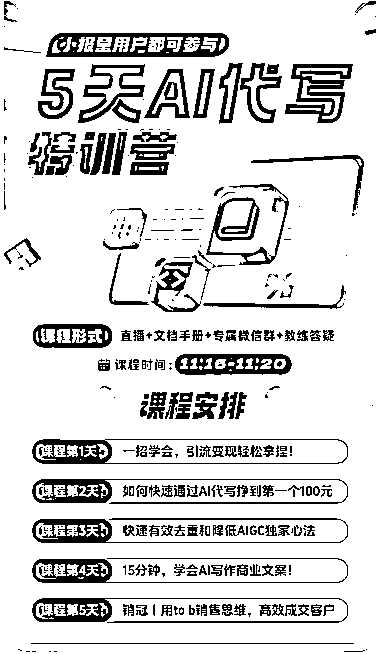

当用户感受到小报童的超值以后，很多人会愿意自发地推荐给身边的朋友。在互联网上知识付费，不管金额的大小，按照“社会认同”的原则来看，人们更倾向于相信其他人的选择，这也是为什么各位做私域的大佬都在不停的做裂变、做发售。先搞定第一波用户，给出超预期的交付，会迎来第二波、第三波甚至更多的用户。口碑效应一但开始显现，订阅人数如滚雪球般迅速增长。

### 4）物料准备

提前准备好分销权益、分销文案、分销海报、分销奖励红包、分销说明、小册目录导图等等。

因为小报童一但开始发售，必然会有不少用户加过来，如果准备的不齐全的话就浪费了很多种子用户，浪费了后面的裂变机会。

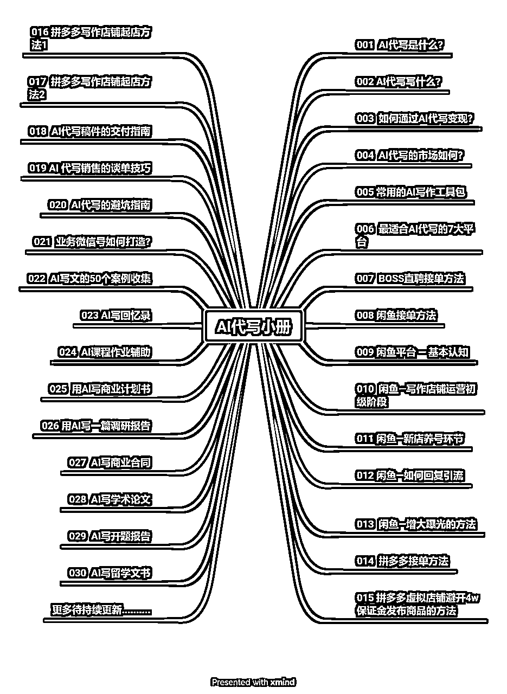

# 3.精益求精，蓄势待发

做好初期准备以后就开始邀约各大kol，梳理自己身边可以参与到分销大军的好友，然后提前邀请，给足大佬尊重和时间考虑，大佬才会带你玩。

### 1）确定分销权益

奖励机制很关键，现金+虚拟产品（可以是课程，可以是社群福利、书籍或者名片曝光等等），绝大部分来参与分下的小伙伴都会对“曝光”这个奖励很感兴趣，建议大家都可以做，如果自己的流量不是很大，可以联合几个朋友来做曝光推荐流量，当用户感到有利可图，裂变传播的效果会成倍增加。这是我设计的分销权益，可以提供给大家参考一下。

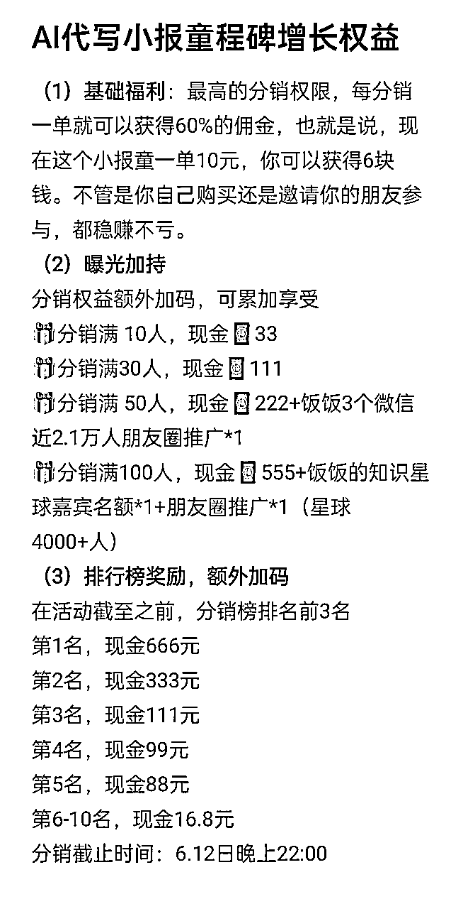

### 2）定向邀请kol

这个环节非常重要，提前邀请到有影响力的大佬。小报童的发售第一波很关键，要达到单日破千的订阅的效果会更容易冲击到高订阅，同样的遵循28定律。百分之八十的订阅用户都是百分之二十的大佬带动起来的。

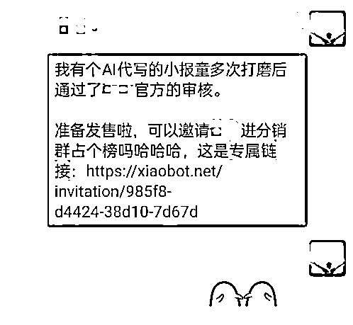

### 3）轰轰烈烈，浪潮式发售

邀请到大佬以后迅速带头在朋友圈、公众号或者星球等私域平台带头发产品，大力推小报童，形成朋友圈刷屏的效果，多发多带动氛围，邀请更多的参与者来分销，形成朋友圈刷屏现象，会让很多用户觉得你的势能大，喜欢和你做朋友，参与到你的小报童支持的队伍里面。

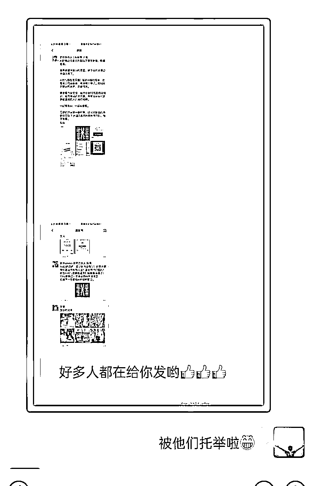

### 4）做好接待

在小报童发售以后会有很多人加到微信好友，目前看见身边朋友发售小报童有一个很好的工具，就是“RPA”可以做到自动同意好友和拉群的环节，极大的提高了效率，我就踩坑在这个环节，大批量的好友添加过来以后微信添加频繁、人工同意好友、人工打标签等等，都耗费了比较多的时间。在发售之前提前准备好承接流量的微信，微信号每天能够被动添加约180人，根据自己的流量预测来做好微信号准备。而且需要把微信的权限设置给改一下

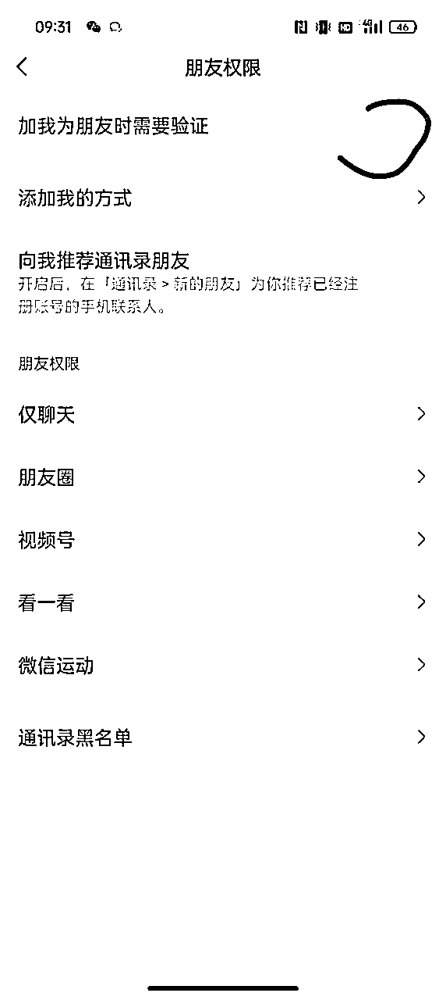

### 5）顺势裂变

如果本身小报童的质量不错的话，在订阅了小报童的这部分用户，很多人是愿意参与到分销的队伍里面来的。在嫁过来的时候顺势而为，遵循意见，留下钩子，邀请分销。

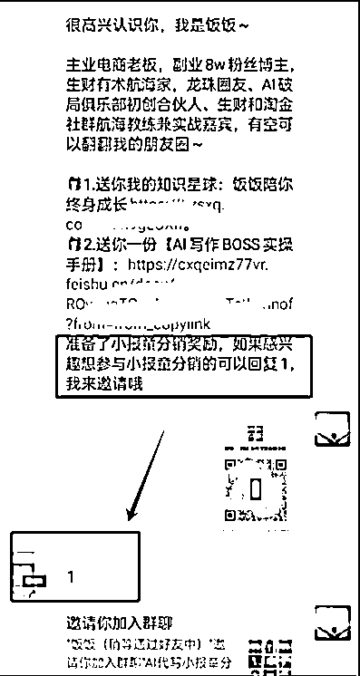

### 6）分销群保持活跃

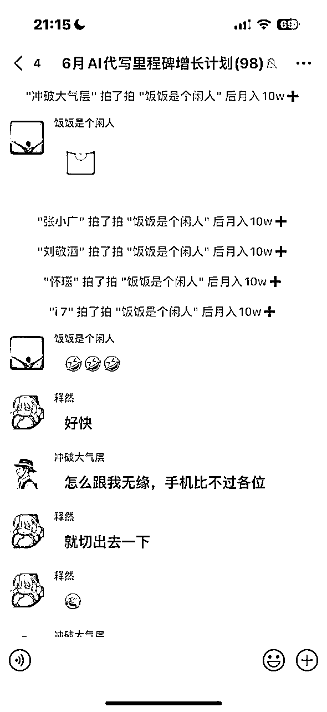

### 7）榜单前三保持神秘

这个很关键，每个参与分销的小伙伴都是有不同的圈子，影响力和好友基数不一样，分销的数据就会不一样。

如果是普通的小伙伴参与，肯定竞争不过大v的，如果看见一直都是大佬在占榜，那素人就没有兴趣参与分销了。这种情况就要考虑到给素人冲榜的机会。两种方案，要么给大佬单独额外的奖励，不参与榜单是的分销奖励，要么可以和我一样，隐藏榜单，给大家留点悬念，持续冲榜。

这样素人小伙伴也可以有人冲破上百单的分销数据的。

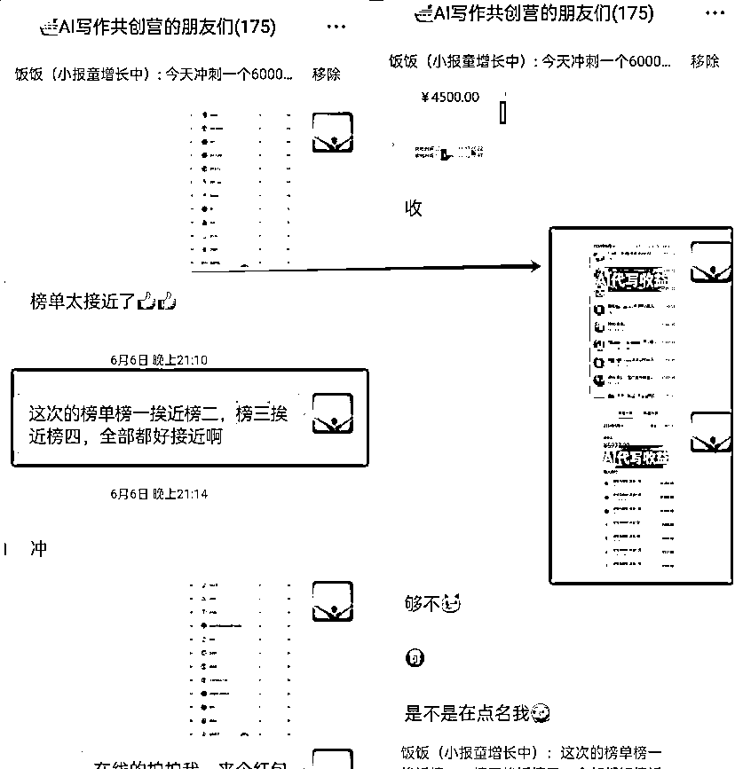

### 8）及时更新榜单

保持每天更新榜单的频率，只要设置了不错的分销奖励，每天引导参与分销的朋友在群里报喜或者分享出单经历。

然后及时的分享每天的榜单数据，每天更新榜单可以带动各位分销的伙伴参与到其中，感受到大家都在为你的小报童去冲刺。

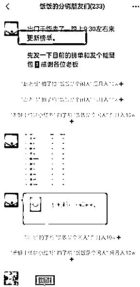

# 4\. 流量闭环：从低价到高价的转化路径

发售的承接与转化是很关键的环节了，要想用户留存你就得给用户提供价值和帮助呀。

我们得设计好钩子，让他们愿意加入我们的私域流量池，加到微信或者加到社群或者加到星球，然后多层级产品阶梯，从试水产品到深度转化。

例如：第一步是10元入门小报童，然后根据自己的产品价值和团队的交付能力，设计不同的阶梯产品，我自己在产品的设计方面就是从小报童→共创营→私教的模式。

设计“10元→980元→4980元”的产品阶梯，主要是为了满足不同阶段用户的需求，但是我实操过后我觉得产品阶梯还是不宜过多，直接两个阶梯是最适合的。

### 1）小报童介绍海报引流

其实小报童的订阅并不是终点，而是一个起点。很大一部分人订阅了小报童，但是他未必会主动添加到你的微信，真正的流量暴涨需要你在用户进入后进行闭环转化的，那如何让订阅用户添加到你的微信？

这就很关键！

在小报童的介绍海报上，直接留下我们的微信号，并附上一个领取资料包的福利。这个方式简单直接，用户很容易就会添加微信来领取资料。多次测试以后发现了两个效果较佳的方式。

一是进交流群

二是解锁定向朋友圈

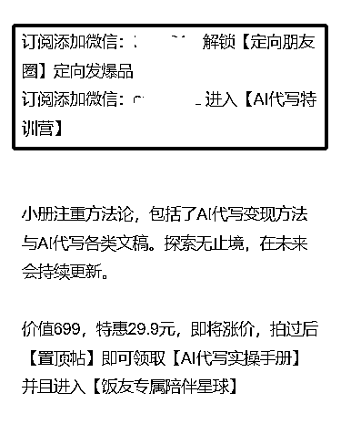

### 2）价值软文需求植入

在每篇文章的结尾自然植入需求引导，例如“如果你在AI代写过程中遇到XX问题，可以随时和我交流，或者加入我们的知识星球讨论”，同时附上公众号文章的链接和软文介绍，一切关系都建立在信任之上，持续价值输出是最好的信任维护，也是最好的吸引。

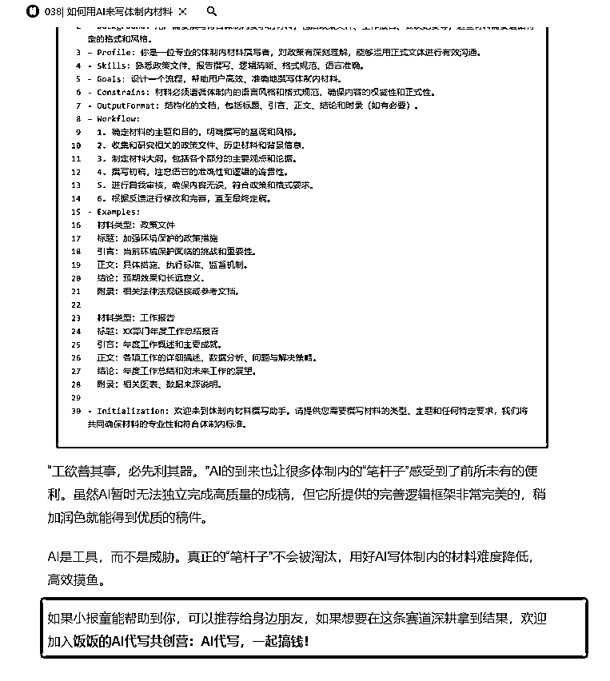

### 3）发售裂变

这个环节就是准备发售群，然后发售产品的环节了。一定要保证自己的产品优质且超预期交付。开始邀请用户进入发售群，实现用户基数的快速扩展，达成裂变。尽可能的将订阅小报童的用户都加入到自己的社群里面了，有交流有分享，达成一个好的氛围。

小报童产品在短时间内可能看不到巨大的利润回报，但它的真正价值在于通过低价引流搭建一个用户池，可以为后续产品构建一个强劲的后援团。

以上实操下来就很好的形成了一个完整的闭环，通过小报童的准备，发售，形成自己的基础流量。

希望大家有所收获，不断涨粉，财富暴涨！

以上我的经验分享，欢迎大家链接~