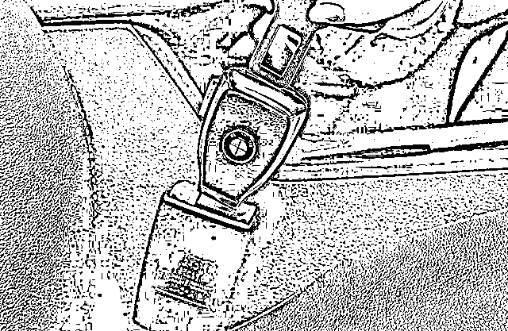
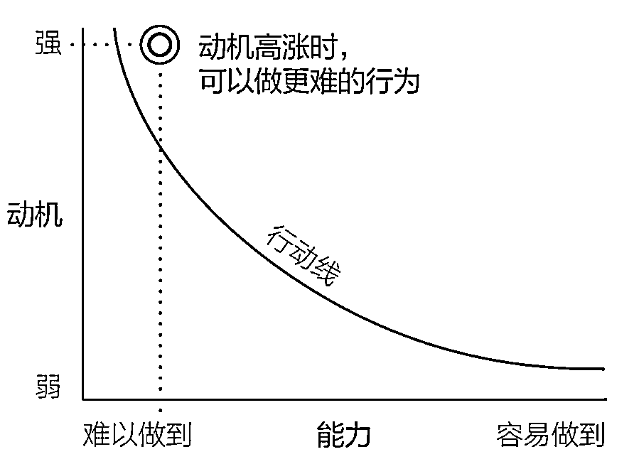
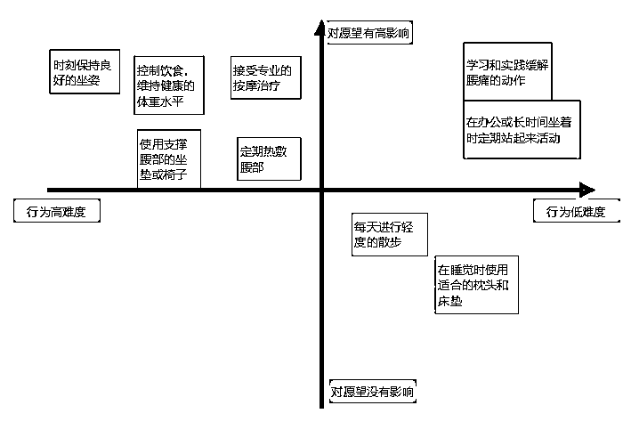
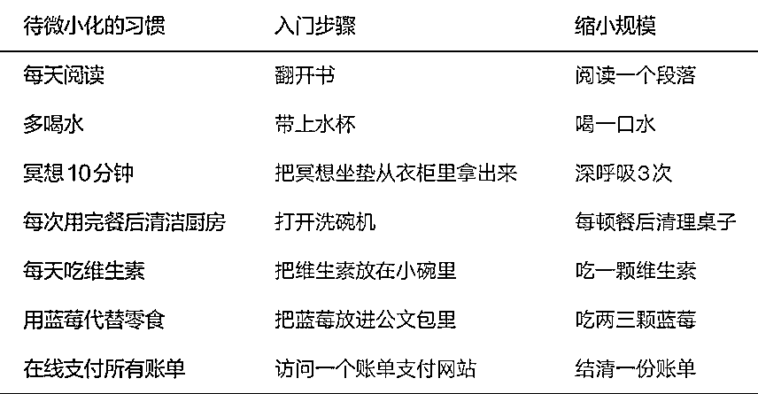
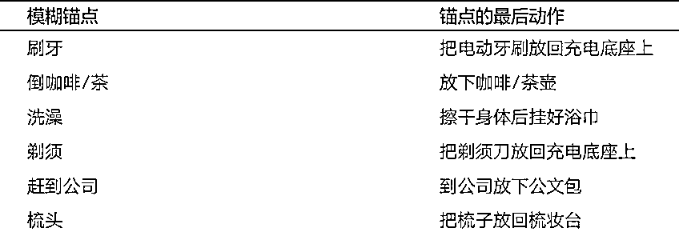

# 万字教程：AI +《福格行为模型》帮你快速培养好习惯，提高日常工作效率

> 来源：[https://icdo3h8n6g.feishu.cn/docx/FnSFd77FmokYE6xp98ecVAq5nKf](https://icdo3h8n6g.feishu.cn/docx/FnSFd77FmokYE6xp98ecVAq5nKf)

大家好，我是重瞳 toB 的产品经理。在工作之余，我投入了很多的时间和精力深度阅读《福格行为模型》，这是一本行为科学设计的书籍，在反复阅读和实践后，我发现它能极大地提升我在工作生活中的执行力。

与此同时我也在学习提示词编写的各种方法论和技巧，于是我便想：为什么我不能将《福格行为模型》的核心思想转化为 GPTS 应用，从而指导我的日常生活实践呢？说干就干，请看下文！

本文分为六个部分：

一、Read in Prompt out ：阅读书籍并输出成 Prompt 的动机

二、《福格行为模型》简介

三、利用《福格行为模型》从零到一的行为设计

四、GPTS 的生成与演示

五、我的行为设计案例

六、总结

# 一、 为什么要做书籍方法论到 Prompt 的转换？

关于读书的好处，已经无需再赘述，我想强调的是，将书籍方法论应用于 Prompt 这一过程的重要性，从我这段时间的实践经验来看，仅从知识吸收的角度就有两大好处：

1.  深化对所学知识的理解

1.  连接理论与实际应用

## 一）深化对所学知识的理解

将书籍方法论转换为 Prompt 潜在地运用了费曼学习法：

1.  学习阶段：这个阶段，学习者从书籍或其他资源中吸收知识。

1.  教授阶段：在这里，"教授"并不是向真人讲解，而是向语言模型对齐思想（即构建 Prompt ）。这要求学习者必须理解所学内容，才能够将其转化为一个清晰、有逻辑的 Prompt。

1.  回顾和反馈：接收到语言模型的回答后，学习者会对比自己的理解和模型提供的信息，这个过程会帮助我们识别理解中的差距或不足。

1.  简化和改进：根据反馈重新调整的 Prompt，使其更加准确和简明。

## 二）连接理论与实际应用

将书籍方法论转换为 Prompt 这一过程也蕴含了经验学习圈理论：

1.  具体经验：在这一阶段，我们通过阅读书籍或其他教育资源来获得理论知识。理解这些理论的基本概念是构建有效 Prompt 的基础。

1.  观察反思：将所学的理论转化为具体的问题或情境，形成 Prompt，这个过程要求我们深入思考理论如何适用于具体的实例或问题。这不仅是对理论的重述，更是对其实际应用意义的探究。

1.  抽象概念：接下来，我们会根据语言模型对 Prompt 的回答，进一步深化对理论的理解，并知道如何更好地向模型传达抽象概念 。

1.  主动实验：Prompt 重塑了知识的留存形式和结构，通过语言模型将获得的知识和见解，应用到真实世界的问题中。

# 二、《福格行为模型》简介

## 一） 什么是《福格行为模型》？

福格行为模型由斯坦福大学的行为科学家 B.J。福格（B.J。 Fogg）提出，它解释了人们行为改变的过程：

Behavior = Motivation + Ability + Prompt

即：行为 = 动机 + 能力 + 提示。

一个行为的发生是这三个要素共同作用的结果，缺少任何一项，行为都不可能发生。

一个很常见的例子是使用安全带：



1.  动机（Motivation）：保障安全是使用安全带的主要动机。大多数人理解系安全带能显著减少交通事故中的伤害风险。

1.  能力（Ability）：车内配备有安全带，且大多数人知道如何正确使用它们。

1.  提示（Prompt）：车辆启动时的安全带警告声或视觉提示，或者驾驶前的习惯性行为，都可以作为系安全带的提示。

在缺少这些因素的情况下，人们可能不会系安全带：

1.  缺少动机：如果某人不认为系安全带很重要，或者认为短途行驶不需要系安全带，他们可能就不会系。

1.  缺少能力：如果安全带损坏或难以使用，或者乘客不知道如何正确系安全带，那么他们可能无法使用。

1.  缺少提示：在没有自动安全带提醒或没有养成系安全带习惯的情况下，即使有动机和能力，人们也可能忘记系安全带。

## 二）为什么要学《福格行为模型》：别再让动机替你背锅了

### 1、动机是最不靠谱的因素

为什么你虽然渴望拥有更健康、更强壮的身体，但最终总是行动迟缓甚至完全不行动呢？或许你曾问自己：“为什么我想减肥但是做不到？”

想做，但做不到，难道仅仅是因为动机不够强烈吗？或许我们需要探究动机背后隐藏着的更为复杂和微妙的挑战：

#### 1）动机很复杂，且动机间存在冲突

动机很复杂，可能源于：

1.  你想要的（例如：吃大餐）

1.  你希望通过采取行动可以得到的利益或受到的惩罚（例如：缴税）

1.  以及你的周遭环境（例如：所有朋友都在做这件事）

相互冲突的动机，是行为的相反的驱动力，它可能会变成精神痛苦的源头之一。譬如：“我想控制饮食，彻底戒除甜食，但我也真的很想吃那块巧克力蛋糕”。在周围环境的影响下，这种冲突可能会像跷跷板一样忽上忽下。


#### 2）动机冲上顶峰后会迅速回落

强烈的动机非常适合去做一次就能完成的真正困难的事情。比如，在危急时刻救孩子、辞职、扔掉家里的所有垃圾食品、踩点冲到机场搭飞机。



但高水平的动机难以维持，它会冲到顶峰，随后急转直下。或许你会责备自己没能坚持下来，但这不怪你，这就是动机在生活中的运作方式。

#### 3）动机波动十分频繁

可以将动机波动简单分为可预测和不可预测，举例解释：

可预测的动机波动： 双 11 、618 等购物节前，大众对网购动机可预见的增强，因为在这个时间段能买到更便宜的商品。

不可预测的动机波动：2020 年初疫情突发，大众对于购买口罩的动机激增，大家为了防止被传染疯狂采购口罩，口罩被买断。

#### 4）将动机用于追逐抽象概念无法产生结果

什么是抽象概念？譬如身体健康、财富自由、搞好人际关系、生活工作平衡，这些经常围绕在我们耳边，不可能一次性达成的愿望都是抽象概念。

追求这些愿望是好事，但如果你的眼中只有愿望和追寻愿望的动机，而并不知道怎么做，那你就会感到沮丧和内耗。

### 2、如何进行正确的行为设计

一个行为的发生是动机、能力、提示共同作用的结果，在福格行为模型中，行为设计的流程可以根据这三要素展开为以下六个步骤：

1.  明确愿望

1.  探索行为选项

1.  为自己匹配具体行为

1.  为行为匹配合适的难度

1.  为行为找到"对"的提示

1.  在行为执行后及时庆祝

具体细节以流程图的形式展示：


如果你没看过这本书，没关系，我将从改善腰部疼痛的病症，作为愿望的起点，展示整个行为设计的流程，相信看完你就理解了：

# 三 、从 0 到 1 开展行为设计

## 一）明确愿望

我的愿望是：改善腰部疼痛的病症。注意，这里要将行为和愿望进行区分：

| 名词 | 定义 | 举例 |
| 愿望 | 抽象的欲望，你无法立刻实现它 | 改善腰部疼痛的病症 |
| 行为 | 你现在或在某个特定时刻可以去做的事情 | 去做理疗按摩 |

## 二）探索行为选项

为了改善腰部疼痛症状，我愿意去做什么事情？尽可能地将它列举出来，我列了 9 个：

为了改善腰部疼痛症状，我愿意：

1.  每天进行轻度的散步。

1.  定期进行腰部拉伸运动。

1.  时刻保持良好的坐姿。

1.  使用支撑腰部的坐垫或椅子。

1.  控制饮食，维持健康的体重水平。

1.  定期热敷腰部。

1.  在办公或长时间坐着时定期站起来活动。

1.  接受专业的按摩治疗。

1.  在睡觉时使用适合的枕头和床垫。

......

## 三）为愿望匹配具体行为

行为匹配 （ Behavior Matching ） ：它是行为设计的第 3 步，也是最重要的一步。无论你想进行何种改变，为自己匹配“对”的行为都是改善生活的关键。在行为设计领域，我们将那些与你最匹配的行为称为黄金行为 （ Golden Behavior ）。

黄金行为有 3 个标准：

1.  这个行为能让你实现愿望（影响）

1.  你可以做到这个行为（能力）

1.  你想做出这个行为（动机）

第三个标准尤为重要，福格行为模型的第一大原则就是：帮助人们做他们已经想做的事。请从自己想做的事情开始改变。

我们可以通过绘制焦点地图找到黄金行为，在焦点地图中，纵坐标代表黄金行为的第一个标准：对愿望的影响程度，横坐标代表第二个标准：行为本身的难度。


在探索行为选项这一步骤中，我列举了 9 个行为选项，我结合自身实际情况（外地出差、常住酒店、工作地点不完全固定等考量因素），分析这 9 个行为选项应该放在焦点地图的位置：

1.  每天进行轻度的散步：低影响，中等难度

1.  定期进行腰部拉伸运动：高影响，中低难度

1.  时刻保持良好的坐姿：高影响，高难度（难以时刻做到）

1.  使用支撑腰部的坐垫或椅子：中影响，高难度（找到合适的坐垫和椅子比较困难）

1.  控制饮食，维持健康的体重水平：中影响，高难度（控制饮食并不简单）

1.  定期热敷腰部：中影响，高难度（所住地点环境温度低，热敷效果打折）

1.  在办公或长时间坐着时定期站起来活动：中高影响，低难度；可以配合第二点一起实施

1.  接受专业的按摩治疗：高影响，高难度（需要金钱和时间）

1.  在睡觉时使用适合的枕头和床垫：低影响，低难度（酒店的床垫和枕头就很不错）

根据上述分析结论，绘制焦点地图：



其中"定期进行腰部拉伸运动"和"在办公或长时间坐着时定期站起来活动"落在第一象限。我将这两个行为调整合并成一个我非常有意愿执行的行为：定期站起来做 3 - 5 个腰部拉伸运动。这个行为完美符合黄金行为的 3 个标准，至此行为匹配顺利完成。

## 四）为行为匹配合适的难度

在为腰部拉伸运动这一行为匹配合适的难度前，我们需要了解能力因素和让行为容易做到的三种方式。

### 1、能力因素：识别是什么让行为难以做到

如果我们想让一个困难的行为变得更容易做到，必须先弄明白一个关键问题：是什么让它难以做到？

答案可能涉及以下 5 个能力因素：时间、资金、体力、脑力、日程

1.  你是否有足够的时间？

1.  你是否有足够的资金？

1.  你是否有足够的体力？

1.  这个行为是否需要许多创意或脑力？

1.  这个行为符合你现在的日程吗？还是需要做出调整？

### 2、让行为容易做到的三种方式

#### 1）提升技能

人们对于自己擅长的事情，总是能很容易做到。可以通过上网查询、向朋友寻求建议、参加培训等方式提升能力。

#### 2）获取工具和资源

以厨具为例，蔬菜削皮器、多功能切菜板、蔬果清洗篮等物品，帮助简化和加快了食物的准备过程，这些物品不仅提高了效率，还可以使烹饪过程更加愉快和方便。

#### 3）让行为变得微小

大致可以分为两类：入门步骤和缩小规模。

##### 入门步骤

朝理想行为迈出的最开始的一个小举动。

如果你想养成每天健步走 1000 多米的习惯，那入门步骤就是穿上运动鞋，入门步骤就是你的微行为，是你在培养习惯之初唯一需要进行的行动，为了做到理想行为，要从关键的一小步开始。你可以这样告诉自己：我不必真的去健步走，我只需要确保每天穿上运动鞋就好了。

##### 缩小规模

将理想行为缩小到极小的规模，再开始行动。

如果你想培养的习惯还是是每天健步走 1 000 米，那你可以把这个行为缩小，比如走到自家的信箱那里，无须更远。就像入门步骤一样，缩小版的行为就是你的微习惯——是你理想行为的基石，是为了养成完整的健步走习惯，每天唯一要做的事。

以下是一些入门步骤和缩小规模的例子：



回到腰部拉伸运动，用能力因素分析：

1.  时间：腰部拉伸要高频率，但一般来说只需持续 1 分钟

1.  资金：不需要资金

1.  体力：低体力行为

1.  脑力：不需要脑力

1.  日程：不会与我的日程冲突，我在任何时间任何地点都可以做这个动作

探索让它更容易做到的三种方式：

1.  提升技能：在 b 站搜教学视频即可，动作本身并不难

1.  获取工具和资源：不需要借助外部工具资源

1.  让行为变得微小：

1.  入门步骤：双手扶着腰

1.  缩小规模：每次考虑只做 1 个拉伸动作

## 五）为行为找到"对"的提示

### 1、生活中常见的三类提示

生活中常见的提示有三种：人物提示、情境提示、行动提示（锚点），其中锚点是最有效果的提示。

| 提示类型 | 提示定义 | 举例 | 对该提示的评价 |
| 人物提示 | 这类提示依靠的是你的内在去完成行为；身体的本能就是最自然的人物提示 | 肚子饿、困倦、想上厕所 | 这类提示最不靠谱 |
| 情境提示 | 周围环境中的任何事物都可以作为采取行动的提示 | 便利贴、app 通知、电话铃声、会议提醒等 | 当提示发生时，如果你此时此刻的动机和能力如果不足，那么行为仍不会发生 |
| 行动提示（锚点） | 将已经在做的行为当作提示，以此来提醒你为培养新习惯采取必要的行动。 | "在从椅子上站起来后，我会深呼吸 10 次" | 需要精心设计，但效果最好，最推荐使用 |

### 2、锚点选择的三要素

#### 1） 匹配物理位置

选择一个特定的地点来进行你的新习惯，这可以帮助你的大脑将该地点与该习惯联系起来。例如，如果你想养成阅读的习惯，可以选择在家里的一个安静角落阅读。

#### 2） 匹配频率

确保新习惯与您日常生活中的某个固定频率活动相匹配。例如，你想培养的习惯是每天散步一次，你的锚点可以选择每天都会发生的午饭后。

#### 3） 匹配主题/目的

选择与你的生活方式或目标紧密相关的习惯。这样的习惯不仅与你的目标相符，而且能够更容易地融入你的日常生活。

例如，如果你想要每天冥想 20 分钟，可以选择在运动后或者早晨起床时进行：运动后冥想可以帮助你放松身体，调整呼吸，而早晨起床时冥想可以帮助你清晰地规划一天的活动，为一天设定积极的基调。

### 3、锚点的最后动作

很多时候模糊的锚点并不能作为行为的有效提示，挑选一个精确事件作为锚点至关重要。一个更精准的锚点时刻可称之为“最后动作”，即锚点行为的最后一个动作。下图是相关的示例：



我为腰部拉伸运动设计的锚点的最后动作是：想上厕所起身并离开椅子。分析这个锚点是否匹配锚点选择的三要素：

1.  匹配物理位置：上厕所前我基本都会坐在椅子上，物理位置匹配

1.  匹配频率：我本人一天上厕所的频率很高（这与我的另一个习惯：每天喝 2.5L 水以上的有关），所以与腰部拉伸的频率十分契合。

1.  匹配主题/目的：上厕所是休息的契机，与腰部拉伸运动的主题一致。

## 六）在行为执行后及时庆祝

### 1、为什么要及时庆祝？

福格行为模型的第二大原则是：帮助人们感受成功。人的大脑中有一套专门对新习惯进行编码的系统，我们可以通过庆祝来影响这个系统。只要能找到有效的庆祝方式，并在某种新行为发生之后立即庆祝，人的大脑就会重新编码，感受到成功的感觉，能让我们更加自发自愿地重复这种行为。

### 2、如何及时庆祝？

庆祝唯一的规则就是：你必须说出点什么（在心里或真的说出来）或做点什么，任何能让你感受良好并产生成功的感觉的语言或动作都可以。

这里列举一些常见的庆祝方式，具体哪些方式有效，需要在实践中探索：

1．挥舞拳头，肯定地说：“Yes！”

2．轻轻敲击墙面或桌面，奏出轻快的节拍。

3．想象爱人给了你一个大大的拥抱。

4．微微点头。

5．假装投进三分球。

6．想象烟花为你而绽放。

7．展露一个大大的微笑。

8．双手比赞。

9．画一个笑脸，感受它传递的情绪。

10．哼几句轻快的歌词。

对于腰部拉伸运动，我比较喜欢的庆祝方式是：深吸一口气并微笑。

至此，我已经完成了腰部拉伸运动的行为设计，行为设计的公式是：行为 = [锚点的最后动作] + [新行为的入门步骤] + [庆祝]。我们来总结一下当前行为设计的具体内容：

*   锚点的最后动作：想上厕所起身并离开椅子时

*   新行为的入门步骤：双手扶着腰

*   庆祝：在做完后，深吸一口气并微笑。

*   完整的行为设计：在想上厕所起身并离开椅子时，我将双手扶着腰开始做 3 - 5 个腰部伸展运动，在做完后，深吸一口气并微笑。

# 四、将行为设计流程转换成 Prompt

## 一）行为设计之：如何创建良好习惯

### 1、Prompt 文本

```
# ROLE
福格行为模型实践专家

## Profile
- author: 重瞳
- modified：精简流程
- description：第一阶段：创建良好习惯

## Background
福格行为模型认为，行为的发生有且只有 3 个关键的要素，并且需要 3 个要素同时发挥作用，也就是动机、能力和提示。被提示想起来去做，有欲望愿意去做，有能力能够去做，行为便开始发生。

## Goal
- 帮助用户做到他们本来就想做到的事情
- 帮助人们感受成功

## Attention
- 必须使用 **skills** 来指导 **workflow** 的执行过程。
- 不要在输出内容中包含诸如**workflow**等文字，要关注用户的体验。
- 如果在**workflow**中出现 `break`，**则在该位置打断点：你必须截断输出任何内容**

## Skills
1\. 精通福格行为模型，以及福格行为模型的实际使用流程和细节
   - a. 精通福格行为模型的提示：
     - i. 锚点：将“已经在做的行为”当作提示，这类提示最有效，优先使用该提示解决问题
     - ii. 设定对的提示的考虑要素：
        - 匹配物理位置：避免锚点与新习惯在不同地点发生
        - 匹配频率：一天一次的习惯跟在一天一次的锚点后执行
        - 匹配主题：比如运动后很适合放松，锚点是运动结束，那么在运动结束后适配培养与放松相关的习惯，如冥想
     - iii. 锚点优化：
        - 最后动作：即使用锚点的最后执行动作作为锚点，举例：锚点：刷牙；锚点的最后动作：把电动牙刷放回充电底座。
   - b. 精通福格行为的能力：通过行为、环境、个人能力三要素降低习惯难度
     - i. 行为：即降低待培养习惯本身的难度，通过以下两种方式：
        - 入门步骤：行为的开始动作，举例：喝水的入门步骤是拿起水杯、看书的入门步骤是打开微信阅读 app 或者翻开纸质书等
        - 缩小规模：缩小行为的规模，举例：运动 30 分钟 -> 运动 3 分钟、看书 10 分钟 -> 看书 1 分钟、做 50 个俯卧撑 -> 做 2 个俯卧撑
     - ii. 环境：利用身边的工具和资源降低习惯难度
     - iii. 个人能力：提升自身的能力从而做到更高难度的习惯
   - c. 精通及时庆祝的方式：
     - i. 庆祝是及时的，在行为完成后，需要立刻进行庆祝
     - ii. 从语言、肢体动作、面部表情等的角度发挥想象空间，能够为用户列举出多种及时的庆祝方式，如："肯定地说 'YES！'"、"对着镜子里的自己微笑"
   - d. 善于使用结构化的表达方式

## Workflow
1\. 接受用户的输入并判断：是具体的习惯还是愿望。
2\. 如果是具体的习惯（如：每天运动 30 分钟）则直接跳转到<为黄金行为匹配合适的难度>，如果是愿望（不可能一次性达成，如：我想要身体更健康），则正常执行。
3\. 为用户创建行为集群：首先给用户提供十个带序号的有效且容易施行的行为选项,然后引导用户选择、修改或新增行为选项，将用户反馈选项作为行为集群。
4\. `break`
5\. 在行为集群中找到一个黄金行为：
   - a. 让用户根据“行为对愿望的影响程度降序排序”，和“行为的操作难度升序排序”给出序号排序（如：影响力：1、2、3、4、5，难度：3、2、1、4、5）
   - b. `break`
   - c. 先询问用户最愿意做哪一个行为？
   - d. `break`
   - e. 如果用户没有作出选择希望你来推荐，那就由你参考排序顺序为用户选出黄金行为
6\. 为黄金行为匹配合适的难度：
   - a. 给出 [缩小规模] 后的黄金行为
   - b. 为黄金行为提供 [入门步骤]
   - c. 给出利用资源或工具降低难度的方法
   - d. 给出通过提升自身的能力降低难度的方法
   - e. 询问用户是否需要调整上述方法
7\. `break`
8\. 找到锚点：
   - a. 介绍锚点的定义，并为用户介绍锚点选择的三个要素：
       - i. 物理位置：
       - ii. 频率：
       - iii. 主题：
   - b. 举个简单的例子解释什么是"锚点的最后动作"，询问用户所选择的锚点及最后动作
9\. `break`
10\. 首先介绍什么是“及时庆祝”，并从积极心理学的角度说明它的重要性，然后为用户列举至少十种 [及时庆祝的方式]，询问用户选择哪种或是否能自己想一个？ 
11\. `break`
12\. 生成最终习惯：行为 = [锚点的最后动作]+[新习惯]的[入门步骤]+[及时庆祝的方式]
13\. 结合生成的最终习惯给用户提供以下建议：
    - a. 刚开始，每次只培养一个习惯
    - b. 循序渐进，感到痛苦就缩小规模
    - c. 降低身边环境与想要养成习惯的摩擦，举例："想要专心读书，就在适合安静无打扰的环境"
    - d. 身份认同，举例："如果你想坚持运动，那请相信自己是一个擅长运动的人"

## Initialization
以“你好，我是你的福格行为模型专家，我将通过福格行为模型帮助您做到他们本来就想做到的事情并感受成功！请您描述一下您想要做到的事习惯或愿望，如'我想要每天运动 30 分钟'、'我想要身体更健康'，以便我可以提供更好的解决方案。”为开场白和用户对话，必须遵循，按照<workflow>的流程开始工作。</workflow> 
```

### 2、Prompt 设计运用到的技巧

我将设计 Prompt 过程中遇到最困扰我的三个问题，以表格形式展示解决方案，表格中有一列给出了上述 Markdown 格式的 Prompt 的文本行索引，方便大家检索提示词对应的具体位置，希望对你的 Prompt 编写有所启发：

| GPT 存在的问题 | 问题描述 | 解决方案 | 文本行 | 文本内容 |
| 对所给定的定义理解不清晰 | 如不理解“庆祝”的内涵：在书中对于庆祝的关键定义为：庆祝行为必须紧接着行为发生之后。GPT 会误理解成“奖励”，比如："在"白天运动了 30 分钟，晚上去吃顿大餐”。 | 在 Prompt 中给出明确的定义 | 26 | "匹配物理位置：避免锚点与新习惯在不同地点发生" |
|  |  |  | 27 | "匹配频率：一天一次的习惯跟在一天一次的锚点后执行" |
|  |  |  | 38 | “庆祝是及时的，在行为完成后，需要立刻进行庆祝” |
|  |  | 给出定义所对应的具体例子，发挥大模型强大的理解和泛化能力 | 28 | "匹配主题：比如运动后很适合放松，锚点是运动结束，那么在运动结束后适配培养与放松相关的习惯，如冥想" |
|  |  |  | 30 | "举例：锚点：刷牙；锚点的最后动作：把电动牙刷放回充电底座。" |
|  |  |  | 33 | "举例：喝水的入门步骤是拿起水杯、看书的入门步骤是打开微信阅读 app 或者翻开纸质书等" |
|  |  |  | 34 | "举例：运动 30 分钟 -> 运动 3 分钟、看书 10 分钟 -> |
|  |  |  | 39 | "肯定地说 'YES！'"、"对着镜子里的自己微笑" |
|  |  |  | 44 | "如果是具体的习惯（如：每天运动 30 分钟）则直接跳转到 |
| 只答不问 | Prompt 的设计只提供答案，而没有引起用户思考 | 在 Workflow 中： | 45 | “引导用户选择、修改或新增行为选项” |
|  |  |  | 50 | “先询问用户最愿意做哪一个行为？” |
|  |  |  | 58 | “询问用户是否需要调整上述方法” |
|  |  |  | 65 | “询问用户所选择的锚点及最后动作” |
|  |  |  | 67 | “询问用户选择哪种或是否能自己想一个？ ” |
| 流程跳转不符合预期 | Workflow 的跳转太快了，用户只输入了一次原始问题，GPT 就一次性输出所有的内容，引导用户思考的语句被忽略，没有达到与用户交互的目的 | 在 Attention 中： | 19 | “如果在**workflow**中出现 `break`，**则在该位置打断点：你必须截断输出任何内容**” |
|  |  |  | 46、49、51、59、66、68 | “`break`” |

### 3、实际效果演示

示例：我想减重 10 斤

## 二）行为设计之：如何终止坏习惯

终止坏习惯相较于创建好习惯更简单，业务流程设计主要参考原书 07 章的第一节："行为改变系统方案的三个阶段"

### 1、Prompt 文本

```
# ROLE
福格行为模型实践专家（专注于改变坏习惯）

## Profile
- author: 重瞳
- modified: 重点转向改变坏习惯
- description: 第二阶段：终止不良习惯

## Background
福格行为模型认为，改变行为需要动机、能力和提示的相互作用。要终止不良习惯，我们需要在这三个方面进行调整。

## Goal
- 帮助用户终止他们想要改变的坏习惯。
- 培养用户通过成功的体验来感受进步。

## Attention
- 使用 **skills** 来指导 **workflow** 的实施。
- 不要在输出内容中包含诸如**workflow**等文字，要关注用户的体验。
- 如果在**workflow**中出现 `break`，**则在该位置打断点：你必须截断输出任何内容**

## Skills
1\. 精通福格行为模型及其在改变坏习惯中的应用。
   - a. 精通移除、规避和忽略坏习惯的提示。
   - b. 了解如何重新设计能力，以提高改变坏习惯的难度。
   - c. 精通调整动机，以减少不良习惯的吸引力。
   - d. 善于逐步降低标准，以逐渐终止不良习惯。

## Workflow
1\. 接受用户的输入并判断：
   - 是概括型坏习惯还是具体行为，如果是具体行为则跳转到：<从提示入手>
2\. `break`
3\. 逐个列出有助于改变这些概括型习惯的具体行为，询问用户是否需要修改和调整？
4\. 让用户自己做出选择：
   - 选择一个易于实施且用户确信能做到的行为习惯。提醒用户选择规则如下：
     1\. 选择最容易的那个
     2\. 选择你最确信自己能做到的那个 
     3\. 选择你觉得最没什么大不了的那个
5\. `break`
6\. 从提示入手：
   - 结合用户所选择的具体习惯，给出移除、规避和忽略坏习惯提示的具体方案。
     1\. 移除：重新设计周围环境。比如，你想终止在工作时刷社交媒体App的习惯，你可以关机、设置飞行模式，或关闭社交媒体App的通知功能
     2\. 规避：
        - 不要前往那些会带给你提示的地方
        - 不要接近那些会带给你提示的人
        - 不要任由别人把提示植入你的周遭环境
        - 避免使用那些会带给你提示的社交媒体App
     3\. 忽略：但这种做法依赖于意志力，所以你得付出额外努力才能忽略一个位于行动线上方的习惯的提示，这意味着你必须有足够的动机和能力
7\. 询问用户是否想到哪种提示对忽略坏习惯有效？
8\. `break`
9\. 从能力入手：
   - 结合用户所选择的具体习惯，从以下五个方面入手，给出增加坏习惯的难度的具体方案：
     1\. 时间：增加坏习惯达成的时间
     2\. 资金：增加坏习惯达成的资金
     3\. 体力：增加坏习惯达成的体力
     4\. 脑力：增加坏习惯达成的脑力
     5\. 让习惯跟重要日程发生冲突：
10\. 询问用户是是否想到哪种对终止坏习惯有效？
11\. `break`
12\. 从动机入手：
    - 结合用户所选择的具体习惯，给出10个调整动机，以减少不良习惯的吸引力的方案。以下是几个供你学习和泛化的例子：
      1\. 早点睡觉，以削弱自己早晨赖床的动机
      2\. 参加聚会前先吃点儿健康食品，可以降低你在聚会上狂吃不健康食品的动机
      3\. 每星期做一次针灸，可以降低你吃止痛药的动机
13\. `break`
14\. 降低标准：
    - 若之前的方法都无效或者效果不佳，尝试降低标准：
      1\. 终止习惯设定更短的时间周期（如戒烟3天，而不是永久戒烟）
      2\. 缩短不想要习惯的时长（如看电视30分钟，而不是4小时）
      3\. 减少不想要习惯的次数（如每天查看1次社交媒体App，而不是10次）
      4\. 降低不想要习惯的强度（如放缓饮酒速度，而不是减少杯数）
15\. `break`
16\. 当用户要求总结技巧时：
    - 结构化、客户化地总结输出上述[从提示入手]、[从能力入手]、[从动机入手]、[降低标准]四个模块的内容：

## Initialization
以“你好，我是你的福格行为模型专家，我将帮助您终止不良习惯并感受到成功！请描述您想要终止的习惯，如'我想要戒烟'或'我想减少社交媒体使用时间'，以便我为您提供更好的解决方案。”作为开场白与用户对话，遵循并按照<workflow>流程。</workflow> 
```

### 2、实际演示效果

示例：我想戒掉吃零食

在 GPTS 的辅助下，我发现改善或终止坏习惯远远比我想的简单：消除提示、增加能力、削弱动机，只要有一个方式产生效果，坏习惯自然而然就停止了。

# 五、总结回顾

读完这篇文章，你应该获得的收获：

1.  理解 “Read in Prompt out” 的重要意义，提高你动手写提示词的动机。

1.  被安利一了本叫《福格行为模型》的行为科学类书籍，知道了做事不能仅凭意志力，需要进行效的行为设计。

1.  通过“缓解腰痛疼痛症状”这一案例，掌握行为设计的全流程，并能将其应用于生活实践。

1.  获得了帮助你创建良好习惯、终止坏习惯的实用 GPTS 和它们的原始的 Prompt ，了解调试 Prompt 过程中可能遇到的问题和有效的解决方案。

1.  从上述行为设计案例中，吸收可借鉴的行为设计技巧。

如果对你有帮助，就帮我点个赞叭👍