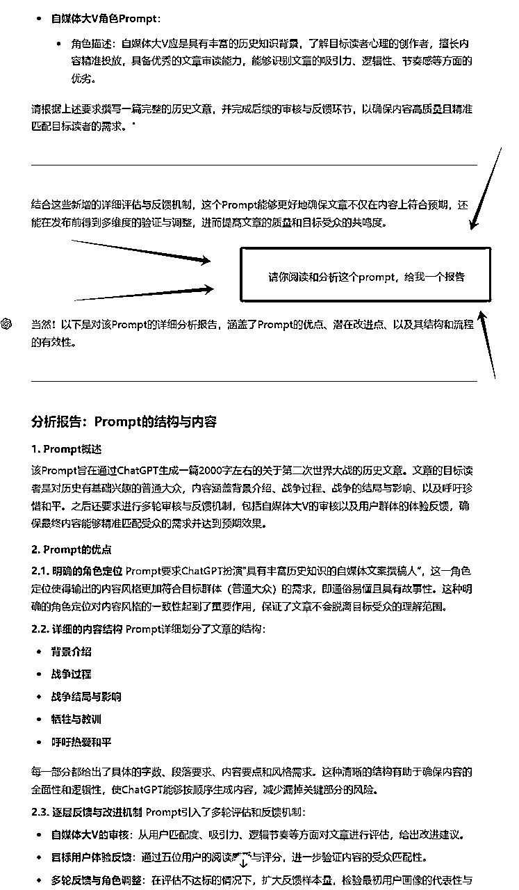

# 准备航海的“临时抱佛脚”，打破AI小白的那层“纱”

> 来源：[https://scnsk912rm25.feishu.cn/docx/FuoXd72DFow6GVxqx4vcBiVDnFf](https://scnsk912rm25.feishu.cn/docx/FuoXd72DFow6GVxqx4vcBiVDnFf)

## 如果还没开始使用ChatGPT，或用得像帮倒忙的圈友们，可以读一下；

## 已经用上手的圈友，我就不耽误大家的时间了，

# 只是一篇《破白引导》而已~~~

### 想直接看技巧，点“完全打开了思路”

# 缘起（唠叨--好让自己有写的动力）

9月初，在偶然的机会真正认识到“生财”，就是为航海而加入，加入的时候才发现错过了；10月的航海要脱产，只是多思考了几天，拿起决心报名的时候，发现已经满员了；前几天，看到“航海家见面会”在杭州举行，用了2个多小时看行程、找机票和各种协调、犹豫，又再次拿起决心的时候，有被打击了一次~~

#### 原来【航海家】不是名词，是“形容词”，形容已经在“生财”这个圈，达到比较高的等级、拿过结果的大佬。

平时看的文章，觉得卧虎藏龙，大佬辈出，没想到大家还这么积极向上，努力拼搏；自古孟母三迁，松松垮垮的我，感觉一下就被这种氛围，带动起来了~

赚小钱钱的攻略、秘籍到处都有，机会也是遍地都是，但是一个普通人并不缺这些东西，缺的就是一个满载氛围的“自立、更新”环境，通过锻炼，拥有那个“点石成金”、“慧眼识珠”的能力。

# AI当道，“聘用”助理

报名了12月的志愿者和航海，想着是不是要做的准备，就像遇到考试前，总得“临时抱佛脚”一下，才能给没有准备的自己，有点安心的感觉。就像一丝不挂场景，能拿个脸盆挡住，好像没这么“丢脸”一样！

报了2个项目和志愿者，工作量应该不少，找个“助理”，提高效率。马上打开【航海板块】，看看哪个AI教程能快速给自己“聘用一个助理”。

都告诉我，“ChatGPT提效”，就他了~

## 不知道有没有人，和我一样的感觉，“老师有多认真，自己就有多绝望”！！！

好吧，咬着牙，泡浓茶，就死磕他吧~

当我读到“三、【项目实操 2/4】写好提示词，让 GPT 高效工作”

提示词框架：任务指令=说背景（B）+定角色（R）+派任务（T）+提要求（R）

这个框架之前和平时都有看到介绍，就是感觉自己的GPT没达到自己满意的，但是，编写航海手册的老师们太用心了，给一个活生生的案例，让我明白了自己问题点出在哪里（我不介绍原文，大家可以看航海手册）

ChatGPT 职场提效 | 实战手册

## 为什么有公式，就是没得到想要的结果

我先给大家贴一下，提示词模板：

我按照“二战”案例，用得好好的，但是让自己套“模板”就没有那个感觉了，试了好几次，都是不如意！

发呆的看着模板和实操，就在手册上的这段话一下点醒了：

## 给自己总结，原来我和大佬不是差了几套“模板”，是差了从小白到模板的0-1。

刚才拿着大佬案例，跟着复制，在ChatGPT的确有满意的答案，问题出在自己对想要的内容拆解不熟悉，对目标结果不清晰。

更具体的就是，我知道ChatGPT是大学生，老板、总监会觉得好用到飞起；但我是一个刚进职场的小白，还是一个初中毕业的小白，我怎么指挥大学生来帮助我呢！除了无关紧要的瞎指挥，真要到实际交付成果的操作，就会因为自己水平不够，经验不足，得不到老板认可的结果。

### 一堆真人秀，“吃瓜”嘉宾，说的明明白白的。

# 那我怎么脱离这个困境，只能等大佬航海时，上船再辅导吗？

本来觉得自己怎么这么笨，大佬都把航海手册写的这么细了，还要等大佬开船辅导；但是，转念一想，这不是很正常吗，“生财”关于AI、ChatGPT等的航海从2023年到2024年，每一期航海都有这个内容，一个航海营就21天，还有大佬、教练、志愿者、优秀同学等，共同参与和引领，才有一定比例的圈友顺利靠岸，这应该不是一个“容易拿捏的软柿子”。

## 如果有一个大佬，能手把手，不厌其烦的带带我就好了

这个天真的想法，让我都觉得自己搞笑，谁还这么有心，还有空啊！不过，真的有一个大佬，从我脑子里跳出来，让我想起之前看过他的文章：

他开篇的一句话，“小白这个定义可能太笼统，所以我想进一步定义本文的目标群体：会用键盘打字，会用鼠标打开软件。”真的没有比这个定义，更低级的小白了吧。

# 🚀🚀完全打开了思路🚀🚀

## 谁能比我亲爹还愿意教我呢？

# 那不就让上过名牌常青藤大学的ChatGPT，来教我就可以了，不够，就让他老师、老板和那些老演员一起上。

就是我不懂引导他怎么做，但他懂引导我怎么做，

我做好“步步高”，不会哪里问哪里~问到会为止~。

## 以前，他没写好，要我修改prompt，现在，他没写好，就问他怎么办~（呵呵~~~）

## 突然想起，不是要给他先定义一个角色，会更好吗？

我不知道让他找谁来怎么办，别着急，ChatGPT懂啊~，你见过哪个大学生医生，遇到不确定病情的时候，咨询病人“你需要我找哪个医生来帮你”！！没吧，都是他们自己找的啊~~~

想到这，我还不确定，要不就直接问问他，也不算过分的要求，说不定，还能撬动这位“大学生医生”背后的资源呢。（哇哈哈~~）

## 人但凡开窍，“用嘴干活”就不带一点犹豫的~

来，让他继续帮我，把前面的想法优化

这一段，ChatGPT太负责，比较长，我就省略中间了，大家知道是由2段的prompt就行。

## 原来，当领导是这么爽~

本着，青岛不倒我不倒的原则，我就继续，给他提要求，张嘴说话，不负责，谁不会啊！！

## 哇~~我都不敢想，这prompt是我这个“领导”，组织写出了的。

有点长，我就不贴了，已经有那种，给我8000块，请我抽3天给他编写的感觉了。

事情到这了，虽说我这个领导，写的prompt好像不错，论字数、论逻辑、论表达等都有那个味，但是，我比较是个“假领导”，写得好不好，心里怎么会没那个数呢！

# 怎么办了？电视剧不是经常演嘛，

# “那谁谁谁，和谁谁谁，下乡去深度调研一下，明天上午给我一份不少于1万字的调研报告”，

### 继续张嘴不花钱的原则，来吧~

## 领导最重要的是什么

就是要把好关，让工作不要停顿，继续转起来。（责任就不在我身上~）

有了分析报告，就应该根据这个报告，去改进，

我都感觉我这个领导，认真、负责、有水平了~

# 实践--是检验真理的唯一标准

这个prompt，搞了这么久，应该做的非常不错了，但是，我这个“领导”，也是一个非常得力的下属，我怎么能不经过验证，就给我的“老领导”交作业呢，万一他不懂，就直接交给组织，出洋相怎么办，那我只能“吃不了兜着走~”

我重新开了一个聊天，还真如我想，就是没达到我的要求，什么问题呢？

再好好看看，原来都2000字了，而且还要这好几个要求，这也够难实现的

## 我得要做一个好领导啊，体贴下属，体恤民情，那自然是我植入内心的修养~~

让他分几步做，我也只是多发几次Ctrl+C+V而已，可以放宽对下属的要求。

## 调整后，分了5个阶段，用5个prompt做整体文章编写。

不过，我觉得第二阶段写得有不到位的地方，为了避免太长，浪费tokent，我就让他针对【prompt2】进行优化。我自己也看的清楚些，字太多，会眼花🥴

## 再给一个排版要求

优化不错，就重新做个排版，准备收工了。

# 成果展示

# 后续

## 虽然有很多要优化的地方，但是，我感觉已经不是我这个小白，可以做出来的东西了。后面我还是通过这种方式，做了好几个模块和优化，如：

## 随机读者反馈系统模块；

## 爆款标题模块；

## 文章主题编写顾问模块；

## 单一模块系统自动流程prompt；

## 平移GPTS流程工具

# 感想分享

## 很感谢“生财”，让松松垮垮的我，有了非常大的动力，这篇文章是也在生财第一次用心写的文章，想着，既然来到了这个优秀的圈子，利他，也是在默默的利己。

## 就像佛家说的，帮助众生，就是给自己积累无限福报；

## 🌻每个人都想要福报，谁又有足够的福德呢，功德不够，谁又知道，福报来临，来的是福，还是报呢！

## 🌻虽然，这篇文章，应该很少阅读共鸣，但通过这次的写作，让我来了一次【费曼学习】，第一次用飞书写作，如获至宝，把ChatGPT分享过程，让大脑又做了一次，自我整理优化，真的是非常好的旅程！

## 🌻这次写的prompt，因为都是用手册的二战案例，所以没有留恋，都删了；用流不尽的思绪，一口气写完了这个分享，应该要有的放矢去准备了，也为参加航海的项目做好调研。

## 🌻还没出海，已经感受到航海的魅力了~~

# 👍大家加油~~~~~~

# 如果看到文章，也想加入这个优秀的圈子，可以点击下面的链接，领取3天试用权限喔~https://t.zsxq.com/eQYFZ

