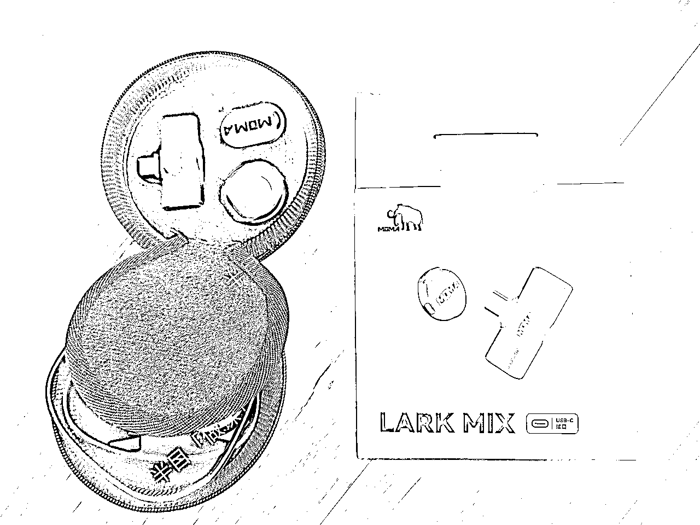
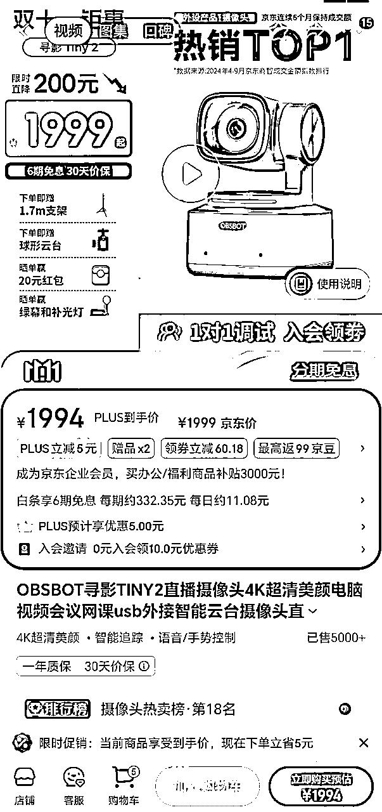

# 课程录制设备搭建，还能兼顾直播，良心推荐

> 来源：[https://d037mrmszsw.feishu.cn/docx/Fwkwd5lvnoiwTjxaGepcdCmxny5](https://d037mrmszsw.feishu.cn/docx/Fwkwd5lvnoiwTjxaGepcdCmxny5)

🔥双11临近，应景给大家分享一期【课程录制】设备搭建的干货贴，有【做课】需求的小伙伴，建议点赞收藏本帖，趁各大购物平台大促期间，添置或者升级自己的硬件设备，提升做课或者直播质量。

✔️半目推荐录课直播设备有两个原则：

① 自己用过，或者正在使用，且觉得好用的设备才推荐；

② 同行普遍使用的热门设备会重点推荐，以保障推荐的客观性。

☞ 我们先来看一眼目前【半目做课直播】的【设备搭建】真实场景⬇️

☞ 半目关于做课直播【设备搭建】的主要观点：

1、大家购买【做课】所需设备时，一定要尽量兼顾将来【直播卖课】的需求，便宜的设备无所谓，贵一点儿的设备一定要考虑全面，同学们能明白我的意思吧❤️，把眼光放长远些；

2、差生文具多，大家没必要追求过分高大上的做课直播设备，使好手头的扫帚🧹，扫地僧照样也🉑独步武林；

3、大家要根据自己的【实际需求】【场地大小】【可投入资金】这 3 点来决定自己的设备搭建方案。

☞ 本文半目将结合自己以及同行的做课直播设备搭建经验，主要从【最省钱】【最建议】这两个角度来推荐给大家最实用的方案，当然最后也会给同学们介绍一下高端玩家是怎么弄的

# 一、【最省钱】的【录课】设备搭建，还能兼顾直播

## 1、手机+带麦克风的耳机

● 手机：我这台是 华为 Mate20，录课和直播都没问题；苹果手机的话，iPhone11 系列以上都没问题。

● 不用麦克风的话，收音会成问题，到时候录课或者直播时杂音较大，所以最好配个带麦克风🎤的耳机，有线蓝牙都可以。

✒️ 总结：1台手机+带麦克风的耳机，这是最简配的做课直播设备配置了，而且仅适用于无需配套课件的那种录课形式，仅人像。

## 2、手机+麦克风+电脑+手机支架

☞ 这套设备搭建，非常推荐，是做课直播入门推荐设备组合，手机+麦克风+电脑+手机支架，简单实用，买全这四样，不是太贵，也不至于简陋，最关键的是，效果还不错！

● 手机：iPhone11 系列以上都没问题，华为 Mate20 配置往上的安卓鸿蒙手机也都没问题（或者最近3年内的旗舰手机一般都没问题）

● 手机支架：我建议大家买那种【放桌上+站地上+可手持】都可以的手机支架，我用的是：绿联的这款，目前也才40多块钱⬇️

【京东】https://3.cn/24Uukp-V「【补贴价¥45，已补¥14】绿联（UGREEN） 自拍杆三脚架伸缩旅游神器360°旋转多功能蓝牙便携手持防抖落地支架适用华为小米/苹果手机」点击链接直接打开

● 麦克风⬇️

① 有线款，我推荐【悦米usb麦克风】（我自己一直在用），某宝目前价格¥249，这款用着收音效果比较好，有线信号更稳定，价格也合适

【淘宝】限时每300减50 http://e.tb.cn/h.gCC6qulmtAwSQQU?tk=I5KE3MoXC6k CZ0000 「悦米直播麦克风录音收音麦专用话筒手机电脑抖音视频网红主播设备」

点击链接直接打开 或者 淘宝搜索直接打开

② 无线麦克风，方便随意活动，不用担心麦克风距离老师过远而声音减小的问题

<1> 无线麦克风推荐【BOYA mini博雅指尖麦克风】，一拖一 Type-C版 目前京东价¥149往下

【京东】https://3.cn/27-d3T1K「BOYA mini博雅指尖麦克风」

点击链接直接打开

<2> 我自用的无线麦克风是【MOMA猛犸 LARK MIX】，比较小巧，效果也要更好一些，一拖一 Type-C版 目前京东价¥399元往下

【京东】https://3.cn/24UyC-LL「猛玛（MOMA）Lark Mix 一拖一无线领夹麦克风猛犸手机直播vlog户外采访微小型纽扣收音麦Type-C版黑色」点击链接直接打开

● 电脑：如果单纯用来做课，配置要求不高，日常办公用笔记本就可以；但如果考虑日后直播卖课、剪辑短视频等，就买性能好一些的（笔记本¥6500+，台式机¥4500+）。我用的笔记本是华为Matebook数字系列，台式机是联想拯救者刃7000K，录课+直播，完全够用。如果手头没有电脑又不想买怎么办？支付宝搜索🔍小程序【人人租】进入，继续搜索联想拯救者Y7000笔记本，建议租这个配置 ⬇️（价格大家货比三家）

● 那么【手机+麦克风+电脑+手机支架】这套设备组合，手机是用来干嘛的呢？答：当摄像头用。那么为什么不用笔记本自带的摄像头呢？答：效果不好，且不能移动位置。

📒手机连接电脑当摄像头用的方法⬇️

① 电脑上先下载安装 iVCam

官网：https://www.e2esoft.cn/ivcam/

② 打开 iVCam，用手机扫码下载iVCam安装

③ 安卓鸿蒙手机，没有开启usb调试的话，需要先打开设置开启，在设置里找到开发者模式（不知道自己手机开发者模式在哪儿的话，自行百度搜索对应手机型号寻找），进入开发者模式找到 USB 调试，打开

④ 苹果手机 App Store 搜索 iVCam 直接安装

⑤ 用数据线或无线连接（无线需在同一wifi下），推荐无线，这样可以腾出充电口连接充电线或者麦克风，我专门测试过，无线连接很稳！

⑥ 打开录课或直播软件，添加摄像头，选择 iVCam 摄像即可

⚠️手机连接电脑当摄像头用的注意点⬇️

① iVCam 为付费软件，一年¥68，大家可以先试用，觉得效果好的话再付费（我测试下来效果不错，长时间连接设备很稳）

② 手机当摄像头时，建议用后置摄像头（参数高效果好），大家注意调整位置

③ 手机当摄像头时，就不要带手机壳了，暂时去掉，不然手机发热会很严重

# 二、【最建议】的【录课】+【直播】设备搭建

## 4、摄像头+麦克风+电脑

● 前一种用手机当摄像头的设备搭建方式，好处是不用专门买摄像头（有的手机摄像头非常好，效果堪比小单反），但缺陷也很明显，就是录课尤其直播时间一长手机很容易发烫，而且需要软件连接，充电线有时还需要和无线麦克风抢占同一手机充电插口 …… 每次手机位置不固定，需要调整等等

● 所以，建议专门买一个usb接口的摄像头，插在电脑上，固定好位置，也不会发烫，搞定，如图⬇️

● 摄像头推荐：罗技c1000e（我用的也是这款，性价比很高），目前某宝价¥1399

【淘宝】http://e.tb.cn/h.gpN5yEvvn5mdMcQ?tk=k0Ti3hdaSxt CZ3456 「罗技C1000e超高清4K摄像头台式电脑usb视频麦克风直播带货美颜影」点击链接直接打开 或者 淘宝搜索直接打开

● 再往上走，效果更好的摄像头的话，推荐大家这款：OBSBOT寻影TINY2，目前京东价¥1999元往下

【京东】https://3.cn/27d5p-cN「TINY2 4K直播摄像头超清美颜」

点击链接直接打开

## 5、摄像头+麦克风+电脑+三脚架+灯光

● 还有个问题，家里的灯光一般偏温馨（偏黄、偏暗），尤其是采光不好的房间，白天录课或者直播甚至都要开灯，但灯又不够亮，出来的视频画面偏暗，不够鲜亮，影响呈现效果，这时候就要配置专门的光源了

● 灯光配置方法：方形灯、球形灯，各买一个，现场位置布置方法：

① 方形灯：人在桌前中心，方形灯位于人的左前方大约45°位置，主要作用是提亮面部，兼顾背景环境

② 球形灯：人在左前中心，球形灯位于人的右前方大约45°位置，主要作用是照亮背景环境，兼顾照人

③ 摄像头距离人，大约1米左右

● 现场布置位置图⬇️

● 灯光推荐：

① 方形灯：KOOLIFE 补光灯直播摄影柔光灯箱（有脚架、遥控器），目前京东价¥299元

【京东】https://3.cn/2-4USqk1「KOOLIFE 补光灯直播摄影柔光灯箱 led闪光灯泡常亮拍摄灯照相馆录像视频影棚打光户外移动服装直播间设备器材」点击链接直接打开

② 球形灯：金蝌灵跃 300W三色+柔光求+2米加粗支架，目前京东价¥399元往下（双11特惠价¥271块出头）

【京东】https://3.cn/24-USDKS「金蝌灵跃 400W直播补光灯专业球形打光灯主播用美颜嫩肤柔光灯影棚拍照摄影灯视频拍摄常亮灯 300W三色+柔光球+2米加粗支架」点击链接直接打开

● 三脚架：用来固定摄像头，摄像头距离人大约1米左右

● 三脚架推荐：SOMITA闪拓 ST-666 相机三脚架单反便携专业三脚架

● 备注：这款三脚架完美适配前面推荐的罗技c1000e摄像头，可以把摄像头横着拍也可以竖起来拍，大家可以多调试一下，看怎么拍满足自己的录课或者直播要求

● 目前京东价¥75（双11特惠价¥50多）

【京东】https://3.cn/24U-Y6Qp「SOMITA闪拓 ST-666铝合金相机三脚架单反便携三角架三维云台手机摄影支架手机直播支架户外微单拍照」点击链接直接打开

## 6、摄像头+麦克风+双屏电脑+三脚架+灯光+提词器+绿幕

☞ 这也是半目老师本人目前的设备搭建方式，比上面介绍的那种方式，多了【提词器】+【绿幕】，给大家看下半目老师的录课直播间整体布景⬇️

● 上方的现场布景图中，桌子中间的黑色方盒子就是提词器，摄像头就藏在提词器里面

● 提词器适合新手老师，面对镜头容易紧张，可以通过提词器过渡一下，提词器的好处就是，眼神可以正对着摄像头（因为摄像头可以装在提示词里面），这样显得视频里的自己观感要好很多，当然，通过自己的不断练习，后期老师们就可以脱稿，尽情在镜头面前展示自己，这样观感会更好

● 有同学说，有些软件也会提供提示词功能，但肯定不会有硬件提词器效果来的好，软件的提示词只能放在电脑边缘靠近摄像头的地方，而硬件提词器直接把镜头装在里面，眼神可以正对摄像头

● 提词器不是必须，镜头感不强且有条件的新手老师，可以考虑~

● 提词器推荐：奇叶 大屏幕提词器 目前京东价¥288（双11特惠价¥240多）

【京东】https://3.cn/24V0-gJU「奇叶 大屏幕提词器手机平板单反相机微单便携大型题词机视频提示字幕直播拍摄像头适用苹果ipad华为」点击链接直接打开

● 绿幕：放在人背后大概1米左右，作用是录课或者直播时可以人像抠图，随意切换“假”背景

● 绿幕使用条件：录课直播间，大于6平米，可以考虑绿幕；小于4平米，别用绿幕，效果不好

● 绿幕最大的问题是抠图扣不干净，要解决这个问题，请大家注意以下几点：

① 摄像头：摄像头要好，摄像头太烂，扣不干净

② 布光：打到绿幕上的光一定要足够亮，而且要尽量均匀，这是绿幕抠图扣不干净的最大影响因素

③ 距离：人距离绿幕1米或者以上

④ 衣服颜色：不要穿和绿色颜色接近的衣服，比如浅绿色、蓝色

⑤ 发型：头发不要太炸裂，边缘会扣不干净

⑥ 绿幕周围：绿幕周围不要堆放杂物，表面要平整，不能有太大的褶皱

⑦ 根据半目老师的使用体验和经验，尽量能用实景就不要绿幕，真的很难搞 …… 尤其一到晚上就 …… 一言难尽

● 绿幕推荐：贝阳直播绿幕 3*2米背景布+2*2米背景架（横杆穿孔款），目前京东价 ¥158

【京东】https://3.cn/-24V35YW贝阳（beiyang）直播背景布绿幕抠像布加厚绿布背景布带支架绿色摄影黑色白色背景布拍照绿幕+背景架便携抠像幕布 绿色【背景架需另购】【加厚加密送4对无痕钉】 3*2米背景布+2*...点击链接直接打开

# 三、总结

● 高端玩家，还会用单反相机、采集卡、声卡、超大功率光源、直播大屏等 ……

大家量力而行，等课卖出去了，盈利后，再逐步升级自己的录课和直播设备，这不是课程卖爆的主要因素，不要本末倒置

● 来，让我们最后一起再复习一遍，本篇开头所讲的，半目老师关于做课直播设备搭建的主要观点⬇️

☞ OK，下课，等大家在实际设备搭建的过程中，遇到具体难题，🉑随时在本帖留言，到时候再帮助大家解决遇到的具体问题！

🔚阅完本文，如有所收获，就请给半目多多点点赞👍，期盼各位的鼓励，更期盼大家就「AI+课程制作」这个我最擅长的领域进行提问，任何问题都可以，我定会毫无保留的分享和解答！

* * *

✔️【推荐阅读①】⬇️

《半夜睡过广场，也月赚过16.5万，我是怎么一步步找准「AI+做课」这条蓝海赛道的？》

https://t.zsxq.com/BiSzS

✔️【推荐阅读②】⬇️

《做课AI工具推荐，2种提示词直接套用》

https://t.zsxq.com/MycFR

✔️【推荐阅读③】⬇️

《什么课好卖？课名怎么取才有流量？AI是个好参谋》

https://t.zsxq.com/HeREX

* * *