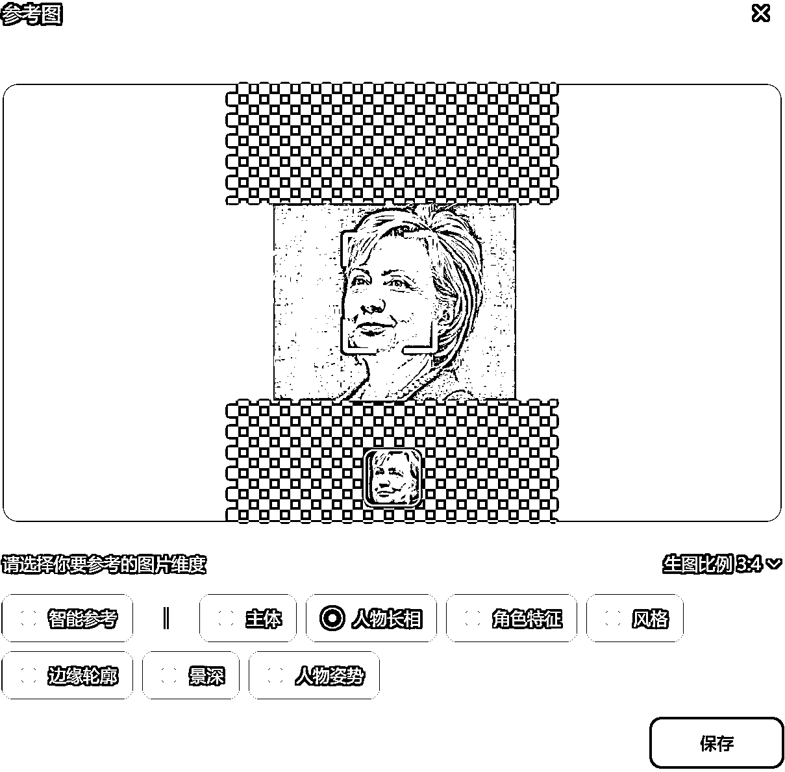

# 0成本，用1天时间成为AI肖像摊摊主

> 来源：[https://ib7ibjauw4.feishu.cn/docx/G3ekdeJM2o5MPHxWA3DcwvYmnbe](https://ib7ibjauw4.feishu.cn/docx/G3ekdeJM2o5MPHxWA3DcwvYmnbe)

原文首次发布时间为2024年11月，于生财：

* * *

大家好，我是Penny，从21年初加入生财至今很少发帖，最近在刀姐的群里读《别独自用餐》有感，觉得别独自摆摊，我遇到的问题，说不定别人也会遇到，写下了这个复盘贴。

# 一，摆摊背景

1，摊位免费。

我为了精进AI技能，报名了一个AI切磋大会的市集摊位，并且选择了难度较低的AI肖像写真摊主。摊位只需要填写个报名表就能进。当时距离市集时间还有一周不到。

2，专业背景，不会代码的小白一个，comfyui也不会。

报名后啃了三天的comfyui，三天无法速成，摆摊时一点没用上。

3，最后关头，找到了一个AI信息差。用即梦AI生成人物肖像，效果非常好。一天时间上手，第二天就去摆摊了。

# 二，肖像写真复刻

## 1，如何使用即梦生成定制化人物肖像写真

a.打开即梦官网链接：https://jimeng.jianying.com/ai-tool/home/?utm_medium=baiduads

b.如下图，选择写实肖像。

c.选择你心仪的模板，比如下图人鱼风，点击“做同款”。

d.为了生成定制肖像，一定要点击“导入参考图”。

e，点击“人物长相”。

这里随机找了一张希拉里的照片。

注意：很多名人的脸是无法使用生成的。比如我用特朗普的脸举例生成就失败了。

f，如下图，点立即生成。

g,查看生成好的照片。

是不是还挺美的？？

如果对生成照片结果不满意，可以再点击生成一次，如下图。找出最满意的1张或几张

## 2，一些参数

生图模型选择最新的2.0PRO，最有照片质感。

图片比例可改。八种比例可选。

图片尺寸可自由选择。

## 3，常用写真风格及其提示词

## 女人1：氛围感+灯光+皮草写真

提示词：氛围感下的人像写实摄影，模糊剪影在磨砂玻璃后，低角度，可爱的中国美女，皮草大衣，发光手写汉字高速动态模糊，画面层次丰富，8K画质，立体，半身像,身材高挑，高冷，大师摄影，虚影

## 女人2：镜头自拍+人像+故事感

提示词：用自己镜头的自拍照，人像双重曝光，渐变磨砂质感，胶片，弥散光学，优雅，高级感，淡雅简约，故事感

注意：这里主要取的是五官，所以选择了“参考人物肖像”.

## 女人3：黑白+艺术+虚化

提示词：黑白女子人物运动模糊摄影，面部特写，高级强烈的运动模糊和动感模糊，艺术的虚化效果，高级感，模糊到只看得出人物轮廓，看不清楚五官。朦胧感，超现实主义，蓝灰肉丝变背景，加艺术签名

## 女人4：动物+守护+少女双马尾

提示词：人物高端旅拍，场景重庆李子坝轻轨战，少女写真，胶片质感。女孩（双马尾）的自己的猫咪(加菲，胖嘟嘟）穿着同款浅色嘻哈服，人像半身，低机位仰视，轻轨从高楼中穿出，蓝蓝的天空。女子和猫咪坐在轻轨下跟轻轨互动，做出一些有趣可以的动作。取景干净简洁，背景虚化，光线柔和自然

## 女人5：动物+狼族公主+少数民族

提示词：一个狼族的公主，表情忧伤，凌乱的蓝色头发，穿着少数民族服装，样子精致，一定狼头帽子，一条少数民族银饰，背景是幽暗的山谷，有雪的山峰，高对比的色彩，高品质，高清晰

## 女小孩：儿童摄影+花朵

提示词：儿童摄影写真《乐开了花》，头上开出了一朵花

## 男小孩：幼儿园+毕业服

提示词：单人毕业照，一个可爱幼儿园小男孩，穿着毕业服，可爱动作，表情可爱，旁边一只小博美，幼儿园教室背景，超高清，细节丰富，彩带，气球

（看的出来这是参考了哪位男星小时候吗？猜中了文末送小礼品）

## 男人：黑白摄影+帅气模特青年

提示词：黑白摄影，老照片，街头摄影，朦胧的光晕，帅气模特青年，五官深邃，立体感强，倚靠在巴黎街头的黑色路灯柱，等待，高斯模糊身后行走的路人，抱着一束浅色玫瑰花，帅气，强烈的明暗对比

## 4，消耗积分

文生图目前每次消耗2积分，垫图生图每次消耗2积分。

即梦每天登录送66积分，等于可以免费做33次定制化人物肖像写真。一次4张，33X4=132张图。如果不够用，可以用一个新的手机号再注册个即梦账号。免费的足够用了。

基础会员比免费版，多了去水印功能。

免费去水印的网站和软件也有很多，比如这个https://www.apeaksoft.com/zh-CN/watermark-remover/

# 三，一些“风凉话”

1，门槛越低，短期内涌入的人越多，后期赚钱越难。

根据我不多的摆摊经验来说，AI肖像写真短期内仍然能赚钱。

但风口急剧收缩。

比如我摆摊的时候，卖的是九块九体验价。可以开张，有人买，但赚钱不多。

同一个市集里，有位小姐姐和我卖的是同样的产品，报价是88元一张，图片差不多，增加的是模板更多，用到的工具更多，以及照片可以现场打印，并放置在相框中，然后再加送一个拼夕夕买的徽章。生意显而易见的门可罗雀。

2，趋势是精细化、流程化

还是同一个市集里，还有一个别人家的摊子卖的也是AI写真定制，但是她卖的冰箱贴和徽章又更多一些，生意就更好一些。

再有的摊子是升级版AI定制化，有的comfyui用的特别好，还有的结合了更新的技术。

AI+摆摊，也是八仙过海，各显神通呢。

最后放一个不露脸的社恐摊主照。

以上就是我的AI肖像写真摊摆摊复盘了，分享给大家，说不定有用呢

* * *

# 四、25年1月更新

AI肖像写真技术的门槛低，到了目前已经卷到了红海市场。尤其现在利用美图秀秀、抖音等APP也可以用AI进行不同风格的图像转绘了。因此，对AI感兴趣的年轻人，实际上对AI写真的付费意愿，并不是很高。

有几点建议：

1，不要投入过多硬成本。照片打印机可以在闲鱼上按天租赁，相框在拼夕夕和1688上买很便宜。摊位尽量找免费或低价的摊位。

2，准备快速出图的工作流。即梦的写真出图，有抽卡概率，可能需要多抽几次，时间上太慢，需要等待，等待会导致客流流失。会用liblib使用comfyui工作流的同学，可以多用用liblib，上面有很多会员可以免费使用的写真工作流，人物和宠物的都有许多。

3，花一点时间选择摆摊地点。摆摊地点在哪，决定了会有哪些人会经过你的摊位。也就很大决定了这次出摊是否能够成功的概率。

4，实践出真理。一千个摊主有一千个哈姆雷特。欢迎分享你的摆摊经历。