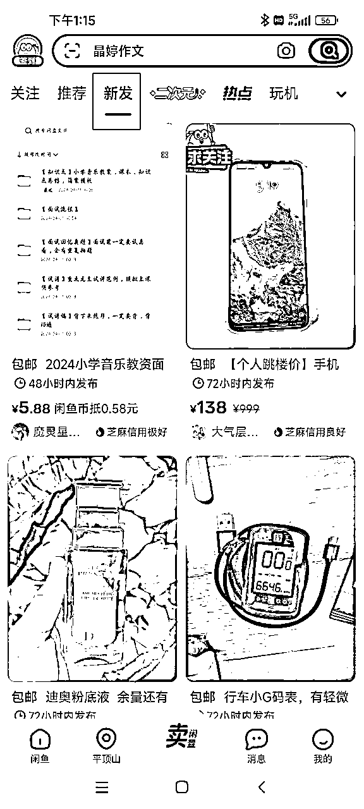

# 《闲鱼虚拟资料实操经验分享：选品策略、收益最大化与避坑指南》

> 来源：[https://q46sa8ckj6.feishu.cn/docx/G3iPdW29LoBnR0xZxwKcpVSXnAb](https://q46sa8ckj6.feishu.cn/docx/G3iPdW29LoBnR0xZxwKcpVSXnAb)

大家好，我是初阳，生财第8期的新圈友，一名刚大学毕业初入职场的菜鸟，第一次在生财分享内容，希望这篇闲鱼虚拟资料的实操分享可以帮助到即将参加闲鱼航海的伙伴

闲鱼虚拟资料是非常适合新人赚到第一块钱的项目

我是在七月初接触到的这个项目，通过两个月的时间变现了有1.2w+的收益（两个闲鱼账号）

今天我将从以下5大重点方向和大家进行分享

1.  店铺类型

1.  选爆品方法

1.  扩大收益的方法

1.  闭坑指南

1.  账号运营心得

# 一、店铺类型

## 1\. 店铺类型概述：杂货铺 vs. 垂直铺

在闲鱼平台，销售虚拟资料的店铺一般有两种类型：

*   杂货铺：上架各种类型的虚拟资料，如纪录片、电子书、小说、考试笔记等，覆盖面广。

*   垂直铺：专注于某一类虚拟资料，如考证笔记、电子书、短剧或小说，产品内容非常垂直。

## 2\. 优缺点分析

*   杂货铺

*   优点：灵活应对市场需求，易于上架热门爆款，产品选择丰富，出单快。

*   缺点：用户粘性较低，复购率相对较低。

*   垂直铺

*   优点：目标用户明确，用户粘性和复购率较高。

*   缺点：需要专有资料渠道，否则可能面临版权或下架风险，选品面小，需精准选品。

## 3\. 选择建议

*   新手推荐：选择杂货铺起步，因可选择的商品多，出单更容易，快速赚到第一笔钱。

*   垂直铺策略：如果有资源或专有资料渠道，可以选择垂直铺，关注市场需求和热门垂直赛道，可参考生财九月的小红书教育资料引流篇，里面有专门的垂直赛道分类。

目前闲鱼平台常见的虚拟资料卖家，大多数是以杂货铺的形式在运营，这一点和小红书虚拟资料还是有很大的差别的，小红书更多的靠笔记来引流，所以要求笔记相对更垂直一点，而闲鱼平台是直接在售卖商品，两个逻辑有差别，大家请注意这一点！

# 二、选爆品方法（适用于做杂货铺）

做闲鱼虚拟资料，最重要的就是选品，我们不断的发布商品，其本质是在不断的测品，测哪个品会爆，如果选品选的好，则可以提高我们出爆品的概率。

以下是我常用的几种选爆品的思路：

## 使用AI辅助选品

对于刚开始做闲鱼虚拟资料、没有选品方向的新人，可以借助AI工具（如ChatGPT）获得灵感。通过询问AI，你能找到初期选品的切入点。

比如，我刚开始时询问AI推荐适合闲鱼销售的虚拟资料，并根据建议发现了法语自学资料。搜索后发现闲鱼平台只有一个卖家在卖这款资料，且没有提供自动发货。我迅速跟卖后，最终卖了50多单。

## 刷推荐页选品

我店铺大部分产品是通过刷推荐页找到的。一旦搜索虚拟资料类产品，闲鱼会推荐更多相似商品。我当时每天浏览约200多个产品。

推荐页选品标准：

*   a. 浏览量和“想要”数：优先选择“想要”数高的产品（如100+或500+），并确保“想要”和浏览量的比值接近1:10，这样更容易出单。

*   b. 留言区：查看留言是否集中在最近一个月内。如果最近几天有很多询问，且“想要”和浏览数较高，则说明产品需求旺盛，可以跟卖。

*   c. 卖家主页和动态：

*   如果产品下无留言，可访问卖家主页，查看未关闭的动态，锁定热销产品进行跟卖。

*   如果动态被关闭，查看评价页，点进买家近期评论，确认热销产品是否符合预期，或挖掘其他爆款进行跟卖。

*   d. 异常值标识：

*   留意推荐页中标注的“本月销量领先”或“72小时内发布”等标签，说明产品近期热销。

*   例如，我的第一个大爆品就是通过发现一个“72小时内发布”的产品，点击后看到“想要”数已达70+，迅速跟卖，最终成为爆款。

这些方法旨在甄别近期爆款，避免因虚拟资料的季节性导致跟卖无效。要确保选择当前需求量大的产品，而非过时的爆款。

## 看新发页

刚刚在2.d里面有提过48小时内发布、72小时内发布，但那个是推荐页刷到的，占少数部分，而新发页则全都是近几天新发布的，每天也可以抽一点时间刷一刷这个板块，也会发现一些潜在的爆品

## 点进一个商品页之后，往下滑有个为你推荐

在为你推荐里面，找数据好的产品，跳转到其他卖家的产品页面，按照第二条里的b、c、d三条判断是不是近期爆品，选择尝试去跟品

## 关注一些卖虚拟资料的卖家（要求该卖家有多个100+想要的爆款产品，且最近还在持续上品）

平时在不知道选什么品的时候，就可以看一看自己的关注列表，去他们的主页看看，看一看他们的动态和买家评价，从而找到一些最近好卖的产品

以上五条，就是我做虚拟资料常用的选品思路，其中最常用的为刷推荐页，还有其他一些选品的渠道，大家可以自行摸索

# 三、如何扩大收益

众所周知，闲鱼的虚拟资料价格很卷，很多在小红书平台客单价10+的产品，在闲鱼平台可能都是1块钱在卖，在我最初接触闲鱼虚拟的时候，理念也是要多降价，发同款的时候，要比上家低一点卖，起初我确实是这样在卖，别人卖五块的品，我卖一块多，这样做确实会更容易出单，但收益会很低很低

和大家分享两个扩大收益的方法

## 涨价

涨价不是所有的产品都适合，涨价适合的是你的产品发布几天后，突然开始爆了，该产品的曝光正处在上升期时，可以涨价

我的这个卖5元的品，最初我发布的时候，价格是1.69，发布后的两天，想要就达到了70+，然后我直接把价格提到了5元，涨价之后，流量不但没有减少，反而越来越多，最终大爆，成交了有一千多单

这个品，最初我的定价是2.68，在成交了十几单之后，当时也敏锐感觉到产品开始爆发，然后就涨价到3.99，最终想要到现在达到了596

还有我的一个朋友，当时卖了一本书，定价是1.99，连着两天突然卖出了很多单，后来我让他涨价到3.99，流量不仅没有减少，反而成交和收益都直接翻倍

还有很多案例，就不再一一列举了，通过以上三个案例，想告诉大家的是，如果你的一个产品近期突然开始起爆了，在流量爆发期，可以对该产品进行涨价，涨价之后，流量和收益不仅不会减少，反而可能会成倍的增加

当然，涨价到多少，不是随意定的，我的建议是参考该产品在闲鱼的均价水平，可以适当提高50%~200%，具体涨多少，还要参考每个产品本身的价值

## 选择高客单的蓝海产品

该方法对选品的要求会很严，而且该方法本质也是比别人的客单价低，只不过上家的价格很高，在八月份的时候，大钟哥告诉了我一个品，当时在闲鱼平台卖这个品的卖家就两三个，他们的定价有26、18.8、13.6，然后我卖9.99，卖爆了，三天靠这个品赚了1700+

该方法对选品的要求更高，但是一但卖爆，收益同样很可观

如果你是现在在做闲鱼虚拟资料或者准备入局，那么我推荐你先去试一试我说的第一种方法，先定低价，低价如果起流量了，再进行适当的涨价，这种方法相对来说会更容易成功，难度也会小很多

# 四、避坑指南

在闲鱼，有两类产品一定要注意不能去碰：色情类、强版权类

## 色情类

重点为黄小说、黄漫、黄游戏，这类产品在闲鱼平台很容易出单，但属于得不偿失的类型，其中危害大家自行了解

## 强版权类

图片中带有机构名称的、有老师名字的，比如学e思、赵海凡讲银行、kai叔讲故事等等

以上两种类型，尽量不要去碰，轻则封号，重则打官司赔偿

# 五、账号运营心得

给大家分享一下我当时运营账号的心得，希望能给大家带来一些启发

1.  一机一号一卡，建议留一个空白闲鱼号专门找上家进货，如果拿卖东西的号去找上家进货，大概率不会有售前、售后，甚至有的卖家看到你是同行，会直接不卖你商品、拉黑

1.  持续发品，初期每天建议上架10个品，可以上午3个、下午3个、晚上4个，也可以根据自己的时间上品

1.  没有鱼小铺，上满之后，开始从第一天上架的商品中，下架替换浏览低、曝光低、不出单的品，此时每天保持上架2~3个，下架2~3个品即可，依然保持持续上品，让店铺保持50个品

1.  如果有鱼小铺，持续保持每天上架10个品即可，并定期优化自己的产品

1.  初期的上品可以直接抄，但熟悉之后，商品的首图和标题尽量自己重新做一下，因为我店铺大多数能爆的品，首图和标题我都有一定的改动

坚持以上步骤和方法，相信你一定可以在闲鱼快速赚到你的第一桶金

以上就是我做闲鱼虚拟资料的一些核心干货，分享给大家，希望可以帮到大家

分享这篇内容，我有几个小目的哈

1.  帮助想做闲鱼虚拟这个项目的伙伴们更容易拿到结果

1.  认识更多志同道合做副业的朋友

最后，特别感谢生财的内容负责人莞尔老师对我内容的指导