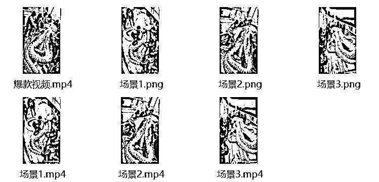
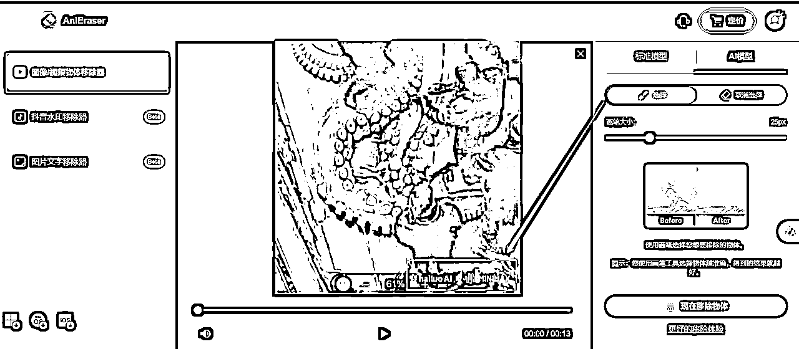
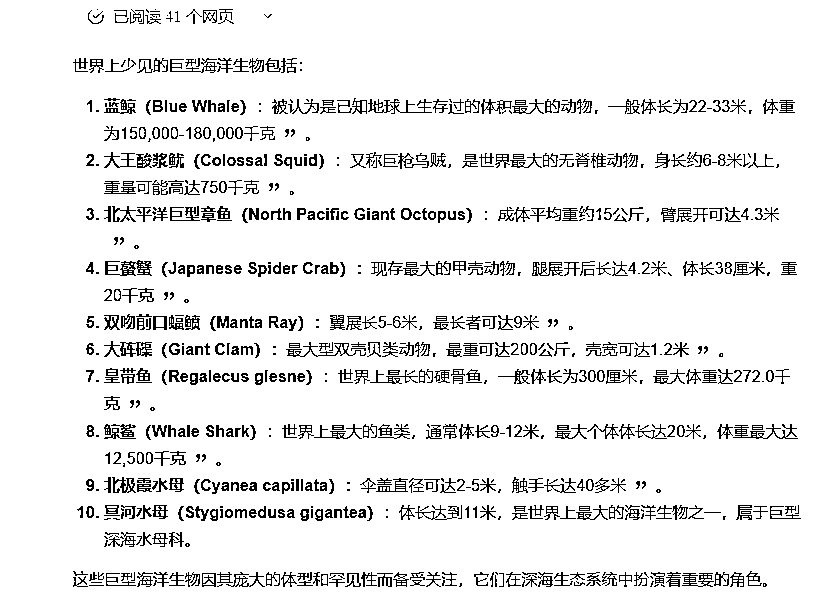
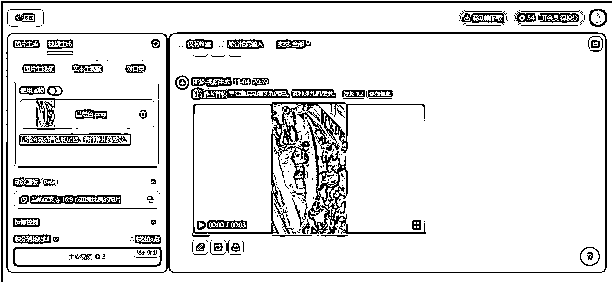

# 新手如何高效生成AI视频，冲进Youtube掘金？

> 来源：[https://gwlxqear42r.feishu.cn/docx/N2mwdTtvyonnSTxp7hScXw1Unhz](https://gwlxqear42r.feishu.cn/docx/N2mwdTtvyonnSTxp7hScXw1Unhz)

这周看了亦仁大大发布的Youtube超级标，感觉大有可为，于是立马开干！

周末仔细研究了一些AI频道，按照龙珠悬赏的题目，写了这篇帖子。帖子主题是围绕对标账号，如何高效1比1复刻爆款视频，并且让chatgpt帮忙制定了3个月的行动方案和计划。

第一次在生财写帖子，希望对圈友能有所帮助，也欢迎有意进入youtube掘金的圈友一起多多交流~~

# 一、账号分析

账号：Deep Sea Discoveries

### 分析理由

①爆款比例高。总共74个视频，有9个千万播放量的视频（占比12%），有25个百万播放量的视频（占比34%）；

②涨粉迅猛。频道于2024年2月1日注册，9月23日开始发布视频，2个月内订阅者人数接近40W；

③频道收益高。根据socialblade估计，该频道预计月收入$37.4K - $599.1K. 从历史播放量来看，估计该频道10月已符合YouTube合作伙伴计划要求，从第8个视频开始即可享受广告收益（这个频道的变现速度太快啦🤣）；

④低成本、生产效率高。无需露脸，视频图像和背景音乐全部可以用AI生成，独享收益（但是值得注意：爆款视频评论区已有多名观众指出视频为AI生成，并且部分视频主图有点夸张，可能后续会有负面影响，不确定是否会被限流或者取消收益）

### 内容研究

我用RPA爬取了11月1日之前该频道所有视频的标题、观看次数、点赞数和发布日期，并和ChatGPT一起分析内容。

初步观察到该频道的爆款视频主题集中在巨型海洋生物/动物救援。

巨型海洋生物视频的主图均是罕见、巨大的海洋生物，激起了观众的好奇心和猎奇欲，常用的话题标签是：#GiantSeaCreatures #FishingDiscoveries #OceanMysteries

动物救援视频的主图是人类帮助极地动物（北极熊、企鹅）的场景，评论区主要是称赞人类的善行和对极地动物的珍惜，常用的话题标签是：#WildlifeConservation #ArcticAnimals

因此，如果我要做类似的账号，第一批选题可能是：

*   巨型海洋生物捕获：展示巨型鱼类、章鱼或其他海洋怪兽被捕捞的场景。

*   深海救援故事：涉及拯救或帮助深海生物的视频，如救援搁浅的海洋动物。

*   罕见生物特写：探索深海中不常见的物种，如透明生物、巨型螃蟹、罕见的珊瑚等。

*   惊奇打捞物：拍摄打捞过程中发现的意外之物，比如遗失的古董、船只残骸等。

# 二、视频复刻过程

我选择复刻播放量最高的视频，视频是巨型章鱼被捕捞到渔船上处理的场景。总共12秒，由3段场景拼接而成。

复刻过程中使用的工具有Youtube视频下载工具、AI视频生成工具（海螺AI、即梦）、剪辑工具（剪映）、视频水印去除工具（万兴优转），接下来是视频复刻过程：

### 下载源视频

下载Youtube视频，并且将视频中出现的3段场景截图保存，并且按照场景的出现顺序标记图片（欢迎圈友推荐更加简洁好用的YouTube视频下载工具🙌）

### 生成AI视频

将图片逐个导入海螺AI，生成3个场景的视频。目前国内用户可以免费使用海螺AI，但是用提示词生成视频需要排队，排队的人越来越多，至少也要等好几个小时，所以我直接用图片生成视频，就无需排队，3分钟左右即可。

海螺AI真的值得夸夸：生成的视频还原度非常高，几乎和源视频一模一样！附上官方教程

### 合成视频

将3段视频上传到剪映合成。左边是源视频，右边是我生成的视频，你们觉得有几分相似？

### 去除视频水印

由于海螺AI生成的视频是带有水印的，所以还要用工具去水印。我目前用的是万兴优转，选择去水印区域移除即可，去除效果一般，后面两个场景还是有水印，而且免费额度有限制，后续还要寻找更好用的去水印工具，欢迎圈友推荐👀 最后，大家可以瞅瞅导出的无水印视频VS源视频对比👇

# 三、视频二次加工

没想到这篇帖子得到了亦仁大大的点赞，并且收获了一个好问题：“在这个复刻的基础上，有什么微创新的想法没？比如，把鱿鱼换成其他的？”

这个好办，把图片中的主体换成其他巨型海洋生物即可！于是，我去问了kimi：世界上有哪些少见的巨型海洋生物？kimi给我提供了10个答案。

我选择皇带鱼作为替换主体，输入指令：将图片中的章鱼换成皇带鱼，其余背景人物不变。

用的AI生图工具是即梦，它的好处在于可以生成4张图片供参考，还可以选择喜欢的生成图做进一步的微调。左侧还有调整精细度的选项（但是使用下来，个人感觉：精细度越高，生成的图片AI感反而更重）

目前普通用户每日登录即可获得66个免费积分，图片生成一次要扣2个积分。

即梦也有视频生成的功能，视频生成一次要扣3个积分。

于是我用同样的图片+提示词，借机对比了即梦和海螺的视频生成效果。没想到，即梦生成的视频中规中矩，反倒是暴露了海螺的缺点：不稳定。

在海螺用同样的图片+提示词生成视频，竟然在第2秒换了水中的场景。我想应该是因为我加了提示词，之前的图生视频都是只有图片，于是我就按照之前的方式只传了图片，结果又提示：视频内容不符合社区规范，生成失败😅

可能这正应了清华人工智能学院沈阳教授的话：你能驾驭AI，AI生成的内容体现的是你的想象力和确定性。你不能驾驭AI，AI生成的内容体现的是它的想象力和不确定性。

# 四、同类频道

我通过对标频道的视频标签和主题，来寻找类似的频道，并且用RPA爬取了基本的频道信息，再去socialblade查看预测频道的月收入，整理出了10个类似频道的信息。如果圈友还想研究得更细，可以用RPA逐个爬取频道的视频信息来分析。目前已经出现多个模仿Deep Sea Discoveries的频道，并且短期涨粉也很快。

# 五、行动方案

### 第1个月：赛道研究&内容规划

1.  市场与受众分析

*   确定目标受众群体：年龄层、兴趣点、观看习惯。

*   研究竞争对手和成功案例，找出热门内容类型和关键因素。

1.  选题与内容方向确定

*   制定10-15个潜在视频主题，确保符合目标观众兴趣并有潜力爆火。

*   列出相关话题关键词，确保视频能优化SEO，增加搜索曝光。

1.  工具与资源准备

*   调查并选择视频剪辑、AI内容工具（如海螺、可灵等）。

*   准备所需的素材库（如视频、图片、音效），确保版权合规。

1.  初步视频脚本撰写

*   为前3-5个视频撰写初步脚本，涵盖视频开头、主内容和结尾。

*   确保内容结构清晰，具有吸引力和信息量。

* * *

### 第2个月：内容制作与发布

1.  视频制作

*   使用AI工具和剪辑工具制作首批视频，确保质量和风格一致。

*   在制作过程中记录每一步骤，积累经验，形成SOP，以便后续优化。

1.  发布与推广策略

*   争取每日发布1个视频，保持更新频率。可以在周末集中制作，然后设置定时上传。

*   利用YouTube的SEO最佳实践优化标题、描述和标签，提高视频的搜索排名。

1.  数据跟踪与反馈

*   通过YouTube Analytics跟踪观看量、点击率、观众互动等关键数据。

*   根据数据分析，识别受欢迎的内容类型和不足之处。

* * *

### 第3个月：优化与扩展

1.  内容优化

*   针对表现较好的视频，制作相关主题的系列内容，吸引持续关注。

*   结合观众反馈优化视频风格、长度、节奏等。

1.  增加互动

*   在视频中加入引导性问题，激励观众留言互动。

*   通过回复评论和观众互动，增加粉丝粘性。

1.  探索变现机会

*   达到YouTube合作伙伴计划的要求后，开启广告收入。

*   探索其他变现渠道，如赞助合作、产品推广等。

1.  总结与调整

*   评估3个月来的频道增长、内容受欢迎程度和流量来源。

*   制定下一阶段的改进策略，为接下来的内容制作和增长目标打下基础。

* * *

### 行动计划追踪表

# 六、需要克服的困难点

### 1\. YouTube Shorts的变现机制

*   问题：要获得广告分成，必须达到YouTube合作伙伴计划（YPP）的要求，必须满足在过去 90 天内获得 1,000 名订阅者，并且有效公开 Shorts 短视频观看次数达到 1,000 万次。

*   解决方案：参考对标竞对的爆款视频选题，提高爆款视频产出率。后期可以根据shorts视频的反馈，推出长视频（例如爆款shorts的延长版、每月视频合集），将Shorts与长视频相结合。

### 2\. 观众流失率高

*   问题：由于Shorts视频的内容通常较短，观众容易一刷而过，导致观众粘性较低，难以建立忠实粉丝群。

*   解决方案：通过高质量、创意十足的内容吸引观众，保持风格一致，吸引观众持续关注。利用视频末尾的引导（例如提示观众订阅或观看长视频）来增加粉丝的粘性。

### 3\. 版权问题

*   问题：Shorts视频常常使用流行音乐或视频片段，容易触发版权警告或限制，从而影响视频的流量和变现。

*   解决方案：尽量使用YouTube提供的Shorts音乐库或获得授权的音乐，避免使用未经授权的素材；使用原创内容确保版权合规。

### 4\. 视频制作效率要求高

*   问题：为了吸引观众持续关注，YouTube Shorts的发布频率一般较高，创作者需要定期更新内容，制作效率要求较高。

*   解决方案：建立内容制作SOP，提前规划并批量制作多个视频；使用高效的剪辑工具和模板，节省制作时间。

### 5\. 短视频的SEO优化难度

*   问题：由于Shorts视频的长度有限，标题和描述的空间较少，难以像长视频那样优化SEO来吸引搜索流量。

*   解决方案：尽量使用热门关键词，并在标题和描述中明确视频内容；利用相关标签增加曝光率，并确保视频封面和标题足够吸引人。

### 6\. 流量波动大

*   问题：YouTube Shorts推荐机制较为随机，导致视频流量波动较大，有时视频爆火，有时则几乎没有流量。

*   解决方案：发布多样化的内容，保持高频更新，以增加被推荐的机会；同时，通过社交媒体平台推广，增加流量来源的多样性。

### 7\. 缺乏观众反馈

*   问题：由于Shorts视频时间短，观众往往不会留下评论，创作者较难通过反馈了解观众偏好。

*   解决方案：尝试在视频中提出问题或引导观众互动，以增加评论量；关注点赞和观看量的变化，判断观众的偏好。

经过这番分析，我感觉YouTube值得入场。一些千粉的频道都能跑出百万级别的视频，有些视频质量不咋地也有好几万播放量。而且Youtube的盘子够大，用户数量有二十几亿，新手小白如果认真干，比别人多想一点、多做一点，也是能吃到一些红利的。接下来就是行动啦！开干！