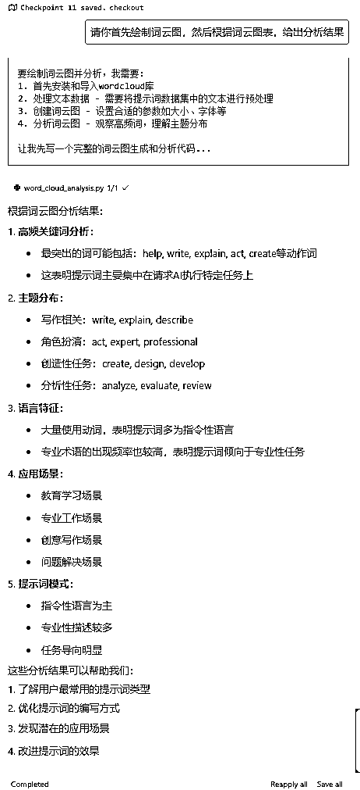
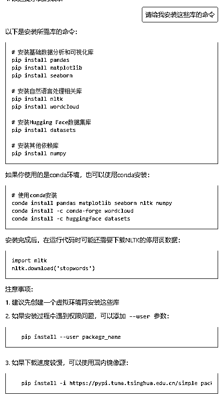

# 如何使用Cursor进行数据可视化和软件项目可视化

> 来源：[https://qsbog43f8e.feishu.cn/docx/HBdHd8PzyoeJBYxI1hHcKIprnQg](https://qsbog43f8e.feishu.cn/docx/HBdHd8PzyoeJBYxI1hHcKIprnQg)

各位圈友好，我是Time，向大家展示一些使用cursor进行数据可视化和软件项目可视化的案例。

# 一、可视化的必要性

## （一）软件项目可视化的必要性

大家最近在做项目时，你有没有遇到这些烦恼：

*   新来的同事看代码一脸懵，解释半天还是不明白

*   改完代码忘记更新文档，结果文档越来越不靠谱

*   开会讨论架构，光靠说半天说不清楚

作为同时写过好几年文档和代码的开发者，我太理解这些痛点了。

说实话，我们都知道项目需要文档和架构图，但现实是：

*   写文档特别耗时，写着写着就忘了

*   画图要切换软件，没几个人愿意折腾

*   代码改了文档没改，慢慢就没人信了

但是吧，不写文档不画图也不行，特别是项目越做越大的时候：

*   新人看不懂代码，接手困难

*   团队沟通效率低，讨论费劲

*   维护起来特别累，改bug都不知道从哪改起

前段时间，我发现了个特别实用的组合：Cursor + Mermaid。

这套工具真的能帮我们：

*   写代码的时候顺手就把文档做了

*   用简单的文本就能生成专业的图表

*   再也不用担心文档和代码对不上了

听起来挺不错？来看看具体怎么用👇

上面的内容是AI生成的，但是深得我心，而文字内容的gpt生成，大家都比较熟练了，这里我聚焦介绍软件或代码相关的可视化制图。

同时为了避免受限个人经验而给出错误的展示，提前向一些圈友请教验证了这些图表确实都会用到。


## （二）数据可视化的必要性

最初，我只想写软件项目的可视化，但是后来经过圈友A和不愿透露姓名的阿紫老师的建议，补充应用范围更广的数据可视化应用案例/教程。


## （三）前置说明

本文默认大家已经具备cursor的基本使用，已经完成了cursor安装的前置步骤，并且会安装插件以及向cursor提问，如果对于cursor和编程是零基础朋友，可以阅读我9月份的帖子：0代码AI编程重塑你的编程体验：Cursor使用教程

以及近期圈友@阿紫分享的帖子，阿紫通过探索0基础学员们的卡点，非常详细的展示了一个项目应该怎么从0开始，如何根据需求转化成cursor能够理解的软件需求，非常值得一读：如何让小白学会用Cursor完成复杂项目

此外，对于专业程序员维护复杂项目的使用可以参考圈友@大铭的帖子：程序员视角下的Cursor软件深度使用与维护经验分享

* * *

# 二、学习python数据可视化

不论代码项目大小，以及是自己编程或学习其他项目，学习思路相似。

## （一）萌新初窥数据可视化

以完全不懂数据可视化的角度，先绘制一些图表，基于特定数据进行可视化处理的例子在（二）。


先让cursor给我们编写几个示例代码，提示词如下：

请给我编写 Matplotlib、Seaborn的示例数据可视化图表代码，分别创建python文件进行编写


下面是几个库仅限于示例，实际绘制时根据实际情况进行选择。

### （1）Matplotlib图表


### （2）Seaborn可视化

下面让Cursor展示了10个最具代表性的Seaborn数据可视化图表

第一次提问让它回答有哪些代表性的图表：Seaborn最典型的10种可视化图表是什么

第二次提问让cursor写代码：请给我编写python代码，展示Seaborn这10种最具有代表性可视化图表，创建一个新的py文件

第三次提问由于10个图表放在一张图上难以观看，于是重新组合排版：前10个图表，请分为每4个在一张图上展示


由于散点图、折线图、柱状图这些和前面Matplotlib绘制效果相似，于是手动让cursor移出了，并且凑了（条形图、箱线图、小提琴图、热力图）、（回归图、联合图、计数图、核密度图）组合展示了2张大图，以及额外展示了完整版联合图和成对关系图。

当然，有些图表我目前也不懂是什么含义，现在看着酷就完了，而专业数据分析人员应该具备以下两个能力之一：

*   明确所需图表含义，然后使用cursor绘制目标图表，这样才能够向客户或领导解释图表所要表达的意思；

*   对于不理解的图表，需要让cursor给出解释，理由同上。


下面是上述8个图表的代码文件，感兴趣的可以直接拿走跑一下。

### （3）Plotly交互式数据可视化


下面是这5个Plotly交互图表的代码，大家可以拿走玩一下，其中鼠标放置在图表上时，会显示数据，3D散点图也可以放大缩小，不过现在我只是为了展示种类，所以没有进一步优化交互和美工处理。

## （二）基于数据集进行数据可视化

上一小节展示了这些图表，但是从cursor生成的代码中看，每一个图表的绘制都只有不到10行的代码，这种展示用的代码显然无法应用于我们实际工作中，同时我也好奇示例图表的数据源是从哪里来的（假装没有看到代码中的注释）。

```
import seaborn as sns
import matplotlib.pyplot as plt
import pandas as pd
import numpy as np
from matplotlib import font_manager

# 设置中文字体
font_path = 'C:/Windows/Fonts/SimHei.ttf'  # Windows系统黑体路径
chinese_font = font_manager.FontProperties(fname=font_path)

# 设置图表风格
sns.set_style("whitegrid")

# 加载数据集
tips = sns.load_dataset("tips")
flights = sns.load_dataset("flights")
iris = sns.load_dataset("iris")

# 第一组图表
plt.figure(figsize=(15, 15))

# 1\. 条形图
plt.subplot(2, 2, 1)
sns.barplot(data=tips, x="day", y="total_bill")
plt.title("1\. 条形图 (Bar Plot)", fontproperties=chinese_font)
plt.xlabel("星期", fontproperties=chinese_font)
plt.ylabel("平均账单", fontproperties=chinese_font)

# 2\. 箱线图
plt.subplot(2, 2, 2)
sns.boxplot(data=tips, x="day", y="total_bill")
plt.title("2\. 箱线图 (Box Plot)", fontproperties=chinese_font)
plt.xlabel("星期", fontproperties=chinese_font)
plt.ylabel("账单分布", fontproperties=chinese_font)
```


可以看到Seaborn库自带了tips、flights、iris数据集，注意上面回答的最后一句话“方便用户进行数据可视化的练习和演示”。

于是追问怎么利用这些数据集进行数据可视化的学习：基于tips或flights或iris数据集，如何进行数据可视化的学习？


根据回答，就可以看到使用histplot就可以查看直方图、使用heatmap就可以查看矩阵数据，使用regplot就可以添加回归线，

下面使用huggingface中的开源数据集进行演示，例如下面的fka/awesome-chatgpt-prompts，看起来像是ChatGpt的提示词，


点进去后不知道怎么用，于是继续让cursor干活，

怎么下载@https://huggingface.co/datasets/fka/awesome-chatgpt-prompts?sql=--+The+SQL+console+is+powered+by+DuckDB+WASM+and+runs+entirely+in+the+browser.%0A--+Get+started+by+typing+a+query+or+selecting+a+view+from+the+options+below.%0ASELECT+*+FROM+train+LIMIT+10%3B 这里的数据集


下面是安装过程（我是在虚拟环境中安装的，所以没有在cursor终端直接执行安装命令，初学者可以不必理会）


安装完成后，在cursor中复制前面提示的加载数据集和访问数据代码，执行效果如下，说明加载成功了，下面开始使用这个数据集进行演示。


以非专业人士的角度，不知道拿到数据集后如何下手，问cursor：读取fka/awesome-chatgpt-prompts数据集，请推荐合适的数据可视化图表，以供专业人士进行分析，当前步骤只需要回答合适的图表类别以及图表意义


下面挑选几个图表进行绘制

### （1）词云图

由于这个数据集中都是句子，优先选择词云图，继续提问，让cursor绘制词云图

请你首先绘制词云图，然后根据词云图表，给出分析结果




其实从这里的回答，我们已经能够得到以下结果：

*   gpt使用者最常使用的词是help、write、explain、act、create，让gpt或写或解释或执行某些动作；

*   gpt最常执行任务是：写作、定义角色、创造性任务和分析性任务；

*   大量使用动词，让gpt执行这些写作或创造性动作；

*   常用场景是教育学习、专业工作、创意写作和文件解决……

当然，这些是cursor读取数据进行分析的，下面绘制词云图然后看图能否得到这些信息。

由于有些库我没有安装，于是让cursor给出安装命令



安装完成后，执行代码：


下面是绘制的词云图，我来粗略的分析一下：

*   想(want)让gpt帮我们做某件事情，或者执行(act)某个动作

*   让gpt向我们提供(provide）什么样的结果

*   首先(first)做什么

大致意思是这样的，我分析的不专业，可以让cursor进一步的分析，在上面回答的基础上扩展，这里我就不再演示了。


### （2）条形图

继续绘制条形图

```
绘制形图 (Bar Plot)
用途:展示角色(act)的分布情况
意义:直观显示不同角色的出现频次，帮助理解数据集中最常见的角色类型
```


我无法理解这个条形图，请你解释，并且解释要和数据相符


根据他的提示，让cursor修改，修改后的图表如下：


由于数据量较少，所以很多角色出现频率是1，只有一个出现频率为2，结果是正确的。

### （3）自由发挥吧

让cursor推荐合适的图表


其中条形图和词云图是刚才已经绘制的，说明这两类图表确实重要，而第一个和第三个的含义有重复，说明相同的数据可以使用不同的图表进行展示。

而第二个提示词长度分布，可以看出大部分提示词分布在300~600个单词之间，其中450个左右单词频率最高。

以上就是关于数据可视化的一个简单演示。

* * *

# 三、软件项目可视化实战

## （一）Mermaid基础介绍

代码的可视化在很早前就有了，之前是使用UML直接绘制，而现在在UML的基础上，有了一些更加成熟的产品，Mermaid就是一个比较典型的项目。

Mermaid是基于 JavaScript 的图表工具，可呈现 Markdown 启发的文本定义以动态创建和修改图表。


Mermaid：代码即图表

*   使用文本定义图表

*   支持多种图表类型

*   易于版本控制

*   实时渲染预览

建议插件：

Markdown Preview Mermaid Support：Markdown中预览Mermaid

Mermaid Markdown Syntax Highlighting：Markdown中Mermaid语法高亮


## （二）为什么需要绘制这些图表：更加专业的回答？

在文章开头，我笼统的解释了为什么需要给代码绘制诸如流程图、时序图、类图这些图表，这基本上能够解释了，不过咱们演示cursor的应用，为何不继续使用cursor进行优化呢？请看vcr：

直接开问

请解释，为什么要给代码绘制流程图、时序图、类图等各种图表

回答如下：


第一版回答格式我是比较满意的，但是cursor死板的只以我提问的流程图、时序图和类图进行回答，强迫症不能接受，后面继续追问，为了不占用太多篇幅和冗余，下面只贴Prompt过程，不再一一贴回答图。


最终，基于cursor回答，以及手动整合修改，下面展示效果。

### 基础图表展示

下面展示一些常用图表，图表左侧附带了Mermaid代码，大家看一下就可以，可以不必过于关注，本次重在演示如何使用cursor帮我们自动生成这些图表，而深度使用用户，建议去官网查看Mermaid或UML语法。

#### （1）流程图：展示业务逻辑和数据流

大家最常接触到的图片是流程图，首先以流程图进行展示，那么为什么要绘制流程图呢？


流程图由节点（几何形状）和边（箭头或线条）组成，可以辅助系统设计、提升代码的可理解性，并且能够促进团队协作。

Mermaid 代码定义了如何制作节点和边，并适应不同的箭头类型、多方向箭头以及任何与子图的链接。

```
````mermaid
flowchart TD
    A[用户提问] --> B{是否有缓存}
    B -->|是| C[返回缓存]
    B -->|否| D[查询向量库]
    D --> E[生成SQL]
    E --> F[执行查询]
    F --> G[返回结果]
````
```


| 详细用途 | 优点 | 适用场景 | 基本用法 |
| 清晰展示处理步骤 | 统一团队认知 | 业务流程 | TB/TD——从上到下 |


基本用法：

*   TB/TD——从上到下

*   BT——从下到上

*   RL——从右到左

*   LR——从左到右

#### （2）时序图：展示组件交互

序列图是一种交互图，显示进程如何彼此运行以及以什么顺序运行。

```
````mermaid
sequenceDiagram
    actor U as 用户
    participant A as API
    participant D as 数据库
    U->>+A: 发送请求
    A->>+D: 查询数据
    D-->>-A: 返回数据
    A-->>-U: 响应结果
````
```


详细用途：

*   展示交互顺序

*   明确责任边界

*   识别异步操作

*   优化响应时间

适用场景：

*   组件交互

*   API 调用

*   消息传递

#### （3）类图：展示系统架构

“在软件工程中，统一建模语言（UML）中的类图是一种静态结构图，它通过显示系统的类、它们的属性、操作（或方法）以及对象之间的关系来描述系统的结构”。-Wikipedia -维基百科

类图是面向对象建模的主要构建块。它用于应用程序结构的一般概念建模，以及将模型转换为编程代码的详细建模。类图也可用于数据建模。类图中的类表示主要元素、应用程序中的交互以及要编程的类。

```
````mermaid
classDiagram
    class VannaBase {
        <>
        +generate_sql()
        +train()
    }
    class VectorStore {
        <<interface>>
        +add_data()
        +query()
    }
    VannaBase <|-- VectorStore
````</interface>
```


详细用途：

*   展示类的关系

*   定义接口规范

*   明确继承结构

*   规划系统扩展

适用场景：

*   系统架构

*   类关系

*   接口定义

#### （4）甘特图 (Gantt)：时间进度

甘特图是一种条形图，最初由 Karol Adamiecki 于 1896 年开发，并由 Henry Gantt 在 1910 年代独立开发，它说明了项目进度表以及任何一个项目完成所需的时间。甘特图显示了项目的终端元素和摘要元素的开始日期和完成日期之间的天数。

```
````mermaid
gantt
    title 项目计划
    section 阶段1
    任务1    :a1, 2024-01-01, 30d
    任务2    :after a1, 20d
````
```

```
````mermaid
gantt
    title 项目里程碑
    dateFormat  YYYY-MM-DD
    section 开发
    需求分析     :a1, 2024-01-01, 30d
    架构设计     :a2, after a1, 20d
    编码实现     :a3, after a2, 40d
````
```


适用场景：

*   项目管理

*   时间规划

*   进度跟踪

#### （5）饼图 (Pie Chart)

饼图（或圆形图）是一种圆形统计图形，将其划分为多个切片以说明数字比例。在饼图中，每个切片的弧长（及其中心角和面积）与其表示的数量成正比。虽然它因其类似于切片的馅饼而得名，但它的呈现方式却有多种变化。已知最早的饼图通常归功于 William Playfair 于 1801 年出版的统计手册——维基百科

```
````mermaid
pie
    title 项目分布
    "A" : 40
    "B" : 30
    "C" : 30
````
```


适用场景：

*   数据分布

*   占比分析

*   统计展示

#### （6）状态图 (State Diagram)

“状态图是计算机科学及相关领域中用于描述系统行为的一种图。状态图要求所描述的系统由有限数量的状态组成；有时确实如此，而在其他情况下有时这是一个合理的抽象。”——维基百科

```
````mermaid
stateDiagram-v2
    [] --> Still
    Still --> Moving
    Moving --> Still
    Moving --> Crash
*    Crash --> [*]
````
```


适用场景：

*   状态机

*   生命周期

*   工作流程

#### （7）ER 图 (Entity Relationship)

实体关系模型（或 ER 模型）描述特定知识领域中相关的感兴趣的事物。基本 ER 模型由实体类型（对感兴趣的事物进行分类）组成，并指定实体（这些实体类型的实例）之间可能存在的关系。——维基百科

```
````mermaid
erDiagram
    CUSTOMER ||--o{ ORDER : places
    ORDER ||--|{ LINE-ITEM : contains
````
```


适用场景：

*   数据库设计

*   实体关系

*   系统建模

#### （8）用户旅程图 (Journey)

用户旅程高度详细地描述了不同用户在系统、应用程序或网站内完成特定任务所采取的步骤。该技术显示当前（原样）用户工作流程，并揭示未来工作流程的改进领域。 ——维基百科

```
````mermaid
journey
    title 用户购物流程
    section 浏览
      找到商品: 5: Me
    section 购买
      下单: 3: Me
      支付: 5: Me
````
```


适用场景：

*   用户体验

*   流程体验

*   满意度分析

PS：可能是我接触的比较少，所以之前没画过这个图，不清楚实际业务场景这个图的作用是否大。

### 不同维度的需求

从不同业务场景和项目相关人员进行介绍，更加详细的介绍与示例，请查看文档最后附件章节。

| 业务阶段 | 需求 | 设计 | 开发 | 测试 | 管理 | 运营 |
| 角色 | 产品经理 | 程序员 | 程序员 | 测试工程师 | 项目经理 | 运营 |
| 关注图表 | 用户旅程图：用户体验 | ER图：数据库设计 | 流程图：处理逻辑 | 状态图 | 甘特图：项目进度 | 饼图：分析数据 |

### 解决不同问题

#### （1）架构问题

```
````mermaid
flowchart TB
    A[前端] --> B[API网关]
    B --> C[服务1]
    B --> D[服务2]
    C --> E[(数据库)]
    D --> E
````
```


使用图表：

*   流程图：系统架构

*   类图：模块关系

*   ER图：数据结构

#### （2）性能问题

```
````mermaid
sequenceDiagram
    participant C as Client
    participant S as Server
    participant R as Redis
    participant D as DB
    C->>+S: 请求数据
    S->>+R: 查询缓存
    R-->>-S: 缓存命中
    alt 缓存未命中
        S->>+D: 查询数据库
        D-->>-S: 返回数据
        S->>R: 更新缓存
    end
    S-->>-C: 返回结果
````
```


使用图表：

*   时序图：调用链路

*   流程图：处理流程

*   状态图：状态变化

#### （3）协作问题

```
````mermaid
gantt
    title 团队协作计划
    dateFormat YYYY-MM-DD
    section 前端
    开发     :a1, 2024-01-01, 30d
    section 后端
    开发     :a2, 2024-01-15, 30d
    section 测试
    测试     :a3, 2024-02-01, 20d
````
```


使用图表：

*   甘特图：进度同步

*   流程图：工作流程

*   时序图：协作流程

### 总结：通过合理选择和组合这些图表，能够：

1.  提高沟通效率

1.  减少理解偏差

1.  优化开发流程

1.  提升项目质量

## （三）已有项目代码可视化操作

不论代码项目大小，以及是自己编程或学习其他项目，均可使用这种方式。

### 项目介绍

vanna-ai项目为github本周410stars （总11.8kstars）的开源项目，其是 MIT 许可的开源 Python RAG（检索增强生成）框架，用于 SQL 生成和相关功能，下面是介绍视频与github链接。

### 梳理整个项目逻辑并且初步可视化

使用Chat梳理整个项目逻辑，并且使用mermaid对项目进行可视化。


由于@Codebase ，所以会读取所有的文件，不仅仅是代码文件，过程如下图所示：


下面是回答结果，能够初步对项目功能及架构进行说明，并且给出了工作流程、训练过程以及关键代码位置，非常棒：


### 不同角度图表的绘制

#### （1）绘制项目流程图

```
梳理VANNA-MAIN的完整逻辑流程，创建 mermaid_flow.md文件到根目录，同时在mermaid_flow.md中使用绘制mermaid项目流程图
```


cursor回答后，点击Apply就可以自动创建对应的md文档，并且会将内容预写进该md文档中，继续点击Accept就可以完整的接受回答到md文档中。

上面的Prompt有语法错误，但是完全不影响cursor的理解。


回答的很不错，但是这个回答是以广义上的流程来回答绘制的，在这里我想要的是mermaid的Flowchart，于是加上Flowchart限定，重新提问，提示词如下：

```
梳理VANNA-MAIN的完整逻辑流程，创建 mermaid flow,md文件到根目录，同时在mermaid flow.md中使用绘制mermaid项目流程图(Flowchart)
```


这次只使用Flowchart绘制了核心流程、训练流程以及相关业务流程，还很贴心的给出了错误处理流程，非常nice！


```
完整整理[苏苏]角色逻辑的时序图，用terminal帮我创建mermaid_sequence.md文件到根目录
```

#### （2）绘制项目时序图

这里没有像绘制Flowchart一样，而是只让cursor绘制了一个全流程的时序图，使用Prompt如下：

```
@Codebase 完整梳理全流程的时序图，{只输出```mermaid.md```图表}，并帮我创建mermaid_sequence.md 文件到根目录 
```

cursor回答以及mermaid图表如下图所示：


其中，各个组件解释如下：

| 组件名称 | User（用户） | Vanna Core（核心组件） | VS（Vector Store，向量存储） | LLM（Language Model，语言模型） | DB（Database，目标数据库） | Viz（Visualization，可视化组件） |
| 说明 | 系统的最终用户 | 系统的主要控制器 | 存储训练数据的向量数据库 | 负责自然语言处理 | 存储实际业务数据的数据库 | 处理数据可视化 |

*   ChromaDB

*   Milvus

*   OpenSearch

*   等

*   DDL

*   文档

*   SQL示例

*   QianWenAI

*   ZhipuAI

*   等

#### （3）绘制类图

仿照绘制Flowchart的Prompt绘制类图

```
梳理VANNA-MAIN的完整代码，创建 mermaid_classDiagrams.md文件到根目录，同时在mermaid_classDiagrams.md中绘制mermaid项目Class diagrams图
```


结果如下：


# 四、 使用建议——待更新

图表设计原则：保持简洁清晰、突出重点关系、合理使用颜色、注意布局美观。

（1）图表要言简意赅

Mermaid 的设计宗旨就是用最简洁的语法来表达信息。在创建图表时要注意:

*   节点内容尽量精简

*   不要有过多的交叉线

*   布局要整齐有序

*   色彩要醒目但不花哨

（2）把图表用起来

光画图表还不够,要学会在团队协作中充分利用它们:

*   设计阶段:用图表表达架构和流程

*   代码评审:用图表解释关键逻辑

*   新人培训:用图表辅助代码学习

*   技术分享:用图表增强表现力

（3）持续打磨和优化

图表的创建是一个持续迭代的过程:

*   及时更新图表内容

*   根据反馈不断优化

*   定期重构图表结构

*   引入新的图表类型

* * *

# 附件：项目全生命周期可能涉及人员所使用图表

以下是从项目全生命周期的角度，分析不同角色可能使用的不同图表：

## 产品经理

```
````mermaid
journey
    title 产品需求分析
    section 调研
      用户访谈: 5: PM
      竞品分析: 4: PM
    section 规划
      需求梳理: 5: PM
      原型设计: 4: PM
    section 验证
      用户测试: 3: PM
      数据分析: 4: PM
````
```


常用图表：

*   用户旅程图：用户体验

*   流程图：业务流程

*   饼图：需求优先级

## 项目经理

```
````mermaid
gantt
    title 项目排期规划
    dateFormat YYYY-MM-DD
    section 规划
    需求评审     :a1, 2024-01-01, 5d
    section 开发
    前端开发     :a2, after a1, 15d
    后端开发     :a3, after a1, 20d
    section 测试
    系统测试     :a4, after a2 a3, 10d
````
```


常用图表：

*   甘特图：项目进度

*   流程图：工作流程

*   饼图：资源分配

## 架构师

常用图表：

*   类图：系统架构

*   ER图：数据建模

*   流程图：系统设计

```
````mermaid
flowchart TB
    subgraph 前端层
    A[Web] --> B[Mobile]
    end
    subgraph 服务层
    C[Gateway] --> D[Service]
    end
    subgraph 数据层
    E[(Database)] --> F[Cache]
    end
    B --> C
    D --> E
````
```


## 开发工程师

常用图表：

*   时序图：接口交互

*   类图：代码结构

*   状态图：状态流转

```
````mermaid
sequenceDiagram
    participant C as Client
    participant S as Service
    participant D as Database
    C->>+S: 请求数据
    S->>+D: 查询
    D-->>-S: 返回
    S-->>-C: 响应
````
```


## 测试工程师

常用图表：

*   状态图：测试流程

*   流程图：测试用例

*   时序图：接口测试

```
````mermaid
stateDiagram-v2
    [] --> 待测试
    待测试 --> 测试中
    测试中 --> 通过
    测试中 --> 失败
    失败 --> 修复中
    修复中 --> 待测试
*    通过 --> [*]
````
```


## 运维工程师

常用图表：

*   流程图：部署流程

*   时序图：问题排查

*   状态图：系统监控

```
````mermaid
flowchart LR
    A[监控] -->|告警| B{处理}
    B -->|自动| C[自愈]
    B -->|手动| D[干预]
    C --> E[恢复]
    D --> E
````
```


## UI/UX设计师

常用图表：

*   流程图：页面流转

*   用户旅程图：交互设计

*   状态图：界面状态

```
````mermaid
flowchart LR
    A[首页] --> B[列表页]
    B --> C[详情页]
    C --> D[购买页]
    D --> E[支付页]
    style A fill:#f9f,stroke:#333
    style E fill:#bbf,stroke:#333
````
```


## 产品运营：详细举例

运营人员通常关注数据分析、用户行为和业务流程，以下是他们最常用的 Mermaid 图表类型：

图表的作用：

1.  更直观地展示数据

1.  更清晰地规划工作

1.  更有效地沟通决策

1.  更科学地评估效果

### 常用图表

#### （1）用户旅程图 (Journey)

```
````mermaid
journey
    title 用户转化漏斗
    section 获客
      浏览广告: 5: User
      点击链接: 4: User
    section 转化
      注册账号: 3: User
      首次购买: 2: User
    section 留存
      复购: 1: User
      推荐他人: 1: User
````
```


用途：

*   分析用户行为路径

*   识别转化瓶颈

*   优化用户体验

#### （2）饼图 (Pie)

```
````mermaid
pie
    title 用户来源分布
    "自然搜索" : 35
    "社交媒体" : 25
    "付费广告" : 20
    "直接访问" : 15
    "其他渠道" : 5
````
```


用途：

*   渠道分析

*   用户画像

*   收入构成

#### （3）流程图 (Flowchart)

```
````mermaid
flowchart TD
    A[营销活动] --> B{用户行为}
    B -->|注册| C[新用户]
    B -->|浏览| D[潜在用户]
    B -->|流失| E[流失用户]
    C --> F[转化策略]
    D --> G[触达策略]
    E --> H[召回策略]
````
```


用途：

*   活动流程设计

*   用户分层策略

*   运营决策流程

#### （4）甘特图 (Gantt)

```
````mermaid
gantt
    title 运营活动排期
    dateFormat YYYY-MM-DD
    section 618活动
    预热期     :a1, 2024-06-01, 7d
    主活动     :a2, after a1, 10d
    复盘总结   :a3, after a2, 3d
    section 新品发布
    物料准备   :b1, 2024-06-05, 5d
    发布活动   :b2, after b1, 7d
````
```


用途：

*   活动排期

*   资源规划

*   里程碑管理

#### （5）状态图 (State)

```
````mermaid
stateDiagram-v2
    [*] --> 潜在用户
    潜在用户 --> 新注册
    新注册 --> 首购用户
    首购用户 --> 复购用户
    首购用户 --> 流失用户
    复购用户 --> 忠实用户
    复购用户 --> 流失用户
    流失用户 --> 召回用户
    召回用户 --> 复购用户
````
```


用途：

*   用户生命周期

*   会员等级变化

*   商品状态流转

### 运营场景应用

#### （1）活动策划

```
````mermaid
flowchart LR
    A[目标设定] --> B[方案设计]
    B --> C[资源准备]
    C --> D[活动执行]
    D --> E[效果评估]
    E --> F[复盘优化]
````
```


#### （2）数据分析

```
````mermaid
pie
    title 活动效果分析
    "完成目标" : 45
    "部分完成" : 30
    "未达标" : 25
````
```


#### （3）用户运营

```
````mermaid
journey
    title 会员成长体系
    section 新手期
      注册: 5: Member
      完善资料: 4: Member
    section 成长期
      首次消费: 3: Member
      积分累积: 3: Member
    section 成熟期
      等级提升: 4: Member
      权益使用: 5: Member
````
```


### 运营决策支持

| 渠道分析 | 用户分析 | 活动分析 |
| 投放效果评估 | 行为轨迹 | 参与度 |

### 建议使用场景

| 日常工作 | 战略规划 | 团队协作 |
| 活动策划：流程图 | 用户旅程：Journey图 | 任务分配：甘特图 |

* * *

# 结语

以上，仅涉及到数据可视化和Mermaid的基础用法，各个图表均可使用其语言/语法进行高级设置。

希望这篇文章能帮助大家使用 Cursor 进行代码可视化的学习和应用。

如果你有任何问题或建议，欢迎在评论区留言交流！

欢迎大家交流链接，可以通过鱼丸找到我。

# 参考资源

*   Cursor 官方文档

*   Mermaid 官方文档

*   VANNA-MAIN 项目

*   huggingface.co

*   Seaborn官方教程