# 万字分享：聊聊调动执行力的规律、经验、经历

> 来源：[https://oqxwew237c.feishu.cn/docx/HMGvdH7a8oDi8Lx7ov4cKmi0nwh](https://oqxwew237c.feishu.cn/docx/HMGvdH7a8oDi8Lx7ov4cKmi0nwh)

# 前言

大家好，我是知行，目前创业也仅不到2年，

我是去年9月底加入生财的，也是自此开始赚到钱的。

我赚的并不多，目前只累积赚到4万左右，甚至亏了不少。

所以，最近翻到生财的17年，点开了上千位的圈友个人主页，

想看看他们曾经，在如今回头看曾是各种风口的时间，赚了多少钱，生活有啥变化。

但在生财的各种运营活动和作业中，我得以窥见，他们目前生活的冰山一角。

我相信有不少，是默默发育，赚了不少钱，闷声发大财的。

但是我也看见，有很多写着

一直观望 / 没有行动 / 错过风口。

多次航海 / 没有坚持 / 赚点小钱 / 亏钱。

项目多得眼花缭乱 / 反复换赛道 / 没找到适合自己的赛道 / 一直是小透明。

也看到不少Flag是，

早睡早起 / 减肥成功 / 日更写作 / 链接圈友

每天阅读生财30分钟 / 刷完精华帖 / 拿到第1篇精华

至少跑通一个项目 / 赚回门票钱 / 副业赚到第一个10万 /

成为一个有执行力的人 / 一定要注重执行 / 提高自己的执行力

所以我在想，

或许，从十年前的“执行力是我的拦路虎”，到今天的“能够充分调动执行力”，

这段经历感受的规律和经验，有机会能帮到一部分人。

我也在想，自己不是大佬，发出有说服力吗...

最终想了想，一切皆为概率，有没有用，先发出来再说。

# 一、规律

我曾经看过不下几十本关于自律、拖延症、执行力方面的书，

像什么《自控力》、《拖延心理学》、《习惯的力量》、《微习惯》、《5%的改变》、

《搞定123》、《小强升职记》、《番茄工作法》、《精力管理》、《刻意练习》、《奇特的一生》...

第一次看这些书的时候，感觉如获至宝，倍有道理，“大师，我悟了！”，

然后各种实践。

但实话实说，在今天的我看来，

上述的很多观点、方法，可能是对的，也可能有用，但不多。

接下来，我就大言不惭地，聊聊我模糊中感受到的规律，

在第二篇，我会说，我是如何应用的。

### ⭐️00/ 人类行为的规律就是趋利避害。

人的本性都是自私的，人的道德其实是对于更广泛私利、长远私利的描述。 —— 李录

不管你承不承认，本质就是如此。

人的身体，永远是比嘴巴和脑袋更诚实的。

凡是不遵从、不承认的，就会出现拧巴、内耗、双标、知行不一、真香定律等症状。

这个利主要是钱、权、名、性、爽、物质、欲望、快乐、虚荣心等一般被社会主流价值观所压抑、批判的事物。

以至于自身在追求这些时，经常感觉到羞耻、不道德、不敢搬到台面交流等。

而害，就是损害上述的行为。

一般地，人在未经历过一次真实的人性考验之前，都会对自己的道德有不切实际的期待。

之所以会出现，看似违背人类行为规律的的行为，往往在背后藏着不明说的好处，但这很正常。

例如，“加我送资料”，微信朋友圈默默转化😊。

最后，利他利己，矛盾统一。

### ⭐️01/ 收益的预期越高，愿意付出的成本上限越高。

这个成本除了资金成本，还有时间成本、精力成本、机会成本、大脑算力成本等

愿意付出的成本上限越高，其实就会体现为人们所说的“执行力强”的特征。

A. 被人打，你会发火，但打你一次，给209万呢？...我甚至还能接受俩耳刮子。

B. 晒豪车，晒房，晒生活，晒后台数据，晒微信余额，晒案例，给员工画饼，投资诈骗

都是在提高目标人群的收益预期，继而激励对方付出更多成本的有效策略。

C. 高工资，是提高员工愿意付出的成本上限，而不是成本。

### ⭐️02/ 收益的预期越低，愿意付出的成本上限越低。

这也是为什么，很多阿米巴机制的公司，当业务下滑时，员工的积极性就无法调动的原因。

这也是为什么，每次平台规则收紧变动时，总会清退出一批玩家，例如公众号的四五月份。

### ⭐️03/ 收益的预期，由以下3个因素决定

这里的收益，主要以钱来举例，也是绝大部分情况，所处的场景。

#### A. 收益权重：因缺钱产生过强烈痛感的人，更能认可钱的重要性。

有人当下认为钱的重要性只有10%，爱情才是90%。

但有人认为是钱的重要性是90%，甚至100%。

而且，这个因素其实是赚钱环节中最重要的，但又是主观最难调动的。

因为这个因素，你画饼、晒车、晒房等外界干扰是无效的，

我为什么知道？因为我曾经是这样不与世俗同流合污的白莲花🤡

对大部分没有财商教育的普通家庭来说。

这个重要性，和因缺钱累积产生的痛感呈正相关。

所以，人的年龄越增长，越会意识到钱的重要性，或早或晚。

家境很穷的人，在这个因素上，其实是有优势的，

钱的权重会赋予得比较高，愿意投入赚钱的时间也更多更早些。

但这个因素，对于大部分生财圈友，应该不是问题，

2000多的价格，已经把赚钱欲望不强烈的人，筛出去了。

但对于除了生财圈友的大多数人，例如很多打工会摸鱼的，混一天是一天的。

他们的成长环境，就是很难激起很强的赚钱欲望，

例如我曾经带着我两个发小一起创业，

但是我发现他们，一个上班就假装工作，然后到晚上玩游戏；

另一个，工作六小时，就感觉疲惫，也不愿动脑。

后来我觉得也不是他们的原因，他们的成长就是对钱没有太强的欲望，他们还不够痛。

其实这个世界上，大多数人处于，饿也饿不死，穷也穷不了太多的凑合状态。

能诞生出强烈赚钱欲望的，本身就是百里挑一的概率事件。

大部份人的觉醒时刻，

要么是女朋友跑了，彻底专心搞事业；

要么是成家立业后，经历了各种缺钱时刻，

例如工作被辞；房贷断供；父母生病；孩子买奶粉、生病、补习班等等。

#### B. 收益值：越具体，越吸引。

例如，

如果我说“英文工具站很赚钱”，你肯定听一听就过去了。

但如果我说“上个月我英文工具站赚了四位数美金”，你就想加我微信，套套近乎。

但如果我说“上个月我英文工具站赚了8420美金”，学费低一点，你甚至想知识付费了。

所以，公域平台一个品做爆了，立刻一堆人吸引过来，利润拉平。

这也是“财不外露”的本质逻辑，收益越具体，越会引起注意，越引来竞争。

所以人们会更多地说大道理，更多地说大概收益，本能地不会说具体的赚了多少，也是在本能地避害。

#### C. 收益确信率：这个非常关键，因为这件因素看不见摸不着，但会潜意识地、很顽固地去影响你的执行力。

同样的收益信息，从不同的渠道传过来，你对它的潜意识确信度是不同的。

但基本符合，造假成本越高，潜意识越确信。

这也是人的大脑和身体这台精密的仪器，

经过几十年的数据训练，而产生的最高效的智能，潜意识。

常见的规律如下：

##### (1)展示方式：线上（海报收益、晒后台数据图、晒微信收入）<线下（演示操作、展示后台数据图、展示微信收入）

你表姐微信上说，这个月赚了8万，并录个收款录屏；也比不了，你要亲自去线下，亲眼看看，是不是赚了8万。

##### (2)熟悉度：陌生人（博主、商业IP、圈友） <熟人（同学、朋友、亲戚、家人）

如果上述不是你表姐，是一个加盟商家，即使你线下去看了，你都会想，是不是假的。

⚠️像什么电信诈骗，会借用这种潜意识的信任，伪装成家人的昵称和头像，开始骗钱。

##### (3)获取方式：被动（他人主动晒的）<主动（自己调研得出的）

如果收益不是那个加盟商家发给你的，而是你自己在店里面数人头算账得出来的，你会更确信自己调研得出的结论。

⚠️这个也可以被利用，像什么a种b收，你以为你是主动扒评论区，发现的良心减肥产品推荐，结果全都是套路，全都是被设计出来的。

##### (4)光环效应：普通人<“精英”（名校、大厂、大佬背书、名人合照、熟人背书、财富层级、权利层级）

如果那个加盟商是清华学生创业办的，还有和各种大佬的合影，什么马云、俞敏洪、王健林等的，确信度又提高了。

⚠️但这个很容易被有心之人所利用，如具备各种IP、名校、名企、大佬、权力光环的人，

可以不进行言语的承诺，诱惑你进行“无承诺的付出”，最终吃了哑巴亏，在法律上，也无处喊冤。

##### (5)逻辑常识：符合逻辑常识<不符合逻辑常识

⚠️这个极其关键，尤其是在防骗上，

否则在对方抛出的高收益预期面前，

你的执行力咔咔变强，

然后手就止不住地付费了。

很多骗局，听起来真的很迷惑，但用常识和逻辑还是可以破的。

像人性都是自私的，人性都是追求利益最大化的，这些都是常识。

例如，之前咸鱼看到个，广告自动挂机软件，单账号，日入100；创业粉自动截流，日进100粉。

从逻辑就可以分析得出，

要么，骗人，

因为假定它说的是对的，

这个收益足以自己招聘员工来复制放大，而不是网上卖，

要么，隐藏了一些成本、条件，没说

毕竟，抛开成本，谈收益，就是在耍流氓。

##### (6)例子：受高确信率的信息所影响的执行力

<h8>a.盗坤老师</h8>

"支持我坚持下去最大的动力是我身边两个做淘宝的朋友一个已经年入百万，另一位福建的那位同学也已经发展到了七八人的团队。"

https://wx.zsxq.com/group/1824528822/topic/548285481411884

<h8>b.亦仁老师</h8>

“一个偶然的机会，我混进了一个英文站长的圈子，并在群里面认识到一个四川的小学英语老师，他兼职在写英文博客好几年了，有一次他在群里面晒了一张图，晒了一下他的英文网站广告收入：一天几千美元，折算成人民币一天差不多20000元......坚持不下去的时候，拿着他的那张收入图激励我自己，就重新燃起动力。”

https://wx.zsxq.com/group/1824528822/topic/418828888188118

<h8>c.天诺老吴</h8>

身上两万块，在广州参加师兄的婚礼，看他们结婚前一天还在打包手表发货，一时好奇问了一嘴是怎么卖的，能赚多少钱？师兄告诉我是在百度投广告，卖出去的，一只手表客单价1380，一只广告费300块，除去退货，一只能有300块利润。

所以，如果大家像我一样，周围没有做生意或创业的同学、朋友、亲戚，能提供高确信率收益信息的，

（其实本身创业者的人就很少，我前几天听到一个数据，即使清华的，创业者也只有1%）

要学会创造条件：如线上主动调研，挖掘收益数据；线下释放价值，混圈链接大佬。

### ⭐️04/ 愿意付出成本的前提在于，能接受预期收益的上限。

像前段时间亦仁老师，有人建议弄个100万的直播挑战，

但拒绝了，本质上是因为他的机会成本更高。

之前听李自然老师的视频也有说过，朋友跟他介绍200万的生意，

但是他也没做，同上，也是因为机会成本更高。

还有张一鸣在聊投资人的时候，

发现投资人关心不是现在头条短期的收入和商业变现

而是今日头条最终能成为什么样的事情。

### ⭐️05/ 愿意付出成本的前提在于，能接受预期结果的下限

很多人不敢迈出第一步在于，

没有明确最差的结果是什么，

其实想清楚并接受后，执行力自然上来。

例如，我这篇文章，

最差的结果是，被大家夸赞，取得精华（不是）

被大佬背地不认可，无人点赞，感觉丢死人...

...那我，实在不行，重新弄个号...进入生财...对吧（不是）

# 二、经验

### ⭐️01/ 做了5天公众号爆文，天天个位数，想放弃。

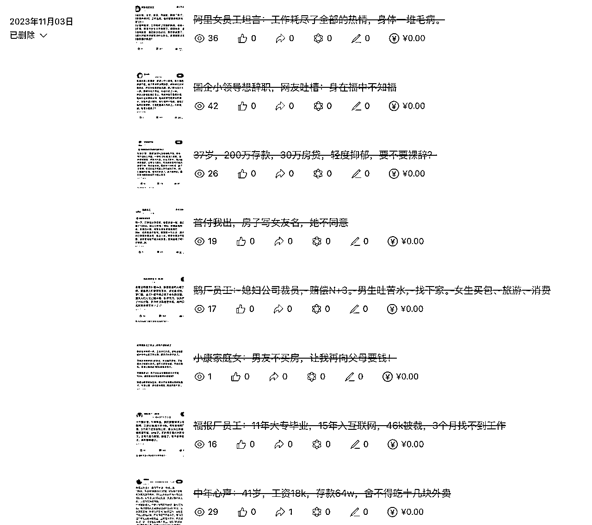

这是我去年11月份经历的事，

如果是很多年前，我会自我责怪，

觉得自己很没用，做5天就放弃了。

但是去年我的做法是，

心态上，完全接纳自己，

就任意由着自己放弃，不行动。

然后，我在想如何用利益诱惑自己的身体。

我相信自己的身体在绝对的利益面前，是很诚实的。

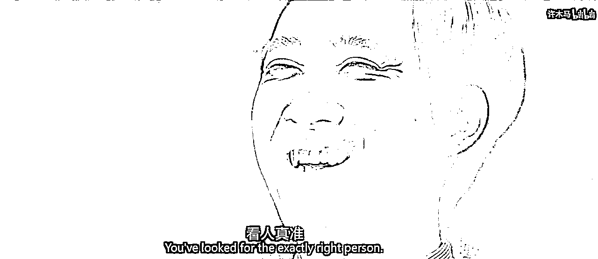

于是我先买了个次幂数据，

把低粉爆款的100个账号导出来。

然后算了一下平均点赞率，

然后倒推出准确的阅读量（因为超过10w+就不显示）

然后根据当时的，10万阅读量=400左右收益。

一算发现，每写一篇文章等于40元，

这里插一嘴，

其实就是不断地增加这件事赚钱的论据，

让身体相信这件事赚钱，

而且提供的论据是，

尽量是收益确信度很高的公开的数据网站。

然后当时的10w+的爆款率，

计算得出的是1/16。

然后我一想，

那按照概率来讲，

我两个账号都更新8篇，

那必然爆一篇啊。

同时，一天16篇的话，

收入能够达到640。

内心开始心动了。

同时当时我有5个账号。

这时，我内心又在想。

哎，

万一上述我的想法错的呢？万一不爆呢？

万一又像上次那样更了5天，还不爆呢？

万一一天更8篇，账号直接限流呢？

...

我再次任由内心的疑虑，我想着说。

那我就让自己先搞好200篇，

能搞5个账号5天的量。

到时候自己爱发不发

我可以允许自己写200篇，但不发。

等我做到140篇的时候，

我其实内心还是有很多疑虑，

感觉提示词不太好，

感觉文章也没有把握。

但是，内心有点忍不住想发，

我认为身体的想法是，

你这数据都显示，16篇都能爆1篇，

你这140篇，肯定能爆，赶紧发吧。

于是，我控制不住开始发了，然后就爆了，

有的号，第一天就爆了，下面这个号第二天爆了。

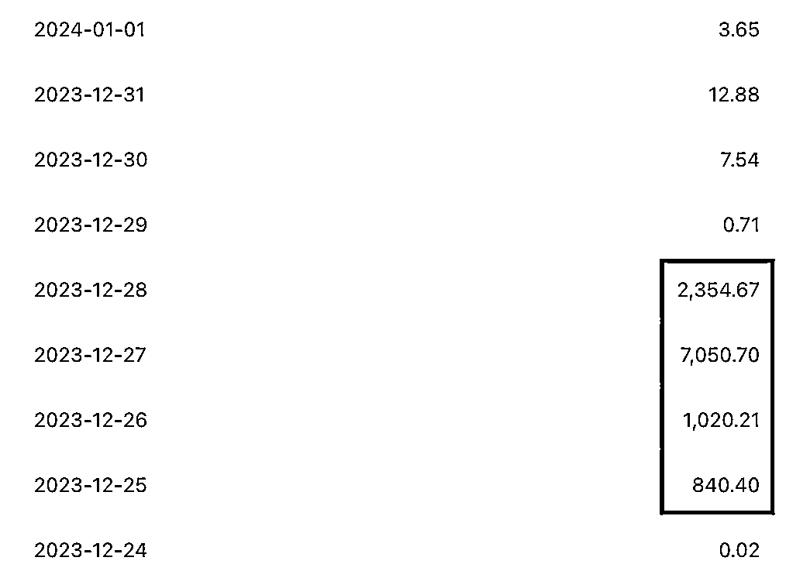

这时我又在想，

你看这收益不稳定啊，

之前，我也看到有教练说，

爆过的账号，可能一个月都没啥流量。

我感觉，如果没流量，我肯定坚持不下去。

那我如何能够坚持下去呢？

这里停一下

我希望大家可以注意到，

我的思考逻辑，

从来不是逼自己，

也不是在自我说服，

更不是自我打鸡血，

而是想办法铺设一条坚持起来很轻松的道路。

我不希望大家被什么自媒体，

那种胡说八道的话，

那种看似很有道理，

看似听完后热血澎湃，干劲十足，

尤其是高考、考公、考研，励志短片

这种什么逼自己这种xx所洗脑，

因为我曾经在高中就深受其害，

在很长时间，

都是使劲拉着心中的大象，

想往自己想去的地方拉，

但是大象从未听我使唤，一动不动。

好，继续，我就在想，

能不能让坚持的成本降低一些？

能不能躺着就能坚持？

能不能让我坚持的成本就是，

1分钟，1小时，而不是8小时。

然后我就想到了RPA，

我声明下我并不会什么代码，

RPA我也并不是老手。

但是在足够的偷懒需求下，

在拉高ROI的动力下，

我进入到心流状态。

所以我花了5天，

各种调试，

各种折腾，

最终，实现了RPA自动GPT对话，RPA自动上传文章，包括添加图片。

同时还增加了8个账号

（6个个体户，2个个人，个体户全部没流量，个人有）

当然中间偶尔会出bug，

但是，基本每天1～2小时，

就能完成十几个账号，

每个账号每天8篇文章的生成与上传。

在1月1号～1月11号，

基本每天都没流量。

但是由于我把坚持的成本拉得足够低，

所以，这回我根本没遇到过执行力的问题。

然后，在1月12号，终于有个号，又起了一波流量。

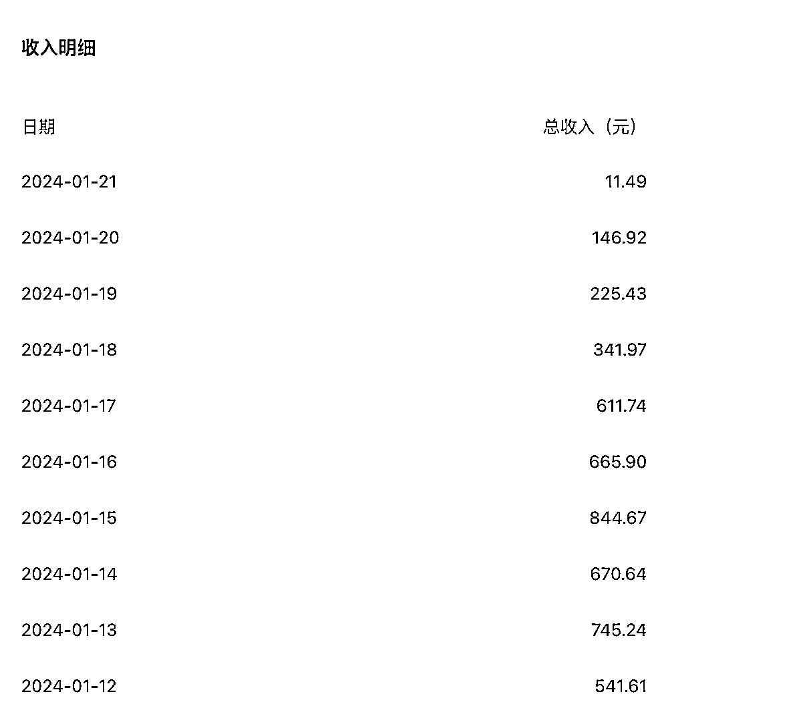

最终在差不多1个半月，7个个人号，加一起是2w。

那为什么，我没有继续坚持到现在呢？

当时我5个gpt号开了会员弄的，

到了2月份，不知道为什么，

文章的生成效率变低了，

GPT4经常冒出因为审核，

所以不进行洗稿啥的。

我当时还开始和我朋友合作，

让他搞账号，我和他五五分成。

结果，每天生成的文章，越来越不够用。

在又要进行判断是否5个账号GPT4续费的时候，

我就选择了放弃，当时的精力，也被准备搞其他项目，所分散。

### ⭐️02/ 小红书引流创业粉，日更365天

这个其实，在引流上，打法是错的，

或者说，并没有实现想象中的预期，

但是每天平均稳定进3个创业粉。

一年下来，也有1000个。

先存着吧。

哎，由于内心感觉好多后端都是割韭菜，

复制其他人的朋友圈，也不是很想干，

主要流量也不够大，没量不谈运营

所以一直也没变现。

但是我认为一些，

我是如何完成“日更365天”的思路，

可能给大家一点点启发。

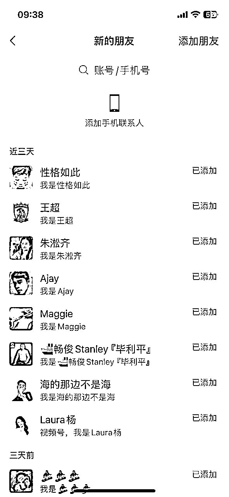

我是在5月份，

开始准备做私域，

当时公众号之后，

也折腾了好多其他项目。

当时感觉收入和公众号很像，

就是猛一阵子，然后就不行了。

所以就不想干这些了。

或者如之前总结的规律。

因为这些项目的预期收益的上限变低，所以不愿意付出成本。

我当时的做法是，

先白嫖了一下灰豚的一天会员，

然后找到快100个所有搞创业粉的账号，

这里插一嘴，

在找对标账号和帖子时，

后来发现其实也未必需要这种会员，

你点关注后，它会推送相关的账号，都非常准，

然后你点它推送的，

然后再关注，再推送，

我后来发现，通过这种方式，

基本上能不把在更新的绝大部分账号，都关注到，

另外，几乎所有平台，找对标账号，都可以用这方法。

我差不多1天就找到所有平台的对标账号了，

同时又把他们所有高赞、高评论的链接，

全都粘贴到我的苹果的表格numbers。

同时也加了所有同行的微信，

然后看看他们是怎么变现的。

后来发现...md...

除了生财...全都特么割韭菜的...要么干黑灰的...

进生财，就领先其他人一大截，一点都没假...

这个步骤，也是1天就完成了。

然后，我把新增粉丝数/笔记数，

当作评判模版好坏的方式，

当时数据上看，

设计得越有IP感的模版，粉丝数越高，

于是花了350找了个UI帮我设计了模版。

同时，我开始把高评论的笔记，

文字识别，开始洗稿

做着做着，我就在想。

这玩意儿，洗稿一篇，挺简单的。

要不直接把3个月的直接做好...

后来我又冒出一个大胆的想法...

要不直接把1年的素材全部做了吧？！

集中时间批量做，单篇成本可以降低，

同时坚持更新的难度大大减少，

而且当时觉得，持续日更，

相比那种爆一天就挂的，

感觉粉丝的信任度会大大增加。

说干就干，

按照每天3篇更新的方式，

最终原本以为花2星期就能做好1095篇。

最终花了3星期做好所有的素材。

弄了37个文件夹，每个文件夹放30篇，也就是10天的量。

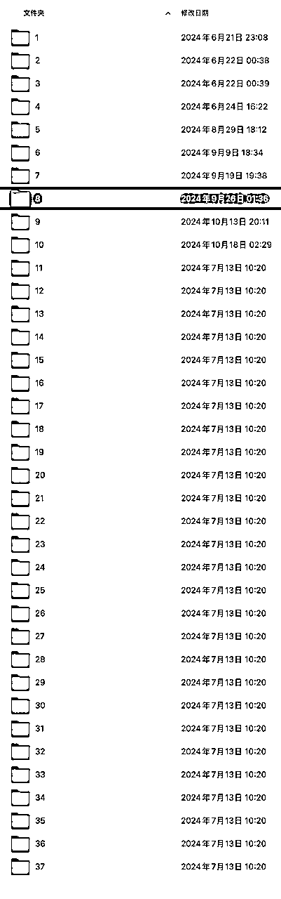

友情提醒一下，实际上，这个打法应该是错的，

我之前只以为大流量是有时间窗口期的，

没有想到过，小流量也是有时间窗口期的，

这个模版可能就打不了粉了，都洗完了。

因为我更新完之后，

我当时点关注的小红书的同行时。。。

发现大部分都没有流量了！

有一种49年入国军的感觉？！

我当时都震惊了！

因为我又用了另一个手机号，又白嫖了灰豚数据时，

突然发现搜什么创业、副业....等等的词。

特么过千赞的一个都没有？我还是按30天，才冒出了一个帖子。

但是当时也不没办法了，一年的量都做好了

所以一直发到现在，平均每天进3个粉。

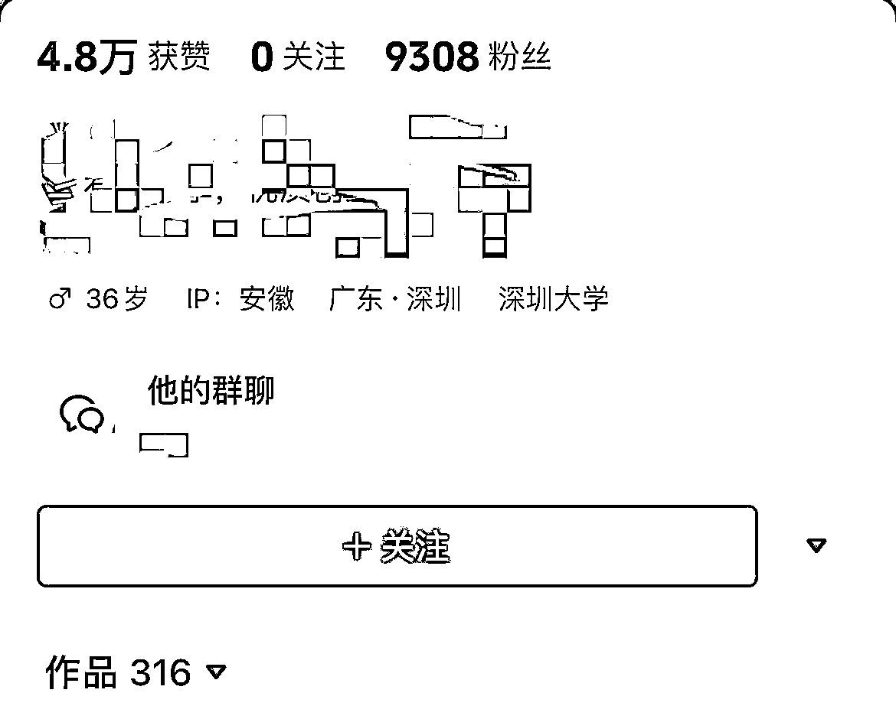

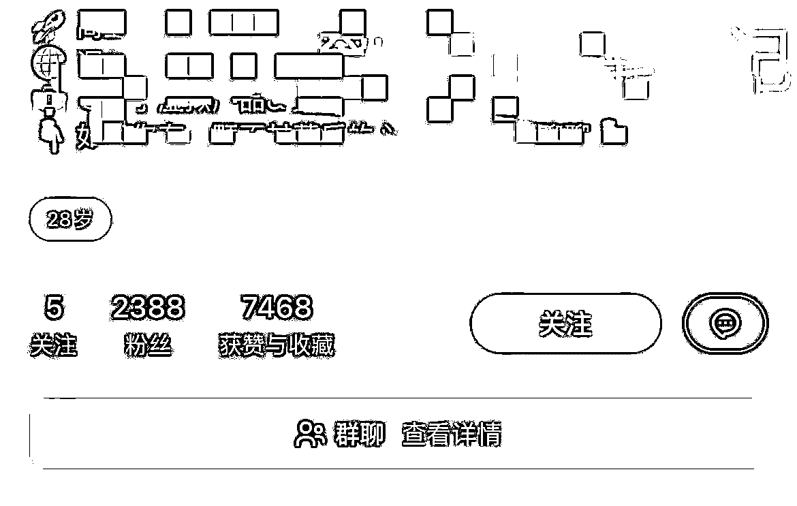

### ⭐️03/ 觉得写作能力重要，但是迟迟不开始

再给大家举例一个，

我是如何用利益诱导自己，去做我想做的事的。

包括今天能写下这一篇的文章，

也受到我接下来所说的动作影响。

我在做前面小红书洗稿的时候，

其实挺无聊的，

因为一直截图识别，

同时发给gpt修改错别字，

洗稿一下。

然后我当时忘记是因为什么原因，

可能内心也潜藏着一些表达欲，

我想了解，写作的人他们都赚到了多少钱，

甚至他们每一篇赚到多少钱，甚至每一个字赚到多少钱！

这个可能是明白老师给我的启发，我记得他曾经的一篇自述帖曾提到过。

于是说干就干。

我当时就挑知识星球，因为方便统计年GMV

同时筛选出，以公众号为主要内容获客渠道的星主，

然后用，去年做公众号的时候，买了一个公众号爬取的会员，

我就把所有知识星球里，所有通过公众号写作导流的，全都爬取了一遍，差不多有近40位。

下面这个表格其实不太完整，因为当时最后一版，做到每个字多少钱都统计出来了，

因为我写了个RPA，把每个人的每篇文章，都导入表格，然后统计所有字数，

甚至星球佣金，手续费，税务，人工...等等都算上了，

然后算出每个字值多少钱。

因为我当时也好奇，

到底写2000字以上的文章赚钱，

还是写4000字以上的文章赚钱，

还是写短文赚钱，哪种长度的文章，一个字单价最高？

当时算完后，感觉，一个字这么值钱！写作是迟早要干的事！

但是，这一版！当时不小心误删了。。。我都不知道什么时候删的。

好在，还剩之前一版的表格，30多个作者，

这个虽然没统计字数，但平均下来，统计完所有的，

一个阅读量0.4元，一篇文章价值4000。

其实今天这篇文章，我写了快3天...写了很多版...

上面这笔账...对我写出一篇文章的成本接受上限，帮助不少。

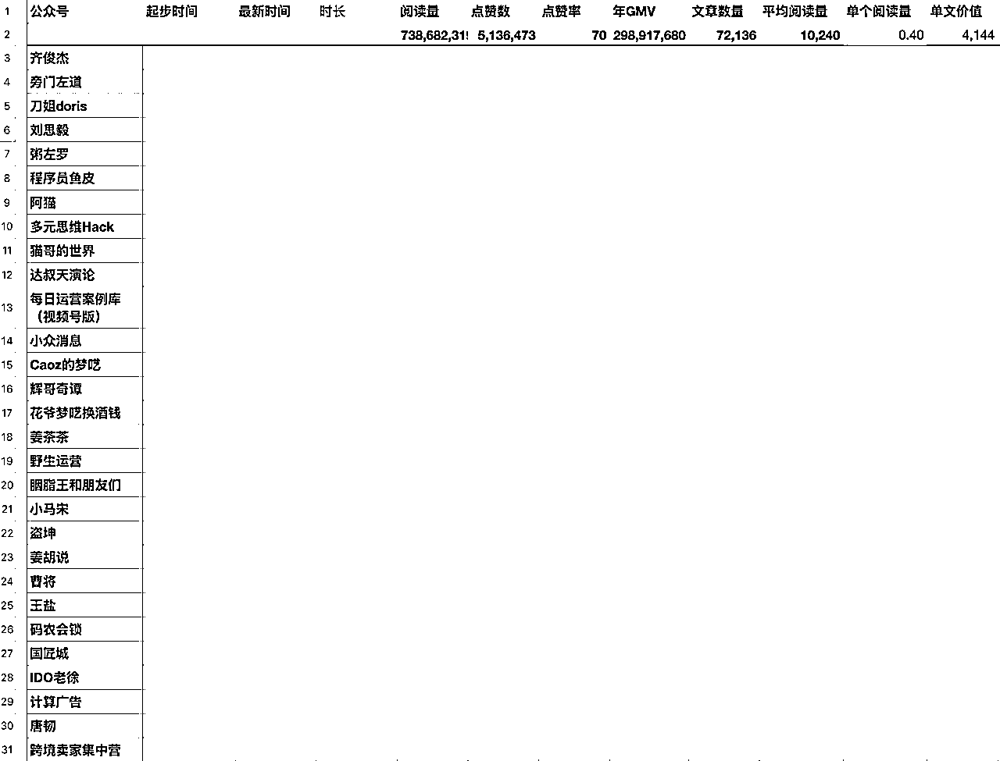

### ⭐️04/ 4个月，词汇量从3000到10000

在去年年初的时候，当时还没进入生财，

对比今天，当时真是个创业小白，

虽然，当时商业能力很差，

但是，我在“执行力”、“坚持”上面

让一件很不愿去做的事，持续愿意去做，并实现了目的。

当时创业的第一个想法很单纯，

要当一个b站up主。

然后，我在想，要做起来，

最关键的是持续更新，

我怎么才能持续更新呢？

我想了很久，最终觉得，信息重要，语言重要，英语重要；

而英语的价值，再过10年，也非常稳定重要。

在赚钱机会上，也想起李笑来曾经说，

他当时关注多个推特账号，才愿意下重注给比特币。

所以决定就做英语内容。

然后我在想，

如果我能坚持更新5年的话，

那一定得是有，巨大的利益。

然后，我在想，

肯定不能干搬运，

不然太浪费我5年的时间了。

所以，想了想，先拉高能力上的收益。

最终认为，要满足以下条件，我才愿意更新

一是，要能掌握词汇量，

二是，英语阅读能力要提升，

三是，听力最好也能提升。

（说的能力不需要，我短时间根本没有和外国人对话的场景）

然后不断地看其他账号，

最后找到了一个b站的，英语有声书视频，

当时看的是哈利波特的油炸叔的那版，

21年的视频，播放量220万。

我当时翻了一下评论区，

看看有没有表露什么需求，

然后我发现，很多说字幕，单词标注什么的。

这时，我闪念一想，

我能不能在有声书下面，配上原版中文的字幕，

然后，对不懂的单词进行翻译，

你看，剪辑视频，听的时候，能锻炼听力；

不加中文字幕时，可以锻炼阅读；

面对不懂的词汇，可以查字典。

当时感觉完美，于是我迭代了很多版，

各种细节，非常完美，最终做出满意的了。

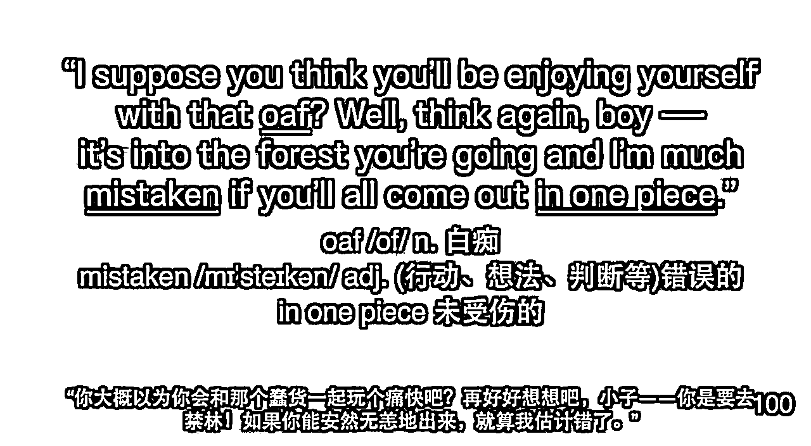

与此同时，我也在想，如果更新了5年，

把什么《哈利波特》、《冰与火之歌》等等都更新了，

自己在b站，从词汇量3000，再到4万，

那我也可以出名了，说不定自己是下一个董宇辉！

就这样，我给自己画了很大的饼，

同时也认为，最差的结果是，英语词汇量提升了，

所以我就开始做了，没想到第3天，粉丝就涨到了1000，直接开通了b站激励，相当于公众号的流量主。

我有个朋友做b站up的，粉丝2万，他也震惊了，涨粉这么快。

于是，我开始每天做，

一个30分钟的英语有声书，我要花3～6个小时做完。

有时一个视频，我甚至添加了300多个单词的备注。

同时我有意识地，降低不提升英语能力的操作成本。

因为如果这个成本过高，那我就不愿意去坚持了。

就这样，我连续更新了4个月，

基本每天都在做视频，整个人基本都是心流状态。

粉丝从0到1.7万，流量主收益只有1000多。

但每天也有粉丝说我的视频有帮助，感觉每天都能收到正反馈。

同时，我也开始测词汇量，隔几周去一个网站测，

从最开始的3000多，到最后的10000多。。

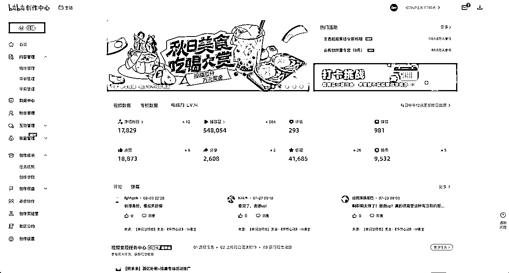

我之前是很讨厌枯燥的背单词的，

感觉太呆板、枯燥、无聊、没创造力。

但是我发现，

我可以通过一些增加收益的方式，

无论是物质收益，还是精神收益，

对一件本来自己不是很愿意干的事，

慢慢地调动起自己的执行力，

自然地、主动地、专注地、有动脑地去做。

其实细想起来，

我的想法的转变，

在于开始愿意感受内心的私欲，

在于开始愿意大大方方承认内心的私欲。

开始，如生财的Slogan那样「谈钱不伤感情」。

开始调动起人性的最原始、最直接的欲望，去做事。

话说回来，

哎，当时并不懂什么流量、转化、产品、对标账号等等赚钱打法。

当时也不知道自己该怎么变现，

也不想接广，感觉会影响看视频过程中的沉浸体验。

直到5月底，和房东聊搬家的事，有些矛盾，

结果搬出来的那天，我的视频陆续被举报下架了，

因为音频资源是外国网站的，哎，当时觉得运气真差，

别人21年做怎么没事，我才刚做4个月，

怎么外国网站...也会找上门...

但是也因此，在之后焦虑中加入了生财

### ⭐️05/ 快速学习的能力

这个长话短说，

20年的时候，我也尝试过一次短暂的创业，

但比去年还要懵懂无知，

当时连剪辑软件都不知道怎么操作。

同时内心也不想练习，

看一些免费剪辑课，感觉太呆板、枯燥、犯困。

于是，我在想，

为什么不能让别人给钱给我，让我学习剪辑呢？

这样做事才最有动力，对吧？！

所以，我当时面试了上海好多家公司，

终于面到了一个上海的一家信息流广告公司。

由于抱着带薪学习的小心思，

所以待遇相对来说，很能接受了。

但是需要剪一条片子，作为面试测试。

由于我想着，

这是一个带薪学习的机会啊！

所以这个片子，我用剪映剪得无比的认真，

那也是第一次使用剪辑软件那么长。

过了一天，果然！！！

面试被唰下来了！！！

但由于，这样一个工作机会。

对我来说，属于暴利！！！

带薪学习啊！

所以我跟hr说，

能不能说一下有哪些要改的，

她说问问视频部主管，

晚上大概说了下不满的地方。

于是我开始在这3天，

每天睡5小时，

就为了改这个片子。

最后第3天交稿的时候，

发送完就放松去了。

过了一天，终于面试通过。

但是，之后几个月，

好几次濒临被裁，

因为当时进公司才发现，

公司用的都是pr。

花了好长时间熟悉软件，

熟悉业务。

但是，我每个月都是公司工作时长最长的，

最后一个月，业绩消耗终于前三了。。

我想说明什么？

我想说明人的执行力，

是可以主动地加收益，加收益，

加到足以让自己感觉暴利的程度！

实现主动地、极大地激发！

不要逼自己努力，要主动地拿利益，以至暴利调动自己，调动到自己无法矜持。

### ⭐️06/ 戒掉游戏

这个其实和上述都不一样，

因为上面的都是调动自己执行力做某件事。

而这个是如何调动自己的执行力不做某件事。

其实很简单，增加玩游戏的成本。

2月份，

我邀请我两个发小一起创业，

16号过后，我们就开始一起工作了，

当时准备一起尝试新的项目，

但由于我们之前都喜欢玩dota2，

所以最开始我们都相互承诺，

公司肯定不能玩游戏。

结果有天晚上，

我和另外一个发小都没忍住，决定开一把。

这一开就不可收拾，

创业的心思莫名其妙地被扰乱了，

原本有在做视频号直播、抖音无人直播。

结果都不管了，心思经常在什么出装、加点上，

感觉要先帝创业未半，而中道崩殂

于是我在3月底，

我痛定思痛，心里对自己说，

“我允许自己玩游戏，

但是，现在要提高一下成本，

我也可以允许自己反悔，

或者用其他方式来玩游戏。”

于是我就把4个带皮肤的steam账号删了。

结果发现这个账号1个月后，才能真正删除。

于是我内心又非常完全接纳自己地说

“我允许接下来1个月玩，即使在创业中，也可以玩”

但是我又提高了一些自己反悔的成本，

改了邮箱、手机号，等乱七八糟的，基本登不上去的那种。

你们能感受到这种处理状态吗？

我非常清楚，如果是很久以前，

我可能反复责怪自己，

我怎么堕落了！

亿万富翁的梦不要了？！

但是现在我感觉，

自己是在用完全接纳，不与内心抵抗的方式，

然后用不断地提高成本的方式，引导自己的行为。

其实很类似于，“Yes，and”的自我沟通技巧。

或者说，是在允许一切发生。

# 三、问题

### ⭐️01/ 如何避免做项目半途而废，三分钟热度？

先让自己就半途而废，就三分钟热度。

同时向你的身体，持续投喂这个项目的收益确信率高的信息。

绝大部分情况下，就是一个调研的工作，收益算得越具体越好，

具体调研方法，可以多搜索生财的帖子，我也是在里面学习的。

https://t.zsxq.com/1RoaT

在这个过程中，要么你和我一样，被诱惑住，一步步地开始行动。

要么你发现，你的身体判断没问题，这个项目就是不赚钱，你也避免了付出更多的沉没成本。

### ⭐️02/ 如何克服拖延症？

先让自己拖延，拖着没事。

同时向你的身体，尝试投喂这件事的好处，

如果是自己想象的，可以尝试多找些论据支撑自己的想象。

持续投喂...可以建个单人群聊，命名，如“🏋️/js健身“

有你觉得对的，赞同的，就丢进去。

在这个过程中，要么你和我一样，被诱惑住，一步步地开始行动。

要么你发现，虽然有好处，但，暂时有优先级更高的事要做。