# 不需要露脸的YouTube频道领域大合集|分享给你20个成功的不露脸YouTube频道

> 来源：[https://rlwxa0zgke.feishu.cn/docx/Hj52d8pVooeNdBxwnaScz5xlnCg](https://rlwxa0zgke.feishu.cn/docx/Hj52d8pVooeNdBxwnaScz5xlnCg)

最近有圈友问我关于选赛道的问题，他（她）又不想露脸，问我有啥领域可以做，那么今天就专门写个帖子做为抛砖引玉吧。

### 一、游戏领域

在游戏领域里面有很多大频道，例如nigahiga、 Pewdipee、 MR Beast

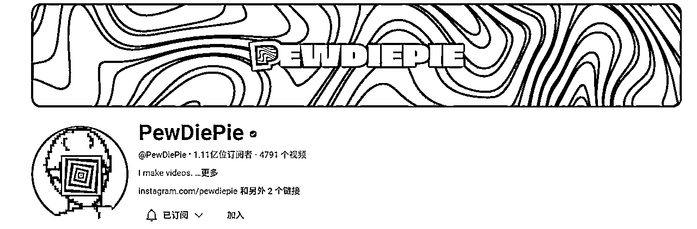

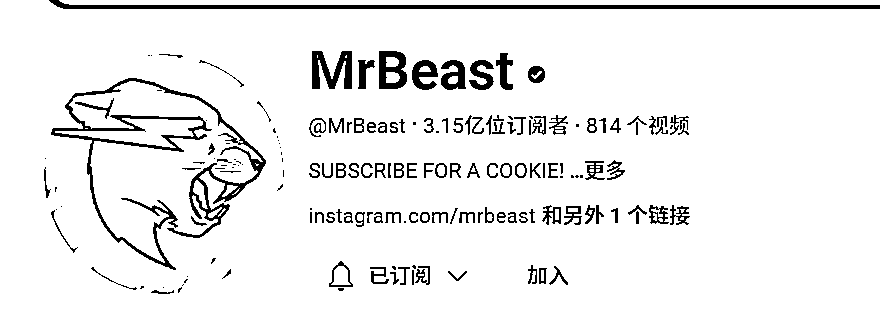

这里做一个知识补充：MrBeast早期确实是做游戏频道起家的

这个频道叫 Dynamo Gaming，他频道里面的视频都是他录制了他玩游戏的过程，所以每一部视频都有几个小时的时长，这样的视频也受到很多人的喜爱，也有很不错的观看量。

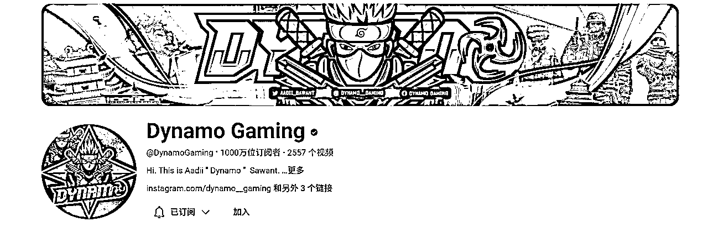

目前油管在推short，也就是短片，目前他频道也有上传一些短片了。

补充说明， 一些国内的主播做视频领域比如说红警，90年代的一些经典游戏通关视频，相关衍生是游戏解说类，较为出名的如 红警08、红警月亮3，看之前90年代的一些游戏推荐 82电玩大叔

### 二、产品测评领域

每个人都可以做产品的测评，因为我们每个人都会买很多的用品，例如家居用品、科技产品，所以你家里面的任何一个产品你都能够做测评，你可以给出你的建议，给出你的使用心得，告诉观众这个产品到底哪里好，到底哪里不好，帮助他们在购买前做决定。

频道案例：Household Hacker

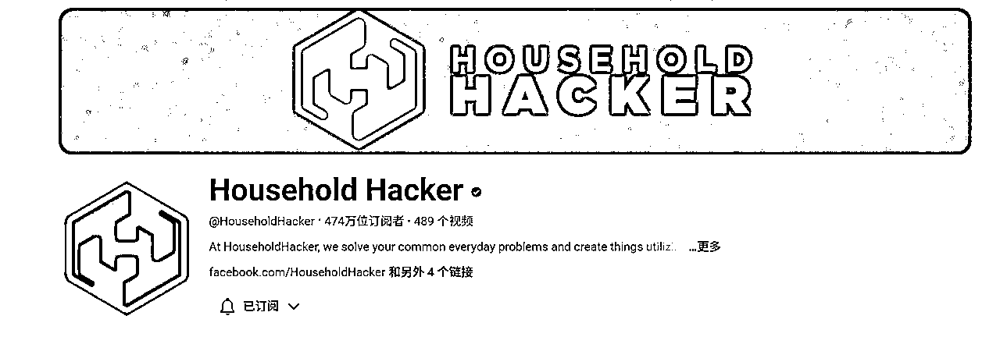

他的视频里面完全没有露脸，主要是为了展示给大家生活里面的各种用品，他们的使用心得，他们使用的时候应该注意什么？

像这种类型的视频主要是以产品为主，只要你传递出了有用的信息，观众并不在乎你是否有在视频里面露脸。

因为观众来到这个频道的目的就是想要知道哪些产品是好的，哪些产品是不好的，得到他们想要的信息之后，他们就会很满意。

扩展：这个频道有些产品看起来不错，看看国内有没有得卖，如果国内没有卖，那么卖一波

比如说这种

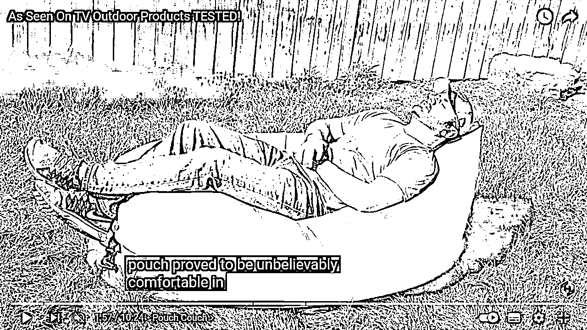

又如这种专门挖士的手套

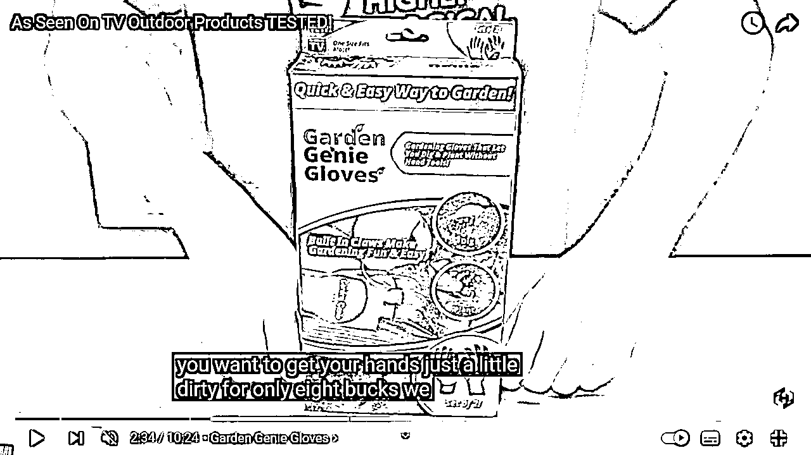

总之，看看国内有没有的卖，如果国内没有卖，但是你觉得这个东西挺好的，那么，你可以去联系厂家去生产，当然了有些人自己就有工厂，那么这个频道可以关注一波，看看有没有啥潜在商机。

我们可以把国内的东西往国外卖，同样的，也可以把国外好的东西往国内卖，主打的就是一个信息差。

### 三、美食领域

这个领域其实非常的广，例如你可以分享一些街边的美食，一些国家当地的美食，你也可以分享一些平价的美食或者是高端的美食。

频道案例 Mashed

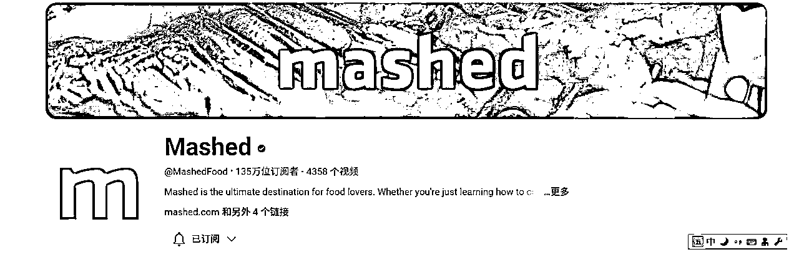

这个频道里面的视频会介绍很多西式的快餐，像是汉堡薯条。有介绍给你世界上最好吃的薯条，世界上最好吃的汉堡，还有很多其他西式的食物。

它的视频里面还会介绍一些知识，会提醒你一些错误，它的视频是完全没有露脸的，有一些用的是实际的操作，有一些用的就是素材图片或者是素材视频。

做美食国内出名的如 李子柒、美食家王刚等等

### 四、健康领域

现在人们越来越关注健康，所以健康领域频道是一个不错的选择。

推荐案例 Body Hub

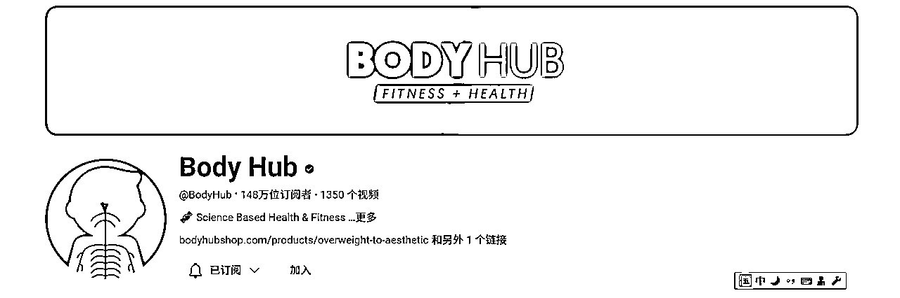

它的频道有一个很明显的特点，就是它通过简短的视频告诉大家一个健康的小常识，这是非常迎合观众兴趣的。

谁不想要用 3 ~ 5 分钟的时间去学习一个健康的小常识来帮助自己保持健康？它的视频形式就是通过图片还有文字，然后再配上自己的声音讲解就完成了。

它频道最重要的就是提供这些有价值的健康常识，而不是那些剪辑出来的效果，所以这种手法是相对容易做的。

### 五、试验领域

推荐案例 Power Vision

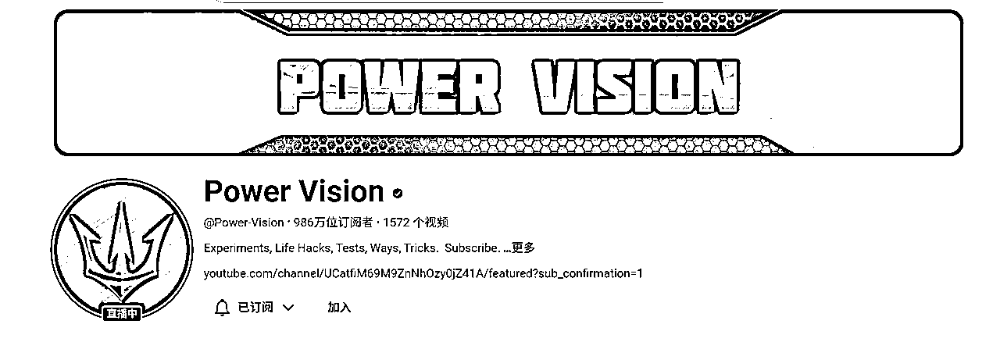

显而易见，这种视频看着挺解压的，一些聪明的圈友可能直接就把别人视频撸到国内来了，可看性非常强，如下两张图

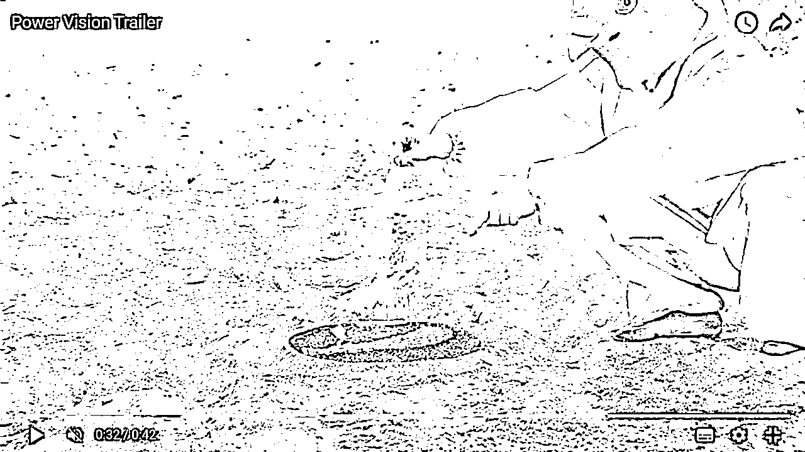

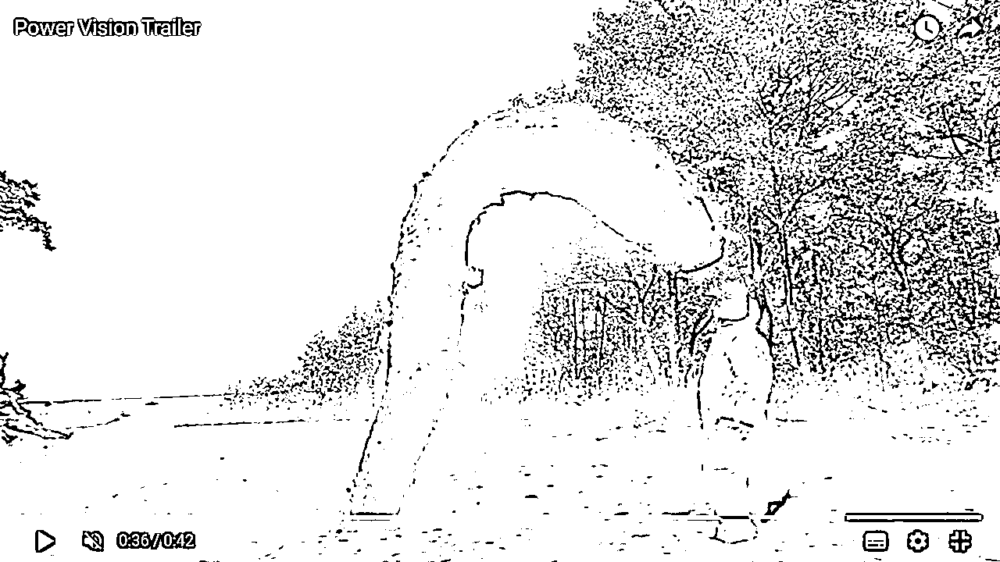

他的频道里面都是各种各样的小实验，没有非常高端的剪辑手法，但是它的话题都很不错，它的每一部视频都是一个新奇的小实验，这种小实验能够很好的激起观众的好奇心会想要看这个视频。

所以如果你喜欢做实验，你有创造力，这个领域的频道是适合你的。

这类视频带有解压性质，对于当下来说，解压视频不仅仅是在国外受欢迎，其实国内也是受欢迎的，把国外的视频搬往国内也是常事。

### 六、心理学领域

现在人们非常关注自己的心理健康，想要学习更多心理学的知识。

推荐案例 BRAINY DOSE

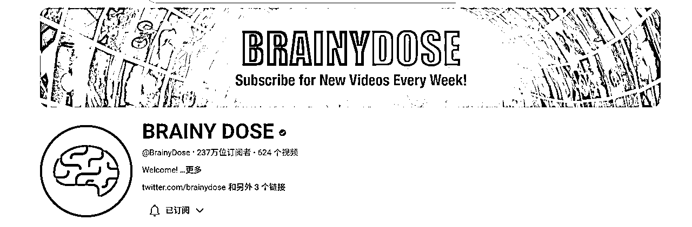

这个频道主要是介绍一些心理学的知识，例如教你如何调整自己的心态，如何让自己变得更好，如何提高自己。

频道里面的视频主要是通过素材、图片还有视频组成，他自己完全没有露脸，所以这类频道主要也是看你的文案，如果你的文案很好，传递了很多有价值的信息，观众也会喜欢观看的频道。

国内做心理咨询师，做心理疗愈赛道，可以到这个频道取取经，其实原创才是最好的，当然了，利用信息差，大部人上不了网，你发到国内，你自然就是原创了

### 七、地理领域

推荐案例 WonderWhy

这个频道介绍了世界上各个地方有趣的事件，介绍了各个地方的历史。对历史地理感兴趣的观众都会非常喜欢这样的频道。

因为他能够通过十几分钟、二十几分钟的视频就能够了解到一个当地的文化，一个当地的历史，能够让他们快速学到新的知识。

### 八、奢侈领域

推荐案例 Mr. Luxury

这个领域非常有意思，受众偏向于喜欢猎奇的人

这个频道介绍全是富人的生活，例如富人的玩具、富人的飞机、他们的游艇、他们的豪宅、他们的生活等等。

人们看到这个频道就能够了解富人的生活到底有多么的富裕，多么的奢华。

这个频道里面有很多有意思的话题，例如世界上最贵的手表，世界上最贵的电视，在亚马逊上能够买到最贵的东西等等。

所以如果你能够收集好这些资料并整理好，做成视频是有很多人非常喜欢了解到这样的知识的，因为这些话题能够很好的激发起他们的好奇心。

他们也想了解富人的生活到底是什么样的，他们也想了解世界上最贵的手表是怎么样的，并且这种频道完全不需要露脸，只需要通过素材图片、素材视频，还有你的文字、你的声音来阐述整个故事。

### 九、软件教程

很多软件非常方便我们的生活，比如说Everything,这款软件就比微软原来自带的好用不知道多少倍。

PotPlayer 64 是目前来说，最好用的视频播放器，小丸工具箱是最好用的视频压缩软件等等。

你可以分享这些软件的使用教程或者说介绍一些好用的软件，你需要录进你的屏幕，然后再配合上你的声音讲解，让你的观众一步一步掌握这个软件，观众并不在乎你是否有露脸，你长什么样，他们的目的只有一个，就是通过你的教程学会这个软件，或者发现好用的软件。

推荐案例 Photoshop Tutorials by Webflippy

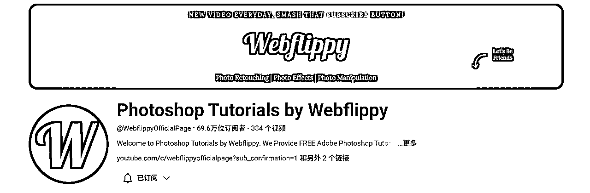

这个频道里面的视频全是讲 Photoshop 的，会教你各种 PS 的技巧，视频的形式就是屏幕录制，它甚至都没有说话，靠的是文字的提示。

举一反三，大家可以通过关键字去搜索这一系列的博主，比方说国内的 零度解说等等，这个赛道主打的就是一个坚持。

我知道一些人直接用国外说的视频，比如说湾湾的，别人讲了，自己再讲一遍也是可以的，国内的话做公众号分享也是非常常见。

一般是文字介绍软件，然后输入关键词（这里是先关注）再给出软件的链接，个人感觉这个赛道是可以做的。

想要做得好，那就是铺量，一个人搞多个账号，个个平台发，总之坚持坚持还是可以做的，按年收费也是可以的，我知道有人就是这么做。

免费的可以，收费那么就可提供定制化服务，还有一个交流群，算是小白易上手系列。

对于赚钱收益这一块，我付费的一个人那里，从他口中得知去年大概收会员费50W左右，具体多少只有他知道了，在youtube有非常多的软件教程频道。

### 十、科学领域

推荐案例 SMART BANANA

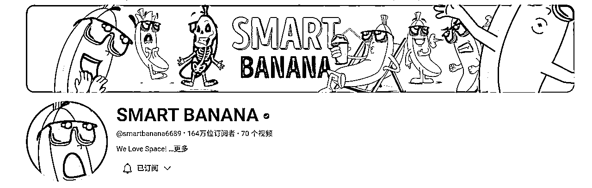

这个频道里面介绍了很多科学知识，它是通过动画的形式，配合上自己的声音的讲解来让观众了解一个科学知识。这种影片形式能够很好增加视频的趣味性，能让观众更好的接受，更好的理解。

所以如果你也对科学这个话题感兴趣，你并不需要做这么复杂的动画，你可以做出一些简单的动画，通过这种形式，不需要在镜头面前露脸，传递出一些信息，让观众学到一些科学知识。

这种视频难在于趣味性，如果国内做，一个方案是把原来的英文去掉，配中文的音，动画还是挺有趣的，可以结合在小孩教育那边引流

两个版本，一个是纯英文版，一个是中文翻译版，用AI配声，或者用配音软件配音都是可以的

这个其他可以展开思维，找到这一类的视频，专攻国内小儿教育也是一个思路。通过视频进行引流获客，把人引过来后卖其他跟小孩教育相关的产品或服务都是可以的。

### 十一、运动领域

推荐案例 Nonstop

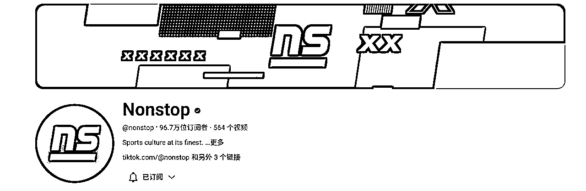

运动领域也是非常广泛的领域，你可以介绍非常多不同的运动，例如篮球、足球、棒球、羽毛球、乒乓球、田径等等。

这个频道涵盖了很多不同的运动，像是NBA、 NFL 。视频里面会介绍各种知识，例如不同球队的对比、不同球员的对比。视频展示的形式就是通过素材图片和素材视频，它本人没有在视频里面露脸。

所以如果你对运动感兴趣，你可以针对你喜欢的运动做一个运动领域的频道，通过利用素材、图片、素材视频的形式来传递你的信息。

### 十二、测试领域

推荐案例 1 Million Tests

这是一个非常有趣的领域。1 Million Tests这个频道里面会提供非常多种的测试。比如说测试你的智商、测试你的情商、测试你的性格等等。

视频的呈现形式就是简单动画配合上自己的声音的讲解，并且很重要的一点就是大部分的测试都是没有时效性的，什么时候看到视频的人都可以做，这意味着这些视频能够长期给你带来流量，给你带来观看量。

### 十三、旅游领域

推荐案例 touropia

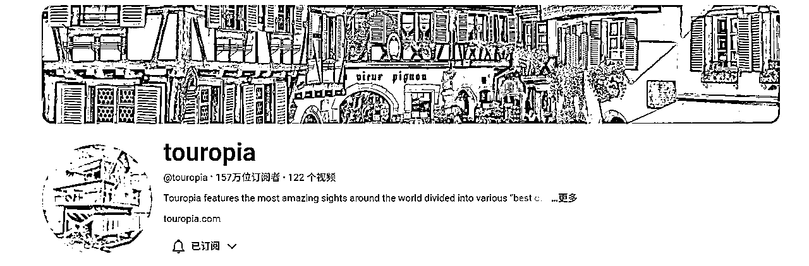

有很多人都会认为想要做旅游领域的频道，就一定要去当地去拍才能够实现，其实并不需要的。

touropia这个频道里面的视频介绍了很多国家地区的信息，例如有介绍在墨西哥最推荐去的 10 个地方，在英国最推荐去的 10 个地方。

他的视频并没有露脸，也没有去当地拍摄，他把这些信息都整理出来，然后通过素材图片、素材视频的形式呈现给观众，让观众更好的理解。这种视频往往是一种高价值的视频。

人们并不在乎你是否有露脸，他们只想要知道，如果我去了英国，我应该去哪里？不应该去哪里。如果能够得到这样的信息，对于观众来说这就足够了，他们并不需要知道这个频道主到底长什么样。

### 十四、自我成长领域

推荐案例 Practical Wisdom - Interesting Ideas

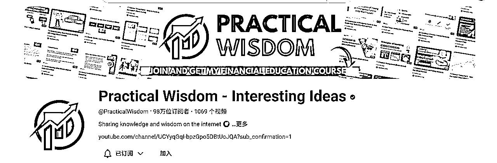

这个频道是围绕自我提升的领域。它的视频里面有很多有意思的话题，例如 10 个最没用的大学学历， 12个原因你需要更多时间独处。

视频的形式就是通过素材视频配合上文字，再配合上自己的声音的讲解。这种类型的视频，文案最重要，如果你的文案好，能够传递出很重要的价值，观众能够接受，观众能够认可，那么这种视频观众就非常喜欢观看。

### 十五、加密货币领域

推荐案例 Satoshi Stacker

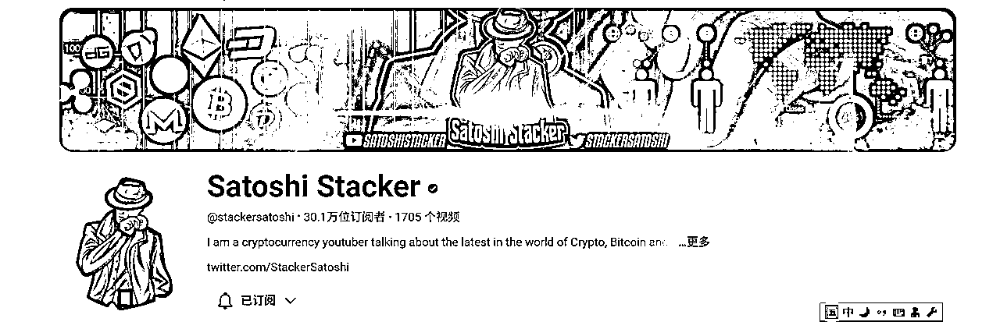

加密货币赛道少部人赚了不少钱了，这也是公开的事实。

加密货币是近些年非常流行的话题，所以加密货币的频道也会吸收到非常不错的流量。

Satoshi Stacker 这个频道是完全没有露脸的，都是通过自己的屏幕录屏，再配合上自己的声音的讲解。

因为本身加密货币是一个非常热门的话题，所以,人们最在乎的就是能否得到最新的信息，所以观众并不会在意他是否有露脸。

如果你对加密货币有研究，你完全可以开通这个 YouTube 频道，你可以分享你自己的研究，你可以分享你自己的策略，如果观众能够得到很多有用的信息，那么你就能够很快的得到很多流量。

### 十六、艺术领域

推荐案例 drawholic

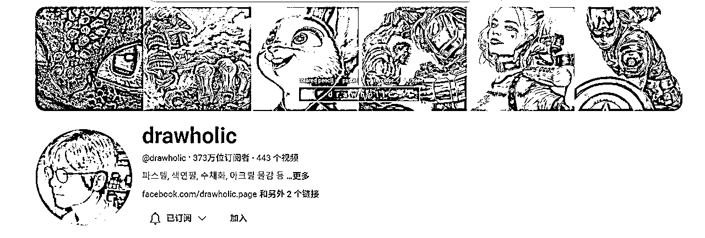

如果你会画画，你的视频是完全不需要露脸的，因为你视频的重点就是你画画的整个过程，而不是你的样子，你的声音，你甚至都不需要说话，你可以通过文字的辅助来告诉观众每一个重要的步骤。

drawholic这个频道就是给各个名人画他们的画像，视频的形式就是录制他画画的过程，他没有说话，配的是背景音乐，就是这种视频形式让他获得370多万的订阅人数，每部视频都能够获得几十万甚至上百万的观看量。

所以如果你喜欢画画，你平时也有画画，那你你完全可以把你画画的过程记录下来，然后创建一个频道发到了 YouTube 频道上，让更多人看到你的作品。

### 十七、ASMR领域

推荐案例 VIVA ASMR

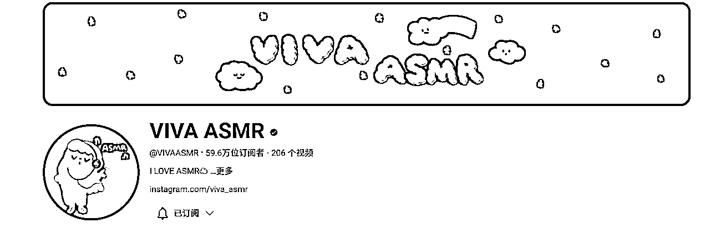

ASMR是提供一些声音，让观众能够听得很舒服、很享受，能够帮助他们睡眠。

VIVA ASMR这个频道里面提供了非常多舒服的、安静的音乐，让人们听了很享受。这个领域很明显你并不需要露脸，观众是为了听声音而来的。

点评：如果有心，很显然是可以搬运国内的，其实这类视频在目前国内压力大的环境背景下，听放松类的音乐还是挺有众受的。

### 十八、产品开箱领域

推荐案例 Dr Debox

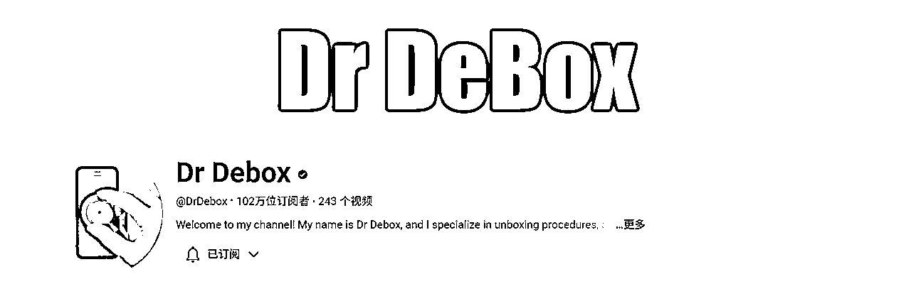

产品开箱并不像产品测评一样，需要你对产品有非常深入的了解，你要做的就是从未开的包装，一步一步带领观众了解产品里面具体是怎么样的，都有些什么零件，简单介绍一下它的功能等等。

Dr Debox 这频道主要是科技产品的开销，它会一步一步带你了解每一个科技产品里面到底有什么，到底有哪些原件。

所以如果你是一个科技产品爱好者，你能够了解到最新的科技资讯，你完全能够开一个科技产品开箱的频道，去带观众了解每一个科技产品。

### 十九、动物领域

推荐案例 Animal Facts

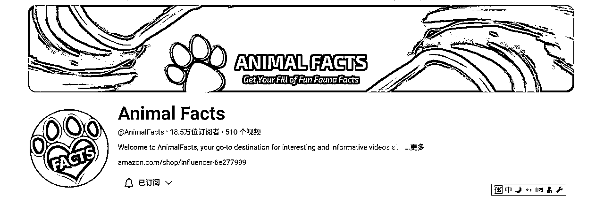

这个频道主要是围绕狗猫，其实还有其他小动物制作视频，提供很多很有用的信息。他们的话题也很有趣，例如 7 种最适合在公寓里面养小狗， 10 种最不需要照顾的宠物等等。

视频的形式就是通过素材图片、素材视频，再配合上文字声音的讲解。这种类型的视频最重要的就是信息，如果观众能够学到新的知识，得到有用的信息，那么这些视频就是观众喜欢的。

### 二十、商业领域

推荐案例 Young Entrepreneurs Forum

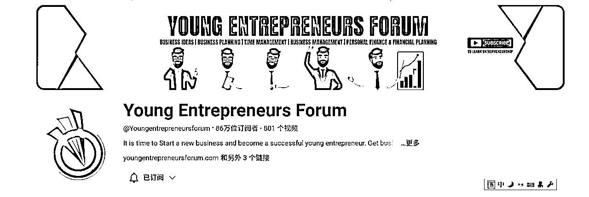

讲商业，讲创业，你并不需要露脸才能够完成。这个频道Young Entrepreneurs Forum，它用的是一些简单的动画形式来阐述很多商业、很多创业的主题。

### 个人感想

做IP，出镜是一个很好的方式，同时有些频道并不一定你在镜头面前露脸就会讲得更好，如果你信息是有用的，逻辑清晰，讲解的又清楚，那么观众同样会喜欢这样的视频。

以上提到了 20 个频道领域以及 20 个频道例子，他们都是没有在镜头面前露脸，希望给大家带来一些启发

### 加餐环节

这个文档，我并没有列出很多频道做为一个参考，但是如果你想好做某一个领域，找到这个领域相关的youtube频道，其实也很简单。

比方说，你想做产品测评领域，那么，你可以把频道Household Hacker的视频，一个个点开，然后呢，在右边这里，youtube官方就会列出与你现在看的视频有关联性的频道了，你只要一个个订阅就好了。

比如说，你订阅 Dope、Danny Gonzalez 后，再去找到更多的这个领域的频道，如法炮制，拔出萝卜带出泥就可以订阅更多这个领域的频道了。

这个办法呢，笨是笨了点，但是好在这个方法非常的实用。

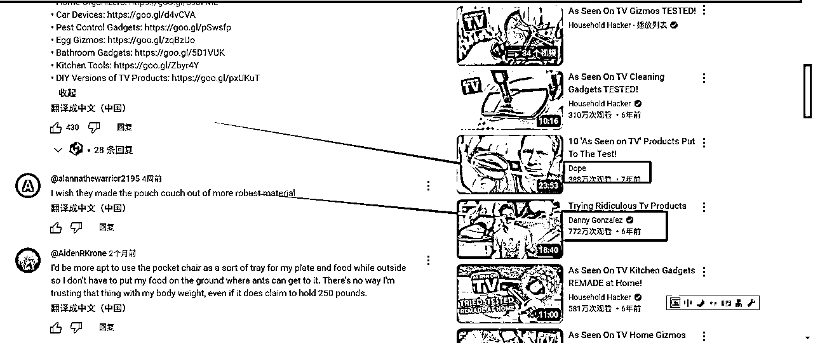