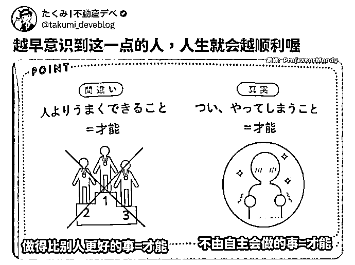
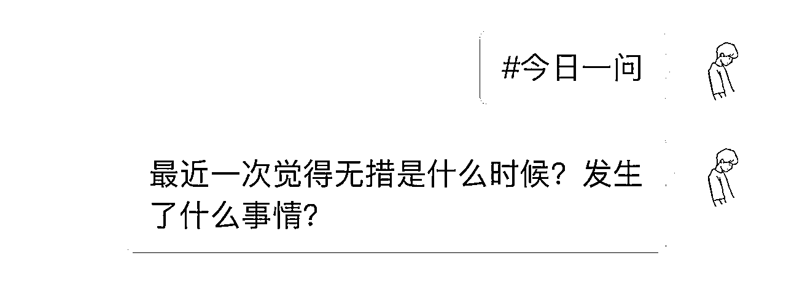
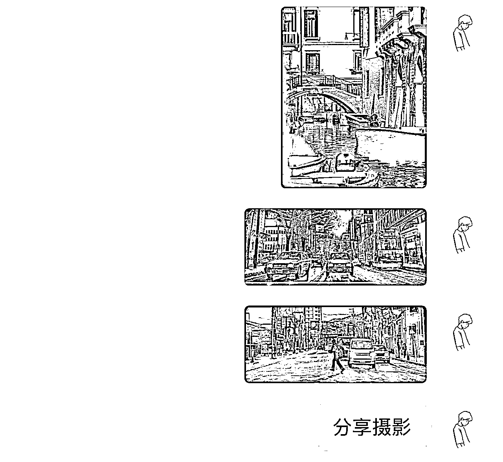

# 我是如何切中一个细分领域做一个知识社群？

> 来源：[https://kj259khusm.feishu.cn/docx/I2qndR3fEo2Nq6xXG5jc23s3npg](https://kj259khusm.feishu.cn/docx/I2qndR3fEo2Nq6xXG5jc23s3npg)

大家好，我是浅笑，又见面了。

我这几个月做了一个知识社群，在做这个社群的过程中，我收获了很多，不仅是钱，还有个人的状态和习惯，还有很多认知上面的进步。

把这个过程记录下来，分享给各位，希望对大家有启发。

# 一、社群的起源

## 1、 思路是怎么来的？

先聊一下社群是怎么来的，之前付费进入了家蒙哥的读者群，我经常在社群里面分享一些有启发的图片，有启发的文章。

后面家蒙哥就找我说，能不能当一下我的小助理，只分享一下你觉得有价值的内容就好，然后整理一下文档。

后面我想花费的时间也不多，而且呢，督促自己输出，所以就答应了。

也在其他微信群分享了一下，比如互联网的老司机，里面也有很多朋友喜欢这种形式，已经成为了很多每天 必看的栏目。

后面就有群友说，其实可以自己弄一个社群，会有很多人付费的。我想着也是，后面便建立了一个。

刚开始定价比较便宜，几十块钱，加的人比较少每天也有运营，也想着怎么增加点人数，后面人数也增加了一些。

## 2、为什么找这个定位？

我觉得这个定位对于我来说是比较轻松的，而且也有利于我进步。

每天因为在家蒙哥的群日常分享，所以有了动力去做这些事情，自己的社群更新后，就会分享一些到家蒙哥的社群。

核心是有趣➕有用，这种内容分享不难，也有很多人需要，喜欢看。

## 3、有哪些社群内容分享？

李笑来说，分享的内容要么有用，要么有趣，这是很好的两种内容形式。以下的几个栏目，大致属于这两种。

### 每日一图

就是类似于这种，这个栏目是受涛哥启发，涛哥说，可能一句金句很少有人会看，但是变成了图片的形式，就有很多人喜欢看。

### 每日工具

这个是近两个月加进来的内容，上面是挑选的一部分。我也很满意这个部分，每天会去找一些有用的工具。即使有些我当下不用，我也会寻找一个参考条件，哪些工具我以后可能会用到，那么我可能就会考虑一下。

### 每日一问

很多时候，一个问题比一个答案更重要，我会每天分享一个值得思考的问题。或许没有具体的答案，但是先放在心上，可能在其他某个时刻会解决了这个问题，也会带来生活的一些启发。

比如你听过最糟糕的建议什么？这个问题会让人反思，

哪些人给我的这个建议？

这个人还给过哪些糟糕的建议？

有什么人给我比较好的建议？

这个人是谁？未来是不是还有可能给我一个好的建议？

最近有哪些建议比较好？

### 每日摄影

有时候出去玩，我会拍一些好的照片。或者在其他社交媒体 看到比较好看的照片，让人心情变好，那么我就可能会分享在社群里

看到好看的照片会令人心情愉悦。

### 每日播客，

播客是一个很高质量的平台，上面有很多高质量的栏目，分为很多领域，我会去挑选一些可能对目前或者未来生活有用的播客，

### 每日一笑

有用很重要，但有趣同样很重要，

这个内容是偶尔更新，虽然素材也有很多，但是可能与主旋律有点违和。

## 4、社群怎么增长？

### 分发其他平台，引流

一个形式就是去将社群内容变成形式，去分发到各个平台，

把一些金句整理出来，之前在生财也发布过一篇文章，赚钱的108个金句。我把金句分为这几类，赚钱类，生活类，人际关系类。

五字引流箴言，加我领资料。

想要加到足够多的人，就需要整理一个很好的资料。如果是我的话，我就会对这样的总结很感兴趣。

通过这种方式可以吸引到很多人加我微信，后面再进行一个社群发售，就会有不少的人买单。发售就是将很多有购买意向的人聚集到一起，通过活动点燃他们的购买欲望。

### 其他社群分享学习内容

在其他的微信群分享我的社群内容，就有一些对我内容感兴趣的人过来，而且成交极其简单，都是对我内容感兴趣的人。

有次在一个微信群分享了我某个月份的启发图片整理，马上就加上了我，后面翻了半天才知道我有社群，后面很自然就付款进了我社群。

有些人他自己是做项目的，或者是做私域做网赚做知识付费的，我社群的内容很多都可以直接当做朋友圈素材更新。

他的朋友圈愁更新素材，那他的朋友圈更新，这是一个痛点。

就有几个朋友就是做私域或者网赚的，他看到我免费分享一些内容不错，后面问我有一个社群直接就付费了，特别丝滑。而且他们你比如说一单朋友圈可能是几百块钱，而我的这个社群也才两三百块钱，所以就毫不犹豫的就付费了。

### 公众号社群内容双辅双成

哥飞之前分享过一个思路，

公众号最赚钱的方式是什么？就是将公众号和知识付费”社群一起做，

更新公众号文章，底部宣传社群，通过公众号文章吸引用户，用户进入社群则会督促自己更新新的内容，好的付费用户还会主动分享一些内容，甚至是启发自己的内容。

而这些内容将又会变成文章素材，进而产出新的文章，这些文章又会带新的用户进来。

公众号和社群相辅相成，双螺旋上升。

哥飞的社群就是这样做起来的，在公众号上面日更高质量文章，即刻也是更新，会有公域上面的人来了解，通过内容吸引。做出海网站，这个领域也很垂直。即刻也是，即刻产出新内容，吸引用户，后面用户有喜报，有反馈，在这个平台也会传播，进而带来新的用户，哥飞社群的质量也没话说。

粥左罗也是这样的形式，他就更加精细化。通过公众号吸引的用户，有低价产品，中等价钱产品，高价产品，收入渠道更多元，这也是我的简单理解。

## 5、社群分享内容哪里找？

### 启发金句在哪里找？

我基本上会在我付费的一些知识社群上面的，涛哥的免费星球——确定性成长，里面会分享启发图片，我会参考上面的。还有一些付费社群，这就比较多元，更有价值的内容在付费社群。

APP句子控，我也会参考一些，他上面的启发金句偏文艺鸡汤，不是偏思考。

即刻上面的话题，#今日金句，#弱智金句大赏，#浴室沉思，#一个想法不一定对

得到APP，上面的知识城邦，有个话题#这条金句有启发。

推特一些有趣的博主，通过关注相关领域会推送更多相关领域的博主

高质量的公众号，上面的文章长按选择有个转发选项，就可以单独选择这个句子分享。不少高质量的文章，我就会选择其中最生动的一句话记录下来。

### 工具分享哪里找？

工具分享是我最近在坚持做的一些事情，对我很有帮助。

我会在tg上面找一相关频道，有不少不错的频道。

即刻APP，上面有一些博主分享一些AI工具，提供效率的工具。

生财上面，航海手册上面也会分享一些工具，而哪些工具并不是特定支持那个项目的。风向标也有一些工具分享，有价值。现在风向标，航海，生财的各个制度也肉眼可见变得更好了，发自内心感到开心。

### 每日一问哪里找？

这个我购买了一个软件会员，叫做koan，上面每天会推荐三个有价值的问题，可以在上面写作，可以设定写作时间。

### 每日一笑哪里找？

这个我相信很多人会找，我说一下我的途径。

加的有些哈哈群，这个最方便，每天会分享有趣有梗的图片。

即刻话题组#沙雕电视台，#还有这种操作，#今天有什么好笑的，#即友什么图都有

tg频道，沙雕频道

### 播客分享哪里找？

小宇宙主页有个发现，发现有个栏目叫做播客寻宝，上面有不少官方推荐的播客，我就会在里面找。

还有为你推荐这个栏目。

# 二、除了赚钱之外，知识社群还有什么好处

## 1、教是最好的学，通过社群沉淀素材做内容

其实社群我没有赚很多钱，大概就是一两万吧。

对于我来说，这个社群是我的收藏库。里面沉淀了我找的一些内容碎片，之后我会把它们通过某个话题链接起来。

比如我今年在生财更新还算勤快，获得了好几篇精华帖，其实这几篇精华帖有一些都是把我社群内容整理出来的。

比如有篇精华帖，赚钱的108个金句，我把社群当中与赚钱的金句总结出来，其实那篇文章写出来没多长时间，重点在于之前的整理。

还有一篇精华贴，免费的八个性质，也是我会分享一些高质量文章，我会把看到的高质量文章和我看到其他的内容联系起来，产出新的有启发的文章。

还有一篇精华贴，沉浸式写风向标，我的一下分享和启发。

其实这篇文章也是与社群有关，那段时间受老彭启发，开始更新风向标，也通过社群督促写风向标，那时候分享内容叫做#每日风向标，会去思考怎么写出更多的风向标，我把我的收集整理出来，对他人同样有启发。

还有一篇叫做——省财有术，分享我的省钱方法，那时候我社群更新一个栏目叫做#有用经验，那时候就会分享一些省钱经验，自己也会去各个平台去搜索一些其他省钱经验，最后通过合适的分类，整理出了这篇文章。

还有亦仁发布的龙珠悬赏，分享自己好用的工具。也是因为社群正好有个栏目叫做#工具分享，在此之前我就已经整理了不少工具，所以那篇文章也能很快写完，也很幸运被加了精华，也得到了龙珠悬赏。

我通过这个社群每天找一些新的启发，不同领域上面就会有不同的素材，因为我自己分享和解读过，那么我就会对这些内容更熟悉，检索起来也比较快。

## 2、督促自己，变得自律

我倾向于的是自己学什么，然后就去分享什么。比如我想了解播客，就多一个栏目叫做#每日播客，分享一些小宇宙的内容，后面在博客当中的博客行榜当中发现很多好的博客，听其中的有些部分也发现了很多高质量的博客，感觉对我很有帮助。

比如我段时间想研究风向标，那么就会加个栏目#每日风向标，我就会有意识地去寻找风向标有关的内容。

我在社群里面也养成一些习惯，比如运动，比如背单词。一段时间内，我就会把单词截图，运动截图放入社群。

但其实这种方式可能不是每天必须要分享的内容，可能坚持一段时间我就放弃了。如果认真对待的话，养成一个小习惯还是比较简单的。

确实这也是一个很好的形式，有一个社群就会督促你去养成一些习惯，也可以有其他衍生。比如说每日更新一篇公众号，每日更新一个视频，每日加多少微信，这都是可以一个flag发到社群里面，每日汇报一下。

到了晚上，如果你完成不了这些目标，你就会看到有一些内疚。毕竟，这么多人看着你，完成不了多少有点尴尬。

## 3、交朋友

通过这种方式，我还交到了一些朋友，当然很多朋友也是生财的。

我发现有一个自己的社群是一种很好的交朋友的方式。

有些朋友有自己的知识社群，我也有自己的这些社群，互相邀请对方，大家可能没有过多交流，但互相进入彼此的社群，就是对关系最好的润滑剂。很多朋友因为看过我的分享生活变得更好，我们两的关系也自然更好，这其实也是对自己未来人际关系的一种延展。

想必很多做知识社群的人，也会认识很多优秀的群友，在未来某个时刻就可以帮到自己。

亦仁老板生财有术有太多的能人，大佬，那么假如亦仁老板有需求，肯定很多圈友都乐意支持和帮助。

## 4、状态变得更好

做这个社群，我的收获很大，不仅是赚到一些钱，收获了一些朋友，我的状态也变得更好了。

当你每天都有一个固定要去做的事情，你的人生会莫名的多一种掌控感。

在分享的过程当中，分享欲也得到了满足，感觉会输出一些东西，有东西能够分享是一件比较幸福的事情。

比如我拍的一些照片也会分享，在社群也有很多人给我反馈，比如说他们拍一拍我就让我感觉到欣喜的。

我之前还分享了一条关于父母建议的，社群里有个朋友给我私信说我的内容，帮助了他一些，实实在在解决了一些问题，当然我也觉得那个建议对我也有启发。

还有一些个人心态上的，认知上的，可能我以后遇不到这些问题。

但是我假如未来看到某个我社群当中提到的问题，我可能会在我的小群里面搜索一个关键词。比如说图片上面文字搜索起来不便，我就会把它再复制转成文字，那时候我搜索就可能变得更加简单。

把时间先拉长一点，可能对我个人的成长启发，远比赚钱赚社群钱更加重要，当然，如果通过引流和内容创做，这个社群也能赚到比较多的钱。

对内容有研究的人都会有一个观点，叫做，启发可能比知识更重要。

启发是一种触发器，它会让你去思考一些问题，而具体的建议和知识，他给你的是一个答案，有句话说问题比答案更重要。

这句话也可以去转变一下，叫做启发比知识更重要。社群就是分享一些启发，就是一张图片很简单，那他可能对我产生一些思考，可能就会变成几千字的长文。

# 三、对于知识社群的一些思考

## 1、 高客单与低客单的差别

对于分享这些社群，其实很难出高价，基本上就是个199、299、365或者588。

低客单的这个事情就容易跟权益绑定在一起，比如说我的这个社群偏向于低客单，因为他就是想分享一些内容，而不是去解决你某个具体问题。

高客单倾向于去解决某个人具体的问题，比如生财有正记录分享的一篇文章，介绍自己如何从程序员转型做脱单咨询，那他的这个业务怎么会成功？

主要原因就是他是确确实实的去帮助别人解决恋爱问题，而去帮助别人去脱单。

如果你是想做一个恋爱知识社群，分享恋爱的看法和知识，那么最多只能卖个几百块钱。

但如果是恋爱规划，帮助你脱单，找到心仪的人，就能卖到几千甚至上万。

客单价越高，越不能堆砌很多权益和卖点。

而是要聚焦在一个核心点强化强化再强化，让用户感受到你在这个痛点解决方案上的专业度和价值感。反之，客单价低才是堆权益，让他觉得花100买到1000的爽点。

先做低客单价，转化中客单价，然后再转化高客单价是很多做社群的误区。

这种转化逻辑属于职场打工升职加薪的逻辑，不是创业找需求的逻辑。

这种转化，一方面是要依赖于用户的成长，另外一方面可能还需要给用户不断制造焦虑。更重要的是，低客单价、中客单价、高客单价的目标用户很可能不是同一批人，买低价的人是不可能买你高价的产品的，他没钱就是没钱，再有意愿也不会买，这也是为啥有些人的低客单价产品很难转化到高客单价产品的原因之一。

## 2、知识付费怪乱象

这里引用生财智囊V先生的一篇帖子

从最近九年（2015~2023），利用业余时间，接触知识付费圈子的经历来看，有几件事情把我搞怕了：

01\. 你发的微信朋友圈，被人拷贝去发，而且不是一次两次，几乎每一条都发。为了避免被发现，ta的朋友圈屏蔽了你 。

02\. 你在某处的大段发言，被人拿去自己的公众号发了，还标了原创。你找到 ta，ta 一点没觉得惭愧，还理直气壮地说，为了让好内容给更多人看到。

03\. 你写的文章，立马别人拿去发到 ta 的付费星球了，没有署名。看着自己的内容被人拿去变现，一点点好处都没有，你气不气？

04\. 有人自认为是你的“朋友”，让你帮 ta 写文章发广告，免费广告。

05\. 有人给你寄一份小礼物，或者请吃饭，或者拜访你，然后让你给 ta 打 call，碍于情面，宣传 ta 的产品。

06\. 有人非要请你吃饭，帮 ta 出主意，然后转头在文章里写谁谁谁一请就到。

07\. 有的人在微信里老是问你问题，你因为热情以及考虑帮助年轻人，仔细回答，结果连一句谢谢都没有。转头人家还说你不收费所以没有价值，而谁谁谁收费 1 万块，给 ta 讲了 10 句话，ta 觉得超值。

08\. 你搞一个活动，或者做一个群，里面来了许多镰刀，为的是把你的人带走，去他们自己的群活跃。而他们的群，早已准备了各种付费套餐迎接你。

09\. 有人在你的群里，听你分享经验、拿资料、认识人，长达一两年，而一旦你要搞什么付费产品，哪怕只要 99 块钱，这个人别说付费了，还到处说你的坏话。

10\. 有的“朋友”组织饭局，说是介绍大佬给你认识，然后饭局上各种法子劝说，让你拜这个大佬为师，还要拿你手机转账 50 万。

这里的话也是为了劝退一部分人，知识付费易入门，但是真正做好一个社群很难。知识星球上面有很多社群，但真正做起来的可能不到5%。

## 3、社群的产出，一鱼多吃。

社群里面产出观点，观点思考变成文章，文章内容可以变成视频，变成图片，变成音频，只要变成这四种形式，那么任何一个平台的内容都能发布，不过注意的是，同样的内容放在不同平台效果可能会很大差别，因为平台的内容侧重不太。

比如在微信生态，社群的内容可以变成文章发布在公众号，变成图片加文字可以发布小绿书，制作成视频可以发布视频号，精简金句核心思想可以发布朋友圈，感觉回答哪个问题合适可以发布问一问，文章也可以变成逐字稿变成直播内容。

我觉得有个趋势要关注，就是关注自己的数字资产，这个数字资产不是虚拟货币，或者说，不止是数字货币。你在互联网上留下的文字和视频，也是你的数字资产。比如在社群我分享过这张启发图片，所谓良好直觉，本质上就是对于不同场景下抓重点的能力。

对我很有启发，就准备写一篇，不同场景下重点是什么？怎么锻炼不同场景下抓重点的能力。而这个选题，做成视频应该也很有热度。

我就有在考虑，把我社群的内容，转化成文章，做一个长期的YouTube频道，前段时间发布的文章，YouTube的前景，全球第一博主和华人区第一博主方法论，也是讲的这件事。