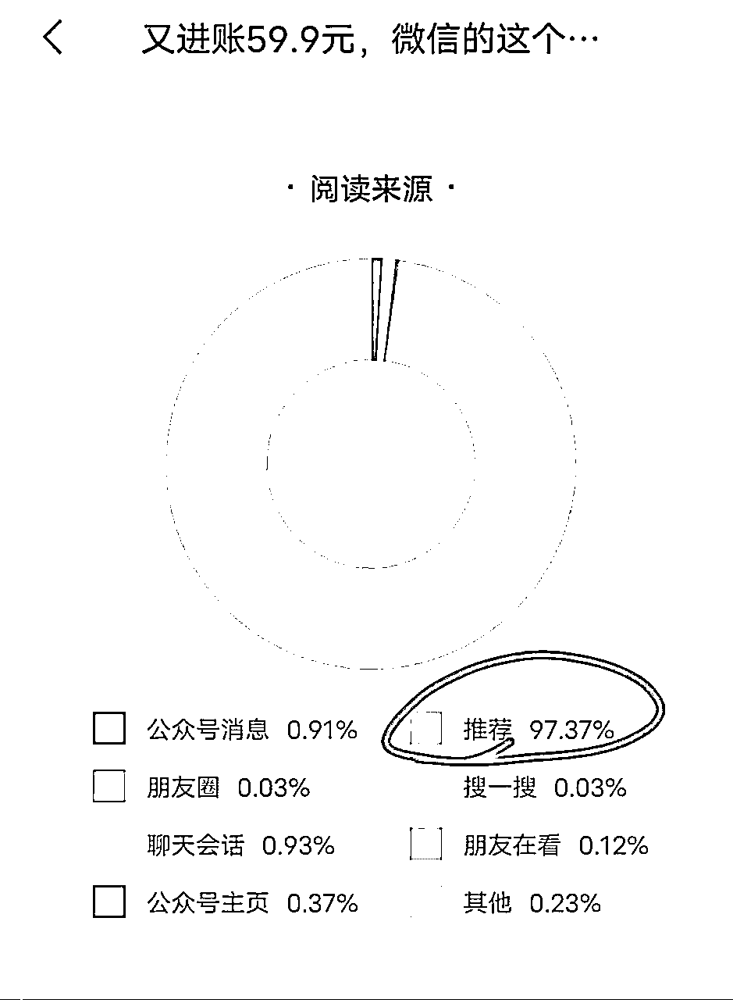
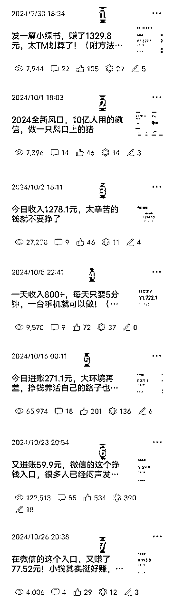
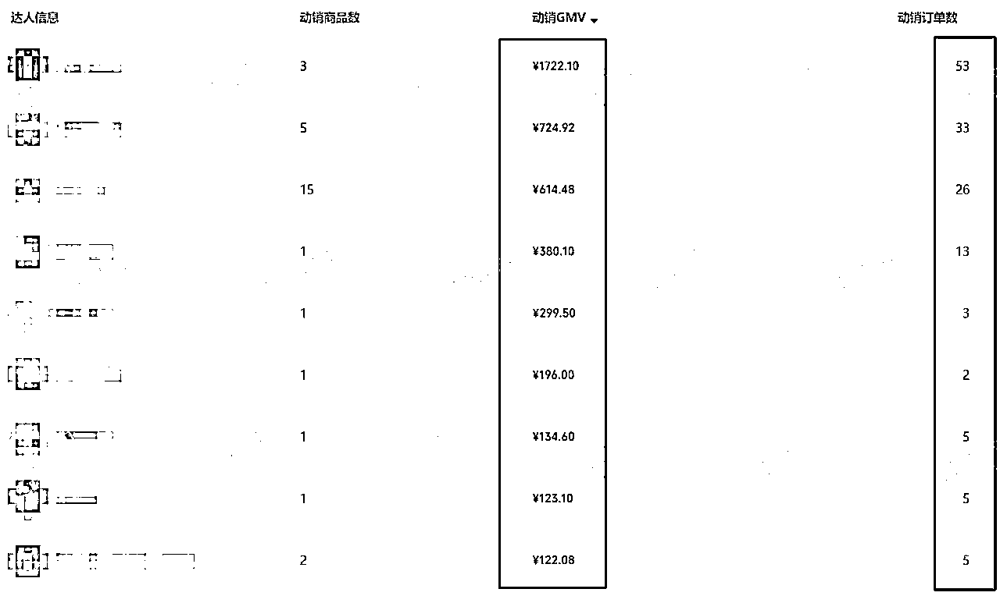
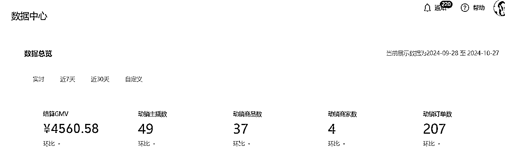
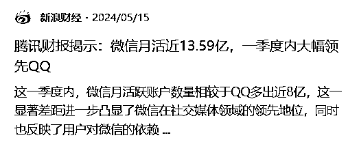
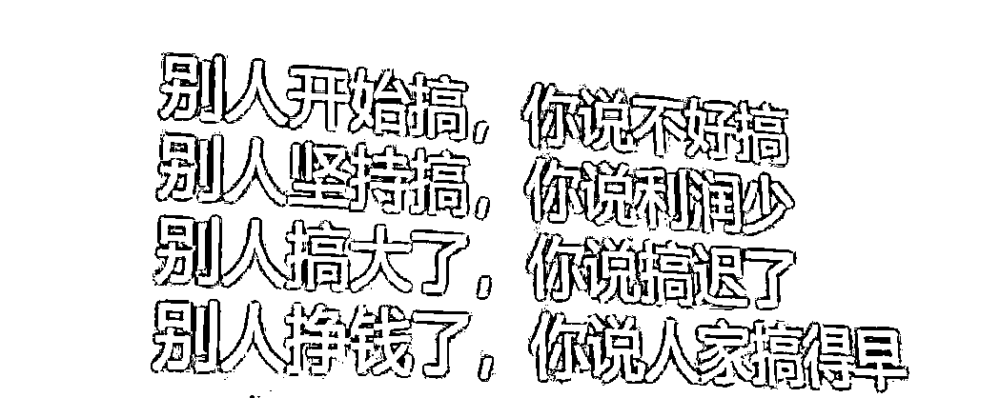
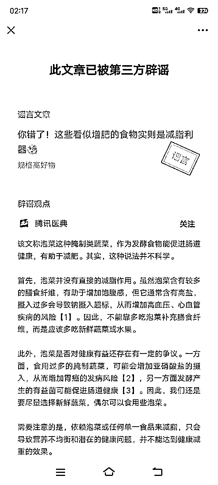
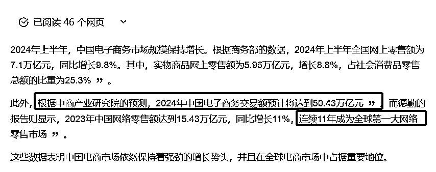
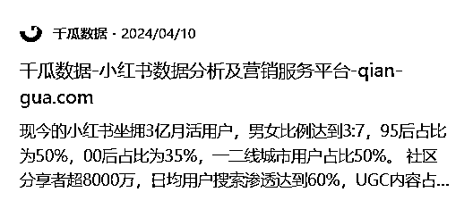

# 小绿书带货实操复盘

> 来源：[https://die28mmde0k.feishu.cn/docx/IBqbdNARooDtnCxBZflcK71SnHf](https://die28mmde0k.feishu.cn/docx/IBqbdNARooDtnCxBZflcK71SnHf)

嗨，你好，我是安七。毕业1年，通过AI+写作（公众号爆文）年入7位数，最近在跑小绿书带货。

这是我在生财写的“AI小绿书”系列的第2篇。第一篇《项目实操：如何提高小绿书爆文出单概率》的精华帖在这：

从

9月27日

和生财10X孵化的负责人@许老师，见面聊天，许老师聊到了“小绿书带货”这件事，

9月29日，团队伙伴开始着手准备，

10月5日，小绿书带货小分队正式实操，

10月12日，写文发生财获得精华，

到今天10月28日，

刚好差不多一个月时间过去。

我把这近乎一个月的实操情况，做了个复盘。

也和生财的各位老师、圈友们分享：

一支几百人的队伍，20多天的实操情况究竟如何？

# 一、整体玩法：

大概玩法可以简单分为2大部分：

流量端、供应链端。

我主要做的，是前者。

团队伙伴@跨境压舱石凳子哥 负责后者

我的玩法是：

通过公众号爆文，加私域——转化带货小分队群，筛选执行力强的人——带专属高佣货盘。

值得一提的是，公众号目前，其实也或多或少，在助推“小绿书带货”方面有关的文章（建议不要营销性质太强、纯广告）。

比如我前几天刚写的一篇，有关什么是“小绿书带货”方面的科普干货文，阅读量直接12W+。

尽管文末带了我的二维码，但还是有97%以上的推荐流量。

说明平台其实是，想让更多人知道小绿书带货方面有关。

# 二、实操情况：

9月30日，我的公众号开始发有关小绿书带货的文章。

一个月时间，公众号输出有关“小绿书带货”的文章共计9篇、正式的7篇，

数据分别是：7.9k、7.3k、2.7W、6.5W……最好的一篇，是前天出的，12W+。

通过这些文章，实现了 20多天时间：

公众号涨粉：7600+人、

私域好友：飙升至7500+人，增长差不多4000人

小分队：从0到400+人

出单人数：大概80+人

累计出单：207（不完全统计）

单王：53单 营业额1722.1元

GMV：4500+

（有一些伙伴没有带我们指定的商品，所以出单没有登记上）

# 三、为什么可以抓住这次机会？

## 1.平台红利

平台也在助推，这对我们来说是个好消息。

如果是平台不允许的、对着干的，很难在这么短时间内拿到结果。

上一次微信闭门大会的召开，就释放了微信要做自己的电商的信号——

做为一个拥有13.9亿月活用户的平台，电商这么大的板块，怎么能不做呢？

微信想做电商，现在有创作者免费帮它打广告，何乐而不为？这是平台角度，我们占到的一波红利。

## 2.圈子

还有就是圈子，生财做为国内排名TOP的搞钱社群，有很多搞钱方面的信息差、贵人、大佬

除了我们投资人张哥外，今年在生财又遇到了很多贵人，比如许老师、坤汀、秀儿……

这里也要感谢生财圈友越越、孟等伙伴，如果不是大家真诚利他的分享，很多细节也就不得而知。

虽然信息差最终或多或少都会被打破，但是时间也是钱，能早知道和拿到的，肯定更好。

不在生财圈的话，我是很少会关注到这块的，可能要过段时间才有体感。

每个小机会都值得认真对待，年轻时遇到一个好的引路人、好的圈子，可能会改命。

## 3.团队

小绿书带货这个项目玩法，一个人可以做，但是一群人可以做得更好。

我看到很多的博主做这些，大部分也是抱团取暖，一个人到底力量有限。

我曾经尝试过，既负责前端流量，又负责后端商家对接等的，超级累。

因为小分队伙伴想带某个品，所以有一次去找有关商家看看，结果发现这个过程太浪费时间了

比如：

有商家要很久才通过你的好友申请；

有的商家周末、节假日不发货；

还有的商家，给到的佣金和选品和选品中心的差不多，聊也不肯提高佣金……

一个完整的闭环最好是：有人前端引流、中间销转、后端交付。

光是引流（写公众号爆文）都要用心打磨很久，更别提有人来加你，然后一个个通过、聊、拉群、发资料、答疑……

所以这个项目，我们是有3个人在打配合：

我：发挥文字特长，写爆文，引流私域

鸡汤：发挥运营特长，负责社群运营

凳子：发挥后端项目操盘手优势，自建小店，有供应链、选品优势，提供高佣链接

一个人可以走得很快，一群人可以走得更远。

## 4.个人

个人的话，我觉得这次做得很好的一个地方是：把优势发挥出来，找到最适合自己的流量路径。

不管做什么生意，都是：流量为王。

9月其实我陷入了流量卡点和焦虑，在肖肖的推荐下，链接到了艾瑞克老师，想通过无人直播打破流量入口，为此也去了一趟山东，找艾瑞克老师拜师学艺。

但可能真的没有啥直播方面的天赋，我做的每一分钟都挺拧巴，就是干不好。

没想到9月中旬回来后，我的号居然入了流量池，在测了不同的标题后，发现写“钱”方面的，阅读量很高，所以就紧盯着这个点去输出，

刚好又遇到了小绿书带货出来了，写这方面的文章，又被平台推荐，接下来的打法就是：

围绕异常值，集中输出。

才慢慢做到：不到一个月，引流差不多4000人。

# 四、项目复盘：

做了差不多一个月，由最初的懵懂，到现在逐渐有心得体感。有做得好的地方，也有不足的地方，还有的踩坑了。

## 1.好的

做得好的方面，主要有：

### 1）对时机的把握

凳子的号是十一之前开好的服务号，所以推流还不错，出单也还可以。

十一期间，有很多人才慢慢反应过来，想开，但是放假，工作人员不上班、要等十一之后才能审核。

这个期间又卡掉了很多人，时间红利没有尽数吃到。

### 2）执行力还可以

项目刚出、确定要做的时候，张哥一天给我们打三四个电话强调重要性，

团队每个人基本上都是打鸡血一样的状态，压力值很高，执行力也很强。

凳子更是夸张，从早上8点爆肝到凌晨一两点，除了基本的吃喝拉撒，基本上一天都在盯电脑，做素材、选品上架、发货……

线上团队也在紧锣密鼓的筹备、配合，一个人当2个用。

## 2.不足

不足之处，就是对事情的判断。

9.27日，许老师问我知道小绿书吗？我说：知道。当时很狭隘地认为，小绿书只能赚流量主收益，还有点“瞧不上”这点小收益

（也是路径依赖吧，之前做公众号爆文，一天能有4000+、一篇文章1.2W收益，

所以本能地会觉得，文章收益更高，不想做图文，图文收益可能只有文字的1/3。没想到小绿书还能这么玩。）

有高手点了啊，许老师都说了，可以留意一下。但是也没点透我（哭笑不得）。

后来，是看到生财的精华帖，短期内，居然有2个都是有关小绿书的？还有张哥的战略，说这个事一定要重视起来，

所以才开始正视这件事，开始干起来。

事实上，当我做到一半的时候，就有好几个不同的人来加我，也有资本方面的人打电话给我，说想了解一下这方面。

后来我悟了：自己没有战略的时候，过早的对一件事下定义，不见得是件好事。

虽然很多小项目、机会，不一定要上升到“战略”这么高阶的词语，但，有时候就是这样，很多人没办法判断和把握风口。

## 3.踩坑

踩坑这个，我倒是没有踩平台红线的坑，有看到踩平台红线的坑的，如图：

因为主要做的是前端流量、社群，所以这里只从这两个方面去分享，其他的凳子到时候可能会补充上。

### 1）没有提前把企微设置好

如果你也想通过公众号爆文，引流自己的私域，去承接这部分流量，有企微的，建议最好用企微。

个微加多了，还是有点风险。

企微可以提前设置好：欢迎语、自动回复……

就像前两天我的企微也爆了，但是当时还没有来得及设置欢迎语，所以很多人只是加了在那里，但是一句话没聊

### 2）在线链接容易被举报

我本来，一开始是做了个在线的招募文档，这样大家就不用下载，点击即可查看

结果有人眼红，举报了文档，还是后面有伙伴反馈说文档怎么打不开了，我才发现

这个动作没有留意到，可能也损失了部分客户。

后来的对策是：做成pdf，这样就不容易被举报了。

# 五、其他想说

其实小绿书带货还是比较简单的，门槛也比较低：

如果你的视频号能开通橱窗、绑定公众号，那么可以直接0粉丝带货。

如果你视频号、公众号都是全新号，要去电脑开通“联盟”商品，100粉丝即可。

就是现在官方也还没有那么明朗，说一是一，二是二，很多要去测，它的内部动态变化不透明

但：危机危机，危中有机。

反而我们觉得，大家都在围观、少部分人开始先行的时候，是有红利机会的时候

因为：

## 1.电商市场够大。

先来分享一下，我国电商市场规模参考：

我国电商市场就像一个巨大的蛋糕，而且每年这个蛋糕都在变大。

所以，首先电商这个市场空间就很大。

## 2.微信电商市场够大。

图文带货这块，小红书这两年一直在研究。

不然为什么小红书从一开始的“记录你的生活”，变成了“小红书-你的生活指南”。

指南是什么？是可以分享、帮你拔草种草的。

微信电商虽然近期才发力，但它有一个得天独厚的优势：

几乎每个人的手机里都有微信，微信月活接近13.9亿！

如果微信来做电商，那就好比是在一个超级大的商场里卖东西，人流量巨大，机会多多。

小红书我可能不会每天都打开，但是微信我一天不打开就会难受。

我们把微信电商和小红书电商，在流量上做个对比：微信月活用户接近13.9亿，小红书月活用户接近3亿

在用户数量上，微信的用户明显比小红书多得多，差不多是5倍。

虽然小红书的用户更年轻，更活跃，但微信的用户更多，覆盖面更广，这也意味着在微信上做电商，你的商品有机会被更多人看到。

## 3.小绿书带货，亲测的几个好处有：

### 1）不用亲自进货

它不像线下实体，假设你卖菜，你要去市场进菜，然后交摊位费，一对一卖给客户。

但在微信小绿书上卖东西，你不需要自己去买货、存货。

你可以和供应商合作，他们负责发货，你只需要负责推广和销售。

推广和销售也很简单，就是找好看的图片、写文字，甚至文字10-500字内就可以了。

### 2）一份时间复用多次

你写一篇文章或者做一个视频，可以被很多人看到，而且可以一直被看到。

这样，你花时间做的内容可以帮你赚很多次钱。

### 3）只要有流量渠道，就能出单

只要你的内容够吸引人，微信就会帮你推荐给更多的人。

这样，你的文章或者视频就会有更多的曝光，也就更容易卖出东西。

像我们这两天测下来，也有阅读量1个，但是卖出2单的情况。

好啦，复盘写到这里就正式结束了。

如果你觉得有帮助，可以点个赞让俺知道，感谢你的慷慨~