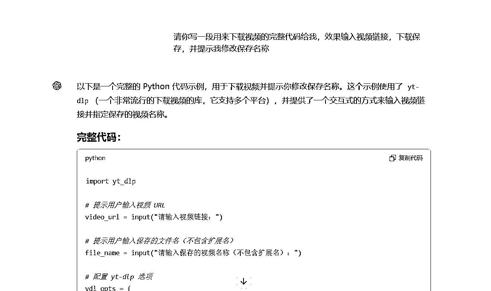

# 编程小白如何用AI实现在大佬眼中轻而易举的功能

> 来源：[https://jye96fr7e2.feishu.cn/docx/IZE4dh4IqoWH3cxS1FVcS20hnub](https://jye96fr7e2.feishu.cn/docx/IZE4dh4IqoWH3cxS1FVcS20hnub)

# 前言

最近一直在关注shorts超级标的信息，想要尝试却一直担心自己有没有这个能力，一直在纠结。

后来看到了大佬@叉叉敌分享的文章：Shorts 爆款AI 视频，一键复刻，决定先按照文章去复刻一遍，看看能不能实现。

但是一开始就遇到问题了，一个在大佬看来很简单的事情，对我这种小白来说却是很困难：下载youtube的视频。

不过大佬也给了解决方案：

youtudl？什么东西，听都没听过。我不知道不要紧，身边有个随时可以召唤的编程专家：GPT。

通过跟GPT的多轮沟通，最终实现了可以下载视频的功能，同时完善了一些功能，让自己用起来更顺手，下面是效果演示：

具体的思路其实很简单，就是遇到问题就问GPT，让GTP给结果、给代码，然后测试代码，再把测试结果给GTP，指导实现自己想要的效果。

# 核心功能实现的具体过程：

先解决youtubedl这个工具是什么，要怎么安装的问题，要先有个了解，才能进行后续的工作：

从GPT的回答，大概知道了youtudl是个什么工具，但是给出的安装步骤还是看不懂，所以继续提问：

按照GPT的教程，成功安装了ytdl，但是给GPT给出的代码太过于零散，需要他给出更完整的代码：

代码有了，接下来就是测试，非常顺利地下载失败，失败了问题不大，把报错信息发给GPT，它就会告诉你为什么出错，原来是少装了一个插件：

根据提示下载安装需要的插件，再次运行脚本，成功下载好了视频，到这里下载视频的功能就实现了，已经可以正常使用了。

整个过程看起来简单，但是过程中还是走了不少的歪路，最主要的问题是需求描述得不清楚，导致GPT给出的答案不是自己想要的。

# 优化迭代

后续为了用起来更方便，又跟GPT进行了一番友好探讨，增加了一些功能：

1.  增加自检功能，看需要的插件是否安装，没有安装的话自动安装下载

1.  第一次使用的时候可以自定义视频保存的位置

1.  增加了连续使用的功能，不会运行完了自动退出

1.  隐藏运行过程，只输出结果，保持画面的简洁

增加了上述功能之后，最后的效果就像是前面演示视频那样了。这些功能其实都是锦上添花的功能，没有也能用，就看个人需求。过程跟前面差不多，都是跟GPT交互，这里就不再写具体的过程了。

# 总结

AI的发展，极大的降低了我们这些非专业人员去使用代码实现一些功能门槛。不用再去学每个代码是什么意思，要怎么组合。只要学会如何提问，如何清楚地表达出自己的需求就可以了。

就先分享到这里，继续去复刻大佬的过程了，有进展会再跟大家分享。