# 复盘：曦子操盘自身产品（含100多篇美学干货的小报童，一经发售突破了3800+份，成为了小报童设计类目第一）

> 来源：[https://ys5n5rzrv4.feishu.cn/docx/J2uvdyHFLoHAigxhnk0cp1y5nBh](https://ys5n5rzrv4.feishu.cn/docx/J2uvdyHFLoHAigxhnk0cp1y5nBh)

10月中旬，曦子结束了一场发售，那是曦子第一次操盘自己的设计类小报童产品，最终变现五位数，私域增加2000+人，报名1799元的设计私教超过6人。

在发售结束后我详细整理了一份复盘，希望对后续也想创作小报童产品的伙伴有所启发呀。

此文档会分以下几个点来阐述：

1、曦子的设计小报童复盘感悟

2、曦子发售小报童的全流程分享

3、小报童的发售策略

4、小报童的低转高策略

5、小报童的发售小细节注意

# 一、曦子的小报童复盘感悟

先说下总体成绩。

8月份曦子的小报童产品开始内测，自己和团队的姐妹一起卖，在4天内纯自然裂变突破了1000+份。

9月份曦子策划了一场小报童的发售，发售活动结束后，10月份突破了3800+份，成为了设计类目第一的小报童。

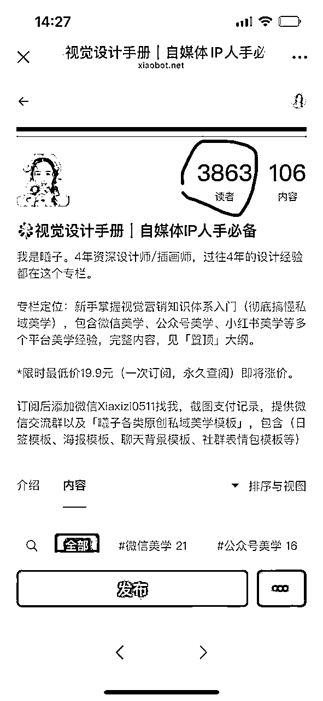

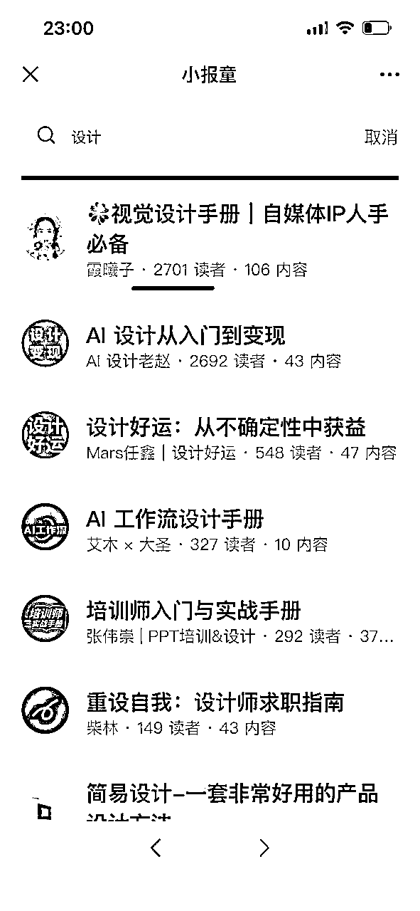

我给大家分享下此次自己操盘自己产品的4点经验呀。

### （一）要有规划意识

我之前是没有策划操盘过产品发售的，也是初出茅庐，所以我去各个星球查看了很多大佬的的小报童发售复盘贴，比如龙哥和大全的，看看他们是怎么做的，吸取一些经验。

我先全面梳理了一下他们的操盘流程和关键点，找到一些共性，然后自己去拟定了一份大纲，往里面去填写自己要去做的关键动作，一项一项进行核对，看看自己有没有哪里没考虑到。

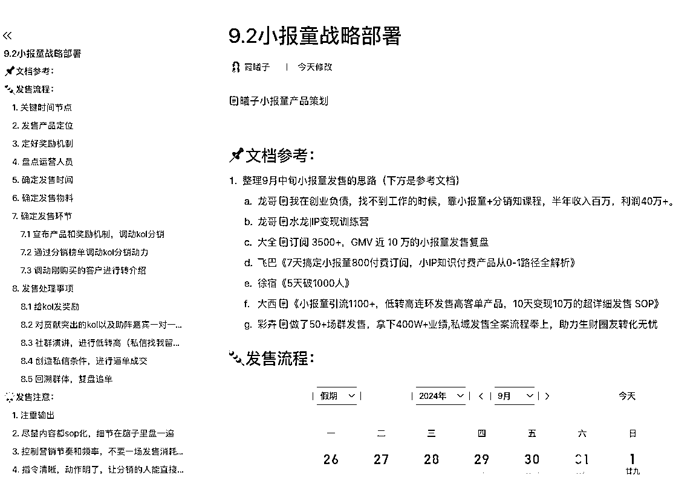

最后拿着整份我写完的策划去找老马和龙哥，问问他们我后续这么来可不可以，有没有调整的地方，他们看的时候就会清晰很多。

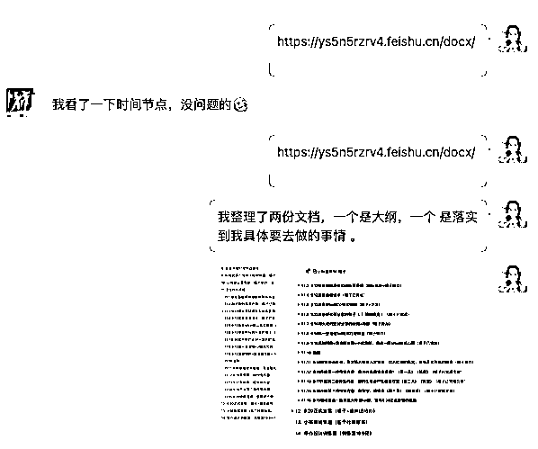

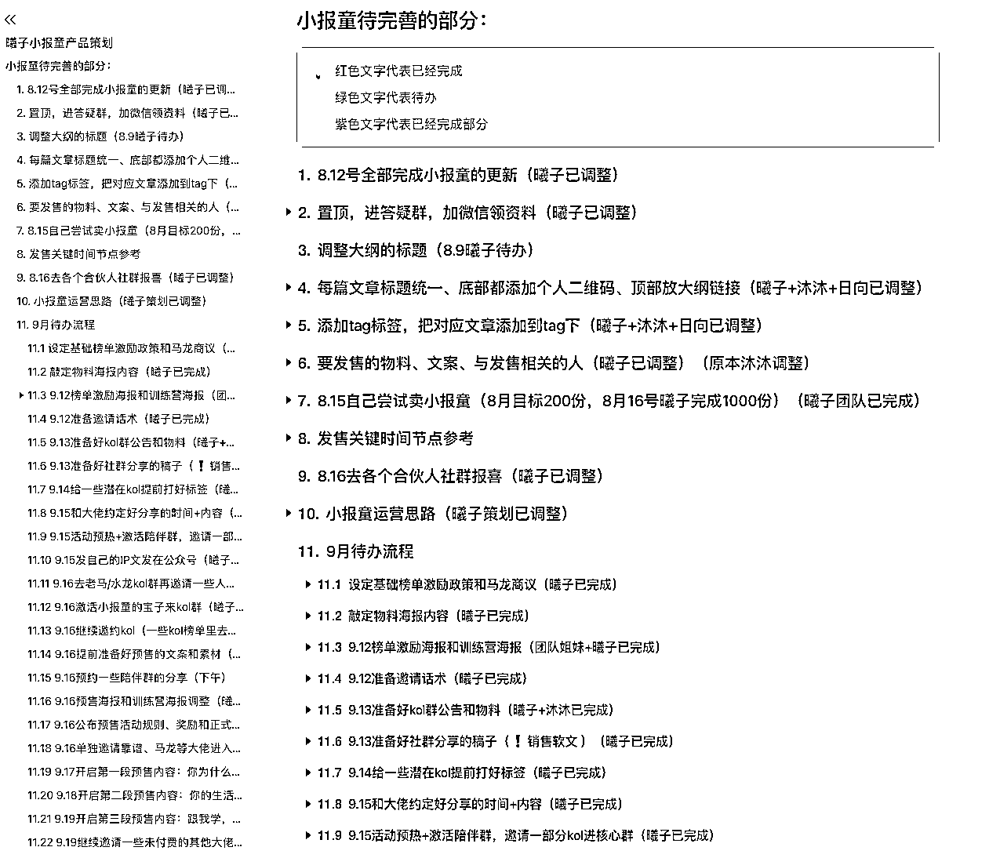

重视规划有这几个好处

1、重视规划，能够让你捋清楚自己的整个发售思路，减少后续一些不必要踩的坑。

2、重视规划，能够让你对整个产品发售非常有信心，有了信心，你的成功率至少大10倍。

3、重视规划，能够让你写复盘贴的时候游刃有余，只需要在这份规划上稍微改改就可以直接发在不同的星球了，一鱼多吃，高效利用。

4、重视规划，能够帮助你对抗焦虑，让产品的发售始终以有条不紊的节奏进行下去。

对我来说，重要的事件我都会做好充分准备才会开始，这是一个很好的习惯，分享给大家。

### （二）关键事项需多询问有经验的人，不闭门造车

在小报童发售期间，榜单奖励是很重要的一部分，既要让人有想冲的欲望，又要控制成本，其实挺难的。

我的小报童榜单奖励，前期是在老马、龙哥、丸子、波波的不同建议下，调整了10多遍才有现在的样子。

后面对比一看，确实是比第一版本好太多了。

整体来说，如果自己没有什么操盘发售经验，那就得多请教自己付费过的大佬，也许对方一个建议就价值千金，让你的产品发售更容易成功。

千万不要一个人吭呲吭呲去做，多问问几个人的意见总归是好的，也许别人就能够发现你做得不足的地方。

这次也真的是太感谢老马、龙哥、丸子、波波给我出谋划策了，每一个建议对我的帮助都特别大，在小报童这么卷的情况下，如果没有他们的建议，我很难拿到这个成绩。

### （三）学会团队分工合作，提高成事效率

凡事不要亲力亲为，团队分工合作很重要。

我在发售期间要不断和各个用户去沟通，也要发各种奖励，还有其他一些杂七杂八的事情，有时候忙不过来，我就会和我设计团队的人一起去做。

就像我自己的发售海报，都是交给她们去做的。

这次发售，她们也担任了社群的运营官，有人负责文案撰写，也有人负责福利兑换。

这样，我就能腾出更多时间去思考整个发售方向、战略上要去做的事情。

发售活动，最不能偷的懒，就是战略上的懒。

团队合作，把每个人的时间都利用起来，更能高效成事。

### （四）要以目标导向去实现自己的规划

这次小报童发售，我的基础目标其实是2500份，一个不算特别高但我够一够也能完成的目标。

我就会去围绕这2500份去做一个系统的梳理，关键人和关键资源都捋出来，该邀请的kol就主动一点去邀请。

虽然说别人帮你是情分，不帮你是本分，但你有没有主动去做这件事，差别真的很大。

主动一点，结局无非两个，拒绝 or 同意。

他拒绝，你没有损失，他同意，你就又多了一个愿意帮你卖的盟友，也更容易实现自己的目标。

### （五）平时多积攒善缘，总有人会为你出手

在别人需要帮忙的时候，你伸出援手，那在你需要帮忙的时候，别人也会向你伸出援手。

关系的建立就是从你帮我、我帮你不断建立起来的。

我记得书里有说过这样一句话，贵人+超强执行力=取得成绩。

这句话真的醍醐灌顶，我能做成事，一定不是我一个人的功劳，我有的无非是执行力。

我的盖洛普就是大战略+执行，所以只要我想去做一件事，那大概率做的不会太差，无非是时间问题。

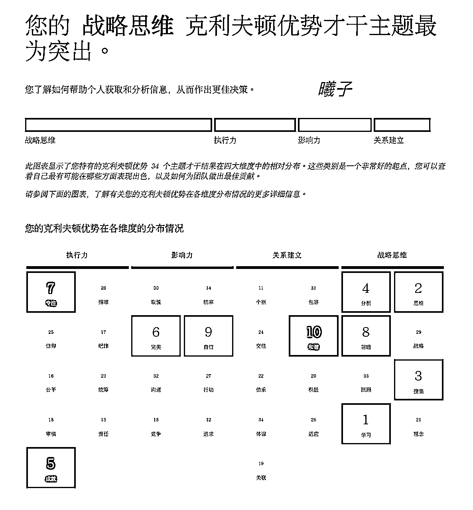

但关键时刻，还需要贵人推你一把，你离目标就会更近，成事的概率也会越大。

那贵人怎么来的？在你平时多付出，主动提供价值的时候，贵人自然会来。

所以呀，平时多积攒善缘，总有人会为你出手。

### （六）特别想感谢的人

这场活动，多亏了有一些好朋友和恩师的帮助，让我顺利发售，突破近4000份小报童。

#### 感谢龙哥❤️

从跟着龙哥的那一天起，我的人生就像走在开挂的路上一样。

因为龙哥，我有了自媒体第一单文化衫业务，后来龙哥逐渐拓开自媒体领域的IP文化衫市场，因为衣服质量确实很不错，很多大佬都去找他定制，包括粥左罗、靠谱，我也因此绑定龙哥文化衫设计的业务赚到了钱。

后来龙哥还给我各种海报单子，鼓励我做团队 ，鼓励我带队作战，教会了我很多商业化技能，我入龙哥的学费也是好几倍地赚回来，也深深感受到那种被认可的力量。

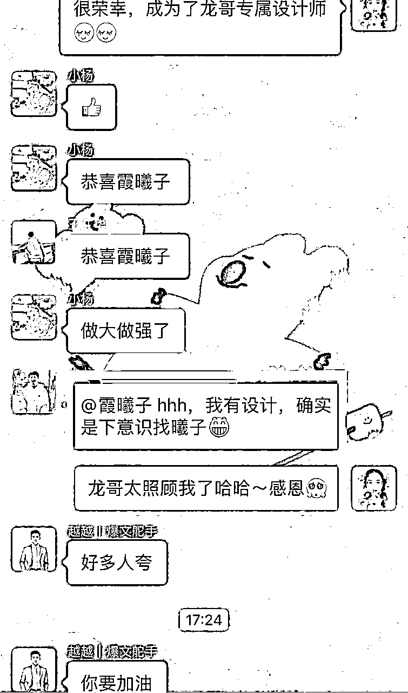

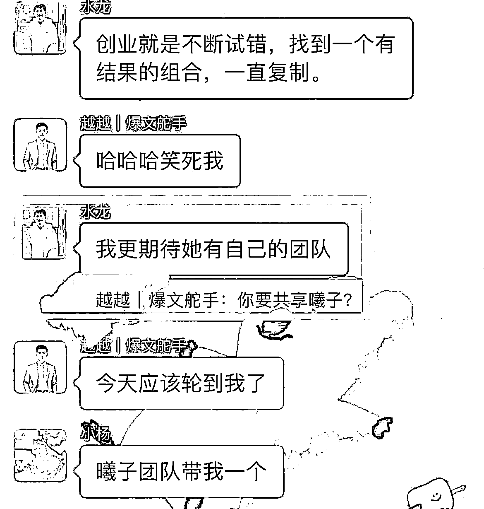

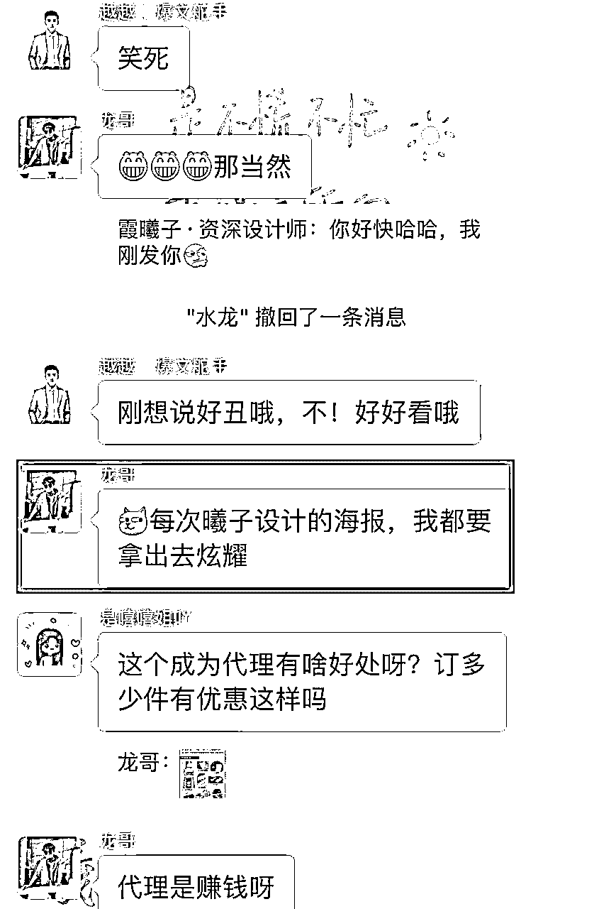

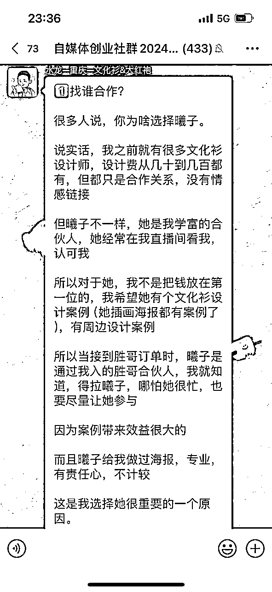

这次我要操盘自己的小报童发售，龙哥也是给了我很多宝贵建议，提供一些kol资源，我才做得如此顺利。

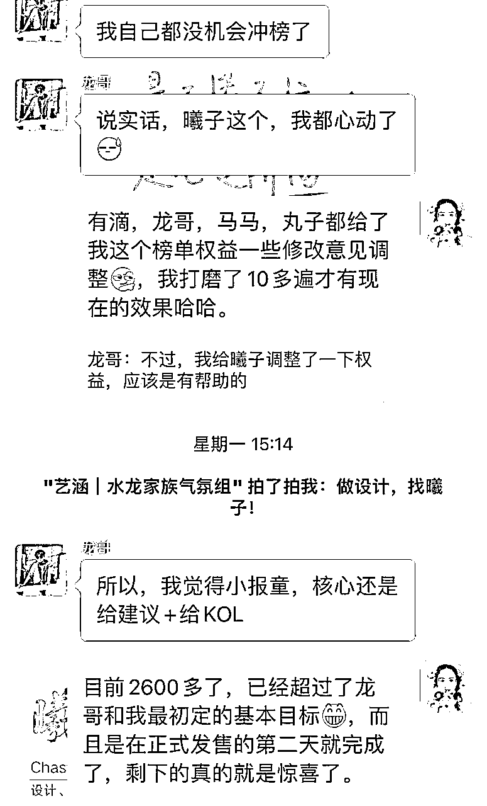

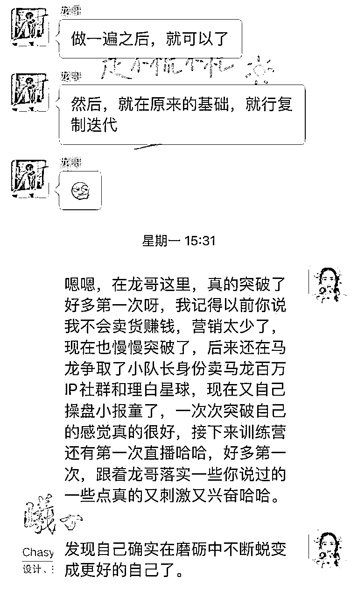

谢谢龙哥，谢谢龙哥一路带我成长创富。

#### 感谢老马❤️

老马是带我入圈的人，是恩师。

这次小报童发售，我问过老马好几次他的想法，他给了我很多宝贵的意见，特别是在榜单激励这块做了优化，后续还发了好几条朋友圈替我宣传。

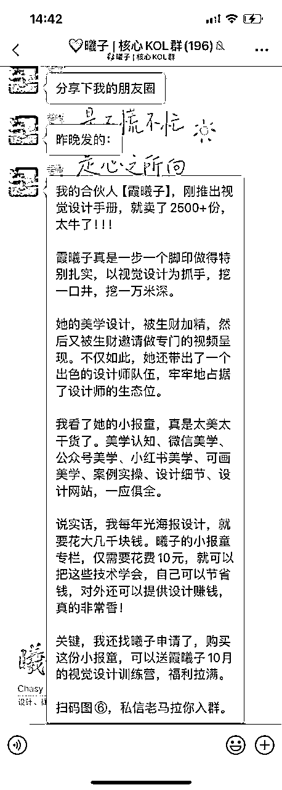

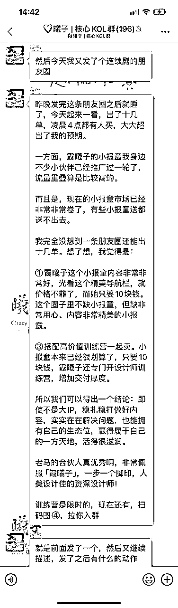

老马对自己人特别好，也耐心传授他人经验。

#### 感谢波波❤️

波波是我幕后之人，也是帮我算过好几次账，我第一次操盘自己的小报童发售，算术上没那么敏感。

当我把发售的榜单激励发给他的时候，他立马就帮我算清楚了，如果有人冲，我需要付出多少，对方能得到多少，帮我优化榜单的激励，使其又有诱惑力的同时，又能更大化地节省成本。

于此同时，在发售期间，他也同样帮我卖了200份小报童，特别感谢波波的铁力支持。

#### 感谢丸子❤️

丸子是我的好朋友，在小报童前期策划到时候就帮助我很多，给了我很多建议才让我完整地做完这场活动发售，而且她还拿了我小报童的销冠，单人突破了400单，特别感谢丸子对我的认可和喜欢。

线下见面的时候我就见过丸子，真的是见过一面，你就会爱上的那种女生，丸子的那种高能量、情绪激发能力是我一直很羡慕的，以后我也要多多向丸子学习。

#### 感谢无岸❤️

无岸在我小报童刚开始卖的时候，就主动帮忙了，那个时候还没有任何奖励，他帮我卖了80多份。

后来小报童正式发售，他又尽他的全力帮我卖了400份，位居总榜第二。

我问他为什么这么帮我，他说因为我之前也毫不犹豫帮过他，我想这就是做自媒体难能可贵的地方吧。

#### 

篇幅有限，我就不一一感谢啦～整个小报童发售期间，有近300位朋友卖出去过1单曦子的小报童，赚到6元钱。

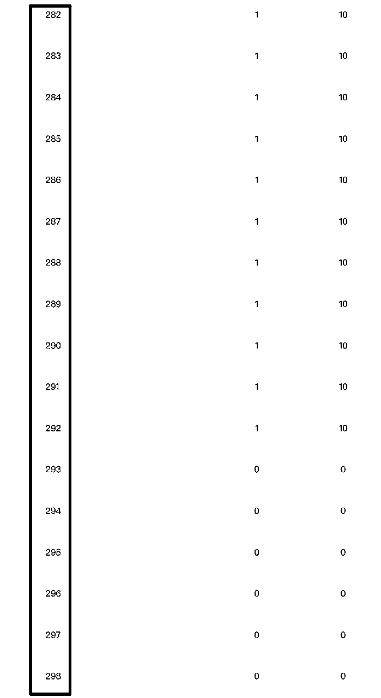

再次感谢每一位有卖过曦子小报童的朋友🌹。

# 二、曦子小报童流程线分享（细致版）

### 8.12号全部完成小报童的更新

### 置顶，进答疑群，加微信领资料

### 调整大纲的标题

### 每篇文章标题统一、底部都添加个人二维码、顶部放大纲链接

### 添加tag标签，把对应文章添加到tag下

tag根据大纲的副标题进行添加

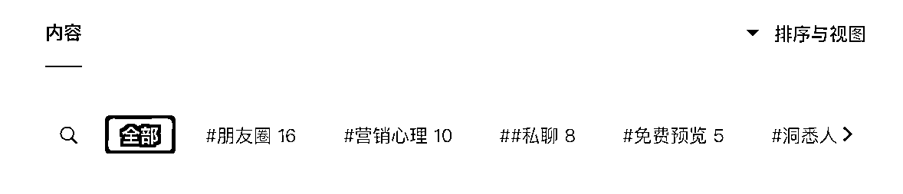

### 梳理要发售的物料、文案、与发售相关的人

### 8.15自己尝试卖小报童（8月目标200份，8月16号曦子完成1000份）

### 准备9月份发售事宜（9月目标2500份，9月份曦子完成3800+份）

### 设定基础榜单激励政策和马龙商议

### 9.12敲定物料海报内容

#### 小报童发售海报

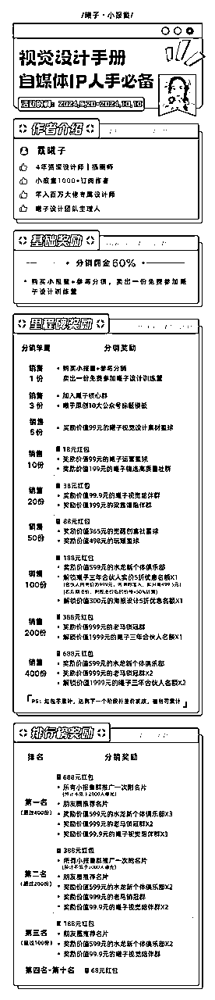

#### 训练营海报

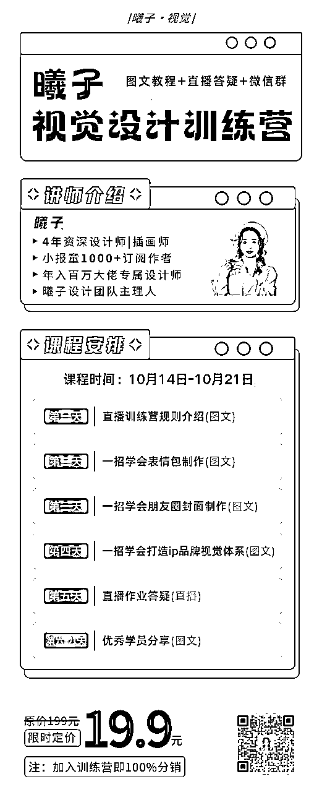

#### 3天倒计时海报

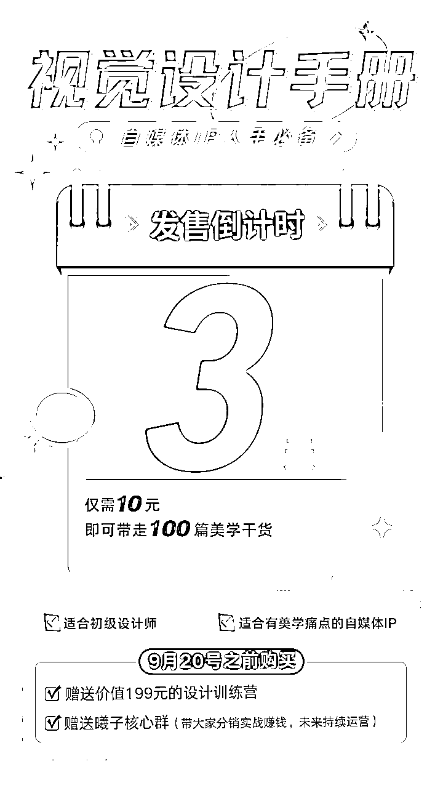

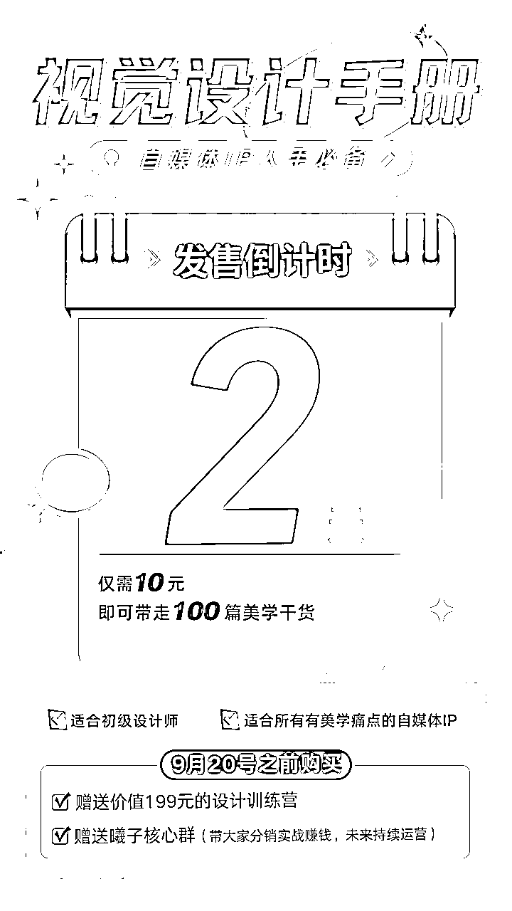

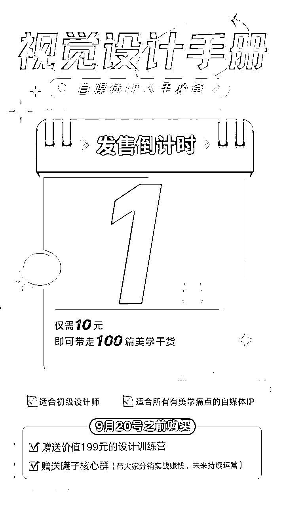

#### 里程碑喜报

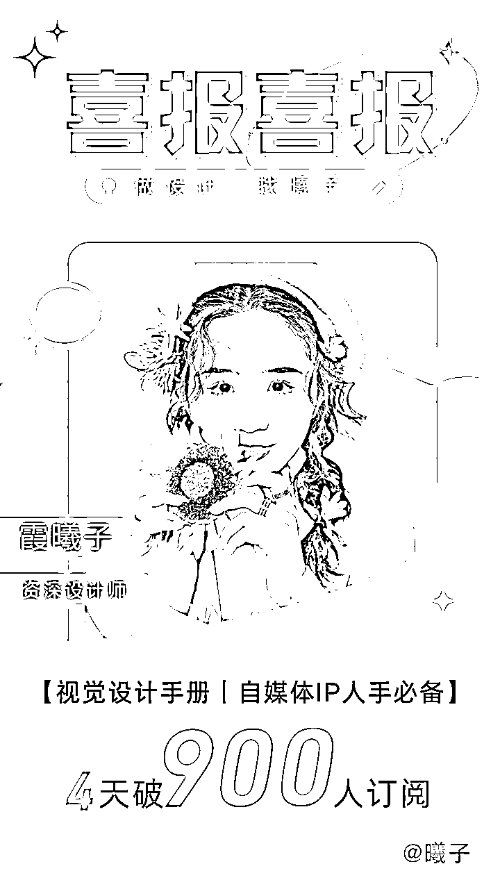

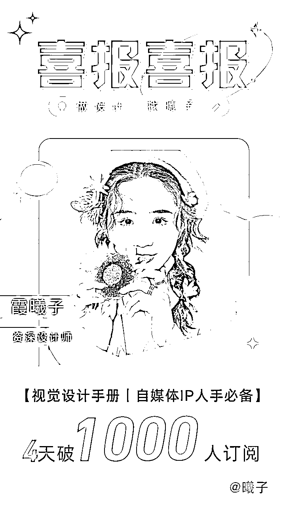

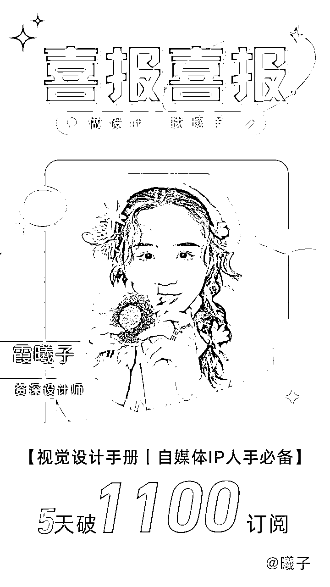

### 9.12准备邀请话术

邀请kol

xx大佬，你好呀

后天晚上9点，曦子的视觉设计手册｜自媒体IP人手必备小册冲榜发售，我邀请了各个社群群主，并准备了丰厚的奖励，诚挚地邀请你参加发售活动呀。

曦子的设计小册在没发售前小范围卖过，4天时间已经卖了1000+份，这次发售还配套了训练营和现金奖励，期待你来哦。

另外，这个活动结束后，这个社群也会保留，作为曦子的核心群，大家可以资源对接，信息共享。

如果确定参与的话，下方扣1，我来邀请你呀。

对于熟的朋友，发完上面这段话，再发个表情

### 9.13准备好kol群公告和物料

大批量社群进人以后，助理在发欢迎语的同时，提及首单奖励，准备运营文案，让大家更有欲望去分销带货。

用曦子社群表情包设计几个kol群会用到的表情包。

活动期间，突破1500订阅，2000订阅，2500订阅的阶段，可以在社群里发红包，带动社群氛围，让更多人知道这个活动。

日常出单鼓励。

### 9.13准备好社群分享的稿子

社群分享的稿子（曦子已完成）

### 9.14给一些潜在kol提前打好标签

### 9.15和大佬约定好分享的时间+内容

### 9.15活动预热+激活陪伴群，邀请一部分kol进核心群

欢迎各位来到曦子的小报童交流群

曦子的小报童还有3天倒计时正式发售啦

欢迎大家参与分销呀

在预售期间

分销佣金为60%

群里的宝子卖出去一单即可进入曦子的分销核心群

后续还可以免费参加10月份的设计训练营（直播+图文）

设计训练营原价99元，首发价19.9元

不参与分销的伙伴可以选择补差价9.9元加入哦

下方是曦子为大家准备好分销的流程和素材

分销成功的小伙伴记得私信截图给我

我邀请你入核心群哈

陪伴群的宝子们好呀

曦子的小报童还有3天倒计时正式发售啦

欢迎大家参与分销呀

在预售期间

分销佣金为60%

群里的宝子卖出去一单即可进入曦子的分销核心群

后续还可以免费参加10月份的设计训练营（直播+图文）

设计训练营原价99元，首发价19.9元

不参与分销的伙伴可以选择补差价9.9元加入哦

下方是曦子为大家准备好分销的流程和素材

分销成功的小伙伴记得私信截图给我

我邀请你入核心群哈

### 9.15发自己的IP文发在公众号

### 9.16去大佬kol群再邀请一些人

直接给到文案话术：

大家好呀，曦子的小报童之前小范围卖，进了小报童官方飙升榜前三。

这次曦子特意准备了一场发售，今晚8点会公布发售榜单奖励海报，咱们是17-19号预售 ，20号正式发售，大家想参与的可以扫下方二维码进群哦。

晚上会以大红包的形式正式发布此次发售规则。

### 9.16激活小报童的宝子来kol群

### 9.16继续邀约kol（一些kol榜单里去筛选）（上午）

### 9.16提前准备好预售的文案和素材（下午）

### 9.16预约一些陪伴群的分享（下午）

### 9.16预售海报和训练营海报调整

### 9.16公布预售活动规则、奖励和正式发售的海报

说出产品牛逼的点、产品差异化的点、产品能对用户产生价值的点，要吸引用户注意力，让他们感知到价值

造势可以提前三天设置倒计时（需要倒计时海报）

### 9.17开启第一段预售内容：你为什么应该在意我？（第一天）（机会）

关于“为什么”

做出承诺

确立权威性

向潜在客户传递价值

为第二段预售内容预热

号召 人们采取行动

### 

告诉大家一个好消息！

曦子的设计小册将在3天后正式发售啦！

前段时间曦子的设计小册仅在朋友圈卖

用了4天时间就突破了1000+份

小册包含100多篇美学干货内容

大家都直呼太值了

这次

曦子为了让大家学以致用

能够将美学经验知识+实践相结合

对此次发售的产品进行了迭代升级

凡在正式发售前购买曦子小册的朋友

都会免费赠送价值199元的设计训练营（直播+图文的形式）

同时

也能够获得进入曦子核心群的机会

此核心群

后期会持续运营

鼓励大家资源互换和信息交流

你没听错！

10元=100+美学干货+曦子设计训练营（直播答疑）+核心群

你算算这笔账

是不是觉得很值[偷笑]

购买后，凭私信截图

曦子便会拉你进群学习哈[社会社会]

### 9.18开启第二段预售内容：你的生活会产生哪些改变（第二天）（转变）

关于“做什么”

感谢与回顾

回顾承诺

简要回顾你的地位

解答疑惑

为第三段预售内容预热

号召人们采取行动

感谢大家的支持呀

昨天一天时间又有很多人加入啦

曦子原本这次发售就是想给大家带来一些新的内容和尝试

用小报童+训练营的方式让大家学以致用

这样能将知识发挥到最大用处

说实话

曦子做了4年的设计师

设计经验还算丰富

累计和中大IP合作的商业海报超过80+

在做自媒体期间也有幸成为了百万IP的海报专属设计师

比如老马、水龙、涛哥、越越、朱胜、波波

曦子想把更多的设计经验分享出去

用了几个月的时间才打磨出这份设计小册

我知道很多做自媒体的朋友都没有系统学过设计

在审美和执行上一直有困扰

小册的干货和小报童交流群可以解决大家的审美问题

而训练营课程可以解决大家的指导/执行问题

因为小报童群目前每天都有我团队的运营官在给大家派送美图

还有照顾不太熟悉小册学习方式的朋友特意安排的内容领读

此次发售

在8月17号之前

购买小报童都会赠送这套训练营课程

错过了可就没了哦

后期想加入训练营需要直接付费或者参与曦子的小册分销

达到一定条件才可以参加

所以，早就是优势

期待你的加入哦

### 9.19开启第三段预售内容：跟我学，慢慢来（第三天）（所有权）

关于“跟我做”

表达你的感激和兴奋

快速回顾承诺，再次强调你的地位

展示一小段案例研究

回答人们问的几个重大问题

向潜在客户讲解你的宏大规划和事先规划的方法

嫁给你 话题中心转向产品推荐 ，实现“软着陆”

为你的产品发售培养稀缺性

号召人们采取行动

真的太激动了

有这么多朋友私信跟我说：

你的内容太好了呀，这个产品超级哇塞！

这份小册

还没正式发售的时候4天时间朋友圈卖了1000份

离正式发售还不到1天时间又有XXX人加入

产品好不好

真的就看大家的选择就知道了

而且成本不高

一杯蜜雪冰城的价格

后面我是这样想的

大家买了小报童以后

进我的小报童交流群

我的团队运营官会在周一、周三、周五给大家派送美图内容

周二周四带大家零度小报童的内容学习

后面训练营的安排

第一天大家了解规则

后面图文给大家分享课程内容

大家可以进我的星球进行打卡

每天早上都会抽取一些打卡作业进行点评

在课程快结束时也会给大家来一场直播答疑

解答大家在做作业中的困惑

最后一天给大家分享下优秀学员成长路径

听我说完这些

你是不是很心动了呢

目前做自媒体设计类目的小报童只有曦子

同时配套极具性价比的干货+训练营课程

相比你也找不到别家

有需求的朋友不要错过哦

今天是最后一天购买可以直接送训练营啦

### 9.19继续邀请一些未付费的其他大佬进kol群，宣布9.20正式发售的信息

### 9.20正式发售

带头发朋友圈

晒分销群来的大佬

晒小册里程碑订单数

晒小册的价值（产品牛逼的点、产品差异化的点）

晒小册写的内容

晒个人IP成长经历内容

晒大佬的宣传

每天收集发圈素材

看发售情况设置日榜

鼓励出单人员（多夸）

### 小报童结束后（各个社群报喜）

### 举办设计训练营（训练营结束升了6名价格1799元的私教）

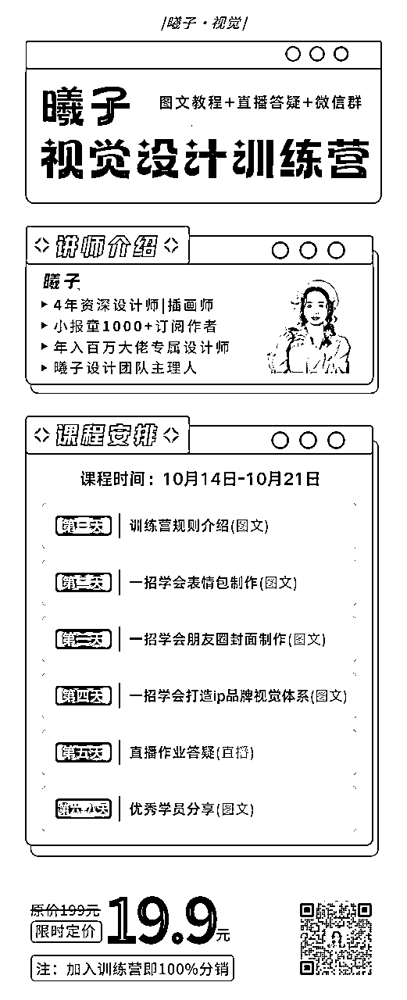

# 三、小报童发售策略

有一个目标，围绕目标去做关键动作，这样做事，会尽可能地贴近理想成果，甚至超预期完成目标

1.  优先梳理自己的发售目标，初步估算自己可以搞定多少份，需要邀请多少kol，关键kol需要搞定多少才能够完成目标

1.  去邀请一些平时跟自己关系还不错的kol互推流量

1.  邀请一些各个榜单里排名靠前的kol合作共赢

1.  自己付费过的合伙人、社群可以约分享

1.  开启预售造势、带动一些人先发朋友圈，邀请大佬进自己的kol群（背书、站台）

1.  正式发售，开头前几天是势能比较猛的时候，多鼓励、多发红包

1.  发售结束，举办颁奖仪式

# 四、小报童低转高

可以给自己搭建一套由低到高的产品体系。

引流品、利润品、灯塔产品、活动品。

每个品都会有不同的特色，筛选出适合你不同产品的人，既帮助用户解决他们的问题，你也能够赚取相应收益。

下方举例：

### 小报童低转高形式：

押金训练营转化（曦子策划）

### 小报童转陪伴群（99.9元）

小报童群+百元群有明显区分，如下：

曦子的小报童群：

❶主小报童内容领读+美图分享

❷消化小报童知识+提升审美

❸曦子团队助理运营

❹社群无答疑，自由探讨美学相关

曦子的视觉陪伴群：

❶主设计+自媒体交叉领域

❷内容丰富、还包含21节海报课程

❸曦子主运营、每周三次分享

❹提供答疑，自媒体+设计相关都可问

（小报童群用户补差价可以升级曦子视觉陪伴群）

（每周做一次分享，做分享升单）

（重点让专栏点赞或有评论的人升单）

（通过日更公众号，种草产品或升单）

### 小报童转合伙人（999元）

#### 分销转化kol

卖小报童卖得比较厉害的人，越认可你，找到一个契机，就很有可能成交

#### 针对意向用户制作百问百答专栏

自己的私教、合伙人、陪伴群产品，将服务案例存放在专栏，并将高频问题都通过专栏的形式解答

*   降低自己的解释成本

*   方便学员分销

# 五、发售小细节注意

#### 给kol发奖励

注重发放奖励仪式，出单的kol，有可能成为第一批中高客单客户

#### 对贡献突出的kol以及助阵嘉宾一对一表示感谢

给突出贡献的人，专门购买一些实物礼品，比如明信片、抱枕之类

#### 社群演讲，进行低转高（私信找我留资料）

发售结束，再准备一份社群演讲进行低转高，要巧妙转化，话术可以这样组织：

对XX产品感兴趣，可以私信我领取重磅资料，私信转化

#### 创造私信条件，进行成交

对产品感兴趣，但犹豫支付，可以定金逼单，比如100、200元定金锁定，电话转化

#### 回溯群体，复盘追单

若发售没有完成预期目标，可以采用发售复盘会追单，把想了解发售流程的人邀请过来，讲一遍流程进行逼单

#### 注重输出

我在发售这次小报童的时候，已经写了100多篇内容，如果本身产品内容不够，即使营销，影响也不够大，产品是1，营销才是后面的0。

#### 尽量内容都sop化，细节在脑子里盘一遍

将军不打无准备的战，做一个重要活动，前期肯定要先捋流程，不然到时候手忙脚乱，会影响整个发售的节奏。

以上，便是此次曦子第一次操盘小报童产品的经验分享，希望大家有收获哦🌹