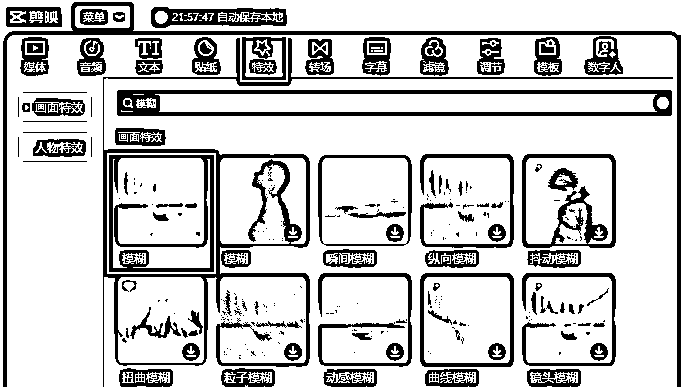
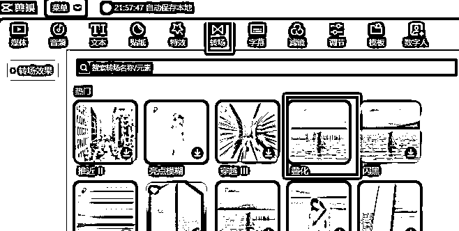

# 做一个普通的视频

> 来源：[https://gida8fb9mrg.feishu.cn/docx/KsYGd5uh6o41ERxoGCdc0aFtnfg](https://gida8fb9mrg.feishu.cn/docx/KsYGd5uh6o41ERxoGCdc0aFtnfg)

# 视频效果

# 制作流程

从视频上截图，然后使用质谱AI对图片进行反解析，再到生图网站生成图片。

生成的图片不一定像，一个是因为提示词不太准确，一个是AI本身就具有不确定性。

但生成次数多了，还是有比较满意的图片

先生成1:1的，然后再生成9:16的

接下来就是使用剪映，主要用到：

1.  模糊特效

9:16的图片会进行模糊处理，一个是符合短视频的尺寸，一个是在1:1图片放大时显得更自然

1.  文本朗读

视频中会有一些文字朗读，剪映上这个功能也是有的

1.  叠化转场

叠化转场也是为了自然过渡，是在两段之间添加的

1.  关键帧

1:1图片从出场时小，慢慢变大，就是关键帧起的作用

选中1:1照片，在左上角画面中就有缩放的关键帧。

1.  音频提取

在音频这里就有提取的选项，提取之后就能直接使用

