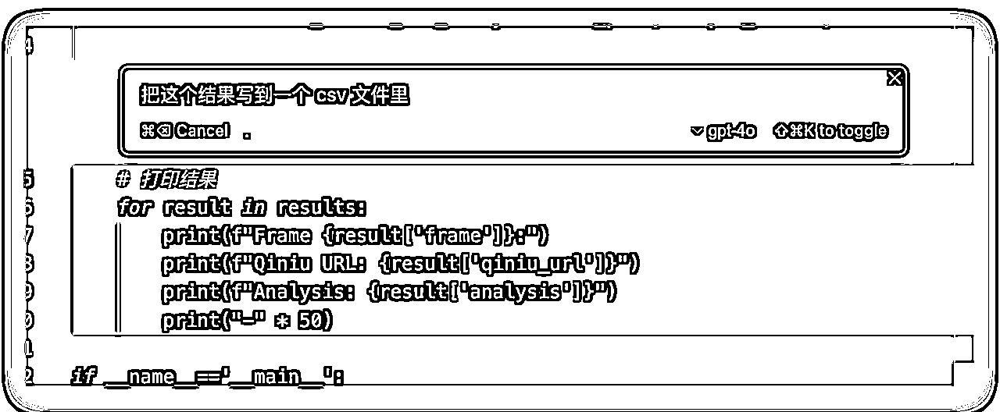

# shorts 爆款AI 视频，一键复刻

> 来源：[https://y3my0b87ql.feishu.cn/docx/LJ7VdrAWWoS6S8xmYjzc52Genf0](https://y3my0b87ql.feishu.cn/docx/LJ7VdrAWWoS6S8xmYjzc52Genf0)

来吧，超级风向标～ 实战步骤，搞起来。 文末有最后生成的复刻视频。

# shorts的AI视频的机遇

我看到这个超级风向标，觉得自己应该可以试试。

https://www.youtube.com/shorts/Rv3UNHs_EBQ


这个是估计从年度收入 300 万刀。


之前我一直在做公众号，公众号流量非常好。

现在越来越卷，但我看到这个 shorts机会，

这是美刀呀～，真的是非常心动的，可以尝试下。

所以说我看到这个机会的时候，兴奋～


# 爆款视频分析

直接找到这个号的比较

https://www.youtube.com/shorts/Rv3UNHs_EBQ

如何下载视频，可以通过 youtudl 工具直接就下载了，这里不展开了。下载完成后，如何复刻。

从视频可以看出来，这个视频是短多个多个脚本，多个短视频组成的一个长视频。有一个完整的脚本，然后生成视频，生成每一个几秒钟的一个视频，然后拼接成一个30秒钟的一个短视频。

# 思路是什么？

复刻视频的主要思路如下。

1.  通过脚本或程序对原视频进行处理：

按固定时间间隔剪切或取帧

例如：30秒视频，每5秒取一帧，共获取6帧图片。

1.  提取素材：

获取6张关键帧图片

直接剪切出背景音乐

1.  AI分析和生成：

将6张图片分别输入AI进行分析，获取每张图片的提示词

将得到的提示词输入到视频生成接口或网站

为每个提示词生成几秒钟的短视频片段

1.  视频合成：

将6个生成的视频片段拼接起来

添加原始背景音乐

1.  最终成品：

一个基于原视频内容、风格的AI复刻版短视频

以上全部动作都用 AI 来完成。

# 4\. 视频复刻流程

## 4.1 素材准备：音频，提示词，基准图

脚本实现：

首先提取视频的音频文件。

```
import moviepy.editor as mp
import os

def extract_audio(video_path, audio_output_path=None):
    # Load the video file
    video = mp.VideoFileClip(video_path)

    # Extract the audio
    audio = video.audio

    # If audio_output_path is not provided, generate it from the video file name
    if audio_output_path is None:
        video_filename = os.path.basename(video_path)
        audio_filename = os.path.splitext(video_filename)[0] + ".mp3"
        audio_output_path = os.path.join(os.path.dirname(video_path), audio_filename)

    # Write the audio to a file
    audio.write_audiofile(audio_output_path)

    # Close the video file
    video.close()

if __name__=='__main__':
    # Example usage
    video_file = "./cat/1.mp4"
    extract_audio(video_file)
```

提取视频的每一个场景的帧画面。我这里用的智谱 AI 的图片识别。

```
import cv2
import os
from PIL import Image
from github import Github
import base64
from zhipuai import ZhipuAI

# 设置您的 Google API 密钥和 Qiniu 访问令牌
GITHUB_TOKEN = 'YOUR_GITHUB_TOKEN'
REPO_NAME = 'xxx/xxx'
BRANCH_NAME = 'master'  # 或者您想要上传到的分支名称

def upload_to_github(file_path, github_path):
    g = Github(GITHUB_TOKEN)
    repo = g.get_repo(REPO_NAME)
    with open(file_path, 'rb') as file:
        content = file.read()
    try:
        contents = repo.get_contents(github_path, ref=BRANCH_NAME)
        repo.update_file(contents.path, f"Update {github_path}", content, contents.sha, branch=BRANCH_NAME)
    except:
        repo.create_file(github_path, f"Create {github_path}", content, branch=BRANCH_NAME)
    return f"https://raw.githubusercontent.com/{REPO_NAME}/{BRANCH_NAME}/{github_path}"

def describe_png(image_url):
    client = ZhipuAI(api_key="xxxxx") # 填写您自己的 APIKey
    response = client.chat.completions.create(
        model="glm-4v",
        messages=[
        {
            "role": "user",
            "content": [
            {
                "type": "text",
                "text": "请描述这个图片"
            },
            {
                "type": "image_url",
                "image_url": {
                    "url" : image_url
                }
            }
            ]
        }
        ],
        top_p= 0.7,
        temperature= 0.95,
        max_tokens=1024,
        stream=False
    )
    res = response.choices[0].message.content
    print(res)
    return res

def extract_frames_and_analyze(video_path, output_folder, interval=4):
    if not os.path.exists(output_folder):
        os.makedirs(output_folder)

    video = cv2.VideoCapture(video_path)
    fps = video.get(cv2.CAP_PROP_FPS)
    frame_interval = int(fps * interval)

    frame_count = 0
    extracted_count = 0

    results = []

    while True:
        success, frame = video.read()
        if not success:
            break

        if frame_count % frame_interval == 0:
            output_path = os.path.join(output_folder, f"frame_{extracted_count:04d}.jpg")
            cv2.imwrite(output_path, frame)

            github_path = f"video_frames/frame_{extracted_count:04d}.jpg"
            qiniu_url = upload_to_github(output_path, github_path)
            print(qiniu_url)

            # 使用  分析图片
            response = describe_png(qiniu_url)

            # 保存分析结果
            analysis_path = os.path.join(output_folder, f"analysis_{extracted_count:04d}.txt")
            with open(analysis_path, 'w', encoding='utf-8') as f:
                f.write(f"Qiniu URL: {qiniu_url}\n\n")
                f.write(response)

            # 将结果添加到列表中
            results.append({
                'frame': extracted_count,
                'qiniu_url': qiniu_url,
                'analysis': response
            })

            print(f"已分析并上传第 {extracted_count} 帧")
            extracted_count += 1

        frame_count += 1

    video.release()
    print(f"总共提取、分析并上传了 {extracted_count} 帧图片")

    return results

def main():
    # 使用示例
    video_path = "./cat/1.mp4"  # 替换为你的视频文件路径
    output_folder = "output_frames_and_analysis"  # 输出文件夹名称
    results = extract_frames_and_analyze(video_path, output_folder, 20)

    # 打印结果
    for result in results:
        print(f"Frame {result['frame']}:")
        print(f"Qiniu URL: {result['qiniu_url']}")
        print(f"Analysis: {result['analysis']}")
        print("-" * 50)

if __name__=='__main__':
    # url = 'https://pics5.baidu.com/feed/eac4b74543a98226ef3c2e1b59bc650f4b90ebde.jpeg@f_auto?token=dd3576b04cf3c79fd41b0318b3888cd0'
    # url = 'xxx'
    # describe_png(url)
    main()
```

我这里直接用 AI 工具，提示把结果写到一个 csv里面。



就可以得到视频的素材解析。


## 4.2 视频制作

之前我写过一篇关于用cloudflare 的，文字直接生成图片的。

https://t.zsxq.com/tgbvW

这里是图片+提示词，生成一个短视频。

有哪些工具喃？可以供大家你选择，太多了，下面是通过 AI 找到的有哪些生成视频的。

要做矩阵，肯定不是人工的。需要有 API 接口。


我这里用的 智谱清言。bigmodel。目前有免费的额度，不过质量一般。贵在免费。

直接上工具。

```
import sqlite3
import json
import random
import time
from zhipuai import ZhipuAI
client = ZhipuAI(api_key="x'x.x") # 请填写您自己的 APIKey
DB_FILENAME = 'video_generations_cat_01.db'

camera_movements = [
    "镜头平移",
    "推近",
    "拉远",
    "升降拍摄",
    "摇摄",
    "跟随拍摄",
    "手持拍摄",
    "无人机航拍"
]

shot_types = [
    "大全景",
    "中景",
    "近景",
    "鸟瞰视角",
    "跟随视角",
    "鱼眼效果"
]

lighting_effects = [
    "自然光",
    "丁达尔效应",
    "柔和散射",
    "硬光直射",
    "逆光剪影",
    "三点布光"
]
demo_prompt = f"镜头{random.choice(camera_movements)}, {random.choice(shot_types)}，{random.choice(lighting_effects)} ，一只性感猫妈妈一只可爱毛茸茸的小猫，小猫在用猫妈妈的化妆品在给自己化妆，前景是从门的方向看到的视角，背景是化亮色妆镜前面，场景家居卧室环境，氛围开心欢快"
demo_iamge = ""

def save_data(response, id_value=None):
    if not response:
        return
    # Connect to SQLite database (or create it if it doesn't exist)
    conn = sqlite3.connect(DB_FILENAME)
    cursor = conn.cursor()

    # Create table if it doesn't exist
    cursor.execute('''CREATE TABLE IF NOT EXISTS video_generations
                      (id TEXT PRIMARY KEY, model TEXT, video_result TEXT, 
                       task_status TEXT, request_id TEXT, 
                       url TEXT, cover_image_url TEXT)''')

    # Extract url and cover_image_url from video_result
    url = response.video_result[0].url if response.video_result else None
    cover_image_url = response.video_result[0].cover_image_url if response.video_result else None

    # Check if the record already exists
    # id_value is not none, will use query result. and extract mp4, cover image
    if id_value is None:
        id_value = response.id
    else:
        task_status = response.task_status
        if 'SUCCESS' not in task_status:
            return
        model = response.model
        video_result=response.video_result[0]
        request_id = response.request_id

    cursor.execute('SELECT * FROM video_generations WHERE id = ?', (id_value,))
    existing_record = cursor.fetchone()

    if existing_record:
        # Update existing record
        cursor.execute('''UPDATE video_generations 
                          SET model = ?, video_result = ?, task_status = ?, 
                              request_id = ?, url = ?, cover_image_url = ?
                          WHERE id = ?''',
                       (model, None, task_status, request_id,
                        video_url, cover_image_url, id_value))
        print(f"Updated existing record in database. ID: {id_value}")
    else:
        # Insert new record
        cursor.execute('''INSERT INTO video_generations 
                          (id, model, video_result, task_status, request_id, url, cover_image_url) 
                          VALUES (?, ?, ?, ?, ?, ?, ?)''',
                       (id_value, response.model, 
                        json.dumps(response.video_result), 
                        response.task_status, response.request_id,
                        url, cover_image_url))
        print(f"Inserted new record into database. ID: {id_value}")

    # Commit the changes and close the connection
    conn.commit()
    conn.close()
    print(f"Response data saved to database. ID: {id_value}")

# Start Generation Here
def print_db_contents(update=False):
    conn = sqlite3.connect(DB_FILENAME)
    cursor = conn.cursor()

    cursor.execute("SELECT * FROM video_generations ")
    rows = cursor.fetchall()

    for row in rows[2:]:
        print(f"ID: {row[0]}")
        print(f"Model: {row[1]}")
        print(f"Video Result: {row[2]}")
        print(f"Task Status: {row[3]}")
        print(f"Request ID: {row[4]}")
        print(f"URL: {row[5]}")
        print(f"Cover Image URL: {row[6]}")
        print("-" * 50)
        if update:
            query_result(row[0])

    conn.close()
    print(f'{len(rows)} datas found.')

def generate_prompt(context):
    response = client.chat.completions.create(
    model="glm-4",  # 请填写您要调用的模型名称
    messages=[
        {"role": "user", "content": "作为一名视频制作专家，请为我写一个视频拍摄思路，输出格式必须为：\"(镜头语言 +景别角度+ 光影) + 主体 (主体描述) + 主体运动 +场景 (场景描述) + (氛围)\",中文输出，不要有其他冗余的任何文字输出。"},
        # {"role": "assistant", "content": "当然，要创作一个吸引人的口号，请告诉我一些关于您产品的信息"},
        {"role": "user", "content": context},
        # {"role": "assistant", "content": "点燃未来，智谱 AI 绘制无限，让创新触手可及！"},
        # {"role": "user", "content": "创作一个更精准且吸引人的口号"}
        ],
    )
    msg = response.choices[0].message
    content = msg.content
    lst_cnt = content.split('\n')
    if len(lst_cnt[0]):
        return lst_cnt[0]
    return content

def generate_video(prompt, base_iamge):
    response = client.videos.generations(
        model="cogvideox",
        prompt=prompt,
        image_url=base_iamge
    )
    print(response)
    save_data(response)
    return response.id

## query result
def query_result(id_value):
    try:
        response = client.videos.retrieve_videos_result(
            id=id_value
        )
        print(response)
        response.id = id_value
        save_data(response, id_value)
    except Exception as e:
        pass

def main():
    base_prompt = '几可爱的小猫'
    # base_prompt = generate_prompt(base_prompt)
    # print(base_prompt)
    video_id = generate_video(base_prompt, base_img)

if __name__=="__main__":
    print_db_contents(update=1)
```

## 4.3 后期优化

然后导入剪映或秒剪这些工具软件，选中多个视频，我有 6 个 6 秒钟的小短视频，将它们拼接成一个 30 多秒钟的视频。接着，使用刚刚摘取出来的音频文件，并将其添加到视频底部，这样就完成了。

# 生成原创视频

上面的这一部分只是通过原有的文件，然后生成一个类似的视频，但是没有具有原创性。

基于上面这个大概的风格，讲出一个新的剧本和故事，产出一个完全新的不一样的原创视频？ 脚本这一块也可以用ai来生成。

参考另外一个链接。https://t.zsxq.com/Kc49s

# 实战案例展示

这个视频需要通过拆解一个原始爆款视频来制作，包括音频和其他方面都要保持一致。这是第一种方法。

第二种方法是，有很多直接使用静态图片并添加了动效的视频，它们也非常受欢迎，而且数据也很好。不限于视频，关键是我们要动手去做。

https://www.youtube.com/@NoMulify


相对来说，第二种方法更简单一些。我们可以用图片制作视频，再加上动效、踩点和背景就可以完成一个视频。关键是要去做。