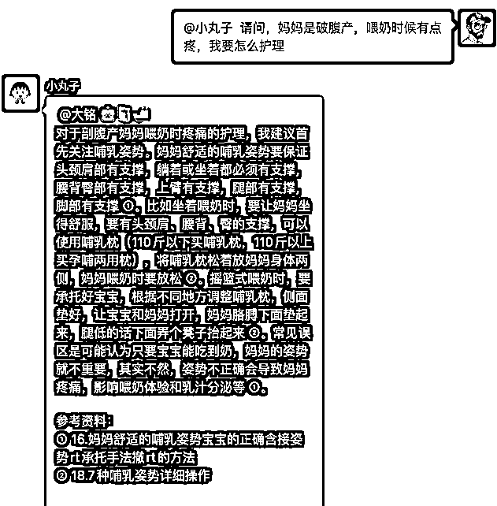
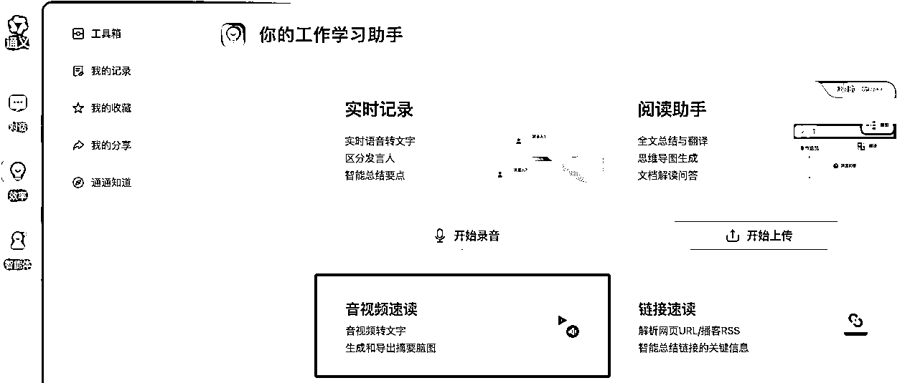
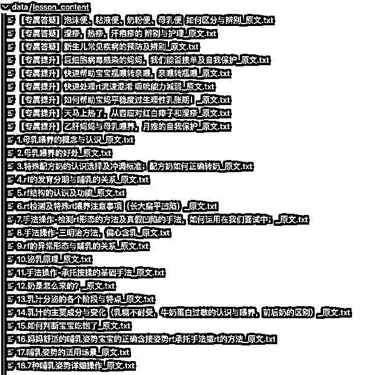
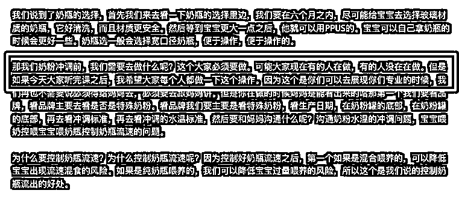

# 基于私有知识库微信机器人开发复盘

> 来源：[https://rxas35pmvn.feishu.cn/docx/M7jWdHvehoC8zuxt0Gic3WyynWf](https://rxas35pmvn.feishu.cn/docx/M7jWdHvehoC8zuxt0Gic3WyynWf)

# 先看效果

# 本文说明

本文以制作这个私有知识库的机器人的思考过程，以及遇到不同问题的判断和架构设计为主。提供给代价的是一个构建的思考过程

不会涉及到很多代码的东西，因为有了一个更好的架构设计，写代码真的就是一个体力劳动了。

# 项目目标

1.  多微信群管理，自动通过问答进行产品引流

1.  把老师的人个人知识沉淀，并放大形成标准产品

1.  针对月嫂这个特定人群，提供一个可以自助的机器人

1.  上户工作场景，通过对机器人的提问迅速获取答案，保障工作结果，可以快速给雇主一个交代

1.  对培训端，给出及时性的回答，并且提供课程引流，转化

1.  做成标准的助手产品，形成完整内容的上户助手 面向不同的人群，是不同的产品

1.  提供给月嫂（工作人员），协助自己工作

1.  提供给客户，解决自己位置的问题

# 核心思考

对于大量的 IP、个人等，自己有一定的技能或者是内容，放大的模式可以尝试

AI + 私有运营方法 SOP + 私有内容

在上面的案例，在月嫂这个人群，群运营的方式不难，是月嫂更多的一个咨询的群。核心是私有数据，之前这样的数据是无法快速定位，无法快速、结合不同方面、从不同内容中找到答案从而解决问题，现在是可以的

## 场景分析

### 针对月嫂使用的场景

1.  需要快速获取，所以选择微信机器人的形式

1.  问题复杂，需要解决的问题可能是由多个子问题组合的复合问题。比如 妈妈有高血压，现在发烧 38.5 度，还能母乳喂奶么。

1.  可以携带后续的内容，用于营销等场景扩展

### 针对内容提供

1.  尽可能的使用已有的内容（不限制形态），无需增加内容制作的压力

1.  针对不同内容区分不同的集合，并进行少量个性化设置

## 商业可能性

1.  客服

1.  自己的学习助手

1.  保证一定质量的文本内容自动生成（作为整体 SOP 的一个环节）

1.  其他

# 实操复盘

以 国际认证泌乳顾问 IBCLC 培训课程为例。 整体 SOP 流程如下

1.  已有的直播转录播课的内容作为内容库

1.  使用 RAG 的方式进行问题资料命中

1.  整合资料和问题，进行回答

1.  结合微信机器人

## 先看相同内容的一些对比

请问，妈妈是破腹产，喂奶时候有点疼，我要怎么护理

用自己得知识库



问豆包


## 已有的直播转录播课的内容作为内容库

课程都在小鹅通，可以下载成为本地文件。

转录工具的选择

1.  Whisper 在本机执行，Mac 上可以使用 whisper.cpp GitHub - ggerganov/whisper.cpp: Port of OpenAI's Whisper model in C/C++

1.  使用通义效率的音频转录功能



我选择了转录功能，通过下载原文保存为 txt 文件，得到所有的原始内容



### 内容清洗

因为是使用直播转录播课程，所以内容噪音非常多，比如《泌乳原理》这节课，会有这样的内容


这段内容的信息含量非常低

也会有类似这样的内容，《如何控制奶瓶流速》



因为内容存在噪音，所以在 RAG 对原始内容进行向量化的时候，就会出现每段切分的内容快 ContentChunk 内容含量低，有干扰，结果就是在查询命中时候命中准确率低。简单说就是影响效果。

所以要对内容进行清洗，在对比了几种方式之后，最后还是选择使用大模型 LLM 对内容进行清洗。做一个清洗的提示词，考虑到上下文 token 限制，分段对内容进行清洗。

上面的标红的这个段落会被清洗为

```
奶粉冲调前，要看品牌，是否是特殊奶粉，看生产日期在奶粉罐底部，再看冲调标准、水温标准，要和妈妈沟通奶粉水温冲调及宝宝喂奶瓶控制奶瓶流速的问题。
```

### 内容切分

清洗后的内容也无法直接使用，因为还是很长，需要对内容进行切分，切分后再向量化。

切分的方式我测试了很多，其实使用以段落为单位的滑动窗口方式就可以了。 Coze 上知识库的管理，有这个的直观的可视化的呈现


切分后就可以使用向量处理然后留存即可，向量化可以使用

*   在线大模型的 Embedding 接口，花钱

*   本地 Ollama 的 nomic-embed-text 模型也行

### 工具

pgsql + pgvector 最好用

没必要使用向量数据库，因为如果结合数据库的其他字段进行查询，pgsql + pgvector 这个方式是最好用的，而且性能、技术社群支持等也做的非常好

## 使用 RAG 的方式进行问题资料命中

使用 RAG 的方式进行命中，其实就是把问题向量化，然后再已经向量化的内容中进行相似度查询，这部分并不难。

有一个注意点，就是不要直接进行向量化，先对原始问题进行一次处理，去拆分子问题。

原始问题

孩子出生 5 天，吃的少，体重下降，妈妈很担心，我该怎么办

拆分的子问题

*   出生5天吃的少体重下降

*   担心孩子状况

针对这两个子问题进行向量化查询，效果会更好

## 整合资料和问题，进行回答

略，这部分其实不难，就是标准的数据库查询和内容组合。就是注意别超过大模型的对话上下文就行

## 结合微信机器人

结合微信机器人的工具有很多，这里我不对工具进行太多的说明了。大家可以自己去选择

*   Wechaty

*   WechatFerry

*   ChatGPT-on-WeChat (CoW)

具体的细节大家可以看 9 月的 Coze 航海。

我在这里主要是给大家分享一下结合微信机器人的架构设计

### 机器人的一些限制

微信官方的合规合法的限制之外，还有一些。

使用 windows 的机器运行微信，以及和微信配合的程序，比如 hook 注入之类的。这里可以的选择是一个云 windows 服务器，或者是一个本机的服务器。

如果使用本机的服务器，则没有对外的访问 IP 地址，也就意味着如果单独拆分业务应用在公网上，就无法和这个 windows 进行双向直接通讯。同时很多的服务器的软件可能在 Linux 上工作的更好，甚至仅有 Linux 的版本。操作系统的异构也是一个问题。

我的选择是，让微信机器人成为一个信息上传和下发的管道，不做任何业务处理。在机器人这边的 windows 上启动一个 pub/sub 服务。注册业务服务（含公网 IP）到机器人服务上，主要注册两个接口

*   当有新消息来之后的信息推送接口 只要机器人收到新的消息，就推送到业务服务器上。在订阅时候可以选择要全部消息，还是只要某些群/私聊的消息

*   回复消息拉取接口 Windows 上的微信机器人定时（如 5 秒）抓取有没有新回复，如果有则抓回复内容，并根据内容向对应的目标群/私聊发回复消息

在这种架构下，可以更加方便的管理

*   使用普通家庭网络，部署一个 windows 机器即可 我现在测试的两个机器人，一个在我家的老 windows 上，一个在我的 Linux 机器上的一个 windows 虚拟机

*   业务管理服务器，可以对接多个机器人服务，进行机器人的批量管理

# 扩展思考

1.  能否使用这种模式生成自媒体文案

1.  增加定时任务，让机器人进行群活跃

1.  配合一个 CRM，更好的管理用户信息

1.  机器人个性化回复

## 展现形式

1.  内容库，批量生成问题，做小红书、抖音

1.  做播客

1.  客服等

# 后续计划

可能借 ChatPAN.ai 的尸还魂吧。做一个开源 + 商业的版本

毕竟发现好像很多地方都要用这个功能