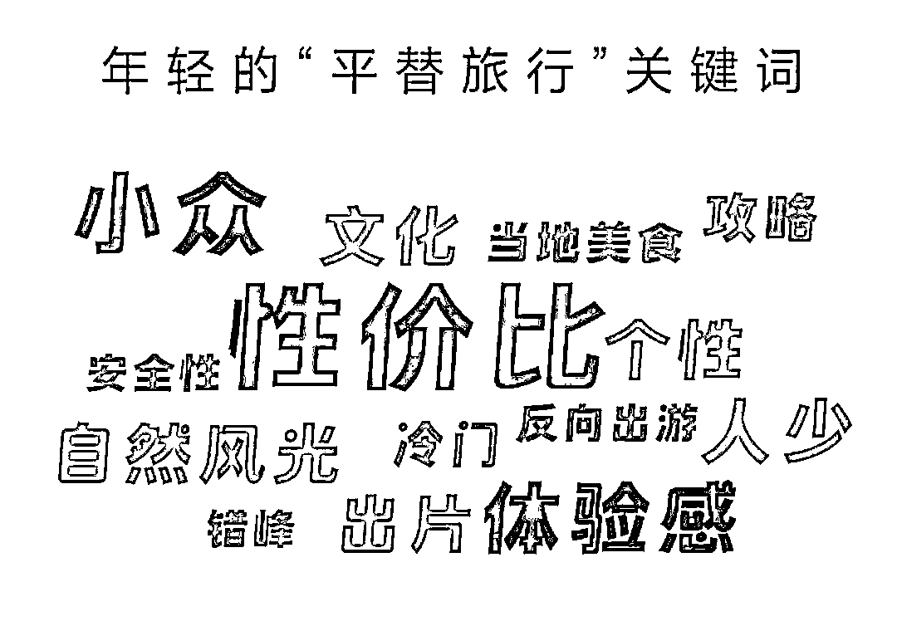
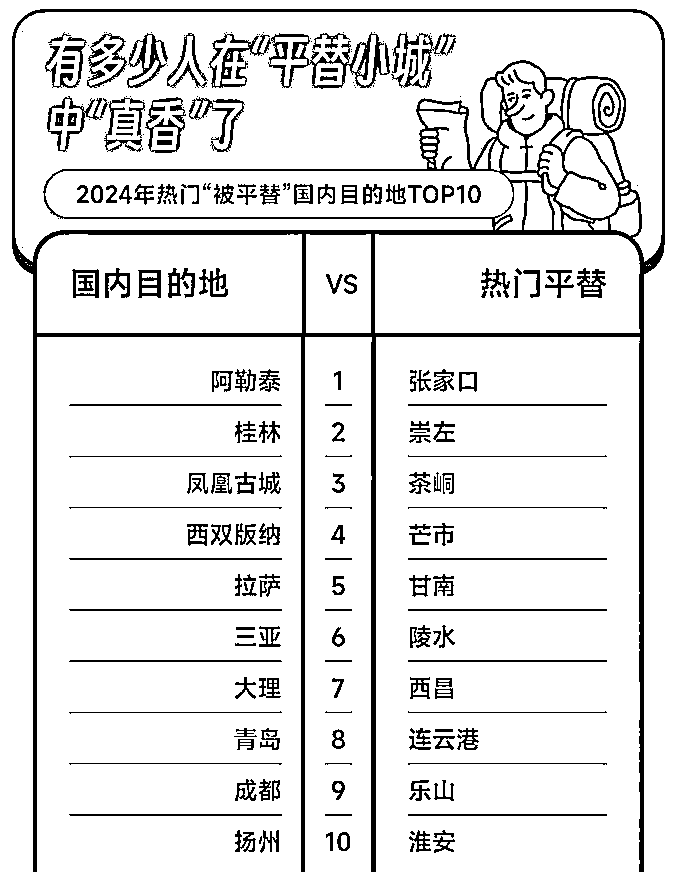
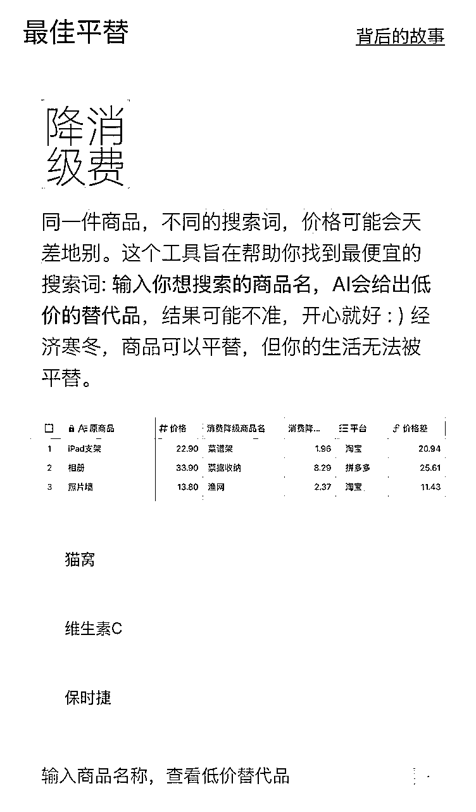

# 平替经济，我们应该关注哪些趋势

> 来源：[https://kj259khusm.feishu.cn/docx/MSvsdkOVdorkzfxBwOYc9RPgnzd](https://kj259khusm.feishu.cn/docx/MSvsdkOVdorkzfxBwOYc9RPgnzd)

大家好，我是浅笑，又见面了。

不知道大家熟悉平替这个词不，但这个词绝对会在接下几年来越来越流行。未来五年甚至十年，机会都藏在“平替”这两个字中。

前段时间生财负责人七天也给我分享过这个选题，我就想到，平替可能对于我们未来做商业或者做职业规划都有很大的参考建议。

那么接下来，我们一起去研究平替。

# 为什么要研究平替经济？

这几年，随着经济环境的变化，人们越来越普遍地追求在满足生活品质的同时尽可能少花钱。这种消费态度促使许多行业领域出现了“平替”的趋势，即以更低的价格购买近似的产品与服务。

“平替”并不是新鲜事，在小红书上搜索“平替”，话题浏览量已经高达6.9亿。在豆瓣平台上，“平价替代小组”聚集了22万成员。如果你想买卫衣，组员可能会建议你去青岛即墨购买，那里被誉为中国“卫衣天花板”，是国内大型卫衣批发市场之一。

现在的年轻人更愿意不再轻易为品牌溢价买单，而是注重内心和实际消费的需求，思考自己究竟想要什么的生活。

曾经被遗忘角落的军大衣，现在却频频上热搜；

曾经被瞧不起的拼多多，现在市值却一度超越阿里；

曾经被称之为“爷爷级APP”的1688，现在下载量一度登顶苹果应用商店免费榜……

这些风牛马不相及的社会现象背后，其实隐藏着共同的关键词，那就是：平替。

有人认为，年轻人热衷于“平替”是消费降级的体现。这固然有一定道理。在经济不确定因素增加、就业环境难称乐观的当下，在社会收入结构中处于较低段位的年轻人，选择退而求其次的低价消费，本属正常现象。不过，“平替”的底层逻辑和社会意义要远大于此。

仔细辨析，“平替”和消费降级是有所不同的。消费降级主要是对价格敏感，只要廉价，哪怕功能差点也是可以的。有意选择“平替”的年轻人则并未降低对商品的功能要求，而是在同等功能下“只选对的，不选贵的”。在这个意义上，“平替”的实质是拒绝品牌（特别是名牌）溢价，是消费者变理性、变聪明的表现。

进一步而言，这也是时代发展使然。日本社会学家三浦展把日本100多年来的消费趋势分为四个时代。

在第一消费时代，进口的就是好的，连国货都要取个洋名才卖得动。

第二消费时代，大的就是好的，冰箱、电视、洗衣机等大件成为标配。

第三消费时代，年轻人掌握话语权，他们厌烦同质化，要求张扬个性，于是差异化、炫耀式消费流行。

21世纪以来日本进入第四消费时代，人们回归理性，不管大牌还是白牌，性价比才是王道。无印良品、优衣库等“平替”就兴起于这一阶段。

消费行为变迁的背后是社会观念的更迭。在前三个消费时代，人们将商品的外部属性与人的内在价值挂钩，一件商品越大牌、越昂贵，越能彰显使用者的内在价值。这是奢牌、潮牌风靡的原因，亦为消费主义盛行不衰的密码。

消费主义正是鼓励人们通过消费个性化商品，借此获取独特的文化资本，以此凸显自身的与众不同。

而到了第四消费时代，人与物的关系被颠倒过来，实际上是正常化了。人而不是商品才是决定性因素，人的内在价值不必用身外之物去表达。相反，是人在使用商品的过程中创造并赋予了其价值。

从消费趋势看，中国社会正转向第四消费时代，经历过“买买买”的年轻群体，逐渐拂去消费主义的尘嚣，更多地面向自己的真实情感和真实需求。“平替”的流行是这种趋势的具体表征。据中国青少年研究会发布的《2023年轻人搜索关键词报告》显示，“平替”是夸克平台上的年度搜索关键词之一。而在各大社交平台上，各种“平替攻略”也长期占据热搜。

不盲目追求大牌、不过分看重标签，用自由、轻盈的方式收获生活里的小确幸，“平替”已然在成为年轻世代拒绝消费主义陷阱、摆脱过度消费的“摆渡者”。

# 平替经济下各行业的趋势

## 知识付费的平替经济趋势

近年来，随着知识付费市场逐渐成熟，平替经济的趋势也在这一领域日益显现。

### 背后的本质和发展趋势。

从消费需求来看，用户对知识付费的态度正经历显著转变。不少用户从热衷于知识付费，到目前已经麻木，能不买就不买。

早期用户追捧大佬、付费课程和知名平台会员，而现在则更加关注内容本身的实用性和性价比，会想：我买了之后会不会看，对我之后有没有用，多了一点理性，少了一点冲动。比较现在赚钱难了，花钱也更加理性。

假如一年能赚个几十万，那么花一两万买个知识付费完全不心疼。

现在，短视频平台的崛起带来信息获取方式的革新，大量免费优质内容的涌现，让用户对高价知识付费产品的接受度明显下降。免费的够看了，我为什么要付费？

### 平替具体表现

知识付费领域的平替现象在多个方面都有具体体现。

在职业技能培训方面，用户从高价网课转向B站免费教程和开源社区；

在语言学习领域，从付费APP转向短视频学习和AI辅助工具；

在知识订阅服务上，则呈现出从付费会员付费社群转向公众号、视频号等免费平台的趋势。

这种转变主要源于两个方面：

一方面是内容生产门槛的降低，包括知识创作工具的普及、AI生产力的提升以及优质内容的广泛传播；

另一方面则是学习场景的变化，碎片化时间的利用率提高，很多人都耐不下心来去看长文，加上自媒体平台带来的知识获取习惯改变。

### 怎么调整策略

面对这种趋势，传统知识付费平台和新兴内容创作者都需要调整策略。

对于传统平台而言，重新定义产品价值、优化内容质量、调整定价模式、提升服务体验变得尤为重要。

而新兴创作者则应该专注于细分领域，避免同质化竞争，去付费好一类人，而不是想这把自己用户数扩大。可以人数少，但是客单价可以拉高。

市场层面上，过度追求流量可能导致内容质量下滑，知识过度娱乐化，深度内容缺失。

在用户体验方面，知识体系的完整性不足、学习效果难以保证、后续服务跟进不够等问题也日益凸显。

短期内知识付费的平替趋势将继续加强，传统付费模式的市场份额可能收缩，免费+增值的新型商业模式将快速发展。

但从长远来看，市场必然会重新分层，优质的知识服务提供商将向专业化、精品化方向发展，最终形成新的价值认知体系。

对于想要在这一领域发展的创作者而言，在内容策略上要把握专业性、确保持续输出、重视用户反馈；在运营策略上则需要精准定位目标群体，构建社群互动体系，善用多平台协同效应。

知识付费领域的平替经济本质上反映了用户对"性价比"的理性追求，这种现象既体现了市场的成熟，也预示着传统知识付费模式需要变革。

### 接下来的知识付费类别

我认为接下来的知识付费，有这样的趋势，

一种是抓住某一类人的特定需求，比如脱单、求职、恋爱、技能培训，客单价做高，人数做少，服务好一部分人。

另一类是陪伴型知识社群，分享鸡汤，知识，心得，大家每天看一下群，客单价做低，人数做多，不过这就考验流量能力。

还有一种就是做多类目，客单价做不高，流量也不强，只能自己多出几个产品，比如开多个知识星球。

我的一些个人见解，可能不对。

## 带货的平替经济趋势

这几年来，随着直播带货市场的迅速发展，平替经济在这一领域呈现出新的特征和趋势。

购物下的用户心态也开始转变了。

早期用户追捧头部主播和大牌商品，而现在则更注重产品本身的性价比和实用性。

也有大部分老百姓觉得大主播没有把价格打下去，而是以为自己花十块钱买了价值十二块的东西，实际上东西值八块钱。

有一句话比较经典，我可以买贵的，但不能买贵了。

尤其是这段时间，大主播纷纷暴雷，比如七老板坑粉丝，把高销量的截图，让用户绝对自己买便宜了，实际上买贵了。

还有广州夫妇，被辛巴点名小度学习机一单赚一千。

短视频的流行，会让用户对主播产生信任，促使用户能更容易在电商平台下单。现在很多人在抖音上面看，在拼多多上面搜。

用户的购物决策也愈发理性。他们渐渐意识到了性价比的重要性，越来越少的人盲目听从主播推荐；更重要的是，他们开始摆脱跟风心理，逐渐形成个性化的选择标准。

在不同带货领域，平替现象呈现出多样化特征。带货类型从品牌产品向品牌产品的平替产品过渡。

这种转变的根源是多方面的。最重要的原因当然是大家都赚不到钱了，经济变差，没有那么有钱，也不会乱买一些东西。这也是平替经济逐渐流行的原因。

在内容策略方面，专注专业性内容输出是基础，通过这种方式来打造个人专业形象。同时，提供真实测评体验对建立诚信体系具有重要作用。

需要精准定位目标用户，并通过构建社群互动体系来维系用户关系。不仅如此，优化售后服务和建立长期信任关系也同样重要。

在价格策略上，除了要坚持合理定价之外，还要注意避免恶性竞争。更重要的是，要着力提供增值服务，并通过建立会员体系来提升用户黏性。

带货领域的平替经济本质上反映了消费市场的成熟与理性。因此，市场参与者必须认识到，单纯依靠价格战是不可持续的，唯有过硬的产品力才是核心竞争力。专业性也是重要的差异化点，而信任建设更是比流量更为重要的基础。

展望未来，带货市场的发展将更加强调产品质量和服务体验，同时商业模式也会更加多元化。在这个过程中，成功的关键在于如何在保证产品质量的同时，建立起与消费者的长期信任关系。

因此，主播和商家需要从单纯的带货者转变为专业的品类运营者，最终通过提供更有价值的服务来实现可持续发展。​​​​​​​​​​​​​​​​

不过说实话，电商听很多人说，是一个吃力不讨好的平台，私域电商和跨境电商可能更好一些。

外行写的，看个乐呵～狗头保命

## 线下实体的平替经济趋势

线下实体的平替经济：市场变革与发展趋势

上面说到，做电商的人不仅被主播压榨，也在被平替压榨，Rio 接近于 1，况且现在大主播也纷纷暴雷，消费者对平台的信任度也降低，电商在走下坡路。

内容电商也是在快速消耗和透支消费者对“电商”这种购物形式的信任度，接下来的十年，线下实体零售和服务将由被电商平替，转变为平替电商，会迎来曙光。

接下来说一下实体的平替。

随着消费环境的变化和新零售模式的发展，线下实体经营也呈现出明显的平替经济特征。

这种转变不仅体现在消费场景的改变，更深刻地影响着整个零售生态。

### 1、 消费者行为的转变。

当下，消费者的线下消费习惯正经历显著变化。过去，人们偏好大型商场和品牌店铺，而现在则更倾向于社区商业和精品店。移动支付的普及和配送服务的完善，使得消费者对传统高端商圈的依赖度明显下降，高端商圈可能接下来会亏本，高租金高人力。

具体来看，消费者的行为变化主要表现在以下方面：

从高端商圈转向社区商业；

从品牌连锁店转向个性化小店；

从大型综合体转向便利店；

更重要的是，从单一购物需求转向多元化生活体验。

这种转变不仅反映了消费理念的升级，也体现了生活方式的改变。

### 2、 线下实体领域的具体表现有哪些？

餐饮行业：首先在连锁餐饮方面，高端餐厅逐渐被特色主题餐厅取代，快餐连锁店让位于创新快餐品牌。

同时，高档火锅也面临着平价火锅的强力竞争。一句话就是高档餐厅的将会被平民餐厅替代，更看重饭菜而不是装修和装逼。

零售业态：在便利店领域，24小时连锁便利店正被社区智慧门店替代；大型超市让位于社区生鲜店；而传统百货商场则逐渐被体验式购物中心所取代。

休闲娱乐：传统KTV转向迷你包厢模式；大型电影院让位于私人影院；高端健身房被24小时智能健身房替代。

这些变化都显示出消费场景的小型化、智能化趋势。

### 3、 转变背后的深层原因

经济因素：首先是租金成本持续上涨，其次是人力成本不断攀升，再加上经营压力增大，最终导致传统经营模式难以为继。

技术进步：移动支付的普及、智能化设备的应用、数字化管理的推广，以及新零售技术的发展，共同推动了经营模式的创新。

消费升级：消费者对便利性的追求、对性价比的重视、对个性化服务的需求，以及对生活品质的追求，都促使商业模式不断创新。

### 4、 线下实体店的转型策略

空间运营：首要任务是优化店铺选址，同时要合理规划空间布局。此外，还需要打造特色场景，最终实现多功能复合经营。

服务创新：一方面要提供个性化服务，另一方面要发展会员体系。同时，要注重体验式营销，并建立社群运营模式。

数字化转型：

要积极推进线上线下融合，建立会员数字化管理，优化库存管理系统，实现精准营销推送。

成本控制：

需要合理控制租金支出，优化人力资源配置，提升运营效率，建立智能化管理体系。

线下实体店将继续向小型化、智能化方向发展；社区商业将获得更大发展空间；个性化、特色化经营将成为主流。市场将形成多层次竞争格局；新零售模式将更加成熟；商业地产将进行功能重构；消费场景将持续创新。

线下实体的平替经济本质上反映了零售业态的创新与变革。为此，经营者必须认识到：门店位置已不再是决定性因素，服务体验才是核心竞争力。同时，数字化运营是重要支撑，而成本控制则是持续经营的基础。

未来线下实体店的发展，将更加注重场景营造和服务创新，经营模式会更加灵活多样。成功的关键在于如何在控制成本的同时，为消费者创造独特的价值体验。商家需要从传统的销售者转变为生活服务的提供者，通过场景创新和服务升级来实现可持续发展。​​​​​​​​​​​​​​​​

## 情绪价值的平替经济趋势，

情绪价值的平替经济：从消费升级到心理满足

近年来，随着消费观念的进化和社交媒体的发展，情绪价值在消费领域呈现出新的平替现象。这种转变不仅体现在购买行为上，更深刻地反映了人们对情感需求的理解与追求。

### 1、 情绪消费的心态转变

当下，消费者的情绪价值诉求正经历显著变化。过去，人们通过购买奢侈品和高端产品来获得情绪满足，而现在则更倾向于寻找多元化的情感价值替代。与此同时，社交媒体的普及带来情绪价值获取方式的改变，使得消费者对传统品牌符号的依赖度明显下降。

具体而言，消费者的情绪满足方式发生了以下转变：

从炫耀性消费转向体验式消费；从品牌崇拜转向兴趣社群；从物质追求转向精神满足；更重要的是，从单一快感转向持续性愉悦。这种转变不仅反映了价值观的升级，也体现了生活态度的改变。

### 2、 情绪价值平替的具体表现

社交领域：

*   奢侈品晒图逐渐被生活方式分享取代，

*   高消费打卡让位于小众兴趣探索。

*   名牌包包也面临着手作包袋的情感竞争。

*   此外，社交价值更多地从物质炫耀转向个人成长。 娱乐消费：

*   在休闲方式上，高端会所逐渐被兴趣工作室替代；

*   豪华旅行让位于深度文化体验；

*   而奢侈品购物则逐渐被DIY手工创作所取代。 生活方式：

*   从名牌咖啡转向手冲咖啡文化

*   从餐厅打卡转向居家烹饪分享

*   从购买艺术品转向参与艺术创作

*   从名贵宠物转向流浪动物救助

### 3、 转变的深层原因

社会因素：

*   价值观念的多元化发展

*   生活压力带来的情绪需求

*   社交媒体影响下的认知变化

*   个人成长意识的觉醒 经济因素：

*   理性消费观念的形成

*   消费能力与期望的平衡

*   新经济形态带来的机遇

*   共享经济的普及 心理因素：

*   自我认知的提升

*   情感需求的深化

*   社交认同的变化

*   幸福感来源的多元化

### 4、 情绪价值重构的策略

个人层面：

*   要认识真实的情感需求，

*   要培养持续性兴趣。

*   要建立健康的社交圈，

*   实现情绪价值的自我创造。 消费选择：

*   注重体验而非占有

*   追求成长而非炫耀

*   重视过程而非结果

*   关注分享而非独占 生活态度：

*   培养兴趣爱好

*   发展社群关系

*   参与公益活动

长期展望下，情绪价值将更加多元化；个人成长将成为主流追求；社群文化将更加成熟；生活方式将持续创新。

情绪价值的平替经济本质上反映了人们对幸福感来源的重新认识。

我们必须意识到：物质消费已不再是情绪满足的唯一途径，而个人成长和社群连接才是持久的情感价值源泉。

同时，体验式消费是重要趋势，而创造性活动则是实现自我价值的基础。

未来情绪价值的获取将更加注重过程和体验，满足方式会更加多样化。

成功的关键在于如何在追求个人成长的同时，与他人建立真诚的情感连接。

每个人都需要从单纯的消费者转变为价值的创造者，通过持续的学习和分享来实现情绪价值的良性循环。

这种转变不仅有助于个人的心理健康，也能推动社会向更具可持续性的方向发展。

# 日本的平替经济对我们有什么启示？

我们的今天是不是日本的昨天，而我们的明天是不是日本的今天。

有一份日本野村证券做的一个报告，分析了日本经济下滑三十年来，反而发展出了哪些黄金赛道，也许对现在的我们，都有一些启示。

## 原文件：

## 我的总结

### 主要内容

挖掘经济下行期的黄金赛道：尽管泡沫经济破灭后、日本整体消费市场处于长期的景气度低迷期、但仍有一些细分品类因消费场景的延伸与特定客群的兴起、在逆势中焕发了生机。

此发表聚焦旨在日本经济下行期间跑赢行业整体表现的消费品类、旨在寻找对未来中国消费行业发展的启示。

家庭支出见顶、品类表现分化：1992年日本家庭支见顶后、必需消费品消费额仍有小幅上升、可选消费则表现较为疲弱。食品各细分品类的人均消费额普遍仍处于上升态势。

以2021年相比1992年数据、人均消费额增幅最大的细分品类为乳制品/预制菜/饮料、其中表现较好的细分品类为酸奶、奶酪、速冻食品、茶/咖啡/可可。

可选消费中、渗透率仍有提升空间的小家电、个护、化妆品、性价比较高的低端家具、服饰、餐饮、短途旅游、住宿特化型酒店、以及户外运动、健身、游戏、动漫等休闲娱乐表现较好。

三条主线（必需消费品）：

1）社会结构变革：女性参工率上升、家庭规模缩小、人口老龄化进程加速贯穿日本1992年至今的社会背景

2）消费人群迭代：初入社会便赶上“就业冰河期”的“团块次代”成为消费主力、审慎的消费观推动1992年后消费降级；

3）产品创新成破局思路：一方面、长期消费降级当道的宏观环境、激发消费者对于“小奢侈”、“非日常”生活体验的渴望。

另一方面、制造成本的持续上升、倒逼企业通过提升产品附加值疏通“涨价”传导机制。

三条主线（可选消费品）：

1）从“物质富足”到“精神富足”：日本大部分家庭的物质生活得到满足、居民的消费重心开始向追求“精神富足”倾斜：

2）美容、卫生与健康意识的提升：日本劳动人口在1995年迎来顶峰、老龄化问题凸显、健康、卫生意识提升的同时、维持自身清洁和周边环境整洁精致的需求扩大；

3）产业结构升级孕育行业超头：家电、家具、服装产业链结构调整引领消费降级的同时、易出现行业超头。

我们将经济下行期仍然换发升级的消费品类归纳为以下2类：

1）受益社会结构变化的品类、

2）产品创新创造新需求的品类。

具体品类如下：

酒类:1）高端清酒、2）芋烧酎（2003-2009年）、3）高端和低端啤酒、4）RTD、5）威士忌（2008年至今）

饮料：1）绿茶、2）咖啡、3）功能性饮料（2001年至今）、4）豆乳（1992-2005年、2008年至今）

乳制品：1）酸奶、2）奶酪

调味品、加工食品：1）复合调味品、2）鲜榨酱油（2010年至今）、3）速冻食品、4）其他预制菜肴

家电：1）空调、2）小家电

个护家清：1）化妆品、2）口腔护理、3）美容仪、4）家清

餐饮、休闲娱乐：1）快餐、2）宿泊特化型酒店、3）游戏动漫、4）户外运动

零售：1）便利店、2）药妆店、3）二手电商

其他：1）人力资源、2）宠物经济、3）保健品

### 经济下行期的黄金赛道——必需消费品篇

#### 饮食

饮食逐渐变成了预制菜，而且越来越流行。为什么呢？经济不好，大家都得上班挣钱，没时间做饭，节省时间的预制菜机变得越来越流行。

#### 服装

服装从各种品牌逐步变成了性价比高的服装，比如优衣库，不在乎品牌，而是在乎舒适、简洁，甚至还推动优衣库的老板成为了日本首富。

#### 恋爱

恋爱的平替很有意思，这个是我自己推论的。恋爱的本质是情感交流，陪伴。

但很多人没有那个精力和时间给异性，宠物就变成恋爱的一种平替形式。

买可爱的小猫小狗，给他们买宠物衣服，宠物食品，宠物房间，简直就是把宠物当做成另一半了。

衍生一下，成人用品相关品类也是恋爱的平替形式。

### 经济下行期的黄金赛道——可选消费品篇

#### 零售

这里也可以看前面的线下实体的平替经济趋势，24小时连锁便利店正被社区智慧门店替代；大型超市让位于社区生鲜店；而传统百货商场则逐渐被体验式购物中心所取代。

#### 旅游

从长途旅游，演变成距离近，时间短，价格低的形式，

长途旅游转变为短途旅游，一日游。

去国外旅游转变为国内的平替旅游，在年轻人身体力行的挖掘下，无数宝藏小城也纷纷成为了国内大热旅游城市的平替。在崇左享受不输桂林的诗画山水，在茶峒感受凤凰同款《边城》风情，在甘南体验不用担心高反的藏地文化和美景，“小城”们因平替出圈，又因自身独特的美食、风貌、玩法体验，以及超高的性价比，成为越来越多年轻人出行的首选。

有些平替城市也不符合逻辑，部分可以参考

# 平替经济下的省钱有术

## 怎么找出更多的平替

### 自媒体账号

我在视频号，抖音上面随便刷，有时候会看见一些好物推荐，有一些账号的主题就是

同样的东西，只要换个关键词，就很划算

有时候换个思路买东西，真的很香

多刷一些，换个关键词

现在也有不是自媒体博主是利用“平替”这个关键词带货，而且数据不错，比如专门做美妆平替，母婴平替，饮食平替。

### 平替网站

https://pingti.app/

每一个平替商品的搜索技巧背后，都隐藏着一种对生活的折叠。

### 平替的类型总结

#### 性别套利

例如瑜伽垫->瑜伽垫男，

或遮阳伞->雨伞男，

这背后反应的其实是男人比女人更在乎实用性和性价比，更少为了颜值、设计而买单，而设计产生了成本。

#### 场景套利

例如马甲->老头马甲，因为老年人更在乎价格,

女包->包包尾货，这个不用解释,

地毯->办公室地毯,

书桌->培训桌,

椅子->婚礼用椅，

是因为在办公室、培训、举办婚礼时，通常会使用更便宜的材质吗？

#### 地域套利

例如袜子->诸暨袜子,

耳饰->义乌耳饰，

因为中国的袜子主要来自诸暨，所以通过指定原产地可以获得更低的价格。

#### 无法归类

这一类最有意思，它们的特点是，两个商品几乎八竿子打不着，但是它们在「功能」上可以实现接近平替的效果，

例如照片墙->渔网,

相框->营业执照框,

面膜收纳->食品保鲜盒,

iPad支架->菜谱架,

美甲灯->验钞灯,

乐高防尘罩->超市陈列盒，

这其中每个平替商品的搜索技巧背后，都隐藏着一种对生活的折叠。

最后我们总结一下，再来重新理解一下平替的含义，

平替由“平”和“替”两字构成，字面意思是：平价替代品。有两个课题的理解，非常有意思，值得拿出来共同探讨：平替的核心究竟是“平”，还是“替”？

平替只要足够“平”，一味将价格压“平”、压“低”就够了吗？显然不是。平替绝不是一味以牺牲品质为前提，一夜回到以前低端价格战的山寨年代。

而是功能能够替代，品质有所保障，升级性价比，才是平替产品的基本修养。所以，性价比，才是平替的核心。寻找平替，凸显的是消费者对性价比的重视。因此，平替的基础是“平”，关键在于“替”：用性价比高的“替”代性价比低的。

平替是消费降级，还是消费升级？“消费降级”的话题一再引发热议。平替正是审视消费降级这一概念的重要视角。任何事情都有两面性，平替也不例外。

年轻消费者找平替反对的是被不合理的品牌溢价所捆绑，但同样关注自我需求，注重生活品质。他们开始把消费决策掌握在自己手里，而不是把消费的选择权交给商品。

所以，我们对平替的本质理解是：在不牺牲幸福感／获得感为前提下的高性价比理性消费，其消费行为与内心形成的自洽逻辑。

关于平替，可以聊，值得聊的话题还有很多，我也有很多不知道的，需要了解得更多。

不过肯定的一点是，你对平替了解更加深入，那么对中国接下来的趋势变化就更加敏感。