# 从0-1利用AI在YouTube上发布第一个视频

> 来源：[https://rcnwss9aqanp.feishu.cn/docx/LrCYdY5WnogFFix8atDculiYnTf](https://rcnwss9aqanp.feishu.cn/docx/LrCYdY5WnogFFix8atDculiYnTf)

# 准备阶段

## 明确主题与受众

*   确定视频内容的主题（例如，自我提升、生活技巧、幽默等），我拿 “自我提升” 来举例。

以这个博主主页为参考：

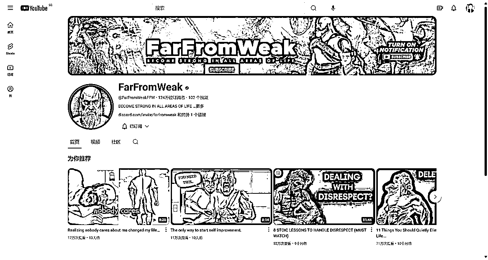

## 创建频道

小tips:一个账号可以创建50个频道。

我在这里简单说一下如何利用chatGPT来创建一个属于你自己的频道。

下面一系列流程都通过chatGPT来生成

这里是创建频道的地方，如果你是第一次创建的话就不是这个位置。

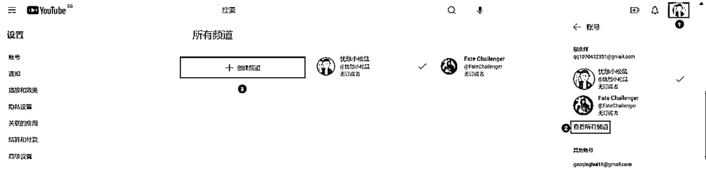

### 创建频道名字

可以想几个你喜欢角色的名字。

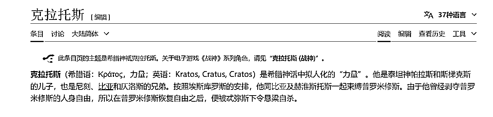

chatGPT提示词如下：

嘿，我现在正忙着弄一个YouTube频道，主要是关于自我提升的，能不能帮我想几个频道名字？这频道里我打算用AI生成内容，全都是围绕一个角色来做的，这个角色类似于Kratos（克拉托斯（希腊语：Κράτος，力量；英语：Kratos；日语：クレイトス）是索尼互动娱乐圣塔莫尼卡工作室开发的游戏系列戰神系列中的角色。这部作品以希腊神话为基础，后来也加入了北欧神话的元素。原型为希腊神祇克拉托斯。也被称为“斯巴達的亡魂”。）

我的频道主题是自我提升相关的视频内容，请根据这个图片的寓意以及克拉托斯，帮我想10个频道名字。

如果你有参考图片，可以直接利用图片上传给GPT让它生成。

### 生成频道简介

在上面生成的名字中选择一下，让GPT帮你生成频道简介。

我的频道名字叫 “Empowered Anonymity”，帮我写一份200 字以内、条理清晰、有表情符号和与细分市场相关的关键词的频道简介。为了便于理解，使用简单的英语。同时生成翻译成中文

### 生成头像

使用chatGPT根据你上面的内容生成头像，

现在请给我一些logo的设计想法

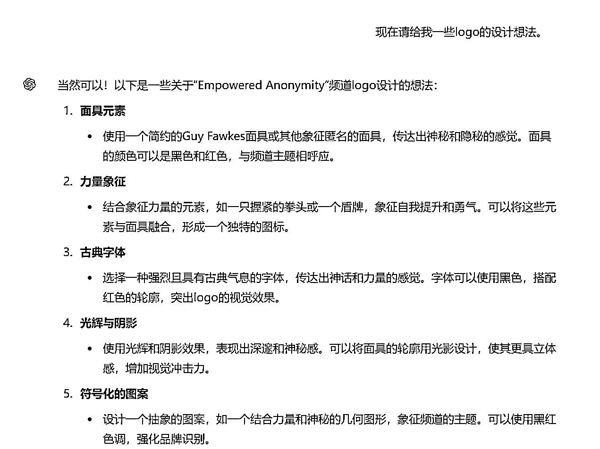

头像的生成根据你喜欢的角色特征来描述它，让GPT生成。

我选第X个。我有几个小要求：主题色调就是黑色和红色，我想要这LOGO上画个神秘人物，最好戴个像盖·福克斯（Guy Fawkes）那样的面具。另外，背景里加点烟雾效果，这样更有氛围。现在你给我5个文本提示Prompt，我好在Leonardo AI里用，尽量帮我整点独特的东西出来哈。

今天主要使用的是chatGPT+Leonardo AI来设计一整个视频，当然，我浅浅付费了一下。当然，各位也可以使用国内平替，kimi+可灵之类的，大致步骤都是一样的，不过去水印也得付费，嘿嘿，不过Leonardo AI每天赠送150积分，各位也可以简单使用一下。

五个提示词中多生成几个，我使用的是这个模型，感觉也挺好使的，记得头像的比例最好使用1:1

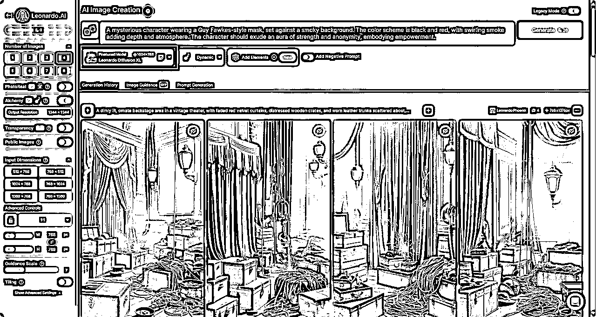

生成的效果如下，选择一个喜欢的就可以当头像啦。

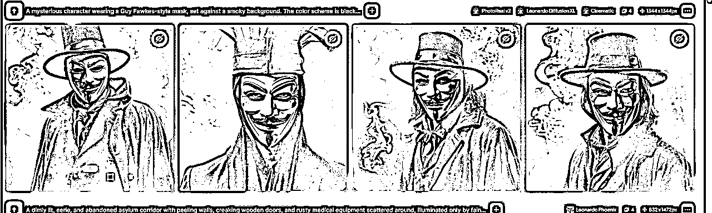

# 制作第一个视频

OK,话不多说，直接开始干个视频

首先我们先去安装一个插件

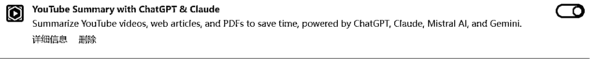

这个是插件的链接

https://chromewebstore.google.com/detail/youtube-summary-with-chat/nmmicjeknamkfloonkhhcjmomieiodli

这个链接的作用是帮助我们提前获取YouTube视频的文案，方便我们下面使用,这里我们找到对标账号里爆火的视频提取他的文案

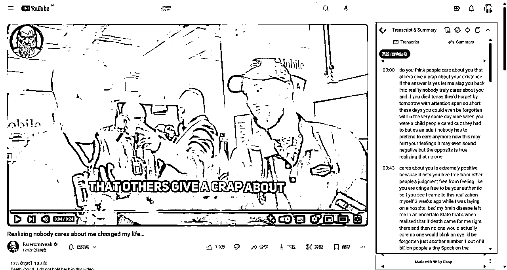

## 生成视频脚本

首先我们在刚才那个插件中获取文案，复制下来喂给GPT，下面是提示词，我这里是全部复制让他压缩到1000个字母，因为我的配音软件只剩下1000个字母的额度了哈哈哈。

嘿，我这儿有个我之前录视频时用过的脚本，你拿去看看。你的任务就是把这脚本重新说说，改改词儿的顺序啥的，但得保持原来的写作和说话风格。别给我删减内容，也别改得太离谱了。删掉时间 脚本如下：

......刚才复制文案内容.......

## 生成视频的配音

好了，这下我们最难的文案已经搞好了，现在我们要去生成配音。

配音的话我们可以选择剪映中免费的适合你们的配音，这里我选择的是elevenlabs这个配音软件，个人感觉这个配音软件十分的好用，可以免费使用10000个字母和字体，这次本来想展示中长视频的，谁知道额度不够了嘿嘿，该充钱了，那就展示一下短视频吧。

https://elevenlabs.io/

界面也十分简单，也可以更改音色，大家可以去挑一款合适的

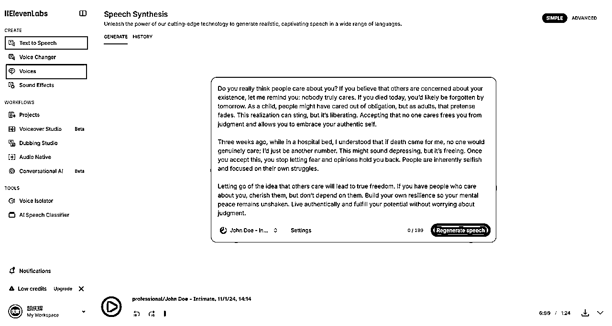

配音生成完成之后我们把他下载下来。

## 生成主图

这次我们生成的是盖·福克斯（Guy Fawkes）这个人物的封面以及他说话的内容，所以我们生成的内容也都是跟他相关的，所以我们交给chatGPT，我们之后的封面和主图都要用到。

帮我生成3个文本提示prompt，我想在Leonardo AI这样的AI图片工具里用。我想要一个神秘角色的图片，得穿黑色衣服，不露脸，戴个那种匿名的盖·福克斯面具。主题色调就是黑色和红色，背景要暗点，感觉像YouTuber那种房间就行。

生成提示词之后我们直接去Leonardo AI中生成图片，短视频的话选择9:16，中长视频就是16:9

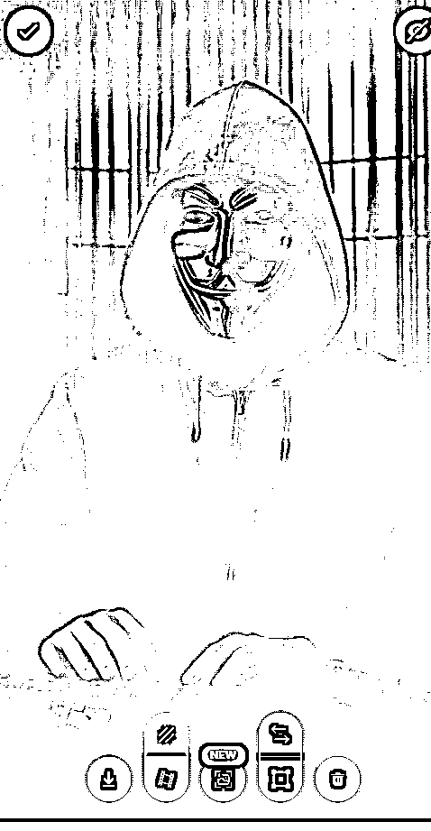

选择一个合适的，下载下来当我们的主图就好啦，之后封面也可以用这个制作。

然后直接在Leonardo AI中将这个图片转成视频，不过这个功能需要会员，大家可以找平替。

可以将我们生成的视频，和下载的配音都暂时放入剪映中，还是需要用到剪映的。

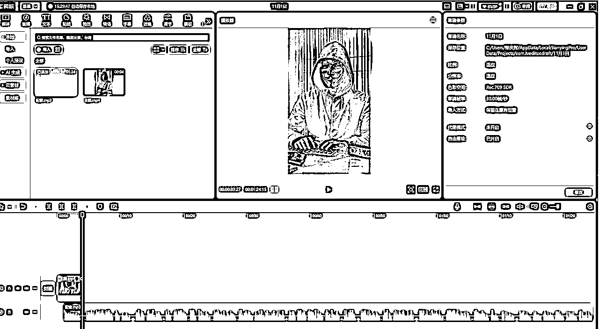

## 将配音分段

这里是我们的脚本文案

Do you really think people care about you? If you believe that others are concerned about your existence, let me remind you: nobody truly cares. If you died today, you’d likely be forgotten by tomorrow. As a child, people might have cared out of obligation, but as adults, that pretense fades. This realization can sting, but it’s liberating. Accepting that no one cares frees you from judgment and allows you to embrace your authentic self.

Three weeks ago, while in a hospital bed, I understood that if death came for me, no one would genuinely care; I’d just be another number. This might sound depressing, but it’s freeing. Once you accept this, you stop letting fear and opinions hold you back. People are inherently selfish and focused on their own struggles.

Letting go of the idea that others care will lead to true freedom. If you have people who care about you, cherish them, but don’t depend on them. Build your own resilience so your mental peace remains unshaken. Live authentically and fulfill your potential without worrying about judgment.

在剪映中，我们智能识别字幕，将配音每一段可以打一个标记分割一下，方便一会我们生成的视频不乱，当然，这一步也可以省略。

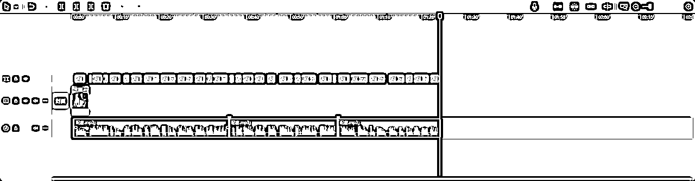

## 生成更多视频

现在我们的准备工作都做好了，我们复制每段脚本，分别让GPT生成更多的prompt画更多的图。

你来帮我做我视频里的图像提示prompt。我会把剧本一段段地发给你，你就给每段找个能吸引人的画面，需要生成出4个完全不同的故事情节画面prompt，第二个promt需要与第一个promt相关联，第二个prompt要与第二个prompt相关联，第4个prompt要与第三个prompt相关联，所有的prompt所表达出来的故事情节都不要重复了。记得啊，这些画面得跟故事情节搭，还得有那种神秘、高科技的矩阵风格。我发的每一段，希望你能用文字详细的描述出超好看的视觉画面哦！主色调为黑色和红色。

分段生成的prompt继续复制到Leonardo AI，让他生成更多的图，生成好的图我们直接让他转视频，转完视频后直接放在剪映中。

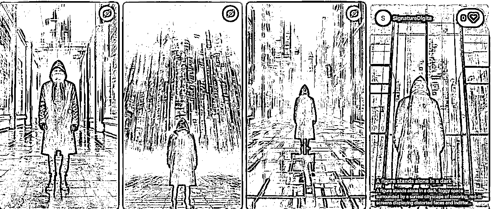

现在把图生的视频放在剪映中，如果视频和音频对不上，放慢视频的速度

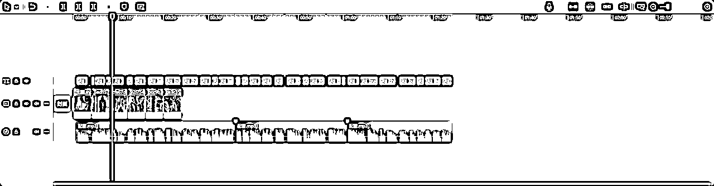

速度调慢之后会超过标记点，多余的部分可以截掉。

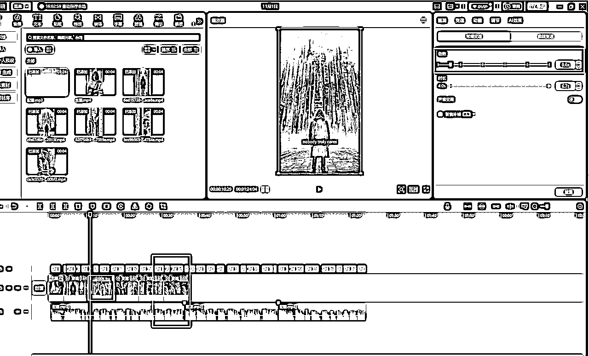

上面生成的是第一段的视频，下面我们复制第二段和第三段的脚本文案给gpt让他生成prompt继续生成，将我们的主角，也就是主图的视频每隔一段就塞进去一下，重复这个步骤知道填满配音。

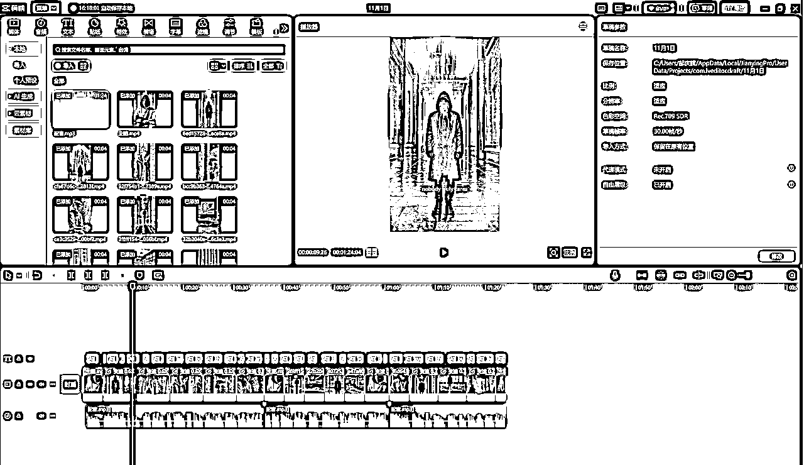

## 配置背景音乐、特效、转场、字幕加效果

可以让GPT生成背景音乐提示词，然后直接去剪映搜索对应的免费音乐

你现在已经了解了我的视频脚本，用什么背景音乐好呢，请给我一些音乐曲调的关键词。

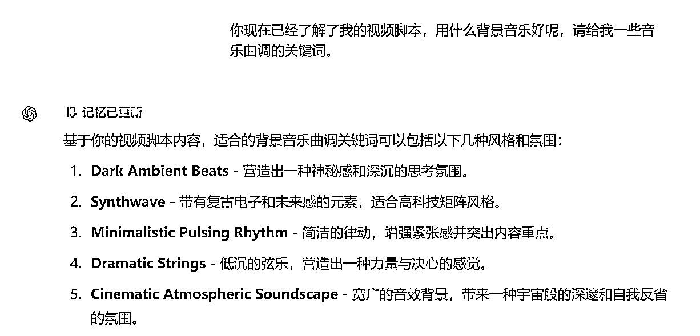

这些细节就不说了，大家自行研究。

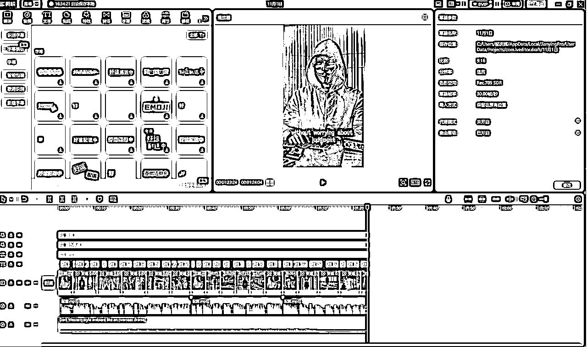

# 发布YouTube

像chatGPT询问应该使用什么标题以及说明

你已经了解了我的视频内容，帮我想5个标题以及对应的说明。

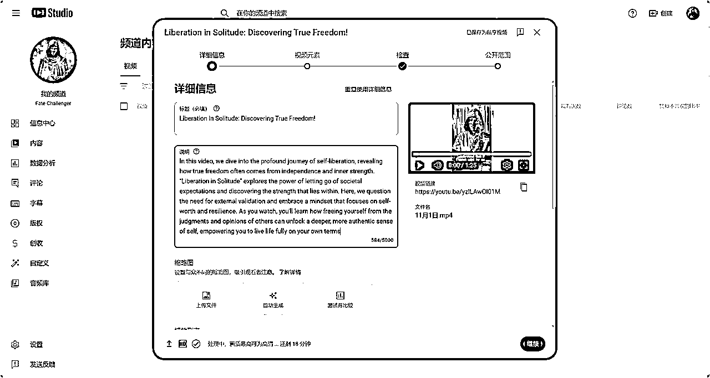

## 制作缩略图

在canva中制作缩略图，直接选择YouTube缩略图

https://www.canva.com/

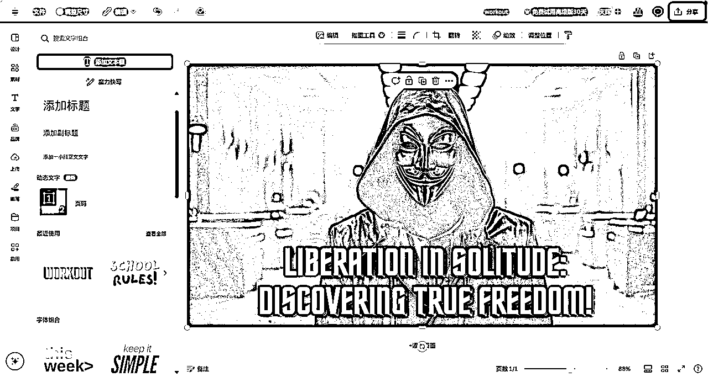

## 添加标签

可以直接询问chatGPT看需要填写什么标签，也可以寻找办法去看一下对标账号里有什么标签，我这里直接问GPT

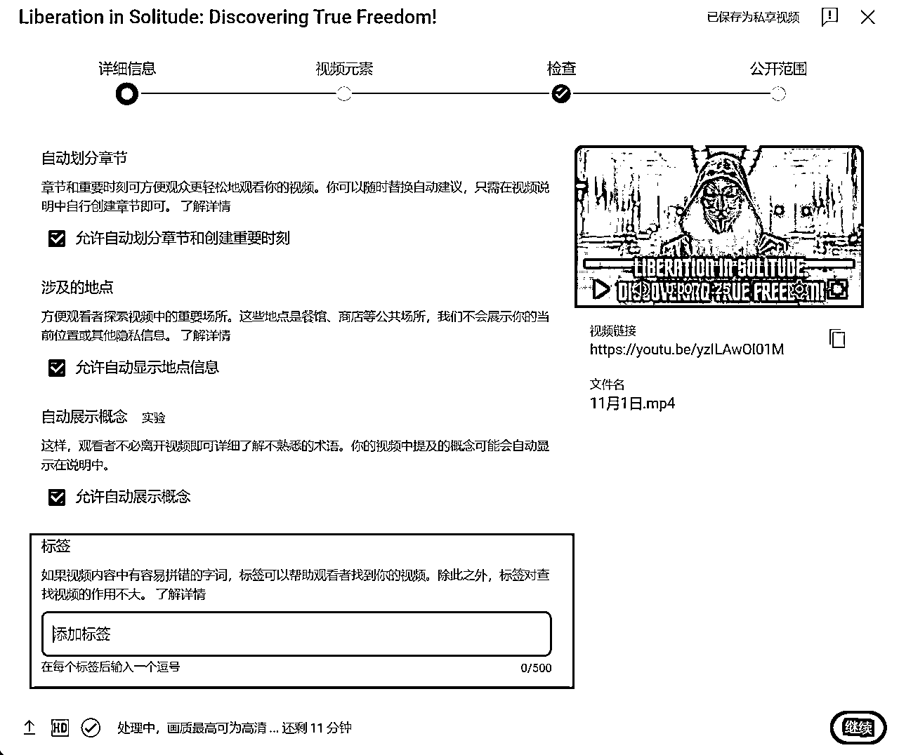

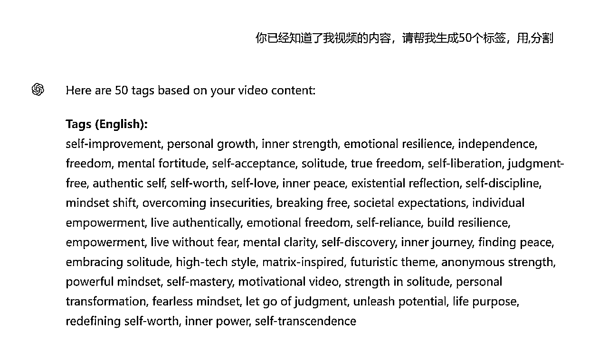

直接发布，在大陆的话最好是9-10点发送哦。

第一次写实操，写的不好请见谅