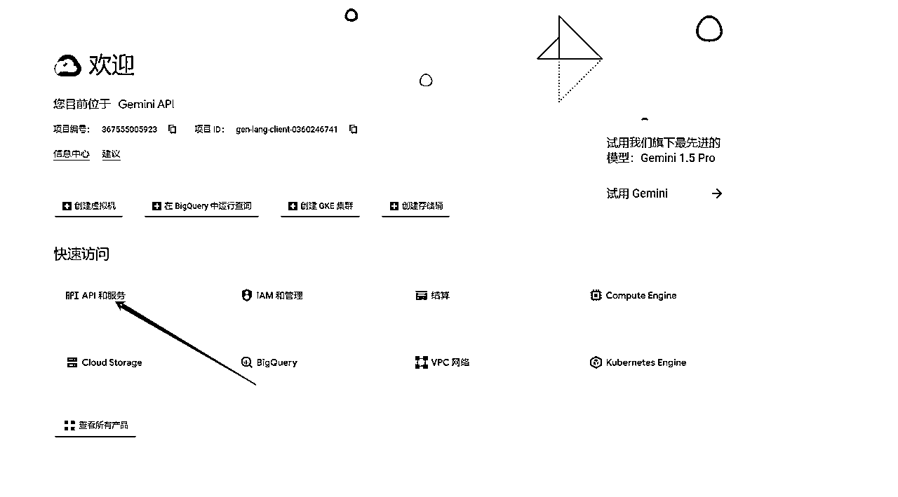
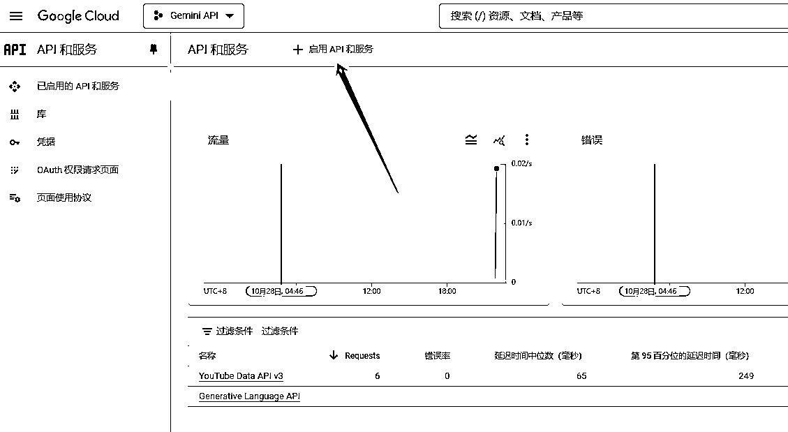
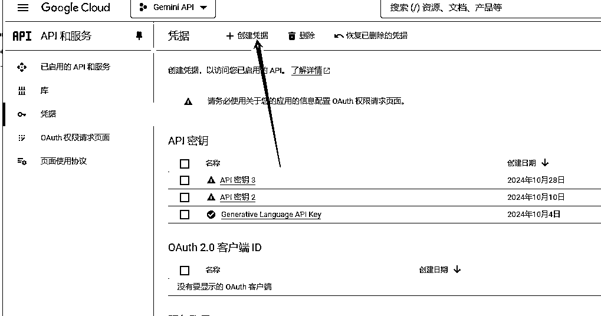
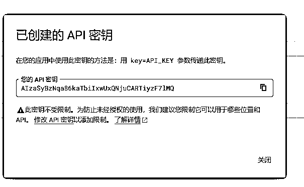
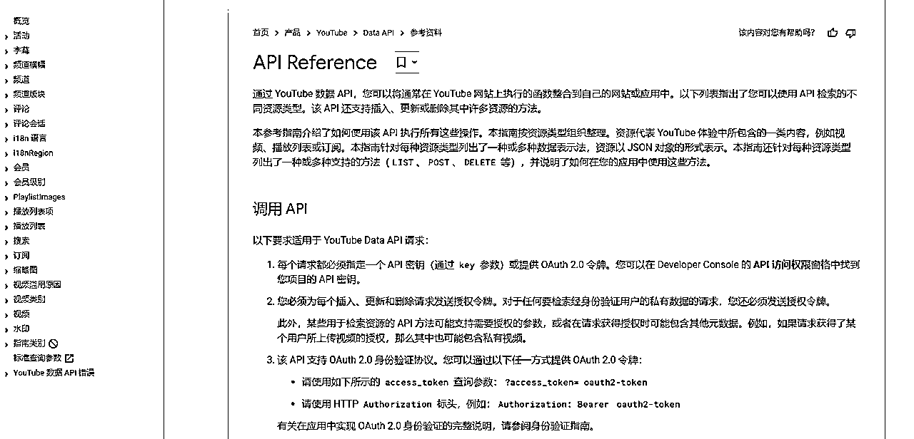
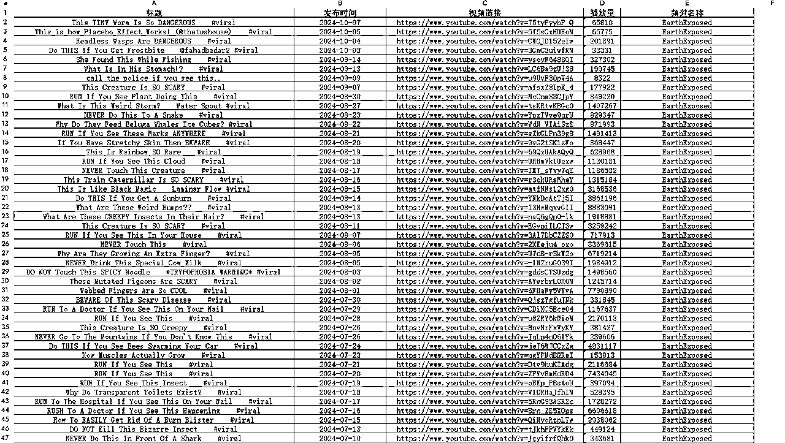

# Youtube官方api调用以及selenium方式采集

> 来源：[https://yemahuyou.feishu.cn/docx/NQEYdXPWyoohmrxtaV2c4zQTnxh](https://yemahuyou.feishu.cn/docx/NQEYdXPWyoohmrxtaV2c4zQTnxh)

YouTube官方api调用和selenium区别：

1.  功能性：YouTube官方API这是Google官方提供的接口，专门用于与YouTube平台的数据交互。通过API，你可以直接获取视频的元数据（如标题、描述、发布日期、观看次数、点赞数、评论数等）、频道信息、播放列表信息等，拓展型的api可以上传视频等其他更深度的操作。虽然功能齐全也方便，但是速率每日是有一定的限制，而Selenium这是一个自动化测试工具，通常用于控制浏览器执行一些手动操作。使用Selenium可以模仿人工浏览的方式，获取几乎页面上显示的所有数据，包括页面的HTML结构、视频推荐列表、动态内容等。可以理解为比较麻烦的影刀rpa，如果chatgpt，Claude这种人工智能没出来之前这个方式对我来说基本上不用了，因为现在的环境下，我只需要采集一些元素定位，然后发给Claude 3.5在给它需求，它能够帮我梳理出来大致的框架，甚至可以一步到位！

1.  灵活性：YouTube官方API在灵活性上有一定的局限性，因为它只能获取官方允许的数据字段。如果你需要的数据不在API提供的范围内（比如页面上的一些实时推荐视频或动态生成的内容），那么API可能无法满足需求。Selenium具有更高的灵活性，因为它可以访问页面上显示的所有内容。即便是动态生成的数据（例如通过JavaScript加载的内容），Selenium也可以通过执行JavaScript脚本来获取。此外，它还可以抓取API无法获取的数据，适用于更加灵活的采集场景。

# YouTube官方api调用

## YouTube API密钥

使用官方的api，首先我们需要配置必要的API密钥，我们需要一个YouTube Data API密钥才能获取数据。获取步骤如下：

*   访问 Google Cloud Console (https://console.cloud.google.com/)

*   创建一个新项目

*   启用 YouTube Data API v3

*   在凭据页面创建API密钥

如下图所示：











## YouTube api参考文档

得到了密钥就是操作api的关键，调用api的这一步总离不开密钥；

后面如何调用，就要去参考官方api文档:

https://developers.google.com/youtube/v3/docs?hl=zh-cn



看起来很繁琐对吧？功能太多，不知道那些是我们想用得到的，也不知道要如何使用，简单，问gpt问Claude啊，把你觉得类似的可以用得到的功能，直接复制给gpt或者Claude，让它帮你完善，完全不需要你动笔，只需要反复跟AI交互修复BUG即可。

## YouTube api采集调用示例及解读

来看下调用的示例，它的功能是使用YouTube Data API来获取特定YouTube频道视频信息的Python脚本。

```
import os
import requests
import pandas as pd
from tkinter import Tk, filedialog
from requests.adapters import HTTPAdapter
from requests.packages.urllib3.util.retry import Retry

# 设置全局 HTTP 代理（如果需要）
os.environ['HTTP_PROXY'] = 'http://127.0.0.1:10809'
os.environ['HTTPS_PROXY'] = 'http://127.0.0.1:10809'

# 配置 API 密钥
API_KEY = ''  # 替换为您的 API Key

# 定义请求会话，增加重试机制
session = requests.Session()
retries = Retry(total=5, backoff_factor=1, status_forcelist=[500, 502, 503, 504])
session.mount('https://', HTTPAdapter(max_retries=retries))

# 定义函数：通过频道链接获取实际的频道 ID 和名称
def get_channel_info_from_link(channel_link):
    """解析频道链接并获取实际的频道 ID 和名称"""
    if '@' in channel_link:
        custom_name = channel_link.split('@')[-1]
        search_url = f"https://www.googleapis.com/youtube/v3/search?part=snippet&type=channel&q={custom_name}&key={API_KEY}"
        response = session.get(search_url)
        if response.status_code == 200:
            data = response.json()
            if 'items' in data and len(data['items']) > 0:
                channel_id = data['items'][0]['snippet']['channelId']
                channel_title = data['items'][0]['snippet']['title']
                return channel_id, channel_title
    elif 'channel/' in channel_link:
        channel_id = channel_link.split('channel/')[-1]
        return channel_id, None  # 需要通过 channels.list 获取名称
    return None, None

# 定义函数：通过频道 ID 获取上传视频播放列表 ID
def get_uploads_playlist_id(channel_id):
    """通过频道 ID 获取上传视频的播放列表 ID"""
    url = f"https://www.googleapis.com/youtube/v3/channels?part=contentDetails&id={channel_id}&key={API_KEY}"
    response = session.get(url)
    if response.status_code == 200:
        data = response.json()
        if 'items' in data and len(data['items']) > 0:
            return data['items'][0]['contentDetails']['relatedPlaylists']['uploads']
    return None

# 定义函数：通过播放列表 ID 获取视频 ID 列表
def get_video_ids_from_playlist(playlist_id):
    """获取频道上传视频播放列表中的所有视频 ID"""
    video_ids = []
    url = f"https://www.googleapis.com/youtube/v3/playlistItems?part=snippet&playlistId={playlist_id}&maxResults=50&key={API_KEY}"
    while url:
        response = session.get(url)
        if response.status_code == 200:
            data = response.json()
            for item in data['items']:
                video_ids.append(item['snippet']['resourceId']['videoId'])
            url = data.get('nextPageToken')
            if url:
                url = f"https://www.googleapis.com/youtube/v3/playlistItems?part=snippet&playlistId={playlist_id}&maxResults=50&pageToken={url}&key={API_KEY}"
            else:
                url = None
        else:
            break
    return video_ids

# 定义函数：通过视频 ID 获取视频详细信息（标题、播放量、发布时间等）
def get_video_details(video_ids):
    """通过视频 ID 获取视频的详细信息"""
    video_details = []
    for i in range(0, len(video_ids), 50):  # 分批次处理，最多50个ID一次
        ids = ','.join(video_ids[i:i+50])
        url = f"https://www.googleapis.com/youtube/v3/videos?part=snippet,statistics&id={ids}&key={API_KEY}"
        response = session.get(url)
        if response.status_code == 200:
            data = response.json()
            for video in data['items']:
                title = video['snippet']['title']
                publish_time = video['snippet']['publishedAt']
                video_id = video['id']
                video_link = f"https://www.youtube.com/watch?v={video_id}"
                views = video['statistics'].get('viewCount', '0')
                # 将发布时间转换为年-月-日格式
                publish_date = publish_time.split("T")[0]  # 获取日期部分
                video_details.append([title, publish_date, video_link, views])  # 注意这里只添加所需列
    return video_details

# 主函数：读取 Excel 表格并获取各个频道的视频信息
def main():
    # 选择 Excel 文件
    print("请选择包含频道链接的 Excel 文件：")
    Tk().withdraw()  # 隐藏 Tkinter 主窗口
    file_path = filedialog.askopenfilename(filetypes=[("Excel files", "*.xlsx")])

    if not file_path:
        print("未选择文件，程序退出。")
        return

    # 读取 Excel 文件中的频道链接
    input_df = pd.read_excel(file_path)
    channel_links = input_df.iloc[:, 0].tolist()  # 假设链接在第一列

    all_videos_data = []

    # 遍历每个频道链接
    for channel_link in channel_links:
        print(f"正在处理频道：{channel_link}")

        # 获取频道 ID 和名称
        channel_id, channel_title = get_channel_info_from_link(channel_link)
        if not channel_id:
            print(f"无法解析频道链接：{channel_link}")
            continue

        # 获取频道上传视频播放列表 ID
        uploads_playlist_id = get_uploads_playlist_id(channel_id)
        if not uploads_playlist_id:
            print(f"未找到频道（ID: {channel_id}）的上传视频播放列表。")
            continue

        # 获取所有视频 ID
        video_ids = get_video_ids_from_playlist(uploads_playlist_id)

        # 获取视频详细信息
        video_details = get_video_details(video_ids)

        # 将每个视频添加到总数据中，并附上频道名称
        for video in video_details:
            video.append(channel_title)  # 添加频道名称
            all_videos_data.append(video)

    # 将所有数据保存到新的 Excel 文件中
    output_df = pd.DataFrame(all_videos_data, columns=["标题", "发布时间", "视频链接", "播放量", "频道名称"])
    output_file_path = file_path.replace(".xlsx", "_视频详情.xlsx")
    output_df.to_excel(output_file_path, index=False)
    print(f"所有频道的视频数据已保存到：{output_file_path}")

if __name__ == "__main__":
    main()
```

获得 API 密钥后，我们开始编写主要代码。这个脚本主要分为5个步骤来获取数据：

### 3.1 全局代理：

这里我用到了设置全局 HTTP 代理，因为出海需要一些魔法，所以在这块儿上，我直接用v2rayn链接节点，然后在代码上调用本地端口，来实现访问外面的功能。

# 设置全局 HTTP 代理（如果需要）

os.environ['HTTP_PROXY'] = 'http://127.0.0.1:10809'

os.environ['HTTPS_PROXY'] = 'http://127.0.0.1:10809'

### 3.2 获取频道ID

```
search_url = f"https://www.googleapis.com/youtube/v3/search?part=snippet&type=channel&q={CUSTOM_NAME}&key={API_KEY}"
```

这一步的目的是将用户名（比如 @hublotbaggins）转换为YouTube的频道ID。因为YouTube的API需要使用频道ID来获取具体信息。

*   我们用 search API 来搜索频道

*   它会返回频道的 ID 和一些基本信息

### 3.3 获取上传播放列表ID

```
channel_url = f"https://www.googleapis.com/youtube/v3/channels?part=contentDetails&id={CHANNEL_ID}&key={API_KEY}"
```

获取到频道ID后，我们需要找到这个频道的'上传播放列表'。

*   每个YouTube频道都有一个特殊的播放列表，包含了所有上传的视频

*   我们需要这个播放列表的ID来获取所有视频

### 3.4 获取所有视频ID

```
playlist_url = f"https://www.googleapis.com/youtube/v3/playlistItems?part=snippet&playlistId={uploads_playlist_id}&maxResults=50&key={API_KEY}"
```

有了播放列表ID，我们就能获取所有视频的ID。

*   使用 playlistItems API 来获取列表中的视频

*   因为YouTube限制每次最多返回50个结果，所以我们需要循环获取

*   使用 nextPageToken 来获取下一页的数据

### 3.5 获取每个视频的详细信息

```
videos_url = f"https://www.googleapis.com/youtube/v3/videos?part=snippet,statistics&id={video_ids_str}&key={API_KEY}"
```

最后一步，我们用这些视频ID来获取每个视频的具体信息：

*   视频标题

*   发布时间

*   播放量

*   每次最多可以查询50个视频的信息

## YouTube api代码采集使用方式

### 4.1 首先,安装必要的魔法和库：

```
pip install requests
pip install requests pandas openpyxl
```


配置代理（如果你在国内）：

*   确保你有科学上网工具

*   检查你的代理端口号（一般是10809）

*   如果端口号不是10809，需要修改代码中的端口号：

### 4.2 获取 YouTube API 密钥（点击跳转具体方法）：

*   访问 Google Cloud Console：https://console.cloud.google.com/

*   创建新项目或选择现有项目

*   启用 YouTube Data API v3

*   创建API密钥

*   将密钥替换到代码中：

```
API_KEY = '你的API密钥'  # 替换这里
```

### 4.3 准备Excel文件：

创建一个Excel文件(例如 channels.xlsx)

在第一列放入要采集的YouTube频道链接

格式可以是：

*   @频道名（例如：@hublotbaggins）

*   频道链接（例如：channel/UCxxxxxx）

Excel文件示例：

频道链接

@channel1

@channel2

channel/UC123456


### 4.4 运行代码：

*   保存代码为.py文件

*   运行后会弹出文件选择窗口

*   选择你准备好的Excel文件

*   程序会自动：

*   读取所有频道链接

*   获取每个频道的所有视频信息

*   生成一个新的Excel文件（原文件名+_视频详情.xlsx）

*   包含所有视频的标题、发布时间、链接、播放量和所属频道名称

输出文件会包含这些列：

*   标题

*   发布时间

*   视频链接

*   播放量

*   频道名称




以上就是YouTube api调用的细节；

## 5.数据清洗

为了追求爆过的内容还会再爆原则，我会做一下数据清洗，保留百万以上的视频，方便洗稿二创。

### 数据清洗代码：

```
import pandas as pd
from tkinter import Tk
from tkinter.filedialog import askopenfilename
import os

# 使用 tkinter 打开文件对话框选择文件
def select_excel_file():
    Tk().withdraw()  # 隐藏根窗口
    file_path = askopenfilename(title="选择 Excel 文件", filetypes=[("Excel files", "*.xlsx;*.xls")])
    return file_path

# 读取并处理 Excel 文件
def process_excel(file_path):
    # 读取 Excel 文件到 DataFrame
    df = pd.read_excel(file_path)

    # 将“播放量”转换为数字类型
    df['播放量'] = pd.to_numeric(df['播放量'], errors='coerce')

    # 将“发布时间”转换为日期类型，并去掉时间部分只保留日期
    df['发布时间'] = pd.to_datetime(df['发布时间'], errors='coerce').dt.date

    # 筛选播放量大于 1000000 的数据
    df_filtered = df[df['播放量'] > 1000000]

    # 按播放量降序排列
    df_sorted_by_views = df_filtered.sort_values(by='播放量', ascending=False)

    # 然后按发布时间从新到旧排序
    df_sorted_by_date = df_sorted_by_views.sort_values(by='发布时间', ascending=False)

    return df_sorted_by_date

# 主函数
if __name__ == "__main__":
    # 选择 Excel 文件
    file_path = select_excel_file()

    if file_path:
        # 处理并获取排序后的数据
        sorted_df = process_excel(file_path)

        # 获取原始文件的目录
        directory = os.path.dirname(file_path)

        # 设置输出文件的路径，保存在原始文件相同的目录下
        output_file = os.path.join(directory, "sorted_output.xlsx")

        # 保存排序后的数据到新的 Excel 文件
        sorted_df.to_excel(output_file, index=False)

        print(f"已将排序结果保存到 {output_file} 文件。")
    else:
        print("未选择任何文件。")
```

# selenium 模拟采集调用方式完整代码

```
import pandas as pd
from selenium import webdriver
from selenium.webdriver.common.by import By
import time
from tkinter import Tk
from tkinter.filedialog import askopenfilename

def scroll_to_bottom(driver):
    """滚动页面直到没有更多新的视频加载"""
    last_height = driver.execute_script("return document.documentElement.scrollHeight")

    while True:
        # 向下滚动页面
        driver.execute_script("window.scrollTo(0, document.documentElement.scrollHeight);")
        time.sleep(2)  # 等待页面加载

        # 获取当前页面的新高度
        new_height = driver.execute_script("return document.documentElement.scrollHeight")

        # 如果新高度等于上次的高度，说明没有更多内容加载，停止滚动
        if new_height == last_height:
            break

        last_height = new_height

def extract_video_data(driver, channel_url):
    """提取当前页面视频的标题、播放量和链接，并添加博主频道链接"""
    video_elements = driver.find_elements(By.XPATH, "//ytd-rich-item-renderer")  # 找到所有视频元素

    video_data = []

    # 遍历每个视频元素，分别提取标题、播放量和链接
    for video in video_elements:
        try:
            title_element = video.find_element(By.XPATH, ".//h3/a")  # 相对路径找到标题
            view_count_element = video.find_element(By.XPATH, ".//span[contains(text(), '次观看')]")  # 相对路径找到播放量
            link_element = video.find_element(By.XPATH, ".//h3/a")  # 相对路径找到链接

            # 获取 href 属性
            video_url = link_element.get_attribute('href')

            # 添加到数据列表中，包括博主的频道链接
            video_data.append({
                '标题': title_element.text,
                '播放量': view_count_element.text,
                '链接': video_url,
                '频道链接': channel_url  # 新增频道链接信息
            })
        except:
            # 如果某个元素未找到，跳过该视频
            continue

    return video_data

if name == "__main__":
    # 使用Tkinter打开文件选择对话框
    Tk().withdraw()  # 隐藏主窗口
    file_path = askopenfilename(title="选择包含博主频道链接的Excel文件", filetypes=[("Excel files", "*.xlsx")])

    if not file_path:
        print("未选择任何文件，程序结束。")
        exit()

    # 读取Excel文件中的博主频道链接
    channel_df = pd.read_excel(file_path)
    channels = channel_df.iloc[:, 0]  # 假设博主的频道链接在第一列

    all_video_data = []

    # 初始化浏览器
    driver = webdriver.Chrome()

    # 循环处理每个博主的频道
    for channel_url in channels:
        print(f"正在处理博主频道：{channel_url}")

        try:
            driver.get(channel_url + "/videos")  # 打开博主的“视频”页面
            time.sleep(3)  # 等待页面加载

            # 执行滚动，直到加载完所有视频
            scroll_to_bottom(driver)

            # 采集当前博主的所有视频信息
            video_data = extract_video_data(driver, channel_url)

            # 将当前博主的视频信息添加到汇总列表
            all_video_data.extend(video_data)

        except Exception as e:
            print(f"处理 {channel_url} 时出错: {e}")
            continue

    # 关闭浏览器
    driver.quit()

    # 将所有视频信息转换为 DataFrame
    all_videos_df = pd.DataFrame(all_video_data)

    # 保存到 Excel 文件
    all_videos_df.to_excel('all_youtube_videos_with_channels.xlsx', index=False)

    print("所有博主的视频数据已保存到 all_youtube_videos_with_channels.xlsx 文件中")
```