# 新手如何制作第一条youtube的AI视频（附操作流程）

> 来源：[https://ratbrxj4zg.feishu.cn/docx/NsArd1zhooVisSxFiGyc8Uz5nIb](https://ratbrxj4zg.feishu.cn/docx/NsArd1zhooVisSxFiGyc8Uz5nIb)

大家好，我是婷婷，第一次制作AI视频，网上搜索着各种资料边学边做，把自己的操作过程记录下来分享，期待与大家一起探讨学习~

# 一、找赛道和对标

必备网址

youtube官网：https://www.youtube.com/

货币化查询工具：https://ytlarge.com/

海外社交媒体账号数据：https://socialblade.com

## 1) 了解shorts开通变现规则：

要在 YouTube 上通过 Shorts 短视频广告分成变现，需要加入 YouTube 合作伙伴计划（YPP）。加入该计划的申请条件如下：

订阅者和观看次数要求：

*   选项一：在过去 90 天内，频道需达到 1000 名订阅者，并且 Shorts 短视频的公开观看次数达到 1000 万次。

*   选项二：在过去 12 个月内，频道需达到 1000 名订阅者，并且长视频的公开观看时长达到 4000 小时。

## 2) 选择对标账号：

思路：

从自己感兴趣赛道开始，找到已变现账号和爆款内容，且画面自己能较快入手模仿，后续可延伸思路创新

根据钱塘江鲤大佬挖掘的数据文档，先看了观看量和点赞量排名较前的#cat标签赛道

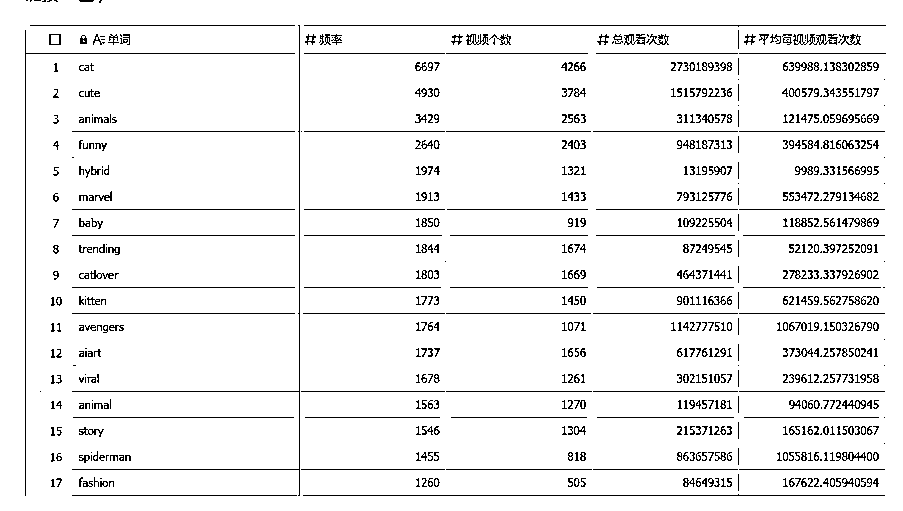

点进去#cat标签，可以看到这个赛道的内容主要是2类：宠物实拍和AI故事，根据自身的情况目前做不了实拍视频，所以筛选了一些AI赛道的博主。

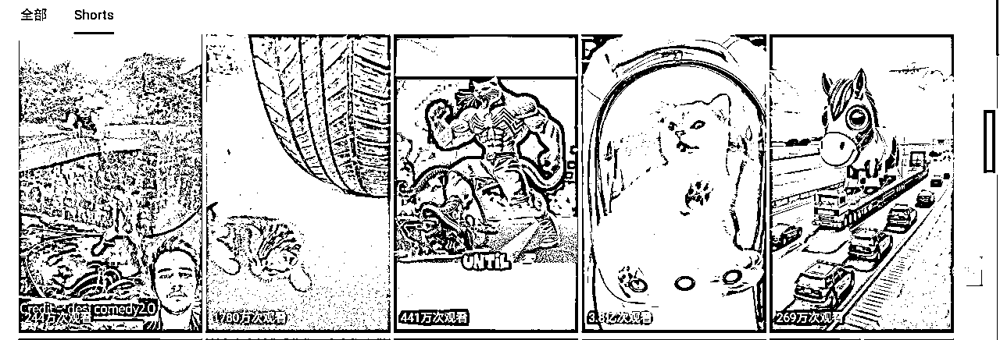

部分博主账号和变现情况：

https://www.youtube.com/@DailyCuteMeow/shorts

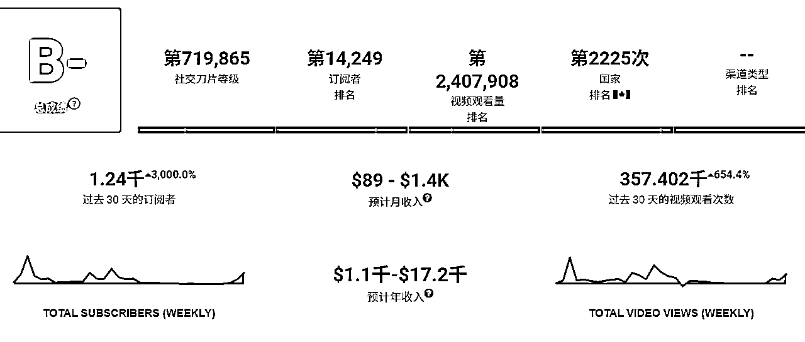

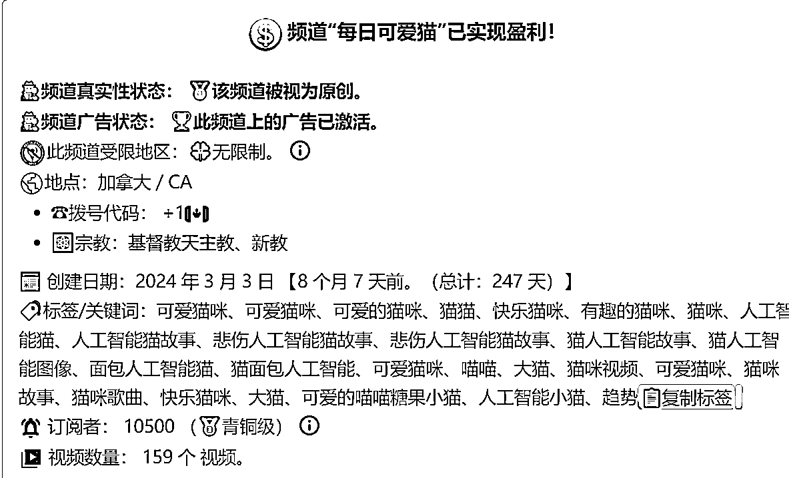

https://www.youtube.com/@Cutecat.2814

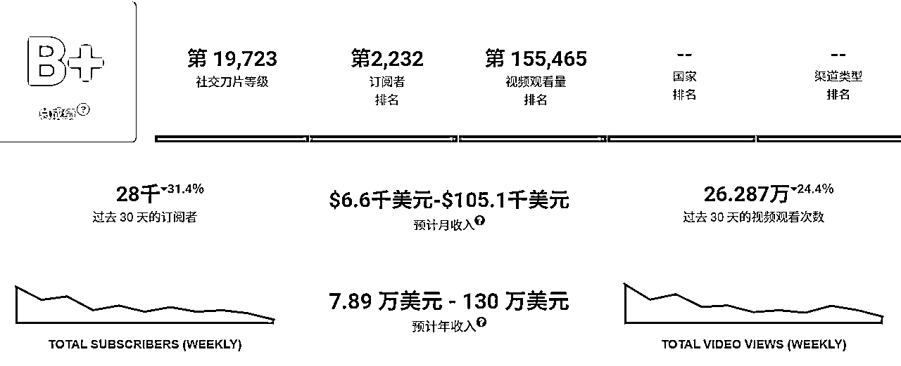

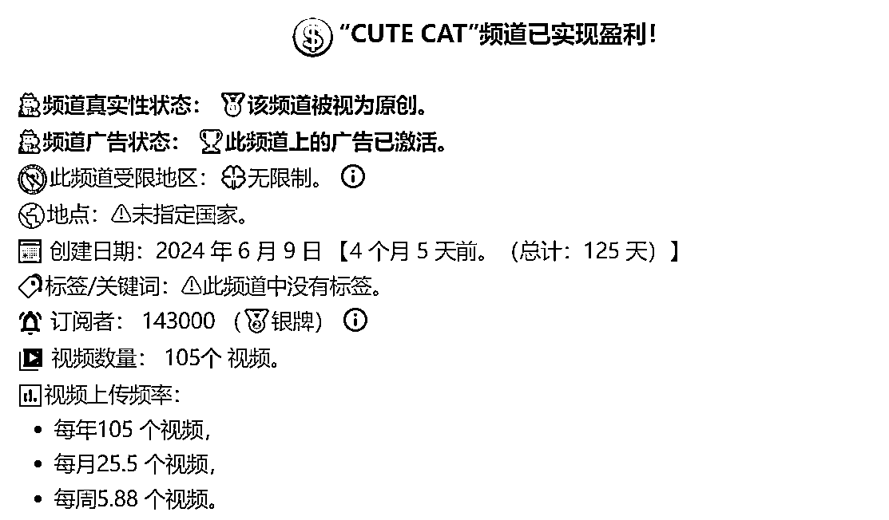

https://youtube.com/shorts/wxG86PG5z0I?si=NaFuHq3quNbdRhn6

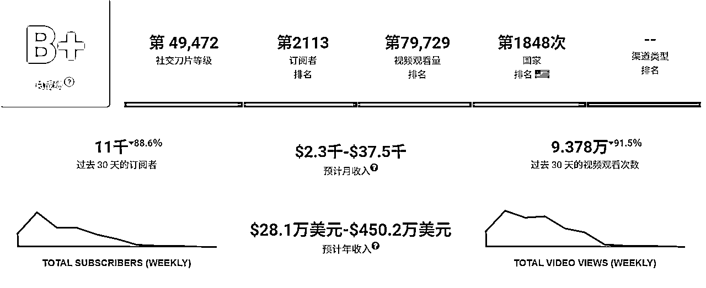

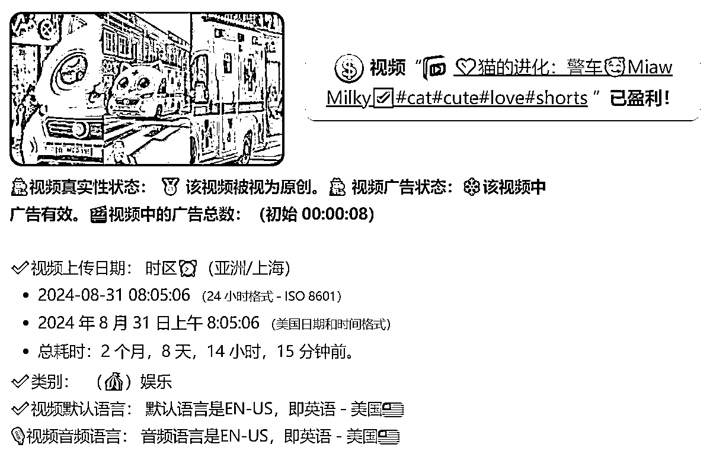

https://youtube.com/shorts/gOj-ObWKeBk?si=CwNSkzPIHSONNx4q

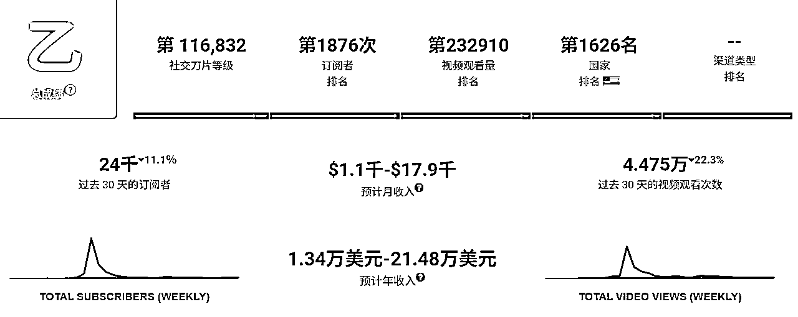

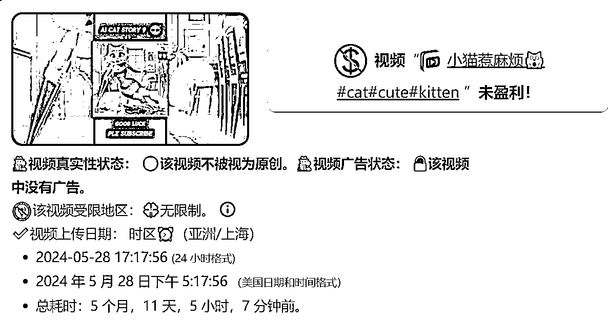

https://www.youtube.com/@94cat7

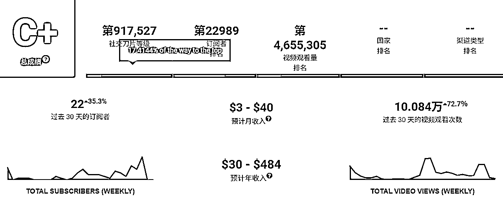

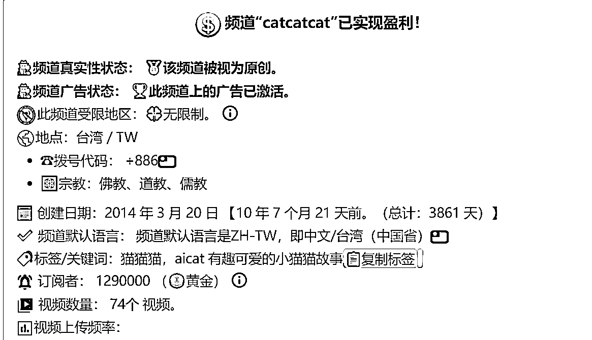

选择对标账号里其中一条爆款视频，下载到电脑本地：

youtube下载工具链接：https://ytshorts.savetube.me/zh/29-youtube-video-downloader-1jeen2

# 二、制作AI视频

以下是自己操作过程使用过的工具链接：

AI工具网：https://www.ai138.com/#term-13

Midjourney国内版：https://www.mj888.net/mjDraw/career

即梦（新用户会赠送一定的积分使用次数）：

https://jimeng.jianying.com/ai-tool/home

海螺：图生视频（新用户第一天可无限次使用）：

https://hailuoai.com/video

Ghatgpt国内免费可用：https://www.chatopens.com/

谷歌浏览器AI插件（每天有免费额度赠送）：

https://sider.ai/invited?c=1da1f41a71ac8544ddc8ae831b1014a0

豆包：https://www.doubao.com/

智谱清言：https://chatglm.cn/main/gdetail/65a232c082ff90a2ad2f15e2?lang=zh

## 1）复刻对标视频画面

操作步骤：

分割视频提取画面——拆解场景提取提示词——文生图（加原对标素材垫图）——图生视频——导入音乐和音效——成片

导入下载的对标视频，可以把右上角进度条适当拉大，分割节选需要的帧数

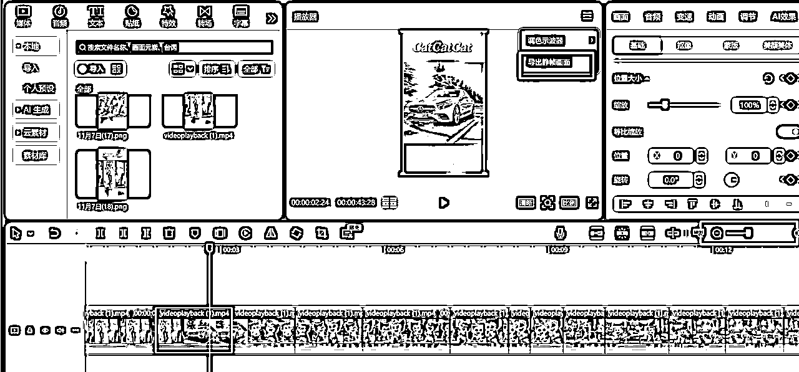

鼠标右键——时间区域——以片段选定区域——静帧导出到本地——把图片喂给GPT让它分析故事

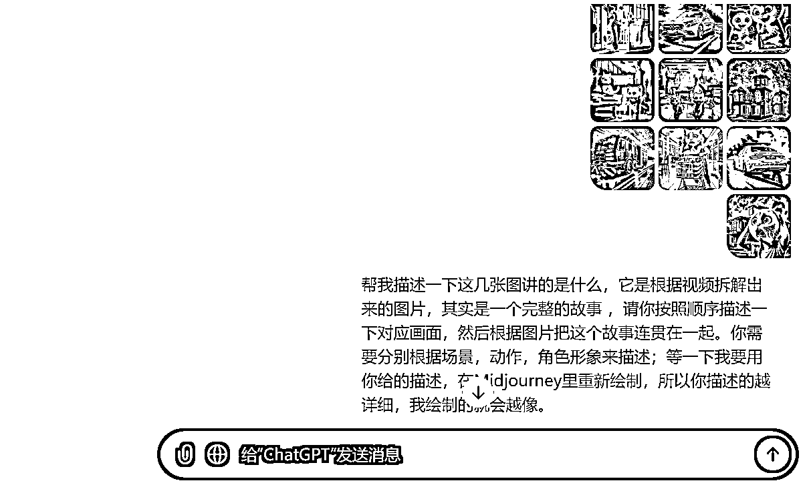

因为chatgpt一次只能上传十张图，所以分批上传，汇合在一起得到了以下信息：

1.  场景一：猫妈妈出门前和小猫告别

*   画面描述：明亮的客厅，门口大开，清晨的阳光洒入，照亮整个房间。门外可以隐约看到一个白色的篱笆，象征温馨的家庭环境。

*   角色动作：猫妈妈站在门口，轻轻挥手向家中的小猫们告别，脸上带着温柔的微笑，动作显得轻松且充满关爱。

*   角色形象：猫妈妈是一只拟人化的白色母猫，穿着简洁的白色T恤和蓝色牛仔裤，形象时尚又温柔，尾巴轻轻向上弯曲，表现出愉悦的心情。她的表情温柔，眼神中带有些许不舍，显示出对家中小猫的关心。

1.  场景二：猫妈妈的车行驶在上班路上

*   画面描述：一条宽阔的郊区公路，两旁的树木快速掠过，天空晴朗，阳光洒在路面上，营造出一个清晨的愉悦氛围。

*   角色动作：猫妈妈驾驶一辆银色豪华轿车，专注地看着前方，似乎沉浸在出发的情绪中，车速平稳而不急躁。

*   角色形象：坐在驾驶座上的猫妈妈依旧是温柔的白色母猫，脸上带着一丝平静的笑容，显示出她对即将开始的工作日充满信心和期待。

1.  场景三：小猫们的好奇心作祟，尝试点火玩

*   画面描述：室内的客厅，光线稍微暗了一些，两只小猫坐在地毯上，面前放着一个火柴盒和一个打火机。周围的摆设温馨，显示这是一个日常生活的场景。

*   角色动作：橙色的小虎斑猫和白色的小猫正开心地玩耍，手里拿着火柴，眼神中充满了好奇心。橙色小猫正试图点燃火柴，而白色小猫兴奋地看着这一幕。

*   角色形象：橙色小猫体型稍大一些，脸上带着调皮的表情，显得胆大和冒险；白色小猫则小一些，神情纯真，眼睛圆圆的，专注地观察橙色小猫的一举一动。

1.  场景四：小猫点燃火柴，火势开始蔓延

*   画面描述：客厅中一角开始燃起火苗，橙色小猫手里拿着点燃的火柴，白色小猫激动地看着，地毯上火苗已经开始扩散。

*   角色动作：橙色小猫一脸兴奋地观察着火苗，白色小猫拍手叫好，显得毫无危险意识。

*   角色形象：橙色小猫脸上带着自豪和好奇，而白色小猫则兴高采烈，它们显得天真且无知，对即将发生的危险毫无察觉。

1.  场景五：火势失控，小猫们惊慌

*   画面描述：火焰在客厅中迅速蔓延，家具、窗帘和地毯开始被火吞噬，整个房间被火光映照得通红。

*   角色动作：橙色小猫和白色小猫站在火焰前，表情从之前的好奇转为惊恐。它们向后退，彼此依偎在一起，显得无助。

*   角色形象：小猫们终于意识到火势不可控制，脸上带着惊讶和恐惧的表情，身体微微蜷缩，尾巴垂下，显出无助和害怕。

1.  场景六：房屋外部开始冒出黑烟

*   画面描述：从房屋外部视角来看，黑烟滚滚从窗户和门缝冒出，房屋的顶部已经开始燃烧，火光透过窗户照射出来。

*   角色动作：没有角色在此场景，火焰和黑烟占据画面，形成强烈的对比，显示出火灾的严重性。

*   角色形象：房屋被火焰吞噬，火势迅猛，黑烟滚滚而出，突显出危急情况。

1.  场景七：消防车紧急出动

*   画面描述：一辆红色的消防车闪烁着警灯，沿着城市道路急速驶向火灾现场，夜晚的灯光和车灯交织出一种紧张的气氛。

*   角色动作：消防车飞速行驶，鸣笛声响彻画面，带来一种救援的紧迫感。

*   角色形象：这是一辆典型的消防车，车身漆红，灯光亮眼，驾驶员（未出现）显然急于到达火灾现场，准备进行紧急救援。

1.  场景八：猫妈妈在超市接到火警电话

*   画面描述：猫妈妈在超市的购物通道推着购物车，手机响起，她接听后表情瞬间变得紧张，购物车里堆满了各种商品。

*   角色动作：猫妈妈停下脚步，一手推着购物车，一手拿着手机，脸上露出震惊和担忧的神情。

*   角色形象：猫妈妈依旧是那只白色母猫，眉头紧锁，眼神中充满了急切和焦虑，表情变化突显出她对家中的小猫们的担心。

1.  场景九：猫妈妈驾车赶回家

*   画面描述：银色的豪华轿车在公路上急速行驶，远处的天空中可见浓烟升起，似乎是从她的家方向传来的。

*   角色动作：猫妈妈全神贯注地看着前方，双手紧握方向盘，脸上写满了担心与焦急，汽车在公路上飞速奔驰。

*   角色形象：猫妈妈目光坚定，表情凝重，仿佛一刻都不能耽误，急于回到家中查看小猫们的安全。

1.  场景十：猫妈妈目睹家中火灾的惨状

*   画面描述：猫妈妈站在熊熊燃烧的房屋前，火光冲天，黑烟滚滚，背景是一片火海，家中的一切似乎正在被摧毁。

*   角色动作：猫妈妈双手抱头，脸上充满了痛苦和绝望，身体微微弯曲，显示出心碎和无助的情绪。

*   角色形象：她的眼中满是泪水，瞳孔放大，仿佛无法相信眼前的惨状。这只温柔的白色母猫在此刻表现出巨大的悲痛与不安。

1.  场景一：猫妈妈出门前和小猫告别

*   画面描述：明亮的客厅，门口大开，清晨的阳光洒入，照亮整个房间。门外可以隐约看到一个白色的篱笆，象征温馨的家庭环境。

*   角色动作：猫妈妈站在门口，轻轻挥手向家中的小猫们告别，脸上带着温柔的微笑，动作显得轻松且充满关爱。

*   角色形象：猫妈妈是一只拟人化的白色母猫，穿着简洁的白色T恤和蓝色牛仔裤，形象时尚又温柔，尾巴轻轻向上弯曲，表现出愉悦的心情。她的表情温柔，眼神中带有些许不舍，显示出对家中小猫的关心。

1.  场景二：猫妈妈的车行驶在上班路上

*   画面描述：一条宽阔的郊区公路，两旁的树木快速掠过，天空晴朗，阳光洒在路面上，营造出一个清晨的愉悦氛围。

*   角色动作：猫妈妈驾驶一辆银色豪华轿车，专注地看着前方，似乎沉浸在出发的情绪中，车速平稳而不急躁。

*   角色形象：坐在驾驶座上的猫妈妈依旧是温柔的白色母猫，脸上带着一丝平静的笑容，显示出她对即将开始的工作日充满信心和期待。

1.  场景三：小猫们的好奇心作祟，尝试点火玩

*   画面描述：室内的客厅，光线稍微暗了一些，两只小猫坐在地毯上，面前放着一个火柴盒和一个打火机。周围的摆设温馨，显示这是一个日常生活的场景。

*   角色动作：橙色的小虎斑猫和白色的小猫正开心地玩耍，手里拿着火柴，眼神中充满了好奇心。橙色小猫正试图点燃火柴，而白色小猫兴奋地看着这一幕。

*   角色形象：橙色小猫体型稍大一些，脸上带着调皮的表情，显得胆大和冒险；白色小猫则小一些，神情纯真，眼睛圆圆的，专注地观察橙色小猫的一举一动。

1.  场景四：小猫点燃火柴，火势开始蔓延

*   画面描述：客厅中一角开始燃起火苗，橙色小猫手里拿着点燃的火柴，白色小猫激动地看着，地毯上火苗已经开始扩散。

*   角色动作：橙色小猫一脸兴奋地观察着火苗，白色小猫拍手叫好，显得毫无危险意识。

*   角色形象：橙色小猫脸上带着自豪和好奇，而白色小猫则兴高采烈，它们显得天真且无知，对即将发生的危险毫无察觉。

1.  场景五：火势失控，小猫们惊慌

*   画面描述：火焰在客厅中迅速蔓延，家具、窗帘和地毯开始被火吞噬，整个房间被火光映照得通红。

*   角色动作：橙色小猫和白色小猫站在火焰前，表情从之前的好奇转为惊恐。它们向后退，彼此依偎在一起，显得无助。

*   角色形象：小猫们终于意识到火势不可控制，脸上带着惊讶和恐惧的表情，身体微微蜷缩，尾巴垂下，显出无助和害怕。

1.  场景六：房屋外部开始冒出黑烟

*   画面描述：从房屋外部视角来看，黑烟滚滚从窗户和门缝冒出，房屋的顶部已经开始燃烧，火光透过窗户照射出来。

*   角色动作：没有角色在此场景，火焰和黑烟占据画面，形成强烈的对比，显示出火灾的严重性。

*   角色形象：房屋被火焰吞噬，火势迅猛，黑烟滚滚而出，突显出危急情况。

1.  场景七：消防车紧急出动

*   画面描述：一辆红色的消防车闪烁着警灯，沿着城市道路急速驶向火灾现场，夜晚的灯光和车灯交织出一种紧张的气氛。

*   角色动作：消防车飞速行驶，鸣笛声响彻画面，带来一种救援的紧迫感。

*   角色形象：这是一辆典型的消防车，车身漆红，灯光亮眼，驾驶员（未出现）显然急于到达火灾现场，准备进行紧急救援。

1.  场景八：猫妈妈在超市接到火警电话

*   画面描述：猫妈妈在超市的购物通道推着购物车，手机响起，她接听后表情瞬间变得紧张，购物车里堆满了各种商品。

*   角色动作：猫妈妈停下脚步，一手推着购物车，一手拿着手机，脸上露出震惊和担忧的神情。

*   角色形象：猫妈妈依旧是那只白色母猫，眉头紧锁，眼神中充满了急切和焦虑，表情变化突显出她对家中的小猫们的担心。

1.  场景九：猫妈妈驾车赶回家

*   画面描述：银色的豪华轿车在公路上急速行驶，远处的天空中可见浓烟升起，似乎是从她的家方向传来的。

*   角色动作：猫妈妈全神贯注地看着前方，双手紧握方向盘，脸上写满了担心与焦急，汽车在公路上飞速奔驰。

*   角色形象：猫妈妈目光坚定，表情凝重，仿佛一刻都不能耽误，急于回到家中查看小猫们的安全。

1.  场景十：猫妈妈目睹家中火灾的惨状

*   画面描述：猫妈妈站在熊熊燃烧的房屋前，火光冲天，黑烟滚滚，背景是一片火海，家中的一切似乎正在被摧毁。

*   角色动作：猫妈妈双手抱头，脸上充满了痛苦和绝望，身体微微弯曲，显示出心碎和无助的情绪。

*   角色形象：她的眼中满是泪水，瞳孔放大，仿佛无法相信眼前的惨状。这只温柔的白色母猫在此刻表现出巨大的悲痛与不安。

接着让GPT根据以上的场景和角色设定，生成作图提示词：

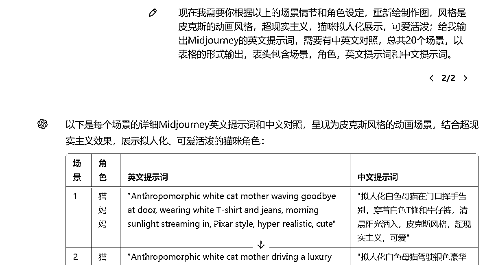

把提示词发给AI作图工具，过程需根据生成效果，不断微调提示词，加入自己想生成的画面元素。

因为刚开始摸索，想先节约投入成本，作图部分我分别用了国内版的GPT、即梦和MJ。

个人感觉是国内版GPT作图容易卡顿且二次修改不方便，即梦和MJ这2个作图导入对标视频的垫图后，生成效果较好，国内MJ我是淘宝先买了体验卡；

图生视频的主要用了即梦（新用户每天有免费60积分）和海螺（新用户注册第一天可以无限次生成，所以可以先把图集中做好，找自己时间相对方便的一天猛猛用完它）。

即梦：

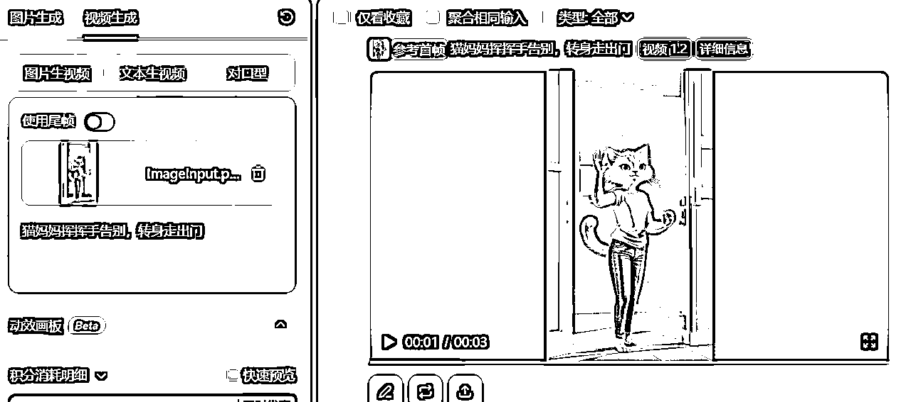

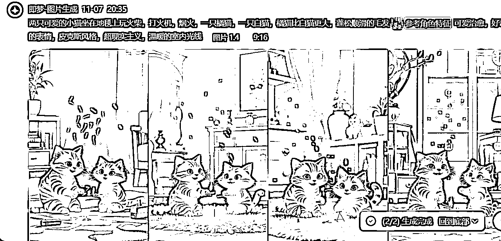

MJ：

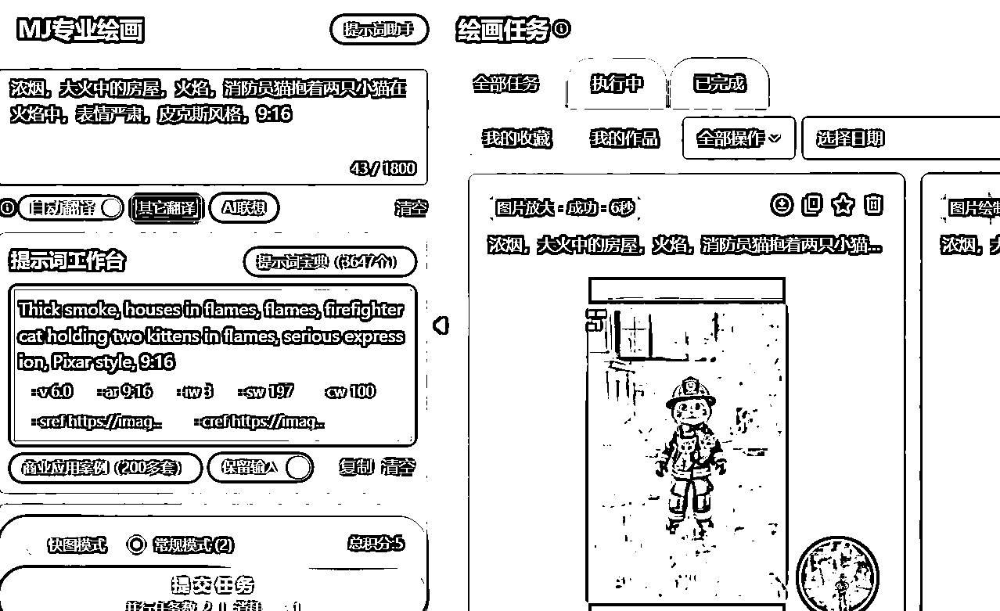

把制作好的ai视频按照场景顺序导入剪映，

在youtube上下载提取miaomiaomiao的音乐

博主音乐素材：

https://www.youtube.com/results?search_query=Bongo+Cat

https://www.youtube.com/shorts/h1qQt-lZycU

把博主视频下载到本地后，到剪映提取原视频音乐，以及搜索跟画面匹配的音效即可

原视频因为用ai作图下载后会有网站的水印，这里我是用剪映直接拉近画面，把水印覆盖掉，也欢迎圈友们推荐更好用的去水印工具～

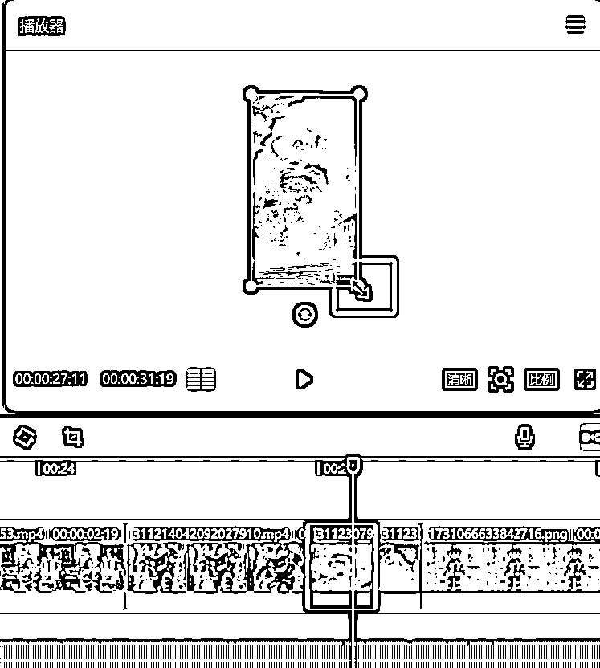

最后成片：

## 2）延伸制作其他故事

按照对标视频复刻，不知道这样复刻会不会被系统判定为抄袭，所以前期想着先模仿对标摸索熟悉制作操作，后面可以尝试做新的故事和镜头，操作思路也是写故事脚本——制作分镜头图片——按照故事顺序把图片生成视频——配上音乐——成片，如：

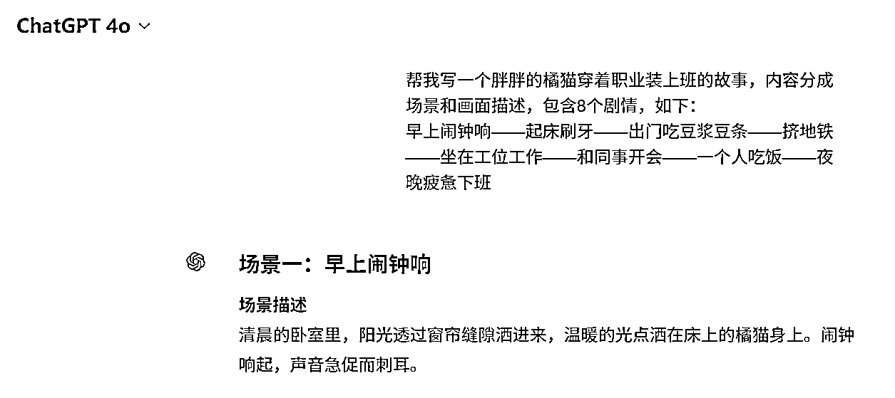

即梦出图效果：

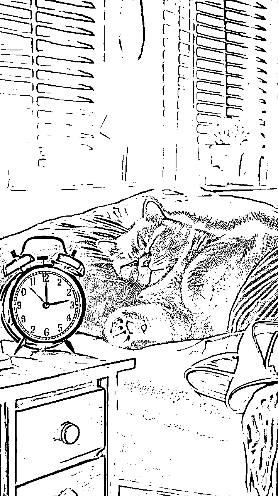

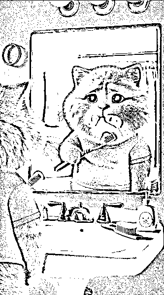

在YouTube找对标的过程中，在#animals 和#funny 这2个标签中，刷到了其他动物赛道的ai视频，视频风格跟猫咪赛道类似，也是讲述日常生活场景和让人产生共鸣的小故事，对标参考：

狗狗故事：

https://youtube.com/shorts/DlS7aIsfQOU?si=1x9ziStMSYRbi7Mn

狗狗跳舞：

https://youtube.com/shorts/WaKu3cVIB2c?si=VWkQgMXZE4MKncXg

兔子故事：

https://youtube.com/shorts/7CRSVC8Qb_M?si=OAhE8uwUYht-F7_j

多动物ai视频：

https://www.youtube.com/@Todd_AI_Animal

多动物ai图片合成：

https://youtube.com/shorts/glGtEUD-hPA?si=jRfLQZ_wJ9hHmQkL

https://youtube.com/shorts/bP0cdPtNUZY?si=J845gLiNg0FbyJ7B

https://youtube.com/shorts/8K4mO16lqb4?si=Y24yWaRJvulDEAfs

热门动漫+动物ai合成：

https://youtube.com/shorts/vxRM-Mil354?si=1Iiml_3KhutN9TET

发现猫咪的ai视频平台上已有较多博主在做，担心赛道拥挤，所以感觉后面可以再试试把提示词换成其他的动物生成ai视频，降低内容同质化。

# 三、行动计划

当前问题和不足：

1）目前自己对youtube和赛道情况了解还不熟悉，还需要多刷刷找找灵感

2）日常对ai工具使用和视频创作较少，在尝试各个软件过程中花费了不少时间，需加强学习AI运用

3）目前是根据对标视频的画面进行复刻，担心因为内容同质化而影响后续开通变现，所以希望后面熟悉操作后也能尝试下创作新的视频风格。

近期计划：

1、赛道和选题探索：梳理赛道账号和爆款内容

2、学习ai运用和视频创作

每天拆解一条ai短视频，包括剧情、风格和剪辑手法等

学习和熟悉ai工具使用和剪辑方法，比如如何结构化地调教ai，如何更精准地生成想要的提示词和制作自动化工作流等，提高创作效率。

最后，愿我们都能在行动中找到适合自己的生财之术，创造出自己满意的作品！

感谢观看～