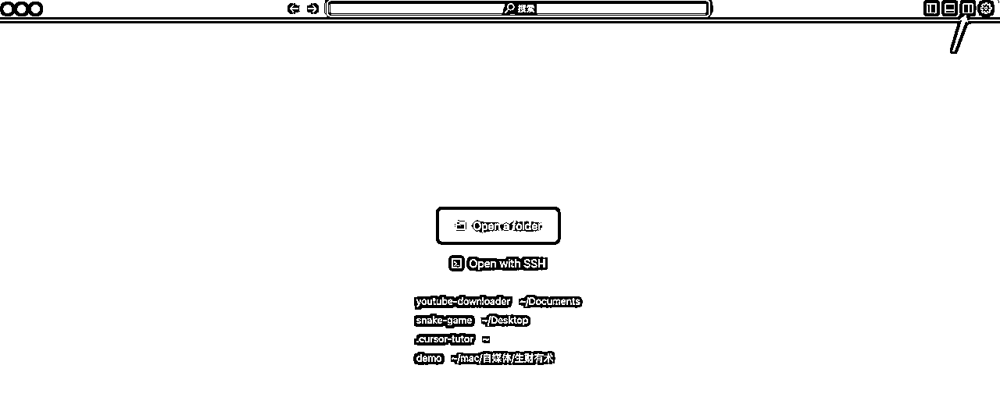
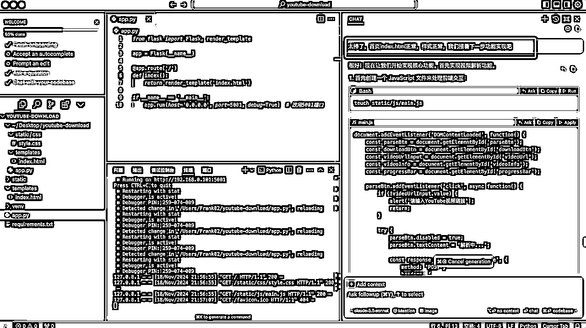
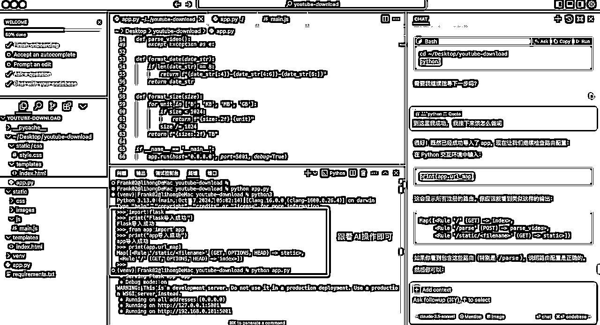
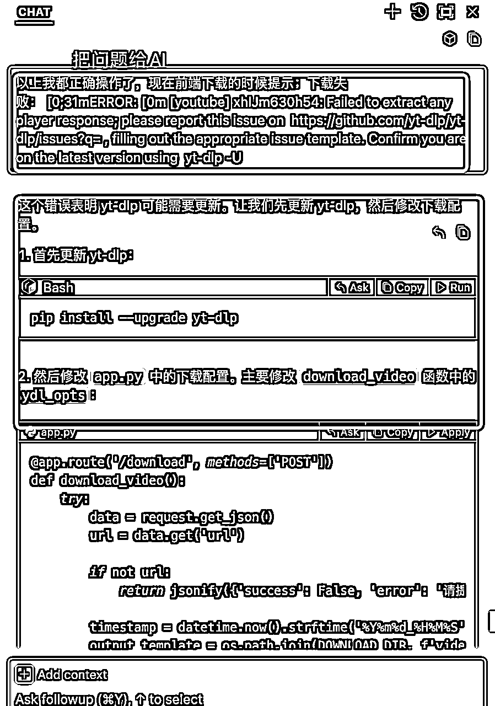
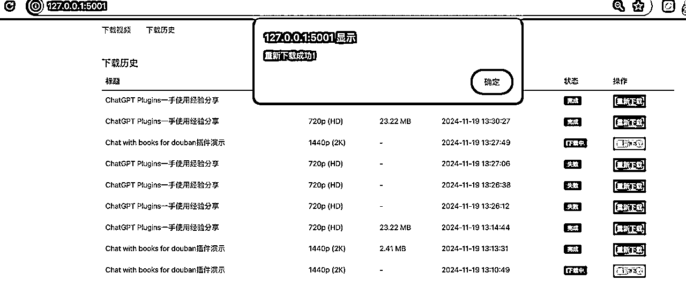

# 我是如何用Cursor从0到1做出来youtube视频下载工具的

> 来源：[https://jhsbi41509.feishu.cn/docx/EpLEdOqdYoSrJsxpbAbcNBuJnrh](https://jhsbi41509.feishu.cn/docx/EpLEdOqdYoSrJsxpbAbcNBuJnrh)

大家好呀，我是红哥Frank，加入生财快两年了。平时工作比较忙，很少在生财冒泡。最近花了几天时间学习Cursor，做出来了两个小应用。一个是贪吃蛇，一个是YouTube视频下载工具。写本文的目的是，记录我是如何用Cursor从0到1做出来youtube视频下载工具，把整个实现过程，完整呈现出来，给要学Cursor的生财圈友们更多信心。我都可以学会，相信你也可以。

下面先看一下我做的2个小应用。

# 一、背景：

最近Cursor很火，在星球的帖子和志愿者的群里，经常能看到圈友们在讨论着Cursor。其中在2024年11月14日，在志愿者群里，有一个帖子：《如何让吴佳文学会用cursor完成一个复杂项目》，成功引起了我的注意。我跟着这个帖子，深度体验了一把Cursor的使用流程，并做出来了一个贪吃蛇游戏，很兴奋，全程不到4个小时，这个Cursor太有意思了。


(贪吃蛇，这个我用Cursor实现了，且编译打包，部署发布到了Github pages，cname到自定义域名，公网可体验)

随后过了一个周末，玩耍了两天。11月18日，周一我再次用Cursor做了一个Youtube的网页下载工具，两个多小时就搞定了（包含走的一些弯路）。下边，我贴一下实现的YouTube下载的界面，很简单，如下：

这一套是第一次做，用的是 React+Node.js。


因为第一次做，意外实现了。在圈友罗卜等人的鼓励下，让我做一个分享。于是，我就重新开始，一边复盘写我的实现过程，一边操作，一边截图，又做了一套，技术栈是另外一套：Bootstrap+js+python+flask。界面大概是这样子：


# 二、我为啥要做YouTube下载工具？

最近媳妇失业了，还没去上班，有的时候，她自己在捣鼓视频搬运，让我帮她下载YouTube视频，她在剪辑一下发布。我工作比较忙，基本没空理她。最开始是，等我有空了，让她把要下载的YouTube视频地址发给我，我在google一通搜索，随机一个个去找能下载的YouTube视频的工具。有时候运气好，很快找到能用的，下载好了，在通过微信发给她视频。有时候运气不好，一直在找YouTube视频下载的工具的路上，效率挺低的，下载个视频，包含找工具的时间，给她发下载好的视频，要半个小时以上，有时候更久，挺费时间的。联想到最近体验了Cursor，我是不是可以用它来做一个YouTube视频下载工具，能成功把YouTube视频下载下来就可以。

加之这次12月航海，刚好有Cursor项目，我也报名了，想在航海之前，提前实践一下，分享一下自己的实操记录和心得，让更多圈友有信心，可以看到Cursor可以做出应用软件来，看到更多像我一样，不会代码的，利用好功能，也是可以做软件应用的。

# 三、找对标工具网站

这个步骤，方便你后面写你的需求。

我找对标的方法是，在谷歌搜索关键词：在线youtube视频下载工具，然后点了一个网站，测试工具能正常下载YouTube视频，就决定来做了。

下面是一个工具网站的截图。输入YouTube视频，解析视频，然后点下载视频。（当然了这个对标工具站不止YouTube视频下载）。我仅仅模仿做一个和它功能类似的下载功能。（为了避免打广告嫌疑，我就不贴这个下载工具的网址了，大家自己去按关键词搜索即可）


下面我给大家分享，我用Cursor尝试做YouTube视频下载工具的完整过程。也期望大家看完，一起来实践一下，挺有意思，实现出来之后，你会有一种非常强大的成就感。我也不得不感叹，现在AI真的可以让我这样，没有编程基础的人，也能做出来工具应用。

# 四、用Cursor实现的具体步骤详解

## 第0步：用Cursor实现开发的工作流程

我简单画了一个流程图，大家先看一下：


我把流程图中，两个角色，我(代表用户)，Cursor(代表技术)，各自分工的事项梳理如下：

我：（扮演产品经理角色，需求方）

*   先要有一个想法

*   文字描述需求

*   根据Cursor推荐要决策，选定一套它推荐的技术栈

*   Cursor辅助完成开发环境搭建，及功能实现了，要负责测试验证

Cursor:（扮演开发角色，实现方）

*   根据用户需求(我)，理解需求，输出需求设计文档

*   给用户推荐可行的技术方案(技术栈)

*   给出搭建开发环境的步骤和代码

*   按需求设计文档，分模块实现对应的功能

*   负责修复用户反馈的问题

我们作为使用AI的人，只需要负责好自己的事情就行。大家看到，我们自己负责的事情，根本没有写代码的环节。我们更重要的工作是：有一个想法，知道要什么，能表达出来。借助AI帮我们完善需求，在AI实现后，我们进行需求验收，不合格，丢回去给AI就行了。

整个过程，其实和真实的产品经理和开发的工作职责，和工作流程，是一模一样的。

OK，了解这些信息之后，我们就开始后面一步一步，用Cursor实现的具体步骤详解。

## 第一步：描述需求

这一步非常重要。我们让AI干活之前，要想清楚自己具体要做什么功能，梳理并用自己的话，写下来。如果我们自己不知道要做什么，没有目标，完全给AI去发挥，挺难的，做出来的东西，也不一定是自己想要的。因此呢，建议在这个步骤，大家仔细想想自己的需求，尽可能的把自己想要的功能需求给写下来。

在前面我提到，我有一个想法，想要做一个YouTube在线视频下载工具。于是，我们可以把需求给描述下来。

下面，是我写给AI的功能需求描述。你可以根据你自己的场景，来进行描述，不一定要照抄。如果你要实现和我一样的效果，可以直接用我的描述，没问题。

1、网站核心功能需求：

我想做一个在线的YouTube下载的工具网站，当用户打开网址，并在输入框中，输入www.youtube.com网站的视频文件URL地址，点【解析视频】的按钮之后，你可以解析出：封面大图，视频标题，视频描述，上传日期，文件大小等字段。我需要你同时展示这个字段的名称，和对应的值。比如，上传日期：2024-11-18。字段名称在上边，字段的值，显示在下面。最好表格的形式，帮我呈现。

【解析视频】成功后，用户可以点击按钮，按钮名称为：下载视频，系统开始下载视频到本地电脑。在下载的时候，需要有：实时的下载进度更新的状态条。当系统下载成功后，给用户一个提示：下载成功。另外，我希望展示历史下载记录。

2、网站html页面的title，我希望你帮我命名为：红哥YouTube视频下载。

3、网站页脚footer区域，我希望展示一行文字：© 2024 红哥的YouTube视频下载器，仅供学习使用，联系人：红哥，邮箱：hong420802#gmail.com

4、整个页面，我需要你帮我设计成响应式，可以自适应各种屏幕大小。

5、我是用的mac电脑，我在电脑桌面desktop，已经新建了一个youtube-download文件夹，以后我们所有沟通的文件，及代码文件，都帮我存到这个文件夹。我是一个0基础用户，以前没有代码编写的经验，我希望你先理解我的需求，并规划实现的技术架构，给我一些建议，方便我们来沟通需求，文件输出到：youtube-download文件夹的需求设计文档.md文件中。

#### 耗时情况：

耗时：5～10分钟。（前提是，你知道自己的需求是什么，你才能用这个时间，描述出来需求）

## 第二步：把需求给Cusor生成需求设计文档

Cursor如何安装，我就不赘述了。上面提到的帖子，已经有非常详细的Cursor安装教程。

下面我们直接开始，打开运行Cursor，点右上角的【Togger AI Pane】, 点新建按钮，建一个新的会话，操作截图如下：




在聊天框输入完，敲回车，就会给你一段需求设计说明，我们用一个txt或.md文件，或word存着都可以，没所谓，方便记录我们的需求设计是怎样的，先记录下来，后续根据实现再来看，我们的需求，哪些实现了，哪些没实现。


下面是AI给我的YouTube视频下载工具的需求设计文档：

#### 耗时情况：

耗时5分钟左右。

## 第三步：搭建开发环境

在AI CHAT的聊天框输入：

先按这个方案来实现，先帮我搭建开发环境吧。我需要你给我一步一步的手把手教程，我0基础，没有编程经验。

下面是截图，


接着，我们按照它给出的一步一步的步骤，进行操作。如果在某一个步骤遇到问题，你可以直接把问题丢给AI，继续问它，让它帮你解决。整个解决过程，你不需要用到其他的工具，比如：百度，谷歌，等搜索引擎。另外你也不需要问身边的朋友，他们理解你的需求就要很久，有那个时间，只要你去追问AI，他瞬间就给你不同的解决方案，你需要做的就是保持耐心，不断去尝试就可以，然后进行下一个操作步骤。

下面关于报错的问题，及解决方法，我举个实际例子。

看下图，一开始就遇到问题了，碰到权限的问题，导致 python3 -m venv venv 创建虚拟环境无法执行。我的解决过程如下。


以后大家遇到类似的问题，举一反三，向这样子去问Corsor给你答案，你不停去尝试就可以，直接解决。

解决之后，在聊天框输入：

OK，解决了，或OK，解决了，我们继续下一步。

为啥要加这一句呢？有可能你问了很多次，很多轮对话，之前的步骤，会被顶到上面去了，你要翻上去找。你给AI反馈解决了，它会接着给你指导你之前没有进行的下一步，非常方便。这是一个小细节，省去你找操作步骤到哪里了。


Ok,我们还是回到一步一步的实践操作。

### 1、安装Python

#### 下面是Cursor给的教程：


#### 下面是我的操作截图：

看到有版本号，OK，下一步。如果你没有，按AI给你的步骤去操作，如果失败，看上面给的问题解决方法，去问AI，让它给你解决，这个解决问题的方法，是通用的，你要学会多用。


### 2、创建项目虚拟环境

#### 下面是Cursor给的教程：


#### 下面是我的操作截图：

这个地方我遇到问题，通过问AI解决了，因为后面还会可能有其他问题，所以我拿这个我解决的问题方法，写到这个部分开头了。


### 3、安装依赖包

#### 下面是Cursor给的教程：


#### 我的操作截图：


### 4、创建基本项目结构

#### 下面是Cursor给的教程：


#### 下面是我的操作截图：


### 5、验证安装

#### 下面是Cursor给的教程：


#### 下面是我的操作截图：

在基础文件创建完成后，我们在创建测试程序，编辑app.py文件的时候，我们可以用自己的编辑器，去打开项目目标。编辑器我自己用的是Sublime Text，比较简单，清爽。你也可以用它推荐的VS Code(程序员必备的编辑器)。


OK，到这个地方，环境搭建和测试，就完成了。开发环境搞定，成功了一大半。我们继续加油。

### 6、耗时情况：

这个环节，大概耗时15～30分钟左右。

接下来，我们继续问AI，指导我们后续的功能实现。

我的环境搭建完成了，浏览器测试，@http://127.0.0.1:5000/ 输出正确。请指导我进行下一步操作

那它又给出来了，后续的操作步骤：


## 第四步：创建网站的基本界面

#### 4.1 准备工作

在创建网站的基本界面之前，一些准备工作：

##### 4.1.1、用Cursor打开项目文件


你会发现，打开之后，之前和AI的聊天记录没有了。（我也不知道为啥没有～，没关系，把我们的需求描述再给一遍AI，快速走一遍即可）


##### 4.1.2、如何找之前和AI的聊天记录？

如果你要找之前的CHAT聊天记录，看下面的步骤：

文件--->新建窗口--->AI聊天--->历史记录，截图如下：


##### 4.1.3、为啥我要用Cursor打开目录？

目的很简单，我要让AI识别到我在聊天框问的问题，是针对我左边打开的项目，把AI给出答案右边的Apply功能用起来，大大提升我们的效率，我们只需要点Apply--->Continue--->Accept，Cursor会自动的帮我们把代码更新好。

#### 4.2创建网站的基本界面：

在AI聊天窗口右侧，直接点【Apply】,稍等几秒，出现【Apply】，直接点击它。


Apply完代码，一定要记得，ctrl+s保存一下，千万别忘记了，要不然白干了。


下面，就一步一步Apply--->Accept，跟着AI的提示，把代码都全部应用，记得保存，记得保存，记得保存。（后面类似的操作，我就不赘述了）


#### 4.3 运行应用：


#### 4.4 测试网站基本界面与排错：

以下是AI指引我们的测试项，我们来测试一下。

在浏览器中访问 http://127.0.0.1:5000 来查看基础页面。这是一个基础的框架，包含了：

响应式布局

视频链接输入框

视频信息展示区域

下载按钮和进度条

页脚信息

测试发现，页面不符合预期，还是之前的Hello,YouTube Downloader！


没有写过代码，我也不知道咋解决呀，直接问AI。


一顿操作，排查下来，发现5000端口被占用，改用5001，应用代码，重启服务，测试正常了。


#### 4.5测试结论：

功能已实现，功能测试正常。

#### 4.6耗时情况：

这个功能的实现，测试，改BUG，整体加起来，大概30分钟。

## 第五步：实现视频解析功能

我们继续，问AI：

太棒了，首页index.html正常，样式正常，我们接着下一步功能实现吧



#### 5.1 功能实现+测试

首先创建一个 JavaScript 文件来处理前端交互，跟着AI操作即可。

这里说明一下，有时候Aplly有2个选项，Apply to current file和create a new file。如果我们的项目工程目录有目标文件，且是空的，我们直接Apply to current file。如果没有，点create a new file。


OK，照着AI的提示框的内容操作完毕。接着在下面，提示我们测试内容如下：

现在您可以测试视频解析功能了：

在输入框中粘贴一个 YouTube 视频链接

点击"解析视频"按钮

等待解析完成，页面会显示视频信息

测试发现，输入视频URL地址，点【解析视频】没有任何反应，过了很久弹出报错提示，如下。


接着问AI：


修改，还是有问题，问AI，


排查了依然有问题，接着问AI，发现它提示的问题点，

from app import app

print(app.url_map)

之后，没有任何输出，接着问AI要解决方案。





问题点：没有 /parse 路由

检查命令：

from app import app

print(app.url_map)

发现，pip list | grep flask-cors 没有输出，重新装pip install flask-cors，然后在测试一下OK。接着在把上面的步骤做一遍。

以下在终端命令行操作：每一行，都是一个命令

python3

from flask import Flask

from flask_cors import CORS

print("导入成功")

from app import app

print(app.url_map)

终于正常了：

Map([<rule>' (OPTIONS, GET, HEAD) -> static>,</rule>

<rule get="" head="">index>,</rule>

<rule post="">parse_video>])</rule>


接着在前端页面输入URL地址，按解析视频，又出现新的错误，截图如下：


重新测试，解析视频成功。离成功又近了一步。

不过，样式有点丑。


给描述，让AI给我优化了一下子，


#### 5.2耗时情况：

这个功能的实现，测试，改BUG，整体加起来，1到1.5小时。

## 第六步：实现下载功能

还是接着问AI，继续实现其他的功能。然后把它建议的代码进行应用apply ，然后accept，最后重启服务，进行测试。

#### 6.1实现下载功能

按AI给的提示教程，就一个步骤，进行应用apply ，然后accept就可以。然后就可以开始测试功能了。


#### 6.2下载功能测试：

在输入URL地址后，解析视频，在最下面，点【下载视频】按钮，看是否能成功下载出视频文件到本地电脑。

测试结果：


问AI，修改了代码，

添加了 User-Agent 头信息

禁用证书检查

启用详细输出以便调试

添加其他必要的下载选项

测试结果如下：

下载失败：[0;31mERROR:[0m [youtube] xhIJm630h54: Failed to extract any player response; please report this issue on https://github.com/yt-dlp/yt-dlp/issues?q= , filling out the appropriate issue template. Confirm you are on the latest version using yt-dlp -U




测试，还是有问题：


接着问AI给解决方案。这次，让我按照ffmpeg。操作一把，在测试一下。


这次，终于好使了，下载成功：


这个是服务器端的日志，下载100%，Merger成功到本地文件。


又找了一个39分钟的YouTube视频URL，测试了一把，下载成功。文件大小346MB，下载了好久，大概10几分钟。


#### 6.3测试结论：

我的测试结论是，测试通过。基本下载功能是OK的。

如果我们觉得下载慢，还可以问AI，能不能再优化一下，接着它会给你一些建议，你要做的就是应用它的代码，然后不断测试。（这个部分，你在体验实现功能就好了，不用一直死磕某个环节的优化，后续熟悉了再来也是可以的）


......这里我就不重复描述每个问题点的优化过程了，和前面的流程一样，问AI，应用它的代码，遇到问题，丢给AI继续问，直到解决。

我的优化结果：


还是同样文件大小346MB的YouTube视频，4分钟下载完成，提升比较明显。

#### 6.4耗时情况：

这个功能的实现，测试，改BUG，整体加起来，大概1个小时。

## 第七步：实现下载进度条功能

上边第六步实现之后，其实我们视频下载的核心功能就实现了。

那第七步，实现下载进度条功能，意思是，用户点击下载后，给用户实时展示进度条的状态，让用户知晓下载进度。这个属于用户体验优化了，非核心功能。（如果大家实操的话，可以跳过这个步骤，不用实现）

#### 7.1实现下载进度条功能：

我给AI的指令是：先做下载进度实时显示。给出了代码修改意见：


#### 7.2功能测试

用于测试的YouTube视频URL：https://www.youtube.com/watch?v=u8suB4La7oE （视频2.4M，方便测试下载和进度条显示）。

经过测试OK，显示了下载进度，下载完成，下载进度整个块隐藏。


有时候，AI在合并代码会出现问题，会导致之前解决过的问题，实现其他需求后，原来的问题又出现了。解决办法还是问AI，丢问题给它，让它进行修复。最好让它给了修复方案，让它把整个修改代码合并，你直接进行整体替换即可。

下面是我问AI的问题：

下载进度条看起来正常了。但是，解析视频的信息里面，文件大小字段，又没有显示了，变成了：未知大小，这个问题，你之前帮我修复过，又出现这个问题了。请帮我修复。


这里实现了进度条功能，新发现问题了。

1、之前是给我下载到youtube-download/downloads文件夹下边，现在给我下载到了 桌面。

2、下载出来的视频文件名称，之前忘记让它改名了，重新提需求给AI，让它修改一下。

下面是丢给AI的问题：


我应用之后，符合我的预期，截图如下：


（给我存放到了：downloads目录下，视频文件的名字，也给我修改好了，方便按视频标题来找视频文件）


#### 7.3测试结论：

功能已实现，功能测试正常。

#### 7.4耗时情况：

这个功能的实现，测试，改BUG，整体加起来，不到0.5小时。

## 第八步：实现视频质量选择功能

#### 8.1实现视频分辨率选择功能

我们问AI，我们继续完成之前需求设计文档里面的，其他还没有实现的功能。它就会给你提示，给你一个需求待实现列表，问你先实现哪一个。当然它也会建议你先实现一些优先级高，且简单的功能。

那我们来实现：视频质量选择功能。


#### 8.2视频选择功能测试

中间遇到一些波折，问AI解决了。效果如下：


下载功能，进度条功能，均正常。


#### 8.3测试结论：

该功能实现正常，功能测试，及之前的功能测试正常。

#### 8.4耗时情况：

这个功能的实现，测试，改BUG，整体加起来，不到1个小时。

## 第九步：实现查看下载历史记录

该功能是非必需功能，我只是演示，从开始想做这个下载历史记录的需求，到用cursor实现它的过程记录，给圈友们一些启发。实际过程中，建议大家把时间精力花在重点的核心功能上。

比如YouTube视频下载工具，核心功能是解析视频，下载视频。其他的都是属于可有可无的功能，可做可不做。

这个功能，我没有调研过市场上的类似YouTube工具有没有这个功能，纯属于自己拍脑袋想的功能，我就想验证一下我的想法，不会写代码，用Cursor到底能不能实现，我自己能不能做出来。要是真做出来了，真的是鼓舞人心。

我们接着往下看吧～

#### 9.1实现历史记录前端页面


下面是AI给出的实现方案，照着做就行，在右侧的窗口，直接Apply，然后Accept。最后完成了之后，直接进行功能测试。

第一步，先安装必要的依赖：

```
pip install flask-sqlalchemy
```

第二步，修改 app.py，添加数据库支持：

```
# 在文件开头添加导入
from flask_sqlalchemy import SQLAlchemy
from datetime import datetime

# 在创建 Flask app 后添加数据库配置
app = Flask(__name__)
CORS(app)

# 配置 SQLite 数据库
app.config['SQLALCHEMY_DATABASE_URI'] = 'sqlite:///downloads.db'
app.config['SQLALCHEMY_TRACK_MODIFICATIONS'] = False
db = SQLAlchemy(app)

# 定义下载历史模型
class DownloadHistory(db.Model):
    id = db.Column(db.Integer, primary_key=True)
    title = db.Column(db.String(500))
    url = db.Column(db.String(500))
    format = db.Column(db.String(50))
    quality = db.Column(db.String(50))
    filesize = db.Column(db.String(50))
    download_date = db.Column(db.DateTime, default=datetime.now)
    status = db.Column(db.String(20))  # success, failed
    error_message = db.Column(db.Text, nullable=True)
    file_path = db.Column(db.String(500))

# 创建数据库表
with app.app_context():
    db.create_all()
```

第三步，修改 templates/index.html，添加历史记录标签页：

```

##### 下载历史

                                     标题 |
                                     质量 |
                                     大小 |
                                     下载时间 |
                                     状态 |
                                     操作 |

| --- | --- | --- | --- | --- | --- | --- | --- | --- | --- | --- | --- | --- |

```

下面是我的实操截图：


我们来看一下前端的表现，如下截图，正常。


#### 9.2实现添加历史记录的功能

这个功能的意思是，当用户在下载之后，往历史记录里面插入一行数据，记录下载日志。

接着按AI的提示，让它帮忙提供JS和后端的API代码。（具体操作大家跟着AI的提示，逐个问它，实在没法一个个贴图了，非常消耗精力贴图）


我先添加获取历史记录的API，一通操作下来，下载视频失败了。如下图：


老规矩，把问题丢给AI，它给了方案之后，在右侧点Apply，然后再点Accept。前面反复说过，直接操作就行。最后啰嗦一下，Accept后，要ctrl+s保存一下文件，这个保存不要忘记。


我操作后，重新启动服务，又遇到问题了。如下，继续问AI。


接着问AI，应用它的方案。


这次下载成功了，下载记录，也有数据了。截图如下：


再找个视频URL下载，看看历史记录：


#### 9.3历史记录-重新下载

功能说明：用户点历史记录，出现历史记录列表，在列表右侧，有一个【下载】按钮，用户点击后，可以重新下载文件。


继续问AI，重新下载文件，应用它给的代码方案，然后测试。


应用之后呢，遇到新问题，如下：


还是问题丢给AI,实践它的方案。


重新下载，有些问题：Cannot read properties of undefined (reading 'target')，接着问AI解决。


应用AI的方案后，我们再来刷新前端页面，去历史记录，重新下载，测试一把：


重新下载测试通过。



#### 9.4功能测试通用说明

每次我们在终端运行了其他命令后，都需要先激活虚拟环境，命令如下。

```
  在终端命令行执行：
  cd /Users/Frank02/youtube-download   //进入到项目的目录
  source venv/bin/activate   // 激活虚拟环境
  python app.py     // 启动Flask服务器
```


这个测试步骤在功能边实现的时候，就边测试了。这个地方我就不过多赘述了。

#### 9.5测试结论：

查看下载历史记录，及重新下载的功能可用，功能测试通过。

#### 9.6耗时情况：

这个功能的实现，测试，改BUG，整体加起来，不到1个小时。

## 第十步：一些小的优化点

我期望的优化点，及问AI的提示次词：

1.  下载视频，下载历史，这个标签，需要距离顶部10px，怎么写代码？

1.  下载视频，下载历史，这个标签，需要加粗显示，怎么操作？

1.  解析的视频信息里面，我还希望增加几个字段的解析：上传人、视频时长、观看数、点赞数

1.  选择视频质量的默认值，我期望修改成：720p (HD) (mp4)

以上小优化需求，逐一问AI帮忙解决。下面是问AI的截图。

备注：

每一次操作，做新的优化，或修改功能点，都有可能出现问题。比如已经是好的功能，改着改着，就出问题了。

所以，一定要有耐心，多问AI，让它帮你解决。而不是去抱怨AI傻叉，又给我整出之前解决过的问题来了。


最后优化的效果如下：


# 六、注意事项总结：

1.  每次开始开发前，都需要先激活虚拟环境：

```
 cd /Users/Frank02/youtube-download   //进入到项目的目录
 source venv/bin/activate   // 激活虚拟环境
 python app.py     // 启动Flask服务器
```

1.  每次修改app.py文件，开始功能测试之前，都需要重新启动Flask服务器

1.  完成开发后，可以使用以下命令退出虚拟环境：deactivate

1.  如果遇到权限问题，可能需要在命令前加上 sudo，例如：sudo brew install python3

1.  遇到一些奇奇怪怪的问题，你也别担心，一定要有耐心，一定要有耐心，一定要有耐心，把具体的问题描述，报错提示，通过AI CHAT的窗口，发给Cursor，让它给你解决方案，不断尝试，都是可以解决的。

1.  每次在AI聊天窗口，应用Apply代码，并Accept之后，一定要记得保存代码，要不然你去测试的时候，代码没有生效，会一直有BUG。

1.  在应用代码的时候，要看一下，对应修改的代码文件名称和对应的文件夹路径，到底对不对。不要出现把代码更新错文件了。比如app.py的代码，应用或复制粘贴到了index.html里面去了，导致报错。

1.  每次实现了新的功能，记得把之前的代码包文件夹，整体手工备份一遍到其他文件夹。这样可以避免你用AI改代码乱操作一通，之前实现的功能，都失败了，而新添加的功能又没有实现，就很悲剧。（如果你手工有备份，直接用上一个做好的功能版本重新再来，在上面的基础上，做新功能开发，会效率高很多。）如果你是开发大神，用git来管理，会方便很多。


1.  有时候和AI聊天的时候，会出现失败，这种一般是网络通信问题。因此，你需要有一个能上外部网络的工具，最好这个上网工具要稳定一些，否则，会影响你开发工作的效率。

# 七、总结一下：

1.  刚开始我的需求描述，输入YouTube视频URL地址，解析视频，获取到视频的封面图，视频标题，视频描述，文件大小，上传日期。然后点击下载视频，可以下载YouTube视频，需要有下载历史记录，重新下载功能，全部用Cursor 实现了落地。

1.  我自己不是程序员，不会写代码，全靠AI的辅助。从需求产生，到实现，完成了所有功能需求的实现，且功能可用。结论就是，完全0基础，不影响做一些工具应用，

1.  整个实现过程耗时大概7个小时，每个大的步骤，耗时统计明细如下。实际做出来这个工具，只需要2～3个小时，因为我还有一半的时间在写这篇文档，全程边做，边记录。

| 步骤 | 关键事项 | 耗时 |
| 第一步 | 描述需求 | 不到5分钟 |
| 第二步 | AI辅助生成需求设计文档 | 不到5分钟 |
| 第三步 | 搭建开发环境 | 15～30分钟 |
| 第四步 | 创建网站的基本界面 | 0.5小时左右 |
| 第五步 | 实现视频解析功能 | 1.5小时左右 |
| 第六步 | 实现下载视频的功能 | 1小时左右 |
| 第七步 | 实现下载进度条功能 | 不到1小时 |
| 第八步 | 实现视频分辨率选择的功能 | 不到30分钟 |
| 第九步 | 实现下载历史记录的功能 | 1小时左右 |
| 第十步 | 一些小的优化点 | 1小时左右 |
| 合计 |  | 7小时 |
| 以上时间，都按最大时间计算，含写该文档对应内容的截图等耗时。 |  |  |

1.  整体实现流程回顾：

有一个想法--->写下来--->AI辅助完善需求--->AI搭建开发环境--->AI功能实现--->测试--->结束。

1.  没有编程经验的人，也能用Cursor做应用软件。我都学会了，且能写出来这个从0到1的实现过程，相信你也可以。

最后，祝各位圈友们，一起生财有术。

马上航海要来了，有一个Cursor航海，大概感兴趣的，赶紧去报名，一起学习吧。