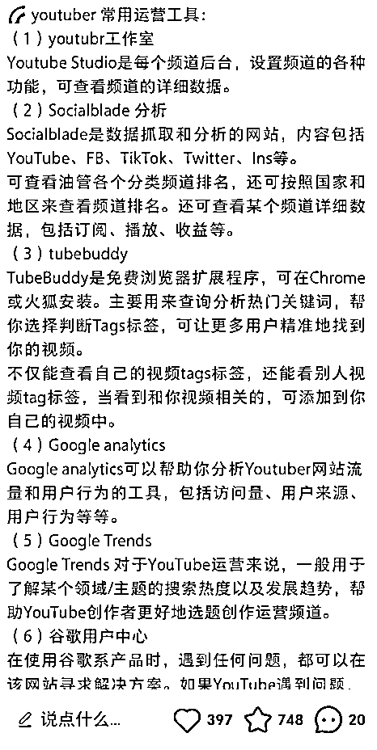
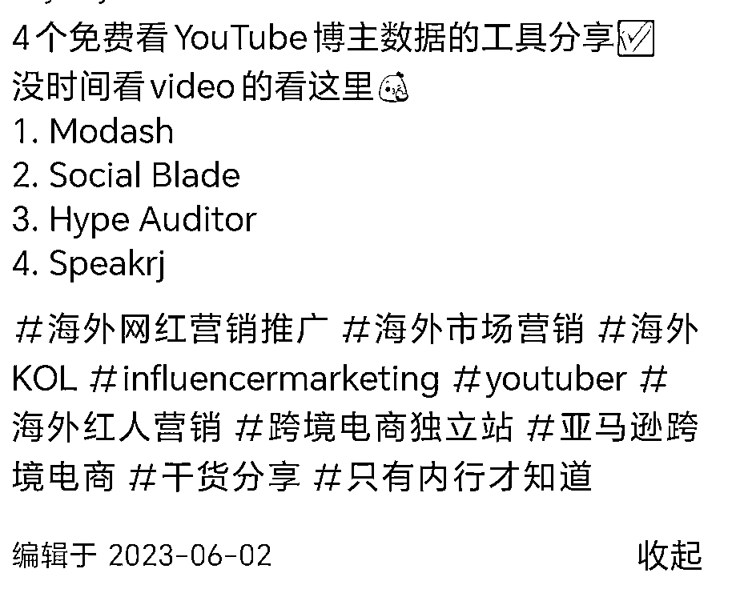
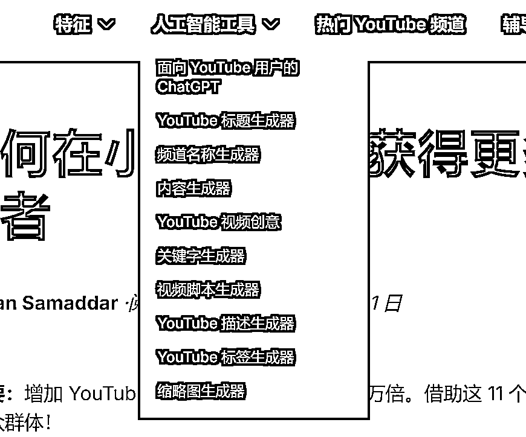
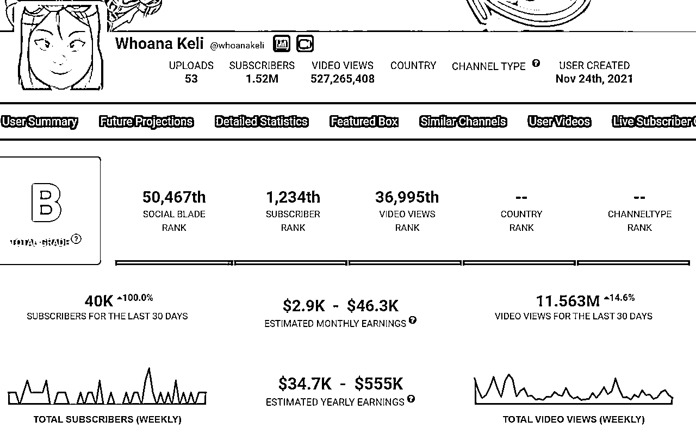
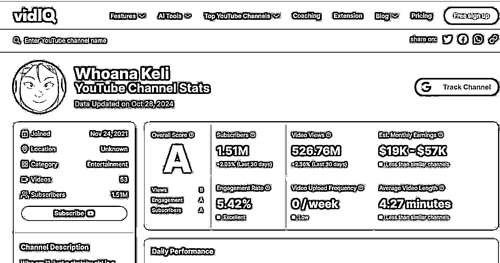
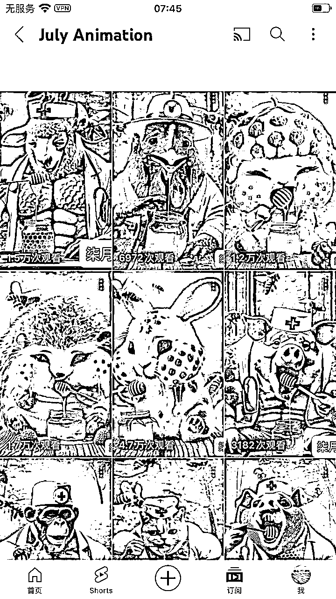
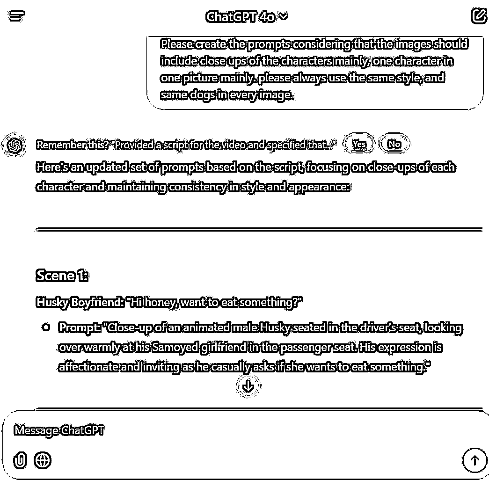
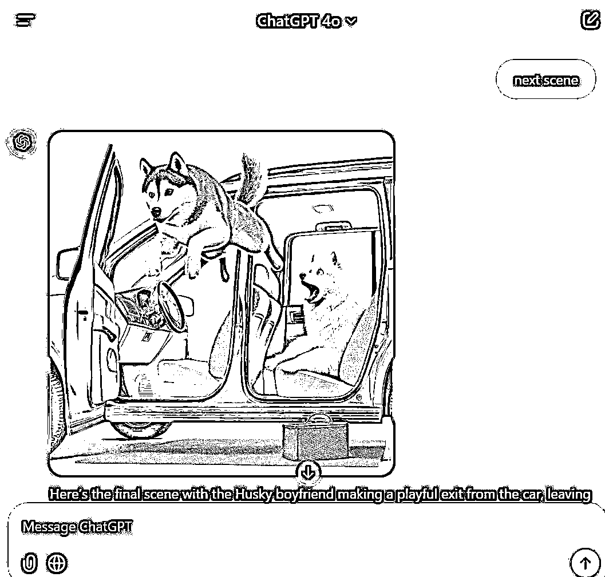

# 不懂技术和海外赛道纯小白还能入场Youtube shorts嘛？

> 来源：[https://l044qeztyn5.feishu.cn/docx/TwxjdxjYUobbX7xhE5zcniUpndc](https://l044qeztyn5.feishu.cn/docx/TwxjdxjYUobbX7xhE5zcniUpndc)

# 一、什么是Youtube shorts

YouTube Shorts是YouTube推出的一种短视频格式，旨在与TikTok等短视频平台竞争。自2021年9月全球发布以来，YouTube Shorts快速获得了广泛关注，成为内容创作者展示创意和吸引观众的全新渠道。

#### YouTube Shorts的赚钱模式

YouTube Shorts的盈利方式主要有四种：

YouTube合作伙伴计划（YPP）：

*   通过YPP，创作者可以在视频中自动安排广告。要加入YPP，创作者需要在过去90天内达到1000名订阅者和1000万次公开观看。

*   通过这种方式，创作者可以获得广告收入，具体计算方式为： 广告收入=RPM×1000播放量

#### RPM的影响因素

影响RPM（每千次观看收入）的因素主要包括观众的人群收入和所在地区。

一般来说，离钱越近的赛道（如投资、金融、理财、房产、商业）RPM越高，尤其是在美国市场，这些领域的观众对广告的接受度和购买意愿更强，同时体育、名人八卦和犯罪案件等内容在美国尤为受欢迎，其RPM通常高于其他国家或地区。

*   业配

*   根据广告厂商需求定制视频，这种方式受市场需求和广告位明确性影响较大，同时针对高价值受众（如电商、理财和创业领域），能带来更高的收益。类似于在国内发“恰饭视频”或在视频中插入贴片广告

*   联盟营销和带货团购

*   也就是像在国内发短视频挂链接，但需符合一定条件（如：加入YouTube合作伙伴计划、达到10k订阅者、目标市场在美国、韩国或印度尼西亚，并且内容不面向儿童）。

*   每个视频最多可以上30件商品链接，极大增加了变现潜力。

*   销售产品

创作者还可以通过独立站点销售商品，直接在视频主页或评论中插入链接，相对于直接站外导流了。

# 二、如何快速入场

## 1.首先明确变现路径

首先想清楚变现路径，我的目的很明确就是通过YYP计划赚钱，那么我直接吸引到足够多的泛流量就可以

如果是想通过其他的定制化广告或者带货的话，那就要非常注意自己在视频里面是否留出了足够多的广告位，定位的受众人群消费能力是否足够强

## 2.培养“网感”

个人认为做一个账号的第一步，就是先建立起自己对账号的感觉，一方面就是了解当下趋势下用户的喜好，最典型的就是大家目前更喜欢摆烂还是鼓励上进，更喜欢看悲剧内容还是治愈系内容，另一方面培养自己对选题的洞察力，因为看到了之后就知道有哪些方向的选题是很戳用户的痛点，不论标题形式如何，都非常容易发一篇爆一篇，就是所谓“网感”

## 3.找到数据分析工具

前人栽树，后人乘凉。由于之前没有接触过国外的视频赛道，所以我先在社交平台上搜集信息，基本上就会发现已经有人栽好树啦，当然直接去问gpt也是个不错的选择，在小红书一搜就搜到了合集如下：

发现数据分析工具其实还是蛮多的，刚开始第一眼看到的是tubebuddy，但是个人感觉不太好用，本来以为是个人问题，但是在脸书上一搜这个官方账号也一年多没有更新了，估计运营组也不太行了，于是马上又换了SocialBlade和VidIQ试试，基本上可以把博主的更新和账号的基本的收入情况展现出来，因为VidIQ是专门分析Youtube的网址，有很多内容制作，关键词筛选的AI工具，功能比较完善，就还是使用VidIQ啦

SocialBlade

vidIQ

当然第三方工具还是有一定限制，如果更精确的数据，最好还是会用Youtube API工具或者是RPA采集，肯定是效率更更更高的，but因为我还是纯小白，没有学过代码，所以就先手搓啦，然后发现只要想做，手搓速度也没有辣么辣么慢

## 4.找到适合自己的赛道

目前在Youtube扶持shorts阶段，如果不考虑之后的接广带货或者销售自己的产品，那么可复制性强，生产时间成本低，可批量生产的具有爆款潜质的视频内容就是普通人快速在Youtube搞到钱相对容易的路径

但是最重要的就是我能创作出我能够踮脚够到视频内容，对绘画要求高，更加专业的动漫制作，以及后期没有办法矩阵化制作的账号，就会被我Pass掉，秉持着以上原则我找到了以下这些潜在的可以对标的账号，然后发现很多AI账号很对我的胃口，并且不少视频内容跑出百万浏览的量级，重复的选题发过一遍之后，稍微改改prompt重新发一遍还是爆，如果发现是低粉爆文那就更好了，直接对标视频的内容

就收集的账号数据发现，有一些AI创作账号，9月才开始发布视频，在小几百的粉丝量，大部分视频数据浏览量超过一万+，而基本上都是由AI生产，甚至没有变化太多prompt关键词

比如说这个频道，基本上背景和画面都没有太大的变化，唯一的改变就是关于小动物的prmopt，目前只有三百粉，但是视频数据很多在一万以上:

所以结合数据工具和手搓

挑选出近期发布视频发布频率高（意味着收益可能还不错，作者有动力更得更加勤快）

近三个月浏览量较稳定数据表现不错的账号（看粉丝和流量之比，还有近期作品流量之间的对比）；

最近涨粉多的视频（最好是今年下半年才开始做，而低粉翻倍增长）

最后筛选出了二十个账号作为我的潜在对标账号，兴致勃勃地记录了视频数据正准备复刻的时候，突然发现这些账号最近一些内容（不包括几小时前发布的内容）比如3天前和10天前发布的作品流量反差强烈，突然断崖式下跌的没有流量了，原本一般视频有几万观看掉到几千，原本有大几千掉到几百，然后就要尽量避开这些内容，有可能是同质化太严重了，观众不爱看了，有可能是平台觉得内容同质化太严重了，想打压。

筛选可对标部分账号：

在AI绘画赛道里面，十月份之前的很火的喵喵AI剧情视频在十月之后甚至有博主出现了浏览量少了将近90%情况，估计大家现在听到“Meow Meow~”背景音乐都想吐了，我才听了三天就已经想吐了，尤其很多喵喵视频为了吸引眼球，有“虐、惨，血腥”内容画面，部分可能也是因此被平台打压了，大概刷到了二十多个喵喵账号数据近半个月都降得非常严重

但是剧情走向较淡的可小动物的治愈系视频，以及笑点密集梗贴近生活的视频，保持得还不错，所以果然还是内容为王...

最后我还是选择了AI FurReal 这个作为我起号对标账号，模仿它有一两万流量的内容也就是低粉爆款内容（也可以找有音乐节奏卡点强的更容易火)

# 三、开干

作图直接gpt 4o就够了，做视频的话感觉runway用下来还是最顺手的，然后就开干！

因为这几天刚好有点事，在路上奔波，信号巨不稳定，根本带不动runway，但是遵循三天内不干就永远懒得再干的规律，于是这三天就用gpt4o+剪映做出来了一条视频先发了再说！

参考我刚才的选定的对标账号的对话节奏，我让gpt帮我想了个差不多的脚本以及让它帮我把图也画出来，但是感觉：

然后用剪映配音最后比较粗糙地做了一个视频（参考了圈友们之前发的关键词，如果想自己找高频关键词的话可以用，VidIQ试试看，然后打在Tag里面，然后第一篇Youtube的shorts就产生啦（浅浅期待一下流量情况，虽然心里清楚正常来说不干他个一个月没反馈是正常，有反馈是幸运）

# 一点想说的话

作为一个纯纯小白，之前确实没有接触过这个赛道，但是真正做之后发现确实没有想象中那么复杂，感觉我之前每做一个项目，做完之后都是觉得其实比想象中简单多了，所有的局限都是自设的，当然如果想做大的话，还是需要努力多学习一些技术（不会代码和提效工具，确实还是很影响赚钱速度的，在学了在学了...）

顺便给大家附上一些在VidIQ数据平台（真的，VidIQ给我打钱！！）看到的Youtube如何运营好一个好的账号的相关内容，感觉放到现在还是很有参考意义：

《根据观众评价，YouTube上47个最佳细分市场》 https://vidiq.com/blog/post/best-youtube-niches/

还有一篇昨天刚出新鲜热乎的《如何在小型频道上获得更多 YouTube 订阅者》https://vidiq.com/blog/post/get-more-youtube-subscribers-small-channel/?_gl=1*1o0ghow*_gcl_au*NDc3MDcyNDQwLjE3MzAzNzAyNTA.*_ga*MTE5MzM5NDY1Mi4xNzMwMzcwMjU1*_ga_EVDXLQBZQW*MTczMDQ1Nzk2NC42LjEuMTczMDQ1Nzk3MS41My4wLjgyOTU4MzcwMQ..