# 得物好物变现项目 2.0

> 来源：[https://p03a4vs9s2.feishu.cn/docx/Q6uAdIriOoihKVx589scP8ySnbb](https://p03a4vs9s2.feishu.cn/docx/Q6uAdIriOoihKVx589scP8ySnbb)

哈喽，我是叁斤，95后自由职业丨小红书操盘手，距离上一次分享 ，已经过去一年了，这段时间，得物发生了很多改变，之前分享的：互粉涨粉、搬运涨粉，已经不适用了

一直没更新得物相关的帖子，一方面原因是得物并非我主业，属于附带收益，我的主业是小红书赛道，同步笔记到得物，产生的收益，之前分享很多帖子都写的小红书

另一方面，是第一份帖子被很多人拿去做成了课程（很生气但没办法），写的细了，被人盗去做课程赚钱（还不分我钱！！），写的不落地，又有引流嫌疑，且对你们没用，就很纠结，一直没更

为啥现在又更新了？因为我想明白了，不能因为一颗老鼠屎，坏了一锅汤。确实有很多人跟我反馈，按第一篇帖子去实操都赚到钱了，我觉得挺有成就感

所以我又来更新了，就啰嗦到这

# 目录：

1.  了解得物平台及赛道

1.  为什么要做得物好物分享？

1.  如何搭建得物账号？

1.  怎么做一个能赚钱的得物账号？

# 了解得物平台及赛道

得物，原名“毒”，专注运动鞋购买和转售的平台，后增加：服装、数码、配饰等多领域

目前的月活已经有 1 个亿了，属于综合性潮流电商平台，与小红书、抖音等都不同，小红书和抖音属于内容平台

平台比较热门的接广告赛道包括：

*   服装

*   美妆个护

*   3C数码

*   配件

*   箱包

*   手表

*   鞋

*   家居

*   食品饮料

*   其他……

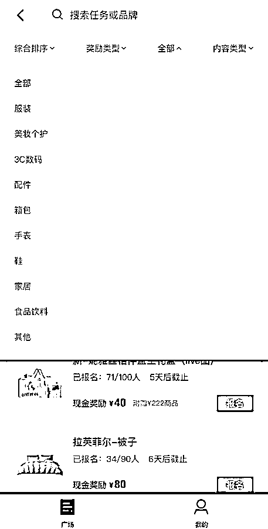

以上赛道是平台商单现在的分布情况，可能会随着平台发展而增加

如果考虑接广告变现的话，可以选择其中一个赛道做，也可以做赛道组合，如：服装 + 手表

# 为什么要做得物好物分享？

## 建议你做得物的 5 个理由

为了说服你做得物，专门列了5个理由，但后面无广，放心食用

1.  竞争小

虽然去年分享帖子后，有很多人开始做得物。但目前来看，得物平台的创作者依然不算多，大佬还看不上这平台

而且变现门槛真的很低，0粉就可以变现了，接商单也只需要100粉

1.  变现直接

得物本身是电商平台，是允许创作者打广告的，这方面比小红书可好太多了

而且里面的产品客单价都很高，商家有利润空间，广告力度自然就比较大

最重要是，变现方式比小红书丰富很多

1.  流量大

得物创作者不多，同时又在往“社区电商”的方向发展，所以给内容分配的流量比较大

但分配算法暂时不明确，新号有时流量很小，需要坚持更新

1.  时间自由

下班在家就可以拍产品，对场景要求不高，一个书桌一块布就能拍了

有很多产品直接在室外都可以拍

如果做视频变现，甚至不需要拍摄，剪辑视频就可以

1.  得物 0 元购

0粉可以参加免单活动，报名活动通过后，按要求发布笔记就可以免费领取对应产品

报名难度和笔记要求都不高，4图100字就可以了

0元购流程：（所有图片都加了防盗水印，可能影响阅读体验，但真被偷怕了）

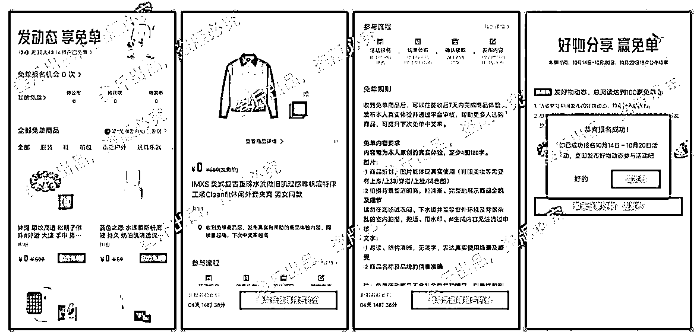

1.  先选择感兴趣的商品报名

1.  报名通过后，获得“免单”资格

1.  领取“免单”产品

1.  体验产品并发布内容

再刺激一下你们，放一些收益情况：

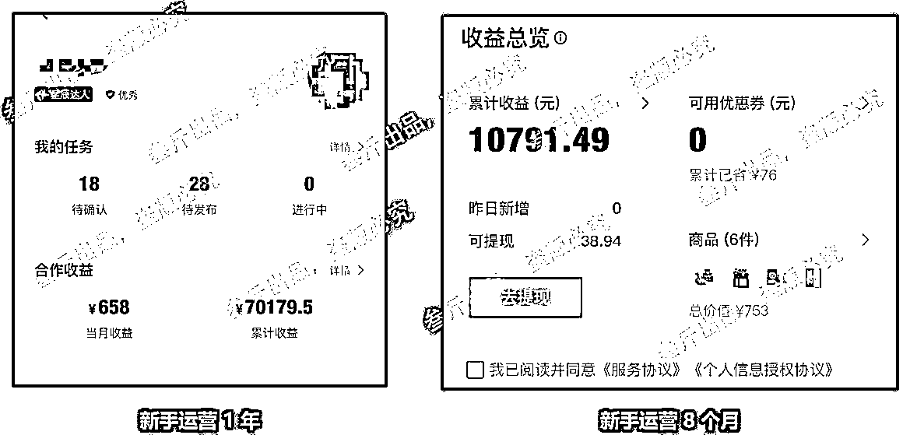

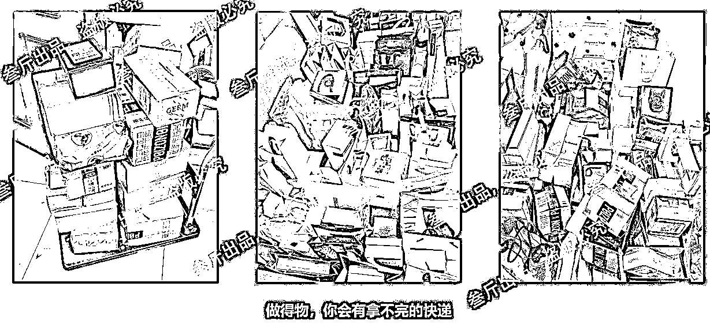

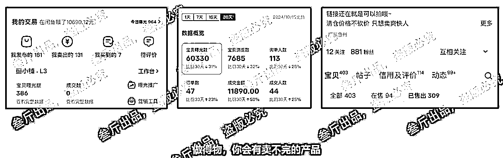

## 得物变现方式

### 品牌合作

小红书的品牌合作需要1000粉以上开通蒲公英，得物只需要100粉丝，就能开通好物分享官

在引力平台就能接

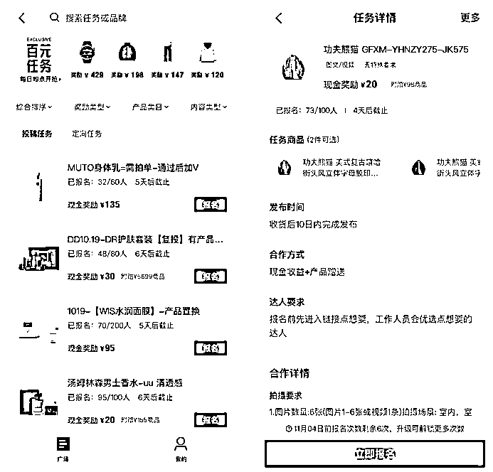

### 种草赏金

没有粉丝要求，0粉可以开通，发布笔记时带上链接，有人购买就有佣金

### 视频激励

0粉可以发布视频，按要求发布后可以申请开通视频号

视频号审核通过后，可以开通视频激励，发视频可以获得收益

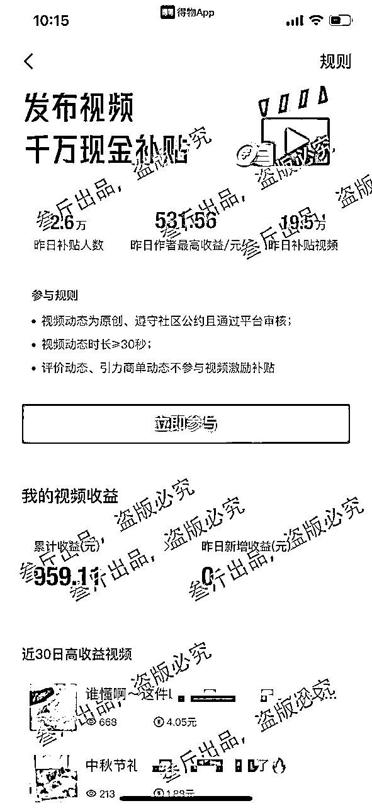

## 适合谁做？

做得物虽然不难，但也有几个基本要求：

1.  有基础审美

知道什么是好看的，并且知道得物的用户喜欢看什么

需要多花时间研究平台用户喜好，虽然跟小红书用户重叠度很高，毕竟平台不同，用户喜好不完全一样

1.  会基本拍摄技巧或者视频基础

得物的大部分稳定的变现方式都需要实拍，需要拍摄商家的产品，所以基本拍摄技巧是要懂得，虽然难度不大

如果要赚视频收益，至少需要会视频剪辑

1.  有时间，能坚持

做得物好物分享，每天至少有2个小时以上的时间，需要拍摄产品和修图，同时需要长期坚持

平台不同，得物的新手起步有点艰难

最后就是坚持

去年分享得物到现在，所有平台加起来，有一万多人看过，但真正坚持到现在的可能不到100个

1.  个人觉得，女生更适合

有很多护肤品、包包，都是女生领的，男生的东西相对少一些

潮男也可以，很多衣服、手表和鞋子

# 怎么搭建得物账号

## 提前准备：

1.  一部手机

能正常拍摄，像素清晰，iphoneX以上最好

同时能正常运营得物app，不能太卡（有些有费用的报名需要准时准点抢）

1.  实名认证

所有变现方式都要实名认证，提现账号需要对应实名认证本人账号

如果需要矩阵操作，需要跟实名认证的人沟通好，最好是自己或者家人的身份证

1.  拍摄角落

一个光线好的拍摄角落，可以是窗台、书桌一角都可以

我的拍摄环境也很简陋：

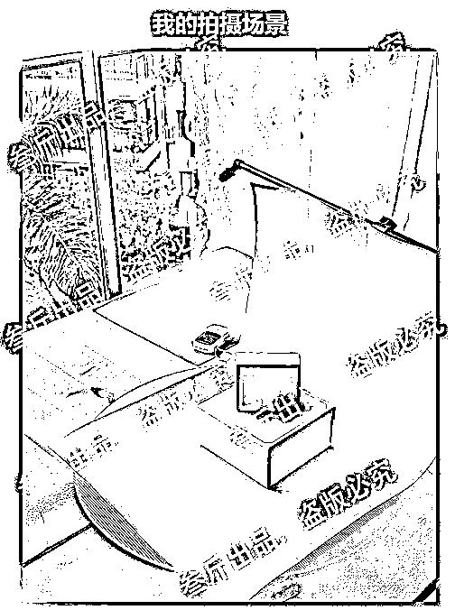

## 账号定位

得物对账号运营要求不高，比如账号定位，只要包含以下2点就足够了：

1.  选择自己感兴趣/擅长的赛道

1.  在服装、3c电子、配饰等选择自己喜欢的

1.  离钱近的定位

1.  比如，跟小红书一样的好物种草、好物开箱、测评等等

## 头像设置

可以使用真人头像（可以真人 AI 画像代替）

头像形象要与账号本身调性符合

真人头像比画像更好，画像又比网图更好

## 昵称

1.  与定位符合的昵称，比如：昵称+身份（搭配师小张），记得不要有生僻字

1.  取一个方便粉丝记住你身份的昵称，可以降低传播成本。比如你希望别人喊你X哥，X姐，那你昵称可以设置为“X哥带你XX”之类的

1.  直接在昵称上体现账号价值，比如，叁斤的穿搭日记

## 简介

1.  一般写与人设定位相关的身份&领域&专业就可以了

1.  如果做的是穿搭、好物分享和美食等，也可以也可以显得幽默一点：

1.  干啥啥不行，干饭第一名。著名奶茶品鉴专家。头距地球表面153cm

1.  没有强专业化知识的时候，成长型IP和简介也很适合

1.  比如：接受自己的普通，一起全力以赴变美变出众

## 选题&内容

从小红书找，做什么赛道就找什么赛道

然后对着小红书笔记一比一模仿拍摄

## 标题

在取标题前，搜索同选题的爆款笔记，并找5～10个爆款标题放到excel表

🌰举个例子

想分享连帽卫衣，搜索卫衣相关爆款笔记并收集爆款标题

1.  快看！！这可是今年很🔥的白灰色卫衣！

1.  这件卫衣我简直爱了！上身太绝了～

1.  好喜欢美式复古bm穿搭！复古又可爱～

1.  秋冬的衣柜一定要有的连帽卫衣！

1.  54💰冲下这件燕麦色刺绣连帽卫衣平替‼️

收集到这些标题后，会逐个拆解关键词

1.  拆解标题

1、快看！！这可是今年很🔥的白灰色卫衣！

可拆解为“快看”、“今年很🔥”这两个关键词，关键词可以迁移到其他标题使用，并可把“白灰卫衣”替换成其它

2、这件卫衣我简直爱了！上身太绝了～

可拆解为“我简直爱了”“上身太绝了”，这两个关键词可迁移，如果使用后一个关键词，需要搭配上身图片

3、好喜欢美式复古bm穿搭！复古又可爱～

关键词可拆解“好喜欢”“美式复古”“bm穿搭”，这几个都是可以迁移的大关键词，标题比较平，可以选择性模仿

4、秋冬的衣柜一定要有的连帽卫衣！

关键词可拆解“秋冬的衣柜”“一定要有”“连帽卫衣”，这个标题的关键词不好迁移，都是连成句子的，可以选择性使用

5、54💰冲下这件燕麦色刺绣连帽卫衣平替‼️

可通用的关键词“xx💰（金额）”“冲下xx”“平替”，标题主打低价、平替，所以如果低价款产品可以复用标题，把产品词换成自己的

1.  重写标题

标题拆解完后，会重写几个标题，再选其一使用

1.  快看！xx💰冲下今年很🔥的xx卫衣

1.  今年很🔥的bm穿搭！上身太绝了！

1.  美式复古卫衣我简直爱了！

1.  好喜欢xx卫衣！秋冬衣柜一定要有！

1.  秋冬衣柜一定要有的xx卫衣！

这样模仿下来，就有几个标题可选，如果使用第一个标题不火，可以在原笔记的基础上修改，换另一个标题

## 封面建议

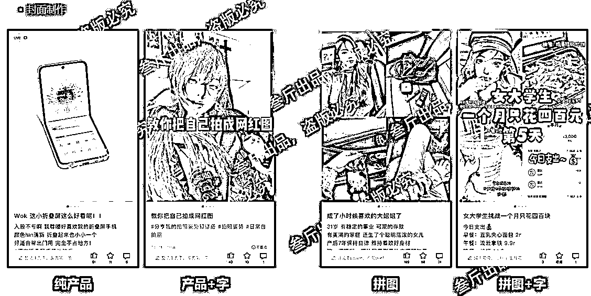

最后，得物如果需要更深入写内容，可以看这篇小红书运营方法，内容制作部分一样的：

# 如何做一个能赚钱的得物账号

## 品牌合作

1.  品牌合作分类

投稿合作：100粉可以开通好物分享官，在接单广场主动报名，商家通过后可以合作

定向合作：500粉开通专业达人，LV3以上，可以开通，自己设置图文、视频报价，商家报名合作

投稿合作：

定向合作和百元任务：

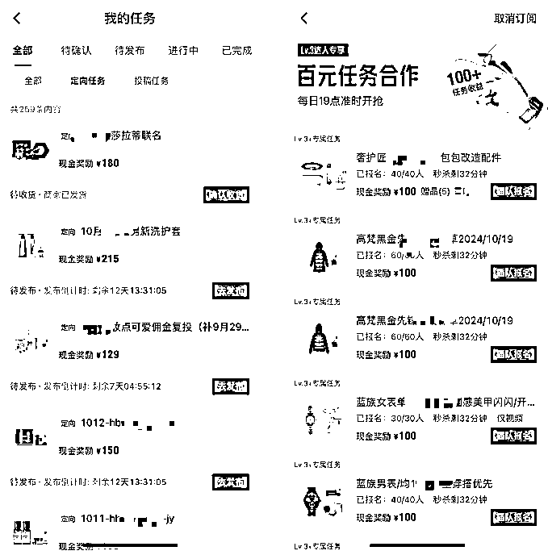

百元任务，是LV3的达人专属，每天7点准时开启报名，通过率较高

1.  怎么提升报名通过率

报名后，主动添加商家联系方式，发主页给商家

多加商家，有些商家有群，会在群里内定博主

1.  如何快速提升到100粉？

以下这几种类型，多更新，都很快突破100粉：

1.  小号互粉（高风险）

1.  多发产品合集：在一篇笔记中多展示几个产品

1.  明星同款产品：如下图最右边，左边放明星，右边放同款穿搭

1.  娱乐营销号

1.  影视号

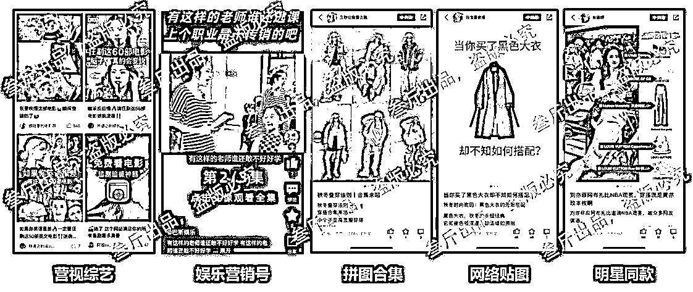

## 怎么赚种草赏金？

发笔记带上产品链接，引导购买成功，即可获得分佣

但有几个基本要求：

1.  产品在平台内售卖，站外无效

1.  内容必须带商品卡

1.  引力合作不支持种草赏金（商家合作跟种草赏金互相冲突）

1.  搬运、剽窃等，包括直接用官方截图的，都无法获得种草赏金

1.  4 图百字图文和视频≥30s，更容易获得赏金

## 怎么赚视频收益

发布原创视频，申请视频号通过审核后，再发布视频可获得的视频奖励

也有几个要求：

1.  发布20秒以上视频≥5个，且20秒以上视频总阅读量＞1000

1.  平台鼓励品类相关的视频：鞋靴、美食、家居、游戏、影视综艺等

1.  评价、引力商单不参与视频激励补贴

## 怎么提升收入天花板

之所以得物不是我的核心项目，是因为收入天花板确实不高

我没办法放大到5个号以上的矩阵，身份证实名有限，且每个号平均每个月只能带来小几千的收入

所以我也一直在考虑怎么提升天花板，目前有 2 个是比较好的方向：

1.  闲鱼卖掉多余产品

得物好处就是能领取很多大牌的产品，这些产品都很值钱

自己不需要的产品，可以挂闲鱼卖掉，这部分收入也不少，有时一个月能买个小一万块

1.  内容同步小红书

只要做了图文笔记，就可以把内容同步到小红书，先不管有没有流量，内容做了就别浪费

以上，得物最难的是起步阶段

只要涨粉够了，拍摄水平不算很差的情况下，基本都不愁接商单

比小红书接商单更简单