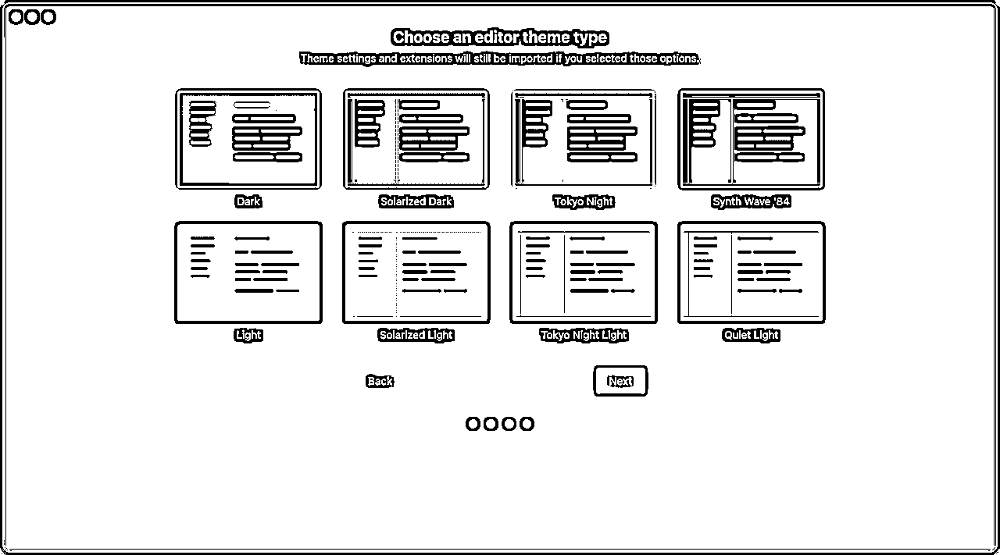
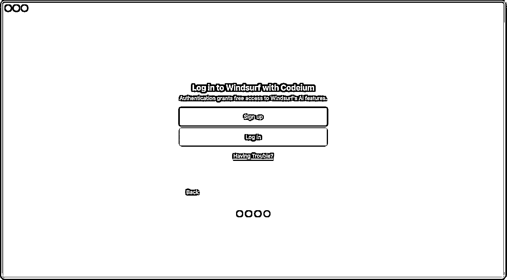
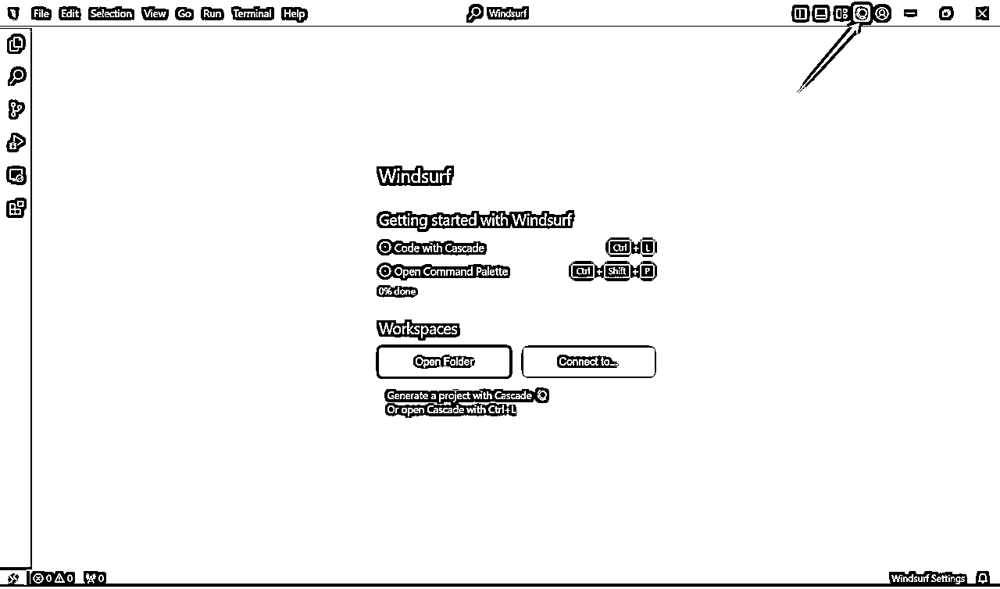
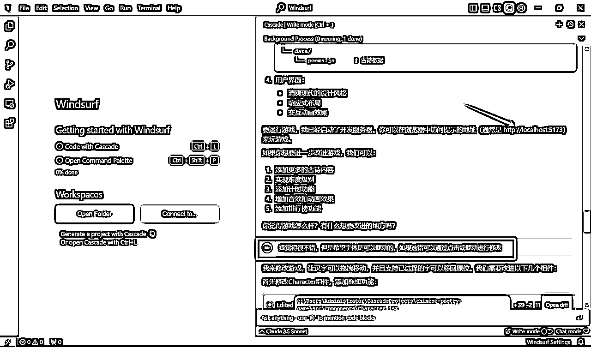
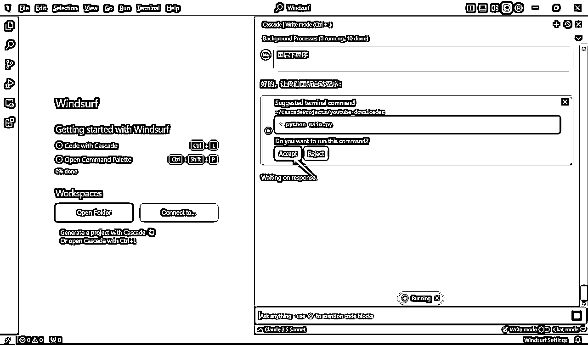
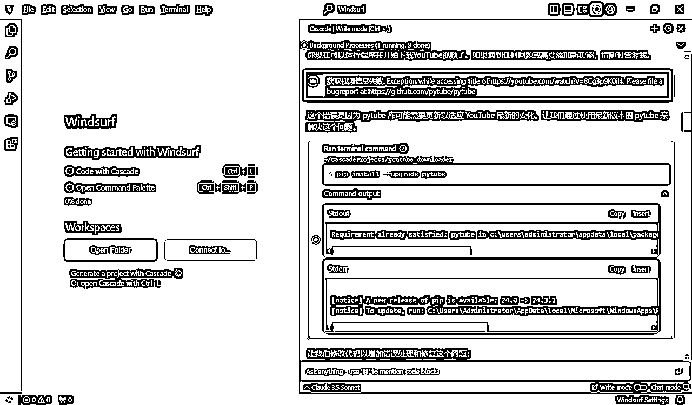
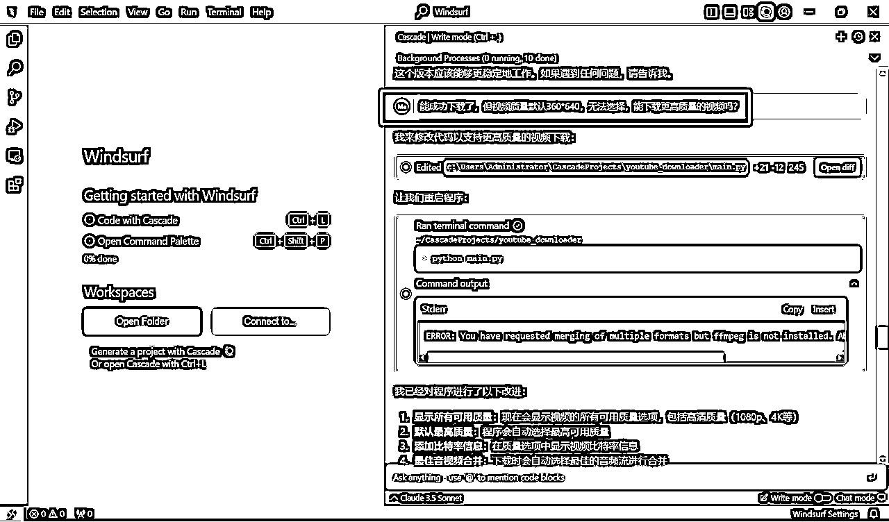
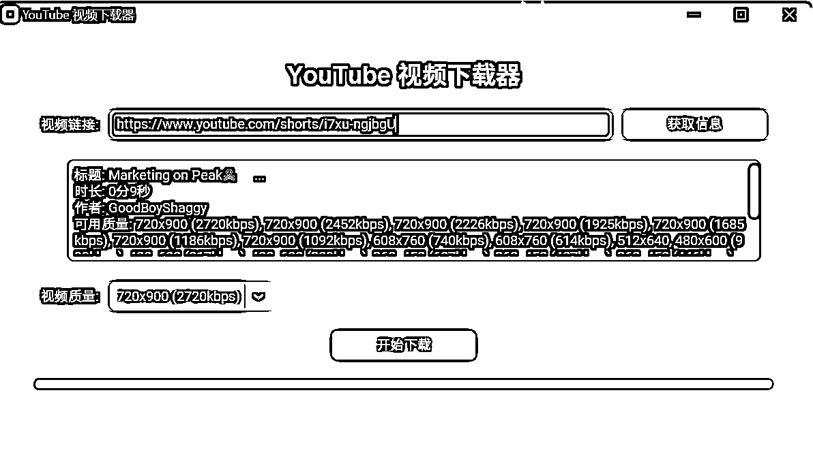

# 纯小白0代码用Windsurf制作Youtube下载工具

> 来源：[https://utwva86nom.feishu.cn/docx/QLz8dO9aToc3p6xsR2tc9T8inGg](https://utwva86nom.feishu.cn/docx/QLz8dO9aToc3p6xsR2tc9T8inGg)

大家好，我是雪梨，一个没有行动力的骨灰级潜水小透明。（生财第一年我就在了。今天第一次发帖(￣ε(#￣)）

最近看到亦仁老大发的超级标，对Youtube跃跃欲试，也尝试发了两条视频。但是下载对标视频实在是个坎，试了几个网站不是用不了，就是广告N多点下载还会报病毒，又或者是要会员才能下载高像素。

也萌生起自己编程的想法。

昨天对着阿紫大佬的帖子【生财技能】如何让吴佳文学会用cursor完成一个复杂项目研究了半天，只打通了第一关，把做了个贪吃蛇小游戏，第二关古诗划字就懵圈了...

对着教程看还是没做出了，看来我是没啥编程天赋的。

不行，总是要试试的，不能一直卡在起跑线，看看圈子里有没有其他更初级一些的cursor帖子吧。再不行就12月航海跟大佬们学习。

于是，拜读了

红哥的我是如何用Cursor从0到1做出来YouTube视频下载工具的

钱塘江鲤大佬的借助Cursor与AI实现YouTube Shorts高效自动化运营流程

......

大佬们都很厉害，牛！！！！！

直到看到下面这两条风向标

自动运行，自动纠错！！！

看到这8个字眼前一亮！！！天知道我在用cursor的时候新建、复制粘贴、运行代码有多痛苦。

但是搜遍了也只有这两个风向标没有相关的教程.....下载来试试吧，万一能搞定呢？

### Windsurf下载

https://codeium.com/windsurf/download

全英界面......又一个大难关，英语+编程，双重看不懂呀

但正常下载安装还是懂的，装了再说，万一有中文补丁呢

### 首次运行

安装好后开始首次运营，然后开始傻瓜式的哪里亮点哪里

也不知道有没有选错，下面是我的选择

选了第二个Start fresh

选了第一个Default (VS Code)

这个选主题，随意，第一个

登录注册，sign up，弹出了个网页，我用谷歌账号登录了

### 开始提问吧

以上步骤完成后，就进入到了这个界面

搜language想改成中文，出来全是XX编程语言

在设置里找也没有

试着像cursor里找中文补丁也没有

啊啊啊啊！！不可能每一步都截图翻译吧，还是用回cursor，至少有教程看

还好最后灵光一闪，cursor右上角有对话框，这个也找来试试？

这看起来是个对话入口，然后我发出了第一句中文。

我想做一个在网页上运行的程序，他是一个关于古诗的划字连词游戏，游戏玩法是将一首诗的所有汉字打散，玩家需要正确的将汉字连接在一起，你认为适合用什么技术来完成它？请给出一个你最推荐的技术以及对应的脚手架。（没错就是阿紫大佬的教程）

哇塞，是我看得懂的，计划通！！

但在我已经拷好阿紫教程的第二段话，准备发出的时候

它说创建好项目，安装好必要依赖了！！！

接下来，对方哗啦啦一顿输出，直接甩出个网址给我 http://localhost:5173

并非常豪气地说了句，你觉得游戏怎么样？有什么想要改进的地方吗？

没错，我的第二句话就是对这个游戏的修改意见了！！！

这也太太太太太智能了吧！！！

不用复制粘贴，不用新建文件，不用win+r打开.....

只要很简单的哪里亮点哪里，按个accept

菜鸟救星啊啊啊啊啊啊！！！

### 挑战YouTube下载

于是我立马把YouTube视频下载工具搬上日程。

（本来是想做一个网页插件的，但失败了，报错了很多次都没有成功，这个过程就不展示了）

参考红哥的我是如何用Cursor从0到1做出来YouTube视频下载工具的。

搜了个能下载YouTube视频的网站（但要会员才能下载高质量视频），发给Windsurf做参考

同样哗啦啦一顿输出

然后有个accept亮了，按一下，弹出个窗口。

拿个视频测试下，报错，把错误信息发回给

重复了5个回合

成了！

但视频质量固定360，再提个需求

完美！！

视频质量随意选~~

从安装windsurf到做出Youtuber下载器

加起来不到2个小时，还有一大半时间是用来找中文补丁以及那个失败的插件的

整个编程过程写了不到200个字

windsurf输出的内容全都看不懂

但做出来了成就感满满！！！

还好没放弃！！！！

### 中文补丁找到了

感谢NEVER~

最后，感谢各位大佬！

### 更新

看到大家的评论，发现部分同学一直跳不出bug，可以参考下这个（我用的是windows）：

要求分享参考网址的下载方式

成功跳出啦~